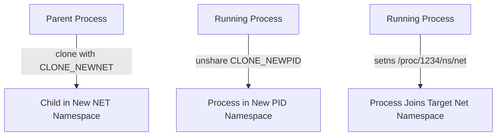
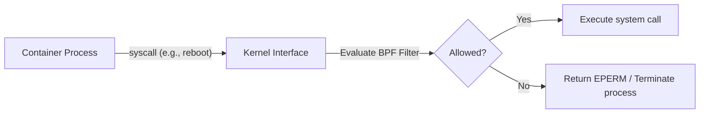
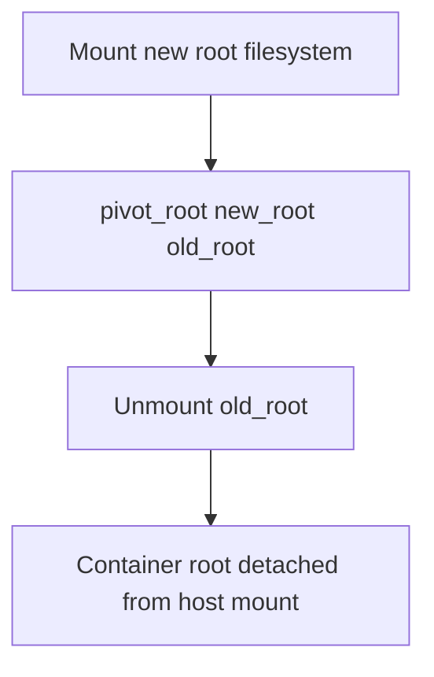
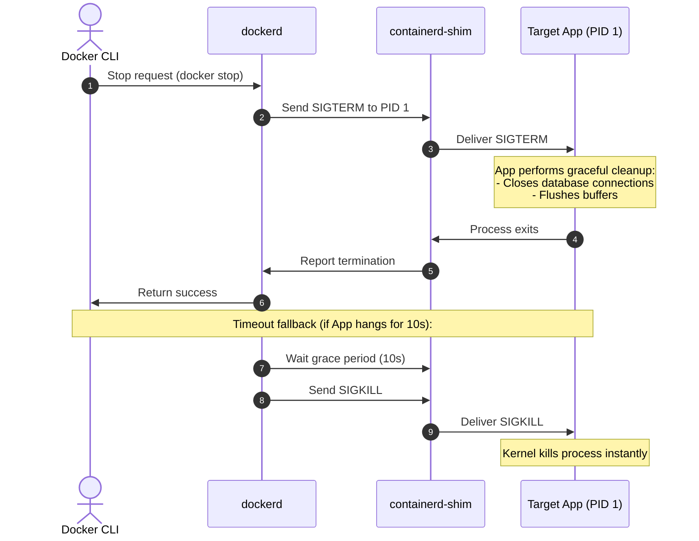
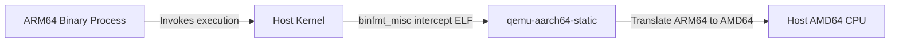
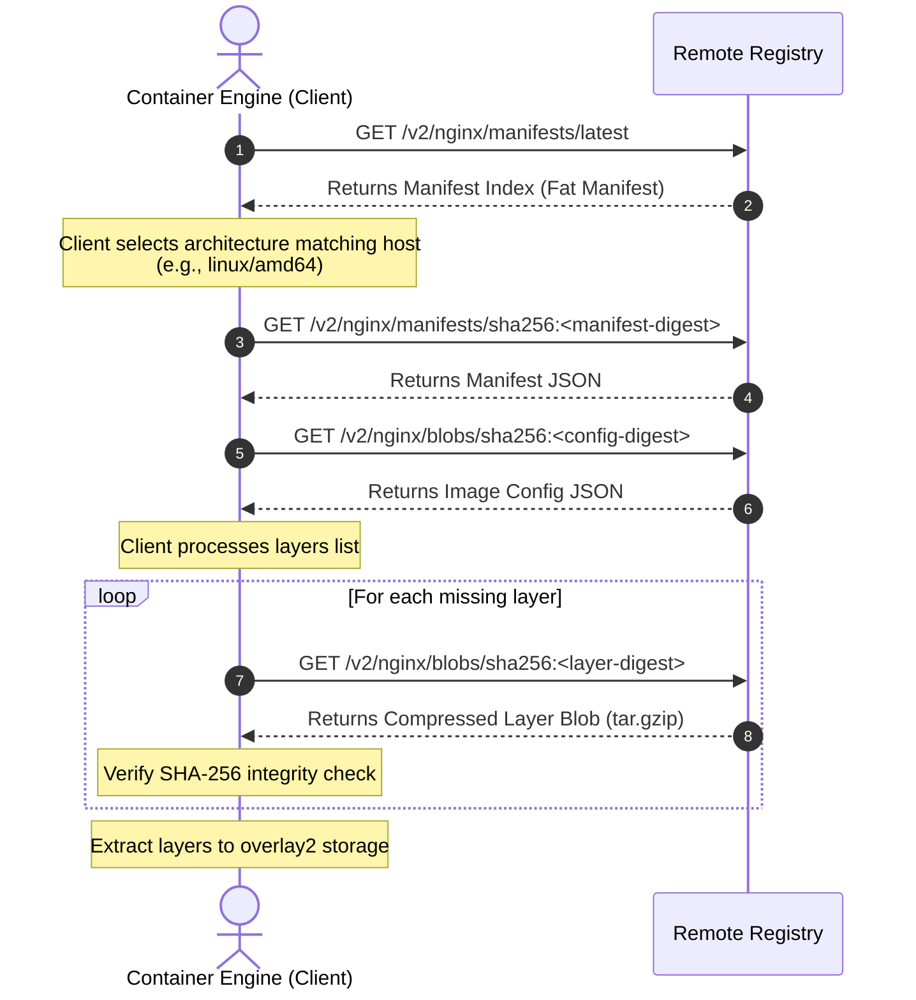
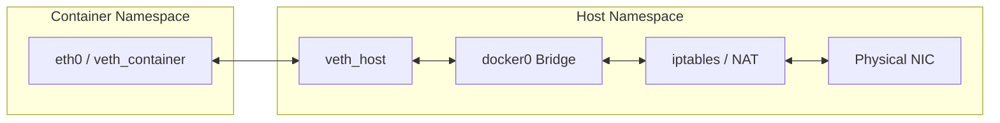
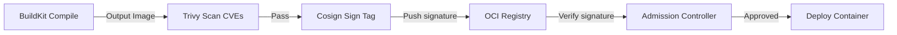

# The Docker Handbook: A Systems Engineer's Reference Guide
*An In-Depth, First-Principles Guide to Containerization, Linux Kernel Virtualization, and Host-Level Workload Isolation*

---

# Table of Contents
1. [Chapter 1: Introduction & Host-Level Virtualization](#chapter-1-introduction--host-level-virtualization)
2. [Chapter 2: Linux Namespaces & Process Visibility](#chapter-2-linux-namespaces--process-visibility)
3. [Chapter 3: Control Groups (cgroups) & Resource Limits](#chapter-3-control-groups-cgroups--resource-limits)
4. [Chapter 4: Capabilities & Privilege Restriction](#chapter-4-capabilities--privilege-restriction)
5. [Chapter 5: Seccomp Filters & System Call Interception](#chapter-5-seccomp-filters--system-call-interception)
6. [Chapter 6: User Namespaces & Rootless Containers](#chapter-6-user-namespaces--rootless-containers)
7. [Chapter 7: Directory Jails (chroot & pivot_root)](#chapter-7-directory-jails-chroot--pivot_root)
8. [Chapter 8: Linux Process Creation & Signal Propagation](#chapter-8-linux-process-creation--signal-propagation)
9. [Chapter 9: Docker Engine Architecture & Components](#chapter-9-docker-engine-architecture--components)
10. [Chapter 10: Lifecycle of Core Commands (Run, Exec, Stop)](#chapter-10-lifecycle-of-core-commands-run-exec-stop)
11. [Chapter 11: BuildKit Architecture & Compilation](#chapter-11-buildkit-architecture--compilation)
12. [Chapter 12: Multi-Architecture Build Pipelines](#chapter-12-multi-architecture-build-pipelines)
13. [Chapter 13: OCI Registry & Distribution Internals](#chapter-13-oci-registry--distribution-internals)
14. [Chapter 14: OverlayFS Mechanics & Copy-Up Cycles](#chapter-14-overlayfs-mechanics--copy-up-cycles)
15. [Chapter 15: Deep Linux Networking & DNS Redirection](#chapter-15-deep-linux-networking--dns-redirection)
16. [Chapter 16: OCI Container Runtime Ecosystem](#chapter-16-oci-container-runtime-ecosystem)
17. [Chapter 17: Container Memory Accounting & OOM Scoring](#chapter-17-container-memory-accounting--oom-scoring)
18. [Chapter 18: Container Observability, Tracing & eBPF](#chapter-18-container-observability-tracing--ebpf)
19. [Chapter 19: Container Supply Chain Security & SBOMs](#chapter-19-container-supply-chain-security--sboms)
20. [Chapter 20: Real-World Container Architecture Patterns](#chapter-20-real-world-container-architecture-patterns)
21. [Chapter 21: Docker Compose Internals & Ordering](#chapter-21-docker-compose-internals--ordering)
22. [Chapter 22: Container Failure Theory: How Docker Fails](#chapter-22-container-failure-theory-how-docker-fails)
23. [Chapter 23: Real-World Production Incident Reports](#chapter-23-real-world-production-incident-reports)
24. [Chapter 24: Docker Engine Source Code Roadmap](#chapter-24-docker-engine-source-code-roadmap)
25. [Chapter 25: Mental Models & Common Misconceptions](#chapter-25-mental-models--common-misconceptions)

---

# Chapter 1: Introduction & Host-Level Virtualization

### Purpose
This chapter introduces the concept of host-level virtualization, tracking containerization's evolution from legacy directory isolation to modern Open Container Initiative (OCI) systems.

### What You Will Learn
* How containerization differs from hardware-level hypervisors.
* The evolution of process isolation mechanisms in Unix and Linux.
* The architectural role of Docker in standardized software deployments.

---

## 1. Defining Containerization

### What It Is
Containerization is a host-level virtualization method that groups and executes processes inside isolated user-space environments.

### Why It Exists
Historically, deploying applications was highly coupled to host configurations (e.g., library versions, dependencies). Hardware-level virtual machines (VMs) decoupled application environments by introducing a hypervisor scheduler and guest OS, but incurred significant resource overhead:

```text
 ┌─────────────────────────────────┐       ┌─────────────────────────────────┐
 │   Virtual Machine Architecture  │       │     Container Architecture      │
 ├─────────────────────────────────┤       ├─────────────────────────────────┤
 │  ┌───────┐ ┌───────┐ ┌───────┐  │       │  ┌───────┐ ┌───────┐ ┌───────┐  │
 │  │ App A │ │ App B │ │ App C │  │       │  │ App A │ │ App B │ │ App C │  │
 │  ├───────┤ ├───────┤ ├───────┤  │       │  ├───────┤ ├───────┤ ├───────┤  │
 │  │ Guest │ │ Guest │ │ Guest │  │       │  │ Libs  │ │ Libs  │ │ Libs  │  │
 │  │  OS   │ │  OS   │ │  OS   │  │       │  └───────┘ └───────┘ └───────┘  │
 │  └───────┘ └───────┘ └───────┘  │       │  Isolated Namespaces & cgroups  │
 ├─────────────────────────────────┤       ├─────────────────────────────────┤
 │ Hypervisor (VMM)                │       │ Shared Host Operating System    │
 ├─────────────────────────────────┤       ├─────────────────────────────────┤
 │ Shared Host Operating System    │       │ Host Hardware Resources         │
 └─────────────────────────────────┘       └─────────────────────────────────┘
```

### How It Works
Instead of virtualizing hardware, containers run directly on the host kernel. The kernel restricts what a containerized process can **see** (using namespaces) and what it can **consume** (using cgroups).

### Internal Components
* **Host Kernel**: The single operating system kernel shared by all containers.
* **Isolation Primitives**: Kernel-level filters (namespaces, cgroups, capabilities, seccomp).
* **Control Plane**: User-space tools (like Docker Engine) that configure kernel isolation before executing the application process.

### Real World Example
A high-density web platform running 500 replicas of an API gateway on a single host. Under a VM model, this would require 500 guest operating systems and consume hundreds of gigabytes of RAM. Under a container model, it runs as 500 standard host processes, consuming minimal overhead.

### Common Mistakes
* Treating container filesystems as persistent storage. If a container is deleted, its writable layer is discarded; write-heavy application data must be mapped to storage volumes.

### Debugging Notes
* If a containerized process behaves differently on different hosts, check the kernel versions on both systems using `uname -a`. Bug fixes or changes in host kernel subsystems (like networking or OverlayFS drivers) will affect container execution.

### Production Notes
* Monitor system call invocation rates. If an application executes high frequencies of system calls (e.g., intensive socket polling or direct I/O), custom seccomp filters can introduce micro-latencies that degrade performance under heavy workloads.

---

### Key Takeaways
* Containers are standard host processes, not virtual machines.
* They share the host operating system kernel directly, avoiding hypervisor and guest OS overhead.
* Host-level isolation is configured in user space but enforced by kernel primitives.

### Production Notes
* Always align your target deploy node's kernel versions with staging environments to ensure kernel-level driver compatibility.

---

# Chapter 2: Linux Namespaces & Process Visibility

### Purpose
This chapter explains how namespaces virtualize host resources, isolating process visibility so that each container operates as if it possesses its own operating system instance.

### What You Will Learn
* The seven primary Linux namespaces used to isolate containers.
* The system calls (`clone`, `unshare`, `setns`) that manage namespaces.
* The CGo threading workaround required to join namespaces in Go-based runtimes.

---

## 1. Process ID Namespaces (PID)

### What It Is
The Process ID (PID) namespace virtualizes the process hierarchy, isolating process trees so that containers cannot see host or sibling processes.

### Why It Exists
On a standard Linux host, all processes exist within a single tree starting at PID 1. Without namespace isolation, containers could monitor, signal, or terminate other processes running on the shared host.

### How It Works
When a process is spawned inside a new PID namespace, it is assigned PID 1 within that namespace, acting as the root init process for the container. However, it still retains its host-level PID (e.g., PID `14050`) in the host's root namespace:

```text
Host PID Namespace
┌────────────────────────────────────────────────────────┐
│ PID 1: systemd (Host init)                             │
│  └─ PID 1024: containerd                               │
│      └─ PID 14050: nginx (Inside Container)            │
│                                                        │
│  Container PID Namespace                               │
│  ┌──────────────────────────────────────────────────┐  │
│  │ PID 1: nginx                                     │  │
│  └──────────────────────────────────────────────────┘  │
└────────────────────────────────────────────────────────┘
```

### Internal Components
* **`CLONE_NEWPID`**: The kernel flag passed to the `clone()` system call to instantiate a new PID namespace.
* **`/proc/<PID>/ns/pid`**: The file descriptor representing the process's PID namespace.

### Real World Example
Running `ps aux` inside a web server container returns only two running processes (the web server and the shell), while running the same command on the host lists hundreds of system processes, including the containerized web server under its host-assigned PID.

### Common Mistakes
* Running monitoring or diagnostic containers without sharing the host PID namespace. To monitor host processes from a container, you must run it with the `--pid=host` flag.

### Debugging Notes
* To inspect a container's processes from the host, identify the container's main PID using `docker inspect` and trace it using standard host debugging tools:
  ```bash
  ps -ef | grep <container_main_pid>
  ```

### Production Notes
* Ensure that the application running as PID 1 is designed to handle system signals and reap orphan child processes, or run the container with the `--init` flag to inject a lightweight init process.

---

## 2. Namespace Lifecycle System Calls

### What It Is
The Linux kernel exposes three system calls to create, join, or disassociate from namespaces.

### Why It Exists
Runtimes need interfaces to configure container sandboxes, attach helper processes (such as logging agents), or debug running containers.

### How It Works
* **`clone()`**: Spawns a new child process. If namespace flags (like `CLONE_NEWNET` or `CLONE_NEWPID`) are passed in the bitmask, the kernel creates new namespaces for the child process.
* **`unshare()`**: Disassociates the current process from its inherited namespaces, moving it into newly initialized namespaces.
* **`setns()`**: Attaches the calling thread to an existing namespace, allowing it to join the namespace of another process.



### Internal Components
* **`/proc/<PID>/ns/`**: A directory containing files (such as `net`, `pid`, `mnt`, `uts`, `ipc`, `user`) that represent the namespaces of the target process.

### Real World Example
When you run `docker exec -it <container_id> /bin/bash` to open a shell inside a running container, the runtime uses the `setns()` system call to move the shell process into the container's namespaces before starting it.

### Common Mistakes
* Attempting to call `setns()` from a multi-threaded process. The `setns()` system call requires the calling process to be single-threaded. Because the Go runtime initializes multi-threaded schedulers immediately upon startup, Go runtimes must execute `setns()` inside a CGo constructor that runs before the Go runtime is initialized.

### Debugging Notes
* You can manually enter a container's namespaces from the host using the `nsenter` utility:
  ```bash
  nsenter -t <container_pid> -m -u -i -n -p
  ```

### Production Notes
* Avoid using diagnostic tools inside the container image. Instead, use `nsenter` from the host to attach host-level debugging tools to the container's namespaces, keeping container images small and secure.

---

### Key Takeaways
* Namespaces isolate process visibility across seven system resource types.
* A containerized process occupies different PIDs inside the container and on the host.
* Runtimes use `setns()` to run new processes (like `docker exec`) inside existing container sandboxes.

### Production Notes
* Minimize container privilege boundaries by avoiding the use of `--net=host` or `--pid=host` flags unless required for system-level monitoring tools.

---

# Chapter 3: Control Groups (cgroups) & Resource Limits

### Purpose
This chapter explains how Control Groups (cgroups) limit and prioritize the system resources (CPU, Memory, Disk I/O, Network) that containers can consume.

### What You Will Learn
* The structural differences between cgroups v1 and cgroups v2.
* How Completely Fair Scheduler (CFS) quotas restrict CPU allocation.
* How to read and monitor resource limits from host cgroup directories.

---

## 1. Unified Hierarchy: cgroups v1 vs. cgroups v2

### What It Is
Control Groups (cgroups) allocate, restrict, and account for resource usage among groups of processes.

### Why It Exists
Without resource limits, a single misconfigured or compromised container could consume all host CPU, memory, or disk I/O, starving other workloads on the system.

### How It Works
* **cgroups v1 (Multi-Hierarchy)**: Each controller (CPU, memory, block I/O) operates as an independent tree. A process can occupy different nodes in different controller trees.
* **cgroups v2 (Unified Hierarchy)**: Standardized around a single, unified tree structure. A process belongs to exactly one node in the hierarchy, and controllers are enabled on subtrees:

```text
             Cgroups v1 (Multi-Hierarchy)
         ┌───────────────┬───────────────┐
         ▼               ▼               ▼
    /sys/fs/cgroup  /sys/fs/cgroup  /sys/fs/cgroup
        /cpu            /memory         /blkio
         │               │               │
      Group A         Group A         Group B

             Cgroups v2 (Unified Hierarchy)
                        ┌─ /sys/fs/cgroup
                        ▼
                     Group A
                  (cpu, memory, blkio enabled)
```

### Internal Components
* **`/sys/fs/cgroup/`**: The mount point of the cgroup virtual filesystem on the host.
* **`cgroup.procs`**: The file listing all process IDs assigned to a specific cgroup.
* **`cgroup.controllers`**: (cgroups v2) Lists the controllers enabled for a cgroup directory.

### Real World Example
In cgroups v2, memory limits and disk write throttling can be coordinated easily. This prevents systems from swapping pages inappropriately when high disk write activity triggers page cache flushes.

### Common Mistakes
* Writing custom monitoring scripts that assume a cgroups v1 path layout (`/sys/fs/cgroup/memory/docker/`) on hosts running modern Linux kernels that use cgroups v2 (`/sys/fs/cgroup/system.slice/docker-...`).

### Debugging Notes
* Determine which cgroup version your host is running by executing:
  ```bash
  stat -fc %T /sys/fs/cgroup
  ```
  *Result*: `cgroup2fs` indicates cgroups v2; `tmpfs` indicates cgroups v1.

### Production Notes
* When migrating to cgroups v2, verify that system runtimes and monitoring agents (such as older versions of Java, Node.js, or Datadog agents) are updated to support reading metrics from cgroups v2 directories.

---

## 2. CPU Scheduling: CFS Quota Allocation

### What It Is
The Completely Fair Scheduler (CFS) quota mechanism enforces hard limits on CPU resource usage.

### Why It Exists
CPU shares (`--cpu-shares`) only enforce relative weights during resource contention. To enforce predictability and prevent billing surprises in shared environments, platforms need hard limits on CPU execution times.

### How It Works
The kernel schedules processes using a fixed time cycle (period) defined in `cpu.cfs_period_us` (typically `100000` microseconds, or 100ms). When a container is started with a CPU limit (e.g. `--cpus="1.5"`), the runtime configures a CPU quota (e.g. `cpu.cfs_quota_us` set to `150000` microseconds, or 150ms):

```text
                    CFS 100ms Scheduling Cycle
 ┌─────────────────────────────────────────────────────────────┐
 │               CFS Scheduling Period (100ms)                 │
 ├──────────────────────────────────────┬──────────────────────┤
 │ Container execution quota (150ms)     │ Throttled state      │
 │ (Spans multiple CPU cores)           │ (Wait for next cycle)│
 └──────────────────────────────────────┴──────────────────────┘
```

If the containerized processes consume a total of 150ms of CPU execution time before the 100ms period ends, the kernel scheduler throttles them until the next cycle begins.

### Internal Components
* **`cpu.cfs_period_us`**: The length of the scheduling cycle in microseconds.
* **`cpu.cfs_quota_us`**: The total CPU time allowed for processes in the cgroup during the cycle.

### Real World Example
A Java application running with `--cpus="1.0"` experiences slow request responses even though total host CPU usage is low. This occurs because the Java runtime spawns multiple garbage collection threads that consume the 100ms quota quickly, causing the container to be throttled.

### Common Mistakes
* Setting CPU limits too low for multi-threaded applications. If an application spawns many concurrent threads, it can consume its CPU quota early in the scheduling period, leading to response timeouts.

### Debugging Notes
* Check if a container is experiencing CPU throttling by reading its cgroup execution statistics:
  ```bash
  cat /sys/fs/cgroup/cpu/docker/<container_id>/cpu.stat
  ```
  Look for high values in the `nr_throttled` and `throttled_time` counters.

### Production Notes
* Use CPU pinning (`--cpuset-cpus`) for latency-sensitive workloads (such as database engines) to lock processes to specific physical cores, avoiding scheduler thread migrations and improving CPU cache locality.

---

### Key Takeaways
* cgroups manage resource limits, preventing single containers from starving other workloads.
* cgroups v2 simplifies resource management by using a single, unified directory tree.
* CPU quotas enforce hard resource limits, but can cause application throttling if limits are set too low.

### Production Notes
* When running latency-sensitive microservices, monitor container CPU throttle statistics (`cpu.stat`) rather than relying on average CPU usage metrics.

---

# Chapter 4: Capabilities & Privilege Restriction

### Purpose
This chapter explains how Linux capabilities divide the absolute power of the root user into distinct privileges, allowing runtimes to restrict root processes inside containers.

### What You Will Learn
* How capabilities partition administrative privileges.
* How the capability bounding set limits container operations.
* How to customize container privileges by adding or dropping capabilities.

---

## 1. Capabilities Partitioning

### What It Is
Linux capabilities divide the absolute power of the root user (UID `0`) into approximately 40 distinct, fine-grained privileges.

### Why It Exists
Historically, process permissions were binary: a process was either fully privileged (root) or unprivileged. If a containerized process running as root was compromised, the attacker gained full control over the host system.

### How It Works
When a container is started, the runtime defines a **capability bounding set** that lists the system calls and privileges the container can perform. It drops dangerous capabilities by default, even if the process runs as root:

```text
  All Root Privileges
┌───────────────────────────────────────────────────────────────┐
│ CAP_CHOWN  CAP_DAC_OVERRIDE  CAP_NET_BIND_SERVICE  CAP_SYS_RAWIO│
│ CAP_SYS_ADMIN  CAP_SYS_BOOT  CAP_SYS_TIME  CAP_SYS_MODULE     │
└───────────────────────────────┬───────────────────────────────┘
                                │ Filtered by Runtime
                                ▼
  Dropped (Host Risk)                  Docker Default Bounding Set
┌───────────────────────────────┐     ┌─────────────────────────┐
│ CAP_SYS_MODULE (No modules)   │     │ CAP_CHOWN               │
│ CAP_SYS_RAWIO  (No raw disk)  │     │ CAP_NET_BIND_SERVICE    │
│ CAP_SYS_BOOT   (No reboot)    │     │ CAP_DAC_OVERRIDE        │
└───────────────────────────────┘     └─────────────────────────┘
```

### Internal Components
* **`CAP_SYS_ADMIN`**: The most powerful privilege, which allows performing operations like mounting file systems, configuring network devices, and reloading system modules.
* **`CAP_NET_BIND_SERVICE`**: Allows binding system ports under 1024.

### Real World Example
A containerized web server running as root attempts to bind to host port 80. This is allowed because it retains the `CAP_NET_BIND_SERVICE` capability. However, if the process attempts to reboot the host, the kernel blocks the action because `CAP_SYS_BOOT` was dropped by the runtime.

### Common Mistakes
* Running containers with the `--privileged` flag to perform simple administrative tasks (like configuring network interfaces). The `--privileged` flag passes all capabilities to the container and disables security profiles, leaving the host vulnerable. Instead, add only the required capability:
  ```bash
  docker run --cap-add=NET_ADMIN ...
  ```

### Debugging Notes
* You can inspect the capabilities of a running process inside a container by reading its status file:
  ```bash
  cat /proc/<PID>/status | grep Cap
  ```
  Decode the hexadecimal capability bitmask using the `capsh` utility:
  ```bash
  capsh --decode=00000000a80425fb
  ```

### Production Notes
* Apply the principle of least privilege: drop all capabilities by default, then add back only the specific capabilities your application requires:
  ```bash
  docker run --cap-drop=ALL --cap-add=NET_BIND_SERVICE my-app
  ```

---

### Key Takeaways
* Capabilities split root privileges into fine-grained permissions.
* The capability bounding set prevents root processes in containers from performing administrative host actions.
* Avoid the `--privileged` flag; add only the specific capabilities required for your workload.

### Production Notes
* Audit container configurations in CI/CD pipelines to block deployments of containers using the `--privileged` flag or unnecessary capabilities.

---

# Chapter 5: Seccomp Filters & System Call Interception

### Purpose
This chapter explains how Seccomp filters restrict system calls from user space to the kernel, providing a defense-in-depth boundary for containers.

### What You Will Learn
* How Seccomp intercept system calls.
* The structure of the default Docker Seccomp profile.
* How to troubleshoot and debug application failures caused by blocked system calls.

---

## 1. Seccomp Filtering

### What It Is
Seccomp (Secure Computing Mode) is a kernel security mechanism that acts as a firewall for system calls, restricting the system calls a process can make to the CPU.

### Why It Exists
If a process is compromised, the attacker may attempt to exploit vulnerabilities in the host kernel by executing system calls that are not used by the application during normal operation.

### How It Works
When a process triggers a system call, the kernel evaluates it using a Seccomp profile containing Berkeley Packet Filter (BPF) rules:



### Internal Components
* **`SCMP_ACT_ALLOW`**: The system call is allowed to execute.
* **`SCMP_ACT_ERRNO`**: The system call is blocked, and a permission error (usually `EPERM`) is returned to the process.
* **`SCMP_ACT_KILL`**: The calling thread is terminated immediately by the kernel.
* **`/proc/sys/kernel/seccomp`**: System-level Seccomp configuration path.

### Real World Example
A compromised containerized application attempts to execute the `kexec_load` system call to boot a new kernel. Docker's default Seccomp profile intercepts this call, blocks execution, and returns `EPERM` (Operation not permitted), stopping the exploit.

### Common Mistakes
* Assuming that running a container as a non-root user bypasses Seccomp filters. Seccomp filters apply to all processes in the container, regardless of their user privileges (UID).

### Debugging Notes
* If a container crashes with a permission error during startup, check host syslog for blocked system calls:
  ```bash
  journalctl -u docker | grep -i seccomp
  ```
  Look for audit log entries showing the blocked system call name and its ID.

### Production Notes
* When running highly secure workloads, create custom Seccomp profiles that allowlist only the specific system calls used by your application.

---

### Key Takeaways
* Seccomp acts as a system call firewall, blocking unauthorized calls to the kernel.
* Docker's default profile allowlists approximately 300 system calls, blocking dangerous ones.
* Blocked system calls return `EPERM` errors, which can be identified in host audit logs.

### Production Notes
* Never disable Seccomp filters using `--security-opt seccomp=unconfined` unless running specific kernel diagnostic or compilation tools.

---

# Chapter 6: User Namespaces & Rootless Containers

### Purpose
This chapter explains how user namespaces map container root privileges to unprivileged users on the host, preventing privilege escalation attacks.

### What You Will Learn
* How subordinate user and group IDs are configured on the host.
* How the kernel translates UIDs at runtime.
* The architecture of Rootless Docker.

---

## 1. Subordinate UID Mapping

### What It Is
User namespaces map process user and group IDs (UIDs/GIDs) inside the container namespace to different IDs on the host.

### Why It Exists
If an attacker escapes a standard container where they are running as UID 0 (root), they will have root privileges on the host system, risking a full host compromise.

### How It Works
The host allocates ranges of subordinate UIDs in `/etc/subuid`. When a container is run inside a user namespace, its internal root user (UID `0`) maps to an unprivileged user ID on the host (e.g., UID `100000`), while other container users map to higher IDs in the allocated range:

```text
  /etc/subuid Configuration
  ┌─────────────────────────────────────────────────────┐
  │ user_name : starting_host_uid : allocated_range     │
  │ om        : 100000            : 65536               │
  └──────────────────────────┬──────────────────────────┘
                             │
                             ▼
  User Namespace Mapping inside Container
  ┌─────────────────────────────────────────────────────┐
  │ Container UID 0  ───► Maps to Host UID 1000         │
  │ Container UID 1  ───► Maps to Host UID 100000       │
  │ Container UID N  ───► Maps to Host UID 100000 + N   │
  └─────────────────────────────────────────────────────┘
```

### Internal Components
* **`/etc/subuid`**: Maps host usernames to ranges of subordinate user IDs.
* **`/etc/subgid`**: Maps host usernames to ranges of subordinate group IDs.
* **`/proc/<PID>/uid_map`**: The file where the runtime writes the UID mapping configuration for the process.

### Real World Example
An SRE runs a container using user namespaces. Inside the container, the application process runs as root (UID 0) to bind to internal port 80. However, when inspecting the process from the host using `ps -ef`, the process runs under user ID `100000`, which has no administrative privileges on the host.

### Common Mistakes
* Mounting host filesystems into a container using user namespaces without adjusting file permissions. If a container directory is mapped to host user ID `100000`, the container root process cannot write to files owned by the host's standard root user (UID `0`).

### Debugging Notes
* Inspect the user mapping of a running container process by reading its uid map:
  ```bash
  cat /proc/<container_pid>/uid_map
  ```
  The columns show: the starting container UID, the starting host UID, and the range of mapped UIDs.

### Production Notes
* Rootless Docker runs the entire Docker daemon and containers inside a user namespace. Enable Rootless Docker in multi-tenant environments to prevent container breakout exploits from gaining host control.

---

### Key Takeaways
* User namespaces map container user IDs to unprivileged user IDs on the host.
* Subordinate user ID allocations are configured in `/etc/subuid` and `/etc/subgid`.
* Rootless Docker isolates the daemon and containers from the host's root system privileges.

### Production Notes
* Enable user namespace mapping globally in `/etc/docker/daemon.json` using the `"userns-remap": "default"` configuration parameter.

---

# Chapter 7: Directory Jails (chroot & pivot_root)

### Purpose
This chapter explains how runtimes isolate container filesystems using directory jails, preventing processes from accessing host-level files.

### What You Will Learn
* The structural difference between `chroot` and `pivot_root`.
* How the runtime separates filesystem mounts.
* The target fallback strategies used when running containers on RAM disks.

---

## 1. Mount Swapping: pivot_root vs. chroot

### What It Is
Directory jail systems restrict a process's filesystem access to a target directory tree.

### Why It Exists
Runtimes must prevent containers from reading or modifying host filesystem configurations (such as `/etc/shadow` or `/boot/`).

### How It Works
* **`chroot`**: Changes the root directory path (`/`) for a process. However, if a process inside a `chroot` jail runs with root privileges (UID 0), it can escape by opening a file descriptor to a directory outside the jail, calling `chroot` to a subdirectory, and calling `fchdir()` to jump back through the descriptor.
* **`pivot_root`**: Moves the root filesystem mount point of the calling process to a new directory, while moving the old root directory mount point to a temporary directory inside the new root. The runtime then unmounts the old root directory, completely detaching the host filesystem from the container's mount namespace:



### Internal Components
* **`pivot_root` System Call**: The kernel call that swaps root mounts.
* **`umount2` System Call**: Used with the `MNT_DETACH` flag to unmount the old root directory.

### Real World Example
When starting an Alpine container, the runtime mounts the Alpine layer directory, executes `pivot_root` to swap the root filesystem, and unmounts the host root directory. The application inside the container now has no path access to the host's `/etc/` directory.

### Common Mistakes
* Attempting to call `pivot_root` on a root filesystem that is mounted as a RAM disk (like a `tmpfs` or `ramfs` mount). `pivot_root` requires the source and target roots to reside on physical device mounts.

### Debugging Notes
* If a custom runtime fails to build a container sandbox, check if it is running on a `tmpfs` RAM disk. If it is, the runtime must fall back to simulating isolation using a combination of `mount(..., MS_MOVE)` and `chroot`.

### Production Notes
* Set container mounts to read-only (`--read-only`) where possible. This prevents processes from writing files to the container's root directory, minimizing security risks.

---

### Key Takeaways
* `pivot_root` is more secure than `chroot` because it unmounts the host root filesystem from the container's mount namespace.
* `pivot_root` requires the source and target roots to reside on physical device mounts.
* Set container filesystems to read-only to prevent unauthorized file modifications.

### Production Notes
* Use read-only mounts for application configurations and write temporary data only to dedicated, memory-backed `tmpfs` mounts.

---

# Chapter 8: Linux Process Creation & Signal Propagation

### Purpose
This chapter explains how processes are spawned and terminated on Linux, and how signal propagation affects container lifecycle management.

### What You Will Learn
* How the kernel spawns processes using `fork` and `execve`.
* The special responsibilities of PID 1 (init) inside containers.
* The difference between graceful shutdowns (`SIGTERM`) and immediate termination (`SIGKILL`).

---

## 1. Process Spawn Mechanics

### What It Is
All user-space processes on Linux are generated through a combination of two basic system calls: `fork()` (or `clone()`) and `execve()`.

### Why It Exists
The kernel must copy execution states and load binary instructions into virtual memory to run applications.

### How It Works
1. **Process Cloning (`fork()` / `clone()`)**: The kernel creates an identical copy of the calling process. The child process receives a unique PID and inherits the parent's environment, file descriptors, and memory map. The kernel uses Copy-on-Write (CoW) memory page mapping to share RAM pages until one process writes to them, minimizing resource overhead.
2. **Process Overwriting (`execve()`)**: The child process calls `execve()`, passing the path to the target binary. The kernel clears the child's inherited user space, maps the binary instructions into virtual memory, and begins executing its entry point.

```text
 Host Process
┌──────────────┐
│  Parent PID  │
└──────┬───────┘
       │
       │ 1. clone() / fork()
       ▼
┌──────────────┐  Identical virtual copy of parent memory space
│  Child PID   │  (Copy-On-Write page mappings, inherited state)
└──────┬───────┘
       │
       │ 2. execve("/usr/bin/nginx", ...)
       ▼
┌──────────────┐  Overwrites stack, heap, and instruction registers
│ Target App   │  with the target binary.
└──────────────┘
```

### Internal Components
* **`/proc/self/`**: A symlink to the current process's directory in the `/proc` filesystem.
* **Copy-on-Write (CoW)**: The kernel mechanism that defers memory page allocation until write access is requested.

### Real World Example
When you start a containerized Python app, the runtime forks from the shell runner process, then calls `execve("/usr/local/bin/python", ...)` to load the Python interpreter into the container process.

### Common Mistakes
* Spawning container applications using shell wrappers without using the `exec` statement. If a shell script does not use `exec`, it remains running as PID 1, and the target application runs as a child process. The shell script may not propagate signals to the application, preventing graceful shutdowns.

### Debugging Notes
* Check if your application is running as PID 1 inside the container by executing:
  ```bash
  docker top <container_id>
  ```
  Verify that the application binary, and not a shell script, is listed as the root process.

### Production Notes
* If your application spawns child processes, run the container with the `--init` flag to inject `tini` as PID 1. `tini` will handle signal propagation and reap orphan child processes, preventing zombie process accumulation.

---

## 2. Signal Propagation & Graceful Shutdown

### What It Is
Signals are system notifications sent by the kernel or processes to inform a target process of an event (such as termination).

### Why It Exists
Applications must be notified before shutdown so they can complete pending tasks, flush write buffers, and close active connections.

### How It Works
* **`SIGTERM` (Signal 15)**: A request for termination. The target process can catch, block, or handle this signal, allowing it to execute cleanup logic before exiting.
* **`SIGKILL` (Signal 9)**: An immediate, non-catchable termination directive executed directly by the kernel. The process has no opportunity to run cleanup tasks.



### Internal Components
* **`SIGCHLD` (Signal 17)**: Sent to a parent process when a child process terminates, signaling the parent to read its exit status and reap the child.
* **`waitpid()` System Call**: Used by parent processes to read child exit statuses and clear them from the process table.

### Real World Example
During a deployment, a container scheduler sends a `docker stop` command. The host daemon sends a `SIGTERM` signal to the container's PID 1 process. The application catches the signal, stops accepting new network connections, finishes processing active transactions, and exits cleanly.

### Common Mistakes
* Assuming that the container runtime will wait indefinitely for the container to exit. If the container process does not terminate within the grace period (typically 10 seconds), the daemon issues a `SIGKILL` signal, which can lead to data corruption if write operations are interrupted.

### Debugging Notes
* If a container does not exit upon receiving a `docker stop` command, check if the process is ignoring `SIGTERM` by running:
  ```bash
  docker stop --time=30 <container_id>
  ```
  If it exits after the timeout, the application is likely ignoring `SIGTERM` and must be refactored to handle the signal.

### Production Notes
* Configure the stop signal inside your Dockerfile using the `STOPSIGNAL` instruction if your application expects a non-standard termination signal (like `SIGQUIT` for Nginx).

---

### Key Takeaways
* The kernel spawns processes using the `fork` and `execve` system calls.
* PID 1 processes must handle system signals and reap orphan child processes.
* Containers should handle `SIGTERM` to perform clean shutdowns before being terminated by `SIGKILL`.

### Production Notes
* Always design containerized applications to respond to `SIGTERM` by shutting down gracefully within the default 10-second timeout.

---

# Chapter 9: Docker Engine Architecture & Components

### Purpose
This chapter explains the decoupled architecture of the modern Docker Engine, tracking command execution across CLI, daemon, and low-level OCI runtime layers.

### What You Will Learn
* The roles of `dockerd`, `containerd`, `containerd-shim`, and `runc`.
* How the components communicate using REST APIs and gRPC.
* The purpose of OCI image and runtime specifications.

---

## 1. OCI Engine Architecture

### What It Is
The Docker Engine is structured around decoupled, modular components that implement Open Container Initiative (OCI) specifications.

### Why It Exists
Early versions of Docker were monolithic, making it difficult to swap runtimes or integrate Docker components into container orchestration platforms like Kubernetes.

### How It Works
The engine separates high-level coordination (like image building and network routing) from low-level process execution:

```text
┌────────────────────────┐
│       Docker CLI       │  (Processes user commands)
└───────────┬────────────┘
            │ Unix Socket / REST API
┌───────────▼────────────┐
│        dockerd         │  (Orchestrates networks, volumes, and images)
└───────────┬────────────┘
            │ gRPC
┌───────────▼────────────┐
│       containerd       │  (Supervises containers and pulls image layers)
└───────────┬────────────┘
            │ Spawns
┌───────────▼────────────┐
│    containerd-shim     │  (Monitors I/O and captures container exit status)
└───────────┬────────────┘
            │ Executes (Transient process)
┌───────────▼────────────┐
│          runc          │  (Configures namespaces, cgroups, and executes pivot_root)
└───────────┬────────────┘
            │ Configures
┌───────────▼────────────┐
│      Linux Kernel      │  (Enforces namespaces, cgroups, and capabilities)
└────────────────────────┘
```

### Internal Components
* **`dockerd`**: The primary Docker daemon, which exposes the REST API.
* **`containerd`**: The service that manages the container lifecycle and image snapshot directories.
* **`containerd-shim`**: A small process spawned for each container. It manages the container's open I/O descriptors and reports exit status back to containerd if the daemon restarts.
* **`runc`**: The OCI runtime executor that interacts with the kernel to build the container sandbox.

### Real World Example
During host maintenance, `dockerd` is restarted. Thanks to the decoupled architecture, the running containers remain active and connected to their respective `containerd-shim` processes, avoiding service interruptions.

### Common Mistakes
* Stopping or restarting `containerd` and expecting running containers to remain active. While `dockerd` can be restarted without interrupting containers (if `"live-restore"` is enabled), stopping `containerd` will stop all container execution.

### Debugging Notes
* If containers fail to launch, inspect the daemon and runtime logs on the host:
  ```bash
  journalctl -u containerd -n 100
  journalctl -u docker -n 100
  ```

### Production Notes
* Enable `"live-restore": true` inside `/etc/docker/daemon.json` to allow the Docker daemon to be updated or restarted without stopping running containers.

---

### Key Takeaways
* The Docker Engine is decoupled into CLI, daemon, containerd, shim, and runc layers.
* Runtimes communicate using standard REST APIs and gRPC sockets.
* Decoupled shims allow the Docker daemon to restart without interrupting running containers.

### Production Notes
* Configure host systems to run containerd and dockerd under systemd service monitors to ensure automatic recovery after system crashes.

---

# Chapter 10: Lifecycle of Core Commands (Run, Exec, Stop)

### Purpose
This chapter traces the internal operations, component interactions, filesystem modifications, and kernel actions that occur when running core Docker commands.

### What You Will Learn
* The step-by-step execution flow of `docker run`.
* How `docker exec` joins namespaces using `setns()`.
* The sequence of signals delivered during a `docker stop` command.

---

## 1. Tracing Command Executions

### What It Is
Core Docker commands interact with different layers of the container execution engine.

### Why It Exists
Understanding the execution path of commands is required to diagnose system-level failures, timeouts, and resource contention on production hosts.

### How It Works
The table below compares the internal operations performed during core command execution:

| Operation | CLI/Daemon API Request | Filesystem Actions | Network Actions | Key System Calls |
| :--- | :--- | :--- | :--- | :--- |
| **`docker run`** | `POST /containers/create` & `POST /containers/start` | Mounts OverlayFS layers. | Creates `veth` pair and maps IP from bridge. | `clone()`, `pivot_root()`, `mount()` |
| **`docker exec`** | `POST /containers/exec` & `POST /exec/start` | Writes directly to container's writable layer. | None (joins container's existing namespace). | `setns()`, `execve()` |
| **`docker stop`** | `POST /containers/stop` | Updates configuration files on disk. | None. | `kill(SIGTERM)`, `kill(SIGKILL)` |

### Real World Example
An engineer runs `docker exec -it web-app /bin/bash`. The daemon processes the request and containerd instructs `containerd-shim` to fork a process. The child process calls `setns()` on the target namespaces, drops capabilities, and calls `execve()` to start the bash shell, executing it inside the container sandbox.

### Common Mistakes
* Executing diagnostic healthcheck scripts inside containers at high frequencies (e.g. running scripts every 2 seconds). Forking a process inside container namespaces using `setns()` triggers significant kernel translation overhead, which can degrade database or network packet processing speeds.

### Debugging Notes
* Use the host tool `strace` to trace the system calls executed during container startup:
  ```bash
  strace -f -e trace=clone,pivot_root,setns,kill -p <containerd_shim_pid>
  ```

### Production Notes
* Optimize container startup speeds in high-availability systems by minimizing the number of layers in the image and using fast storage drivers (like overlay2) on SSD-backed host partitions.

---

### Key Takeaways
* `docker run` mounts OverlayFS layers, configures networking, and clones namespaces.
* `docker exec` forks a process that joins existing namespaces using `setns()`.
* `docker stop` delivers termination signals to container processes.

### Production Notes
* Monitor container execution latencies to identify host storage bottlenecks or kernel scheduler contention during container scale-out events.

---

# Chapter 11: BuildKit Architecture & Compilation

### Purpose
This chapter explains the Directed Acyclic Graph (DAG) compilation model of BuildKit, detailing caching internals and advanced compilation mount configurations.

### What You Will Learn
* How BuildKit optimizes image compilation using DAGs.
* The security design of secret and SSH agent socket mounts.
* How cache mounts speed up compilation steps.

---

## 1. Directed Acyclic Graph (DAG) Execution

### What It Is
BuildKit is a modern container build engine that compiles Dockerfiles into a Directed Acyclic Graph (DAG) representation using an intermediate format named **Low-Level Builder (LLB)**.

### Why It Exists
The legacy builder executed instructions linearly, executing one step after another. If step 2 did not depend on step 1, it still had to wait.

### How It Works
BuildKit analyzes instruction dependencies. If build stages are independent (such as compiling frontend assets and backend binaries in separate stages), BuildKit runs them in parallel:

```text
       Legacy Linear Builder                 BuildKit DAG Parallel Builder
 ┌──────────────────────────────┐          ┌──────────────────────────────┐
 │ Step 1: Base Alpine Image    │          │ Stage A (Node compilation)   │
 └──────────────┬───────────────┘          └──────────────┬───────────────┘
                ▼                                         ▼ (Executed concurrently)
 ┌──────────────────────────────┐          ┌──────────────────────────────┐
 │ Step 2: Install Git          │          │ Stage B (Python compilation) │
 └──────────────┬───────────────┘          └──────────────┬───────────────┘
                ▼                                         ▼
 ┌──────────────────────────────┐          ┌──────────────────────────────┐
 │ Step 3: COPY Application     │          │ Stage C: Merge Binaries      │
 └──────────────────────────────┘          └──────────────────────────────┘
```

### Internal Components
* **Low-Level Builder (LLB)**: The binary intermediate format that represents build instructions as dependency graphs.
* **Solver**: The component that executes LLB graphs, optimizes dependencies, and prunes unused build stages.

### Real World Example
A multi-stage Dockerfile contains a test compilation stage and a production assembly stage. Because the final output stage does not depend on the test stage, BuildKit skips running the test compilation entirely, reducing build times in CI/CD pipelines.

### Common Mistakes
* Writing multi-stage builds where early stages depend on temporary data files. If a file is modified, it invalidates the build cache for that stage and all subsequent stages, forcing a complete rebuild.

### Debugging Notes
* Enable detailed build output logging by setting the BuildKit log environment variable in your terminal:
  ```bash
  export BUILDKIT_PROGRESS=plain
  ```

### Production Notes
* Exclude development files, local caches, and temporary files from the build context by creating a `.dockerignore` file. This minimizes the data sent to the build daemon, speeding up compilation times.

---

## 2. Advanced Compile-Time Mounts

### What It Is
BuildKit supports mounting filesystems during compilation using the `RUN --mount` syntax.

### Why It Exists
Passing credentials or caching dependencies using legacy COPY instructions often baked secrets into image layers or bloated image sizes.

### How It Works
* **Cache Mounts (`--mount=type=cache`)**: Maps a host directory cache to a directory inside the build container, allowing package managers to reuse downloaded packages across builds:
  ```dockerfile
  RUN --mount=type=cache,target=/root/.npm npm install
  ```
* **Secret Mounts (`--mount=type=secret`)**: Mounts sensitive files inside a temporary, memory-backed filesystem (`tmpfs`) at `/run/secrets/`. The secret is unmounted when the instruction completes and is not committed to any image layer:
  ```dockerfile
  RUN --mount=type=secret,id=api_key curl -H "Authorization: Bearer $(cat /run/secrets/api_key)" http://api.internal/data
  ```
* **SSH Mounts (`--mount=type=ssh`)**: Forwards the host's active `ssh-agent` connection socket to the build container, allowing commands to authenticate with remote servers (like private Git repositories) without copying private keys into the image:
  ```dockerfile
  RUN --mount=type=ssh git clone git@github.com:org/private-repo.git
  ```

### Internal Components
* **`tmpfs`**: The memory-backed filesystem used to mount build secrets securely.
* **`ssh-agent` Socket**: The Unix socket forwarded to `/run/buildkit/ssh_agent.0` inside the build environment.

### Real World Example
A CI/CD runner compiles an image that requires access to a private package repository. Using an SSH mount, the runner authenticates and installs the packages without baking the SSH private key into the final image layers.

### Common Mistakes
* Storing build secrets in default environment variables or writing them to files inside the build container. These values remain visible in the image history metadata, exposing credentials.

### Debugging Notes
* If secret mounts fail during compilation, verify that the build command specifies the source secret file path:
  ```bash
  docker build --secret id=api_key,src=./key.txt .
  ```

### Production Notes
* Use build cache mounts in CI/CD pipelines to persist dependency caches across runner runs, reducing build times.

---

### Key Takeaways
* BuildKit compiles Dockerfiles into a Directed Acyclic Graph (DAG) for parallel execution.
* Compile-time mounts allow caching dependencies and passing secrets securely during builds.
* Build secrets mounted via `type=secret` are never baked into image layers.

### Production Notes
* Enable BuildKit globally on build nodes by setting `"features": { "buildkit": true }` inside `/etc/docker/daemon.json`.

---

# Chapter 12: Multi-Architecture Build Pipelines

### Purpose
This chapter explains how to build, run, and distribute multi-architecture container images across differing hardware platforms.

### What You Will Learn
* How QEMU emulation executes foreign binaries using `binfmt_misc`.
* The role of OCI Manifest Lists in multi-architecture image resolution.
* Performance differences between emulated builds and native cross-compilation.

---

## 1. Multi-Arch Architecture & Emulation

### What It Is
Multi-architecture container design allows a single image tag to run across different CPU architectures (e.g. `amd64` and `arm64`).

### Why It Exists
Modern infrastructure uses mixed hardware platforms (like Intel/AMD servers and ARM-based Graviton or Apple Silicon nodes). Platforms need unified workflows to distribute images across these platforms.

### How It Works
* **Emulation via QEMU**: When executing foreign binaries, the host kernel uses the **`binfmt_misc`** mechanism to intercept the binary's ELF header signature and route execution through user-space QEMU static interpreters:



* **Manifest Lists**: Registries store multi-architecture images under a Manifest List (OCI Index) that lists the specific manifests for each supported platform. When pulling an image, the container engine matches its local architecture metadata to the index to retrieve the correct manifest:

```text
                     Multi-Architecture Index (Manifest List)
                             ┌─────────────────────┐
                             │ ubuntu:latest Index │
                             └──────────┬──────────┘
                                        │
                 ┌──────────────────────┴──────────────────────┐
                 ▼ (amd64 request)                             ▼ (arm64 request)
     ┌───────────────────────┐                     ┌───────────────────────┐
     │ Manifest JSON (amd64) │                     │ Manifest JSON (arm64) │
     └───────────────────────┘                     └───────────────────────┘
```

### Internal Components
* **`/proc/sys/fs/binfmt_misc/`**: The host directory containing kernel registration files for foreign binary interpreters.
* **`qemu-aarch64-static`**: The static user-space QEMU binary interpreter that translates instruction sets on the fly.

### Real World Example
A developer runs an `arm64` container image on an `amd64` development workstation. The workstation's kernel intercepts the instructions and routes them through QEMU. The container runs normally, though instruction translation introduces a performance penalty.

### Common Mistakes
* Relying on QEMU emulation to run CPU-intensive or latency-sensitive workloads in production. Emulation translation layers introduce a significant (2x to 10x) performance penalty.

### Debugging Notes
* If running a foreign container image fails with an `exec format error`, verify that the QEMU interpreters are registered in the host kernel:
  ```bash
  ls /proc/sys/fs/binfmt_misc/
  ```

### Production Notes
* Use native compiler cross-compilation (e.g., setting `GOARCH=arm64` inside a Go build stage) in multi-stage Dockerfiles. This compiles the foreign binary natively on the host's primary architecture, avoiding QEMU emulation overhead.

---

### Key Takeaways
* The host kernel executes foreign binaries using `binfmt_misc` and user-space QEMU translation.
* Registries use Manifest Lists to route tags to platform-specific image manifests.
* Native cross-compilation is preferred over QEMU emulation for high-performance builds.

### Production Notes
* Configure your CI/CD pipelines to build multi-architecture images using Buildx and push them to the registry under a single unified manifest list.

---

# Chapter 13: OCI Registry & Distribution Internals

### Purpose
This chapter explains the OCI Distribution Specification and traces the step-by-step API communication flow of image pull operations.

### What You Will Learn
* The structure of manifests, config files, and layer archives.
* The API endpoints used during image distribution.
* How content-addressable storage (CAS) verifies layer integrity.

---

## 1. Image Pull Step-by-Step

### What It Is
The OCI Distribution Specification defines the HTTP API protocol that links container engines to remote registries.

### Why It Exists
Runtimes need a standardized way to query, download, and verify image layers across different registry implementations (such as Docker Hub, ECR, GCR, or Artifactory).

### How It Works
When you run `docker pull nginx`, the container engine executes a series of HTTP API requests to retrieve the image manifests and layer blobs:



### Internal Components
* **Manifest JSON**: Declares the layers, sizes, and config file hashes.
* **Config JSON**: Defines environment variables, entrypoints, and layer history.
* **Content-Addressable Storage (CAS)**: Saves layers on the host in directories named after their cryptographic SHA-256 hashes.

### Real World Example
Two microservices running on a host use different images that share the same base OS layer. Thanks to content-addressable storage, the engine only downloads the base OS layer once during the pull process, saving bandwidth and host disk space.

### Common Mistakes
* Assuming that tags are permanent references. Registry tags are mutable pointers to manifest digests. If an image is updated in the registry under an existing tag (like `latest`), the tag will point to the new manifest, which can lead to deployment inconsistencies.

### Debugging Notes
* Trace the API calls executed during a pull operation by configuring the Docker daemon to run in debug mode and inspecting `/var/log/syslog`.

### Production Notes
* Configure CDN caching for the `/v2/*/blobs/*` paths in your container registry. Because layer blobs are content-addressable and immutable, they can be cached indefinitely, reducing registry load.

---

### Key Takeaways
* Container engines download images by querying manifests, configs, and layers over HTTP APIs.
* Images are stored on the host using content-addressable storage directories.
* Tag pointers are mutable; use digests for immutable, predictable deployments.

### Production Notes
* Reference image tags by their unique, immutable SHA-256 digest in production orchestration files to ensure consistent deployments.

---

# Chapter 14: OverlayFS Mechanics & Copy-Up Cycles

### Purpose
This chapter explains the mechanics of the OverlayFS union filesystem, tracing the file lookup order and copy-up write penalties.

### What You Will Learn
* How OverlayFS merges read-only and writable layers.
* The performance cost of file copy-up operations.
* How whiteout devices and opaque directories handle file deletions.

---

## 1. OverlayFS Layer Lookup & Copy-Up

### What It Is
OverlayFS is the union filesystem driver that merges read-only image layers (`lowerdir`) and a writable directory (`upperdir`) into a single virtual mount (`merged`).

### Why It Exists
Runtimes need a way to provide writable filesystems to containers while sharing read-only image layers across multiple container instances on the host.

### How It Works
* **File Read**: The kernel searches for the file in the container's writable directory (`upperdir`). If not found, it traverses the read-only image layers (`lowerdirs`) from top to bottom:

```text
                        File Read Lookup Sequence
                      Application Invokes read("app.log")
                                      │
                                      ▼
                      ┌──────────────────────────────┐
                      │ Check Container upperdir     │
                      └──────────────┬───────────────┘
                                     │
                 ┌───────────────────┴───────────────────┐
                 │ Found?                                │
                 └─┬───────────────────────────────────┬─┘
                   │ Yes                               │ No
                   ▼                                   ▼
          Read from upperdir                  ┌──────────────────┐
                                              │ Check lowerdirs  │
                                              └────────┬─────────┘
                                                       │
                                   ┌───────────────────┴───────────────────┐
                                   │ Found?                                │
                                   └─┬───────────────────────────────────┬─┘
                                     │ Yes                               │ No
                                     ▼                                   ▼
                            Read from lowerdir                 Return File Not Found
```

* **File Write (Copy-Up)**: When modifying a file in a read-only layer for the first time, the kernel executes a copy-up operation. It copies the file's data and metadata from `lowerdir` into `upperdir` before applying the write:

```text
                       Copy-Up Write Sequence
                     Application Invokes write("config.json")
                                       │
                                       ▼
                       ┌──────────────────────────────┐
                       │ File exists in upperdir?     │
                       └──────────────┬───────────────┘
                                      │
                  ┌───────────────────┴───────────────────┐
                  │ Found?                                │
                  └─┬───────────────────────────────────┬─┘
                    │ Yes                               │ No
                    ▼                                   ▼
             Write directly                     ┌──────────────────┐
             to upperdir                        │ Locate file in   │
                                                │ lowerdir stack   │
                                                └────────┬─────────┘
                                                         │
                                                         ▼
                                                ┌──────────────────┐
                                                │ Allocate space   │
                                                │ in upperdir      │
                                                └────────┬─────────┘
                                                         │
                                                         ▼
                                                ┌──────────────────┐
                                                │ Clone file data  │
                                                │ to upperdir      │
                                                └────────┬─────────┘
                                                         │
                                                         ▼
                                                ┌──────────────────┐
                                                │ Apply write to   │
                                                │ upperdir copy    │
                                                └──────────────────┘
```

### Internal Components
* **`upperdir`**: The writable directory where container file modifications are saved.
* **`lowerdir`**: The colon-separated list of read-only image layer directories.
* **`merged`**: The directory that exposes the combined filesystem view to the container.
* **`workdir`**: A scratch directory used by OverlayFS to prepare writes atomically before exposing them.

### Real World Example
An application updates configuration files stored in the read-only layer of the container image. The kernel copies the configuration files to `upperdir` and applies the updates. The original configuration files in the read-only layer remain unchanged.

### Common Mistakes
* Writing large files (such as database logs or data files) directly to the container's writable directory. The synchronous copy-up operation can introduce significant write latency and bloat container disk usage.

### Debugging Notes
* If file operations inside a container are slow, inspect the OverlayFS mount points on the host:
  ```bash
  mount | grep overlay
  ```
  Check the paths mapped to `lowerdir`, `upperdir`, and `merged` to verify the filesystem structure.

### Production Notes
* Map directories with frequent write operations (such as databases, upload paths, or log directories) to dedicated storage volumes, bypassing OverlayFS and avoiding copy-up latency.

---

### Key Takeaways
* OverlayFS merges read-only and writable layers into a single virtual directory.
* Modifying read-only files triggers synchronous copy-up operations to the writable layer.
* Use storage volumes for write-heavy data to avoid OverlayFS performance overhead.

### Production Notes
* Avoid high-frequency file creation or deletion inside OverlayFS directories to prevent host inode exhaustion.

---

# Chapter 15: Deep Linux Networking & DNS Redirection

### Purpose
This chapter explains container networking mechanisms, tracing packet routing across virtual Ethernet interfaces, bridges, and NAT redirect tables.

### What You Will Learn
* How `veth` pairs link container namespaces to host networks.
* How the embedded DNS resolver handles container name resolution.
* How `slirp4netns` translates networking packets for rootless containers.

---

## 1. Network Namespace Plumbing

### What It Is
Container networking isolates network interfaces, routing tables, and firewall rules using the kernel's network namespaces.

### Why It Exists
Containers need independent IP spaces and port bindings so they can run services (like web servers on port 80) without port conflicts on the host.

### How It Works
* **Virtual Interfaces**: The runtime creates a virtual Ethernet (`veth`) pair. It moves one end inside the container's network namespace (renamed `eth0`) and attaches the other end (`veth_host`) to the host's `docker0` bridge.
* **Packet Routing**: Outbound traffic from the container passes through the virtual interface to the bridge, where the host's `iptables` rules apply SNAT to route the packets to the public network:



### Internal Components
* **`veth` Pairs**: Virtual network device pairs that act as a software network cable.
* **`docker0` Bridge**: A software bridge interface that acts as a Layer-2 switch on the host.
* **`iptables` DNAT**: Rewrites packet destination IPs to route inbound host traffic to containers.

### Real World Example
A user sends a request to host port 8080. The host's NAT rules intercept the packet, rewrite its destination IP to the container's private IP (`172.17.0.2`), and forward it across the bridge interface, routing the request to the container.

### Common Mistakes
* Binding container processes to loopback address `127.0.0.1` and expecting them to be reachable from other containers. Loopback interfaces are isolated inside individual network namespaces; processes must bind to `0.0.0.0` to be reachable over the bridge network.

### Debugging Notes
* Trace packet routing paths inside the container network namespace using the host's `nsenter` and `tcpdump` utilities:
  ```bash
  nsenter -t <container_pid> -n tcpdump -i any
  ```

### Production Notes
* For high-throughput network applications, use `--network=host` to bypass the virtual bridge and NAT translation overhead, matching host hardware network speeds.

---

### Key Takeaways
* `veth` pairs link isolated container network namespaces to the host's networking stack.
* The host uses `iptables` NAT rules to forward public traffic to private container IPs.
* Rootless containers translate network packets in user space using `slirp4netns`.

### Production Notes
* Use isolated, user-defined bridge networks for application tiers to prevent unauthorized lateral network traffic between containers.

---

# Chapter 16: OCI Container Runtime Ecosystem

### Purpose
This chapter compares OCI-compliant container runtimes, detailing their architectures, security models, and performance overhead.

### What You Will Learn
* The execution models of `runc`, `crun`, `gVisor`, and `Kata Containers`.
* The security design of virtualized sandboxes and guest kernels.
* How to match application requirements to the appropriate container runtime.

---

## 1. Comparing OCI Runtimes

### What It Is
Container runtimes execute container configurations, implementing different architecture and security models.

### Why It Exists
Workloads have different security requirements. Standard container separation may be sufficient for trusted applications, but untrusted code execution requires stronger sandboxing or hardware-level isolation.

### How It Works
The table below compares the design of modern OCI runtimes:

| Runtime | Execution Model | Host Kernel Interface | Syscall Latency | Memory Footprint | Best Use Case |
| :--- | :--- | :--- | :--- | :--- | :--- |
| **`runc`** | Go-based process executor. | Direct syscall access. | Native speed (no translation). | Low (~15 MB). | Default trusted applications. |
| **`crun`** | C-based process executor. | Direct syscall access. | Native speed (no translation). | Very low (~1 MB). | High-density servers, IoT. |
| **`gVisor`** | Go guest kernel (Sentry). | Intercepts & processes syscalls in user space. | High (due to translation). | Medium (~30 MB). | SaaS platforms, untrusted code. |
| **`Kata`** | QEMU/Firecracker MicroVM. | Accesses virtualized guest kernel. | Low (VM hardware assisted). | High (~120 MB minimum). | Multi-tenant clouds. |

### Real World Example
A cloud platform allows users to upload and execute untrusted Python scripts. To protect the host, the platform runs these scripts inside containers managed by `gVisor`. Any malicious system calls executed by a script are blocked by gVisor's Sentry guest kernel, keeping the host system secure.

### Common Mistakes
* Running write-intensive database containers under `gVisor` sandboxes. The system call translation layer introduced by gVisor's Sentry kernel can degrade database disk I/O performance.

### Debugging Notes
* Verify which runtime a container is running under by inspecting its container metadata:
  ```bash
  docker inspect <container_id> | grep -i runtime
  ```

### Production Notes
* Integrate multiple runtimes on your host systems and configure them inside `/etc/docker/daemon.json` so you can select the appropriate runtime for each workload:
  ```json
  "runtimes": {
    "runsc": {
      "path": "/usr/bin/runsc"
    }
  }
  ```

---

### Key Takeaways
* Runtimes execute container configurations according to OCI specifications.
* Standard runtimes (`runc`, `crun`) offer native performance but limited isolation.
* Sandboxed runtimes (`gVisor`, `Kata`) provide stronger security isolation with varying performance overhead.

### Production Notes
* Use sandboxed runtimes like `gVisor` for public-facing, untrusted workloads to mitigate host compromise risks.

---

# Chapter 17: Container Memory Accounting & OOM Scoring

### Purpose
This chapter explains memory management inside cgroups, tracing how page caches, swap space, and OOM adjust scores affect container survival under memory pressure.

### What You Will Learn
* The components of container memory (RSS, Page Cache, Slab, Swap).
* How the kernel handles cgroup-level memory exhaustion.
* How to prevent database OOM terminations by configuring memory bounds.

---

## 1. Anatomy of cgroup Memory

### What It Is
Container memory limits restrict the physical RAM and swap space processes inside a container can consume.

### Why It Exists
Runtimes must prevent single containers from consuming all host memory, which would trigger system-wide OOM events and crash host services.

### How It Works
A container's memory usage is tracked inside its memory control group (`memory.usage_in_bytes`). This metric is the sum of several different memory allocations:

```text
               Container Memory Allocation
 ┌─────────────────────────────────────────────────────────────┐
 │                      Container Memory                       │
 ├──────────────────────────────┬──────────────────────────────┤
 │ Resident Set Size (RSS)      │ Page Cache (File-backed)     │
 │ (Application heaps, stacks,  │ (Cached disk blocks, database│
 │  malloc structures)          │  files, runtime log writes)  │
 ├──────────────────────────────┼──────────────────────────────┤
 │ Kernel Memory (Slabs)        │ Shared Memory (shm)          │
 │ (Socket buffers, page tables,│ (tmpfs mounts)               │
 │  dentry directory entries)   │                              │
 └──────────────────────────────┴──────────────────────────────┘
```

* **Resident Set Size (RSS)**: Memory allocated to anonymous user-space pages (application heap, stack, dynamic allocations).
* **Page Cache**: Disk blocks read into RAM. When applications read or write files, the kernel caches those pages. If these operations occur inside the container, they count toward the container's cgroup memory limit.
* **Memory Reclaim**: When the container approaches its limit, the kernel drops inactive, clean Page Cache pages. If it cannot free enough memory, it triggers the cgroup OOM killer to terminate processes inside the container.

### Internal Components
* **`memory.max`**: (cgroups v2) The cgroup memory limit configuration file.
* **`memory.swap.max`**: (cgroups v2) The cgroup swap limit configuration file.
* **`/proc/<PID>/oom_score_adj`**: The score offset used by the kernel to prioritize processes during OOM events.

### Real World Example
A Java application runs with a 1 GB container memory limit, but its heap size (`-Xmx`) is configured to 1.2 GB. The application consumes memory beyond the cgroup limit, and the kernel OOM killer terminates it, returning exit code 137.

### Common Mistakes
* Leaving swap limits configured to default values. If swap limits are not set or disabled, the kernel may swap container memory pages to the host disk under memory pressure, degrading application performance.

### Debugging Notes
* Inspect detailed cgroup memory statistics to determine what is driving memory consumption:
  ```bash
  cat /sys/fs/cgroup/memory/docker/<container_id>/memory.stat
  ```
  Compare the `rss` and `cache` counters to verify if memory usage is driven by the application heap or file caching.

### Production Notes
* Set swap limits to match the memory limit (e.g. `--memory=500m --memory-swap=500m`) to disable swap usage for the container and ensure predictable performance.

---

### Key Takeaways
* Container memory metrics track RSS, Page Cache, and kernel memory allocations.
* File write caching populates the host Page Cache and counts toward container memory limits.
* Set swap limits to match memory limits to prevent swapping and ensure predictable performance.

### Production Notes
* Monitor container memory stats (`memory.stat`) and configure alerts for high RSS memory usage to catch memory leaks before OOM events occur.

---

# Chapter 18: Container Observability, Tracing & eBPF

### Purpose
This chapter explains container observability design, comparing traditional file logging and metric collections with modern, kernel-level eBPF tracing.

### What You Will Learn
* How logging drivers manage container output.
* How cAdvisor monitors cgroup metrics.
* How eBPF hooks trace container activity with minimal overhead.

---

## 1. eBPF Kernel-Level Tracing

### What It Is
eBPF (Extended Berkeley Packet Filter) is a kernel technology that allows executing sandboxed bytecode directly inside the host kernel.

### Why It Exists
Traditional monitoring methods (like using sidecar containers or intercepting calls via `ptrace`) introduce significant performance overhead and require modifying container configurations.

### How It Works
* **Kernel Hooking**: eBPF programs attach directly to kernel probes (`kprobes`), user space probes (`uprobes`), or kernel tracepoints.
* **Namespace-Agnostic**: Because eBPF runs at the kernel level, it is namespace-agnostic. It can trace all container activity on the host by reading the process cgroup ID or namespace ID directly from the kernel struct, providing observability without requiring sidecars or agents in the container:

```text
                       eBPF Kernel Tracing Flow
 Container Namespace (User Space)                 Linux Host Kernel
┌────────────────────────────────┐           ┌────────────────────────────────┐
│ Application Process            │           │  kprobes (e.g., sys_clone)     │
│ (Invokes System Calls)         │           │   └─ Runs eBPF program         │
└───────────────┬────────────────┘           │       └─ Bypasses namespaces   │
                │                            │       └─ Extracts telemetry   │
                ▼ Syscall execution          │       └─ Writes to map         │
[Host Kernel Syscall Interface]  ───────────►│                                │
                                             │  eBPF Maps (Shared Memory)     │
                                             └───────────────┬────────────────┘
                                                             │
                                                             ▼
                                             ┌────────────────────────────────┐
                                             │  Observability Daemon          │
                                             │  (Reads maps and logs data)    │
                                             └────────────────────────────────┘
```

### Internal Components
* **kprobes**: Kernel dynamic probes used to hook into kernel function calls.
* **uprobes**: User-space dynamic probes used to hook into user-space applications (such as Go runtime schedulers).
* **eBPF Maps**: Key-value data structures used to share performance and tracing metrics between the kernel and user space.

### Real World Example
An SRE deploys a Cilium network agent on a host. The agent compiles and loads eBPF programs into the host kernel. When containers transmit packets, the eBPF programs intercept the traffic at the kernel level, logging connections and enforcing security policies with minimal latency overhead.

### Common Mistakes
* Hooking eBPF programs to high-frequency kernel functions (like file read/write calls) without applying efficient filters inside the kernel. This can generate excessive events and degrade host performance.

### Debugging Notes
* Monitor loaded eBPF programs and their performance metrics on the host using the `bpftool` utility:
  ```bash
  bpftool prog list
  ```

### Production Notes
* Use eBPF-based monitoring tools (such as Tetragon or Datadog eBPF agents) in production environments to get detailed security and performance tracing with minimal CPU overhead.

---

### Key Takeaways
* eBPF runs sandboxed bytecode directly inside the host kernel.
* eBPF programs trace container events namespace-agnostically with minimal overhead.
* eBPF maps allow sharing performance and tracing data between the kernel and user space.

### Production Notes
* Standardize on eBPF-based networking and monitoring tools to minimize sidecar agent overhead in container environments.

---

# Chapter 19: Container Supply Chain Security & SBOMs

### Purpose
This chapter explains how to secure the container software supply chain, covering vulnerability scanning, container signing, and build provenance.

### What You Will Learn
* How to verify container images using Cosign signatures.
* The role of Software Bills of Materials (SBOMs) in inventory management.
* How to generate build provenance metadata to comply with security standards.

---

## 1. Image Verification & Scanning

### What It Is
Container supply chain security covers the practices used to verify the integrity and security of container images from compilation to deployment.

### Why It Exists
If a base image or dependency is compromised, it can introduce vulnerabilities or malicious code into the containerized application, risking host compromise.

### How It Works
* **Vulnerability Scanning**: Scanning tools (like Trivy) analyze image layers and generate an SBOM, which lists all packages and dependencies in the image. The scanner cross-references this list against CVE databases to identify known security vulnerabilities.
* **Container Signing**: Cosign signs images and uploads the signatures to the registry. During deployment, admission controllers verify the signatures to ensure only approved images are deployed:



### Internal Components
* **SBOM**: A Software Bill of Materials (SPDX or CycloneDX formats) detailing image contents.
* **Signature Referrers Tag**: The tag containing the cryptographic signature metadata stored in the registry.

### Real World Example
A CI/CD pipeline compiles an image, scans it for vulnerabilities using Trivy, and signs it using Cosign. The Kubernetes admission controller checks the signature during deployment, blocking unsigned images from running.

### Common Mistakes
* Assuming that running a vulnerability scan on a base image detects all security risks. Scans only identify known vulnerabilities in package databases; they cannot detect zero-day exploits or application-level code bugs.

### Debugging Notes
* Verify image signatures manually using the Cosign CLI:
  ```bash
  cosign verify --key cosign.pub my-registry.com/my-app:latest
  ```

### Production Notes
* Enable Cosign signature verification in your production environments to prevent unauthorized or modified container images from being deployed.

---

### Key Takeaways
* Vulnerability scanners cross-reference image packages against CVE databases.
* Cosign signatures verify the integrity and origin of container images.
* Admission controllers enforce security policies by blocking unsigned or insecure images.

### Production Notes
* Generate and store SBOMs and signed build provenance metadata for all production container images to maintain audit records.

---

# Chapter 20: Real-World Container Architecture Patterns

### Purpose
This chapter presents common container design patterns used to structure production systems on single hosts.

### What You Will Learn
* How to structure reverse proxy and application scaling topologies.
* How to run stateful applications with persistent volumes.
* How to build asynchronous worker queues with private bridge networks.

---

## 1. Reverse Proxy Topology
Routes public traffic to scaled application container instances:

```text
                     Reverse Proxy Topology
 Public WAN (Port 80/443)
       │
       ▼ (Host published port)
┌──────────────────────────────────────────────┐
│ Nginx Reverse Proxy Container                │
└──────┬────────────────────────────────┬──────┘
       │                                │
       │ (Proxy Pass via docker bridge) │
       ▼                                ▼
┌──────────────────────┐        ┌──────────────────────┐
│ App Instance 1       │        │ App Instance 2       │
│ (172.18.0.3:5000)    │        │ (172.18.0.4:5000)    │
└──────────────────────┘        └──────────────────────┘
```

---

## 2. Stateful API Topology
Runs stateful database applications with persistent volume mappings:

```text
                   Stateful API Topology
 Public WAN (Port 8080)
       │
       ▼ (Routes to host port)
┌──────────────────────┐
│ API Backend Service  │
└──────┬───────────────┘
       │ (Writes via private database network link)
       ▼
┌──────────────────────┐
│ PostgreSQL Container │
└──────┬───────────────┘
       │ (Maps database files to physical storage)
       ▼
┌──────────────────────────────────────────────┐
│ Host Storage Volume (/var/lib/postgresql)    │
└──────────────────────────────────────────────┘
```

---

## 3. Asynchronous Worker Topology
Decouples web operations from background processing tasks:

```text
                   Asynchronous Worker Topology
 Client API Request
       │
       ▼
┌──────────────────────┐
│ Web API Container    │
└──────┬───────────────┘
       │ (Pushes tasks to queue)
       ▼
┌──────────────────────┐
│ Redis Queue Container│
└──────┬─────────────┬─┘
       │             │ (Pulls tasks concurrently)
       ▼             ▼
┌──────────────┐ ┌──────────────┐
│ Worker App 1 │ │ Worker App 2 │
└──────────────┘ └──────────────┘
```

## Engineering Notes: Architecture Patterns

### Common Misconceptions
*   *Misconception*: Sharing storage volumes is the preferred method for sharing state between application containers.
    *   *Reality*: Concurrent file modifications on shared storage can cause write lock conflicts or corrupt file data. Share state using network-accessible stores (like Redis or database instances) instead.

### Production Notes
*   Isolate container tiers by placing them on private, dedicated networks. Only expose the reverse proxy port to the host's public network interface, keeping backend services secure.

### Debugging Notes
*   If containers cannot communicate across network bridges, verify that they are bound to the same bridge network using the network inspect command:
  ```bash
  docker network inspect <network_name>
  ```

---

### Key Takeaways
* Use reverse proxies to route traffic to scaled application container replicas.
* Map write-heavy data to dedicated storage volumes to avoid file corruption.
* Isolate database and queue layers on private network bridges.

### Production Notes
* Configure container architectures to use private, dedicated bridge networks to restrict lateral traffic.

---

# Chapter 21: Docker Compose Internals & Ordering

### Purpose
This chapter explains how Docker Compose orchestrates multi-container applications, detailing network creation, DNS resolution, and service startup conditions.

### What You Will Learn
* How Docker Compose manages network namespaces and service discovery.
* How the embedded DNS resolver handles container name resolution.
* How to orchestrate service startup order using health checks.

---

## 1. Network & Name Resolution

### What It Is
Docker Compose is an orchestration client that interacts with the `dockerd` API to run multi-container applications.

### Why It Exists
Manually starting, networking, and mounting volumes for multiple related containers using raw Docker CLI commands is error-prone and difficult to manage.

### How It Works
* **Automatic Networking**: Docker Compose automatically creates a dedicated bridge network (named `<project-directory>_default`) for the application stack. All defined containers join this network automatically.
* **Service Discovery**: Compose utilizes Docker's embedded DNS resolver. When container A queries the hostname of service B (e.g. `db`), the embedded resolver intercepts the query and resolves it to the target container's private IP:

```text
             Compose Network & Discovery Setup
                     User-Defined Bridge Network
                  (e.g., project_default subnet)
 ┌─────────────────────────────────────────────────────────────┐
 │                                                             │
 │  ┌─────────────────┐                 ┌──────────────────┐   │
 │  │   web service   │ ──────────────► │    db service    │   │
 │  │  (172.19.0.2)   │   DNS lookup    │   (172.19.0.3)   │   │
 │  └─────────────────┘     "db"        └──────────────────┘   │
 │                                                             │
 └──────────────────────────────┬──────────────────────────────┘
                                │ DNS Intercept
                                ▼
                   ┌──────────────────────────┐
                   │ Embedded DNS resolver    │
                   │ (Resolves "db" to IP)    │
                   └──────────────────────────┘
```

### Internal Components
* **`docker-compose.yml`**: The configuration blueprint file.
* **`depends_on`**: Configures startup order and health check conditions.

### Real World Example
A web container starts up and connects to a database container using the hostname `db`. The embedded resolver handles the query, returning the database container's private IP, allowing the connection to be established.

### Common Mistakes
* Assuming that `depends_on` waits for the database application to be ready before starting dependent containers. By default, `depends_on` only waits for the database container to *start*, not for the database process to be ready to accept connections. Use a health check condition instead:
  ```yaml
  services:
    web:
      image: my-app
      depends_on:
        db:
          condition: service_healthy
    db:
      image: postgres
      healthcheck:
        test: ["CMD-SHELL", "pg_isready -U postgres"]
        interval: 10s
        timeout: 5s
        retries: 5
  ```

### Debugging Notes
* Verify the final, combined configuration generated by Compose after merging overrides by running:
  ```bash
  docker compose config
  ```

### Production Notes
* Store secrets (like database passwords or API tokens) in local `.env` files. Exclude these files from version control and load them at runtime to inject variables into Compose container tasks.

---

### Key Takeaways
* Compose automatically configures networks, services, and discovery.
* The embedded DNS resolver handles name resolution across the shared bridge network.
* Use health check conditions inside `depends_on` to ensure services start up in the correct order.

### Production Notes
* Use separate compose override files (`docker-compose.override.yml`) to manage configuration differences between development and production environments.

---

# Chapter 22: Container Failure Theory: How Docker Fails

### Purpose
This chapter explains how containers fail under production workloads, detailing symptoms, causes, detection, and recovery strategies.

### What You Will Learn
* How to diagnose and resolve memory cgroup and OOM failures.
* How to identify and fix DNS loopback binding issues.
* How to troubleshoot OverlayFS degradation, zombie accumulation, and volume permission mismatches.

---

## 1. Diagnostic Breakdown & Failure Modes

### What It Is
Container failure theory analyzes the systemic errors, resource limits, and configuration mismatches that cause container workloads to fail.

### Why It Exists
To diagnose and resolve production incidents quickly, systems engineers must understand the technical causes behind common container failure modes.

### How It Works
The table below maps container failure modes to their symptoms, causes, detection methods, and recovery strategies:

| Failure Mode | Primary Symptoms | Technical Cause | Detection Method | Recovery Strategy |
| :--- | :--- | :--- | :--- | :--- |
| **OOMKilled** | Exit code 137; container stops. | Memory usage exceeded cgroup limit. | `docker inspect` (OOMKilled: true); dmesg logs. | Increase cgroup memory limits; tune JVM/Node memory heap sizes. |
| **DNS Failure** | Host lookup timeouts. | Loopback DNS address in container `/etc/resolv.conf`. | Run `nslookup` inside container; check resolv.conf. | Use `--dns` flag to configure public nameservers. |
| **OverlayFS Degradation** | Slow write performance on large files. | Writes to read-only files trigger copy-up operations. | Monitor host I/O latency and CPU wait times. | Map write-heavy directories to dedicated storage volumes. |
| **Zombie Accumulation** | Fork failures; process table exhaustion. | PID 1 does not reap terminated child processes. | Check process status inside container: `ps aux` (Z/defunct). | Run container with `--init` to inject tini as PID 1. |
| **Signal Failures** | `docker stop` hangs for exactly 10s. | PID 1 ignores termination signals like `SIGTERM`. | Check process tree; trace signals on host with strace. | Run entrypoint process in foreground (avoid shell wrap). |
| **Port Publishing** | Port unreachable from external network. | Port bound to host loopback IP (`127.0.0.1`). | Run `ss -tulpn` on host; verify bound host interfaces. | Map port without specifying IP (e.g. `-p 8080:80`). |
| **Permission Mismatches** | Permission denied on mounted directories. | Host UID/GID does not match container process user. | Compare `ls -ln` on host with container process `id`. | Run container with `--user` flag matching host UID. |

### Real World Example
A Python application running in production experiences fork errors (`Cannot allocate memory`) despite the host having plenty of free memory. Running `ps aux` inside the container reveals hundreds of zombie child processes. The application is running as PID 1 and is not reaping exited child processes, exhausting the cgroup PID limit (`pids.max`).

### Common Mistakes
* Assuming that the kernel OOM killer always terminates the process with the highest memory usage on the host. In a containerized environment, if a container exceeds its cgroup memory limit, the cgroup OOM killer terminates processes *specifically within that cgroup*, without affecting host processes.

### Debugging Notes
* Trace container process state changes and termination events in the kernel ring buffer:
  ```bash
  dmesg -T | grep -i -E "oom|kill|seccomp"
  ```

### Production Notes
* Configure health checks for containers to monitor service responsiveness and trigger restarts automatically if a container enters an unresponsive state.

---

### Key Takeaways
* Containers fail due to resource limits, networking issues, and configuration mismatches.
* Use exit codes (like 137 for OOMKilled) and cgroup stats to identify the cause of failures.
* Implement appropriate configurations (like `--init` or volumes) to prevent common failure modes.

### Production Notes
* Configure centralized logging and alerting to catch container crashes, exits, and health check failures in real time.

---

# Chapter 23: Real-World Production Incident Reports

### Purpose
This chapter documents realistic production incident reports, detailing scenarios, symptoms, investigation timelines, diagnostics, resolutions, and lessons learned.

---

## Incident 1: Database Unreachable (Network Isolation)

### Scenario
A production API service fails to connect to a PostgreSQL database container on the same host, causing database connection timeouts.

### Symptoms
API container logs show connection timeouts:
```text
pg_connect(): Connection timed out to 172.17.0.5:5432 after 10000ms
```

### Investigation Timeline
*   **02:10 UTC**: Alert triggers; API backend containers report database connection timeouts.
*   **02:15 UTC**: Checked database status. PostgreSQL container is healthy and listening on port `5432`:
    ```bash
    docker ps | grep postgres
    docker exec -it pg-db pg_isready
    ```
*   **02:20 UTC**: Inspected network configurations for both containers:
    ```bash
    docker inspect -f '{{.Name}} - {{range .NetworkSettings.Networks}}{{.IPAddress}} ({{.NetworkID}}){{end}}' api-app pg-db
    ```
    *Result*: `api-app` has IP `172.17.0.2` on the default `bridge` network. `pg-db` has IP `172.22.0.3` on a user-defined network named `prod-db-net`.
*   **02:25 UTC**: Confirmed that containers on different networks cannot communicate by pinging the database from the application container:
    ```bash
    docker exec -it api-app ping 172.22.0.3
    ```
    *Result*: `100% packet loss`.

### Root Cause
The database and application containers were running on separate network bridges, preventing them from routing packets to each other.

### Resolution
Connected the application container to the database's network:
```bash
docker network connect prod-db-net api-app
```

### Lessons Learned
dependent services must run on the same network bridge. Use user-defined networks instead of the default bridge to enable automatic DNS resolution and isolate backend services.

---

## Incident 2: Page Cache Consumption (OOM Event)

### Scenario
An application node experiences high memory usage, eventually causing host system services to restart due to memory exhaustion.

### Symptoms
Host monitoring shows physical memory usage reaching 100%, triggering system-wide OOM killer events:
```text
kernel: Out of memory: Kill process 12450 (dockerd) or sacrifice child
```

### Investigation Timeline
*   **10:15 UTC**: Alert triggers; host monitoring reports memory exhaustion.
*   **10:20 UTC**: Checked running container memory allocations:
    ```bash
    docker stats --no-stream
    ```
    *Result*: Containers report memory consumption well within their cgroup limits (e.g. 300 MB out of 1 GB).
*   **10:25 UTC**: Inspected cgroup memory allocations on the host:
    ```bash
    cat /sys/fs/cgroup/memory/docker/<container_id>/memory.stat
    ```
    *Result*: The application writes high volumes of temporary log files to its writable container layer (`upperdir`). These writes fill up the host's Page Cache, which is charged to the container's cgroup memory limit.
*   **10:30 UTC**: Verified that the kernel was unable to reclaim this memory because the page cache pages were dirty (waiting to be written to disk).

### Root Cause
The application was writing logs directly to the container's writable filesystem layer instead of using stdout. This populated the host's Page Cache and consumed container memory, eventually causing memory exhaustion.

### Resolution
Configured the application to log to stdout and routed container outputs to a log rotation driver inside `daemon.json`:
```json
{
  "log-driver": "json-file",
  "log-opts": {
    "max-size": "50m",
    "max-file": "3"
  }
}
```

### Lessons Learned
Applications should log to stdout/stderr. Do not write temporary files or logs directly to the container's writable filesystem layer, as it populates the Page Cache and can trigger OOM events.

---

## Incident 3: DNS Outage Inside Containers (Loopback Mismatch)

### Scenario
A microservice container cannot resolve external hostnames (e.g. `api.stripe.com`), halting payment processing tasks.

### Symptoms
Application logs show host lookup failures:
```text
getaddrinfo ENOTFOUND api.stripe.com
```

### Investigation Timeline
*   **14:05 UTC**: API container reports address resolution errors.
*   **14:10 UTC**: Verified that host DNS resolution is working correctly:
    ```bash
    nslookup api.stripe.com
    ```
    *Result*: Host resolves the IP successfully.
*   **14:15 UTC**: Inspected the container's DNS configuration:
    ```bash
    docker exec -it payment-service cat /etc/resolv.conf
    ```
    *Result*: The container's DNS points to `127.0.0.53` (the host's local systemd-resolved loopback address).
*   **14:20 UTC**: Verified that the container cannot connect to `127.0.0.53` because loopback addresses are isolated inside the network namespace.

### Root Cause
The host system was using systemd-resolved with a loopback DNS address (`127.0.0.53`). The container inherited this address, but could not route traffic to it because loopback addresses are isolated inside individual network namespaces.

### Resolution
Configured the container to use public upstream nameservers using the `--dns` flag:
```bash
docker run -d --dns=8.8.8.8 --dns=1.1.1.1 payment-service
```

### Lessons Learned
If the host system uses local loopback DNS services (like systemd-resolved), configure containers to use public upstream nameservers explicitly.

---

## Incident 4: Image Growth Over Time (Build context bloat)

### Scenario
A CI/CD deployment pipeline fails because the built container image size grows significantly over time, eventually exhausting disk space on the registry node.

### Symptoms
The built image size increases from 150 MB to 1.8 GB over several builds:
```text
docker.io/library/node-app   latest   sha256:abcd   1.85 GB
```

### Investigation Timeline
*   **18:10 UTC**: Registry storage alerts trigger; disk usage reaches 95%.
*   **18:15 UTC**: Analyzed the build history of the image to identify large layers:
    ```bash
    docker history node-app:latest
    ```
    *Result*: The `COPY . .` step adds 700 MB of data, and a `RUN apt-get install` instruction adds 600 MB of compilers and build dependencies.
*   **18:20 UTC**: Checked the build directory and verified that local caches and dependency directories (like `node_modules/` or build artifacts) were being copied into the image because a `.dockerignore` file was missing.

### Root Cause
Compile-time tools and local caches were copied into the image due to a missing `.dockerignore` file and lack of multi-stage build usage.

### Resolution
1. Created a `.dockerignore` file to exclude local caches and files.
2. Refactored the Dockerfile to use a multi-stage build:
   ```dockerfile
   FROM node:20-alpine AS builder
   WORKDIR /app
   COPY package*.json ./
   RUN npm install
   COPY . .
   RUN npm run build

   FROM node:20-alpine
   WORKDIR /app
   COPY --from=builder /app/dist ./dist
   COPY package*.json ./
   RUN npm install --only=production
   CMD ["node", "dist/index.js"]
   ```

### Lessons Learned
Always use multi-stage builds to keep build tools out of the final image. Use a `.dockerignore` file to exclude development files and local caches from the build context.

---

## Incident 5: Failed Deployments Due to Mutable Tags

### Scenario
An application redeployment runs successfully in staging, but fails in production because it pulls a breaking update that was pushed to the `latest` tag.

### Symptoms
Staging container runs normally, but production containers crash with database migration errors.

### Investigation Timeline
*   **22:15 UTC**: Production deployment completes; container tasks fail immediately.
*   **22:20 UTC**: Checked image manifests in the registry:
    ```bash
    docker inspect staging-app:latest --format '{{.RepoDigests}}'
    docker inspect prod-app:latest --format '{{.RepoDigests}}'
    ```
    *Result*: The images have different digests, showing they are different builds despite sharing the `latest` tag.

### Root Cause
The deployment used the mutable `latest` tag. The tag was updated in the registry with a breaking change before the production build pulled it, causing staging and production to run different versions of the code.

### Resolution
Configured the deployment pipeline to pull images using their unique, immutable SHA-256 content digest:
```yaml
image: my-app@sha256:5f3d548f02901a8b9487cfffea4d29377f18e1818aa86
```

### Lessons Learned
Do not use mutable tags (like `latest`) in production. Always reference images using specific version tags or unique SHA-256 digests.

---

## Incident 6: OverlayFS Write Latency (Copy-Up Bottleneck)

### Scenario
An application container running on an OverlayFS driver responds slowly under heavy I/O workloads, causing API timeouts.

### Symptoms
Container log writes and database queries slow down significantly, and system monitoring shows high CPU wait times (`iowait`).

### Investigation Timeline
*   **04:10 UTC**: Alert triggers; API response times increase.
*   **04:15 UTC**: Checked resource usage and disk I/O metrics on the host:
    ```bash
    iostat -xz 1
    ```
    *Result*: High disk utilization and write latency on the host's primary partition.
*   **04:20 UTC**: Tracked the write paths of containerized processes using `iotop` and `lsof`:
    ```bash
    docker exec -it db-app lsof -p 1
    ```
    *Result*: The application was writing database files directly to the container's writable layer (`upperdir`) instead of using a storage volume. Each write was triggering a copy-up operation, introducing write latency.

### Root Cause
Writing data directly to the container's writable layer triggered synchronous copy-up operations, causing write latency under heavy I/O workloads.

### Resolution
Mapped the database data directories to a dedicated storage volume:
```bash
docker run -d -v db-data:/var/lib/db/data db-app
```

### Lessons Learned
Write-heavy application data should always be mapped to dedicated storage volumes. Do not write data directly to the container's writable filesystem layer, as it triggers copy-up latency.

---

# Chapter 24: Docker Engine Source Code Roadmap

### Purpose
This chapter provides a guide for engineers who want to navigate and read the open-source codebases implementing the Docker container ecosystem.

### What You Will Learn
* The package structure and directories of `moby/moby`, `containerd`, `runc`, and `BuildKit`.
* How API requests flow through the Docker daemon codebase.
* How the low-level OCI runtime executes system call bindings.

---

## 1. Navigation Paths

```text
               Docker Execution Code Paths
┌─────────────────────────────────────────────────────────────┐
│ moby/moby (Daemon API)                                      │
│  └─ Handles REST routing inside github.com/moby/moby/api/    │
│  └─ Resolves configurations in /daemon/                     │
└─────────────────────────────┬───────────────────────────────┘
                              │ gRPC Calls
                              ▼
┌─────────────────────────────────────────────────────────────┐
│ containerd/containerd (Execution Manager)                   │
│  └─ Pulls layers in github.com/containerd/containerd/images/│
│  └─ Spawns task shims inside /services/tasks/               │
└─────────────────────────────┬───────────────────────────────┘
                              │ executes runc command
                              ▼
┌─────────────────────────────────────────────────────────────┐
│ opencontainers/runc (Low-level executor)                    │
│  └─ Wraps namespace creation in /libcontainer/              │
│  └─ Executes C namespace jumps in /libcontainer/nsenter/    │
└─────────────────────────────────────────────────────────────┘
```

* **`moby/moby` (Docker Daemon)**:
  * `api/server/`: Sets up the REST API server and routes incoming client commands.
  * `daemon/`: Implements daemon-level container management and execution configuration.
  * `daemon/images/`: Parses manifests, validates layer digests, and coordinates pulls.
* **`containerd/containerd` (Execution Manager)**:
  * `services/tasks/`: Exposes gRPC interfaces to start, stop, or pause container tasks.
  * `snapshots/`: Implements storage driver adapters (like `overlay2`) for managing layer snapshots.
  * `pkg/shim/`: Contains code for `containerd-shim` processes that run container supervision.
* **`opencontainers/runc` (OCI Runtime)**:
  * `libcontainer/`: Contains the core logic that wraps Linux system calls (`clone`, `unshare`, `pivot_root`).
  * `libcontainer/nsenter/`: Contains assembly/C code (`nsexec`) that executes before the Go runtime loads, handling the initial namespace configuration.
  * `libcontainer/configs/`: Defines structural configuration definitions for namespaces and cgroup paths.
* **`moby/buildkit` (Build Engine)**:
  * `solver/`: Compiles build stages into dependency graphs and coordinates parallel execution.
  * `frontend/dockerfile/`: Parses Dockerfiles and translates instructions into LLB format.

---

### Key Takeaways
* `moby/moby` routes API requests and prepares configurations.
* `containerd` pulls image layers and supervises shims.
* `runc` uses its `libcontainer` library to make low-level system calls.

### Production Notes
* Read the `libcontainer/` source code to understand how low-level sandbox setups and system parameters map to container configurations.

---

# Chapter 25: Mental Models & Common Misconceptions

### Purpose
This chapter helps engineers build accurate mental models of container systems and debunks common industry misconceptions.

### What You Will Learn
* How to analyze containers using process and namespace models.
* The reality of container runtime lifecycles and storage layers.
* Why container root permissions must be handled with care.

---

## 1. Mental Model Comparison

The table below contrasts accurate mental models with common, misleading industry analogies:

| Target Component | Misleading Analogy | Accurate Mental Model |
| :--- | :--- | :--- |
| **Execution Sandbox** | "A container is a lightweight virtual machine." | A container is a standard host process isolated using namespaces, cgroups, and capabilities. |
| **Storage Engine** | "An image is like a virtual ISO mount point." | An image is a set of read-only directories merged with a writable directory using OverlayFS. |
| **Execution Runtime** | "The `runc` runtime runs in the background of the container." | `runc` is a transient process launcher that configures system settings, starts the target binary, and exits immediately. |
| **Security Layer** | "Container isolation makes root processes safe." | Without user namespaces, root inside a container runs with root privileges on the host system. |

---

## 2. Common Misconceptions

* **"Modifying file permissions in a later build step cleans up storage bloat from earlier steps."**
  * *Reality*: Since image layers are content-addressed and immutable, changing file permissions inside a later step creates a complete copy of the file in the new layer, increasing overall image size.
* **"Containers are secure by default because they are isolated."**
  * *Reality*: Isolation only restricts process visibility, not permissions. If user namespaces are disabled, a root process (UID 0) inside a container can modify host configurations if it escapes its namespaces (e.g. via volume bind mounts).
* **"Container port forwarding publishes ports directly from the application process to the host's physical network adapter."**
  * *Reality*: Port forwarding is managed by the host's kernel using iptables Destination NAT (DNAT). The host intercepts incoming packets and routes them to the container's private IP across the virtual bridge.

---

### Key Takeaways
* Think of containers as processes, not boxes or virtual machines.
* Images are directories merged using OverlayFS, not flat filesystem images.
* Isolation is visibility restriction, not privilege separation.

### Production Notes
* Align your team's mental model around process isolation to ensure correct configurations and prevent security incidents on host systems.
