# Computer Networking — Foundations to Intermediate

## Scope

These notes cover:

* Networking fundamentals
* Network architecture and data flow
* Layered models
* Ethernet and local-network communication
* IPv4 and IPv6 addressing
* Subnetting
* ARP and Neighbor Discovery
* DHCP
* Routing fundamentals
* ICMP
* UDP and TCP
* DNS
* Basic application protocols
* Practical observation and troubleshooting

Not covered:

* Enterprise routing protocols
* Large-scale network design
* VPN architecture
* Firewalls and intrusion detection
* Advanced wireless security
* Zero-trust architecture
* Offensive security

---

# Part 1 — Networking Foundations and Local Delivery

## 1. Prerequisites

You do not need advanced mathematics, but several concepts appear repeatedly.

### 1.1 Binary and hexadecimal

Networks represent addresses and protocol fields as bits.

* **Bit:** one binary digit, `0` or `1`
* **Byte:** eight bits
* **Nibble:** four bits
* **Hexadecimal:** base-16 representation using `0–9` and `A–F`

Example:

```text
Binary:      11000000
Decimal:     192
Hexadecimal: C0
```

IPv4 addresses are normally written in decimal:

```text
192.0.2.10
```

IPv6 addresses and Ethernet MAC addresses are normally written in hexadecimal:

```text
IPv6: 2001:db8::10
MAC:  52:54:00:12:34:56
```

Binary becomes especially important when calculating IPv4 subnets.

---

### 1.2 Operating-system processes

A network does not usually communicate directly with an application.

The application asks the operating system to perform networking operations through mechanisms such as:

* Sockets
* System calls
* Kernel network stacks
* Network-interface drivers

For example, a browser typically:

1. Resolves a hostname.
2. Creates a socket.
3. Asks the kernel to connect to a remote address.
4. Writes application data to the socket.
5. Waits for response data.

The kernel handles most lower-level protocol work.

---

### 1.3 Units and rates

Network speeds are normally measured in **bits per second**.

Storage and application data are often measured in **bytes**.

```text
1 byte = 8 bits
```

A nominal `100 Mbps` link does not transfer a 100 MB file in one second.

Ignoring overhead:

```text
100 megabits per second ÷ 8
= 12.5 megabytes per second
```

Real throughput is lower because of:

* Frame headers
* Packet headers
* Retransmissions
* Protocol acknowledgements
* Congestion
* Device processing
* Application behavior

### Latency versus throughput

| Measurement | Meaning                                |
| ----------- | -------------------------------------- |
| Latency     | Time required for data to travel       |
| Throughput  | Useful data transferred per unit time  |
| Bandwidth   | Maximum theoretical link capacity      |
| Packet loss | Fraction of packets that do not arrive |
| Jitter      | Variation in packet delay              |

A network can have high bandwidth but poor latency.

Example:

* Satellite connection: high bandwidth, high latency
* Local Ethernet: high bandwidth, very low latency

---

## Questions

1. Why does a `1 Gbps` link not provide exactly `125 MB/s` of application throughput?
2. How could a network have high bandwidth but still make an interactive application feel slow?
3. Why does the operating system, rather than the application, usually construct Ethernet frames?
4. Where would hexadecimal representation be more convenient than decimal representation?

---

# 2. Core Mental Model

## 2.1 What a network is

A computer network is a system that moves data between endpoints through interconnected communication links.

The fundamental problem is:

> How can one process send bytes to another process, possibly running on a different machine?

To solve this, the network must answer several separate questions:

1. **Which application should receive the data?**
2. **Which host should receive the data?**
3. **Is the destination local or remote?**
4. **Which next device should handle the packet?**
5. **How should the data be represented on the physical link?**
6. **How should loss, duplication and reordering be handled?**

Different protocols solve different parts of this problem.

---

## 2.2 The five identifiers to distinguish

A beginner commonly treats all network identifiers as interchangeable. They are not.

| Identifier         | Example             | Purpose                                     |
| ------------------ | ------------------- | ------------------------------------------- |
| Hostname           | `www.example.com`   | Human-readable name                         |
| IP address         | `192.0.2.10`        | Logical host/interface address              |
| MAC address        | `52:54:00:12:34:56` | Link-local interface identifier             |
| Port number        | `443`               | Identifies an application endpoint          |
| Process identifier | `PID 4242`          | Identifies a local operating-system process |

A hostname may resolve to one or more IP addresses.

An IP address identifies where packets should be delivered logically.

A MAC address is generally used only for delivery over the current local link.

A port identifies the application or service receiving the data.

---

## 2.3 Simplified model

A useful first approximation is:

```text
Application
    │
    ▼
Operating-system network stack
    │
    ▼
Network interface
    │
    ▼
Local network
    │
    ▼
Routers
    │
    ▼
Remote network
    │
    ▼
Remote operating-system network stack
    │
    ▼
Remote application
```

This model is useful, but it hides several details:

* Data is divided into packets.
* Different layers add their own headers.
* Routers normally process IP packets, not application messages.
* Ethernet headers usually change at each routed hop.
* TCP may retransmit data.
* Packets may follow different paths.
* Intermediate devices usually do not know which process generated the traffic.

---

## 2.4 Three major scopes

A useful way to reason about a network is to separate three scopes.

### Process scope

Concerns communication between applications.

Typical identifiers:

* Socket
* Port
* Protocol such as TCP or UDP

### Host scope

Concerns how an operating system sends and receives packets.

Typical mechanisms:

* Routing table
* Network interfaces
* IP addresses
* Socket table
* Kernel network stack

### Link scope

Concerns delivery over one directly connected network.

Typical mechanisms:

* Ethernet frames
* MAC addresses
* Switches
* ARP
* Wi-Fi framing

Many networking mistakes come from mixing these scopes.

For example:

> “The router sends the packet to port 443.”

This is usually an imprecise statement.

The router forwards an IP packet toward a destination IP address. The destination operating system later uses the transport header to deliver the data to the socket associated with port `443`.

---

## 2.5 Running example: opening a website

We will use this example throughout the notes:

```text
User enters:

https://www.example.com/
```

Assume:

```text
Client IP:           192.0.2.10
Default gateway:     192.0.2.1
DNS server:          192.0.2.53
Web server IP:       203.0.113.20
Service port:        TCP 443
```

The address blocks `192.0.2.0/24` and `203.0.113.0/24` are documentation networks used here for examples.

At a high level:

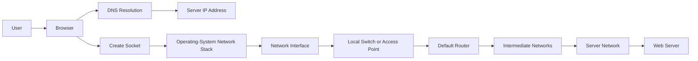

Later sections will expand every stage.

---

## Questions

1. Why is a destination IP address insufficient to identify the destination application?
2. Which identifiers are meaningful only on the local host?
3. Which identifiers are normally meaningful only on the local link?
4. At which stage does the destination port become important?
5. Why does a packet sent to a remote host still need a local MAC address?
6. Which parts of the path need to understand that the user requested a webpage?

---

# 3. Main Network Components

## 3.1 Host

A **host** is a system that sends or receives network traffic.

Examples:

* Laptop
* Smartphone
* Server
* Virtual machine
* Printer
* Container host
* Embedded device

A host normally contains:

* One or more network interfaces
* One or more IP addresses
* A routing table
* A protocol stack
* Applications using sockets

---

## 3.2 Network interface

A network interface connects a host to a network.

Examples:

* Ethernet adapter
* Wi-Fi adapter
* Virtual Ethernet interface
* Loopback interface
* Tunnel interface

The interface may be physical or virtual.

A physical interface usually has:

* Hardware driver
* Link speed
* Link state
* MAC address
* Transmit and receive queues

A virtual interface may represent:

* A bridge
* A container connection
* A VPN tunnel
* A loopback device
* A software-defined link

---

## 3.3 Switch

An Ethernet switch forwards Ethernet frames within a local network.

It primarily examines:

* Source MAC address
* Destination MAC address
* Incoming switch port

The switch learns which MAC addresses are reachable through which ports.

Example forwarding table:

```text
MAC address          Switch port
52:54:00:aa:aa:10    Port 1
52:54:00:bb:bb:20    Port 2
52:54:00:cc:cc:30    Port 7
```

A basic switch does not need IP addresses to forward ordinary Ethernet frames.

---

## 3.4 Router

A router forwards packets between IP networks.

It primarily examines:

* Destination IP address
* Routing table
* Packet lifetime field
* Next-hop information
* Outgoing interface

A router separates different IP networks.

Example:

```text
192.0.2.0/24         203.0.113.0/24
      │                      │
      └────── Router ────────┘
```

Switches usually forward within a link.

Routers forward between networks.

---

## 3.5 Wireless access point

A wireless access point connects Wi-Fi devices to a network.

It handles wireless-specific behavior such as:

* Radio transmission
* Association
* Channel use
* Wi-Fi frame handling
* Retransmissions at the wireless link layer

In many home devices, the following functions are bundled together:

* Wireless access point
* Ethernet switch
* IP router
* DHCP server
* DNS forwarder
* Modem or upstream interface

The box may be called a “router,” although it performs several distinct roles.

---

## 3.6 Modem

A modem converts between the local networking technology and the service provider's access technology.

Examples include:

* Cable modem
* DSL modem
* Cellular modem
* Optical network terminal

A modem and a router solve different problems.

* The modem provides access to the provider's transmission system.
* The router forwards IP packets between networks.

They may exist in one physical device.

---

## 3.7 Protocol servers

Some infrastructure components provide supporting protocols.

| Component       | Purpose                                         |
| --------------- | ----------------------------------------------- |
| DNS server      | Converts names into addresses and other records |
| DHCP server     | Supplies IP configuration to clients            |
| Time server     | Supplies synchronized time                      |
| Web server      | Serves HTTP resources                           |
| Proxy           | Relays application requests                     |
| Default gateway | Router used for non-local destinations          |

---

## 3.8 Component relationship diagram

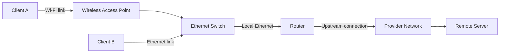

A packet from Client A to Client B may remain inside the local network.

A packet from Client A to the remote server normally passes through the router.

---

## Questions

1. Why can an Ethernet switch operate without assigning an IP address to every switch port?
2. What determines whether traffic must pass through a router?
3. Why is calling every home networking device a “router” technically imprecise?
4. A host has working Ethernet but cannot reach another IP network. Which component becomes the main suspect?
5. How would traffic differ when two hosts are connected to the same switch but belong to different IP networks?

---

# 4. Layered Networking Model

## 4.1 Why layering exists

Networking is too complex to treat as one indivisible mechanism.

Layering divides the problem into manageable responsibilities.

Each layer:

* Provides a service to the layer above
* Uses a service from the layer below
* Adds information relevant to its own responsibility
* Can often change without replacing every other layer

For example, HTTP can operate over:

* Ethernet
* Wi-Fi
* Cellular networks
* Virtual network links

HTTP does not need to implement separate packet transmission logic for every link technology.

---

## 4.2 TCP/IP model

A practical model commonly uses five layers:

| Layer       | Main responsibility                          | Examples             |
| ----------- | -------------------------------------------- | -------------------- |
| Application | Application-level messages and semantics     | HTTP, DNS, SSH       |
| Transport   | Process-to-process communication             | TCP, UDP             |
| Network     | Host-to-host packet delivery across networks | IPv4, IPv6, ICMP     |
| Data link   | Delivery across one local link               | Ethernet, Wi-Fi      |
| Physical    | Transmission of signals or symbols           | Copper, fibre, radio |

Some descriptions combine the data-link and physical layers into a single **link layer**.

---

## 4.3 OSI model

The OSI model contains seven layers:

| OSI layer       | Approximate TCP/IP equivalent |
| --------------- | ----------------------------- |
| 7. Application  | Application                   |
| 6. Presentation | Application                   |
| 5. Session      | Application                   |
| 4. Transport    | Transport                     |
| 3. Network      | Network                       |
| 2. Data link    | Data link                     |
| 1. Physical     | Physical                      |

The OSI model is useful for organizing concepts and troubleshooting.

However, real Internet protocols do not always fit perfectly into seven clean categories.

For example:

* TLS sits between application protocols and transport services.
* ARP relates network-layer addressing to link-layer addressing.
* ICMP is carried inside IP but supports network-layer control functions.
* Some hardware performs functions from several layers.

Use the layer model as a reasoning tool, not as an absolute law.

---

## 4.4 Encapsulation

Each layer normally wraps data from the layer above.

Suppose a browser sends an HTTP request using TCP over IPv4 over Ethernet.

```text
Application data
    ↓
TCP header + application data
    ↓
IPv4 header + TCP header + application data
    ↓
Ethernet header + IPv4 header + TCP header + application data + trailer
```

This wrapping process is called **encapsulation**.

The receiver performs the reverse process, called **decapsulation**.

---

## 4.5 Protocol data units

Different layer payloads are commonly given different names.

| Layer               | Common data-unit name       |
| ------------------- | --------------------------- |
| Application         | Message or application data |
| Transport using TCP | Segment                     |
| Transport using UDP | Datagram                    |
| Network             | Packet                      |
| Data link           | Frame                       |
| Physical            | Bits, symbols or signals    |

Terminology is not always used consistently. People often use “packet” informally for several kinds of network data.

When precision matters, identify the layer.

---

## 4.6 Encapsulation example

Assume a browser has produced this application data:

```text
GET / HTTP/1.1
Host: www.example.com
```

A simplified representation is:

```text
Ethernet frame
├── Destination MAC
├── Source MAC
├── EtherType
├── IPv4 packet
│   ├── Source IP
│   ├── Destination IP
│   ├── Protocol = TCP
│   └── TCP segment
│       ├── Source port
│       ├── Destination port = 443
│       ├── Sequence information
│       └── Application data
└── Frame check sequence
```

For an HTTPS request, the HTTP data is normally protected inside TLS records. The diagram above omits that additional layer so that the basic encapsulation structure remains visible.

---

## 4.7 What changes along a routed path

Consider this route:

```text
Client → Local router → Intermediate router → Server
```

### Usually remains conceptually end-to-end

* Source IP address
* Destination IP address
* Transport protocol
* Source port
* Destination port
* Application conversation

Some networks may alter addresses or ports through address translation, but that will be covered separately.

### Changes on each link

* Source MAC address
* Destination MAC address
* Link-layer trailer
* Physical signal representation

### Changes at routers

* IPv4 TTL decreases
* IPv4 header checksum is recalculated
* Link-layer header is removed and replaced
* Packet may be placed on a different link technology

---

## 4.8 Router processing model

A simplified router forwarding operation:

```text
1. Receive an Ethernet frame.
2. Verify that the frame is usable.
3. Remove the Ethernet header and trailer.
4. Examine the destination IP address.
5. Decrease the packet lifetime.
6. Consult the routing table.
7. Select a next hop and outgoing interface.
8. Construct a new link-layer frame.
9. Transmit the frame.
```

The router normally does not remove the TCP header to deliver the data to an application. It forwards the IP packet toward another network.

---

## 4.9 End-to-end flow diagram

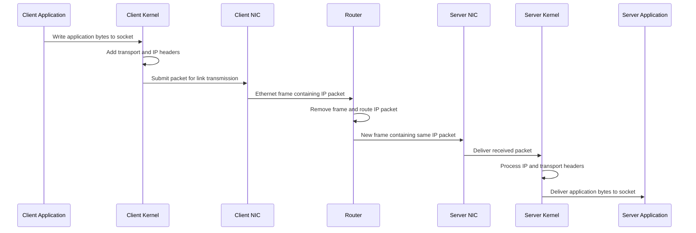

This diagram is simplified.

Real systems may also involve:

* Hardware checksum calculation
* Packet queues
* Interrupt handling
* Direct memory access
* Segmentation offload
* Firewall processing
* Virtual interfaces
* Multiple routers
* Retransmission and congestion control

---

## Questions

1. Which headers are normally replaced when a router forwards a packet?
2. Why can HTTP operate over both Ethernet and Wi-Fi without being redesigned?
3. What information allows the receiving operating system to select the correct application socket?
4. Why is it misleading to say that an Ethernet frame travels unchanged across the Internet?
5. What work must happen during decapsulation before application bytes reach a process?
6. At which layer would you investigate each problem?

   * Incorrect destination port
   * Missing route
   * Damaged Ethernet frame
   * Weak Wi-Fi signal
   * Malformed HTTP request

---

# 5. Ethernet Fundamentals

## 5.1 What Ethernet is

Ethernet is a family of technologies used for communication over local-area networks.

It defines aspects such as:

* Frame format
* Link-layer addressing
* Transmission behavior
* Physical media
* Link speeds
* Error detection

Modern switched Ethernet is the dominant wired local-network technology.

---

## 5.2 Why Ethernet exists

IP defines logical packet delivery, but it does not define exactly how a packet crosses every physical connection.

Ethernet provides a method for moving an IP packet across one Ethernet link.

It answers questions such as:

* Which local interface should receive the frame?
* How is the payload identified?
* How is corruption detected?
* How are bytes transmitted on this particular link?

---

## 5.3 Ethernet frame structure

A simplified Ethernet II frame:

```text
+----------------------+-------------------+
| Destination MAC      | 6 bytes           |
+----------------------+-------------------+
| Source MAC           | 6 bytes           |
+----------------------+-------------------+
| EtherType            | 2 bytes           |
+----------------------+-------------------+
| Payload              | 46–1500 bytes     |
+----------------------+-------------------+
| Frame Check Sequence | 4 bytes           |
+----------------------+-------------------+
```

Additional fields exist on the physical medium, including synchronization-related information. Optional tags may also be inserted, but they are outside the current scope.

### Destination MAC

Identifies the intended receiver on the current Ethernet link.

### Source MAC

Identifies the sender's interface on the current Ethernet link.

### EtherType

Indicates the protocol carried in the payload.

Common values include:

```text
0x0800  IPv4
0x0806  ARP
0x86DD  IPv6
```

### Payload

Contains the higher-layer data, often an IP packet.

### Frame Check Sequence

Allows the receiver to detect many forms of frame corruption.

It provides error detection, not authentication or encryption.

---

## 5.4 MAC addresses

A MAC address is commonly represented as six hexadecimal octets:

```text
52:54:00:12:34:56
```

It is often called a 48-bit address.

MAC addresses are used for communication on the current link.

They are not normally used to route traffic across the Internet.

### Important mental model

For remote communication:

```text
Destination IP  = remote server
Destination MAC = next local hop
```

If the server is on another network, the destination MAC is normally the MAC address of the local router—not the remote server.

---

## 5.5 Unicast, broadcast and multicast

### Unicast

One sender targets one destination interface.

```text
Destination MAC: 52:54:00:12:34:56
```

### Broadcast

One sender targets every device in the Ethernet broadcast domain.

```text
Destination MAC: ff:ff:ff:ff:ff:ff
```

ARP requests commonly use Ethernet broadcast.

### Multicast

One sender targets a group of interested receivers.

Multicast has its own addressing rules and is distinct from broadcast.

---

## 5.6 Broadcast domain

A broadcast domain is the set of interfaces that receive a link-layer broadcast.

A basic switch normally extends the same broadcast domain across its connected ports.

A router normally does not forward ordinary Ethernet broadcasts to another IP network.

```text
Host A ─┐
Host B ─┼── Switch ── Router ── Another network
Host C ─┘

Broadcast from Host A:
- reaches Host B
- reaches Host C
- reaches the router interface
- normally does not cross the router
```

This boundary matters for ARP and other local discovery protocols.

---

# 6. How an Ethernet Switch Works

## 6.1 Why switches exist

Connecting every device directly to every other device would be impractical.

A switch allows multiple Ethernet devices to share a local network while forwarding frames only where needed.

---

## 6.2 MAC learning

A switch learns from the **source MAC address** of arriving frames.

Suppose a frame arrives on port 3:

```text
Source MAC:      52:54:00:aa:aa:10
Destination MAC: 52:54:00:bb:bb:20
```

The switch records:

```text
52:54:00:aa:aa:10 → port 3
```

It then checks whether it knows the destination MAC.

---

## 6.3 Forwarding cases

### Known unicast

The destination MAC exists in the switch table.

```text
Destination MAC → port 7
```

The switch sends the frame only through port 7.

### Unknown unicast

The switch has not learned the destination MAC.

It floods the frame through relevant ports other than the incoming port.

Once the destination replies, the switch can learn its location.

### Broadcast

The destination is:

```text
ff:ff:ff:ff:ff:ff
```

The switch forwards the frame through all relevant ports except the incoming one.

### Same incoming and outgoing port

If the destination is known to exist behind the same port where the frame arrived, the switch can filter the frame rather than forwarding it elsewhere.

---

## 6.4 Switch learning walkthrough

Assume:

```text
Host A MAC: AA:AA:AA:AA:AA:AA
Host B MAC: BB:BB:BB:BB:BB:BB
```

Initially, the switch table is empty.

### First frame: A sends to B

1. Frame enters switch port 1.

2. Switch learns:

   ```text
   AA:AA:AA:AA:AA:AA → port 1
   ```

3. Destination B is unknown.

4. Switch floods the frame.

5. Host B receives it.

### Reply: B sends to A

1. Frame enters switch port 2.

2. Switch learns:

   ```text
   BB:BB:BB:BB:BB:BB → port 2
   ```

3. Destination A is known on port 1.

4. Switch forwards only to port 1.

The table now contains both mappings.

---

## 6.5 What a switch does not normally do

A basic Ethernet switch does not normally:

* Resolve domain names
* Select destination applications
* Perform TCP retransmission
* Choose Internet routes
* Read files from the server
* Generate HTTP responses

These belong to other components or layers.

---

## Questions

1. Why does a switch learn from source addresses rather than destination addresses?
2. What happens when the switch knows the source MAC but not the destination MAC?
3. How can excessive broadcast traffic affect every device in a broadcast domain?
4. Why can two hosts communicate through a switch even when the switch itself has no usable management IP address?
5. A switch receives a frame whose destination is known on the same incoming port. Why might it avoid forwarding the frame?
6. What happens to the switch table when a device moves to another port?

---

# 7. ARP: Mapping IPv4 Addresses to MAC Addresses

## 7.1 What ARP is

ARP stands for **Address Resolution Protocol**.

It maps an IPv4 address to a link-layer address on the local network.

Example question:

```text
Who has IPv4 address 192.0.2.1?
```

Example answer:

```text
192.0.2.1 is reachable at MAC address 52:54:00:aa:bb:01
```

ARP is used with IPv4.

IPv6 uses a different mechanism called Neighbor Discovery, covered later.

---

## 7.2 Why ARP exists

An application may know the destination IP address, but Ethernet transmission requires a destination MAC address.

Consider:

```text
Client IP:        192.0.2.10
Gateway IP:       192.0.2.1
Gateway MAC:      unknown
Remote server IP: 203.0.113.20
```

The client knows that the server is remote and that the packet must be sent through `192.0.2.1`.

To construct the Ethernet frame, it needs the gateway's MAC address.

ARP obtains that mapping.

---

## 7.3 ARP cache

Operating systems maintain a table of recently discovered IP-to-MAC mappings.

Example conceptual table:

```text
IPv4 address     MAC address          Interface
192.0.2.1        52:54:00:aa:bb:01    eth0
192.0.2.25       52:54:00:cc:dd:25    eth0
```

The cache prevents the host from broadcasting an ARP request for every packet.

Entries have states and lifetimes. Exact state names and timeout behavior vary by operating system.

---

## 7.4 Local versus remote destination

Before using ARP, the host determines whether the destination IP is local.

### Local destination

Example:

```text
Client:       192.0.2.10/24
Destination:  192.0.2.25
```

The destination belongs to the same local subnet.

The client resolves:

```text
192.0.2.25 → destination host's MAC
```

### Remote destination

Example:

```text
Client:       192.0.2.10/24
Destination:  203.0.113.20
Gateway:      192.0.2.1
```

The destination is not local.

The client resolves:

```text
192.0.2.1 → router's MAC
```

It does **not** ARP for `203.0.113.20`.

---

## 7.5 ARP request and reply

### Request

The sender broadcasts an ARP request:

```text
Ethernet destination: ff:ff:ff:ff:ff:ff

Question:
Who has 192.0.2.1?
Tell 192.0.2.10.
```

Every host in the broadcast domain may receive the frame.

Only the device responsible for `192.0.2.1` should reply normally.

### Reply

The gateway sends a unicast response:

```text
192.0.2.1 is at 52:54:00:aa:bb:01
```

The client stores the mapping in its ARP cache.

---

## 7.6 ARP sequence diagram

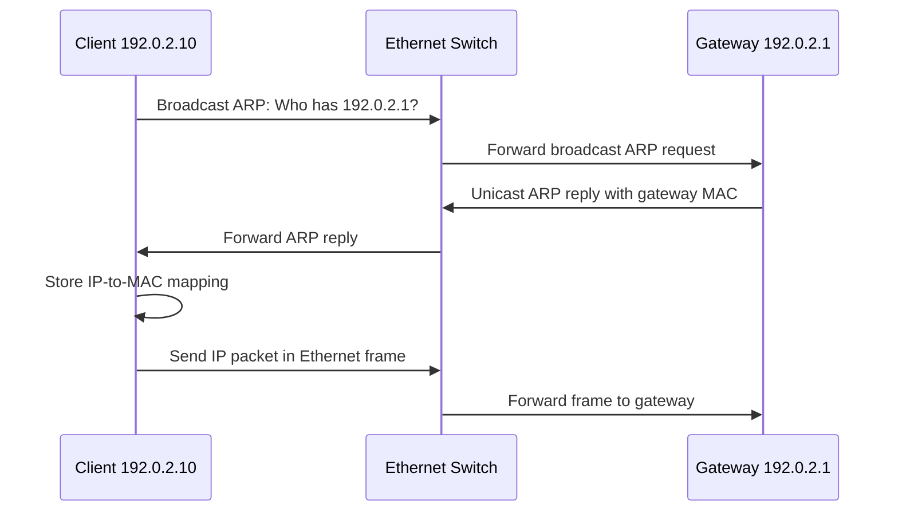

---

## 7.7 Complete local transmission example

Assume the client wants to send an IP packet to the remote web server.

### Known information

```text
Client IP:       192.0.2.10
Client MAC:      52:54:00:00:00:10
Gateway IP:      192.0.2.1
Web server IP:   203.0.113.20
```

### Step 1: Determine that destination is remote

The client compares:

* Its own network prefix
* The destination network prefix

It determines that `203.0.113.20` is not local.

### Step 2: Select the default route

The routing table identifies:

```text
Default gateway: 192.0.2.1
Outgoing interface: eth0
```

### Step 3: Look up gateway in neighbor table

The client checks whether it already knows the gateway's MAC address.

If the entry exists and is usable, it can skip the ARP exchange.

### Step 4: Send ARP request if needed

```text
Who has 192.0.2.1?
```

The request is carried in an Ethernet broadcast frame.

### Step 5: Receive ARP reply

```text
192.0.2.1 is at 52:54:00:aa:bb:01
```

### Step 6: Construct Ethernet frame

```text
Ethernet destination: 52:54:00:aa:bb:01
Ethernet source:      52:54:00:00:00:10
EtherType:            IPv4
```

Inside that frame:

```text
IPv4 source:      192.0.2.10
IPv4 destination: 203.0.113.20
```

Notice the distinction:

```text
Destination MAC = local gateway
Destination IP  = remote web server
```

### Step 7: Transmit the frame

The switch forwards the frame toward the gateway.

### Step 8: Router processes the packet

The router removes the Ethernet framing, examines the destination IP and forwards the IP packet toward the server using a new link-layer frame.

---

# 8. Practical Observation on Linux

The commands below use modern Linux networking tools. Equivalent commands differ on Windows, macOS and BSD systems.

Administrative privileges may be required for packet capture or interface changes.

---

## 8.1 Display interfaces

```bash
ip link show
```

### What it does

Displays network interfaces and link-layer information.

### Why it is useful

Use it to inspect:

* Interface names
* Interface state
* MAC addresses
* Maximum transmission unit
* Link flags

### Important fields

```text
UP
```

The interface has been administratively enabled.

```text
LOWER_UP
```

The underlying link is operational.

```text
mtu
```

The maximum network-layer payload accepted by the interface under normal conditions.

```text
link/ether
```

The interface's Ethernet MAC address.

### Compact form

```bash
ip -brief link
```

The `-brief` option produces a compact interface summary.

### Safety

Reading interface state is safe.

Commands such as `ip link set ... down` change connectivity and should not be used casually on remote systems.

---

## 8.2 Display IP addresses

```bash
ip address show
```

Short form:

```bash
ip addr
```

Compact form:

```bash
ip -brief address
```

### What it does

Displays IPv4 and IPv6 addresses assigned to each interface.

### Why it is useful

Use it to determine:

* Whether an interface has an address
* Which subnet prefix is configured
* Whether an address is temporary or dynamic
* Whether the interface has an IPv6 link-local address

### Important fields

```text
inet
```

An IPv4 address.

```text
inet6
```

An IPv6 address.

```text
scope host
```

Valid only within the host.

```text
scope link
```

Valid on the local link.

```text
scope global
```

Usable beyond the local link according to routing and policy.

---

## 8.3 Display ARP and neighbor entries

```bash
ip neighbor show
```

Short form:

```bash
ip neigh
```

### What it does

Displays IPv4 ARP entries and IPv6 neighbor entries.

### Why it is useful

Use it when diagnosing:

* Failure to reach a local host
* Failure to reach the default gateway
* Duplicate or stale address mappings
* Incomplete neighbor resolution

Typical states include:

| State        | General meaning                                        |
| ------------ | ------------------------------------------------------ |
| `REACHABLE`  | Recently confirmed as reachable                        |
| `STALE`      | Entry exists but has not been recently confirmed       |
| `DELAY`      | Confirmation is being delayed temporarily              |
| `PROBE`      | The system is actively checking reachability           |
| `INCOMPLETE` | Resolution has started but no usable reply has arrived |
| `FAILED`     | Resolution attempts failed                             |

State behavior follows the operating system's neighbor subsystem and should not be interpreted as permanent reachability guarantees.

### Filter by interface

```bash
ip neighbor show dev eth0
```

Replace `eth0` with the actual interface name.

---

## 8.4 Trigger local communication

```bash
ping -c 1 192.0.2.1
```

### What it does

Sends one ICMP Echo Request to the specified address.

### Why it is useful here

Sending the packet may cause the kernel to perform ARP resolution if no neighbor-cache entry exists.

### Important flag

```text
-c 1
```

Stops after sending one request.

Without a count, Linux `ping` normally continues until interrupted.

### What to observe

Run:

```bash
ip neighbor show
```

before and after the ping.

A new entry may appear for the target or next-hop address.

### Safety

A small number of ping packets is normally low-impact. Avoid aggressive or continuous probing on networks where you do not have authorization.

---

## 8.5 Capture ARP traffic

```bash
sudo tcpdump -ni eth0 arp
```

### What it does

Captures ARP frames observed on `eth0`.

### Why it is useful

It shows whether:

* ARP requests are leaving the machine
* ARP replies are returning
* The requested address is correct
* Multiple devices are claiming an address

### Important flags

| Flag      | Meaning                             |
| --------- | ----------------------------------- |
| `-n`      | Do not resolve addresses into names |
| `-i eth0` | Capture on the selected interface   |
| `arp`     | Capture only ARP traffic            |

The combined form:

```text
-ni eth0
```

means `-n -i eth0`.

### Generate an ARP exchange

In another terminal:

```bash
ping -c 1 192.0.2.1
```

If the mapping is already cached, an ARP request may not appear.

Deleting or changing neighbor entries modifies system state and is not necessary for initial observation.

### Safety

Packet captures may expose:

* Hostnames
* Addresses
* Credentials sent by insecure protocols
* Private application data
* Other users' traffic

Capture only on systems and networks where you have permission. Store capture files carefully.

---

## 8.6 Inspect Ethernet frames

```bash
sudo tcpdump -eni eth0
```

### What it does

Captures traffic and displays Ethernet-level information.

### Important flag

```text
-e
```

Prints link-layer headers, including MAC addresses.

### Why it is useful

It allows you to compare:

* Source and destination MAC addresses
* Source and destination IP addresses
* EtherType
* Protocol carried by the frame

This is particularly useful for verifying:

```text
Remote destination IP
but
local gateway destination MAC
```

### Limit capture count

```bash
sudo tcpdump -eni eth0 -c 10
```

```text
-c 10
```

Stops after ten captured packets.

This avoids leaving a capture running indefinitely.

---

## 8.7 Examine interface counters

```bash
ip -s link show dev eth0
```

### What it does

Displays transmit and receive counters for the interface.

### Why it is useful

It helps detect:

* Dropped packets
* Receive errors
* Transmit errors
* Unexpected traffic volume

### Interpretation caution

A nonzero drop count does not automatically prove a physical-link problem.

Drops may occur because of:

* Queue overflow
* Driver behavior
* Kernel processing limits
* Virtual networking
* Unsupported frames
* Application backpressure

Compare changes over time rather than relying only on a cumulative total.

---

# 9. ARP Failure Scenarios

## 9.1 Neighbor entry remains incomplete

Observation:

```text
192.0.2.1 dev eth0 INCOMPLETE
```

Possible causes:

* Target is powered off
* Wrong IP address
* Incorrect subnet configuration
* Ethernet link failure
* Wi-Fi association failure
* Target is on another broadcast domain
* Switch path is broken
* ARP replies are not returning

Investigation path:

```text
1. Confirm interface state.
2. Confirm local IP address and prefix.
3. Confirm selected route.
4. Capture ARP requests.
5. Check whether replies arrive.
6. Check link counters.
7. Test another known local host.
```

---

## 9.2 Wrong subnet prefix

Suppose the client is incorrectly configured as:

```text
192.0.2.10/8
```

instead of:

```text
192.0.2.10/24
```

The client may incorrectly classify many remote addresses as local.

It might try to ARP directly for an address that should have been sent through a router.

Result:

* ARP requests are broadcast locally
* No device answers
* Packet never reaches the default gateway

This is why subnet configuration affects link-layer behavior.

---

## 9.3 Stale neighbor entry

A device may change its network interface or MAC address while another host still has an old mapping.

Possible symptoms:

* Traffic is sent to the old MAC address
* Connectivity fails temporarily
* Connectivity recovers after cache expiration or relearning

Operating systems normally refresh neighbor information automatically.

---

## 9.4 Duplicate IPv4 address

Two devices may be configured with the same IPv4 address.

Possible symptoms:

* Intermittent connectivity
* Neighbor table alternates between MAC addresses
* Connections unexpectedly reset
* One device works while the other becomes unreachable
* ARP observations show multiple replies

A duplicate address problem can resemble a switch or application failure.

---

## 9.5 ARP does not cross routers

A host on `192.0.2.0/24` cannot ordinarily use ARP to discover a host on `203.0.113.0/24`.

ARP is link-local.

The client resolves the MAC address of the next local hop, usually its router.

Misconception:

> “The computer learns the web server's MAC address before connecting.”

Normally false when the server is on another network.

The client learns the MAC address of its local next hop.

---

## 9.6 Ping failure does not always imply ARP failure

A host may successfully resolve a MAC address but still receive no ping response.

Possible reasons:

* Destination ignores ICMP Echo Requests
* IP routing beyond the next hop is broken
* Return route is missing
* Destination operating system is overloaded
* Address translation is incorrect
* Packet is dropped later in the path

Check the neighbor table before concluding that the local link failed.

---

## Questions

1. Why can an incorrect subnet mask cause a host to ARP for a remote address?
2. What does an `INCOMPLETE` neighbor entry tell you, and what does it not tell you?
3. Why can a successful ARP exchange coexist with a failed `ping`?
4. How would duplicate IP addresses appear in a packet capture?
5. Why does clearing a neighbor entry sometimes appear to “fix” connectivity only temporarily?
6. A client sends ARP requests but receives no replies. What evidence would distinguish:

   * A powered-off target
   * A wrong subnet
   * A broken switch path
   * A disconnected local interface
7. When sending to a remote IP address, which system's MAC address should normally appear as the Ethernet destination?

# Part 2 — IPv4 Addressing, Subnetting, and Routing

# 10. IPv4 Addressing

## 10.1 What an IPv4 address is

An IPv4 address is a 32-bit logical address assigned to a network interface.

Example:

```text
192.0.2.10
```

The dotted-decimal form represents four 8-bit values:

```text
192        0          2          10
11000000 . 00000000 . 00000010 . 00001010
```

Because IPv4 has 32 bits, it has:

```text
2³² = 4,294,967,296
```

possible address values.

Not all values are available as globally routable host addresses. Some ranges have special purposes.

---

## 10.2 Why IP addressing exists

Ethernet addresses support delivery on one local link.

IP addressing supports delivery across multiple interconnected networks.

An IP address provides two related pieces of information:

* The network to which an interface belongs
* The interface's address within that network

The division between those parts is determined by the prefix length.

Example:

```text
192.0.2.10/24
```

Here:

* `192.0.2.0/24` is the network prefix
* `10` is part of the host/interface portion
* `/24` means the first 24 bits identify the network

---

## 10.3 IP addresses belong to interfaces

A common simplification is:

> A computer has an IP address.

More precisely:

> An IP address is assigned to a network interface within a host.

A host can have multiple interfaces:

```text
Laptop
├── Ethernet: 192.0.2.10
├── Wi-Fi:    198.51.100.20
└── Loopback: 127.0.0.1
```

A single interface can also have multiple IP addresses.

This matters because:

* Routing decisions select interfaces
* Services may listen on specific addresses
* Replies may use different source addresses
* Virtual interfaces may have independent addressing

---

## 10.4 Network prefix and host portion

Consider:

```text
192.0.2.10/24
```

The `/24` prefix means:

```text
First 24 bits: network portion
Last 8 bits:   host/interface portion
```

Binary representation:

```text
Address:
11000000.00000000.00000010.00001010

Prefix:
11111111.11111111.11111111.00000000
```

The network portion is:

```text
11000000.00000000.00000010
```

which corresponds to:

```text
192.0.2
```

The network address is therefore:

```text
192.0.2.0
```

---

## 10.5 Prefix notation

A prefix length tells us how many leading address bits identify the network.

| Prefix | Network bits | Host bits |
| -----: | -----------: | --------: |
|   `/8` |            8 |        24 |
|  `/16` |           16 |        16 |
|  `/24` |           24 |         8 |
|  `/25` |           25 |         7 |
|  `/30` |           30 |         2 |
|  `/32` |           32 |         0 |

A `/32` refers to one exact IPv4 address.

It can be used in:

* Routing entries
* Interface configurations
* Access-control rules
* Host-specific references

---

## 10.6 Subnet masks

A subnet mask is another representation of the prefix length.

For `/24`:

```text
Binary:
11111111.11111111.11111111.00000000

Decimal:
255.255.255.0
```

For `/26`:

```text
Binary:
11111111.11111111.11111111.11000000

Decimal:
255.255.255.192
```

The mask contains:

* `1` bits for the network portion
* `0` bits for the host portion

Modern tools and documentation usually prefer CIDR prefix notation such as `/24`.

---

## 10.7 CIDR

CIDR stands for **Classless Inter-Domain Routing**.

CIDR allows network prefixes of arbitrary lengths:

```text
192.0.2.0/24
192.0.2.0/25
192.0.2.128/26
```

Before CIDR, IPv4 networks were historically associated with fixed address classes. Class-based terminology still appears in older material, but modern addressing and routing use explicit prefix lengths.

Avoid relying on statements such as:

> `192.x.x.x` is automatically a Class C network.

The actual network size depends on the configured prefix.

```text
192.0.2.10/24
192.0.2.10/20
192.0.2.10/28
```

These represent different network boundaries despite sharing the same IP address.

---

## 10.8 Special IPv4 address categories

### Private address ranges

Private addresses are intended for use inside private networks.

```text
10.0.0.0/8
172.16.0.0/12
192.168.0.0/16
```

They are not normally routed directly across the public Internet.

Examples:

```text
10.20.30.40
172.20.5.10
192.168.1.50
```

Private addresses are commonly used with address translation at an Internet boundary.

Private does not mean:

* Encrypted
* Authenticated
* Automatically secure
* Invisible to other devices on the local network

It describes address scope and routing conventions.

---

### Loopback range

```text
127.0.0.0/8
```

The most commonly used loopback address is:

```text
127.0.0.1
```

Traffic sent to loopback remains within the local host.

It is useful for:

* Testing local services
* Inter-process communication
* Binding services only to the local machine
* Isolating application testing from physical-network state

---

### Link-local range

```text
169.254.0.0/16
```

Some operating systems automatically assign an address from this range when normal address configuration fails.

Seeing an address such as:

```text
169.254.42.18
```

often suggests that the host did not receive expected configuration from DHCP.

Link-local IPv4 traffic is not normally routed beyond the local link.

---

### Unspecified address

```text
0.0.0.0
```

Its meaning depends on context.

As a source address, it can mean that a host does not yet know its address.

In a server bind operation:

```text
0.0.0.0:8080
```

usually means:

> Listen on port 8080 on all suitable local IPv4 interfaces.

It does not mean there is a remote host named `0.0.0.0`.

---

### Limited broadcast

```text
255.255.255.255
```

This identifies a broadcast limited to the local network.

It is used by protocols such as DHCP during early configuration.

Routers normally do not forward it.

---

### Documentation ranges

The following ranges are reserved for documentation and examples:

```text
192.0.2.0/24
198.51.100.0/24
203.0.113.0/24
```

Using them in technical examples avoids accidentally referring to real public systems.

---

## 10.9 Address scope mental model

| Address type        | Typical scope                                             |
| ------------------- | --------------------------------------------------------- |
| `127.0.0.1`         | Current host                                              |
| `169.254.x.x`       | Current local link                                        |
| `192.168.x.x`       | Private routed network                                    |
| Public IPv4 address | Potentially Internet-routable                             |
| `0.0.0.0`           | Unspecified or all local interfaces, depending on context |

Scope does not guarantee reachability.

A public address may still be unreachable because of:

* Missing route
* Host being offline
* Service not listening
* Provider filtering
* Address translation
* Application failure

---

## Questions

1. Why is it more precise to assign an IP address to an interface rather than to a computer?
2. How can the same IPv4 address belong to different subnet sizes?
3. Why does a private address not automatically make a service secure?
4. What does `0.0.0.0` mean when displayed as a server's listening address?
5. Why can loopback communication work while the Ethernet interface is disconnected?
6. A host has `169.254.20.5`. Which configuration process should you investigate first?
7. Why should class-based address assumptions be avoided in modern networks?

---

# 11. IPv4 Subnetting

## 11.1 What subnetting is

Subnetting divides an address range into smaller network prefixes.

Example:

```text
Original network:
192.0.2.0/24
```

It can be divided into two `/25` networks:

```text
192.0.2.0/25
192.0.2.128/25
```

Or four `/26` networks:

```text
192.0.2.0/26
192.0.2.64/26
192.0.2.128/26
192.0.2.192/26
```

---

## 11.2 Why subnetting exists

Subnetting helps:

* Separate network segments
* Control broadcast scope
* Organize address allocation
* Create routing boundaries
* Use address space efficiently
* Distinguish local and remote destinations

At the host level, the subnet prefix helps answer:

> Can I send directly to this destination, or must I use a router?

---

## 11.3 The local-delivery test

Suppose a host is configured as:

```text
192.0.2.10/24
```

It wants to send to:

```text
192.0.2.25
```

The host applies the `/24` mask to both addresses.

### Source network calculation

```text
192.0.2.10 AND 255.255.255.0
= 192.0.2.0
```

### Destination network calculation

```text
192.0.2.25 AND 255.255.255.0
= 192.0.2.0
```

The resulting network values match.

Therefore, the destination is treated as local.

The host attempts direct neighbor resolution for `192.0.2.25`.

---

### Remote example

Source:

```text
192.0.2.10/24
```

Destination:

```text
192.0.3.25
```

Calculations:

```text
192.0.2.10 AND 255.255.255.0
= 192.0.2.0
```

```text
192.0.3.25 AND 255.255.255.0
= 192.0.3.0
```

The results differ.

The host treats the destination as remote and consults its routing table.

---

## 11.4 Bitwise AND

Subnet calculations use the bitwise AND operation.

Rules:

| Bit A | Bit B | Result |
| ----: | ----: | -----: |
|     0 |     0 |      0 |
|     0 |     1 |      0 |
|     1 |     0 |      0 |
|     1 |     1 |      1 |

Example:

```text
Address octet:  11001010
Mask octet:     11110000
Result:         11000000
```

Only bits that are `1` in both values remain `1`.

---

## 11.5 Calculating a `/26` network

Given:

```text
192.0.2.70/26
```

A `/26` mask is:

```text
255.255.255.192
```

Last octet in binary:

```text
Address 70: 01000110
Mask 192:   11000000
AND:        01000000
```

`01000000` is decimal `64`.

Therefore:

```text
Network address: 192.0.2.64
```

A `/26` has six host bits:

```text
2⁶ = 64 total addresses
```

The address range is:

```text
192.0.2.64 through 192.0.2.127
```

In a conventional subnet:

```text
Network address:   192.0.2.64
Typical host range: 192.0.2.65–192.0.2.126
Broadcast address: 192.0.2.127
```

---

## 11.6 Subnet block sizes

For masks that divide the final octet, a useful calculation is:

```text
Block size = 256 - mask value
```

Examples:

| Prefix | Mask              | Block size |
| -----: | ----------------- | ---------: |
|  `/25` | `255.255.255.128` |        128 |
|  `/26` | `255.255.255.192` |         64 |
|  `/27` | `255.255.255.224` |         32 |
|  `/28` | `255.255.255.240` |         16 |
|  `/29` | `255.255.255.248` |          8 |
|  `/30` | `255.255.255.252` |          4 |

For `/27`, network boundaries in the final octet occur at:

```text
0, 32, 64, 96, 128, 160, 192, 224
```

---

## 11.7 Example: determine the subnet

Given:

```text
192.0.2.141/27
```

A `/27` has a block size of 32.

Network boundaries:

```text
0
32
64
96
128
160
192
224
```

`141` lies between `128` and `159`.

Therefore:

```text
Network address:    192.0.2.128
Broadcast address:  192.0.2.159
Typical host range: 192.0.2.129–192.0.2.158
```

---

## 11.8 Address-count formula

For an IPv4 prefix of `/n`:

```text
Host bits = 32 - n
```

Total addresses:

```text
2^(32-n)
```

For `/27`:

```text
Host bits = 32 - 27 = 5
Total addresses = 2⁵ = 32
```

Historically, ordinary IPv4 subnets reserve:

* One network address
* One broadcast address

So the conventional usable host count is:

```text
2^(32-n) - 2
```

For `/27`:

```text
32 - 2 = 30
```

---

## 11.9 `/31` and `/32` exceptions

The “subtract two” rule is not universal.

### `/31`

A `/31` contains two addresses.

It can be used on point-to-point links where there is no need for conventional network and broadcast addresses.

Example:

```text
192.0.2.10/31
192.0.2.11/31
```

Both addresses may be used as endpoints under the applicable point-to-point behavior.

### `/32`

A `/32` identifies exactly one address.

It is commonly used for:

* Host routes
* Loopback-style logical addresses
* Exact route matches
* Tunnel endpoints

Do not mechanically apply the normal host-count formula without considering the prefix's intended use.

---

## 11.10 Worked subnetting example

A network administrator has:

```text
192.0.2.0/24
```

The goal is to create four equal-size subnets.

### Step 1: Determine required subnet bits

Four subnets require:

```text
2² = 4
```

Therefore, borrow two host bits.

Original prefix:

```text
/24
```

New prefix:

```text
/26
```

### Step 2: Determine addresses per subnet

```text
32 - 26 = 6 host bits
```

```text
2⁶ = 64 addresses per subnet
```

### Step 3: List boundaries

Block size:

```text
256 - 192 = 64
```

Networks:

```text
192.0.2.0/26
192.0.2.64/26
192.0.2.128/26
192.0.2.192/26
```

### Step 4: Identify ranges

| Network          | Typical host range        | Broadcast     |
| ---------------- | ------------------------- | ------------- |
| `192.0.2.0/26`   | `192.0.2.1–192.0.2.62`    | `192.0.2.63`  |
| `192.0.2.64/26`  | `192.0.2.65–192.0.2.126`  | `192.0.2.127` |
| `192.0.2.128/26` | `192.0.2.129–192.0.2.190` | `192.0.2.191` |
| `192.0.2.192/26` | `192.0.2.193–192.0.2.254` | `192.0.2.255` |

---

## 11.11 Unequal subnet sizes

Subnets do not have to be equal.

Suppose `192.0.2.0/24` must support:

* One network with approximately 100 hosts
* One network with approximately 50 hosts
* Two networks with approximately 20 hosts each

Possible allocation:

```text
192.0.2.0/25       128 addresses
192.0.2.128/26      64 addresses
192.0.2.192/27      32 addresses
192.0.2.224/27      32 addresses
```

This approach is commonly called variable-length subnetting.

The order matters: allocate larger blocks before smaller ones to avoid fragmentation.

---

## 11.12 Overlapping subnet error

Consider two configured networks:

```text
192.0.2.0/25
192.0.2.64/26
```

The first range covers:

```text
192.0.2.0–192.0.2.127
```

The second covers:

```text
192.0.2.64–192.0.2.127
```

They overlap.

Overlapping prefixes can cause:

* Ambiguous routing
* Incorrect local-delivery decisions
* Duplicate address allocation
* Unpredictable reachability
* Difficult troubleshooting

---

## Questions

1. Why does subnetting affect ARP behavior?
2. Given `192.0.2.200/27`, what are the network and broadcast addresses?
3. Why is `192.0.2.127` a host address in some prefixes but a broadcast address in others?
4. What operational problems can overlapping subnets create?
5. Why should larger address blocks usually be allocated before smaller blocks?
6. How many addresses exist in a `/29`, and how many are conventionally usable?
7. Why is the normal “subtract two” host rule inappropriate for some `/31` networks?
8. A host with `192.0.2.10/16` tries to reach `192.0.200.5`. How will it classify the destination, and why might that be wrong for the actual network?

---

# 12. Practical Subnet Tools

## 12.1 Inspect configured prefixes

```bash
ip -brief address
```

Example output:

```text
lo      UNKNOWN  127.0.0.1/8 ::1/128
eth0    UP       192.0.2.10/24
```

### Interpretation

```text
192.0.2.10/24
```

means:

* Interface address: `192.0.2.10`
* Network prefix length: `/24`
* Local network: `192.0.2.0/24`

The exact output depends on the actual machine.

---

## 12.2 Calculate networks using `ipcalc`

Some Linux distributions provide an `ipcalc` utility.

```bash
ipcalc 192.0.2.141/27
```

### What it does

Calculates subnet information such as:

* Network address
* Prefix
* Address range
* Broadcast address
* Host capacity

### Why it is useful

It helps verify manual calculations.

### Important caution

There are multiple utilities named `ipcalc`, and their flags and output can differ between operating systems and packages.

Check the local implementation:

```bash
ipcalc --help
```

or:

```bash
man ipcalc
```

Do not assume every `ipcalc` supports the same options.

---

## 12.3 Calculate with Python's standard library

Python includes the `ipaddress` module.

```bash
python3 - <<'PY'
import ipaddress

interface = ipaddress.ip_interface("192.0.2.141/27")

print("Address:   ", interface.ip)
print("Network:   ", interface.network.network_address)
print("Broadcast: ", interface.network.broadcast_address)
print("Prefix:    ", interface.network.prefixlen)
print("Addresses: ", interface.network.num_addresses)
PY
```

Expected result:

```text
Address:    192.0.2.141
Network:    192.0.2.128
Broadcast:  192.0.2.159
Prefix:     27
Addresses:  32
```

### What it does

Parses an interface address and calculates its containing network.

### Why it is useful

It provides a reliable programmable method for:

* Validating configuration files
* Calculating ranges
* Detecting overlaps
* Building network automation
* Testing subnet logic

### Safety

This code only performs calculations and does not modify the network.

---

## 12.4 Test whether an address belongs to a network

```bash
python3 - <<'PY'
import ipaddress

network = ipaddress.ip_network("192.0.2.128/27")
address = ipaddress.ip_address("192.0.2.141")

print(address in network)
PY
```

Output:

```text
True
```

This mirrors the kind of membership decision involved when classifying a destination against a prefix.

---

## 12.5 Detect overlap

```bash
python3 - <<'PY'
import ipaddress

first = ipaddress.ip_network("192.0.2.0/25")
second = ipaddress.ip_network("192.0.2.64/26")

print(first.overlaps(second))
PY
```

Output:

```text
True
```

This is useful when validating address plans.

---

# 13. Routing Fundamentals

## 13.1 What routing is

Routing is the process of selecting a path for an IP packet.

Every IP-capable host performs some routing decision.

Routing is not limited to dedicated routers.

A client must decide:

* Is the destination local?
* Which outgoing interface should be used?
* Is a next-hop router required?
* Which source address should be used?

A router performs similar decisions while forwarding packets between networks.

---

## 13.2 Why routing exists

A single Ethernet network cannot efficiently contain every Internet-connected system.

Routing allows networks to be divided and interconnected.

Instead of knowing the exact link-layer location of every destination, a host can send packets toward a next hop.

The next hop repeats the process until the destination network is reached.

---

## 13.3 Routing-table mental model

A routing table contains rules resembling:

```text
For destination prefix X:
    use interface Y
    optionally send through next hop Z
```

Example:

```text
Destination         Next hop       Interface
192.0.2.0/24        directly       eth0
203.0.113.0/24      192.0.2.1      eth0
0.0.0.0/0           192.0.2.1      eth0
```

`0.0.0.0/0` matches every IPv4 address.

It is commonly called the **default route**.

---

## 13.4 Directly connected route

If an interface is configured as:

```text
192.0.2.10/24
```

the operating system usually creates a connected route similar to:

```text
192.0.2.0/24 dev eth0
```

Meaning:

> Destinations inside `192.0.2.0/24` can be reached directly through `eth0`.

For such destinations, the host normally resolves the destination's MAC address directly.

---

## 13.5 Route through a gateway

A route may specify a next-hop router:

```text
203.0.113.0/24 via 192.0.2.1 dev eth0
```

Meaning:

> To reach `203.0.113.0/24`, send the packet to router `192.0.2.1` through `eth0`.

The IP packet still contains the final destination:

```text
203.0.113.20
```

The Ethernet frame contains the gateway's MAC address.

---

## 13.6 Default route

Example:

```text
default via 192.0.2.1 dev eth0
```

Equivalent destination prefix:

```text
0.0.0.0/0
```

It means:

> Use this route when no more-specific route matches.

The default route does not override a more-specific connected or static route.

---

## 13.7 Longest-prefix matching

When multiple routes match a destination, the route with the longest matching prefix is normally preferred.

Consider:

```text
0.0.0.0/0          via 192.0.2.1
203.0.113.0/24     via 192.0.2.2
203.0.113.128/25   via 192.0.2.3
```

Destination:

```text
203.0.113.150
```

All three routes match.

Prefix lengths:

```text
/0
/24
/25
```

The `/25` is the most specific match.

Therefore:

```text
Next hop: 192.0.2.3
```

This behavior is called **longest-prefix matching**.

It is more important than simply choosing the first textual entry displayed.

---

## 13.8 Longest-prefix example

Routes:

```text
10.0.0.0/8        via Router A
10.20.0.0/16      via Router B
10.20.30.0/24     via Router C
0.0.0.0/0         via Router D
```

Destinations:

| Destination    | Selected route               |
| -------------- | ---------------------------- |
| `10.20.30.50`  | `10.20.30.0/24` via Router C |
| `10.20.40.50`  | `10.20.0.0/16` via Router B  |
| `10.30.40.50`  | `10.0.0.0/8` via Router A    |
| `203.0.113.20` | `0.0.0.0/0` via Router D     |

---

## 13.9 Route selection versus packet forwarding

These are related but distinct.

### Route selection

The system determines:

* Matching destination prefix
* Outgoing interface
* Next hop
* Preferred source address
* Other route attributes

### Packet forwarding

The system:

1. Resolves the next hop at the link layer.
2. Constructs the appropriate frame.
3. Queues the packet for transmission.
4. Sends it through the selected interface.

A route can exist while forwarding still fails.

Example:

* Correct route exists
* Next-hop ARP fails
* Packet cannot leave the local link

---

## 13.10 Host routing sequence

A simplified Linux-like host decision:

```text
Application supplies destination address
               │
               ▼
Kernel performs route lookup
               │
               ├── Select route
               ├── Select outgoing interface
               ├── Select next hop
               └── Select source address
               │
               ▼
Resolve next-hop link address
               │
               ▼
Construct frame
               │
               ▼
Queue for transmission
```

---

## 13.11 Router forwarding sequence

Assume a router receives an IPv4 packet.

### Step 1: Receive frame

The router's interface receives a link-layer frame addressed to it.

### Step 2: Validate frame

The receiving interface checks whether the frame is usable.

Corrupted frames are generally discarded.

### Step 3: Remove link-layer encapsulation

The router extracts the IPv4 packet.

### Step 4: Validate IP header

The router examines fields such as:

* IPv4 version
* Header length
* Packet length
* Header checksum
* Destination address

### Step 5: Decrease TTL

The router subtracts one from the packet's Time To Live field.

If TTL becomes zero, the router discards the packet and may send an ICMP Time Exceeded message.

This prevents packets from circulating indefinitely in routing loops.

### Step 6: Perform route lookup

The router applies longest-prefix matching to the destination IP address.

### Step 7: Select outgoing interface and next hop

The result might be:

```text
Outgoing interface: eth1
Next hop: 198.51.100.2
```

### Step 8: Resolve link-layer address

If necessary, the router resolves the next hop's MAC address on the outgoing link.

### Step 9: Create a new frame

The outgoing frame uses:

```text
Source MAC:      router's outgoing-interface MAC
Destination MAC: next-hop MAC
```

The IP packet remains inside the frame.

### Step 10: Transmit

The router sends the frame toward the next hop.

---

## 13.12 What changes at each IPv4 router

Consider:

```text
Client → Router A → Router B → Server
```

### Ethernet header

Replaced at every Ethernet hop.

### IPv4 TTL

Decreased at each router.

### IPv4 header checksum

Recalculated because the IPv4 header changed.

### Source and destination IP

Normally remain unchanged during ordinary routing.

Address translation can alter these fields, but that is a separate mechanism.

### TCP or UDP ports

Normally remain unchanged during ordinary routing.

Again, address and port translation can alter them at specific devices.

---

## 13.13 Routing walkthrough for the website example

Assume:

```text
Client:        192.0.2.10/24
Gateway:       192.0.2.1
Server:        203.0.113.20
```

### Client route table

```text
192.0.2.0/24 dev eth0
default via 192.0.2.1 dev eth0
```

### Step 1: Browser targets server

After name resolution, the browser wants to connect to:

```text
203.0.113.20:443
```

### Step 2: Kernel searches routing table

`203.0.113.20` does not match:

```text
192.0.2.0/24
```

It does match:

```text
0.0.0.0/0
```

### Step 3: Kernel selects default route

```text
Next hop:   192.0.2.1
Interface:  eth0
```

### Step 4: Kernel resolves gateway MAC

It consults the neighbor table or sends ARP.

Assume:

```text
192.0.2.1 → 52:54:00:aa:bb:01
```

### Step 5: Client sends frame

```text
Ethernet source:      client MAC
Ethernet destination: gateway MAC

IPv4 source:          192.0.2.10
IPv4 destination:     203.0.113.20

TCP destination port: 443
```

### Step 6: Gateway routes packet

The gateway:

1. Removes the Ethernet header.
2. Decreases TTL.
3. Searches its routing table.
4. Selects another interface or next hop.
5. Wraps the packet in a new frame.
6. Sends it onward.

This repeats until the packet reaches a router directly connected to the server's network.

### Step 7: Final router resolves server MAC

The final router sees the destination as directly connected.

It resolves:

```text
203.0.113.20 → server MAC
```

It then creates a frame addressed directly to the server.

---

## 13.14 Routing sequence diagram

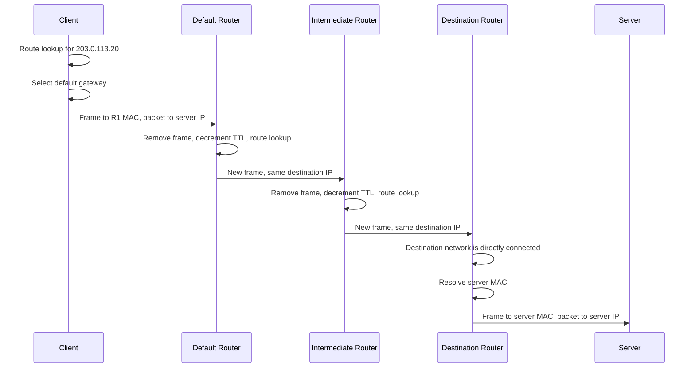

---

# 14. Practical Routing Commands on Linux

## 14.1 Display the routing table

```bash
ip route show
```

Short form:

```bash
ip route
```

### What it does

Displays the IPv4 routing table.

### Why it is useful

Use it to determine:

* Default gateway
* Connected networks
* Static routes
* Outgoing interfaces
* Route metrics
* Preferred source addresses

Example:

```text
default via 192.0.2.1 dev eth0
192.0.2.0/24 dev eth0 proto kernel scope link src 192.0.2.10
```

### Interpretation

```text
default via 192.0.2.1 dev eth0
```

Unknown remote destinations are sent through `192.0.2.1` using `eth0`.

```text
192.0.2.0/24 dev eth0
```

The network is directly reachable through `eth0`.

```text
proto kernel
```

The route was installed by the kernel, often because an interface address was configured.

```text
scope link
```

The destination is directly reachable on the link.

```text
src 192.0.2.10
```

The kernel may prefer this source address for packets using the route.

---

## 14.2 Ask the kernel how it would route a destination

```bash
ip route get 203.0.113.20
```

### What it does

Performs a route lookup for the specified destination.

### Why it is useful

This is often more informative than manually reading the full routing table.

It may show:

* Selected next hop
* Outgoing interface
* Source address
* Route cache-related information

Example:

```text
203.0.113.20 via 192.0.2.1 dev eth0 src 192.0.2.10
```

Interpretation:

```text
Destination:        203.0.113.20
Next hop:           192.0.2.1
Outgoing interface: eth0
Source address:     192.0.2.10
```

---

## 14.3 Check local route selection

```bash
ip route get 192.0.2.25
```

Possible output:

```text
192.0.2.25 dev eth0 src 192.0.2.10
```

No `via` gateway is shown because the destination is directly connected.

The kernel will normally resolve the destination host's MAC address directly.

---

## 14.4 Specify a source address

```bash
ip route get 203.0.113.20 from 192.0.2.10
```

### What it does

Asks how the system would route traffic from a particular source address to the destination.

### Why it is useful

Source address can matter when a system has:

* Multiple interfaces
* Multiple IP addresses
* Policy-based routing
* Multiple upstream networks

Behavior can be more complex than a single destination-based table.

---

## 14.5 Display all routing tables

```bash
ip route show table all
```

### What it does

Displays routes across all configured Linux routing tables.

### Why it is useful

A system may use policy routing rather than relying only on the main table.

For foundational troubleshooting, start with:

```bash
ip route
```

Move to all tables when ordinary route output does not explain the selected path.

---

## 14.6 Display routing rules

```bash
ip rule show
```

### What it does

Displays rules that determine which routing table should be consulted.

### Why it is useful

It helps diagnose systems with:

* Multiple network connections
* Source-based routing
* VPN routes
* Container networking
* Custom policy routing

A route may appear correct in the main table but not be selected because another rule chooses a different table.

---

## 14.7 Modify routes carefully

Example syntax:

```bash
sudo ip route add 203.0.113.0/24 via 192.0.2.1 dev eth0
```

### What it does

Adds a route to the live kernel routing table.

### Safety concern

Changing routes can immediately break connectivity.

This is especially dangerous on remote systems because an incorrect route may disconnect the administrative session.

Do not run route-modification commands unless:

* You understand the existing topology
* You know how to undo the change
* You have an alternate recovery path
* The destination and next hop are appropriate for the real network

The command above uses documentation addresses and is an example, not a recommendation for a real host.

---

# 15. Route-Related Failure Scenarios

## 15.1 Missing default route

Symptoms:

* Local subnet communication works
* Remote networks are unreachable
* ARP to local hosts succeeds
* DNS may fail if the DNS server is remote

Check:

```bash
ip route
```

A system intended to reach external networks will commonly need a default route or explicit routes to those networks.

---

## 15.2 Wrong default gateway

Suppose:

```text
Client:  192.0.2.10/24
Gateway: 192.0.3.1
```

The configured gateway is not inside the client's directly connected subnet.

The client may be unable to resolve it at the link layer.

Many systems reject such a route configuration unless special options are used.

The normal gateway should be reachable through one of the host's connected routes.

---

## 15.3 Correct route, failed ARP

Route lookup:

```text
203.0.113.20 via 192.0.2.1 dev eth0
```

Neighbor table:

```text
192.0.2.1 dev eth0 INCOMPLETE
```

Interpretation:

* The route exists
* The selected next hop is known logically
* Link-layer resolution failed
* The packet cannot reach the next hop

This is a link or local-neighbor problem, not necessarily an Internet-routing problem.

---

## 15.4 More-specific wrong route

Routes:

```text
default via 192.0.2.1 dev eth0
203.0.113.0/24 via 192.0.2.254 dev eth0
```

Suppose `192.0.2.254` is invalid or unavailable.

Traffic to most Internet destinations may work through the default route.

Traffic to `203.0.113.0/24` fails because the more-specific route overrides the default route.

This produces destination-specific failure.

---

## 15.5 Missing return route

A forward path can work while replies cannot return.

Example:

```text
Client → Router A → Server
```

The server receives the packet but does not know how to route a reply to the client's network.

Symptoms can include:

* Outgoing packets visible at client
* Requests visible at server
* No response received at client
* One-way communication

Successful communication normally requires a valid path in both directions.

The return path does not have to be identical to the forward path.

---

## 15.6 Asymmetric routing

Forward path:

```text
Client → Router A → Router B → Server
```

Return path:

```text
Server → Router C → Router D → Client
```

This is asymmetric routing.

It can be valid.

However, it may complicate:

* Packet capture
* Stateful middleboxes
* Performance analysis
* Failure localization
* Address translation

Capturing on only Router A would show outbound traffic but not necessarily the return packets.

---

## 15.7 Route exists but application still fails

A valid route proves only that the kernel has a forwarding decision.

It does not prove:

* The next hop is reachable
* The remote host is online
* The server application is listening
* TCP completes successfully
* DNS is correct
* Application data is valid
* Return routing works

Troubleshooting should move layer by layer.

---

## 15.8 Interface-down failure

A route may reference an interface that is unavailable.

Check:

```bash
ip link show
```

and:

```bash
ip route get 203.0.113.20
```

Potential causes:

* Cable disconnected
* Wi-Fi disconnected
* Interface administratively down
* Driver failure
* Virtual interface removed

---

## 15.9 Incorrect source-address selection

A multi-interface host might select a source address that the destination cannot return traffic to.

Example:

```text
eth0: 192.0.2.10
eth1: 198.51.100.10
```

A route through `eth0` should generally use a source address appropriate for that path.

Inspect:

```bash
ip route get 203.0.113.20
```

Pay attention to the displayed `src` value.

---

# 16. Step-by-Step Routing Troubleshooting

Suppose:

```text
The client can reach local hosts but cannot reach 203.0.113.20.
```

Use a layered process.

## Step 1: Inspect interfaces

```bash
ip -brief link
ip -brief address
```

Confirm:

* Interface exists
* Interface is operational
* Expected IP address is present
* Prefix length is correct

---

## Step 2: Inspect route selection

```bash
ip route get 203.0.113.20
```

Confirm:

* A route exists
* Correct interface is selected
* Correct gateway is selected
* Source address is appropriate

If the command reports that the network is unreachable, routing configuration is incomplete.

---

## Step 3: Inspect next-hop resolution

If the route uses:

```text
via 192.0.2.1
```

check:

```bash
ip neighbor show 192.0.2.1
```

Possible findings:

```text
REACHABLE
STALE
INCOMPLETE
FAILED
```

An incomplete or failed entry points toward a local-link problem.

---

## Step 4: Test the gateway

```bash
ping -c 3 192.0.2.1
```

This tests more than ARP, but it can show whether the gateway responds to ICMP Echo Requests.

A lack of response is not conclusive because devices can ignore ping.

Combine it with packet capture.

---

## Step 5: Capture local traffic

```bash
sudo tcpdump -ni eth0 'arp or icmp'
```

Observe:

* ARP request sent
* ARP reply received
* ICMP request sent
* ICMP response received
* ICMP error returned

### Safety

The capture requires appropriate authorization. The filter limits the capture to ARP and ICMP, reducing unrelated data exposure.

---

## Step 6: Trace the path

Linux commonly provides:

```bash
traceroute 203.0.113.20
```

Some installations may not include `traceroute` by default.

An alternative available on many Linux systems is:

```bash
tracepath 203.0.113.20
```

These tools rely on TTL or hop-limit expiration behavior to reveal parts of the path.

They will be examined in the ICMP section.

---

## Step 7: Distinguish routing from service failure

Even if the destination host is reachable, the intended service may not be.

Later transport-layer tests can check a specific port.

For now, keep the distinction:

```text
IP reachability ≠ application availability
```

---

## Questions

1. Why does a valid routing-table entry not prove that a packet can leave the host?
2. How can a more-specific route break only one destination range?
3. Why must the next-hop gateway usually be reachable through a connected route?
4. What evidence would distinguish a missing route from failed ARP?
5. How can a server receive a request but the client still time out?
6. Why might capturing packets at the default gateway reveal only one direction of a connection?
7. In longest-prefix matching, why does `/25` override `/24` and `/0`?
8. A client uses the correct gateway but the wrong source address. What part of the communication is most likely to fail?
9. Why should route changes be treated as dangerous on a remotely administered host?
10. What is the difference between selecting a route and successfully forwarding a packet?

# Part 3 — IPv4 Packet Internals, MTU, Fragmentation, and ICMP

# 17. IPv4 Packet Structure

## 17.1 What an IPv4 packet is

An IPv4 packet is the network-layer unit used to carry data from a source IPv4 address to a destination IPv4 address.

It contains:

* An IPv4 header
* A payload, such as a TCP segment, UDP datagram, or ICMP message

Simplified structure:

```text
+--------------------------+
| IPv4 header              |
+--------------------------+
| Transport/control data   |
| TCP, UDP, ICMP, etc.     |
+--------------------------+
| Application data         |
+--------------------------+
```

The packet is then placed inside a link-layer frame for transmission over the current link.

For Ethernet:

```text
Ethernet frame
└── IPv4 packet
    ├── IPv4 header
    └── TCP/UDP/ICMP payload
```

---

## 17.2 Why the IPv4 header exists

The header carries information routers and destination hosts need to process the packet.

It answers questions such as:

* Which IP version is this?
* How large is the packet?
* Who sent it?
* Where is it going?
* What protocol is inside it?
* How many more routers may process it?
* Has the header been corrupted?
* Is this packet a fragment?

Routers normally inspect the IPv4 header without needing to understand the application data.

---

## 17.3 Simplified IPv4 header

```text
0                   1                   2                   3
0 1 2 3 4 5 6 7 8 9 0 1 2 3 4 5 6 7 8 9 0 1 2 3 4 5 6 7 8 9 0 1
+-------+-------+---------------+-------------------------------+
|Version|  IHL  | DSCP / ECN    | Total Length                  |
+-------------------------------+-------------------------------+
| Identification                |Flags| Fragment Offset          |
+-------------------------------+-------------------------------+
| TTL           | Protocol      | Header Checksum               |
+---------------------------------------------------------------+
| Source IPv4 Address                                           |
+---------------------------------------------------------------+
| Destination IPv4 Address                                      |
+---------------------------------------------------------------+
| Options, if present                                            |
+---------------------------------------------------------------+
| Payload                                                        |
+---------------------------------------------------------------+
```

The minimum IPv4 header size is 20 bytes.

Options can make it larger.

---

# 18. Important IPv4 Header Fields

## 18.1 Version

The version field identifies the IP version.

For IPv4:

```text
Version = 4
```

This allows a receiving system to distinguish IPv4 from other protocol versions.

---

## 18.2 Internet Header Length

The **Internet Header Length**, or IHL, identifies the size of the IPv4 header.

The value is measured in 32-bit words, not bytes.

For a normal 20-byte header:

```text
IHL = 5

5 × 4 bytes = 20 bytes
```

If options are present, the IHL value is larger.

A receiver uses this field to determine where the payload begins.

---

## 18.3 Total Length

The total-length field contains the entire IPv4 packet length:

```text
IPv4 header + IPv4 payload
```

Example:

```text
IPv4 header:    20 bytes
TCP header:     20 bytes
Application:  1000 bytes
```

Total IPv4 length:

```text
20 + 20 + 1000 = 1040 bytes
```

The maximum representable IPv4 packet length is 65,535 bytes because the field is 16 bits.

That does not mean such a packet can cross every link without fragmentation.

---

## 18.4 Source and destination addresses

Example:

```text
Source:      192.0.2.10
Destination: 203.0.113.20
```

The source identifies the sender's IP address.

The destination determines where routers should forward the packet.

During ordinary routing, these addresses normally remain unchanged from source to destination.

However, mechanisms such as address translation can modify them.

---

## 18.5 Protocol field

The protocol field identifies the next protocol carried inside IPv4.

Common values:

| Value | Protocol |
| ----: | -------- |
|   `1` | ICMP     |
|   `6` | TCP      |
|  `17` | UDP      |

This field helps the destination kernel decide which protocol handler should receive the payload.

Example:

```text
IPv4 protocol = 6
```

The payload should be processed as TCP.

The TCP header then identifies destination and source ports.

---

## 18.6 Time To Live

The **Time To Live**, or TTL, limits how many routers may forward the packet.

Despite its name, modern routers generally treat TTL as a hop counter.

Each router decreases TTL by one.

Example:

```text
Initial TTL: 64

After router 1: 63
After router 2: 62
After router 3: 61
```

If a router decreases TTL to zero:

1. It discards the packet.
2. It may send an ICMP Time Exceeded message to the source.

TTL prevents packets from circulating forever when routing loops exist.

---

## 18.7 Header checksum

IPv4 includes a checksum covering only the IPv4 header.

It does not cover:

* TCP or UDP payload
* Application data
* Ethernet header

Because a router changes the TTL, it must update the IPv4 header checksum.

The receiver can use the checksum to detect corruption in the IPv4 header.

A valid checksum does not provide:

* Encryption
* Authentication
* Protection against intentional modification

It is only an error-detection mechanism.

---

## 18.8 Identification

The identification field helps associate IPv4 fragments that originated from the same packet.

When a packet is fragmented, the fragments share identification information so the destination can reassemble them.

Exact identification-field generation differs across operating systems and circumstances.

---

## 18.9 Flags

Important IPv4 fragmentation flags include:

### Don't Fragment

Usually written as **DF**.

When set, routers should not fragment the packet.

If a router cannot forward the packet because it exceeds the outgoing link's MTU, it discards the packet and should return an ICMP error.

### More Fragments

Usually written as **MF**.

It indicates that additional fragments follow.

The final fragment has the MF flag cleared.

---

## 18.10 Fragment offset

The fragment offset identifies where a fragment's payload belongs within the original packet.

It is measured in units of eight bytes.

This means most fragment payload sizes must be divisible by eight, except potentially the final fragment.

---

## 18.11 DSCP and ECN

The header contains fields used for traffic handling and congestion signaling.

### DSCP

The Differentiated Services Code Point may indicate desired packet-forwarding treatment.

### ECN

Explicit Congestion Notification allows compatible systems to signal congestion without necessarily dropping packets.

These mechanisms become important in traffic engineering and congestion management, but detailed enterprise policy is outside the current scope.

The foundational point is:

> IPv4 can carry metadata that influences how packets are treated, not just where they are sent.

---

## Questions

1. Why must a router update the IPv4 checksum even when it does not change the source or destination address?
2. How does the protocol field differ from a TCP or UDP port number?
3. Why is a valid IPv4 header checksum not evidence that the application data is correct?
4. What would happen if IPv4 had no TTL mechanism and a routing loop developed?
5. Why does the destination need the Internet Header Length field?
6. Which fields help a receiver reassemble fragmented packets?
7. At which processing stage does the operating system use the IPv4 protocol field?

---

# 19. Packet Walkthrough: Application Data to IPv4 Packet

Assume a client sends 500 bytes of application data using TCP.

Simplified values:

```text
Application data: 500 bytes
TCP header:        20 bytes
IPv4 header:       20 bytes
```

## Step 1: Application writes data

The application sends 500 bytes through a socket.

Conceptually:

```text
write(socket, 500 bytes)
```

The application usually does not construct the IPv4 header itself.

---

## Step 2: TCP processes the bytes

TCP creates a segment containing:

```text
TCP header:        20 bytes
TCP payload:      500 bytes
TCP total:        520 bytes
```

The TCP header contains information such as:

* Source port
* Destination port
* Sequence number
* Acknowledgement information
* Flags
* Checksum

TCP details are covered later.

---

## Step 3: IPv4 encapsulates the TCP segment

IPv4 adds its header:

```text
IPv4 header:       20 bytes
TCP segment:      520 bytes
IPv4 total:       540 bytes
```

Important values might be:

```text
Source IP:      192.0.2.10
Destination IP: 203.0.113.20
Protocol:       6
TTL:            64
Total length:   540
```

---

## Step 4: Route lookup occurs

The kernel searches for a route to:

```text
203.0.113.20
```

Suppose it selects:

```text
via 192.0.2.1 dev eth0
```

---

## Step 5: Link-layer destination is resolved

The kernel resolves the gateway's MAC address:

```text
192.0.2.1 → 52:54:00:aa:bb:01
```

---

## Step 6: Ethernet frame is created

Simplified:

```text
Ethernet header: 14 bytes
IPv4 packet:    540 bytes
Ethernet trailer: 4 bytes
```

The frame carries:

```text
Destination MAC: gateway MAC
Source MAC:      client MAC
EtherType:       IPv4
```

Inside the frame:

```text
Destination IP: web server IP
```

---

## Step 7: Router receives the frame

The router:

1. Checks the Ethernet frame.
2. Removes the Ethernet header and trailer.
3. Reads the IPv4 destination.
4. Decreases TTL from 64 to 63.
5. Updates the IPv4 header checksum.
6. Selects the next route.
7. Creates a new link-layer frame.

The TCP segment and application bytes are normally unchanged.

---

## Step 8: Destination host receives the packet

The destination:

1. Removes the local link-layer frame.
2. Validates the IPv4 header.
3. Notices protocol `6`.
4. Passes the payload to TCP.
5. TCP identifies the destination socket by address and port.
6. TCP eventually provides ordered application bytes to the server process.

---

# 20. Maximum Transmission Unit

## 20.1 What MTU is

The **Maximum Transmission Unit**, or MTU, is the largest network-layer packet that a link can carry in one link-layer frame without requiring fragmentation at that link.

A common Ethernet interface MTU is:

```text
1500 bytes
```

This means an Ethernet frame can commonly carry an IPv4 packet of up to 1500 bytes as its payload.

The Ethernet header and trailer are not included in the normal IP MTU value.

---

## 20.2 Why MTU exists

Every link technology has limits on frame size.

These limits arise from:

* Protocol design
* Hardware capabilities
* Error recovery behavior
* Transmission efficiency
* Encapsulation overhead

Different links can have different MTUs.

Examples may include:

```text
Ethernet:             commonly 1500
Loopback:             often much larger
Tunnel interfaces:    often lower than 1500
Some specialized links: different values
```

Exact values depend on the operating system and network configuration.

---

## 20.3 MTU and payload size

Suppose the path uses an MTU of 1500 bytes.

With a minimum IPv4 header:

```text
Maximum IPv4 payload:
1500 - 20 = 1480 bytes
```

If the payload is TCP with a minimum 20-byte TCP header:

```text
Maximum TCP data:
1500 - 20 - 20 = 1460 bytes
```

This value is related to the TCP Maximum Segment Size.

```text
Ethernet payload capacity: 1500
IPv4 header:                 20
TCP header:                  20
TCP application data:      1460
```

Additional IP or TCP options reduce the application-data space.

---

## 20.4 MTU is link-specific

A path can contain multiple links:

```text
Client --1500-- Router --1400-- Router --1500-- Server
```

The smallest usable MTU on the path constrains the packet size that can cross the entire path without fragmentation.

This is called the **path MTU**.

In the example:

```text
Path MTU = 1400 bytes
```

Even though the source's local Ethernet supports 1500 bytes, a later link supports only 1400.

---

## 20.5 Display interface MTU on Linux

```bash
ip link show
```

Example field:

```text
mtu 1500
```

For a specific interface:

```bash
ip link show dev eth0
```

Compact output:

```bash
ip -brief link
```

The compact output may not show every MTU detail, so use the full command when checking MTU.

---

## 20.6 Changing MTU

Example syntax:

```bash
sudo ip link set dev eth0 mtu 1400
```

### What it does

Changes the interface MTU in the running kernel.

### Why it may be used

Possible cases include:

* Tunnel overhead
* Provider requirements
* Testing
* Resolving a known path limitation

### Safety concerns

Changing MTU can cause:

* Packet loss
* Broken connections
* Reduced performance
* Loss of remote access
* Inconsistent behavior across interfaces

Do not change MTU as a generic troubleshooting guess.

First observe the actual path behavior.

---

## Questions

1. Why is the Ethernet header not normally counted in the interface's IP MTU value?
2. With an IPv4 MTU of 1500 and a 32-byte TCP header, how much application data fits in one segment?
3. Why can a local interface support 1500-byte packets while the end-to-end path cannot?
4. How can adding a tunnel reduce the usable MTU?
5. Why might reducing MTU appear to fix some connections but not address the underlying configuration problem?
6. What is the relationship between link MTU and path MTU?

---

# 21. IPv4 Fragmentation

## 21.1 What fragmentation is

IPv4 fragmentation divides one large IPv4 packet into smaller IPv4 packets called fragments.

This may occur when:

* A packet is larger than the outgoing link's MTU
* Fragmentation is permitted
* A router or source performs the fragmentation

Each fragment receives its own IPv4 header.

The destination host reassembles the fragments into the original packet.

---

## 21.2 Why fragmentation exists

IPv4 was designed to operate across networks with different packet-size limits.

Suppose:

```text
Incoming packet: 1500 bytes
Outgoing MTU:     1000 bytes
```

The router cannot place the 1500-byte packet into a link that accepts only 1000-byte IP packets.

IPv4 provides two broad possibilities:

1. Fragment the packet.
2. Drop it if fragmentation is prohibited.

---

## 21.3 Fragmentation example

Assume:

```text
Original IPv4 packet:
Header:  20 bytes
Payload: 1980 bytes
Total:   2000 bytes

Outgoing MTU:
1000 bytes
```

Each fragment needs a 20-byte IPv4 header.

Maximum payload per fragment:

```text
1000 - 20 = 980 bytes
```

However, non-final fragment payloads generally need sizes divisible by eight because the offset is measured in eight-byte units.

A usable fragment payload size is:

```text
976 bytes
```

Possible fragments:

### Fragment 1

```text
Header:          20 bytes
Payload:        976 bytes
Total:          996 bytes
Offset:           0
More Fragments:   1
```

### Fragment 2

```text
Header:          20 bytes
Payload:        976 bytes
Total:          996 bytes
Offset:         122
More Fragments:   1
```

Why offset `122`?

```text
976 ÷ 8 = 122
```

### Fragment 3

Remaining payload:

```text
1980 - 976 - 976 = 28 bytes
```

```text
Header:          20 bytes
Payload:         28 bytes
Total:           48 bytes
Offset:         244
More Fragments:   0
```

Why offset `244`?

```text
(976 + 976) ÷ 8 = 244
```

---

## 21.4 Reassembly

The destination uses fields such as:

* Source address
* Destination address
* Protocol
* Identification
* Fragment offset
* More Fragments flag

to reconstruct the original packet.

Intermediate routers normally do not reassemble fragments merely to fragment them again.

The destination performs reassembly.

If one fragment is missing, the full original packet cannot be reconstructed.

---

## 21.5 Why fragmentation is costly

Fragmentation creates several problems:

### Additional headers

Every fragment needs an IPv4 header.

### More packets

Routers and hosts must process more packets.

### Loss amplification

If one fragment is lost, the entire original higher-layer packet may become unusable.

For TCP, this often results in retransmission of the corresponding data.

### Reassembly work

The destination must:

* Store fragments
* Track offsets
* Handle timers
* Detect missing pieces
* Reconstruct the packet

### Troubleshooting complexity

Packet captures may show transport headers only in the first fragment.

Later fragments contain continuation data without the original transport header.

---

## 21.6 Don't Fragment behavior

If the DF flag is set and the packet exceeds the next link's MTU:

1. The router cannot fragment it.
2. The router drops the packet.
3. The router should send an ICMP Destination Unreachable message indicating that fragmentation is needed.

The sender can then reduce the packet size.

This behavior supports Path MTU Discovery.

---

## 21.7 Source fragmentation versus router fragmentation

IPv4 fragmentation may be performed by:

* The original sender
* An intermediate router

Modern transport behavior usually attempts to avoid router fragmentation when possible.

A source that knows the path MTU can send appropriately sized packets from the beginning.

---

## 21.8 Fragments and transport headers

Only the first fragment normally contains the beginning of the transport-layer header.

Example:

```text
Fragment 1:
IPv4 header
TCP header
Initial TCP data

Fragment 2:
IPv4 header
Continuation of TCP data

Fragment 3:
IPv4 header
Continuation of TCP data
```

This distinction matters in packet analysis.

A packet analyzer may not display TCP ports for non-initial fragments because those fragments do not contain the TCP header.

---

## Questions

1. Why must non-final IPv4 fragment payloads generally use lengths divisible by eight?
2. Why does losing one fragment often make the entire original packet unusable?
3. Which host normally performs final fragment reassembly?
4. Why might a packet analyzer show TCP ports only for the first fragment?
5. How does fragmentation increase both bandwidth overhead and CPU work?
6. What should a router do when a packet is too large, DF is set, and the outgoing MTU is smaller?
7. Why is avoiding fragmentation generally preferable to successfully reassembling fragments?

---

# 22. Path MTU Discovery

## 22.1 What Path MTU Discovery is

Path MTU Discovery is a mechanism for determining the largest packet size that can traverse a path without fragmentation.

For IPv4, a common process is:

1. Sender transmits packets with the DF flag set.
2. A router encounters a link with a smaller MTU.
3. The router drops the oversized packet.
4. The router sends an ICMP error to the sender.
5. The sender reduces its packet size.
6. Transmission continues with smaller packets.

---

## 22.2 Why it exists

The source normally knows only its local interface MTU.

It may not know the MTU of every intermediate link.

Path MTU Discovery allows the sender to adapt to the smallest MTU along the path.

This avoids:

* Router fragmentation
* Extra fragment headers
* Reassembly overhead
* Loss amplification

---

## 22.3 Simplified sequence

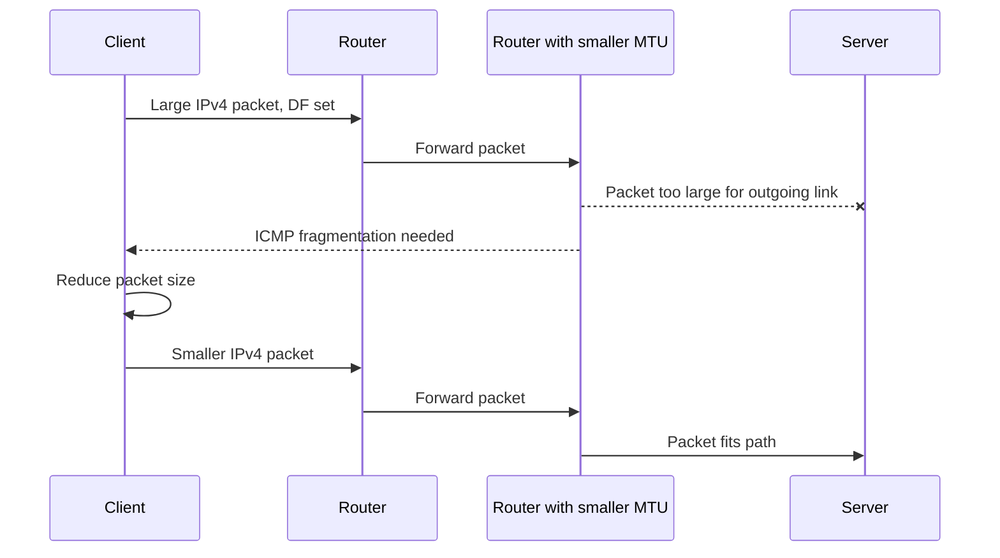

---

## 22.4 Path MTU black hole

A Path MTU black hole can occur when:

1. The sender transmits packets that are too large.
2. A router drops them because DF is set.
3. The necessary ICMP error does not reach the sender.
4. The sender does not learn that it must reduce packet size.

Symptoms may include:

* Small requests work
* Large transfers stall
* A TCP handshake completes
* Initial application communication succeeds
* Data transfer freezes at larger packet sizes

This can be confusing because basic connectivity tests may pass.

---

## 22.5 Why ping may mislead

A default ping payload is often much smaller than the path MTU.

A small ping can succeed while large application packets fail.

Example:

```text
Small ICMP packet: 84 bytes total
Large TCP packet: 1500 bytes total
```

The small packet crosses the path.

The large packet encounters an MTU problem.

Therefore:

```text
Successful small ping ≠ proof that all packet sizes work
```

---

# 23. Testing Packet Size with `ping`

Linux `ping` can send specific payload sizes.

Example:

```bash
ping -c 3 -M do -s 1472 203.0.113.20
```

## What it does

On Linux:

* `-c 3` sends three requests
* `-M do` prohibits local fragmentation and sets behavior appropriate for testing
* `-s 1472` sends 1472 bytes of ICMP payload

For a typical IPv4 Echo Request:

```text
IPv4 header:   20 bytes
ICMP header:    8 bytes
Payload:     1472 bytes
Total:       1500 bytes
```

Therefore, `1472` tests a 1500-byte IPv4 packet when no IPv4 options are present.

---

## Why it is useful

It can help identify:

* Whether a path supports a specific packet size
* Whether smaller packets work while larger ones fail
* Possible MTU limitations

---

## Important cautions

Results are not conclusive when:

* The destination ignores ICMP Echo Requests
* Intermediate devices treat ICMP differently
* The return path has different characteristics
* ICMP errors are not delivered
* The local `ping` implementation uses different options

Check local documentation:

```bash
man ping
```

Options differ between Linux, BSD, macOS, and Windows.

---

## Find a smaller working size

Example:

```bash
ping -c 3 -M do -s 1400 203.0.113.20
```

Total IPv4 packet size:

```text
1400 + 8 + 20 = 1428 bytes
```

A binary-search approach can narrow down the largest successful size.

Do not use aggressive packet rates on networks you do not control.

---

# 24. `tracepath` and Path MTU

```bash
tracepath 203.0.113.20
```

## What it does

`tracepath` attempts to discover:

* Intermediate path information
* Path MTU changes
* Reachability behavior

It generally does not require elevated privileges on Linux.

---

## Why it is useful

It can reveal lines indicating an observed path MTU.

Conceptual output:

```text
1:  192.0.2.1
2:  198.51.100.1
3:  203.0.113.20
    Resume: pmtu 1500
```

Actual output varies.

A reported PMTU should be interpreted as an observation from the test, not an unchanging property of the Internet path.

Routes can change.

---

## Safety

`tracepath` sends probe traffic.

Use it only against systems and networks where such diagnostic traffic is acceptable.

---

# 25. ICMP Fundamentals

## 25.1 What ICMP is

ICMP stands for **Internet Control Message Protocol**.

It carries control, diagnostic, and error information related to IP packet delivery.

For IPv4, ICMP is carried inside IPv4 packets.

Simplified:

```text
Ethernet frame
└── IPv4 packet
    └── ICMP message
```

The IPv4 protocol field for ICMP is:

```text
1
```

---

## 25.2 Why ICMP exists

IP itself is primarily responsible for packet delivery.

It needs a mechanism for communicating conditions such as:

* Destination unreachable
* Packet lifetime expired
* Fragmentation required
* Echo request and response
* Invalid header parameters

ICMP provides that supporting feedback.

It is not merely “the ping protocol.”

Ping uses ICMP, but ICMP has broader responsibilities.

---

## 25.3 ICMP is not a transport protocol

TCP and UDP identify application endpoints using ports.

ICMP does not use TCP or UDP ports.

Instead, ICMP messages contain fields such as:

* Type
* Code
* Checksum
* Type-specific data

Example:

```text
Type: Echo Request
Code: 0
```

---

## 25.4 ICMP message categories

### Error messages

Used to report delivery or processing problems.

Examples:

* Destination Unreachable
* Time Exceeded
* Parameter Problem
* Redirect

### Informational messages

Used for diagnostic or informational purposes.

Examples:

* Echo Request
* Echo Reply

---

# 26. ICMP Echo and `ping`

## 26.1 What `ping` does

`ping` commonly sends ICMP Echo Request messages and waits for ICMP Echo Reply messages.

Simplified flow:

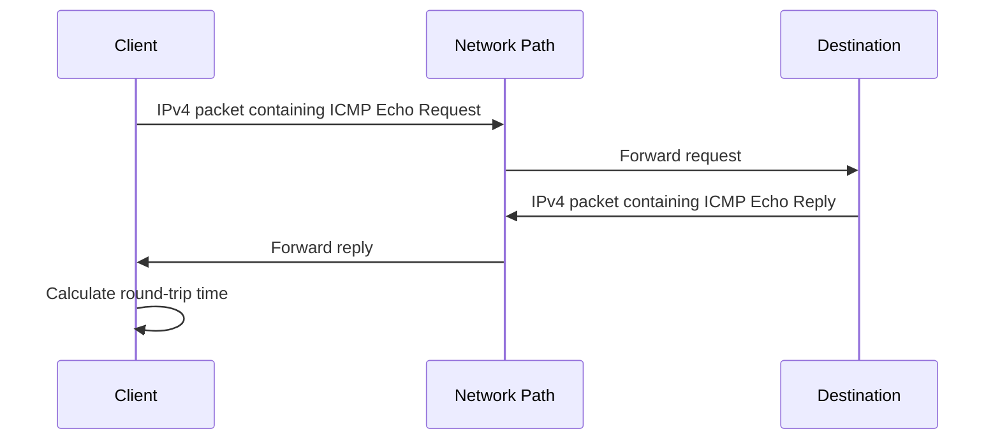

---

## 26.2 What ping can test

A successful ping can provide evidence that:

* The source constructed and sent a packet
* A forward IP path existed
* The destination processed the request
* The destination generated a reply
* A return IP path existed
* The source received the response

It can also measure approximate round-trip time.

---

## 26.3 What ping cannot prove

A successful ping does not prove:

* A web server is running
* TCP port 443 is reachable
* DNS is working
* The application is healthy
* Large packets can cross the path
* Performance is consistently good
* Every route uses the same path

A failed ping does not prove:

* The host is offline
* Routing is broken
* The service is unavailable

The destination may simply not respond to Echo Requests.

---

## 26.4 Linux `ping` command

```bash
ping -c 4 203.0.113.20
```

### What it does

Sends four ICMP Echo Requests.

### Important option

```text
-c 4
```

Stops after four requests.

### Typical fields

Conceptual output:

```text
64 bytes from 203.0.113.20: icmp_seq=1 ttl=52 time=24.8 ms
```

Interpretation:

| Field          | Meaning                                                    |
| -------------- | ---------------------------------------------------------- |
| `64 bytes`     | Size of received ICMP-related data as reported by the tool |
| `icmp_seq=1`   | Sequence identifier                                        |
| `ttl=52`       | TTL remaining in the reply when received                   |
| `time=24.8 ms` | Approximate round-trip time                                |

Exact output differs between implementations.

---

## 26.5 Round-trip time

Round-trip time includes:

* Source-host processing
* Forward transmission
* Router processing and queuing
* Destination processing
* Return transmission
* Return-path queuing

It does not measure only physical distance.

A high time can result from:

* Congestion
* Wireless retransmission
* Queueing
* Slow processing
* Long physical path
* Different return route

---

## 26.6 Packet loss

Conceptual summary:

```text
4 packets transmitted, 3 received, 25% packet loss
```

Potential causes include:

* Actual congestion
* Wireless interference
* Device overload
* Rate limiting
* Route instability
* Return-path loss
* Diagnostic traffic being deprioritized

Packet loss reported by ping does not automatically mean normal application traffic loses packets at the same rate.

---

## 26.7 TTL in ping output

The displayed TTL is normally the remaining TTL of the received reply.

It is not directly the number of routers crossed.

To estimate hop count, you would need to know or infer the sender's initial TTL, which can vary by operating system and configuration.

Therefore, avoid claims such as:

> TTL 52 means exactly 12 routers away.

That may be a reasonable hypothesis under a specific assumed initial TTL, but it is not guaranteed.

---

## Questions

1. What evidence does a successful ping provide about the return path?
2. Why can ping succeed while HTTPS fails?
3. Why can ping fail while a web service remains reachable?
4. What factors contribute to the round-trip time displayed by ping?
5. Why should the received TTL not be treated as an exact hop count?
6. How could ICMP rate limiting make a healthy network appear lossy?
7. Why does ICMP not need port numbers?

---

# 27. ICMP Destination Unreachable

## 27.1 What it indicates

An ICMP Destination Unreachable message reports that an IP packet could not be delivered or processed for a particular reason.

The message includes:

* An ICMP type
* A code describing the reason
* Part of the original packet

Including part of the original packet helps the sender associate the error with the relevant communication.

---

## 27.2 Common conceptual reasons

Destination Unreachable codes can indicate conditions such as:

* Network unreachable
* Host unreachable
* Protocol unreachable
* Port unreachable
* Fragmentation needed

Exact behavior and generated messages depend on the system and network.

---

## 27.3 Port unreachable example

Assume a client sends a UDP datagram to:

```text
203.0.113.20:9999
```

No application is listening on UDP port `9999`.

The destination operating system may return:

```text
ICMP Destination Unreachable
Code: Port Unreachable
```

Flow:

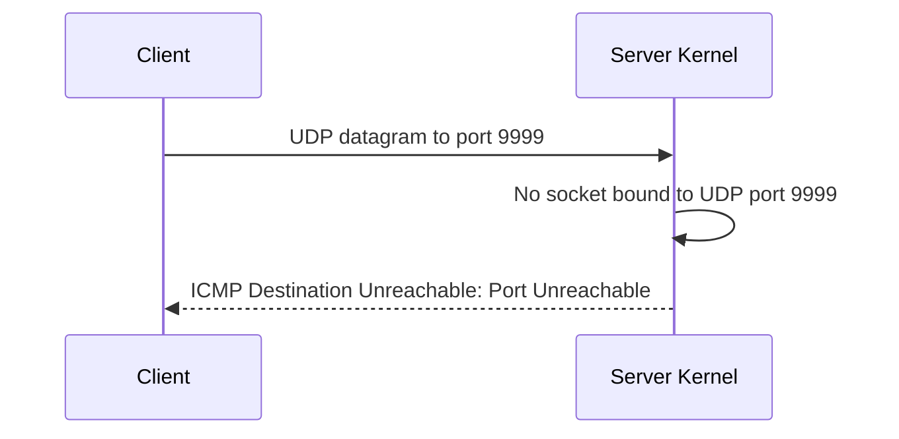

This is one reason UDP diagnostics differ from TCP diagnostics.

TCP normally uses a TCP Reset to reject a connection to a closed TCP port.

---

## 27.4 Fragmentation-needed example

A router receives:

```text
Packet length: 1500
DF flag:       set
Outgoing MTU:  1400
```

The router:

1. Cannot fragment the packet.
2. Drops it.
3. Sends an ICMP Destination Unreachable message indicating fragmentation is needed.
4. May include the supported next-hop MTU.

The source can reduce future packet sizes.

---

## 27.5 Host unreachable versus no response

An explicit ICMP unreachable message differs from silence.

### Explicit error

The source receives a message indicating a known failure.

Example:

```text
Destination Host Unreachable
```

### Silence

The source receives no response.

Possible causes are broader:

* Packet dropped
* Destination offline
* Return path missing
* Device ignoring the probe
* Severe congestion
* Incorrect route
* Diagnostic response suppressed

Silence contains less diagnostic information.

---

# 28. ICMP Time Exceeded

## 28.1 What it is

An ICMP Time Exceeded message is commonly generated when a router reduces an IPv4 packet's TTL to zero.

Flow:

```text
Packet arrives with TTL 1
Router subtracts 1
TTL becomes 0
Router discards packet
Router may send ICMP Time Exceeded
```

---

## 28.2 Why it exists

It informs the source that the packet expired before reaching its destination.

Possible causes include:

* Intentionally small TTL used by a diagnostic tool
* Very long path
* Routing loop

---

## 28.3 Routing-loop example

Assume Router A and Router B have incorrect routes:

```text
Router A sends destination X to Router B
Router B sends destination X back to Router A
```

Without TTL:

```text
A → B → A → B → A → B ...
```

With TTL:

```text
TTL 4: A → B
TTL 3: B → A
TTL 2: A → B
TTL 1: B → A
TTL 0: discarded
```

TTL limits the damage caused by the loop.

---

# 29. How Traceroute Works

## 29.1 What traceroute is

Traceroute is a diagnostic technique that attempts to reveal routers along a path.

It relies on controlled TTL or hop-limit values.

The basic idea:

1. Send a probe with TTL 1.
2. The first router reduces it to zero and returns ICMP Time Exceeded.
3. Send a probe with TTL 2.
4. The second router returns ICMP Time Exceeded.
5. Continue increasing the TTL.
6. Eventually reach the destination.

---

## 29.2 Step-by-step example

Path:

```text
Client → Router A → Router B → Router C → Server
```

### Probe 1

```text
TTL = 1
```

Router A:

1. Decreases TTL to zero.
2. Discards the probe.
3. Sends ICMP Time Exceeded.

Traceroute records Router A.

---

### Probe 2

```text
TTL = 2
```

Router A decreases it to one.

Router B decreases it to zero and returns ICMP Time Exceeded.

Traceroute records Router B.

---

### Probe 3

```text
TTL = 3
```

Router C expires the probe and sends ICMP Time Exceeded.

Traceroute records Router C.

---

### Probe 4

```text
TTL = 4
```

The probe reaches the server.

How completion is signaled depends on the traceroute method.

For example:

* A UDP-based traceroute may receive ICMP Port Unreachable.
* An ICMP-based traceroute may receive Echo Reply.
* A TCP-based traceroute may receive TCP response behavior.

---

## 29.3 Sequence diagram

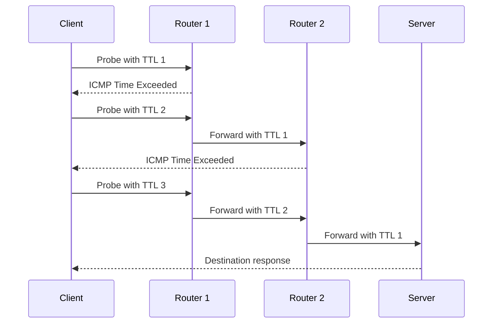

---

## 29.4 Linux traceroute

```bash
traceroute 203.0.113.20
```

### What it does

Sends probes with increasing TTL values and displays responding routers.

### Why it is useful

It helps locate:

* Where responses stop
* Sudden latency increases
* Path changes
* Routing loops
* Unexpected routes

### Important caution

A missing response from one hop does not prove that router is not forwarding traffic.

The router may:

* Forward packets normally
* Ignore TTL-expired probe responses
* Rate-limit ICMP
* Return responses through a different path

---

## 29.5 Disable name resolution

```bash
traceroute -n 203.0.113.20
```

### What it does

Displays numeric addresses instead of resolving router addresses to names.

### Why it is useful

It avoids DNS delays and separates path testing from name-resolution behavior.

---

## 29.6 ICMP-based traceroute

On many Linux implementations:

```bash
sudo traceroute -I 203.0.113.20
```

### What it does

Uses ICMP Echo probes instead of the default probe method.

### Why it is useful

Different probe protocols may receive different treatment along a path.

### Important flags

| Flag | Meaning                 |
| ---- | ----------------------- |
| `-I` | Use ICMP Echo probes    |
| `-n` | Disable name resolution |

Privilege requirements and flags vary by implementation.

Check:

```bash
traceroute --help
```

and:

```bash
man traceroute
```

---

## 29.7 TCP-based path tracing

Some traceroute implementations support TCP probes, but syntax varies.

A separate tool commonly available on Linux is `mtr`, which combines repeated path probing with latency and loss statistics.

Because tool behavior differs by distribution and package, always inspect local help rather than assuming a universal flag set.

---

## 29.8 Interpreting asterisks

Conceptual output:

```text
1  192.0.2.1       1.2 ms
2  * * *
3  198.51.100.9   15.4 ms
4  203.0.113.20   22.0 ms
```

The second hop did not respond to the probes.

However, later hops responded.

Therefore, Router 2 clearly forwarded the probes despite not identifying itself.

Do not conclude that the path failed at every `*`.

---

## 29.9 Per-hop latency misconception

Suppose output shows:

```text
Hop 4: 80 ms
Hop 5: 20 ms
```

It is incorrect to assume Hop 4 permanently adds 60 ms to forwarded traffic.

The router may prioritize transit forwarding over generating diagnostic responses.

The displayed time measures:

```text
Client → hop → client
```

for that particular probe and response.

It does not directly measure only the link between Hop 3 and Hop 4.

---

## 29.10 Asymmetric path limitation

Traceroute primarily reveals addresses on the forward path whose generated responses return successfully.

The ICMP responses may return through a different path.

Therefore, traceroute is not a complete map of both directions.

---

## Questions

1. Why does traceroute increase TTL one step at a time?
2. What causes the destination to stop returning Time Exceeded messages?
3. Why can a hop display `* * *` while later hops still respond?
4. Why does traceroute not provide a complete map of the return path?
5. How can ICMP rate limiting distort traceroute latency and loss observations?
6. Why might UDP-, ICMP-, and TCP-based traceroutes produce different results?
7. What pattern might suggest a routing loop?
8. Why should a latency increase at one hop be confirmed at later hops before treating it as a forwarding problem?

---

# 30. Observing IPv4 and ICMP with `tcpdump`

## 30.1 Capture ICMP traffic

```bash
sudo tcpdump -ni eth0 icmp
```

### What it does

Captures IPv4 ICMP traffic on `eth0`.

### Why it is useful

It can show:

* Echo Requests
* Echo Replies
* Destination Unreachable messages
* Time Exceeded messages

### Important flags

| Flag      | Meaning                        |
| --------- | ------------------------------ |
| `-n`      | Do not perform name resolution |
| `-i eth0` | Capture on `eth0`              |
| `icmp`    | Filter for IPv4 ICMP           |

---

## 30.2 Generate traffic

In another terminal:

```bash
ping -c 2 203.0.113.20
```

Conceptual capture:

```text
192.0.2.10 > 203.0.113.20: ICMP echo request
203.0.113.20 > 192.0.2.10: ICMP echo reply
```

Actual output includes additional fields.

---

## 30.3 Display verbose IPv4 details

```bash
sudo tcpdump -nvi eth0 icmp
```

### Important flag

```text
-v
```

Requests more verbose output.

Repeated verbosity flags may display more detail:

```bash
sudo tcpdump -nvvi eth0 icmp
```

Depending on the packet and implementation, output may include:

* TTL
* Identification
* Packet length
* Flags
* ICMP type

---

## 30.4 Display link-layer and IPv4 information

```bash
sudo tcpdump -eni eth0 icmp
```

This displays Ethernet information in addition to IP and ICMP details.

It lets you compare:

```text
Ethernet destination = next local hop
IPv4 destination     = final remote host
```

---

## 30.5 Limit capture size

```bash
sudo tcpdump -ni eth0 -c 10 icmp
```

### Important flag

```text
-c 10
```

Stops after ten matching packets.

This prevents the command from running indefinitely.

---

## 30.6 Save a packet capture

```bash
sudo tcpdump -ni eth0 -w icmp-test.pcap icmp
```

### What it does

Writes matching packets to a capture file instead of printing decoded output.

### Why it is useful

The file can be inspected later using:

* `tcpdump`
* Wireshark
* Other packet-analysis tools

Read it with:

```bash
tcpdump -nr icmp-test.pcap
```

### Important flags

| Flag      | Meaning                     |
| --------- | --------------------------- |
| `-w file` | Write raw packets to a file |
| `-r file` | Read packets from a file    |

### Safety concerns

Capture files can contain sensitive traffic and metadata.

Protect them like logs containing private information.

---

# 31. Practical Troubleshooting Scenario: Small Traffic Works, Large Traffic Fails

## Scenario

A user reports:

* DNS resolves correctly
* TCP connections begin successfully
* Small webpages load
* Large downloads stall
* Small ping requests work

This pattern suggests that basic routing exists.

It does not immediately prove an MTU issue, but MTU should be considered.

---

## Step 1: Confirm route selection

```bash
ip route get 203.0.113.20
```

Check:

* Interface
* Next hop
* Source address

---

## Step 2: Check interface MTU

```bash
ip link show dev eth0
```

Look for:

```text
mtu 1500
```

---

## Step 3: Test a larger non-fragmenting ping

```bash
ping -c 3 -M do -s 1472 203.0.113.20
```

If this fails, try a smaller payload:

```bash
ping -c 3 -M do -s 1400 203.0.113.20
```

Interpret cautiously because ICMP handling can differ from application traffic.

---

## Step 4: Capture ICMP errors

```bash
sudo tcpdump -ni eth0 'icmp'
```

Look for messages indicating that fragmentation is needed.

If oversized packets leave but no useful ICMP error returns, a Path MTU black hole becomes more plausible.

---

## Step 5: Use `tracepath`

```bash
tracepath 203.0.113.20
```

Look for observed PMTU changes.

---

## Step 6: Avoid premature conclusions

Other causes of large-transfer failure include:

* Application timeout
* TCP receive-window problems
* Packet loss
* Server resource exhaustion
* Tunnel misconfiguration
* Proxy behavior
* Unstable wireless link

The MTU hypothesis becomes stronger when packet-size-dependent behavior and relevant ICMP evidence align.

---

# 32. Common IPv4 and ICMP Misconceptions

## Misconception 1: IP packets always contain application data

Some IP packets carry control protocols such as ICMP.

Not every packet belongs to a user-facing application request.

---

## Misconception 2: TTL is measured in seconds

Modern forwarding normally treats IPv4 TTL as a hop limit.

It decreases once per router.

---

## Misconception 3: Ping tests whether a website works

Ping tests ICMP Echo behavior, not HTTP, TLS, DNS, or TCP port availability.

---

## Misconception 4: Every router must appear in traceroute

Routers can forward traffic without returning diagnostic responses.

---

## Misconception 5: All links support 1500-byte IP packets

Different link technologies and encapsulations can have different MTUs.

---

## Misconception 6: Fragmentation repairs packet loss

Fragmentation divides packets to fit a link.

It does not recover lost data.

In fact, fragmentation can make loss more costly.

---

## Misconception 7: A failed large ping proves the application path MTU

ICMP probes and application traffic may be treated differently.

Use multiple observations before concluding.

---

## Misconception 8: An ICMP error comes from the final destination

An intermediate router can generate ICMP errors.

Always inspect the source address and message type.

---

## Misconception 9: Blocking all ICMP has no effect except disabling ping

ICMP supports important error reporting and path behavior.

Suppressing necessary ICMP messages can make failures slower and harder to diagnose.

---

## Questions

1. Which observations would make an MTU problem more likely than an application timeout?
2. Why can a TCP handshake succeed when later data transfer fails because of packet size?
3. What packet-capture evidence would support a Path MTU black-hole diagnosis?
4. Why does a missing traceroute hop not necessarily identify the failure location?
5. How would a routing loop appear in TTL behavior and traceroute output?
6. Why can fragmentation increase retransmission cost for TCP?
7. What distinction should be made between a link MTU and the end-to-end path MTU?
8. Why can receiving an ICMP error be more useful than receiving no response?
9. Which layer should be investigated after IP delivery succeeds but a specific application still fails?
10. What information changes at each router, and what information normally remains end-to-end?

# Part 4 — Automatic Network Configuration with DHCP

# 33. Why Hosts Need Network Configuration

A host usually needs more than an IP address to communicate.

Typical IPv4 configuration includes:

| Configuration item     | Purpose                                              |
| ---------------------- | ---------------------------------------------------- |
| IPv4 address           | Identifies the interface                             |
| Prefix length          | Determines which destinations are local              |
| Default gateway        | Provides a route to remote networks                  |
| DNS server             | Resolves names into addresses                        |
| Lease lifetime         | Defines how long dynamic configuration remains valid |
| Optional search domain | Helps resolve short hostnames                        |
| MTU or static routes   | Supplies additional network-specific settings        |

Without correct configuration, different failures occur.

```text
Missing IP address
└── Host cannot participate normally in the IPv4 network

Wrong prefix
└── Host misclassifies local and remote destinations

Missing gateway
└── Local communication works, remote communication fails

Missing DNS server
└── IP communication may work, hostname-based communication fails
```

---

## 33.1 Static configuration

With static configuration, an administrator manually assigns parameters.

Example:

```text
Address:         192.0.2.10/24
Default gateway: 192.0.2.1
DNS server:      192.0.2.53
```

Static configuration is useful when an address should remain predictable.

Common cases include:

* Routers
* Infrastructure servers
* Printers
* Management interfaces
* Systems referenced by fixed addresses

Disadvantages include:

* Manual effort
* Configuration mistakes
* Duplicate addresses
* Difficult large-scale changes
* Poor suitability for temporary client devices

---

## 33.2 Dynamic configuration

Dynamic configuration allows a host to request settings from network infrastructure.

For IPv4, the most common protocol is **DHCP**.

DHCP stands for **Dynamic Host Configuration Protocol**.

It can automatically supply:

* IPv4 address
* Subnet mask or prefix
* Default gateway
* DNS servers
* Lease lifetime
* Other optional parameters

---

## Questions

1. Why can a host reach local IP addresses while failing to reach remote networks?
2. Which configuration error could cause a host to ARP directly for remote destinations?
3. Why might servers use static configuration while employee laptops use dynamic configuration?
4. Can a host communicate using IP addresses when its DNS configuration is missing?
5. Why is an address alone insufficient to describe an interface's network configuration?

---

# 34. DHCP Mental Model

## 34.1 What DHCP is

DHCP is a client-server protocol that dynamically provides network configuration.

A newly connected client may initially know:

* Its own link-layer interface
* Its MAC address
* That it needs configuration

It may not yet know:

* Its IPv4 address
* The DHCP server's IP address
* Its local network prefix
* The default gateway

DHCP therefore supports communication before the client has a normal usable IPv4 configuration.

---

## 34.2 Why DHCP uses UDP

DHCP for IPv4 commonly uses UDP:

| Endpoint | UDP port |
| -------- | -------: |
| Server   |       67 |
| Client   |       68 |

UDP is appropriate because the client cannot initially establish an ordinary address-specific connection.

DHCP implements its own transaction and retry behavior over UDP.

A DHCP message is encapsulated approximately as:

```text
Ethernet
└── IPv4
    └── UDP
        └── DHCP message
```

---

## 34.3 Initial broadcast behavior

At startup, the client may not know:

* Its own IP address
* The server's IP address
* Whether the server is on the local subnet

An initial DHCP message may therefore use:

```text
Source IP:      0.0.0.0
Destination IP: 255.255.255.255

Source UDP port:      68
Destination UDP port: 67
```

At Ethernet level, it commonly uses broadcast:

```text
Destination MAC: ff:ff:ff:ff:ff:ff
```

This allows a local DHCP server or relay-capable network device to receive the request.

---

## 34.4 DHCP lease model

A DHCP-assigned address is normally leased, not permanently transferred.

The server tells the client:

> You may use this address for a defined period.

The client must renew the lease to continue using it.

This lets the server:

* Reuse addresses
* Change network configuration
* Track allocations
* Remove expired assignments
* Support mobile or temporary devices

---

## 34.5 Simplified DHCP state flow

A common initial acquisition process is abbreviated as **DORA**:

```text
Discover
Offer
Request
Acknowledgement
```

This is a useful mental model, though real DHCP behavior includes additional messages and state transitions.

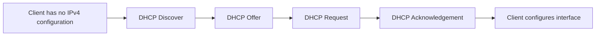

---

## Questions

1. Why can a DHCP client not simply send its first message to the server's unicast IP address?
2. Why does DHCP use a lease instead of permanently assigning every discovered device?
3. What roles do UDP ports 67 and 68 distinguish?
4. Why is `0.0.0.0` appropriate as an initial source address?
5. What information must the client obtain before it can decide whether a destination is local?

---

# 35. Initial DHCP Address Acquisition

Assume a client joins this network:

```text
Network:          192.0.2.0/24
DHCP server:      192.0.2.53
Default gateway:  192.0.2.1
DNS server:       192.0.2.53
Proposed client:  192.0.2.100
Lease time:       8 hours
```

The client initially has no assigned IPv4 address.

---

## 35.1 Step 1: DHCP Discover

The client sends a DHCP Discover message.

Conceptual fields:

```text
Ethernet source:      Client MAC
Ethernet destination: ff:ff:ff:ff:ff:ff

IPv4 source:          0.0.0.0
IPv4 destination:     255.255.255.255

UDP source port:      68
UDP destination port: 67

DHCP message type:    Discover
Transaction ID:       0x4a31b20c
```

The transaction ID helps the client associate replies with its request.

The Discover may include requests for configuration options such as:

* Subnet mask
* Router
* DNS servers
* Domain name
* Lease duration

It may also include a client identifier or previously used address information.

---

## 35.2 Step 2: DHCP Offer

A DHCP server receives the Discover and selects an available address.

It sends an Offer containing a proposal.

Conceptually:

```text
Offered address: 192.0.2.100
Subnet mask:     255.255.255.0
Router:          192.0.2.1
DNS server:      192.0.2.53
Lease time:      8 hours
Server ID:       192.0.2.53
Transaction ID:  0x4a31b20c
```

The matching transaction ID allows the client to identify the offer as a response to its Discover.

The Offer may be broadcast or unicast depending on the client's state, flags, and network behavior.

---

## 35.3 Step 3: DHCP Request

The client selects an offer and sends a DHCP Request.

The request commonly identifies:

* Requested IP address
* Selected DHCP server
* Transaction ID

Why broadcast the selection?

There may be multiple DHCP servers.

Broadcasting the Request informs:

* The selected server that its offer was accepted
* Other servers that their offers were not selected

Conceptual message:

```text
DHCP message type:       Request
Requested IP address:    192.0.2.100
Selected server:         192.0.2.53
Transaction ID:          0x4a31b20c
```

---

## 35.4 Step 4: DHCP Acknowledgement

The selected server sends a DHCP Acknowledgement, commonly called **DHCPACK**.

The acknowledgement confirms:

* Address assignment
* Prefix or mask
* Lease time
* Default gateway
* DNS servers
* Other options

After receiving and accepting the acknowledgement, the client configures its interface.

---

## 35.5 Step 5: Client applies configuration

The client may perform actions such as:

1. Check whether the address appears to be in use.
2. Assign the address to the interface.
3. Add a connected route.
4. Add a default route.
5. Configure DNS resolver information.
6. Start lease timers.
7. Send announcements indicating its use of the address.

Exact behavior differs by operating system and DHCP client implementation.

---

## 35.6 Full initial sequence

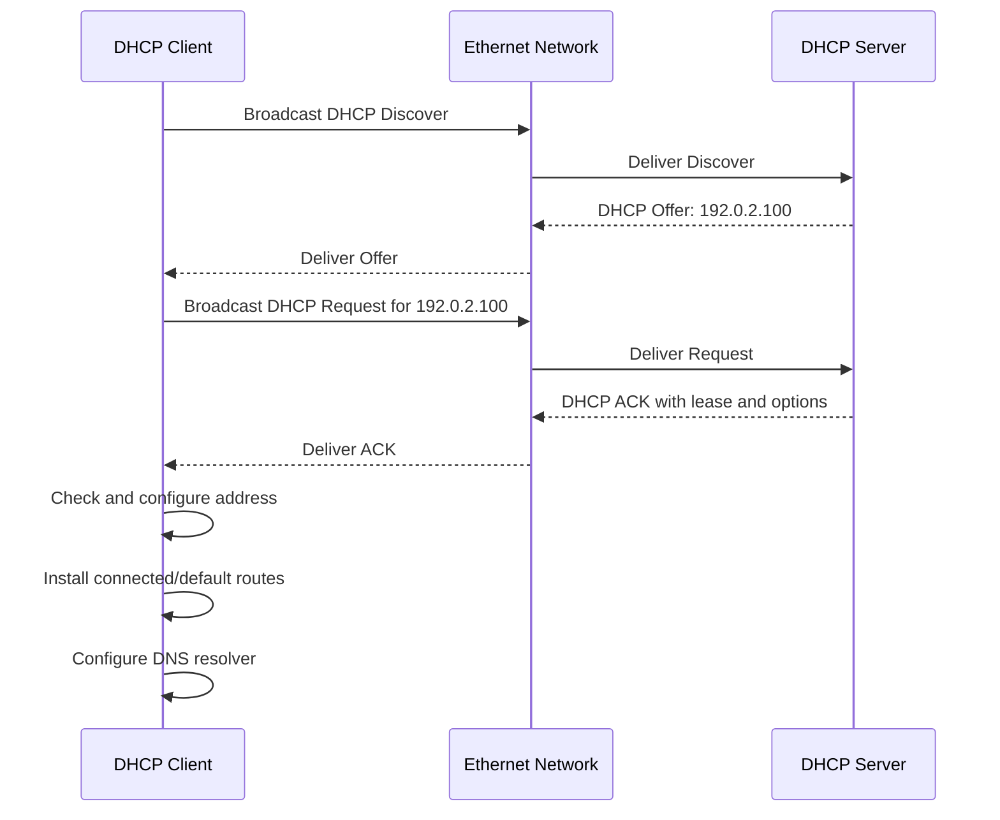

---

## 35.7 Resulting client state

After successful configuration:

```text
Interface:       eth0
Address:         192.0.2.100/24
Connected route: 192.0.2.0/24 dev eth0
Default route:   via 192.0.2.1 dev eth0
DNS server:      192.0.2.53
Lease expires:   8 hours after assignment
```

The client can now classify destinations, resolve local neighbors, and route remote traffic.

---

## Questions

1. How does the client associate a DHCP Offer with its own Discover?
2. Why may the DHCP Request be broadcast even after the client knows the selected server's address?
3. At what point can the client install a connected route?
4. Why might the client check whether the offered address is already in use?
5. Which DHCP-supplied value controls whether `192.0.2.25` is treated as local?
6. Which DHCP-supplied value is used when sending to `203.0.113.20`?
7. How can multiple DHCP servers coexist during the offer phase?

---

# 36. DHCP Message Types

The initial DORA sequence uses only part of DHCP.

Important DHCPv4 message types include:

| Message        | Purpose                                                  |
| -------------- | -------------------------------------------------------- |
| `DHCPDISCOVER` | Client searches for available servers                    |
| `DHCPOFFER`    | Server proposes configuration                            |
| `DHCPREQUEST`  | Client requests or confirms an address                   |
| `DHCPACK`      | Server confirms the lease                                |
| `DHCPNAK`      | Server rejects the requested configuration               |
| `DHCPDECLINE`  | Client reports that the offered address appears unusable |
| `DHCPRELEASE`  | Client voluntarily releases a lease                      |
| `DHCPINFORM`   | Client requests options without asking for an address    |

---

## 36.1 DHCPNAK

A DHCP server may send a negative acknowledgement when the client's requested configuration is invalid.

Possible situations:

* Client moved to another subnet
* Previously used address is no longer valid
* Requested lease cannot be honored
* Server policy rejects the request

After receiving a valid DHCPNAK, the client normally stops using the rejected configuration and begins acquisition again.

---

## 36.2 DHCPDECLINE

A client may detect that an offered address is already in use.

It can send a DHCPDECLINE to the server.

The server may mark the address as temporarily unusable and investigate or delay reallocation.

This does not guarantee perfect duplicate-address prevention, because detection can fail or conflicting devices may appear later.

---

## 36.3 DHCPRELEASE

A client can tell the server that it no longer needs the lease.

The server may return the address to the available pool.

Clients do not always successfully send a Release.

Examples:

* Sudden power loss
* Network disconnection
* Operating system crash
* Device leaves Wi-Fi range

Lease expiration is therefore still necessary.

---

## 36.4 DHCPINFORM

A client that already has an IPv4 address may request other configuration options without requesting a new address.

For example, it may request:

* DNS server information
* Domain settings
* Other site-specific options

---

## Questions

1. Why is lease expiration necessary even though DHCPRELEASE exists?
2. What should a client do after receiving a DHCPNAK for its current address?
3. Why can DHCPDECLINE reduce duplicate allocation without guaranteeing that duplicates never occur?
4. How does DHCPINFORM differ from the initial address-acquisition process?
5. What observable difference would you expect between a DHCPNAK and receiving no server response?

---

# 37. DHCP Lease Renewal

## 37.1 Why renewal exists

A dynamically assigned address is valid only for its lease period.

The client attempts to renew before expiration.

This avoids unnecessary interruption while allowing the server to retain control of the address.

---

## 37.2 Lease timers

DHCP leases commonly involve:

* Lease duration
* Renewal time, often called **T1**
* Rebinding time, often called **T2**

A common default relationship is approximately:

```text
T1 ≈ 50% of lease duration
T2 ≈ 87.5% of lease duration
```

These are common defaults, not fixed requirements. The server may provide timer values.

For an eight-hour lease, a simplified example might be:

```text
Lease start:  08:00
T1:           12:00
T2:           15:00
Lease expiry: 16:00
```

---

## 37.3 Renewal phase

At T1, the client attempts to renew with the server that granted the lease.

Because the client now has a usable address and knows the server, the request may be unicast.

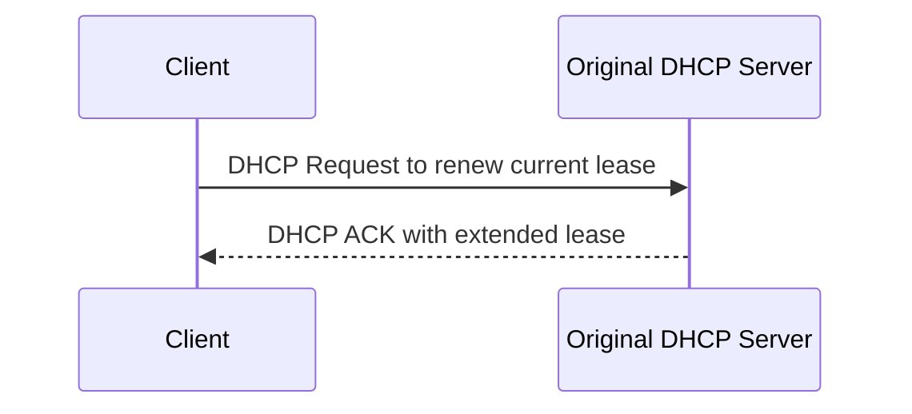

If successful:

* Address remains configured
* Lease timers restart
* Options may be refreshed

---

## 37.4 Rebinding phase

If the original server does not respond, the client eventually reaches T2.

It then attempts to rebind with any available DHCP server.

The request is commonly broadcast because the original server may be unavailable.

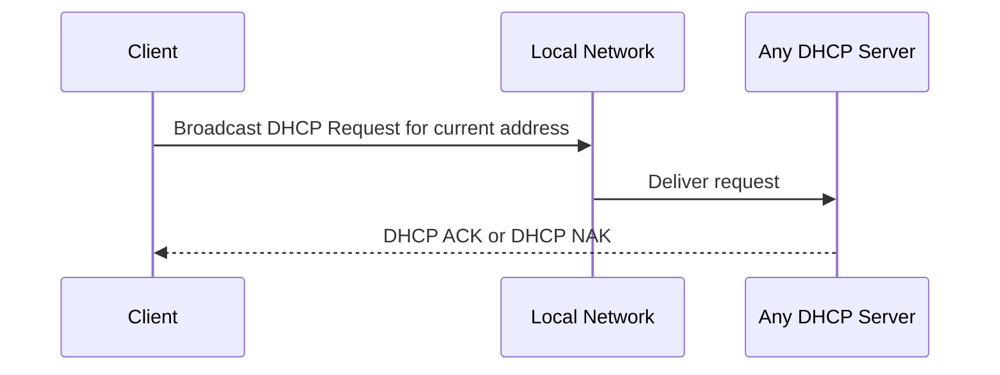

---

## 37.5 Lease expiration

If the lease expires without successful renewal or rebinding, the client should stop using the address.

Continuing to use an expired address could create conflicts if the server reallocates it.

The client returns to an address-acquisition state.

---

## 37.6 Temporary server failure

A DHCP server becoming temporarily unavailable does not necessarily disconnect all clients immediately.

Existing clients can normally keep using valid leases until expiration.

The practical impact depends on:

* Remaining lease duration
* Whether new devices need addresses
* Whether clients reboot
* Whether renewal succeeds later

---

## Questions

1. Why does a client first try the original server instead of immediately broadcasting?
2. Why does the client broaden its request during rebinding?
3. What risk arises if a client continues using an address after lease expiration?
4. Why might a DHCP outage affect newly connected devices before existing devices?
5. How does a short lease time change DHCP server load and client dependence?
6. Can DHCP options change during renewal even when the IP address remains the same?

---

# 38. DHCP Relay

## 38.1 The broadcast limitation

Initial DHCP clients use local broadcasts.

Routers normally do not forward ordinary IPv4 broadcasts between subnets.

Therefore, a DHCP server on one subnet would not automatically receive Discover messages from another subnet.

Example:

```text
Client subnet: 192.0.2.0/24
DHCP server:   198.51.100.20
```

A router separates the two broadcast domains.

Without an additional mechanism, the Discover remains on `192.0.2.0/24`.

---

## 38.2 What a DHCP relay does

A DHCP relay receives DHCP client broadcasts and forwards them toward a DHCP server, usually using unicast IP communication.

The relay also includes information identifying the client's originating network.

This lets the server select an address from the correct pool.

---

## 38.3 Relay data flow

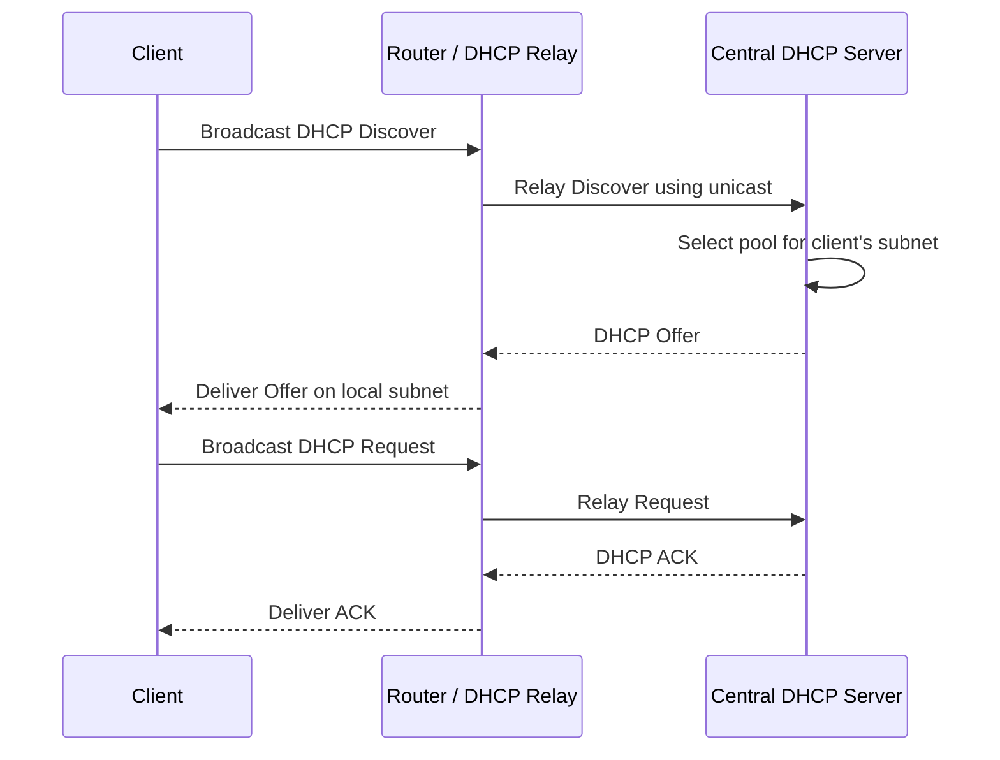

---

## 38.4 Where the relay fits

The relay is often placed on the router or Layer-3 interface serving the client subnet.

It knows which interface received the client broadcast.

It can therefore indicate:

```text
This request came from the 192.0.2.0/24 client network.
```

The DHCP server uses that information to choose:

* Address pool
* Prefix
* Gateway
* DNS options
* Lease policy

---

## 38.5 Centralized server architecture

Without relay:

```text
One DHCP server per subnet
```

With relay:

```text
Many client subnets
        │
        ▼
DHCP relays
        │
        ▼
Central DHCP server
```

This simplifies administration but introduces dependencies:

* Relay configuration must be correct
* Routing to the server must work
* Server must have matching address pools
* Replies must return through the relay

Detailed enterprise redundancy design is outside the current scope.

---

## 38.6 Relay failure scenario

Symptoms:

* Clients on one subnet cannot obtain addresses
* Clients on another subnet work
* DHCP server is operational
* Local Discover messages are visible
* No relayed request reaches the server

Possible causes:

* Relay not configured on that client subnet
* Wrong server address configured in relay
* Route to DHCP server missing
* Server lacks a pool for the source subnet
* Relay traffic is dropped
* Return path to relay is missing

This differs from a local DHCP server failure because the fault may be subnet-specific.

---

## Questions

1. Why does a DHCP relay need to identify the client's original subnet?
2. Why can one centralized DHCP server allocate different prefixes to different client networks?
3. Which device commonly performs the relay function?
4. Why might clients on one subnet fail while clients on another subnet continue working?
5. What evidence would distinguish a missing relay configuration from an exhausted DHCP pool?
6. Why does ordinary IP routing alone not deliver the initial client broadcast to a remote server?

---

# 39. DHCP Options

## 39.1 What options are

DHCP options carry configuration parameters beyond the basic address assignment.

Common options include:

| Option category    | Example                           |
| ------------------ | --------------------------------- |
| Subnet information | Subnet mask                       |
| Routing            | Default router                    |
| Name resolution    | DNS server                        |
| Naming             | Domain name or search information |
| Lease control      | Lease duration and renewal timers |
| Boot support       | Boot server or boot filename      |
| Network behavior   | MTU or classless static routes    |

Not every network supplies every option.

---

## 39.2 Default router option

The router option commonly provides one or more default-gateway addresses.

Example:

```text
Router: 192.0.2.1
```

The client may install:

```text
default via 192.0.2.1 dev eth0
```

The gateway address must normally be reachable on the local link.

---

## 39.3 DNS server option

Example:

```text
DNS servers:
192.0.2.53
198.51.100.53
```

The operating system or network manager passes this information to the local resolver configuration.

The exact storage and management differ across systems:

* Direct resolver file
* System resolver service
* Network manager
* Per-interface DNS configuration
* Local caching resolver

---

## 39.4 Classless static routes

DHCP can supply routes beyond a default gateway.

Conceptual example:

```text
Destination: 10.20.0.0/16
Next hop:    192.0.2.254
```

The client may install a route equivalent to:

```text
10.20.0.0/16 via 192.0.2.254
```

This lets a network dynamically distribute specific routing information to clients.

Behavior depends on client support and local policy.

---

## 39.5 Option ordering and precedence

A system can receive configuration from multiple sources:

* DHCP
* Manual settings
* VPN software
* Network manager
* Static configuration files
* Container or virtual-machine tooling

The final active configuration may not exactly match one DHCP message.

When troubleshooting, inspect the actual kernel and resolver state rather than assuming the DHCP option was applied unchanged.

---

## Questions

1. Why might a client receive an IP address successfully but still lack Internet access?
2. Why should you inspect the active routing table rather than only the DHCP acknowledgement?
3. How could a DHCP-supplied static route override use of the default gateway?
4. Why might two interfaces provide different DNS configuration?
5. What distinction exists between a DHCP server offering an option and the operating system applying it?

---

# 40. DHCP Address Pools and Reservations

## 40.1 Address pool

A DHCP server typically manages a range of assignable addresses.

Example:

```text
Subnet:       192.0.2.0/24
Gateway:      192.0.2.1
Server:       192.0.2.53
Dynamic pool: 192.0.2.100–192.0.2.199
```

Addresses outside the pool may be reserved for:

* Routers
* Servers
* Printers
* Static infrastructure
* Future use

The server should not dynamically allocate addresses known to be statically assigned.

---

## 40.2 Reservation

A reservation associates a known client identity with a predictable address.

Conceptually:

```text
Client identifier: workstation-42
Reserved address:  192.0.2.120
```

MAC addresses are often used in simple deployments, though DHCP can identify clients in other ways.

A reservation still uses DHCP.

This means the client can receive:

* Predictable address
* Gateway
* DNS configuration
* Lease management
* Centralized updates

---

## 40.3 Reservation versus static configuration

| Property                               | DHCP reservation             | Static client configuration               |
| -------------------------------------- | ---------------------------- | ----------------------------------------- |
| Address selected centrally             | Yes                          | No                                        |
| Client uses DHCP                       | Yes                          | No                                        |
| Gateway/DNS updated centrally          | Usually                      | Must be changed manually                  |
| Works if DHCP unavailable after reboot | Usually not for acquisition  | Yes, assuming other network services work |
| Duplicate-address risk                 | Lower when managed correctly | Higher if records are poor                |
| Predictable address                    | Yes                          | Yes                                       |

---

## 40.4 Pool exhaustion

Pool exhaustion occurs when no suitable address remains available.

Possible causes:

* More clients than available addresses
* Leases are too long
* Abandoned leases remain active
* Incorrectly small pool
* Unexpected devices
* Address-management errors
* Multiple client identifiers from one physical device

Symptoms:

* Existing clients continue working
* New clients fail to obtain addresses
* DHCP Discover and Request traffic repeats
* Server logs indicate no available leases
* Some clients may assign IPv4 link-local addresses

---

## 40.5 Duplicate allocation risk

A DHCP server's records can become inconsistent with actual network use.

Example:

1. An administrator manually assigns `192.0.2.150`.
2. The address remains inside the dynamic DHCP pool.
3. The DHCP server later leases `192.0.2.150` to another device.
4. Both devices claim the address.

Prevent this by maintaining a consistent address plan.

---

## Questions

1. Why should statically assigned addresses normally be excluded from the dynamic pool?
2. How can a DHCP reservation provide central control while preserving a predictable address?
3. Why might pool exhaustion affect only new clients?
4. How could one physical device consume multiple leases?
5. Why is increasing lease duration a tradeoff rather than an unconditional improvement?
6. What evidence would distinguish pool exhaustion from complete DHCP-server failure?

---

# 41. DHCP Failure Scenarios

## 41.1 No DHCP response

Client repeatedly sends Discover messages but receives no Offer.

Possible causes:

* DHCP server is down
* Client is on the wrong physical network
* Relay is missing
* Network path to server is broken
* Server has no matching subnet configuration
* Broadcast is not reaching the server or relay
* Response cannot return to client
* Client interface is not fully connected

Observed pattern:

```text
Client → DHCP Discover
Client → DHCP Discover
Client → DHCP Discover
No Offer observed
```

---

## 41.2 Offer arrives but no acknowledgement

Possible sequence:

```text
Discover → Offer → Request → no ACK
```

Possible causes:

* Selected server did not receive Request
* Server state changed
* Address became unavailable
* Response path failed
* Another network issue interrupts the exchange
* Client rejected the Offer
* Server sent a NAK that was not noticed

Packet capture should determine whether an ACK or NAK was transmitted.

---

## 41.3 Client gets address but cannot reach gateway

Possible causes:

* Wrong subnet mask
* Wrong router option
* Address belongs to a different subnet
* Gateway unavailable
* Duplicate address
* Link path broken
* Client applied incorrect configuration

Check:

```bash
ip -brief address
ip route
ip neighbor
```

The fact that DHCP completed does not prove that the supplied settings are operational.

---

## 41.4 Client gets address but DNS fails

Possible causes:

* DHCP supplied no DNS server
* Incorrect DNS server address
* Resolver configuration was not applied
* DNS server unreachable
* DNS service unavailable
* Search-domain behavior causes unexpected queries

Test separately:

```text
Can reach destination by IP?
Can resolve hostname?
Can reach configured DNS server?
```

---

## 41.5 Link-local fallback

A client may assign itself an address in:

```text
169.254.0.0/16
```

This often indicates that normal DHCP acquisition failed.

The host may still communicate with some link-local peers, but it usually lacks:

* Normal default gateway
* Expected DNS settings
* Access to routed networks

Do not treat the link-local address as the original cause. It is often a fallback result.

---

## 41.6 Stale lease after moving networks

A laptop moves from one network to another and attempts to reuse an old address.

Example:

```text
Old network: 192.0.2.0/24
New network: 198.51.100.0/24
Old address: 192.0.2.100
```

The old address is invalid on the new network.

A DHCP server may reject it, after which the client should obtain configuration appropriate for the new subnet.

Possible transient symptoms:

* No gateway reachability
* ARP requests for old-network addresses
* Delayed acquisition
* Temporary “connected but no network” state

---

## 41.7 Rogue or unintended DHCP server

A second DHCP server may respond with incorrect configuration.

Symptoms can include clients receiving inconsistent values:

```text
Client A:
Gateway 192.0.2.1
DNS 192.0.2.53

Client B:
Gateway 192.0.2.254
DNS 198.51.100.9
```

Potential results:

* Intermittent connectivity
* Wrong gateway
* Unexpected DNS behavior
* Clients placed in incorrect subnets
* Configuration changes after renewal

Detailed defensive controls belong to network security and enterprise management, which are outside the current scope. At the troubleshooting level, compare server identifiers and offered options.

---

## 41.8 Duplicate address after successful DHCP

DHCP completion does not guarantee the address remains unique forever.

Duplicates can arise because:

* Static address overlaps pool
* Multiple DHCP servers have overlapping pools
* Server database is inconsistent
* Device ignores normal configuration rules
* Address was manually copied

Symptoms often appear at ARP and neighbor level rather than in DHCP itself.

---

## Questions

1. What packet sequence distinguishes “no server response” from “server rejected the request”?
2. Why is a `169.254.x.x` address usually a symptom rather than the root cause?
3. How could an unintended DHCP server create intermittent rather than complete failure?
4. Why can DHCP succeed even when the default gateway is unusable?
5. How can stale configuration reveal that a device moved between networks?
6. What evidence would support the hypothesis of overlapping DHCP pools?
7. Why should DNS failure be isolated from DHCP address acquisition?

---

# 42. Observing DHCP on Linux

Linux DHCP behavior is often managed by a higher-level network service.

Possible managers include:

* NetworkManager
* `systemd-networkd`
* Distribution-specific networking tools
* A standalone DHCP client
* Container or virtual-machine software

The exact commands depend on the system.

Start by observing actual interface, route, resolver, and packet state.

---

## 42.1 Inspect active address configuration

```bash
ip -brief address
```

### What it does

Displays addresses assigned to each interface.

### Why it is useful

It answers:

* Was an IPv4 address assigned?
* Which prefix was applied?
* Is the address link-local?
* Which interface received it?

Example:

```text
eth0    UP    192.0.2.100/24
```

---

## 42.2 Inspect active routes

```bash
ip route
```

### What it does

Displays the IPv4 routing table.

### Why it is useful

It confirms whether DHCP configuration resulted in:

* Connected route
* Default route
* Additional routes

Conceptual expected output:

```text
default via 192.0.2.1 dev eth0
192.0.2.0/24 dev eth0 proto kernel scope link src 192.0.2.100
```

---

## 42.3 Inspect configured DNS servers

On systems using `systemd-resolved`:

```bash
resolvectl status
```

### What it does

Displays resolver configuration, often per interface.

### Why it is useful

It may show:

* DNS servers
* Search domains
* Per-interface DNS routing
* Resolver state

The command is not available or authoritative on every Linux system.

Another common file is:

```bash
cat /etc/resolv.conf
```

### Safety

Reading the file is safe.

Interpret it carefully because `/etc/resolv.conf` may:

* Be generated automatically
* Point to a local stub resolver
* Be managed by another service
* Not list upstream servers directly

---

## 42.4 Capture DHCP traffic

```bash
sudo tcpdump -ni eth0 'udp port 67 or udp port 68'
```

### What it does

Captures DHCPv4-related UDP traffic on `eth0`.

### Why it is useful

It reveals whether the client sends and receives:

* Discover
* Offer
* Request
* ACK
* NAK

### Important elements

| Expression    | Meaning                      |
| ------------- | ---------------------------- |
| `udp port 67` | DHCP server-side UDP traffic |
| `udp port 68` | DHCP client-side UDP traffic |
| `or`          | Match either condition       |

### Safety

DHCP captures can reveal:

* MAC addresses
* Device names
* Network addresses
* DNS settings
* Internal topology

Capture only where authorized.

---

## 42.5 Verbose DHCP decoding

```bash
sudo tcpdump -nvi eth0 'udp port 67 or udp port 68'
```

The `-v` flag requests more detailed decoding.

Depending on the implementation and packet, it may show:

* Transaction ID
* Offered address
* Server identifier
* Lease time
* Requested options
* Message type

Use additional verbosity cautiously:

```bash
sudo tcpdump -nvvi eth0 'udp port 67 or udp port 68'
```

---

## 42.6 Save a DHCP capture

```bash
sudo tcpdump -ni eth0 \
  -w dhcp-session.pcap \
  'udp port 67 or udp port 68'
```

Read it later:

```bash
tcpdump -nr dhcp-session.pcap
```

A graphical packet analyzer can provide more detailed field inspection.

### Safety

The capture file contains network configuration details. Store and share it carefully.

---

## 42.7 Check NetworkManager state

On systems using NetworkManager:

```bash
nmcli device status
```

### What it does

Displays device-management state.

### Why it is useful

It shows whether NetworkManager considers an interface:

* Connected
* Disconnected
* Unmanaged
* Connecting
* Unavailable

Inspect one device:

```bash
nmcli device show eth0
```

Potentially useful fields include:

* IPv4 address
* Gateway
* DNS servers
* Routes
* DHCP-related values

Exact field names can vary by version and configuration.

---

## 42.8 Check `systemd-networkd`

On systems using `systemd-networkd`:

```bash
networkctl status
```

For a specific interface:

```bash
networkctl status eth0
```

### What it does

Displays link and network configuration known to `systemd-networkd`.

### Why it is useful

It can expose:

* Operational state
* Address
* Gateway
* DNS server
* DHCP-related state
* Network file used

The command is relevant only when that subsystem manages the interface.

---

## 42.9 Renewing a lease carefully

Lease-renewal commands depend on the network manager.

Examples may involve:

* Reapplying a connection using NetworkManager
* Restarting a network-management service
* Invoking a standalone DHCP client
* Disconnecting and reconnecting an interface

Do not blindly run a command such as restarting networking on a remote machine. It can terminate the management session.

First determine which service owns the interface:

```bash
nmcli device status
```

or:

```bash
networkctl status
```

Then use that manager's documented operation.

---

# 43. Practical DHCP Walkthrough

## Objective

Observe a client obtaining IPv4 configuration.

Perform this only on a test system where disconnecting and reconnecting the interface is safe.

---

## Step 1: Record current state

```bash
ip -brief address
ip route
resolvectl status
```

`resolvectl` may not apply on every Linux system.

Record:

* Interface address
* Prefix
* Default gateway
* DNS server
* Interface name

---

## Step 2: Start a packet capture

```bash
sudo tcpdump -nvi eth0 \
  'udp port 67 or udp port 68'
```

Use the actual interface name.

---

## Step 3: Reconnect through the correct network manager

For a NetworkManager-controlled test interface, an example is:

```bash
nmcli device disconnect eth0
nmcli device connect eth0
```

### What the commands do

```text
nmcli device disconnect eth0
```

Disconnects and deactivates the device.

```text
nmcli device connect eth0
```

Requests that NetworkManager activate it.

### Safety concerns

This can immediately remove connectivity.

Do not run it:

* On a remote session using that interface
* On a production system
* Without a recovery path
* Unless NetworkManager actually controls the interface

---

## Step 4: Observe the exchange

Look for:

```text
DHCP Discover
DHCP Offer
DHCP Request
DHCP ACK
```

Packet analyzers may display names in slightly different forms.

---

## Step 5: Inspect resulting state

```bash
ip -brief address show dev eth0
ip route
ip neighbor
```

Check DNS configuration with the resolver tool appropriate to the system.

---

## Step 6: Correlate protocol with operating-system state

Build the mapping:

```text
DHCP ACK contains 192.0.2.100/24
        │
        ▼
ip address shows 192.0.2.100/24

DHCP ACK contains router 192.0.2.1
        │
        ▼
ip route shows default via 192.0.2.1

DHCP ACK contains DNS server 192.0.2.53
        │
        ▼
resolver status shows 192.0.2.53
```

This connects packet-level configuration to active kernel and resolver state.

---

# 44. DHCP Troubleshooting Workflow

Assume the client reports:

```text
Connected to Ethernet, but no normal IPv4 connectivity.
```

## Step 1: Confirm link state

```bash
ip -brief link
```

If the interface is not operational, DHCP cannot complete over that link.

---

## Step 2: Inspect address

```bash
ip -brief address
```

Possible findings:

### No IPv4 address

DHCP may not have completed.

### `169.254.x.x`

Normal DHCP may have failed and fallback configuration was applied.

### Unexpected subnet

A wrong DHCP server, stale configuration, or incorrect static setup may exist.

---

## Step 3: Capture DHCP packets

```bash
sudo tcpdump -ni eth0 'udp port 67 or udp port 68'
```

Classify the flow.

### Discover only

Investigate server, relay, local network path, or interface placement.

### Discover and Offer only

Investigate client Request behavior and return path.

### Discover, Offer, Request, ACK

DHCP exchange completed. Inspect whether the operating system applied the configuration.

### NAK observed

The server rejected the requested configuration. Determine why the requested address or network is invalid.

---

## Step 4: Verify applied address and prefix

```bash
ip address show dev eth0
```

Compare with the acknowledgement.

---

## Step 5: Verify route state

```bash
ip route
ip route get 203.0.113.20
```

Confirm:

* Default route exists
* Gateway is correct
* Source address is correct
* Interface is correct

---

## Step 6: Verify gateway neighbor resolution

```bash
ip neighbor show
```

Then test or capture ARP for the gateway.

A successful DHCP exchange can coexist with failed ARP to the gateway.

---

## Step 7: Verify DNS separately

Check the configured DNS server.

Then distinguish:

```text
Can reach remote IP address?
Can resolve hostname?
Can reach DNS server?
```

This prevents treating every post-DHCP problem as a DHCP problem.

---

## Step 8: Check service-specific logs

Identify the network manager first.

Examples:

```bash
systemctl status NetworkManager
```

or:

```bash
systemctl status systemd-networkd
```

Recent logs may be inspected with:

```bash
journalctl -u NetworkManager
```

or:

```bash
journalctl -u systemd-networkd
```

### What `journalctl -u` does

Displays logs for a particular systemd unit.

### Useful flags

```text
-u UNIT
```

Filters by service.

```text
-b
```

Limits logs to the current boot.

Example:

```bash
journalctl -b -u NetworkManager
```

### Safety

Reading logs is generally safe, but logs may contain:

* Hostnames
* Addresses
* Interface identifiers
* Network names
* Authentication-related metadata

Handle shared logs carefully.

---

# 45. Example DHCP Capture Interpretation

Conceptual capture:

```text
0.000000  0.0.0.0.68 > 255.255.255.255.67:
          DHCP Discover, transaction-id 0x4a31b20c

0.018221  192.0.2.53.67 > 255.255.255.255.68:
          DHCP Offer, offered-address 192.0.2.100,
          transaction-id 0x4a31b20c

0.020904  0.0.0.0.68 > 255.255.255.255.67:
          DHCP Request, requested-address 192.0.2.100,
          server-id 192.0.2.53,
          transaction-id 0x4a31b20c

0.030121  192.0.2.53.67 > 255.255.255.255.68:
          DHCP ACK, address 192.0.2.100,
          mask 255.255.255.0,
          router 192.0.2.1,
          DNS 192.0.2.53
```

## Interpretation

### Transaction ID

All messages refer to the same logical acquisition attempt.

### Offered address

The server proposes `192.0.2.100`.

### Server identifier

The client selects `192.0.2.53`.

### Acknowledgement options

The client receives enough data to configure:

```text
192.0.2.100/24
default via 192.0.2.1
DNS server 192.0.2.53
```

### What the capture does not prove

It does not prove that:

* Client applied the values
* Gateway responds
* DNS service works
* Address is conflict-free
* Remote routing works

Packet acquisition and active system state must both be checked.

---

# 46. DHCP and the Website Example

Return to:

```text
https://www.example.com/
```

Before the browser can retrieve the page, the host may need DHCP configuration.

## Stage 1: Link becomes available

The Ethernet or Wi-Fi interface becomes operational.

At this point, the device may have:

* MAC address
* Link connectivity
* No usable IPv4 configuration

---

## Stage 2: DHCP acquisition

The client obtains:

```text
Address:  192.0.2.100/24
Gateway:  192.0.2.1
DNS:      192.0.2.53
```

---

## Stage 3: Kernel installs network state

```text
Interface address:
192.0.2.100/24

Connected route:
192.0.2.0/24 dev eth0

Default route:
default via 192.0.2.1 dev eth0
```

---

## Stage 4: Resolver configuration is applied

The operating system learns to send DNS queries to:

```text
192.0.2.53
```

Because that address belongs to the local `/24`, the client treats it as directly connected.

---

## Stage 5: Browser begins name resolution

The browser or operating-system resolver asks:

```text
What address is associated with www.example.com?
```

To transmit the query:

1. Kernel performs route lookup for `192.0.2.53`.
2. Connected route is selected.
3. Client resolves the DNS server's MAC address.
4. Query is placed into an Ethernet frame.
5. Frame is sent across the local network.

DNS internals are covered later.

---

## Stage 6: Remote server address is obtained

Assume DNS returns:

```text
203.0.113.20
```

The client performs another route lookup.

The destination is remote, so it selects:

```text
default via 192.0.2.1
```

The client resolves the gateway MAC and begins transport-layer communication.

DHCP is therefore not part of every web request, but it establishes the configuration that later protocols depend on.

---

# 47. Common DHCP Misconceptions

## Misconception 1: DHCP only provides an IP address

DHCP can also supply:

* Prefix information
* Gateway
* DNS servers
* Lease timers
* Routes
* Other configuration options

---

## Misconception 2: A successful DHCP ACK proves Internet access

The acknowledgement proves only that a server supplied configuration.

The configuration might be:

* Incorrect
* Not applied
* Unusable
* Missing routes
* Pointing to unavailable infrastructure

---

## Misconception 3: DHCP traffic always stays on the local subnet

Client broadcasts stay local, but a relay can forward DHCP messages to a remote server.

---

## Misconception 4: A reservation is the same as static client configuration

A reservation still uses DHCP. The address is predictable, but configuration remains centrally supplied.

---

## Misconception 5: The DHCP server must be the default gateway

They can be different systems.

Example:

```text
DHCP server:     192.0.2.53
Default gateway: 192.0.2.1
```

---

## Misconception 6: The DNS server must be the DHCP server

The DHCP server can advertise any suitable DNS server address.

The roles may be combined in a home device, but they are logically distinct.

---

## Misconception 7: Renewing DHCP fixes every connectivity problem

Renewal may help when configuration is stale or invalid.

It does not repair:

* Broken cable
* Failed gateway
* Incorrect server application
* Remote routing failure
* Packet loss
* Transport failure

---

## Misconception 8: A link-local address proves the network cable is broken

A link-local address often indicates failure to obtain normal configuration.

The physical link may still be operational.

---

## Misconception 9: DHCP guarantees address uniqueness

DHCP reduces allocation conflicts when correctly administered, but duplicates can still occur through misconfiguration or unmanaged static addresses.

---

# 48. Security and Performance Considerations at This Level

Advanced network security is outside the requested scope, but several foundational implications are necessary for correct understanding.

## 48.1 DHCP does not inherently authenticate configuration

A basic client may accept configuration from a reachable DHCP server without strong proof that the server is trusted.

Practical implication:

* Unexpected configuration may come from an unintended server.
* DNS and gateway values should be inspected when behavior is inconsistent.

Detailed prevention mechanisms are an advanced infrastructure topic.

---

## 48.2 Lease duration tradeoff

### Short leases

Advantages:

* Addresses return to the pool quickly
* Configuration changes propagate sooner
* Useful for transient clients

Costs:

* More renewal traffic
* Greater dependence on server availability
* More frequent state changes

### Long leases

Advantages:

* Less DHCP traffic
* Clients tolerate short server outages longer
* More stable allocation

Costs:

* Addresses remain occupied longer
* Configuration changes propagate slowly
* Pool recovery is slower

---

## 48.3 Broadcast scope

Initial DHCP messages use broadcasts on the client link.

Large broadcast domains increase the number of devices that receive such frames.

DHCP traffic is normally small compared with application traffic, but broadcast-domain design affects how widely initial messages are delivered.

Detailed segmentation design is outside the current scope.

---

## 48.4 Central service dependency

Dynamic configuration introduces dependency on:

* DHCP server
* Relay
* Routing path
* Address pool
* Network manager

Existing clients may temporarily survive an outage due to active leases, but new or rebooted clients may fail earlier.

---

# 49. Recall and Diagnostic Questions

1. Trace every header and address used by the initial DHCP Discover:

   * Ethernet source and destination
   * IPv4 source and destination
   * UDP source and destination ports

2. Why can the client use UDP before it owns a normal IPv4 address?

3. A capture shows Discover, Offer, Request, and ACK, but `ip address` shows no address. Which component layer should be investigated next?

4. A client receives `192.0.2.100/24` and gateway `192.0.3.1`. Explain why this gateway is problematic.

5. A client receives an address and reaches local hosts but not remote IP addresses. Which DHCP option and kernel state should be checked?

6. A client reaches remote IP addresses but cannot resolve names. Which data flow should be traced?

7. Why do initial DHCP broadcasts require a relay when the server is on another subnet?

8. How does the server know which address pool to use for a relayed request?

9. What happens at T1, T2, and lease expiration?

10. Why can an eight-hour DHCP-server outage affect two clients differently?

11. A client repeatedly sends DHCP Discover messages. List evidence that would distinguish:

    * No server
    * Missing relay
    * Exhausted pool
    * Wrong client network
    * Return-path failure

12. How could two legitimate DHCP servers accidentally assign the same address?

13. Why does DHCP configuration affect later ARP behavior?

14. How does DHCP establish the prerequisites for DNS resolution and remote TCP connections?

15. Why should the active routing table and resolver state be inspected even after decoding a valid DHCP ACK?

# Part 5 — IPv6 Addressing, Neighbor Discovery, and Automatic Configuration

# 50. Why IPv6 Exists

## 50.1 The IPv4 scaling problem

IPv4 uses 32-bit addresses:

```text
2³² = 4,294,967,296 addresses
```

That total includes many addresses unavailable for ordinary public host assignment.

The growth of:

* Personal computers
* Mobile devices
* Cloud infrastructure
* Embedded systems
* Virtual machines
* Internet-connected services

made globally unique IPv4 addresses increasingly scarce.

Address translation allows many private hosts to share fewer public IPv4 addresses, but it introduces additional state and complexity.

IPv6 was designed with a much larger address space and a revised network-layer protocol.

---

## 50.2 What IPv6 is

IPv6 is the current-generation Internet Protocol using 128-bit addresses.

Example:

```text
2001:db8:1234:10::25
```

IPv6 performs the same broad network-layer role as IPv4:

* Logical addressing
* Packet delivery across networks
* Routing
* Packet-lifetime control
* Identification of upper-layer protocols

It is not merely IPv4 with longer addresses.

IPv6 also changes mechanisms such as:

* Header structure
* Fragmentation behavior
* Address configuration
* Neighbor discovery
* Broadcast usage
* Error reporting

---

## 50.3 Address-space size

IPv6 has:

```text
2¹²⁸
```

possible address values.

Written approximately:

```text
340 undecillion addresses
```

The practical purpose is not to assign every possible address.

The large space allows hierarchical allocation and very large local prefixes without relying on extreme address conservation.

---

## 50.4 IPv4 and IPv6 can coexist

A host may operate both protocols simultaneously.

Example:

```text
eth0
├── IPv4: 192.0.2.10/24
├── IPv6 link-local: fe80::5054:ff:fe12:3456/64
└── IPv6 global: 2001:db8:1234:10::10/64
```

This is called **dual stack**.

When an application resolves a hostname, DNS may return:

* An IPv4 address
* An IPv6 address
* Both

The operating system and application then choose an appropriate connection path.

IPv4 and IPv6 do not automatically share the same:

* Addresses
* Routes
* Neighbor tables
* Default gateways
* Packet headers
* Diagnostic protocols

They are separate network-layer protocols.

---

## Questions

1. Why is address translation not equivalent to increasing the IPv4 address space?
2. What network-layer responsibilities do IPv4 and IPv6 share?
3. Why does dual stack require separate routes and neighbor information?
4. Can a host have working IPv4 while its IPv6 connectivity is broken?
5. Why is IPv6 more than an addressing-format change?

---

# 51. IPv6 Address Representation

## 51.1 Full representation

An IPv6 address contains 128 bits.

It is written as eight groups of four hexadecimal digits:

```text
2001:0db8:1234:5678:0000:0000:abcd:0010
```

Each group represents 16 bits:

```text
8 groups × 16 bits = 128 bits
```

Each hexadecimal digit represents four bits.

```text
4 hexadecimal digits × 4 bits = 16 bits per group
```

---

## 51.2 Removing leading zeros

Leading zeros inside each group may be omitted.

Full:

```text
2001:0db8:1234:5678:0000:0000:abcd:0010
```

Shortened:

```text
2001:db8:1234:5678:0:0:abcd:10
```

The following represent the same address:

```text
0db8 = db8
0000 = 0
0010 = 10
```

Zeros in the middle or end of a nonzero group cannot simply be removed.

For example:

```text
1200 ≠ 12
```

---

## 51.3 Double-colon compression

One contiguous sequence of zero-valued groups may be replaced with `::`.

```text
2001:db8:1234:5678:0:0:abcd:10
```

becomes:

```text
2001:db8:1234:5678::abcd:10
```

The `::` represents enough zero groups to restore the address to eight groups.

---

## 51.4 Double colon may appear only once

This is valid:

```text
2001:db8::10
```

This is ambiguous and invalid:

```text
2001::db8::10
```

With two compressed regions, there would be no way to determine how many zero groups belong to each `::`.

---

## 51.5 Expanding an address

Given:

```text
2001:db8:20::5
```

Visible groups:

```text
2001
db8
20
5
```

Four groups are present.

An IPv6 address needs eight groups, so `::` represents four zero groups:

```text
2001:0db8:0020:0000:0000:0000:0000:0005
```

---

## 51.6 The unspecified address

Full form:

```text
0000:0000:0000:0000:0000:0000:0000:0000
```

Compressed form:

```text
::
```

This is the IPv6 unspecified address.

It plays a role similar to IPv4 `0.0.0.0` in certain contexts.

A host may use it as a source address before normal IPv6 configuration is complete.

---

## 51.7 Loopback address

Full form:

```text
0000:0000:0000:0000:0000:0000:0000:0001
```

Compressed form:

```text
::1
```

It identifies the local host.

Examples:

```text
IPv4 loopback: 127.0.0.1
IPv6 loopback: ::1
```

---

## 51.8 Writing an IPv6 address with a port

IPv6 addresses contain colons, while transport endpoints also use a colon before a port.

Therefore, IPv6 addresses are enclosed in brackets when combined with a port.

```text
[2001:db8::20]:443
```

Without brackets:

```text
2001:db8::20:443
```

it is unclear whether `443` is part of the address or a port.

URLs use the bracketed form:

```text
https://[2001:db8::20]/
```

---

## Questions

1. Why can `::` appear only once in an IPv6 address?
2. Expand `2001:db8:1::25` to eight four-digit groups.
3. Why are square brackets required around an IPv6 address in a URL containing a port?
4. Are `2001:db8::1` and `2001:0db8:0:0:0:0:0:1` equivalent?
5. Why can leading zeros be removed while trailing zeros inside a group cannot?

---

# 52. IPv6 Prefixes

## 52.1 Prefix notation

IPv6 uses CIDR-style prefix lengths.

Example:

```text
2001:db8:1234:10::25/64
```

The `/64` means:

```text
First 64 bits:  network prefix
Last 64 bits:   interface identifier portion
```

The containing network is:

```text
2001:db8:1234:10::/64
```

---

## 52.2 Why `/64` is common

A `/64` is the standard subnet size for many ordinary IPv6 local networks.

It divides the address into:

```text
64-bit network prefix
64-bit interface identifier
```

Several IPv6 mechanisms, particularly Stateless Address Autoconfiguration, are designed around `/64` prefixes.

This does not mean every IPv6 route must be `/64`.

Other prefix lengths appear in:

* Routing tables
* Point-to-point links
* Provider allocations
* Host routes
* Loopback-style addresses

But `/64` is the normal expectation for many end-host LANs.

---

## 52.3 Hexadecimal boundary calculation

Because each hexadecimal digit represents four bits, prefixes divisible by four align cleanly with hexadecimal digits.

Examples:

| Prefix | Fixed hexadecimal digits |
| -----: | -----------------------: |
|  `/32` |                        8 |
|  `/48` |                       12 |
|  `/56` |                       14 |
|  `/64` |                       16 |
| `/128` |                       32 |

An IPv6 address has 32 hexadecimal digits in total.

---

## 52.4 `/64` example

Address:

```text
2001:db8:1234:10:abcd:ef01:2345:6789/64
```

Network portion:

```text
2001:db8:1234:10
```

Interface portion:

```text
abcd:ef01:2345:6789
```

Network prefix:

```text
2001:db8:1234:10::/64
```

---

## 52.5 Non-hexadecimal boundary example

Consider:

```text
2001:db8:1234:12a5::1/60
```

A `/60` fixes 15 hexadecimal digits because:

```text
60 ÷ 4 = 15
```

Expand the relevant beginning:

```text
2001:0db8:1234:12a5
```

The first 15 hexadecimal digits are:

```text
20010db8123412a
```

The final nibble of the fourth group belongs to the host portion.

Therefore, the network is:

```text
2001:db8:1234:12a0::/60
```

That `/60` contains sixteen `/64` networks:

```text
2001:db8:1234:12a0::/64
through
2001:db8:1234:12af::/64
```

---

## 52.6 Host route

A `/128` identifies one exact IPv6 address.

Example:

```text
2001:db8::25/128
```

It can appear as:

* A host-specific route
* A logical interface address
* An exact policy match

---

## 52.7 IPv6 has no subnet broadcast address

IPv4 commonly reserves the highest address of a subnet as a broadcast address.

IPv6 does not use subnet broadcast addresses.

Instead, IPv6 uses multicast groups for communication with multiple nodes.

Therefore, an IPv6 `/64` does not reserve:

```text
2001:db8:1234:10:ffff:ffff:ffff:ffff
```

as a subnet broadcast address.

IPv6 address-count reasoning should not mechanically copy IPv4's “network address plus broadcast address” model.

---

## Questions

1. Why is `/64` common for IPv6 host networks?
2. What network contains `2001:db8:abcd:25::99/64`?
3. Why is there no IPv6 equivalent of an IPv4 subnet broadcast address?
4. How many `/64` networks fit inside a `/60`?
5. What does an IPv6 `/128` identify?
6. Why are prefixes divisible by four easier to calculate in hexadecimal?

---

# 53. Major IPv6 Address Types

## 53.1 Global unicast

Global unicast addresses are intended for routed communication beyond the local link.

A commonly used global unicast range is broadly associated with:

```text
2000::/3
```

Example documentation address:

```text
2001:db8:1234:10::25
```

`2001:db8::/32` is reserved for documentation.

A global unicast address is conceptually similar to a public IPv4 address, but actual reachability still depends on:

* Routing
* Interface state
* Remote host state
* Application availability
* Network policy

The word “global” does not guarantee that every Internet host can reach it.

---

## 53.2 Link-local addresses

IPv6 link-local addresses use:

```text
fe80::/10
```

Hosts commonly use link-local addresses for communication on the current link.

Example:

```text
fe80::5054:ff:fe12:3456
```

Link-local addresses are important for:

* Neighbor Discovery
* Router Discovery
* Default-router communication
* Local-link control traffic
* Operation before global addressing is available

IPv6 interfaces normally create a link-local address automatically when IPv6 is enabled.

---

## 53.3 Why link-local addresses require an interface

The same link-local address could theoretically exist on multiple interfaces because its scope is only one link.

A host with two interfaces may need to know:

```text
Which fe80::1?
```

Therefore, tools often require a zone or interface identifier.

Example:

```bash
ping -6 -c 3 fe80::1%eth0
```

Here:

```text
%eth0
```

specifies the interface scope.

The exact syntax varies by operating system and command.

---

## 53.4 Unique local addresses

Unique local addresses use:

```text
fc00::/7
```

In ordinary deployments, locally assigned unique local prefixes commonly begin with:

```text
fd
```

Example:

```text
fd12:3456:789a:1::20
```

They are intended for private internal communication and are not normally routed on the public Internet.

They are conceptually similar to private IPv4 ranges, but the addressing and allocation model differs.

A unique local address is not automatically:

* Encrypted
* Authenticated
* Protected from local access
* Secure

---

## 53.5 Loopback

```text
::1/128
```

Used for communication within the current host.

Example:

```bash
ping -6 -c 3 ::1
```

This tests the local IPv6 stack, not the physical network.

---

## 53.6 Unspecified address

```text
::/128
```

Used when a normal source address is not yet available or in wildcard configuration contexts.

It must not be treated as a normal remote destination.

---

## 53.7 Multicast addresses

IPv6 multicast addresses begin with:

```text
ff00::/8
```

Multicast sends traffic to a group of interested interfaces.

Important examples include:

| Address   | General purpose                    |
| --------- | ---------------------------------- |
| `ff02::1` | All IPv6 nodes on the local link   |
| `ff02::2` | All IPv6 routers on the local link |

The `2` in `ff02` indicates link-local scope.

Routers do not forward link-local multicast beyond the link.

---

## 53.8 No broadcast

IPv6 does not define a broadcast address.

Tasks that use broadcast in IPv4 are typically handled using multicast in IPv6.

Examples:

| IPv4 mechanism                     | IPv6 approach                         |
| ---------------------------------- | ------------------------------------- |
| ARP broadcast                      | Neighbor Discovery multicast          |
| Router-related broadcast discovery | Router Discovery multicast            |
| Broadcast to all local hosts       | All-nodes multicast where appropriate |

This limits delivery to a relevant group rather than automatically targeting every node for every function.

---

## 53.9 Anycast

Anycast uses the same unicast address on multiple interfaces or systems.

Routing delivers a packet toward one available instance according to the routing topology.

Simplified mental model:

```text
Same service address
├── Server A in location A
├── Server B in location B
└── Server C in location C

Routing selects one reachable instance
```

At the packet format level, an anycast address appears like a unicast address.

Anycast behavior comes from how the address is assigned and routed.

Detailed global anycast deployment is beyond the requested scope.

---

## 53.10 Address-type summary

| Type           | Example                 | Scope or purpose                 |
| -------------- | ----------------------- | -------------------------------- |
| Global unicast | `2001:db8::20`          | Routed communication             |
| Link-local     | `fe80::20`              | Current link                     |
| Unique local   | `fd12:3456::20`         | Private routed networks          |
| Loopback       | `::1`                   | Current host                     |
| Unspecified    | `::`                    | No specific address              |
| Multicast      | `ff02::1`               | Group communication              |
| Anycast        | Ordinary unicast format | One of multiple routed instances |

---

## Questions

1. Why can a host use its link-local address before obtaining a global IPv6 address?
2. Why must a link-local destination sometimes include an interface name?
3. How does multicast replace some IPv4 broadcast functions?
4. Why is a unique local address not equivalent to encryption?
5. How does an anycast address differ operationally from a normal unicast address?
6. Which address would you use to test only the local IPv6 stack?
7. Why does a global unicast address not guarantee global reachability?

---

# 54. The IPv6 Base Header

## 54.1 Simplified structure

The IPv6 base header has a fixed size of 40 bytes.

```text
+---------------------------------------------------------------+
| Version | Traffic Class | Flow Label                          |
+---------------------------------------------------------------+
| Payload Length        | Next Header     | Hop Limit           |
+---------------------------------------------------------------+
| Source IPv6 Address                                         |
|                                                               |
+---------------------------------------------------------------+
| Destination IPv6 Address                                    |
|                                                               |
+---------------------------------------------------------------+
```

Unlike the basic IPv4 header, the IPv6 base header does not contain:

* Header-length field
* Header checksum
* Fragment offset
* Fragmentation flags
* Header options directly inside the base header

Optional functions are generally represented using extension headers.

---

## 54.2 Version

```text
Version = 6
```

This identifies the packet as IPv6.

---

## 54.3 Payload Length

The payload-length field describes the number of bytes following the 40-byte base header.

That payload can contain:

* A transport segment
* An ICMPv6 message
* One or more extension headers followed by another protocol

---

## 54.4 Next Header

The Next Header field identifies what follows the current header.

It may identify:

* TCP
* UDP
* ICMPv6
* An IPv6 extension header

Common protocol numbers include:

| Value | Meaning |
| ----: | ------- |
|   `6` | TCP     |
|  `17` | UDP     |
|  `58` | ICMPv6  |

If an extension header is present, its own Next Header field identifies the following header.

Conceptually:

```text
IPv6 base header
Next Header = Fragment Header
        │
        ▼
Fragment extension header
Next Header = TCP
        │
        ▼
TCP segment
```

---

## 54.5 Hop Limit

The IPv6 Hop Limit serves the same broad function as IPv4 TTL.

Each router decreases it by one.

If it reaches zero:

1. The packet is discarded.
2. The router may send an ICMPv6 Time Exceeded message.

The name “Hop Limit” more accurately describes actual forwarding behavior.

---

## 54.6 Source and destination addresses

Each is 128 bits.

During ordinary routing, they generally remain end-to-end.

As with IPv4, specific translation or tunnelling mechanisms can change how addresses appear, but ordinary forwarding preserves them.

---

## 54.7 No IPv6 header checksum

IPv6 removes the network-layer header checksum found in IPv4.

Reasons include reducing repeated router processing and relying on error detection available elsewhere, such as:

* Link-layer frame checks
* TCP checksum
* UDP checksum
* ICMPv6 checksum

This does not mean IPv6 lacks all integrity checking.

It means the base IPv6 header does not carry its own checksum.

---

## 54.8 Fixed base-header length

IPv4 uses the IHL field because its main header can vary in size.

IPv6 moves optional information into extension headers, allowing the base header to remain 40 bytes.

This simplifies basic header parsing.

Extension-header processing can still introduce complexity.

---

## 54.9 Basic IPv4 versus IPv6 header comparison

| Mechanism                   | IPv4           | IPv6                      |
| --------------------------- | -------------- | ------------------------- |
| Address size                | 32 bits        | 128 bits                  |
| Minimum/base header         | 20 bytes       | 40 bytes                  |
| Header length               | Variable       | Fixed base header         |
| Header checksum             | Present        | Absent                    |
| Lifetime field              | TTL            | Hop Limit                 |
| Protocol identifier         | Protocol       | Next Header               |
| Router fragmentation fields | Base header    | Fragment extension header |
| Options                     | In IPv4 header | Extension headers         |

---

## Questions

1. Why does IPv6 not require an Internet Header Length field in its base header?
2. What is the relationship between IPv4 TTL and IPv6 Hop Limit?
3. How can the IPv6 Next Header field identify both a transport protocol and an extension header?
4. Why must transport protocols still perform integrity checks when IPv6 lacks a header checksum?
5. What processing advantage comes from a fixed-size base header?
6. Why should “IPv6 has no checksum” be considered an inaccurate statement?

---

# 55. IPv6 Fragmentation and Path MTU

## 55.1 Router behavior differs from IPv4

IPv6 routers do not fragment packets while forwarding them.

If a packet is too large for the outgoing link:

1. The router drops it.
2. The router sends an ICMPv6 Packet Too Big message.
3. The sender reduces the packet size.
4. The sender may fragment future data if necessary.

Fragmentation is performed by the source, not by intermediate routers.

---

## 55.2 Fragment extension header

When an IPv6 source fragments a packet, it includes a Fragment extension header.

This carries information such as:

* Fragment offset
* More-fragments indication
* Identification value

The destination reassembles fragments.

---

## 55.3 Why ICMPv6 is important

Path MTU Discovery is fundamental to IPv6 operation.

ICMPv6 Packet Too Big messages allow the source to learn that a smaller packet is required.

Blocking these messages can cause:

* Small packets to work
* Large transfers to stall
* Connections to begin but fail during data transfer
* Persistent retransmissions

---

## 55.4 Minimum IPv6 link MTU

IPv6 requires links to support an MTU of at least 1280 bytes at the IPv6 layer or provide appropriate adaptation below IPv6.

This does not mean every path MTU is exactly 1280.

A common Ethernet IPv6 MTU remains:

```text
1500 bytes
```

---

## 55.5 TCP data with IPv6 over Ethernet

For a 1500-byte link MTU:

```text
IPv6 base header: 40 bytes
TCP minimum header: 20 bytes
```

Maximum TCP payload without additional headers:

```text
1500 - 40 - 20 = 1440 bytes
```

Compare minimum-header cases:

```text
IPv4 TCP payload: 1500 - 20 - 20 = 1460 bytes
IPv6 TCP payload: 1500 - 40 - 20 = 1440 bytes
```

TCP normally accounts for this through negotiated segment-size behavior.

---

## Questions

1. Who performs fragmentation in IPv6?
2. What must a router do when an IPv6 packet exceeds the outgoing MTU?
3. Why is ICMPv6 Packet Too Big necessary for reliable large transfers?
4. With a 1500-byte MTU and an 80-byte combined IPv6 extension-header and TCP-header size, how much application data fits?
5. Why can small IPv6 probes work while large application transfers fail?

---

# 56. ICMPv6

## 56.1 What ICMPv6 is

ICMPv6 is the Internet Control Message Protocol for IPv6.

It performs diagnostic and error-reporting roles similar to ICMP for IPv4.

It also supports essential IPv6 control mechanisms, including:

* Neighbor Discovery
* Router Discovery
* Address-resolution functions
* Duplicate Address Detection
* Path MTU Discovery

The IPv6 Next Header value for ICMPv6 is:

```text
58
```

---

## 56.2 Important ICMPv6 message categories

### Error messages

Examples:

* Destination Unreachable
* Packet Too Big
* Time Exceeded
* Parameter Problem

### Informational and Neighbor Discovery messages

Examples:

* Echo Request
* Echo Reply
* Router Solicitation
* Router Advertisement
* Neighbor Solicitation
* Neighbor Advertisement
* Redirect

---

## 56.3 ICMPv6 is more foundational than ping

Suppressing all ICMPv6 does more than disable diagnostic Echo Requests.

It can disrupt:

* Address resolution
* Default-router discovery
* Automatic configuration
* Duplicate-address detection
* Path MTU operation

Therefore, the statement:

> ICMPv6 is optional diagnostic traffic

is incorrect.

Many IPv6 functions depend directly on it.

---

# 57. Neighbor Discovery Protocol

## 57.1 What Neighbor Discovery is

Neighbor Discovery Protocol, or NDP, is a collection of IPv6 mechanisms carried through ICMPv6.

It handles functions including:

* Mapping IPv6 addresses to link-layer addresses
* Discovering routers
* Learning network prefixes
* Detecting duplicate addresses
* Tracking neighbor reachability
* Receiving certain redirect information

NDP replaces and expands on several IPv4 mechanisms.

---

## 57.2 IPv4 versus IPv6 comparison

| Function                  | IPv4                 | IPv6                                |
| ------------------------- | -------------------- | ----------------------------------- |
| Address-to-MAC resolution | ARP                  | Neighbor Solicitation/Advertisement |
| Default-router discovery  | Often DHCP/manual    | Router Solicitation/Advertisement   |
| Prefix discovery          | DHCP/manual          | Router Advertisement                |
| Duplicate-address check   | ARP-based mechanisms | Duplicate Address Detection         |
| Error reporting           | ICMP                 | ICMPv6                              |
| Local discovery delivery  | Broadcast often used | Multicast used                      |

NDP is not simply “ARP for IPv6.”

Address resolution is only one of its responsibilities.

---

## 57.3 Neighbor Solicitation

A Neighbor Solicitation asks about an IPv6 neighbor or checks whether a neighbor remains reachable.

Conceptual question:

```text
Who owns 2001:db8:1234:10::25?
```

The message is generally sent to a multicast address associated with the target rather than to every host.

---

## 57.4 Neighbor Advertisement

A Neighbor Advertisement responds with information about the target.

Conceptually:

```text
2001:db8:1234:10::25 is at MAC 52:54:00:12:34:25
```

It may also be sent without a preceding solicitation to announce a change.

---

## 57.5 Solicited-node multicast

Each unicast or anycast IPv6 address is associated with a solicited-node multicast address.

Solicited-node multicast uses:

```text
ff02::1:ff00:0/104
```

The final 24 bits come from the target IPv6 address.

Example target:

```text
2001:db8:1234:10::12:3456
```

Final 24 bits:

```text
12:3456
```

Solicited-node multicast address:

```text
ff02::1:ff12:3456
```

Only nodes listening for addresses with those final 24 bits need to process the request.

This is more selective than an Ethernet broadcast received by every IPv4 host.

---

## 57.6 Address-resolution sequence

Assume:

```text
Client IPv6:      2001:db8:1234:10::10
Destination IPv6: 2001:db8:1234:10::25
```

They are on the same `/64`.

### Step 1: Route lookup

The client's routing table identifies the destination as directly connected.

### Step 2: Neighbor-cache lookup

The kernel checks whether it knows the destination's MAC address.

### Step 3: Neighbor Solicitation

If no usable entry exists, the client sends an ICMPv6 Neighbor Solicitation to the target's solicited-node multicast address.

### Step 4: Link-layer multicast delivery

The Ethernet frame uses a multicast destination MAC derived for the IPv6 multicast destination.

### Step 5: Neighbor Advertisement

The target replies with an ICMPv6 Neighbor Advertisement containing link-layer information.

### Step 6: Cache update

The client stores the IPv6-to-MAC mapping.

### Step 7: Data transmission

The client sends the IPv6 packet in an Ethernet frame addressed to the target's MAC.

---

## 57.7 Sequence diagram

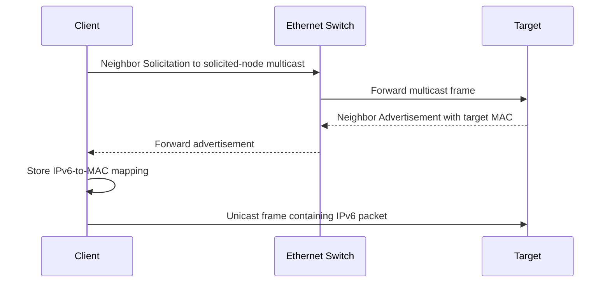

---

## 57.8 Remote IPv6 destination

Assume:

```text
Client prefix: 2001:db8:1234:10::/64
Destination:   2001:db8:9999:20::25
Router:        fe80::1
```

The destination is not directly connected.

The client does not resolve the remote server's MAC address.

It resolves the local router's link-local address:

```text
fe80::1 → router MAC
```

Frame and packet addresses differ:

```text
Ethernet destination: router MAC
IPv6 destination:     remote server IPv6 address
```

The same next-hop principle used in IPv4 still applies.

---

## Questions

1. Why is NDP broader than ARP?
2. Why does a host resolve the router's link-local address when sending to a remote IPv6 destination?
3. How does solicited-node multicast reduce unnecessary processing compared with broadcast?
4. Which table stores IPv6-to-MAC mappings on a Linux host?
5. Why does Neighbor Solicitation occur only after route selection?
6. What address remains the IPv6 destination inside a frame addressed to the router's MAC?

---

# 58. Neighbor Unreachability Detection

## 58.1 Why address resolution is insufficient

Learning a neighbor's MAC address once does not prove the neighbor remains reachable.

A device can:

* Disconnect
* Move
* Change interfaces
* Stop responding
* Become unreachable through the current link

IPv6 Neighbor Discovery includes Neighbor Unreachability Detection.

It tracks whether a cached neighbor appears reachable.

---

## 58.2 Reachability evidence

A host may infer reachability from evidence such as:

* A recent Neighbor Advertisement
* Upper-layer confirmation that communication succeeded
* Active Neighbor Solicitation probes

Exact implementation behavior varies.

---

## 58.3 Common neighbor states on Linux

`ip neighbor` may show states including:

| State        | General meaning                            |
| ------------ | ------------------------------------------ |
| `INCOMPLETE` | Resolution started but no answer received  |
| `REACHABLE`  | Neighbor recently confirmed                |
| `STALE`      | Entry exists but confirmation is old       |
| `DELAY`      | Waiting before active probing              |
| `PROBE`      | Actively testing reachability              |
| `FAILED`     | Resolution or reachability checks failed   |
| `PERMANENT`  | Static entry that does not expire normally |

These states can appear for both IPv4 and IPv6 neighbors in Linux.

A `STALE` entry does not mean communication is broken.

It means the kernel may need to confirm reachability when the entry is next used.

---

## Questions

1. Why is a cached MAC address not permanent proof of reachability?
2. What is the difference between `STALE` and `FAILED`?
3. How can transport-layer communication provide evidence that a neighbor is reachable?
4. Why should a stale neighbor entry not immediately be deleted during troubleshooting?
5. What failure would produce a persistent `INCOMPLETE` state?

---

# 59. Router Discovery

## 59.1 Why IPv6 hosts need Router Discovery

An IPv6 host needs to learn:

* Whether routers are present
* Which router may be used as a default
* Which prefixes exist on the link
* Whether automatic addressing is available
* Whether another configuration service should be used

IPv6 Router Discovery uses ICMPv6 messages.

---

## 59.2 Router Solicitation

A host may send a Router Solicitation after joining a link.

It asks available routers to advertise configuration promptly.

Router Solicitation messages are sent to the link-local all-routers multicast group:

```text
ff02::2
```

This means:

> All IPv6 routers on this local link.

---

## 59.3 Router Advertisement

A router periodically sends Router Advertisements and may respond to solicitations.

A Router Advertisement can contain:

* Router lifetime
* Network prefixes
* Prefix lifetimes
* On-link indication
* Autonomous-address-configuration indication
* MTU
* Information indicating whether DHCPv6 may be used
* Other parameters

The router commonly sends advertisements from its link-local address.

Example:

```text
Router source: fe80::1
Advertised prefix: 2001:db8:1234:10::/64
```

---

## 59.4 Router lifetime

A Router Advertisement can indicate how long the sender should be considered a default router.

A router can advertise a prefix without necessarily acting as a default router.

Therefore:

```text
Prefix advertisement ≠ guaranteed default route
```

The host processes individual Router Advertisement fields to build its state.

---

## 59.5 Prefix Information

A Prefix Information option can tell the host that:

```text
2001:db8:1234:10::/64
```

is available on the link.

Important conceptual flags include:

* **On-link:** destinations in the prefix can be treated as directly reachable.
* **Autonomous:** the prefix may be used for Stateless Address Autoconfiguration.

These are related but not identical.

A prefix could be advertised for one purpose without every possible flag being set.

---

## 59.6 Router Discovery sequence

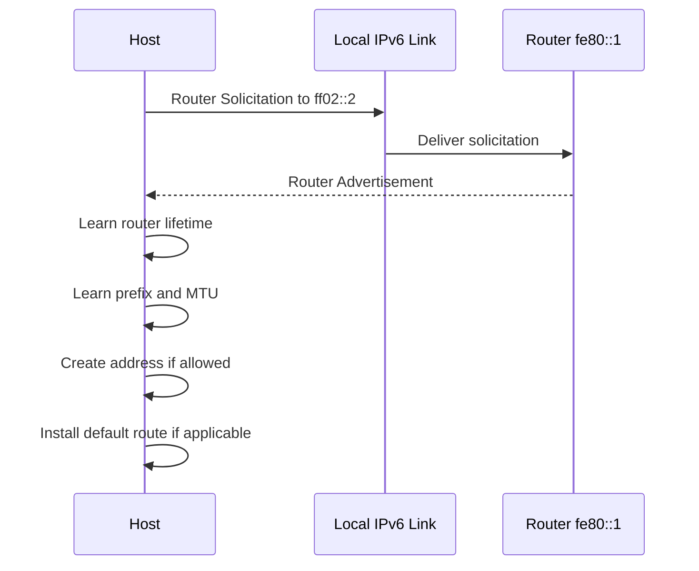

---

## 59.7 Resulting route state

A host may install routes conceptually similar to:

```text
2001:db8:1234:10::/64 dev eth0
default via fe80::1 dev eth0
```

Notice that the default gateway is link-local.

This is normal in IPv6.

The interface is necessary to identify which link contains `fe80::1`.

---

## Questions

1. Why does an IPv6 default gateway commonly use a link-local address?
2. Which multicast group receives Router Solicitations?
3. How can a router advertise a prefix without being selected as a default router?
4. Why are on-link and autonomous-configuration flags separate?
5. What active kernel state can result from a Router Advertisement?
6. Why is the interface required in a route using `fe80::1` as its next hop?

---

# 60. Stateless Address Autoconfiguration

## 60.1 What SLAAC is

SLAAC stands for **Stateless Address Autoconfiguration**.

It allows an IPv6 host to create an address from information advertised by a router without requiring the router to assign each address individually.

Simplified:

```text
Advertised prefix:
2001:db8:1234:10::/64

Host-generated interface portion:
abcd:1234:5678:90ef

Resulting address:
2001:db8:1234:10:abcd:1234:5678:90ef
```

---

## 60.2 Why it is called stateless

The router can advertise the prefix without maintaining a per-client address lease database.

The host generates its own interface identifier.

“Stateless” does not mean the host stores no state.

The host still maintains:

* Address lifetimes
* Prefix information
* Router information
* Neighbor state
* Duplicate-address-detection state

It means address allocation does not require a central server to track every assigned address in the same way DHCP leasing does.

---

## 60.3 SLAAC address creation flow

Assume the router advertises:

```text
Prefix: 2001:db8:1234:10::/64
Autonomous configuration: enabled
```

The host:

1. Receives the Router Advertisement.
2. Validates relevant information.
3. Extracts the `/64` prefix.
4. Generates an interface identifier.
5. Combines prefix and identifier.
6. Marks the new address tentative.
7. Performs Duplicate Address Detection.
8. Uses the address if no duplicate is detected.
9. Tracks preferred and valid lifetimes.

---

## 60.4 Interface-identifier generation

Older explanations often state that the interface identifier is always derived directly from the MAC address.

That is not universally accurate for modern systems.

Hosts may generate interface identifiers using:

* Stable privacy-preserving algorithms
* Temporary randomized values
* Manually configured values
* Modified EUI-64-derived values
* Implementation-specific mechanisms

Modern operating systems frequently avoid exposing a direct long-term MAC-derived identifier for ordinary outbound communication.

---

## 60.5 Preferred and valid lifetimes

An autoconfigured address may have:

* **Preferred lifetime:** period during which it is preferred for new communication
* **Valid lifetime:** period during which it may remain assigned and usable

When the preferred lifetime expires:

```text
Address becomes deprecated
```

A deprecated address may remain valid for existing communication but is generally not preferred for new connections.

When the valid lifetime expires:

```text
Address is removed
```

---

## 60.6 Temporary addresses

A host may maintain:

* A stable address
* One or more temporary addresses

Temporary addresses can be used as source addresses for outbound communication to reduce long-term correlation based on a stable interface identifier.

Example:

```text
Stable address:
2001:db8:1234:10:8f2a:42ff:fe11:2200

Temporary address:
2001:db8:1234:10:7c31:908a:2fb4:7712
```

The exact policy differs by operating system.

---

## 60.7 SLAAC does not necessarily supply DNS

Basic SLAAC creates an address and learns routing information from Router Advertisements.

DNS configuration may be learned through:

* Router Advertisement options supported by the system
* DHCPv6
* Static configuration
* A local resolver mechanism

Therefore:

```text
Working SLAAC address ≠ guaranteed DNS configuration
```

---

## Questions

1. Why is SLAAC considered stateless even though the host stores address state?
2. Why do modern systems often avoid using a directly MAC-derived interface identifier?
3. What happens when an address's preferred lifetime expires but its valid lifetime remains?
4. Which steps occur before a newly generated SLAAC address becomes fully usable?
5. Why can a host have IPv6 reachability by address while name resolution fails?
6. How can one interface hold both stable and temporary IPv6 addresses?

---

# 61. Duplicate Address Detection

## 61.1 What DAD is

Duplicate Address Detection, or DAD, checks whether another node is already using a proposed IPv6 address on the link.

A new address is initially marked **tentative**.

The host must not use it as a normal assigned address until the check succeeds.

---

## 61.2 Why DAD exists

Duplicate addresses cause ambiguous delivery.

If two hosts use the same IPv6 address:

* Neighbor mappings may change unpredictably
* Replies may reach the wrong host
* Existing connections may fail
* Reachability may become intermittent

DAD attempts to detect this before normal use.

---

## 61.3 Simplified DAD flow

Suppose the host wants to use:

```text
2001:db8:1234:10::25
```

It sends a Neighbor Solicitation asking whether that address is already in use.

Because the address is not yet assigned, the solicitation uses the unspecified source address:

```text
Source IPv6: ::
Target IPv6: 2001:db8:1234:10::25
```

If another node claims the address, it responds.

If no conflicting response is observed after the required process, the host can make the address usable.

---

## 61.4 DAD sequence

```mermaid
sequenceDiagram
    participant H as Configuring Host
    participant N as Local Link
    participant O as Existing Owner, if any

    H->>N: Neighbor Solicitation from :: for tentative address

    alt Address already exists
        O-->>H: Neighbor Advertisement claiming address
        H->>H: Mark duplicate; do not use address
    else No conflicting response
        H->>H: Mark address usable
    end
```

---

## 61.5 DAD limitations

DAD reduces duplicate-address risk, but it is not absolute proof of uniqueness forever.

A conflict may appear later because:

* A disconnected device reconnects
* Another system is misconfigured
* Packet loss hides the DAD exchange
* Network segments are later joined
* Software ignores normal behavior

---

## Questions

1. Why is the proposed address marked tentative during DAD?
2. Why does a DAD Neighbor Solicitation use `::` as its source?
3. What should the host do when another node claims its tentative address?
4. Why can duplicate addresses still occur after successful DAD?
5. How would failed DAD appear in interface state or system logs?

---

# 62. DHCPv6

## 62.1 What DHCPv6 is

DHCPv6 provides configuration to IPv6 hosts.

It is related to DHCPv4 but is not merely the same packet format with larger addresses.

DHCPv6 can operate in different roles:

* Assign IPv6 addresses
* Supply additional configuration without assigning addresses
* Provide DNS-related information
* Supply other network parameters

---

## 62.2 DHCPv6 ports

DHCPv6 uses UDP:

| Endpoint        | UDP port |
| --------------- | -------: |
| Client          |      546 |
| Server or relay |      547 |

This differs from DHCPv4 ports 67 and 68.

---

## 62.3 Multicast discovery

A DHCPv6 client can send messages to a multicast group for DHCPv6 servers and relays rather than using IPv4-style limited broadcast.

A client already has a link-local IPv6 address available for local communication.

This is an important architectural difference from DHCPv4.

---

## 62.4 SLAAC and DHCPv6 are not mutually exclusive

An IPv6 host may receive configuration through combinations such as:

### SLAAC only

* Address from advertised prefix
* Default route from Router Advertisement
* Possibly DNS information from Router Advertisement

### SLAAC plus stateless DHCPv6

* Address from SLAAC
* Default route from Router Advertisement
* Additional options from DHCPv6

### Stateful DHCPv6

* Address supplied through DHCPv6
* Additional options supplied through DHCPv6
* Default route still typically learned through Router Advertisement

That final point is important:

> DHCPv6 normally does not replace Router Advertisement as the ordinary source of the IPv6 default route.

---

## 62.5 Router Advertisement control flags

Router Advertisements can indicate that hosts should use DHCPv6 for:

* Managed address configuration
* Other configuration information

The exact client response depends on:

* Operating-system implementation
* Network-manager policy
* Router Advertisement flags
* Available DHCPv6 service

---

## 62.6 Simplified stateful DHCPv6 flow

A simplified exchange uses messages such as:

```text
Solicit
Advertise
Request
Reply
```

Conceptually:

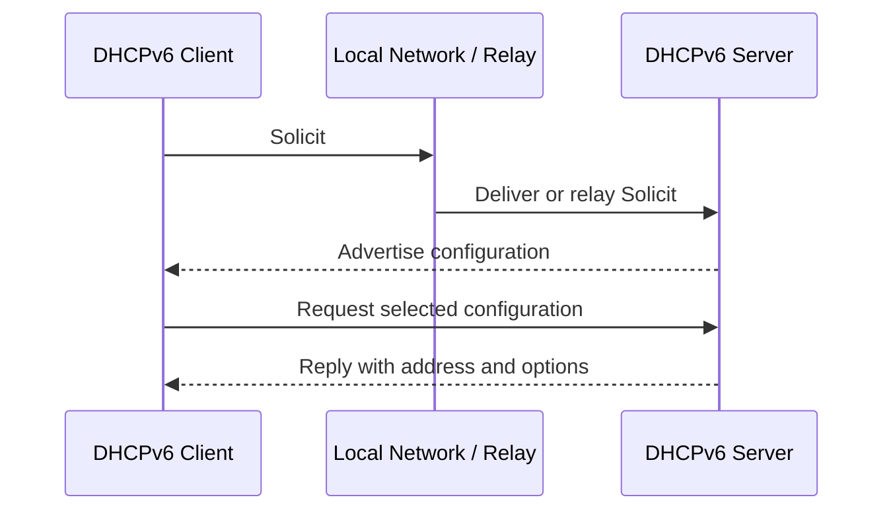

Actual relayed communication adds relay-specific messages and fields.

---

## 62.7 DHCPv4 versus DHCPv6

| Property                  | DHCPv4             | DHCPv6                          |
| ------------------------- | ------------------ | ------------------------------- |
| Client port               | UDP 68             | UDP 546                         |
| Server port               | UDP 67             | UDP 547                         |
| Initial client addressing | May use `0.0.0.0`  | Uses IPv6 link-local capability |
| Local discovery           | Broadcast          | Multicast                       |
| Default gateway           | Common DHCP option | Normally Router Advertisement   |
| Can assign addresses      | Yes                | Yes                             |
| Can provide options only  | Yes                | Yes                             |
| Separate protocol format  | —                  | Yes                             |

---

## Questions

1. Why can a DHCPv6 client use a link-local source address during discovery?
2. Why does DHCPv6 not normally supply the default IPv6 route?
3. How can SLAAC and DHCPv6 operate together?
4. Which UDP ports belong to DHCPv6?
5. What configuration might stateless DHCPv6 provide when SLAAC supplies the address?
6. Why should DHCPv4 troubleshooting assumptions not be copied directly to DHCPv6?

---

# 63. IPv6 Address and Route Selection

## 63.1 Multiple addresses are normal

An IPv6 interface often has several addresses:

```text
eth0
├── fe80::5054:ff:fe12:3456/64
├── 2001:db8:1234:10::20/64
└── 2001:db8:1234:10:7c31:908a:2fb4:7712/64
```

These may include:

* Link-local address
* Stable global address
* Temporary global address
* Unique local address
* Deprecated address

The kernel must choose an appropriate source address for each destination.

---

## 63.2 Source-address selection

Factors can include:

* Destination scope
* Source scope
* Prefix similarity
* Address state
* Temporary-address preference
* Route
* Operating-system policy

Example:

```text
Destination: fe80::1
```

A link-local source is appropriate.

For:

```text
Destination: 2001:db8:9999::25
```

a global source address may be selected.

---

## 63.3 Destination choice with dual stack

DNS may return:

```text
AAAA: 2001:db8:9999::25
A:    203.0.113.25
```

The application can potentially use either IPv6 or IPv4.

Modern systems commonly use connection-selection behavior designed to:

* Prefer suitable IPv6 when it works
* Avoid long delays when one protocol path is broken
* Try alternatives with controlled timing

Exact algorithms and timing differ by application and operating system.

Do not assume that receiving an IPv6 DNS record guarantees the application will use IPv6 successfully.

---

## 63.4 Route lookup still comes first

For an IPv6 destination, the kernel searches the IPv6 routing table.

Example:

```text
2001:db8:1234:10::/64 dev eth0
default via fe80::1 dev eth0
```

Destination:

```text
2001:db8:9999::25
```

does not match the connected `/64`, so the default route is selected.

The next-hop MAC is resolved for:

```text
fe80::1
```

---

# 64. Practical IPv6 Commands on Linux

## 64.1 Display IPv6 addresses

```bash
ip -6 address show
```

Short form:

```bash
ip -6 addr
```

### What it does

Displays IPv6 addresses assigned to interfaces.

### Why it is useful

It shows:

* Link-local addresses
* Global or unique-local addresses
* Prefix lengths
* Address lifetimes
* Tentative or deprecated state
* Temporary-address indicators

---

## 64.2 Compact address view

```bash
ip -brief -6 address
```

Example conceptual output:

```text
lo      UNKNOWN  ::1/128
eth0    UP       fe80::5054:ff:fe12:3456/64
                 2001:db8:1234:10::20/64
```

This is useful for a quick inventory but may omit detailed lifetime information.

---

## 64.3 Inspect one interface in detail

```bash
ip -6 address show dev eth0
```

Possible flags or labels include:

| Field           | General meaning                        |
| --------------- | -------------------------------------- |
| `scope link`    | Link-local scope                       |
| `scope global`  | Broader routed scope                   |
| `dynamic`       | Dynamically configured                 |
| `temporary`     | Temporary address                      |
| `tentative`     | Duplicate Address Detection incomplete |
| `deprecated`    | Not preferred for new communication    |
| `valid_lft`     | Remaining valid lifetime               |
| `preferred_lft` | Remaining preferred lifetime           |

Exact output depends on the kernel and configuration manager.

---

## 64.4 Display IPv6 routes

```bash
ip -6 route show
```

Example:

```text
2001:db8:1234:10::/64 dev eth0 proto ra
fe80::/64 dev eth0 proto kernel
default via fe80::1 dev eth0 proto ra
```

### Interpretation

```text
proto ra
```

indicates that the route was learned through Router Advertisement.

```text
fe80::/64 dev eth0
```

represents link-local communication on that interface.

```text
default via fe80::1 dev eth0
```

uses the router's link-local address as the next hop.

---

## 64.5 Ask the kernel for route selection

```bash
ip -6 route get 2001:db8:9999::25
```

Conceptual output:

```text
2001:db8:9999::25 via fe80::1 dev eth0 src 2001:db8:1234:10::20
```

This identifies:

* Destination
* Next hop
* Interface
* Selected source address

This is useful when the interface has several IPv6 addresses.

---

## 64.6 Display IPv6 neighbors

```bash
ip -6 neighbor show
```

Short form:

```bash
ip -6 neigh
```

Example:

```text
fe80::1 dev eth0 lladdr 52:54:00:aa:bb:01 router REACHABLE
2001:db8:1234:10::25 dev eth0 lladdr 52:54:00:12:34:25 STALE
```

### Important fields

```text
lladdr
```

Link-layer address.

```text
router
```

Entry is recognized as a router.

```text
REACHABLE / STALE / FAILED
```

Neighbor reachability state.

---

## 64.7 Test IPv6 loopback

```bash
ping -6 -c 3 ::1
```

### What it does

Sends IPv6 ICMP Echo Requests through loopback.

### What success proves

It provides evidence that:

* The local IPv6 stack is enabled
* ICMPv6 loopback processing works

It does not test:

* Ethernet
* Wi-Fi
* Router Discovery
* External routing
* DNS

---

## 64.8 Test a link-local router

```bash
ping -6 -c 3 fe80::1%eth0
```

### Why `%eth0` is required

`fe80::1` has link-local scope.

The interface identifies which link should be used.

### What it tests

It provides evidence about:

* Local IPv6 link operation
* Neighbor Discovery
* Router reachability
* ICMPv6 Echo behavior

A router may choose not to answer Echo Requests, so failure is not absolute proof of link failure.

---

## 64.9 Test a global address

```bash
ping -6 -c 3 2001:db8:9999::25
```

The address shown is a documentation example and should be replaced with an authorized real destination.

This tests IPv6 specifically.

Using plain `ping` may select IPv4 or IPv6 depending on the hostname and implementation, so `-6` removes ambiguity.

---

## 64.10 Capture ICMPv6

```bash
sudo tcpdump -ni eth0 icmp6
```

Some implementations accept:

```bash
sudo tcpdump -ni eth0 icmp6
```

as the standard filter name.

### What it captures

Potentially:

* Echo Requests and Replies
* Router Solicitations
* Router Advertisements
* Neighbor Solicitations
* Neighbor Advertisements
* Packet Too Big messages
* Time Exceeded messages

### Safety

ICMPv6 captures reveal addressing and local topology. Capture only where authorized.

---

## 64.11 Capture Neighbor Discovery only

A practical filter can select major NDP ICMPv6 types:

```bash
sudo tcpdump -ni eth0 \
  'icmp6 and (ip6[40] == 133 or ip6[40] == 134 or ip6[40] == 135 or ip6[40] == 136)'
```

Type values:

| Type | Message                |
| ---: | ---------------------- |
|  133 | Router Solicitation    |
|  134 | Router Advertisement   |
|  135 | Neighbor Solicitation  |
|  136 | Neighbor Advertisement |

### Important caution

This filter assumes the ICMPv6 header immediately follows the 40-byte IPv6 base header.

IPv6 extension headers can make that assumption invalid.

For ordinary local Neighbor Discovery packets, the filter is often useful, but it is not a universal parser for every IPv6 packet layout.

A broader and safer starting capture is:

```bash
sudo tcpdump -nvi eth0 icmp6
```

Then inspect the decoded message types.

---

## 64.12 Capture DHCPv6

```bash
sudo tcpdump -ni eth0 'udp port 546 or udp port 547'
```

### What it does

Captures DHCPv6 client and server traffic.

### Why it is useful

It can reveal:

* Solicit
* Advertise
* Request
* Reply
* Relay traffic visible on the interface

---

## 64.13 Display resolver state

```bash
resolvectl status
```

Inspect whether IPv6 DNS-server addresses are configured.

Remember:

* The DNS server itself may use IPv4
* The queried records may contain IPv6 addresses
* Transport to the DNS server and returned record type are separate issues

A host can ask an IPv4-reached DNS server for an IPv6 `AAAA` record.

---

# 65. Practical IPv6 Observation Walkthrough

## Objective

Observe how a host learns a router, configures an address, and resolves a neighbor.

---

## Step 1: Inspect current state

```bash
ip -brief -6 address
ip -6 route
ip -6 neighbor
```

Record:

* Link-local address
* Global address, if present
* Default router
* Neighbor state

---

## Step 2: Capture ICMPv6

```bash
sudo tcpdump -nvi eth0 icmp6
```

Possible messages include:

```text
router solicitation
router advertisement
neighbor solicitation
neighbor advertisement
```

---

## Step 3: Observe Router Advertisement information

Look for:

* Router source link-local address
* Advertised prefix
* Router lifetime
* Prefix lifetime
* MTU
* Configuration flags

Exact `tcpdump` decoding varies.

---

## Step 4: Compare packet data with interface state

If the router advertises:

```text
2001:db8:1234:10::/64
```

check:

```bash
ip -6 address show dev eth0
```

A dynamically created address may appear within that prefix.

---

## Step 5: Compare packet data with route state

Check:

```bash
ip -6 route
```

Look for:

```text
2001:db8:1234:10::/64 dev eth0
default via fe80::1 dev eth0
```

The exact route entries depend on Router Advertisement flags and local policy.

---

## Step 6: Trigger neighbor resolution

For a known local IPv6 destination:

```bash
ping -6 -c 1 2001:db8:1234:10::25
```

Then inspect:

```bash
ip -6 neighbor show
```

The capture may show:

1. Neighbor Solicitation
2. Neighbor Advertisement
3. Echo Request
4. Echo Reply

---

## Step 7: Correlate all layers

```text
Router Advertisement
        │
        ├── Prefix → IPv6 interface address
        ├── Router lifetime → default route
        └── MTU → interface/path behavior

Route lookup
        │
        └── Local destination selected

Neighbor Solicitation/Advertisement
        │
        └── IPv6 address mapped to MAC address

Ethernet frame
        │
        └── Carries IPv6 Echo Request
```

---

# 66. IPv6 Failure Scenarios

## 66.1 Link-local address only

Observation:

```text
eth0:
fe80::5054:ff:fe12:3456/64
```

No global or unique-local address appears.

Possible causes:

* No Router Advertisement received
* Router advertises no usable prefix
* SLAAC disabled
* Interface configuration prevents automatic addressing
* Router Discovery traffic is not reaching the host
* Network intentionally provides only link-local communication
* Stateful DHCPv6 is expected but unavailable

The link-local address itself is normal.

The absence of a broader-scope address may indicate missing configuration.

---

## 66.2 Global address but no default route

Observation:

```text
Address:
2001:db8:1234:10::20/64

Routes:
2001:db8:1234:10::/64 dev eth0
No default route
```

Result:

* Local `/64` communication may work
* Remote IPv6 destinations fail

Possible causes:

* Router Advertisement has zero router lifetime
* Default-router information expired
* Router Advertisement was only partially applied
* Static address was configured without a route
* Network intentionally provides no routed IPv6 access

---

## 66.3 Default route exists but router neighbor fails

Route:

```text
default via fe80::1 dev eth0
```

Neighbor table:

```text
fe80::1 dev eth0 INCOMPLETE
```

Interpretation:

* Logical route exists
* Local router's link-layer address cannot be resolved
* Packet cannot reach the next hop

Investigate:

* Link state
* Correct interface
* NDP exchange
* Router availability
* Local multicast delivery

---

## 66.4 Tentative address never becomes usable

Observation:

```text
2001:db8:1234:10::20/64 tentative
```

Possible causes:

* Duplicate Address Detection still running
* Conflicting address detected
* NDP communication failure
* Interface or network-manager problem

Check:

```bash
ip -6 address show dev eth0
sudo tcpdump -nvi eth0 icmp6
```

Look for DAD Neighbor Solicitation and conflicting advertisements.

---

## 66.5 Address becomes deprecated

Observation:

```text
deprecated
preferred_lft 0sec
valid_lft 1200sec
```

Interpretation:

* Address is still valid temporarily
* It is not preferred for new connections
* Existing communication may continue
* Another address may be selected for new traffic

This can occur when a prefix is being withdrawn or renumbered.

---

## 66.6 IPv6 DNS record exists but path fails

DNS returns:

```text
AAAA 2001:db8:9999::25
```

but the host has:

* No global IPv6 address
* No IPv6 default route
* Broken upstream IPv6 routing

An application may initially attempt IPv6 and then fall back to IPv4, depending on its connection-selection behavior.

Symptoms can include:

* Delayed connection
* Intermittent application behavior
* IPv4 tests succeeding
* Explicit IPv6 tests failing

---

## 66.7 Small packets work, large transfers fail

Possible causes:

* ICMPv6 Packet Too Big messages are not reaching the source
* Tunnel MTU is incorrect
* Path MTU is lower than expected
* Source does not adapt correctly

Investigate with:

```bash
tracepath6 2001:db8:9999::25
```

or, on systems where `tracepath` accepts IPv6 directly:

```bash
tracepath -6 2001:db8:9999::25
```

Tool names and flags vary by distribution.

Check:

```bash
tracepath --help
```

Packet capture:

```bash
sudo tcpdump -nvi eth0 icmp6
```

Look for Packet Too Big messages.

---

## 66.8 IPv4 works, IPv6 fails

Treat the protocols separately.

Check IPv6-specific state:

```bash
ip -6 address
ip -6 route
ip -6 neighbor
ping -6 -c 3 ::1
ping -6 -c 3 fe80::1%eth0
```

Do not assume IPv4 success proves:

* Router Advertisement works
* IPv6 route exists
* NDP works
* Upstream IPv6 routing works
* IPv6 DNS selection is healthy

---

# 67. IPv6 Troubleshooting Workflow

Assume:

```text
A hostname resolves to IPv4 and IPv6, but connections are slow or inconsistent.
```

## Step 1: Inspect both address families

```bash
ip -brief address
```

Determine whether the host has:

* Valid IPv4 address
* IPv6 link-local address
* IPv6 global or unique-local address

---

## Step 2: Inspect IPv6 route selection

```bash
ip -6 route
ip -6 route get 2001:db8:9999::25
```

Check:

* Default route
* Next-hop interface
* Source address
* More-specific routes

---

## Step 3: Test loopback

```bash
ping -6 -c 3 ::1
```

Failure suggests a local IPv6-stack or configuration issue.

---

## Step 4: Test local router

```bash
ping -6 -c 3 fe80::1%eth0
```

Use the actual router and interface.

If this fails, inspect NDP rather than immediately blaming remote routing.

---

## Step 5: Check neighbor state

```bash
ip -6 neighbor
```

Look for the default router.

```text
REACHABLE or STALE
```

is generally more promising than:

```text
INCOMPLETE or FAILED
```

---

## Step 6: Capture ICMPv6

```bash
sudo tcpdump -nvi eth0 icmp6
```

Look for:

* Router Advertisements
* Neighbor Solicitations and Advertisements
* Destination Unreachable
* Packet Too Big
* Time Exceeded

---

## Step 7: Test remote IPv6 directly

```bash
ping -6 -c 3 2001:db8:9999::25
```

Ping failure is not conclusive, but explicit ICMPv6 errors can be valuable.

---

## Step 8: Compare with explicit IPv4

```bash
ping -4 -c 3 203.0.113.25
```

This distinguishes address-family behavior.

---

## Step 9: Inspect name-resolution results

On systems with `getent`:

```bash
getent ahosts www.example.com
```

### What it does

Uses the system's name-service configuration to retrieve addresses.

### Why it is useful

It can show whether the hostname has:

* IPv4 addresses
* IPv6 addresses
* Multiple possible endpoints

Exact output and ordering vary.

DNS-specific tools and record types are covered later.

---

## Step 10: Distinguish resolution from connection selection

Possible sequence:

```text
DNS returns IPv6 and IPv4
        │
        ▼
Application tries IPv6
        │
        ├── IPv6 succeeds quickly → use IPv6
        │
        └── IPv6 path is impaired
                │
                ▼
        Application tries IPv4
```

A slow connection may result from a partially broken IPv6 path even though IPv4 eventually succeeds.

---

# 68. IPv4 and IPv6 Data-Flow Comparison

## 68.1 Local IPv4 delivery

```text
1. Route lookup
2. Destination classified as local
3. ARP request broadcast if needed
4. ARP reply supplies MAC address
5. IPv4 packet sent in Ethernet frame
```

---

## 68.2 Local IPv6 delivery

```text
1. IPv6 route lookup
2. Destination classified as on-link
3. Neighbor Solicitation sent to solicited-node multicast
4. Neighbor Advertisement supplies MAC address
5. IPv6 packet sent in Ethernet frame
```

---

## 68.3 Remote IPv4 delivery

```text
1. IPv4 route lookup
2. Default or specific route selected
3. Gateway IPv4 address resolved through ARP
4. Frame addressed to gateway MAC
5. IPv4 packet retains final destination IP
```

---

## 68.4 Remote IPv6 delivery

```text
1. IPv6 route lookup
2. Default or specific route selected
3. Router link-local IPv6 address resolved through NDP
4. Frame addressed to router MAC
5. IPv6 packet retains final destination IPv6 address
```

---

## 68.5 Automatic configuration comparison

| Requirement                   | IPv4 common mechanism    | IPv6 common mechanism                       |
| ----------------------------- | ------------------------ | ------------------------------------------- |
| Local-link address resolution | ARP                      | NDP                                         |
| Prefix configuration          | DHCP/manual              | Router Advertisement, SLAAC, DHCPv6/manual  |
| Default router                | DHCP/manual              | Router Advertisement                        |
| DNS configuration             | DHCP/manual              | Router Advertisement option, DHCPv6, manual |
| Duplicate check               | ARP-related techniques   | DAD                                         |
| Local control addressing      | May begin with `0.0.0.0` | Link-local address available                |

---

# 69. Website Example over IPv6

Assume the client opens:

```text
https://www.example.com/
```

Configuration:

```text
Client link-local:
fe80::5054:ff:fe12:3456

Client global:
2001:db8:1234:10::20/64

Default router:
fe80::1

DNS server:
2001:db8:1234:10::53

Web server:
2001:db8:9999:20::80

Service:
TCP port 443
```

## Stage 1: Router Advertisement establishes configuration

The client receives:

```text
Prefix:         2001:db8:1234:10::/64
Default router: fe80::1
```

It creates and validates:

```text
2001:db8:1234:10::20
```

---

## Stage 2: DNS-server route lookup

DNS server:

```text
2001:db8:1234:10::53
```

belongs to the client's local `/64`.

The kernel selects direct delivery.

---

## Stage 3: DNS-server neighbor resolution

The client sends a Neighbor Solicitation for:

```text
2001:db8:1234:10::53
```

The DNS server replies with its MAC address.

The client sends the DNS query in an Ethernet frame addressed directly to the DNS server.

---

## Stage 4: DNS returns an IPv6 server address

Conceptual answer:

```text
www.example.com → 2001:db8:9999:20::80
```

---

## Stage 5: Web-server route lookup

The server address is outside:

```text
2001:db8:1234:10::/64
```

The default route is selected:

```text
default via fe80::1 dev eth0
```

---

## Stage 6: Router neighbor resolution

The client checks:

```text
fe80::1 → router MAC
```

If missing, it performs Neighbor Discovery.

---

## Stage 7: First transport packet is transmitted

```text
Ethernet source:
client MAC

Ethernet destination:
router MAC

IPv6 source:
2001:db8:1234:10::20

IPv6 destination:
2001:db8:9999:20::80

Next Header:
TCP

TCP destination port:
443
```

---

## Stage 8: Routers forward the IPv6 packet

Each router:

1. Receives a link-layer frame.
2. Extracts the IPv6 packet.
3. Decreases Hop Limit.
4. Performs longest-prefix route lookup.
5. Creates new link-layer encapsulation.
6. Sends the packet to the next hop.

Intermediate routers do not perform IPv6 fragmentation.

---

## Stage 9: Destination receives the packet

The server kernel:

1. Validates the IPv6 packet.
2. Reads Next Header `TCP`.
3. Passes the segment to TCP.
4. Identifies the listening socket for port `443`.
5. Continues the connection process.

---

## Questions

1. Which address does the client resolve at the link layer before sending to the remote web server?
2. Why is the default gateway's link-local address sufficient?
3. Which fields change at each IPv6 router?
4. Which fields remain end-to-end during ordinary forwarding?
5. Why does the DNS server's MAC address differ from the router's MAC address in this example?
6. At what stage does TCP port `443` become relevant?
7. What happens if the server path requires a smaller MTU than the initial packets use?

---

# 70. Common IPv6 Misconceptions

## Misconception 1: IPv6 eliminates routers

IPv6 still uses routing between networks.

Its larger address space does not remove the need for:

* Prefixes
* Routing tables
* Default routes
* Next hops

---

## Misconception 2: Every IPv6 address is publicly reachable

IPv6 includes:

* Link-local addresses
* Unique local addresses
* Loopback
* Multicast
* Global unicast

Even a global address requires working routes and services.

---

## Misconception 3: Link-local addresses indicate a configuration failure

An IPv6 link-local address is normal and essential.

A host may also need a global or unique-local address for routed communication.

---

## Misconception 4: NDP is only IPv6 ARP

NDP also performs:

* Router Discovery
* Prefix discovery
* Duplicate Address Detection
* Reachability tracking

---

## Misconception 5: DHCPv6 always provides the default gateway

The default IPv6 router is normally learned from Router Advertisements.

---

## Misconception 6: IPv6 does not use ICMP

IPv6 uses ICMPv6 extensively.

Several fundamental IPv6 mechanisms depend on it.

---

## Misconception 7: IPv6 routers fragment oversized packets

Intermediate IPv6 routers do not fragment packets.

They send Packet Too Big errors so the source can adjust.

---

## Misconception 8: IPv6 has no private addressing

Unique local addresses provide private routed addressing, although their design differs from IPv4 private ranges.

---

## Misconception 9: One interface has one IPv6 address

Multiple IPv6 addresses per interface are normal.

---

## Misconception 10: A `AAAA` DNS record proves IPv6 connectivity

A DNS record provides an address.

It does not establish:

* Local IPv6 configuration
* Default route
* Neighbor reachability
* End-to-end routing
* Application availability

---

# 71. Security and Performance Considerations at This Level

## 71.1 Local control messages affect configuration

Router Advertisements and Neighbor Discovery influence:

* Default routes
* Prefixes
* Neighbor mappings
* Address configuration

Unexpected local messages can therefore cause incorrect behavior.

Detailed controls and attack prevention belong to advanced network security and are outside this scope.

For troubleshooting, inspect:

```bash
sudo tcpdump -nvi eth0 icmp6
```

and compare the observed router and prefixes with the intended configuration.

---

## 71.2 Temporary addresses and privacy

Temporary source addresses can reduce long-term tracking based on a stable interface identifier.

They do not make traffic anonymous.

Other identifiers can still correlate activity, including:

* Application accounts
* Cookies
* TLS sessions
* DNS behavior
* Network prefix
* Browser characteristics

---

## 71.3 Larger addresses increase header size

The IPv6 base header is 40 bytes compared with a minimum 20-byte IPv4 header.

For small packets, this increases proportional overhead.

For large transfers, the difference is relatively small compared with total payload size.

---

## 71.4 Multicast processing

IPv6 replaces broadcast with multicast for many local functions.

Multicast is more selective, but excessive or misconfigured multicast can still consume:

* Link capacity
* Host processing
* Switch resources

---

## 71.5 Path MTU reliability

Because IPv6 routers do not fragment traffic, correct Packet Too Big signaling and source adaptation are important.

Packet-size-dependent failures should trigger inspection of ICMPv6 and path MTU behavior.

---

# 72. Recall and Diagnostic Questions

1. Expand and then recompress:

   ```text
   2001:db8:5::12
   ```

2. Determine the `/64` network containing:

   ```text
   2001:db8:abcd:25:1234:5678:9abc:def0
   ```

3. Why does IPv6 use solicited-node multicast instead of ARP broadcast?

4. Trace local IPv6 delivery from a socket write to an Ethernet frame.

5. Trace remote IPv6 delivery when the default gateway is `fe80::1`.

6. Which ICMPv6 messages establish:

   * Router presence
   * Prefix information
   * Neighbor MAC mapping
   * Duplicate-address detection
   * Path MTU correction

7. A host has a global IPv6 address but no default route. Which communication should still be possible?

8. A host has only a link-local address. Which tests distinguish normal local IPv6 operation from missing routed configuration?

9. Why can `fe80::1` require `%eth0` in a command?

10. What is the difference between:

    * Link-local address
    * Unique local address
    * Global unicast address

11. Why does DHCPv6 not make Router Advertisements unnecessary?

12. A host shows:

    ```text
    fe80::1 dev eth0 INCOMPLETE
    ```

    What part of the data flow has failed?

13. Why can a deprecated address remain assigned?

14. How can one interface have both stable and temporary global addresses?

15. Why can an application appear slow when IPv6 is partially broken but IPv4 works?

16. What happens when an IPv6 router receives a packet larger than the outgoing MTU?

17. Why is blocking all ICMPv6 more disruptive than merely disabling ping?

18. Compare every layer involved in:

    * IPv4 ARP resolution
    * IPv6 Neighbor Discovery

19. Which IPv6 header identifies TCP, UDP, ICMPv6, or an extension header?

20. Why does IPv6 not contain a network-layer header checksum?

# Part 6 — Transport Layer, Ports, UDP, and TCP

# 73. The Transport Layer

## 73.1 What the transport layer is

The transport layer provides communication between application endpoints.

IP delivers packets to a host or interface address.

The transport layer determines which application endpoint should receive the payload.

Simplified relationship:

```text
IP address
└── Identifies the destination host/interface

Transport protocol and port
└── Identify the destination application endpoint
```

Example:

```text
Destination IP:   203.0.113.20
Transport:        TCP
Destination port: 443
```

This means:

> Deliver the IP packet to `203.0.113.20`, then give the TCP data to the endpoint associated with TCP port `443`.

---

## 73.2 Why the transport layer exists

A host can run many networked applications simultaneously:

```text
Web browser
SSH client
DNS resolver
Email client
Database client
Background update service
```

All of them may use the same network interface and IP address.

The system therefore needs mechanisms for:

* Distinguishing application endpoints
* Multiplexing many conversations over one IP address
* Delivering incoming data to the correct process
* Providing optional reliability and ordering
* Controlling transmission rates
* Detecting transport-level errors

UDP and TCP provide different services for these purposes.

---

## 73.3 Host-to-host versus process-to-process delivery

IP handles host-to-host packet delivery:

```text
192.0.2.10 → 203.0.113.20
```

The transport layer handles process-to-process communication:

```text
192.0.2.10:49152 → 203.0.113.20:443
```

A complete transport endpoint usually includes:

```text
IP address
Transport protocol
Port number
```

The transport protocol matters because TCP port `53` and UDP port `53` are separate endpoint spaces.

---

## 73.4 Transport-layer responsibilities

Depending on the protocol, the transport layer may provide:

| Responsibility           | UDP |              TCP |
| ------------------------ | --: | ---------------: |
| Port numbers             | Yes |              Yes |
| Message boundaries       | Yes |   No—byte stream |
| Connection establishment |  No |              Yes |
| Ordered delivery         |  No |              Yes |
| Retransmission           |  No |              Yes |
| Duplicate suppression    |  No |              Yes |
| Flow control             |  No |              Yes |
| Congestion control       |  No |              Yes |
| Lightweight header       | Yes | Less lightweight |

UDP is not “bad TCP.”

TCP is not “better UDP.”

They provide different semantics.

---

## 73.5 Encapsulation

For UDP:

```text
Application message
        │
        ▼
UDP header + application message
        │
        ▼
IP header + UDP datagram
```

For TCP:

```text
Application byte stream
        │
        ▼
TCP segments
        │
        ▼
IP packets
```

The transport payload is carried inside IPv4 or IPv6.

---

## 73.6 Receiving-side demultiplexing

When an IP packet reaches the destination host:

1. The kernel reads the IP protocol or IPv6 Next Header field.
2. It determines whether the payload is TCP, UDP, ICMP, or another protocol.
3. The transport implementation reads the destination port.
4. The kernel finds the matching socket.
5. Data is placed in that socket's receive queue.
6. The application reads the data.

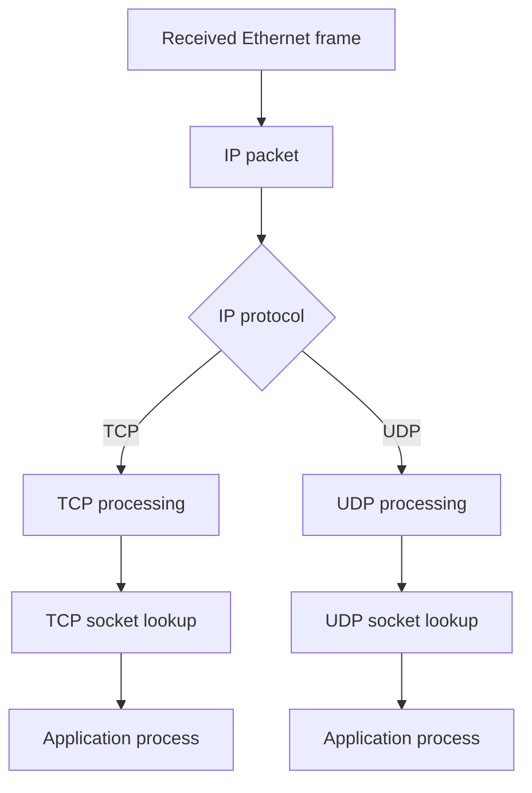

---

## Questions

1. Why is an IP address insufficient to identify a destination process?
2. Why are TCP port 53 and UDP port 53 considered separate endpoints?
3. At what point does the destination operating system inspect the port number?
4. Which transport responsibilities are absent from UDP?
5. Why must IP processing occur before transport socket lookup?
6. How can several applications share one IP address without receiving each other's data?

---

# 74. Ports and Sockets

## 74.1 What a port number is

A port number is a 16-bit transport-layer identifier.

Possible values:

```text
0 through 65535
```

TCP and UDP each have independent 16-bit port spaces.

Example endpoints:

```text
TCP 203.0.113.20:443
UDP 203.0.113.53:53
```

Ports identify logical endpoints in the operating system, not physical network connectors.

---

## 74.2 Why ports exist

Suppose a server has one IP address:

```text
203.0.113.20
```

It can still provide several services:

```text
TCP 22    SSH
TCP 80    HTTP
TCP 443   HTTPS
UDP 53    DNS
TCP 5432  PostgreSQL
```

The IP address gets the packet to the server.

The transport protocol and destination port select the service.

---

## 74.3 Port-number ranges

Port numbers are conventionally divided into ranges:

|         Range | Common description         |
| ------------: | -------------------------- |
|      `0–1023` | Well-known or system ports |
|  `1024–49151` | Registered ports           |
| `49152–65535` | Dynamic or private ports   |

These ranges are conventions and allocation categories.

They do not guarantee that:

* A particular service is running
* Traffic is trustworthy
* An application always uses its standard port
* Every operating system selects ephemeral ports only from the final range

Ephemeral-port ranges vary by operating system and configuration.

---

## 74.4 Server port versus client port

A server normally listens on a predictable port:

```text
Web server:
203.0.113.20:443
```

A client commonly uses a temporary source port selected by its operating system:

```text
Client:
192.0.2.10:49152
```

The connection becomes:

```text
192.0.2.10:49152 → 203.0.113.20:443
```

The server's response reverses source and destination:

```text
203.0.113.20:443 → 192.0.2.10:49152
```

The client source port lets the operating system deliver the reply to the correct client socket.

---

## 74.5 What a socket is

A socket is an operating-system abstraction representing a communication endpoint.

Applications use sockets through system calls or programming-language libraries.

A socket may have attributes such as:

* Address family: IPv4 or IPv6
* Transport type: TCP or UDP
* Local IP address
* Local port
* Remote IP address
* Remote port
* Protocol state
* Send and receive queues

---

## 74.6 Socket lifecycle

A server TCP socket commonly performs:

```text
socket()
bind()
listen()
accept()
read()/write()
close()
```

A client TCP socket commonly performs:

```text
socket()
connect()
read()/write()
close()
```

A UDP application may perform:

```text
socket()
bind()
sendto()/recvfrom()
close()
```

or may use `connect()` to set a default UDP peer without creating a TCP-like connection.

---

## 74.7 Server-side TCP socket roles

TCP servers commonly use two kinds of sockets.

### Listening socket

Represents the service endpoint:

```text
0.0.0.0:443
```

or:

```text
[::]:443
```

It waits for incoming connection attempts.

### Connected socket

Created for one accepted client connection:

```text
Local:  203.0.113.20:443
Remote: 192.0.2.10:49152
```

The listening socket remains available for new clients while connected sockets handle existing clients.

---

## 74.8 The connection four-tuple

A TCP connection is commonly identified by:

```text
Source IP
Source port
Destination IP
Destination port
```

Example:

```text
192.0.2.10:49152
203.0.113.20:443
```

Together:

```text
192.0.2.10:49152 → 203.0.113.20:443
```

The protocol is also implicitly TCP.

A more complete conceptual identifier is a five-tuple:

```text
Source IP
Source port
Destination IP
Destination port
Transport protocol
```

---

## 74.9 Why the four-tuple matters

Many clients can connect to the same server port simultaneously:

```text
192.0.2.10:49152 → 203.0.113.20:443
192.0.2.11:53001 → 203.0.113.20:443
192.0.2.10:49153 → 203.0.113.20:443
```

All use server port `443`.

They remain distinct because their source addresses or source ports differ.

---

## 74.10 Binding addresses

A server can bind to one specific local address:

```text
192.0.2.20:8080
```

It will normally receive traffic addressed to that interface address only.

It can instead bind to all suitable IPv4 local addresses:

```text
0.0.0.0:8080
```

For IPv6:

```text
[::]:8080
```

IPv4/IPv6 dual-stack behavior of an IPv6 wildcard socket differs by operating system and socket configuration.

Do not assume `[::]:8080` always handles IPv4 connections.

---

## 74.11 Binding to loopback

A service bound to:

```text
127.0.0.1:8080
```

is normally reachable only through local IPv4 loopback.

A service bound to:

```text
[::1]:8080
```

is normally reachable only through local IPv6 loopback.

This is useful for:

* Local development servers
* Internal helper services
* Local proxies
* Database access restricted to the host

Misconfiguration example:

> The application works with `curl localhost:8080` but not from another computer.

One possible cause is that the service listens only on loopback.

---

## 74.12 Binding failures

A bind operation can fail because:

* Another socket already owns the address and port
* The process lacks permission for the requested port
* The local IP address is not configured
* Socket options do not allow the requested reuse behavior
* Address family is incorrect

Conceptual error:

```text
Address already in use
```

This often means another socket is already bound to the endpoint, but exact causes depend on socket state and reuse options.

---

## Questions

1. Why can thousands of clients connect to one server port simultaneously?
2. What distinguishes a listening socket from an accepted connected socket?
3. Why does a client normally need an ephemeral source port?
4. What happens when a service binds only to `127.0.0.1`?
5. Why should `[::]:8080` not automatically be assumed to accept IPv4?
6. Which fields uniquely distinguish two TCP connections to the same service?
7. Why is a port a kernel-level identifier rather than a process identifier?
8. Can two processes use the same numeric port if one uses TCP and the other uses UDP?

---

# 75. Inspecting Sockets on Linux

## 75.1 The `ss` command

```bash
ss -tulpen
```

### What it does

Displays listening TCP and UDP sockets with process-related information where permissions allow.

### Important flags

| Flag | Meaning                                       |
| ---- | --------------------------------------------- |
| `-t` | Show TCP sockets                              |
| `-u` | Show UDP sockets                              |
| `-l` | Show listening or unconnected service sockets |
| `-p` | Show associated process information           |
| `-e` | Show extended information                     |
| `-n` | Display numeric addresses and ports           |

### Why it is useful

It helps determine:

* Whether a service is listening
* Which local address it is bound to
* Which port it uses
* Whether it uses IPv4 or IPv6
* Which process owns the socket

Some process information may require elevated privileges.

---

## 75.2 Example conceptual output

```text
Netid State  Local Address:Port   Peer Address:Port
tcp   LISTEN 127.0.0.1:8080       0.0.0.0:*
tcp   LISTEN 0.0.0.0:22           0.0.0.0:*
tcp   LISTEN [::]:443              [::]:*
udp   UNCONN 192.0.2.10:68         0.0.0.0:*
```

Interpretation:

### `127.0.0.1:8080`

The TCP service is bound only to IPv4 loopback.

### `0.0.0.0:22`

The TCP service listens on suitable IPv4 interfaces.

### `[::]:443`

The service listens on an IPv6 wildcard address. IPv4 compatibility depends on socket and operating-system behavior.

### `192.0.2.10:68`

A UDP endpoint is bound to client-side DHCPv4 port 68 on that address.

---

## 75.3 Show listening TCP sockets

```bash
ss -ltn
```

### Why it is useful

This gives a concise numeric list of TCP listeners.

Use it when asking:

```text
Is anything listening on TCP port 8080?
```

Filter output:

```bash
ss -ltn 'sport = :8080'
```

Filter syntax support can vary between `ss` versions.

A broadly usable alternative is:

```bash
ss -ltn | grep ':8080'
```

However, text filtering can match unintended values. Inspect output carefully.

---

## 75.4 Show established TCP connections

```bash
ss -tn state established
```

### What it does

Displays TCP sockets in the established state.

### Why it is useful

It can show:

* Local and remote endpoints
* Whether a connection exists
* Multiple clients using one server port

Example:

```text
192.0.2.10:49152 203.0.113.20:443
```

---

## 75.5 Show TCP socket details

```bash
ss -tin
```

### What it does

Displays TCP sockets with internal transport information.

Depending on the kernel and connection, fields may include:

* Congestion-control algorithm
* Round-trip estimates
* Retransmission information
* Congestion window
* Maximum segment size
* Send and receive state

Interpretation requires care because field names and units vary.

---

## 75.6 Show UDP endpoints

```bash
ss -lun
```

UDP has no TCP-style listening state, but `ss` commonly labels bound service sockets as `UNCONN`.

This means the socket is not associated with one TCP-like connection.

It does not mean that the application cannot receive datagrams.

---

## 75.7 Safety

`ss` is primarily observational and safe.

Its output can reveal:

* Local services
* Remote connections
* Process names
* Internal addresses
* Service architecture

Do not publish complete socket listings from sensitive systems without review.

---

# 76. UDP Fundamentals

## 76.1 What UDP is

UDP stands for **User Datagram Protocol**.

UDP provides message-oriented transport with port numbers and a checksum.

An application gives UDP one message.

UDP sends that message as one datagram, subject to size and fragmentation constraints.

UDP does not establish a reliable connection before sending.

---

## 76.2 Why UDP exists

Some applications prefer:

* Low transport overhead
* No connection-establishment delay
* Application-controlled retransmission
* Message boundaries
* Tolerance for occasional loss
* Multicast support
* One request followed by one response
* Real-time delivery where late data is less useful

Examples commonly associated with UDP include:

* DNS queries
* DHCP
* Real-time audio/video transports
* Network-management protocols
* Some modern application transports built above UDP

The application protocol may add its own:

* Reliability
* Ordering
* Encryption
* Congestion control
* Session management

UDP itself does not provide those functions.

---

## 76.3 UDP header

The UDP header is eight bytes.

```text
+-----------------------+-----------------------+
| Source Port           | Destination Port      |
+-----------------------+-----------------------+
| Length                | Checksum              |
+-----------------------+-----------------------+
| Payload                                       |
+-----------------------------------------------+
```

---

## 76.4 Source port

The source port identifies the sender's UDP endpoint.

Example:

```text
Source port: 53000
```

A receiver can send a response to that port.

A source port may sometimes be zero in IPv4 UDP under limited circumstances, but normal client-server communication uses a meaningful source port.

---

## 76.5 Destination port

The destination port identifies the receiving service.

Example DNS query:

```text
Destination UDP port: 53
```

The destination kernel uses this value to locate a matching UDP socket.

---

## 76.6 Length

The UDP length includes:

```text
UDP header + UDP payload
```

Example:

```text
UDP header:  8 bytes
Payload:    32 bytes
Length:     40 bytes
```

---

## 76.7 UDP checksum

The UDP checksum protects:

* UDP header
* UDP payload
* Selected information from the IP layer through a pseudo-header

The pseudo-header helps detect delivery to an incorrect IP endpoint or protocol context.

For IPv4, a UDP checksum can technically be omitted in ordinary UDP by setting it to zero.

For IPv6, the UDP checksum is generally required.

Some specialized exceptions exist, but they are outside this foundational scope.

---

## 76.8 Message boundaries

UDP preserves application write boundaries.

If an application sends:

```text
Message A: 100 bytes
Message B: 200 bytes
```

the receiver observes separate datagrams:

```text
Datagram A: 100-byte payload
Datagram B: 200-byte payload
```

Subject to successful delivery, UDP does not merge them into one continuous stream.

If the receive buffer supplied by the application is too small, the datagram may be truncated according to the operating-system API behavior.

The remaining bytes are not normally delivered as a second UDP message.

---

## 76.9 No connection establishment

UDP can send immediately:

```text
Application
    │
    ▼
Create UDP socket
    │
    ▼
Send datagram
```

There is no TCP-style three-way handshake.

This reduces initial round trips but means UDP provides no handshake-based proof that:

* Destination exists
* Application is listening
* Path works
* Receiver is ready

---

## 76.10 No built-in retransmission

If a UDP datagram is lost, UDP does not retransmit it.

The application may:

* Ignore the loss
* Send another request after a timeout
* Use sequence numbers
* Request retransmission
* Add forward-error correction
* Switch transports

---

## 76.11 No built-in ordering

Suppose the sender transmits:

```text
Datagram 1
Datagram 2
Datagram 3
```

The receiver might observe:

```text
Datagram 1
Datagram 3
Datagram 2
```

or:

```text
Datagram 1
Datagram 3
```

UDP does not reorder datagrams or report the missing message.

An application that requires ordering must implement it above UDP or use another transport.

---

## 76.12 No duplicate suppression

A datagram may be duplicated somewhere in the system or network.

UDP does not automatically identify and remove duplicate application messages.

An application can add:

* Transaction identifiers
* Sequence numbers
* Request IDs
* Idempotent operation rules

---

## 76.13 No flow control

A fast sender can transmit more quickly than the receiver application consumes data.

Potential result:

```text
Kernel receive queue fills
        │
        ▼
New UDP datagrams are dropped
```

UDP does not tell the sender to slow down through a built-in receive-window mechanism.

---

## 76.14 No congestion control in UDP itself

UDP does not automatically reduce its sending rate when the network is congested.

Responsible applications using UDP must implement suitable rate and congestion behavior.

Otherwise, excessive UDP traffic can:

* Increase packet loss
* Increase latency
* Harm competing flows
* Overload receivers

---

## Questions

1. Why is UDP described as message-oriented?
2. What happens if a receiving application provides a buffer smaller than the incoming datagram?
3. Why can a UDP sender transmit before proving that the receiver exists?
4. Which layer must implement retransmission when reliability is required above UDP?
5. Why is UDP not automatically appropriate for sending data as quickly as possible?
6. How can an application detect duplicates when UDP does not?
7. Why is the UDP checksum more than a checksum over only application bytes?

---

# 77. UDP Data Flow Example

Assume a client sends one application message:

```text
"status?"
```

to:

```text
Server IP:   203.0.113.20
Server port: UDP 9000
```

Client configuration:

```text
Client IP:   192.0.2.10
Client port: UDP 53000
Gateway:     192.0.2.1
```

---

## 77.1 Step 1: Server binds a UDP socket

Conceptually:

```text
socket(AF_INET, SOCK_DGRAM, IPPROTO_UDP)
bind(203.0.113.20, 9000)
```

The kernel records a UDP endpoint.

---

## 77.2 Step 2: Client creates a UDP socket

Conceptually:

```text
socket(AF_INET, SOCK_DGRAM, IPPROTO_UDP)
```

The operating system may assign a source port automatically when the application sends.

Result:

```text
192.0.2.10:53000
```

---

## 77.3 Step 3: Application sends one message

Conceptually:

```text
sendto(
    socket,
    "status?",
    destination = 203.0.113.20:9000
)
```

The application's seven-byte message becomes one UDP payload.

---

## 77.4 Step 4: UDP constructs the datagram

```text
Source port:      53000
Destination port: 9000
Length:           15 bytes
Payload:          7 bytes
```

Why 15?

```text
8-byte UDP header + 7-byte payload = 15 bytes
```

---

## 77.5 Step 5: IP encapsulates the UDP datagram

IPv4 example:

```text
Source IP:      192.0.2.10
Destination IP: 203.0.113.20
Protocol:       UDP, value 17
```

---

## 77.6 Step 6: Route lookup selects gateway

The destination is remote.

The kernel selects:

```text
default via 192.0.2.1 dev eth0
```

---

## 77.7 Step 7: Ethernet frame is created

```text
Ethernet destination: gateway MAC
Ethernet source:      client MAC
EtherType:            IPv4
```

The IP destination remains:

```text
203.0.113.20
```

---

## 77.8 Step 8: Routers forward the packet

Each router:

1. Removes the current link-layer framing.
2. Processes the IP destination.
3. Decreases TTL.
4. Selects a route.
5. Adds new link-layer framing.
6. Forwards the packet.

UDP does not perform any handshake during these stages.

---

## 77.9 Step 9: Server kernel receives the datagram

The server:

1. Receives the Ethernet frame.
2. Extracts the IP packet.
3. Reads IP protocol `17`.
4. Passes the payload to UDP.
5. Reads destination port `9000`.
6. Finds the bound socket.
7. Places the complete datagram in the receive queue.
8. Wakes the server process.

---

## 77.10 Step 10: Server reads the message

Conceptually:

```text
recvfrom(socket)
```

The application receives:

```text
Data:        "status?"
Source peer: 192.0.2.10:53000
```

The source endpoint allows the server to reply.

---

## 77.11 Step 11: Server replies

```text
sendto(
    socket,
    "healthy",
    destination = 192.0.2.10:53000
)
```

The response travels as a separate UDP datagram.

---

## 77.12 If no server is listening

If no UDP socket matches destination port `9000`, the destination kernel may send:

```text
ICMP Destination Unreachable
Code: Port Unreachable
```

However, the sender may receive no response if:

* The ICMP message is not generated
* The message is lost
* The destination is unreachable
* A device silently discards the packet
* The application exists but does not reply

Therefore, UDP failure is often observed as a timeout rather than an immediate rejection.

---

## 77.13 Sequence diagram

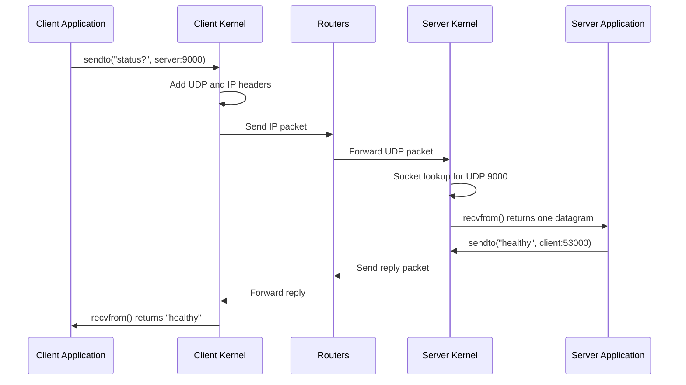

---

## Questions

1. At which stage is the client's source port selected?
2. Why does the server need the client's source port?
3. What happens if the server's receive queue fills before the application calls `recvfrom()`?
4. Why can the sender receive an ICMP Port Unreachable for UDP but not always?
5. Which parts of the UDP datagram normally remain unchanged across routers?
6. How does the destination kernel determine which application receives the message?

---

# 78. Testing UDP with Netcat

Different `nc` implementations have different options and behavior.

Always inspect:

```bash
nc -h
```

The examples below reflect common Linux netcat usage.

---

## 78.1 Start a UDP listener

On a test server:

```bash
nc -u -l 9000
```

Some implementations require:

```bash
nc -u -l -p 9000
```

### What it does

* `-u` selects UDP
* `-l` listens for incoming data
* `9000` specifies the local port in implementations using positional port syntax
* `-p 9000` specifies the local port in implementations requiring that form

### Why it is useful

It creates a simple UDP endpoint for testing:

* Addressing
* Routing
* UDP delivery
* Port selection
* Packet capture

---

## 78.2 Send a UDP message

From a client:

```bash
printf 'status?\n' | nc -u 203.0.113.20 9000
```

### What it does

`printf` writes a test message to netcat.

Netcat sends it using UDP to:

```text
203.0.113.20:9000
```

Replace the documentation address with an authorized test server.

---

## 78.3 Why UDP netcat tests can be confusing

A UDP sender can return without proving that the destination received the message.

There is no transport handshake.

The test becomes more meaningful when combined with:

* Visible output at the server
* Packet capture
* An application-level reply
* ICMP error observation

---

## 78.4 Capture the exchange

On the client or server:

```bash
sudo tcpdump -ni eth0 'udp port 9000 or icmp'
```

### Why include ICMP?

If no UDP service is listening, the destination may return an ICMP Port Unreachable message.

---

## 78.5 Restrict capture count

```bash
sudo tcpdump -ni eth0 -c 20 'udp port 9000 or icmp'
```

This stops after twenty matching packets.

---

## 78.6 Safety concerns

Do not expose an arbitrary test listener on an untrusted network longer than necessary.

Netcat does not provide authentication or encryption.

Use it only for controlled diagnostics.

---

# 79. UDP Failure Patterns

## 79.1 No packet leaves the client

Evidence:

```text
sendto() attempted
No packet visible on outgoing interface
```

Possible causes:

* Application used the wrong socket
* Route lookup failed
* Invalid destination
* Local policy rejected the send
* Interface unavailable
* Packet captured on the wrong interface

Check:

```bash
ip route get 203.0.113.20
ss -un
sudo tcpdump -ni any udp port 9000
```

`-i any` captures across multiple Linux interfaces but does not preserve every link-layer detail in the same way as a specific Ethernet interface capture.

---

## 79.2 Packet leaves but never reaches server

Possible causes:

* Forward route failure
* Wrong destination address
* Packet loss
* Server offline
* Path filtering
* Address translation problem
* MTU or fragmentation issue for large datagrams

Capture at multiple observation points where authorized.

---

## 79.3 Packet reaches server but application sees nothing

Possible causes:

* No socket bound to destination port
* Socket bound to another local address
* Receive queue overflow
* Application not reading
* Application expects a different message format
* Packet rejected by checksum validation
* Multiple sockets and distribution behavior

Check:

```bash
ss -lunp
sudo tcpdump -ni eth0 udp port 9000
```

If packet capture shows arrival but `ss` shows no listener, the destination kernel may reject it.

---

## 79.4 Server replies but client sees nothing

Possible causes:

* Wrong client source address or source port
* Missing return route
* Response sent through another interface
* Client socket closed
* Client receive queue overflow
* Return packet dropped
* Address translation state expired

Examine the complete return tuple:

```text
Server source IP and port
Client destination IP and port
```

---

## 79.5 Large UDP datagrams fail

A large UDP datagram can produce a large IP packet.

Potential outcomes:

* IPv4 fragmentation
* IPv6 source fragmentation
* ICMP Packet Too Big or fragmentation-needed errors
* Loss of one fragment invalidating the entire datagram
* Application timeout

Small UDP messages working does not prove large datagrams will work.

Applications commonly avoid very large UDP datagrams.

---

## 79.6 UDP receive-buffer overflow

A sender transmits faster than the receiving application reads.

Data flow:

```text
Incoming packets
        │
        ▼
Kernel UDP receive queue
        │
        ▼
Application recvfrom()
```

If the queue fills:

```text
New incoming datagrams may be dropped
```

The sender is not automatically informed through UDP flow control.

Linux may expose relevant statistics through:

```bash
netstat -su
```

if `netstat` is installed, or through:

```bash
nstat
```

and:

```bash
ss -u -a -m
```

Output and available counters vary.

---

## 79.7 Misconception: UDP is always faster

UDP has less transport machinery, but application performance depends on:

* Loss
* Retransmission strategy
* Packet size
* Congestion behavior
* Kernel implementation
* Application design
* Number of round trips

A poorly designed UDP protocol can perform worse than TCP.

---

## Questions

1. What evidence proves that a UDP application received a datagram?
2. Why can netcat report no immediate error even when the remote UDP port is closed?
3. What does packet arrival at the server interface prove, and what does it not prove?
4. Why are large UDP datagrams especially vulnerable to fragment loss?
5. How would a full receive queue affect the sender?
6. What evidence distinguishes a return-route failure from a server that never generated a reply?
7. Why is UDP's smaller header insufficient to conclude that it is faster for an application?

---

# 80. TCP Fundamentals

## 80.1 What TCP is

TCP stands for **Transmission Control Protocol**.

TCP provides a reliable, ordered, full-duplex byte stream between two endpoints.

Key properties include:

* Connection establishment
* Reliable delivery
* Ordered byte stream
* Retransmission
* Duplicate handling
* Flow control
* Congestion control
* Graceful connection closure

---

## 80.2 Why TCP exists

IP does not guarantee that packets:

* Arrive
* Arrive once
* Arrive in order
* Arrive without corruption
* Arrive quickly
* Follow the same route

Many applications need a simpler abstraction:

> Send this sequence of bytes and provide the same sequence to the receiver in order.

TCP builds that abstraction above IP.

---

## 80.3 TCP is a byte stream

TCP does not preserve application write boundaries.

Suppose the sender performs:

```text
write("ABC")
write("DEF")
```

The receiver might read:

```text
read() → "ABCDEF"
```

or:

```text
read() → "A"
read() → "BCDE"
read() → "F"
```

TCP guarantees ordered bytes, not matching write/read message units.

Applications must define their own framing.

Common framing methods include:

* Fixed-length messages
* Delimiters such as newline
* Length prefix
* Protocol-specific headers
* Closing the connection after one body

---

## 80.4 Full-duplex communication

TCP supports simultaneous communication in both directions.

```text
Client → Server
Server → Client
```

Each direction has its own:

* Byte sequence
* Sequence numbers
* Acknowledgements
* Flow-control state
* Shutdown state

Closing one direction does not always immediately close the other.

---

## 80.5 Reliable does not mean infallible

TCP attempts reliable delivery while a connection remains viable.

It cannot guarantee success when:

* Network remains unavailable
* Peer crashes
* Application closes
* Retransmission limit is reached
* System loses state
* Path fails permanently

The application can receive errors or timeouts.

TCP reliability means it detects and responds to many losses and ordering problems; it does not make communication physically guaranteed.

---

## 80.6 TCP header overview

A simplified TCP header:

```text
+-----------------------+-----------------------+
| Source Port           | Destination Port      |
+-----------------------------------------------+
| Sequence Number                               |
+-----------------------------------------------+
| Acknowledgement Number                        |
+----+------+-----------------------------------+
|Len |Flags | Window Size                       |
+-----------------------------------------------+
| Checksum              | Urgent Pointer        |
+-----------------------------------------------+
| Options, if present                            |
+-----------------------------------------------+
| Payload                                        |
+-----------------------------------------------+
```

The minimum TCP header is 20 bytes.

Options can make it larger.

---

## 80.7 Important TCP flags

| Flag            | General purpose                     |
| --------------- | ----------------------------------- |
| `SYN`           | Establish sequence-number state     |
| `ACK`           | Acknowledgement field is meaningful |
| `FIN`           | Sender has finished sending         |
| `RST`           | Reset or reject connection          |
| `PSH`           | Request prompt delivery behavior    |
| `URG`           | Urgent-pointer field is meaningful  |
| `ECE` and `CWR` | Congestion-notification support     |

At this level, `SYN`, `ACK`, `FIN`, and `RST` are the most important.

---

## Questions

1. Why must an application protocol define message boundaries over TCP?
2. What does TCP reliability protect against?
3. Why is TCP described as full duplex?
4. Why can a TCP connection still fail despite retransmission?
5. How does a byte-stream abstraction differ from UDP datagrams?
6. Which TCP flags are primarily involved in connection establishment and closure?

---

# 81. TCP Connection Identity

A TCP connection is commonly represented by:

```text
Local IP
Local port
Remote IP
Remote port
```

Example:

```text
Client:
192.0.2.10:49152

Server:
203.0.113.20:443
```

Connection:

```text
192.0.2.10:49152 ↔ 203.0.113.20:443
```

---

## 81.1 Multiple connections from one client

One client can open several connections to the same server:

```text
192.0.2.10:49152 → 203.0.113.20:443
192.0.2.10:49153 → 203.0.113.20:443
192.0.2.10:49154 → 203.0.113.20:443
```

Different source ports distinguish the connections.

---

## 81.2 Same source port to different destinations

These can also be separate:

```text
192.0.2.10:49152 → 203.0.113.20:443
192.0.2.10:49152 → 198.51.100.30:443
```

The destination address differs.

The entire tuple matters.

Whether the operating system permits a particular simultaneous binding combination depends on socket state and options.

---

## 81.3 Listening lookup versus established lookup

For a new incoming SYN, the kernel may first find a listening socket based on:

```text
Local IP
Local TCP port
```

After establishment, the full connection tuple identifies the connected socket.

This allows one listening socket to accept many connected sockets.

---

# 82. TCP Three-Way Handshake

## 82.1 Why a handshake exists

Before sending an ordinary reliable byte stream, the endpoints need to establish shared state.

The handshake confirms:

* Both directions are reachable at that moment
* Server has a listening TCP endpoint
* Each side's initial sequence number
* TCP options such as maximum segment size
* Readiness to create connection state

The handshake does not prove that the application will later process requests correctly.

---

## 82.2 The three messages

A TCP connection normally begins with:

```text
SYN
SYN-ACK
ACK
```

Assume:

```text
Client: 192.0.2.10:49152
Server: 203.0.113.20:443
```

---

## 82.3 Step 1: Client sends SYN

Conceptual packet:

```text
Source:      192.0.2.10:49152
Destination: 203.0.113.20:443

Flags:       SYN
Sequence:    1000
```

The number `1000` is a simplified example initial sequence number.

The client enters a state commonly called:

```text
SYN-SENT
```

---

## 82.4 Step 2: Server sends SYN-ACK

The server receives the SYN and finds a listening socket on TCP port `443`.

It creates connection state and replies:

```text
Source:          203.0.113.20:443
Destination:     192.0.2.10:49152

Flags:           SYN, ACK
Sequence:        7000
Acknowledgement: 1001
```

Why acknowledgement `1001`?

A SYN consumes one sequence number.

The server is saying:

> I received your SYN with sequence 1000 and expect your next sequence number to be 1001.

The server enters a state commonly called:

```text
SYN-RECEIVED
```

---

## 82.5 Step 3: Client sends ACK

The client replies:

```text
Source:          192.0.2.10:49152
Destination:     203.0.113.20:443

Flags:           ACK
Sequence:        1001
Acknowledgement: 7001
```

The acknowledgement confirms the server's SYN.

Both sides can now enter:

```text
ESTABLISHED
```

---

## 82.6 Sequence diagram

```mermaid
sequenceDiagram
    participant C as Client 192.0.2.10:49152
    participant S as Server 203.0.113.20:443

    C->>S: SYN, Seq=1000
    S-->>C: SYN-ACK, Seq=7000, Ack=1001
    C->>S: ACK, Seq=1001, Ack=7001
    Note over C,S: Connection established
```

---

## 82.7 What each message proves

### Client SYN reaches server

Provides evidence that:

* Client route works
* Forward path works
* Server host receives the packet
* Server's transport stack processes TCP

### SYN-ACK reaches client

Provides evidence that:

* Server found an acceptable listening endpoint
* Server generated a response
* Return path works
* Client receives the response

### Final ACK reaches server

Allows the server to confirm that the client received the SYN-ACK.

---

## 82.8 Why two messages are insufficient

Suppose only:

```text
Client SYN
Server SYN-ACK
```

The server would not know whether the SYN-ACK reached the client.

The final ACK confirms receipt of the server's sequence-number proposal.

---

## 82.9 Simultaneous open

TCP permits both endpoints to actively open toward each other at the same time.

This is uncommon in ordinary client-server applications but demonstrates that TCP's design is not fundamentally limited to one permanent “client” and one permanent “server” role.

---

## 82.10 Data in the handshake

Some TCP extensions and application mechanisms can allow data to be associated with connection establishment.

However, the foundational mental model remains:

```text
SYN → SYN-ACK → ACK → ordinary established data
```

Exact behavior can differ when specialized extensions are used.

---

## Questions

1. Why does each SYN consume one sequence number?
2. What does the server learn from the final ACK?
3. Which path directions are tested by the three-way handshake?
4. Why does handshake success not prove that HTTP will succeed?
5. What server state exists after receiving SYN but before receiving the final ACK?
6. How can one listening socket handle multiple simultaneous handshakes?
7. Why would a two-message handshake leave uncertainty?

---

# 83. Closed TCP Port and TCP Reset

## 83.1 Connection to a closed port

Suppose the server host is reachable but no TCP application listens on port `9999`.

Client sends:

```text
SYN to 203.0.113.20:9999
```

The destination TCP stack may respond:

```text
RST, ACK
```

This rejects the connection attempt.

Conceptually:

```mermaid
sequenceDiagram
    participant C as Client
    participant S as Server Kernel

    C->>S: SYN to TCP port 9999
    S->>S: No listening socket
    S-->>C: RST-ACK
```

---

## 83.2 Meaning of connection refused

An application may report:

```text
Connection refused
```

This commonly indicates that:

* The target host responded
* TCP reached the target stack
* No acceptable listener existed on that port, or the connection was actively rejected

This is different from a timeout.

---

## 83.3 Connection timeout

A timeout may indicate:

* SYN was lost
* Destination is unreachable
* Return path is broken
* Remote host is offline
* Packets are silently discarded
* Address is wrong
* Network is severely congested

A timeout provides less specific information than an explicit reset.

---

## 83.4 Application rejection after TCP establishment

A server may accept the TCP connection and then reject the application request.

Example:

```text
TCP handshake succeeds
Application sends request
Server returns protocol error
```

This is not a TCP connection-refused condition.

It is an application-layer response.

---

## Questions

1. What does an immediate TCP reset reveal that a timeout does not?
2. Why can a host be reachable while a specific TCP port is closed?
3. How does application rejection differ from TCP connection refusal?
4. What packet would you expect after a SYN reaches a closed TCP port?
5. Why can a timeout have many more causes than a reset?

---

# 84. TCP Sequence Numbers

## 84.1 Why sequence numbers exist

IP packets can be:

* Lost
* Reordered
* Duplicated
* Divided differently during transmission

TCP sequence numbers identify positions in the byte stream.

They allow the receiver to determine:

* Which bytes arrived
* Which bytes are missing
* Which bytes are duplicates
* How to reorder data

---

## 84.2 Sequence numbers count bytes

Suppose the sender's next sequence number is:

```text
1001
```

It sends 500 bytes.

The segment covers:

```text
Sequence 1001 through 1500
```

The next sequence number is:

```text
1501
```

Conceptually:

```text
Seq=1001, Length=500
Next sequence=1501
```

---

## 84.3 Acknowledgement numbers

TCP acknowledgements are normally cumulative.

An acknowledgement number means:

> I have received all bytes before this number and expect this number next.

Example:

```text
ACK = 1501
```

means:

```text
Bytes through sequence 1500 received
Next expected byte is 1501
```

---

## 84.4 Data-transfer example

Initial sequence state after handshake:

```text
Client next sequence: 1001
Server next sequence: 7001
```

Client sends 100 bytes:

```text
Client → Server
Seq=1001, Length=100
```

These bytes occupy:

```text
1001–1100
```

Server replies:

```text
ACK=1101
```

---

## 84.5 Sequence diagram

```mermaid
sequenceDiagram
    participant C as Client
    participant S as Server

    C->>S: Seq=1001, Len=100
    S-->>C: Ack=1101
    C->>S: Seq=1101, Len=200
    S-->>C: Ack=1301
```

---

## 84.6 Sequence-number wraparound

The TCP sequence-number field is 32 bits.

After reaching its maximum value, it wraps.

TCP includes rules for comparing sequence numbers safely within valid windows.

For ordinary troubleshooting, packet analyzers often display relative sequence numbers beginning at zero or one to simplify reading.

---

## 84.7 Relative sequence numbers in packet analyzers

A capture tool may show:

```text
SYN Seq=0
SYN-ACK Seq=0 Ack=1
ACK Seq=1 Ack=1
```

These may be relative values, not the actual sequence numbers carried on the wire.

Relative numbering makes conversations easier to follow.

When exact values matter, packet-analyzer settings can display raw sequence numbers.

---

## Questions

1. Why do TCP sequence numbers count bytes rather than packets?
2. What does `ACK=5001` mean?
3. If a segment begins at sequence 2001 and contains 750 bytes, what sequence is expected next?
4. How do sequence numbers help detect duplicated data?
5. Why can packet analyzers show sequence zero even when the actual initial value is large?
6. Why is cumulative acknowledgement useful when several segments arrive successfully?

---

# 85. TCP Segmentation and MSS

## 85.1 What segmentation is

Applications write a byte stream.

TCP divides that stream into segments suitable for transmission.

Example application write:

```text
10,000 bytes
```

TCP may transmit it as several segments:

```text
Segment 1: 1460 bytes
Segment 2: 1460 bytes
Segment 3: 1460 bytes
Segment 4: 1460 bytes
Segment 5: 1460 bytes
Segment 6: 1460 bytes
Segment 7: 1240 bytes
```

Actual segmentation may differ because of:

* MSS
* TCP options
* Congestion state
* Flow-control window
* Application write timing
* Offload features
* Path MTU

---

## 85.2 Maximum Segment Size

The TCP Maximum Segment Size, or MSS, indicates the largest TCP payload one endpoint is prepared to receive in one segment.

The MSS value excludes:

* IP header
* TCP header

For common Ethernet with IPv4:

```text
MTU 1500
- IPv4 header 20
- TCP header 20
= MSS 1460
```

For IPv6:

```text
MTU 1500
- IPv6 header 40
- TCP header 20
= MSS 1440
```

Additional headers can reduce effective payload.

---

## 85.3 MSS exchange

MSS is commonly advertised in SYN packets.

Example:

```text
Client SYN:
MSS 1460
```

The client is saying:

> Do not send me TCP segments larger than 1460 bytes of TCP payload under this basic interpretation.

The server advertises its own MSS independently.

Each direction can therefore have different limits.

---

## 85.4 MSS versus MTU

| Term | Meaning                                            |
| ---- | -------------------------------------------------- |
| MTU  | Maximum IP packet size on a link                   |
| MSS  | Maximum TCP payload size advertised by an endpoint |

Relationship in a simple case:

```text
MSS = MTU - IP header - TCP header
```

MSS is a TCP concept.

MTU is an IP/link-path constraint.

---

## 85.5 Segmentation offload caveat

Modern systems may use hardware or kernel offload.

Examples include:

* TCP Segmentation Offload
* Generic Segmentation Offload
* Generic Receive Offload

The kernel may hand a large logical buffer to the network interface, which later divides it into wire-sized segments.

A packet capture taken before or after offload processing may show packets larger than the physical-link MTU.

This does not always mean oversized packets were transmitted on the wire.

---

## 85.6 Why capture location matters

Capturing on the sending host may show:

```text
One logical TCP packet with several kilobytes of data
```

A capture on another physical device may show:

```text
Multiple MSS-sized TCP segments
```

The difference can result from offload, not network fragmentation.

---

## Questions

1. How does MSS differ from MTU?
2. Why does IPv6 commonly advertise a smaller MSS than IPv4 on the same 1500-byte link?
3. Why can each direction of a TCP connection have a different MSS?
4. How can offload make a local packet capture appear to violate the interface MTU?
5. Why should TCP segmentation not be confused with IPv4 fragmentation?
6. What factors besides MSS can reduce a segment's actual payload size?

---

# 86. TCP Reliability and Retransmission

## 86.1 Loss detection

TCP can infer loss through mechanisms including:

* Retransmission timeout
* Duplicate acknowledgements
* Selective acknowledgement information
* Other modern loss-detection logic

The exact algorithms vary across TCP implementations.

---

## 86.2 Retransmission timeout

Suppose the sender transmits:

```text
Seq=1001, Len=1000
```

It expects acknowledgement:

```text
ACK=2001
```

If no suitable acknowledgement arrives before the retransmission timer expires, TCP may retransmit the data.

```mermaid
sequenceDiagram
    participant C as Sender
    participant S as Receiver

    C->>S: Seq=1001, Len=1000
    Note over C,S: Segment or acknowledgement lost
    C--xS: No usable ACK received
    Note over C: Retransmission timer expires
    C->>S: Retransmit Seq=1001, Len=1000
    S-->>C: Ack=2001
```

---

## 86.3 Why a fixed timeout is insufficient

Network round-trip times differ.

Examples:

```text
Local LAN: a fraction of a millisecond to several milliseconds
Remote Internet path: tens or hundreds of milliseconds
Congested path: variable delay
```

TCP estimates round-trip behavior and adapts its retransmission timeout.

A timeout that is too short causes unnecessary retransmissions.

A timeout that is too long delays recovery.

---

## 86.4 Exponential backoff

When repeated retransmissions fail, TCP generally increases the time between attempts.

Conceptual pattern:

```text
1 second
2 seconds
4 seconds
8 seconds
...
```

Exact initial values and limits vary.

Backoff prevents a failing path from being flooded continuously.

---

## 86.5 Duplicate acknowledgements

Suppose segments arrive as:

```text
1
3
4
```

Segment 2 is missing.

The receiver continues acknowledging the next expected byte corresponding to segment 2.

Repeated acknowledgements for the same value provide evidence that later data arrived but a gap remains.

The sender may retransmit before waiting for the full timeout.

This is commonly associated with **fast retransmit**.

---

## 86.6 Selective Acknowledgement

With Selective Acknowledgement, or SACK, the receiver can report which non-contiguous byte ranges arrived.

Example:

```text
Received:
1001–2000
3001–5000

Missing:
2001–3000
```

A cumulative ACK alone says:

```text
Next expected: 2001
```

SACK can additionally indicate that later ranges are already present.

This helps the sender retransmit only missing data rather than unnecessarily resending everything after the gap.

SACK capability is commonly negotiated during the handshake.

---

## 86.7 Duplicate data handling

Suppose the original segment arrives, but its acknowledgement is lost.

The sender retransmits the segment.

The receiver may now see the same sequence range twice.

TCP uses sequence numbers to recognize the duplicate and avoids delivering the same bytes twice to the application.

It still sends an acknowledgement so the sender can update its state.

---

## 86.8 Checksum failure

If a received TCP segment fails checksum validation, the receiver discards it.

TCP recovery treats the data similarly to loss:

* No acknowledgement for the corrupted data
* Duplicate acknowledgements for a gap
* Eventual retransmission

The TCP checksum is an error-detection mechanism, not encryption or authentication.

---

## Questions

1. Why does TCP adapt its retransmission timeout to observed path behavior?
2. How can duplicate acknowledgements reveal a missing segment?
3. Why does exponential backoff help during persistent failure?
4. How does SACK improve recovery when several non-contiguous segments arrive?
5. Why might a sender retransmit data that the receiver already received?
6. How does TCP prevent duplicated segments from producing duplicated application bytes?
7. What happens when a TCP checksum fails?

---

# 87. TCP Ordering

## 87.1 Out-of-order arrival

Suppose the sender transmits:

```text
Segment A: bytes 1001–2000
Segment B: bytes 2001–3000
Segment C: bytes 3001–4000
```

The receiver gets:

```text
A
C
B
```

TCP can identify the order using sequence numbers.

---

## 87.2 Receiver behavior

After A:

```text
Next expected byte: 2001
```

After C arrives early:

```text
Bytes 3001–4000 are present
Bytes 2001–3000 are missing
```

The receiver may buffer C.

It continues acknowledging:

```text
ACK=2001
```

When B arrives, the contiguous range becomes:

```text
1001–4000
```

The receiver can advance the acknowledgement:

```text
ACK=4001
```

It can then make the complete ordered bytes available to the application.

---

## 87.3 Head-of-line blocking

TCP delivers an ordered byte stream.

If an earlier byte range is missing, later bytes are generally not delivered past the gap as ordinary ordered stream data.

This creates **head-of-line blocking**:

```text
Later data arrived
        │
        ▼
Earlier data missing
        │
        ▼
Application waits for retransmission
```

This ordering behavior is useful for many protocols but can delay independent logical messages sharing one TCP connection.

---

## 87.4 Packet order versus application order

Packets may arrive out of order.

The application still receives bytes in sequence.

This means a packet capture can show reordering even when the application observes no ordering problem.

---

## Questions

1. Why does the receiver keep acknowledging the same byte after an out-of-order segment arrives?
2. What happens to later data buffered behind a missing byte range?
3. Why can packet reordering be invisible to the application?
4. What is transport-layer head-of-line blocking?
5. How do sequence numbers distinguish reordering from duplication?

---

# 88. TCP Flow Control

## 88.1 What flow control is

Flow control prevents a sender from overwhelming the receiving host's TCP buffer.

It answers:

> How much additional data can the receiver currently accept?

TCP communicates this using the receive window.

---

## 88.2 Why flow control exists

Data path:

```text
Sender application
        │
        ▼
Sender TCP send buffer
        │
        ▼
Network
        │
        ▼
Receiver TCP receive buffer
        │
        ▼
Receiver application
```

The receiving application may read slowly.

Without flow control:

1. Data arrives faster than the application consumes it.
2. Receive buffer fills.
3. Additional data has nowhere to go.
4. Loss or excessive resource use results.

---

## 88.3 Advertised receive window

The receiver advertises available buffer space in TCP acknowledgements.

Example:

```text
Acknowledgement: 5001
Receive window:  65535 bytes
```

Conceptually:

> I have received bytes before 5001, and I can currently accept 65,535 additional bytes beyond the acknowledged position.

---

## 88.4 Window changes

Suppose:

```text
Receive buffer capacity: 64 KiB
Buffered unread data:    48 KiB
```

Available space:

```text
16 KiB
```

The advertised window becomes smaller.

When the application reads data, buffer space becomes available and the receiver can advertise a larger window.

---

## 88.5 Zero window

If the receive buffer is full, the receiver may advertise:

```text
Window = 0
```

The sender stops ordinary data transmission.

It periodically probes to discover when space becomes available.

This is different from network congestion.

A zero window usually indicates receiver-side application or buffer pressure.

---

## 88.6 Window scaling

The original TCP window field is 16 bits:

```text
Maximum unscaled value = 65,535 bytes
```

This can be too small for high-bandwidth, high-latency paths.

TCP Window Scale is negotiated during the handshake and allows larger effective windows.

The scaling factor cannot normally be introduced after the connection is established.

---

## 88.7 Bandwidth-delay product

To fully utilize a path, enough data must be allowed in flight.

Approximate bandwidth-delay product:

```text
Bandwidth × round-trip time
```

Example:

```text
Bandwidth: 100 Mbps
RTT:       100 ms
```

Convert:

```text
100 Mbps × 0.1 seconds
= 10 megabits
= 1.25 megabytes
```

Roughly 1.25 MB of data may need to be in flight to fill that path.

A very small receive window could limit throughput even when the link has high capacity.

---

## 88.8 Flow control versus congestion control

| Mechanism          | Protects     |
| ------------------ | ------------ |
| Flow control       | Receiver     |
| Congestion control | Network path |

The sender must obey both constraints.

Conceptually:

```text
Allowed in-flight data
= minimum(receive window, congestion window)
```

---

## Questions

1. What does the TCP receive window protect?
2. Why can a slow application cause the advertised window to shrink?
3. What does a zero window indicate?
4. Why is window scaling important on high-bandwidth, high-latency paths?
5. Calculate the approximate bandwidth-delay product of a 1 Gbps path with 20 ms RTT.
6. How does flow control differ from congestion control?
7. Why can a high-bandwidth path still produce low TCP throughput when the receive window is small?

---

# 89. TCP Congestion Control

## 89.1 What congestion is

Network congestion occurs when traffic demand exceeds available forwarding capacity.

Potential effects:

* Queues grow
* Latency increases
* Buffers overflow
* Packets are dropped
* Retransmissions increase
* Competing flows interfere with one another

TCP congestion control adjusts the sender's rate based on observed network conditions.

---

## 89.2 Why congestion control exists

Without congestion control, senders could continue transmitting aggressively during loss.

That could cause:

```text
More traffic
    ↓
More queueing and loss
    ↓
More retransmissions
    ↓
Even more traffic
```

Congestion control attempts to use available capacity without persistently overwhelming the path.

---

## 89.3 Congestion window

The sender maintains a congestion window, commonly abbreviated:

```text
cwnd
```

It limits how much unacknowledged data can be in flight based on network conditions.

The receiver advertises:

```text
rwnd
```

The sender is constrained by both:

```text
Usable window = min(cwnd, rwnd)
```

---

## 89.4 Slow start

A new TCP connection does not initially know the path's available capacity.

During slow start, the sender increases its sending allowance rapidly as acknowledgements arrive.

The name “slow start” is historical; growth can be relatively fast.

Simplified pattern:

```text
Initial window
2 × initial window
4 × initial window
8 × initial window
...
```

Actual growth, limits, and initial-window values depend on implementation and standards.

---

## 89.5 Congestion avoidance

After reaching a threshold or detecting congestion, TCP usually enters more cautious growth.

Instead of exponential increase, it may grow approximately linearly under classic behavior.

The exact algorithm depends on the congestion-control implementation.

Common operating systems support algorithms such as:

* CUBIC
* Reno-derived algorithms
* BBR

Detailed algorithm mathematics is beyond the current intermediate scope.

---

## 89.6 Congestion signals

TCP can respond to signals including:

* Packet loss
* Retransmission timeout
* Duplicate acknowledgements
* Explicit Congestion Notification

Loss is not always caused by congestion.

Wireless corruption or route changes can also lose packets.

However, traditional TCP often treats loss as a congestion signal because that is the safest general response.

---

## 89.7 Fast retransmit and recovery

When duplicate acknowledgements strongly suggest one segment is missing, the sender may:

1. Retransmit the missing segment.
2. Reduce its congestion window.
3. Continue without waiting for the full timeout.

This avoids unnecessarily stopping the entire flow for one inferred loss.

Exact fast-recovery behavior differs by implementation.

---

## 89.8 Retransmission timeout response

A timeout is generally treated as a stronger indication of congestion or path failure than a few duplicate acknowledgements.

The sender usually reduces its sending rate substantially.

This can cause throughput to drop sharply.

---

## 89.9 Queueing delay

A path can experience high latency before packet loss appears.

When router queues fill:

```text
Packets wait longer
        │
        ▼
RTT increases
```

This can make interactive traffic feel slow even when throughput remains high.

A speed test may show good bandwidth while:

* SSH becomes laggy
* Voice traffic stutters
* Web interactions feel delayed

---

## 89.10 Congestion control is end-to-end

Routers queue or drop packets and may mark congestion.

The TCP endpoints interpret those signals and adapt.

Routers do not normally manage each TCP application's sending logic directly.

---

## Questions

1. Why does TCP use a congestion window in addition to the receive window?
2. What happens when `cwnd` is smaller than `rwnd`?
3. Why is a timeout usually treated as a more serious signal than a few duplicate acknowledgements?
4. How can queue growth increase latency without immediately reducing throughput?
5. Why can packet loss on wireless links cause TCP to reduce its rate even when no router queue is congested?
6. What is the purpose of slow start?
7. Why would uncontrolled retransmission make congestion worse?

---

# 90. TCP Acknowledgement and Window Walkthrough

Assume:

```text
Client next sequence: 1001
Server next sequence: 7001
Server receive window: 4000 bytes
Client congestion window: 3000 bytes
```

Allowed client data in flight:

```text
min(4000, 3000) = 3000 bytes
```

---

## 90.1 Client sends three segments

```text
Segment 1:
Seq=1001
Length=1000

Segment 2:
Seq=2001
Length=1000

Segment 3:
Seq=3001
Length=1000
```

The client now has 3000 unacknowledged bytes in flight.

It waits for acknowledgements before exceeding its current congestion allowance.

---

## 90.2 Segment 2 is lost

Server receives:

```text
Segment 1
Segment 3
```

After Segment 1:

```text
ACK=2001
```

After out-of-order Segment 3:

```text
ACK=2001
```

The server still expects byte 2001.

---

## 90.3 Additional data creates duplicate acknowledgements

If more later segments arrive, the receiver continues acknowledging:

```text
ACK=2001
```

Repeated identical acknowledgements can lead the sender to infer that the segment beginning at sequence 2001 is missing.

---

## 90.4 Sender retransmits

```text
Retransmit:
Seq=2001
Length=1000
```

Once received, the server has a contiguous stream through byte 4000.

It can send:

```text
ACK=4001
```

assuming all relevant bytes arrived.

---

## 90.5 Receiver window shrinks

Suppose the server application has not read the data.

The server's receive buffer fills, and it advertises:

```text
Window=1000
```

The sender must now limit unacknowledged data according to the smaller receive window, even if the congestion window permits more.

---

## 90.6 Application reads data

The server application reads 3000 bytes.

The receive buffer has more free space.

The server advertises a larger window:

```text
Window=4000
```

The sender can continue, subject to its congestion window.

---

# 91. TCP Connection Teardown

## 91.1 Why teardown requires coordination

TCP is full duplex.

Each endpoint can finish sending independently.

A normal close therefore often uses a FIN in each direction.

A FIN means:

> I will send no more bytes in this direction.

It does not necessarily mean:

> I refuse to receive more bytes.

---

## 91.2 Typical four-message close

Assume the client closes first.

```text
Client FIN
Server ACK
Server FIN
Client ACK
```

---

## 91.3 Step 1: Client sends FIN

```text
Flags: FIN, ACK
```

The client enters a state commonly called:

```text
FIN-WAIT-1
```

The FIN consumes one sequence number.

---

## 91.4 Step 2: Server acknowledges

The server acknowledges the client's FIN.

The client may enter:

```text
FIN-WAIT-2
```

The server may enter:

```text
CLOSE-WAIT
```

At this point:

* Client has finished sending
* Server may still send remaining data
* Server application must eventually close its side

---

## 91.5 Step 3: Server sends FIN

When the server application finishes:

```text
Flags: FIN, ACK
```

The server enters a closing state such as:

```text
LAST-ACK
```

---

## 91.6 Step 4: Client acknowledges

The client sends the final ACK.

The server can remove connection state after receiving it.

The client commonly enters:

```text
TIME-WAIT
```

---

## 91.7 Sequence diagram

```mermaid
sequenceDiagram
    participant C as Client
    participant S as Server

    C->>S: FIN, ACK
    S-->>C: ACK
    Note over S: Server may still send data
    S-->>C: FIN, ACK
    C->>S: ACK
    Note over C: TIME-WAIT
```

---

## 91.8 Combined FIN and ACK

The peer may combine acknowledgement and FIN when it has no more data to send.

The exchange may appear as three packets:

```text
FIN
FIN-ACK
ACK
```

TCP behavior is defined by flags and sequence state rather than a mandatory four-packet visual pattern.

---

## 91.9 Half-close

An application can shut down only its sending direction.

Example:

```text
Client finishes request
Client sends FIN
Server continues sending response
```

This is called a half-close.

It can be useful in protocols where end-of-stream signals completion of one side's message.

---

# 92. TIME-WAIT

## 92.1 What TIME-WAIT is

After actively closing a TCP connection, an endpoint commonly remains in `TIME-WAIT`.

It retains connection information temporarily.

---

## 92.2 Why TIME-WAIT exists

TIME-WAIT serves purposes including:

### Retransmitting the final ACK

If the final ACK is lost, the peer may retransmit its FIN.

The endpoint in TIME-WAIT can respond again.

### Preventing old segments from contaminating a new connection

Delayed packets from the previous connection should expire before an identical connection tuple is reused in a way that could cause confusion.

---

## 92.3 TIME-WAIT is not automatically a fault

A busy client or server may show many TIME-WAIT sockets.

This can be normal when many short-lived TCP connections close.

It becomes relevant when:

* Ephemeral ports are exhausted
* Connection churn is excessive
* Application design creates unnecessary connections
* System limits are reached

Do not treat every TIME-WAIT entry as a leak.

---

## 92.4 Inspect TIME-WAIT sockets

```bash
ss -tan state time-wait
```

### What it does

Displays TCP sockets currently in TIME-WAIT.

### Why it is useful

It helps measure short-lived connection churn and investigate port reuse pressure.

---

## Questions

1. Why does a normal TCP close often require a FIN in each direction?
2. What does `CLOSE-WAIT` imply about the local application?
3. Why does FIN consume a sequence number?
4. What problem does TIME-WAIT solve if the final ACK is lost?
5. Why can many TIME-WAIT entries be normal?
6. What is a TCP half-close?
7. Why can a connection close use three packets instead of four?

---

# 93. TCP Reset

## 93.1 What RST means

A TCP Reset abruptly rejects or terminates a connection.

It does not perform a graceful FIN-based shutdown.

Possible reasons include:

* Connection attempted to a closed port
* Application aborts a socket
* Host receives a segment for nonexistent connection state
* Connection state was lost
* Application closes with unread data under particular conditions
* Protocol implementation detects an invalid state

---

## 93.2 FIN versus RST

| FIN                                           | RST                                        |
| --------------------------------------------- | ------------------------------------------ |
| Graceful end of byte stream                   | Abrupt termination                         |
| Existing buffered data may still be delivered | Pending communication may fail immediately |
| Each direction closes independently           | Connection state is rejected or aborted    |
| Normal shutdown path                          | Error or forced termination path           |

---

## 93.3 Application-visible errors

A reset may appear as:

```text
Connection reset by peer
```

This means the peer or an intermediate system generated a valid-looking TCP reset for the connection.

It does not by itself reveal why the peer reset it.

Packet capture and application logs are needed.

---

## Questions

1. How does a reset differ from a graceful FIN?
2. Why might a server reset a connection after the handshake succeeds?
3. What does “connection reset by peer” prove?
4. Why are application logs needed in addition to packet capture when investigating resets?
5. What reset behavior would you expect when connecting to a closed TCP port?

---

# 94. TCP State Model

## 94.1 Important states

| State          | General meaning                                              |
| -------------- | ------------------------------------------------------------ |
| `LISTEN`       | Waiting for incoming connections                             |
| `SYN-SENT`     | SYN sent, awaiting response                                  |
| `SYN-RECEIVED` | SYN received and SYN-ACK sent                                |
| `ESTABLISHED`  | Connection active                                            |
| `FIN-WAIT-1`   | Local FIN sent                                               |
| `FIN-WAIT-2`   | Local FIN acknowledged; waiting for peer FIN                 |
| `CLOSE-WAIT`   | Peer FIN received; local application has not closed          |
| `LAST-ACK`     | Local FIN sent after peer close; awaiting ACK                |
| `TIME-WAIT`    | Waiting for delayed segments and possible FIN retransmission |
| `CLOSED`       | No connection state                                          |

Not every transition is shown here.

TCP includes additional closing states and unusual transitions.

---

## 94.2 Why states matter

The state identifies where the connection is in its lifecycle.

Examples:

### Many `SYN-SENT`

Possible indications:

* Remote host not responding
* Return path failure
* Destination silently dropping SYN packets
* Incorrect destination
* Severe packet loss

### Many `SYN-RECEIVED`

Possible indications:

* Final ACKs are not arriving
* Clients abandoned connection attempts
* Server's pending-connection queue is under pressure
* Return or forward path is impaired

### Many `CLOSE-WAIT`

Often suggests that:

* Peer closed its direction
* Local kernel informed the application
* Local application has not closed the socket

Persistent growth can indicate an application resource-management problem.

### Many `FIN-WAIT-2`

May indicate that:

* Local side closed
* Peer acknowledged
* Peer has not sent its FIN

---

## 94.3 Inspect TCP states

```bash
ss -tan
```

### What it does

Displays numeric TCP sockets in multiple states.

Filter examples:

```bash
ss -tan state established
ss -tan state syn-sent
ss -tan state close-wait
ss -tan state time-wait
```

### Why it is useful

Socket states help localize a problem:

```text
Before connection established?
During data transfer?
During application shutdown?
```

---

## Questions

1. What does persistent `SYN-SENT` suggest?
2. Why can many `CLOSE-WAIT` sockets indicate an application problem?
3. What event moves a server from `SYN-RECEIVED` to `ESTABLISHED`?
4. What has already occurred when a socket reaches `FIN-WAIT-2`?
5. Why are TCP state counts useful even without packet capture?

---

# 95. Observing a TCP Handshake

## 95.1 Capture a specific server port

```bash
sudo tcpdump -ni eth0 'tcp port 443'
```

### What it does

Captures TCP packets where either source or destination port is `443`.

### Why it is useful

It can show:

* SYN
* SYN-ACK
* ACK
* Data
* Retransmissions
* FIN
* RST

---

## 95.2 Capture only handshake-related flags

A common filter for packets with SYN or FIN or RST flags is:

```bash
sudo tcpdump -ni eth0 \
  'tcp port 443 and (tcp[tcpflags] & (tcp-syn|tcp-fin|tcp-rst) != 0)'
```

### What it does

Matches TCP port 443 packets carrying at least one selected flag.

### Important caution

This excludes ordinary ACK-only packets, including the handshake's final ACK.

For a complete handshake, start with:

```bash
sudo tcpdump -ni eth0 'tcp port 443'
```

and inspect the first packets.

---

## 95.3 Disable relative sequence interpretation

`tcpdump` commonly prints relative sequence numbers where possible.

Use:

```bash
sudo tcpdump -nS -i eth0 'tcp port 443'
```

### Important flag

```text
-S
```

Prints absolute TCP sequence numbers instead of relative values.

Relative values are usually easier for learning.

---

## 95.4 Increase verbosity

```bash
sudo tcpdump -nvvi eth0 'tcp port 443'
```

Possible details include:

* Flags
* Sequence range
* Acknowledgement
* Window
* TCP options
* Packet length

Example conceptual output:

```text
192.0.2.10.49152 > 203.0.113.20.443:
Flags [S], seq 1000, win 64240,
options [mss 1460,sackOK,wscale 7]

203.0.113.20.443 > 192.0.2.10.49152:
Flags [S.], seq 7000, ack 1001,
win 65160,
options [mss 1460,sackOK,wscale 7]

192.0.2.10.49152 > 203.0.113.20.443:
Flags [.], ack 7001
```

Symbols commonly include:

| Display         | Meaning      |
| --------------- | ------------ |
| `[S]`           | SYN          |
| `[S.]`          | SYN plus ACK |
| `[.]`           | ACK          |
| `[F.]`          | FIN plus ACK |
| `[R]` or `[R.]` | Reset        |

Exact formatting varies.

---

## 95.5 TCP option interpretation

Possible SYN options:

```text
mss 1460
```

Maximum TCP payload the sender is prepared to receive in a segment.

```text
sackOK
```

Selective Acknowledgement is supported.

```text
wscale 7
```

Window scaling is supported with a negotiated scale value.

```text
timestamp
```

Timestamp-related TCP option is present.

Options can differ by operating system and connection.

---

## 95.6 Capture file

```bash
sudo tcpdump -ni eth0 \
  -w tcp-handshake.pcap \
  'tcp port 443'
```

Stop the capture after reproducing the connection.

Read summary output:

```bash
tcpdump -nr tcp-handshake.pcap
```

A packet analyzer such as Wireshark can provide detailed stream and field inspection.

### Safety

HTTPS payload is encrypted after TLS begins, but captures still expose metadata such as:

* Source and destination addresses
* Ports
* Timing
* Packet sizes
* TCP behavior
* Some unencrypted handshake metadata

Protect capture files.

---

# 96. Testing TCP Connectivity

## 96.1 Netcat connection test

```bash
nc -vz 203.0.113.20 443
```

Common options:

| Flag | Meaning                                 |
| ---- | --------------------------------------- |
| `-v` | Verbose output                          |
| `-z` | Probe without interactive data transfer |

### Why it is useful

It can test whether a TCP connection can be established to a specific IP and port.

Possible outcomes:

```text
Succeeded
```

Evidence that a TCP handshake completed.

```text
Connection refused
```

Evidence of an explicit rejection, commonly a reset.

```text
Timed out
```

No successful connection or explicit rejection arrived before timeout.

### Implementation caution

Netcat variants differ.

Check:

```bash
nc -h
```

---

## 96.2 Test with a timeout

Some implementations support:

```bash
nc -vz -w 3 203.0.113.20 443
```

`-w 3` commonly sets a timeout of three seconds.

Semantics differ between netcat variants.

---

## 96.3 Curl for application-aware testing

```bash
curl -v https://www.example.com/
```

### What it does

Performs an HTTP request over HTTPS and prints verbose connection details.

### Why it is useful

It tests multiple layers:

* DNS resolution
* Address selection
* TCP connection
* TLS negotiation
* HTTP request and response

Because it tests several mechanisms at once, failure must be interpreted by stage.

---

## 96.4 Connect to a specific IP while preserving hostname

```bash
curl -v \
  --resolve www.example.com:443:203.0.113.20 \
  https://www.example.com/
```

### What it does

For this curl invocation, it maps:

```text
www.example.com:443
```

to:

```text
203.0.113.20
```

### Why it is useful

It can bypass ordinary DNS lookup while still using the hostname for:

* URL semantics
* HTTP host information
* TLS server-name behavior

This helps separate DNS resolution from TCP, TLS, and HTTP behavior.

Use an address belonging to the intended service. Connecting a hostname to an unrelated server can produce misleading certificate and application errors.

---

## 96.5 Force an address family

```bash
curl -4 -v https://www.example.com/
```

Uses IPv4.

```bash
curl -6 -v https://www.example.com/
```

Uses IPv6.

### Why it is useful

It helps isolate dual-stack failures.

---

## 96.6 Safety

Connection probes are generally low impact when used sparingly against authorized systems.

Avoid:

* Large port ranges
* High-rate probing
* Repeated automated scans
* Testing networks without permission

---

# 97. TCP Failure Scenarios

## 97.1 No SYN leaves

Application reports a connection error, but capture shows no SYN.

Possible causes:

* DNS returned no usable address
* Route lookup failed
* No source address available
* Local socket creation failed
* Application never attempted connection
* Capture is on the wrong interface
* Local policy rejected operation

Check:

```bash
ip route get 203.0.113.20
ss -tan state syn-sent
sudo tcpdump -ni any 'host 203.0.113.20 and tcp port 443'
```

---

## 97.2 Repeated SYN, no response

Capture:

```text
SYN
SYN retransmission
SYN retransmission
```

No SYN-ACK or RST.

Possible causes:

* Destination host offline
* Forward packet dropped
* Return packet dropped
* Service path silently discards traffic
* Incorrect address
* Routing failure
* Severe packet loss

This is typically observed by the application as a timeout.

---

## 97.3 SYN followed by RST

Capture:

```text
SYN
RST-ACK
```

Likely interpretation:

* Destination host responded
* TCP port is closed or actively rejected

Check whether the service:

* Is running
* Is listening on the expected address
* Is using the expected port
* Has completed startup

---

## 97.4 SYN-ACK reaches client but final ACK does not reach server

Client capture:

```text
SYN
SYN-ACK
ACK
```

Server capture:

```text
SYN
SYN-ACK
No final ACK
```

Possible causes:

* Final ACK lost
* Asymmetric path issue
* Packet dropped between client and server
* Capture timing or location mismatch
* Address translation state problem

The server may retransmit SYN-ACK.

---

## 97.5 Handshake succeeds, application hangs

Capture:

```text
SYN
SYN-ACK
ACK
```

But no useful application progress.

Possible causes:

* Client sends no request
* Server application does not read
* TLS negotiation stalls
* Protocol mismatch
* Server is overloaded
* Data packet loss
* Path MTU problem
* Receive window becomes zero

Handshake success narrows the problem but does not prove application health.

---

## 97.6 Repeated retransmissions during transfer

Possible causes:

* Packet loss
* Congestion
* Unstable wireless link
* Path MTU failure
* Receiver overload
* Return acknowledgements lost
* Severe reordering misinterpreted as loss

Look at both directions.

Retransmitted data does not prove that the forward data packet was lost; the acknowledgement could have been lost instead.

---

## 97.7 Zero-window condition

Capture or socket information shows:

```text
Window = 0
```

Likely interpretation:

* Receiver buffer is full
* Receiving application is not reading quickly enough
* Receiver resource pressure exists

This is not ordinarily fixed by adding network bandwidth.

---

## 97.8 Persistent CLOSE-WAIT

Local `ss` output shows many:

```text
CLOSE-WAIT
```

Interpretation:

* Remote peers have closed
* Local kernel delivered end-of-stream
* Local application has not closed corresponding sockets

Investigate application connection cleanup.

---

## 97.9 Many short-lived connections

Symptoms:

* Large number of TIME-WAIT sockets
* High connection-establishment overhead
* Ephemeral-port pressure
* Repeated TLS handshakes
* Increased latency

Potential improvement at the application layer:

* Reuse suitable connections
* Use persistent protocol sessions
* Avoid unnecessary reconnects

Exact design depends on the application protocol.

---

# 98. Troubleshooting a Website TCP Connection

Assume the browser tries:

```text
https://www.example.com/
```

DNS returns:

```text
203.0.113.20
```

The browser attempts TCP port `443`.

---

## Step 1: Confirm destination address

Use a DNS-aware tool, covered fully later, or inspect application output.

Determine the exact destination address selected.

Do not troubleshoot an assumed address when the application chose another one.

---

## Step 2: Inspect route

```bash
ip route get 203.0.113.20
```

Confirm:

* Next hop
* Interface
* Source address

---

## Step 3: Inspect neighbor resolution

If the route uses gateway `192.0.2.1`:

```bash
ip neighbor show 192.0.2.1
```

A failed next-hop entry prevents the SYN from leaving the local link successfully.

---

## Step 4: Observe socket state

During the connection attempt:

```bash
ss -tn state syn-sent
```

A matching entry indicates the kernel has initiated a connection and awaits a response.

---

## Step 5: Capture TCP packets

```bash
sudo tcpdump -nvi eth0 \
  'host 203.0.113.20 and tcp port 443'
```

Classify the pattern.

### Pattern A

```text
SYN
SYN-ACK
ACK
```

TCP connection established.

Move to TLS or HTTP diagnosis.

### Pattern B

```text
SYN
RST
```

Port closed or actively rejected.

### Pattern C

```text
Repeated SYN
No response
```

Forward/return path failure or silent discard.

### Pattern D

```text
Handshake
Data
Retransmissions
```

Investigate packet loss, path MTU, receiver behavior, and application processing.

---

## Step 6: Compare client and server captures

When both endpoints are controlled:

### Client shows SYN leaving

### Server does not see SYN

Problem lies before server receipt.

### Server sees SYN and sends SYN-ACK

### Client does not see SYN-ACK

Investigate return path.

### Client sees SYN-ACK and sends ACK

### Server does not see ACK

Investigate client-to-server path for the final handshake packet.

This two-point comparison sharply narrows the fault domain.

---

## Step 7: Check server listener

On the server:

```bash
ss -ltnp 'sport = :443'
```

Or:

```bash
ss -ltnp | grep ':443'
```

Confirm:

* Service is listening
* Correct port
* Correct local address
* Correct address family
* Expected process

---

## Step 8: Separate TCP from application protocol

A successful:

```bash
nc -vz 203.0.113.20 443
```

shows TCP establishment but not valid HTTPS.

Use:

```bash
curl -v https://www.example.com/
```

to continue into TLS and HTTP behavior.

---

# 99. Practical TCP Server Example

A simple Python server can demonstrate listening and accepted sockets.

Use only on a controlled test host.

## Server

```bash
python3 - <<'PY'
import socket

HOST = "127.0.0.1"
PORT = 9001

with socket.socket(socket.AF_INET, socket.SOCK_STREAM) as server:
    server.setsockopt(socket.SOL_SOCKET, socket.SO_REUSEADDR, 1)
    server.bind((HOST, PORT))
    server.listen(5)

    print(f"Listening on {HOST}:{PORT}")

    connection, peer = server.accept()
    with connection:
        print(f"Accepted connection from {peer}")

        data = connection.recv(4096)
        print(f"Received {len(data)} bytes: {data!r}")

        connection.sendall(b"response\n")
PY
```

---

## 99.1 What the server does

### `socket.socket(AF_INET, SOCK_STREAM)`

Creates an IPv4 TCP socket.

### `SO_REUSEADDR`

Allows certain local-address reuse behavior, particularly after previous sockets close.

Its exact behavior differs by operating system.

It does not mean arbitrary simultaneous processes can always share the port.

### `bind((HOST, PORT))`

Associates the socket with:

```text
127.0.0.1:9001
```

### `listen(5)`

Marks the socket as listening.

The argument controls a pending-connection backlog hint; exact handling depends on the operating system.

### `accept()`

Waits for an established incoming connection and returns a new connected socket.

### `recv(4096)`

Reads up to 4096 bytes from the TCP byte stream.

It is not guaranteed to receive one complete application message.

### `sendall()`

Attempts to send all supplied bytes, internally handling partial send operations.

---

## Client

In another terminal:

```bash
printf 'request\n' | nc 127.0.0.1 9001
```

Expected client-visible response:

```text
response
```

---

## 99.2 Observe sockets

Before connecting:

```bash
ss -ltnp 'sport = :9001'
```

You should see the listening socket.

During an established connection, if the server is paused or modified to wait:

```bash
ss -tnp 'sport = :9001 or dport = :9001'
```

Filter support may vary by `ss` version.

---

## 99.3 Capture loopback traffic

```bash
sudo tcpdump -ni lo 'tcp port 9001'
```

Observe:

1. SYN
2. SYN-ACK
3. ACK
4. Client data
5. Server acknowledgement
6. Server data
7. Connection close

---

## 99.4 Safety

This example binds only to loopback:

```text
127.0.0.1
```

It is not intended to accept remote network connections.

Changing it to:

```text
0.0.0.0
```

would expose the service on suitable IPv4 interfaces.

Do not do that on an untrusted network without understanding the exposure.

---

# 100. TCP Misconceptions

## Misconception 1: One application write equals one TCP packet

TCP is a byte stream.

The kernel may:

* Split one write across segments
* Combine several writes
* Delay small transmissions
* Use offload

---

## Misconception 2: One TCP packet equals one application message

Applications must define message framing.

A packet boundary is not an application-message boundary.

---

## Misconception 3: An ACK means the application processed the data

A TCP ACK normally means the receiving TCP stack accepted the bytes.

It does not necessarily mean the destination application:

* Read them
* Parsed them
* Stored them
* Completed the requested operation

Application-level acknowledgement is separate.

---

## Misconception 4: A successful handshake proves the server works

It proves TCP establishment.

The application may still:

* Be overloaded
* Reject the request
* Use another protocol
* Fail during TLS
* Return an error
* Close immediately

---

## Misconception 5: Retransmission proves the data packet was lost

The data may have arrived while its acknowledgement was lost.

The sender retransmits because it lacks sufficient confirmation.

---

## Misconception 6: TCP guarantees low latency

TCP provides reliability and congestion control.

Retransmission, ordering, queueing, and flow control can increase delay.

---

## Misconception 7: TCP preserves records or messages

TCP preserves bytes and order, not application record boundaries.

---

## Misconception 8: TCP port 443 means the data is encrypted

Port numbers do not provide encryption.

Port `443` conventionally carries HTTPS, but any application can technically bind to that port if permitted.

TLS provides encryption, not the port number.

---

## Misconception 9: A large receive window guarantees high throughput

Throughput can still be constrained by:

* Congestion window
* Packet loss
* RTT
* Sender limitations
* Application behavior
* Path capacity
* Server processing

---

## Misconception 10: TIME-WAIT always indicates a leak

TIME-WAIT is a normal TCP state.

Excessive connection churn may be inefficient, but the state itself is intentional.

---

# 101. UDP and TCP Comparison

| Property                     | UDP                        | TCP                              |
| ---------------------------- | -------------------------- | -------------------------------- |
| Abstraction                  | Datagrams                  | Byte stream                      |
| Connection handshake         | None                       | Three-way handshake              |
| Message boundaries           | Preserved                  | Not preserved                    |
| Ordered delivery             | No                         | Yes                              |
| Retransmission               | No                         | Yes                              |
| Duplicate suppression        | No                         | Yes                              |
| Flow control                 | No                         | Yes                              |
| Congestion control           | Not in UDP itself          | Yes                              |
| Header minimum               | 8 bytes                    | 20 bytes                         |
| Multicast support            | Yes                        | No ordinary TCP multicast        |
| Typical failure observation  | Timeout or ICMP error      | Reset, timeout, state transition |
| Application framing required | Datagram is a message unit | Yes                              |
| Best choice depends on       | Application requirements   | Application requirements         |

---

## 101.1 Choosing based on semantics

Use TCP when the application requires a reliable ordered stream and TCP's connection model is appropriate.

Use UDP when the application needs datagram semantics or implements appropriate higher-level transport behavior.

The decision should not be based solely on:

```text
TCP is slow
UDP is fast
```

Instead ask:

* Is loss acceptable?
* Is late data useful?
* Are message boundaries important?
* Does the application implement retransmission?
* Is multicast required?
* How will congestion be controlled?
* Is connection setup acceptable?
* Does the application need ordered delivery?

---

# 102. End-to-End Transport Walkthrough for the Website

Return to:

```text
https://www.example.com/
```

Assume DNS already returned:

```text
203.0.113.20
```

The browser wants HTTPS on TCP port `443`.

---

## Stage 1: Browser requests a connection

Conceptually:

```text
socket(AF_INET, SOCK_STREAM, TCP)
connect(203.0.113.20, 443)
```

The kernel assigns a local endpoint:

```text
192.0.2.10:49152
```

Connection tuple:

```text
192.0.2.10:49152 → 203.0.113.20:443
```

---

## Stage 2: Route lookup

The kernel selects:

```text
default via 192.0.2.1 dev eth0
```

Source address:

```text
192.0.2.10
```

---

## Stage 3: Neighbor resolution

The kernel resolves:

```text
192.0.2.1 → gateway MAC
```

---

## Stage 4: TCP SYN is built

TCP header:

```text
Source port:      49152
Destination port: 443
Flags:            SYN
Initial sequence: client-generated value
Options:          MSS, SACK support, window scale, others
```

---

## Stage 5: IP encapsulation

```text
Source IP:      192.0.2.10
Destination IP: 203.0.113.20
Protocol:       TCP
```

---

## Stage 6: Ethernet encapsulation

```text
Source MAC:      client MAC
Destination MAC: gateway MAC
EtherType:       IPv4
```

---

## Stage 7: Routers forward SYN

At each router:

* Ethernet framing changes
* TTL decreases
* IPv4 header checksum updates
* Destination IP remains the server
* TCP destination port remains 443

---

## Stage 8: Server receives SYN

The server kernel:

1. Reads IPv4 protocol `6`.
2. Passes payload to TCP.
3. Reads destination port `443`.
4. Finds the listening socket.
5. Creates pending connection state.
6. Sends SYN-ACK.

---

## Stage 9: Client receives SYN-ACK

The client kernel:

1. Matches the connection tuple.
2. Validates acknowledgement.
3. Records server sequence state.
4. Sends final ACK.
5. Marks the socket established.
6. Returns success from `connect()`.

---

## Stage 10: Browser begins TLS

TCP now provides an ordered byte stream.

The browser sends TLS protocol bytes.

TCP may divide those bytes into multiple segments.

TLS internals are outside the current requested enterprise/security scope, but HTTPS depends on TLS above TCP.

---

## Stage 11: HTTP request travels in the stream

After TLS setup, the browser sends an HTTP request through the protected connection.

Conceptually:

```text
Browser application bytes
        │
        ▼
TLS records
        │
        ▼
TCP byte stream
        │
        ▼
TCP segments
        │
        ▼
IP packets
        │
        ▼
Link-layer frames
```

---

## Stage 12: Server response returns

The server application writes response bytes.

TCP:

* Numbers bytes
* Segments them
* Respects receive and congestion windows
* Retransmits losses
* Reorders received data
* Delivers an ordered stream

The browser processes the returned TLS and HTTP data.

---

# 103. Transport-Layer Recall and Diagnostic Questions

1. Trace a TCP SYN from `connect()` to the remote listening socket.

2. Which identifiers are used at each stage?

   * Ethernet switching
   * IP routing
   * TCP socket lookup
   * Process delivery

3. Why does the client use an ephemeral port?

4. How can two browser tabs connect to the same server IP and port simultaneously?

5. What does the tuple below identify?

   ```text
   192.0.2.10:49152 → 203.0.113.20:443
   ```

6. Why is the transport protocol required in addition to the port number?

7. Explain why UDP preserves message boundaries while TCP does not.

8. What happens when a UDP datagram arrives for an unbound port?

9. What happens when a TCP SYN arrives for an unbound port?

10. Why can both situations produce different error behavior?

11. A TCP capture shows:

    ```text
    SYN
    SYN
    SYN
    ```

    What has and has not been proven?

12. A TCP capture shows:

    ```text
    SYN
    RST-ACK
    ```

    What is the most likely interpretation?

13. A TCP capture shows:

    ```text
    SYN
    SYN-ACK
    ACK
    ```

    Which layers should be investigated next if the webpage still fails?

14. Why does a TCP ACK not prove that the receiving application processed the request?

15. If a segment begins with sequence 5001 and contains 1200 bytes, what acknowledgement should follow after successful contiguous receipt?

16. Why can duplicate ACKs lead to a retransmission before the timeout?

17. How does SACK differ from a cumulative ACK?

18. Why can the receiver buffer out-of-order segments but still withhold them from the application?

19. What is the difference between `rwnd` and `cwnd`?

20. A connection has:

    ```text
    rwnd = 1 MiB
    cwnd = 64 KiB
    ```

    Which value constrains current in-flight data?

21. Why can a zero receive window occur on an uncongested network?

22. Why can high bandwidth and high RTT require a large window?

23. What does persistent `CLOSE-WAIT` usually imply?

24. Why is TIME-WAIT necessary?

25. How can TCP close one direction while allowing the other direction to continue?

26. Why can a local packet capture show TCP payloads larger than the interface MTU?

27. How would you distinguish:

    * Closed server port
    * Silent packet drop
    * Missing route
    * Failed ARP or NDP
    * Application protocol failure
    * Receiver zero window
    * Path MTU problem

28. Why is “UDP is faster than TCP” an incomplete statement?

29. What responsibilities must a reliable protocol built above UDP implement?

30. Follow one HTTPS connection from:

    ```text
    Browser connect()
    ```

    through:

    ```text
    Socket
    TCP handshake
    IP routing
    Ethernet forwarding
    Server listener
    Accepted socket
    Application byte stream
    ```

# Part 7 — DNS and Name Resolution

# 104. Why Name Resolution Exists

## 104.1 The problem DNS solves

Network communication ultimately uses IP addresses:

```text
203.0.113.20
2001:db8:9999:20::80
```

Humans and applications often prefer stable names:

```text
www.example.com
```

The Domain Name System, or **DNS**, maps names to information such as:

* IPv4 addresses
* IPv6 addresses
* Mail servers
* Authoritative name servers
* Service metadata
* Reverse mappings

A simplified lookup is:

```text
www.example.com
        │
        ▼
DNS resolution
        │
        ├── IPv4: 203.0.113.20
        └── IPv6: 2001:db8:9999:20::80
```

---

## 104.2 Why applications do not normally store fixed IP addresses

A service's IP addresses may change because of:

* Server migration
* Provider changes
* Multiple server locations
* Load distribution
* IPv4 and IPv6 coexistence
* Temporary failures
* Capacity changes

A hostname provides an abstraction:

```text
Application depends on:
www.example.com

DNS decides:
which current addresses represent that service
```

The name can remain stable while the underlying network changes.

---

## 104.3 DNS is broader than hostname-to-address conversion

DNS can store many kinds of records.

Examples:

```text
A       Hostname → IPv4 address
AAAA    Hostname → IPv6 address
MX      Domain → mail server
NS      Zone → authoritative name server
PTR     Address-derived name → hostname
TXT     Textual metadata
CNAME   Alias → canonical name
```

DNS is a distributed database, not merely an Internet phone book.

---

## 104.4 DNS does not establish connectivity

A successful lookup proves only that DNS returned information.

It does not prove:

* The destination is online
* A route exists
* The application port is reachable
* TCP or UDP works end to end
* The service accepts the request
* The returned address is correct for the user's intended service

Keep these stages separate:

```text
Name resolution
        │
        ▼
Address selection
        │
        ▼
Route lookup
        │
        ▼
Transport connection
        │
        ▼
Application protocol
```

---

## Questions

1. Why is a hostname more stable for applications than a fixed IP address?
2. What does successful DNS resolution prove?
3. Why can a hostname map to several addresses?
4. Which DNS record types are relevant to IPv4 and IPv6 address lookup?
5. Why should DNS failure be diagnosed separately from TCP failure?

---

# 105. DNS Namespace

## 105.1 Hierarchical names

DNS names are hierarchical.

Consider:

```text
www.example.com
```

Read from right to left:

```text
.             DNS root
com           Top-level domain
example       Domain under com
www           Name within example.com
```

Fully written with the root label:

```text
www.example.com.
```

The final dot represents the DNS root.

Most user interfaces omit it.

---

## 105.2 Labels

Each portion separated by a dot is a **label**.

```text
www.example.com
│      │      │
label  label  label
```

DNS names are subject to length limits:

* Each label can contain at most 63 octets in ordinary DNS wire representation.
* A full domain name is limited to 255 octets in wire representation, including separators and root termination.

Human-readable conventions may impose additional restrictions depending on use.

---

## 105.3 Fully qualified domain name

A fully qualified domain name, or **FQDN**, identifies a name relative to the DNS root.

Example:

```text
www.example.com.
```

The trailing dot makes the root explicit.

Without the dot:

```text
www.example.com
```

software may still treat the name as absolute, but local search-domain rules can affect interpretation.

---

## 105.4 Relative names and search domains

Suppose the resolver configuration contains:

```text
search university.example
```

An application asks for:

```text
printer
```

The resolver may try:

```text
printer.university.example
```

A short name may therefore produce several DNS queries.

Exact behavior depends on:

* Resolver implementation
* Search-domain list
* Number of dots in the query
* Resolver options
* Application behavior

---

## 105.5 Why the hierarchy exists

A single central server cannot practically manage every Internet name.

DNS delegates responsibility.

Conceptually:

```text
Root
└── com
    └── example.com
        ├── www.example.com
        ├── api.example.com
        └── mail.example.com
```

Each level can delegate part of the namespace to another administrative authority.

---

## Questions

1. Why is DNS read hierarchically from right to left?
2. What does the trailing dot in `www.example.com.` represent?
3. Why can resolving `printer` generate more than one DNS query?
4. How does delegation make DNS scalable?
5. Why can relative-name behavior differ between operating systems?

---

# 106. DNS Components

## 106.1 Stub resolver

The **stub resolver** is the client-side component used by an application or operating-system library.

Its responsibilities commonly include:

* Accepting a hostname from an application
* Consulting local configuration
* Consulting local caches or files
* Sending a query to a configured recursive resolver
* Returning answers to the application

The stub resolver usually does not contact the DNS root directly.

---

## 106.2 Recursive resolver

A recursive resolver accepts a question from a client and obtains the final answer on the client's behalf.

Examples include resolvers operated by:

* Home routers
* Internet providers
* Organizations
* Public resolver services
* Local operating-system services

The recursive resolver may:

* Answer from cache
* Contact authoritative infrastructure
* Validate response relationships
* Cache positive and negative answers
* Return the final response to the client

---

## 106.3 Root name servers

Root name servers are authoritative for the DNS root zone.

They do not usually return the final address of:

```text
www.example.com
```

Instead, they provide information about the relevant top-level-domain servers.

Conceptually:

```text
Question:
Where is www.example.com?

Root response:
Ask the servers responsible for com.
```

---

## 106.4 Top-level-domain name servers

Top-level-domain servers handle zones such as:

```text
com
org
net
in
```

A `.com` server may respond:

```text
Ask the authoritative servers for example.com.
```

It normally does not need to know the final `www` address itself.

---

## 106.5 Authoritative name server

An authoritative name server provides DNS data for a zone it serves.

For `example.com`, it may know records such as:

```text
www.example.com.  A     203.0.113.20
www.example.com.  AAAA  2001:db8:9999:20::80
```

It is the source of authority for that zone's data.

---

## 106.6 Resolver hierarchy diagram

```mermaid
flowchart LR
    APP[Application]
    STUB[Stub Resolver]
    REC[Recursive Resolver]
    ROOT[Root Server]
    TLD[Top-Level-Domain Server]
    AUTH[Authoritative Server]

    APP --> STUB
    STUB --> REC
    REC --> ROOT
    ROOT --> REC
    REC --> TLD
    TLD --> REC
    REC --> AUTH
    AUTH --> REC
    REC --> STUB
    STUB --> APP
```

The recursive resolver may skip external queries when the answer is already cached.

---

## 106.7 Recursive versus iterative queries

### Recursive request

The client asks:

> Return the final answer or an error.

The stub commonly makes this request to a recursive resolver.

### Iterative resolution

The resolver asks a server for the best information it has.

A server may respond with a referral:

> I do not have the final address, but ask these servers next.

The recursive resolver follows referrals until it reaches an authoritative answer.

---

## Questions

1. Why does a normal client not query root servers directly?
2. What is the difference between a recursive resolver and an authoritative server?
3. What does a root server usually return for `www.example.com`?
4. How does an iterative referral differ from a final answer?
5. Which component normally caches answers for many clients?

---

# 107. DNS Record Structure

## 107.1 Resource records

DNS data is stored as **resource records**.

A record conceptually contains:

```text
Name
Type
Class
TTL
Record data
```

Example:

```text
www.example.com.  300  IN  A  203.0.113.20
```

Interpretation:

| Field | Value              | Meaning                   |
| ----- | ------------------ | ------------------------- |
| Name  | `www.example.com.` | Owner name                |
| TTL   | `300`              | Cache lifetime in seconds |
| Class | `IN`               | Internet class            |
| Type  | `A`                | IPv4 address record       |
| Data  | `203.0.113.20`     | Record value              |

---

## 107.2 A record

An `A` record maps a name to an IPv4 address.

```text
www.example.com.  300  IN  A  203.0.113.20
```

A name can have multiple A records:

```text
www.example.com.  300  IN  A  203.0.113.20
www.example.com.  300  IN  A  198.51.100.40
```

The client or application may try one or more returned addresses.

---

## 107.3 AAAA record

An `AAAA` record maps a name to an IPv6 address.

```text
www.example.com.  300  IN  AAAA  2001:db8:9999:20::80
```

The name “AAAA” reflects that an IPv6 address is four times the size of an IPv4 address.

---

## 107.4 CNAME record

A `CNAME` record makes one name an alias of another name.

```text
www.example.com.  300  IN  CNAME  web-service.example.net.
```

The resolver must then obtain relevant records for:

```text
web-service.example.net
```

Conceptual chain:

```text
www.example.com
        │ CNAME
        ▼
web-service.example.net
        │ A/AAAA
        ▼
203.0.113.20
```

---

## 107.5 CNAME is not an HTTP redirect

A DNS alias changes name-resolution behavior.

It does not tell the browser to request another URL.

Differences:

| CNAME                                   | HTTP redirect                           |
| --------------------------------------- | --------------------------------------- |
| Occurs during DNS resolution            | Occurs after HTTP connection            |
| Browser may still use original hostname | Browser receives a new URL              |
| No HTTP status code                     | Uses status such as 301 or 302          |
| Does not change URL path                | Can change scheme, host, path, or query |

---

## 107.6 NS record

An `NS` record identifies a name server responsible for a zone.

```text
example.com.  86400  IN  NS  ns1.example.net.
example.com.  86400  IN  NS  ns2.example.net.
```

These records support delegation and authoritative service.

---

## 107.7 MX record

An `MX` record identifies mail exchangers for a domain.

```text
example.com.  3600  IN  MX  10 mail1.example.com.
example.com.  3600  IN  MX  20 mail2.example.com.
```

The numeric preference is evaluated with lower values preferred.

DNS does not itself deliver email. It identifies the systems that mail software should contact.

---

## 107.8 TXT record

A `TXT` record stores textual data.

```text
example.com.  3600  IN  TXT  "example metadata"
```

TXT records are used by many protocols and verification systems.

The record type alone does not define the meaning of the text.

The consuming application or protocol defines it.

---

## 107.9 PTR record

A `PTR` record supports reverse mapping from an address-derived DNS name to a hostname.

For IPv4, the address octets are reversed under:

```text
in-addr.arpa
```

Example address:

```text
203.0.113.20
```

Reverse-query name:

```text
20.113.0.203.in-addr.arpa.
```

A PTR record might return:

```text
server.example.com.
```

Reverse DNS does not automatically prove that the forward record maps back to the same address.

---

## 107.10 SOA record

The **Start of Authority**, or SOA, record contains zone-management information.

It includes values such as:

* Primary authoritative server
* Administrative contact representation
* Zone serial number
* Refresh timing
* Retry timing
* Expiration timing
* Negative-caching information

A simplified display might be:

```text
example.com. IN SOA ns1.example.com. hostmaster.example.com. (
    2026073101
    3600
    900
    1209600
    300
)
```

Exact interpretation belongs mainly to authoritative-zone administration.

At this level, recognize that SOA helps describe the zone's authority and timing.

---

## 107.11 Record-type comparison

| Record  | Main purpose              |
| ------- | ------------------------- |
| `A`     | Name to IPv4              |
| `AAAA`  | Name to IPv6              |
| `CNAME` | Alias to canonical name   |
| `NS`    | Zone's name server        |
| `MX`    | Mail exchanger            |
| `TXT`   | Protocol-defined text     |
| `PTR`   | Reverse mapping           |
| `SOA`   | Zone authority and timing |

---

## Questions

1. What is the difference between an A and AAAA record?
2. Why can one hostname have several address records?
3. Why is a CNAME not equivalent to an HTTP redirect?
4. What does the numeric value in an MX record control?
5. Why does a PTR record not guarantee a matching forward record?
6. What role does the TTL play in a resource record?
7. Why can TXT records have different meanings for different protocols?

---

# 108. DNS Query and Response Format

## 108.1 DNS message structure

A DNS message contains sections such as:

```text
Header
Question
Answer
Authority
Additional
```

Not every response uses every section.

---

## 108.2 Header fields

Important conceptual header fields include:

* Transaction identifier
* Query or response indication
* Operation code
* Recursion desired
* Recursion available
* Authoritative answer
* Truncated response
* Response code
* Record counts

---

## 108.3 Transaction identifier

A client sends a transaction ID in the query.

The response repeats it.

This helps match a response to the outstanding query.

Example:

```text
Query ID:    0x4a31
Response ID: 0x4a31
```

Ports and connection context also help associate responses.

---

## 108.4 Question section

The question states:

```text
Name:  www.example.com.
Type:  A
Class: IN
```

An A query and an AAAA query are separate questions.

A resolver may send them independently or in parallel.

---

## 108.5 Answer section

A successful response may contain:

```text
www.example.com.  300  IN  A  203.0.113.20
```

A CNAME response may contain both:

```text
www.example.com.          CNAME  web.example.net.
web.example.net.          A      203.0.113.20
```

The exact response depends on server data, resolver behavior, and packet size.

---

## 108.6 Authority section

The authority section may identify relevant name servers or zone authority.

In a referral, it often contains NS records for the delegated zone.

---

## 108.7 Additional section

The additional section may contain records useful for following the response.

For example, it may contain address records for listed name servers.

These addresses are sometimes called **glue records** when required to make delegation resolvable.

---

## 108.8 Response codes

Common DNS response codes include:

| Code name  | General meaning                             |
| ---------- | ------------------------------------------- |
| `NOERROR`  | Query processed without that class of error |
| `FORMERR`  | Query format error                          |
| `SERVFAIL` | Server could not complete processing        |
| `NXDOMAIN` | Queried domain name does not exist          |
| `REFUSED`  | Server declined the operation               |

`NOERROR` does not always mean the requested record exists.

A name can exist while having no record of the requested type.

---

## 108.9 NXDOMAIN versus empty answer

### NXDOMAIN

```text
The queried name does not exist.
```

### NOERROR with no relevant answer

```text
The name exists, but no record of this requested type was found.
```

Example:

* `host.example.com` has an A record
* It has no AAAA record
* AAAA query may return `NOERROR` with no AAAA answer

This distinction matters in debugging.

---

## Questions

1. How does a client associate a DNS response with its query?
2. What is the difference between the answer and authority sections?
3. Why might the additional section contain address records?
4. How does NXDOMAIN differ from an empty NOERROR answer?
5. Why are A and AAAA lookups separate DNS questions?
6. What does the truncated-response flag indicate?

---

# 109. Complete Recursive Resolution Walkthrough

Assume:

```text
Client:              192.0.2.10
Configured resolver: 192.0.2.53
Query:               A record for www.example.com.
```

The recursive resolver has no cached answer.

---

## 109.1 Step 1: Application asks the operating system

The browser requests address information for:

```text
www.example.com
```

Conceptually, an application may use a system API such as:

```text
getaddrinfo("www.example.com", "443")
```

The function can request addresses suitable for the intended service.

---

## 109.2 Step 2: Local name-service rules are checked

The operating system may consult sources such as:

* Local host mappings
* Local resolver cache
* DNS
* Other configured name-service mechanisms

On Linux, the order can be influenced by:

```text
/etc/nsswitch.conf
```

A line might resemble:

```text
hosts: files dns
```

Meaning conceptually:

1. Check local files.
2. Query DNS if needed.

Actual systems may include additional resolver modules.

---

## 109.3 Step 3: Stub sends query to recursive resolver

The client creates a UDP datagram:

```text
Source IP:          192.0.2.10
Destination IP:     192.0.2.53
Source UDP port:    temporary port
Destination port:   53
DNS question:       www.example.com. A
```

Because `192.0.2.53` is local, the client resolves the resolver's MAC address directly.

---

## 109.4 Step 4: Recursive resolver checks cache

If the answer is absent or expired, resolution continues.

If a valid cached answer exists, the resolver can immediately return it without contacting authoritative infrastructure.

---

## 109.5 Step 5: Resolver queries a root server

Conceptual question:

```text
A www.example.com.
```

The root does not usually provide the final A record.

It returns a referral for `.com`:

```text
Ask these com name servers.
```

---

## 109.6 Step 6: Resolver queries a `.com` server

The resolver asks:

```text
A www.example.com.
```

The `.com` server returns a delegation:

```text
The authoritative servers for example.com are:
ns1.example.net
ns2.example.net
```

Additional address information may be included where appropriate.

---

## 109.7 Step 7: Resolver queries an authoritative server

The resolver sends:

```text
A www.example.com.
```

The authoritative server returns:

```text
www.example.com. 300 IN A 203.0.113.20
```

---

## 109.8 Step 8: Recursive resolver caches the answer

The resolver stores the record for up to the permitted TTL.

Conceptually:

```text
www.example.com A 203.0.113.20
Remaining TTL: 300 seconds
```

---

## 109.9 Step 9: Resolver replies to the client

The response uses:

```text
Source IP:          192.0.2.53
Destination IP:     192.0.2.10
Source UDP port:    53
Destination port:   client's temporary port
```

The DNS response contains the A record.

---

## 109.10 Step 10: Stub returns address to browser

The operating system returns:

```text
203.0.113.20
```

The browser can now request a TCP connection to:

```text
203.0.113.20:443
```

---

## 109.11 Sequence diagram

```mermaid
sequenceDiagram
    participant B as Browser
    participant ST as Stub Resolver
    participant R as Recursive Resolver
    participant ROOT as Root Server
    participant TLD as .com Server
    participant AUTH as example.com Authoritative Server

    B->>ST: Resolve www.example.com
    ST->>R: DNS query: A www.example.com
    R->>R: Cache miss

    R->>ROOT: Query A www.example.com
    ROOT-->>R: Referral to .com servers

    R->>TLD: Query A www.example.com
    TLD-->>R: Referral to example.com servers

    R->>AUTH: Query A www.example.com
    AUTH-->>R: A 203.0.113.20, TTL 300

    R->>R: Cache answer
    R-->>ST: A 203.0.113.20
    ST-->>B: Return address
```

---

## 109.12 What changes between DNS stages

The recursive resolver sends separate DNS queries to different servers.

These are not one DNS packet forwarded unchanged through the hierarchy.

Each exchange has:

* Its own source and destination IP
* Its own UDP or TCP transport state
* Its own DNS query and response
* Its own transaction identifier
* Its own routing path

The logical question may be similar, but each network exchange is distinct.

---

## Questions

1. Which component follows referrals from root to authoritative server?
2. Why is each hierarchical DNS exchange a separate network conversation?
3. At what point is the answer cached?
4. How does the client DNS query differ from the resolver's root-server query?
5. What happens after the browser receives the final IP address?
6. Why can the recursive resolver answer much faster on a second lookup?

---

# 110. DNS Caching

## 110.1 Why caching exists

Without caching, every query could require several external lookups.

Caching reduces:

* Lookup latency
* Traffic to authoritative servers
* Load on root and top-level-domain infrastructure
* Repeated work
* Dependence on immediate authoritative availability

---

## 110.2 TTL

Each record includes a Time To Live value.

Example:

```text
www.example.com. 300 IN A 203.0.113.20
```

A resolver may cache the answer for up to 300 seconds, subject to implementation and policy.

The remaining TTL decreases over time.

Conceptually:

```text
Initial TTL: 300
After 100 seconds: 200
After 250 seconds: 50
```

---

## 110.3 TTL is not packet lifetime

DNS TTL and IP TTL are unrelated.

| Field          | Meaning                             |
| -------------- | ----------------------------------- |
| DNS TTL        | How long a DNS record may be cached |
| IPv4 TTL       | How many router hops remain         |
| IPv6 Hop Limit | How many router hops remain         |

The shared word “TTL” does not mean the mechanisms are the same.

---

## 110.4 Multiple cache layers

A result may be cached in several places:

```text
Application cache
        │
        ▼
Operating-system resolver cache
        │
        ▼
Local forwarding resolver
        │
        ▼
Recursive resolver cache
```

Changing an authoritative record does not necessarily update all clients immediately.

---

## 110.5 Cache expiration

When the cached record expires, the resolver normally performs fresh resolution.

Expiration does not actively push a new value to the client.

It means the next relevant lookup should no longer rely on that expired entry.

---

## 110.6 Why DNS changes are not instantaneous

Suppose an authoritative record changes from:

```text
203.0.113.20
```

to:

```text
198.51.100.40
```

Resolvers with a valid cached old record may continue returning the old address until its cache lifetime expires.

Different clients may temporarily receive different answers because their caches were populated at different times.

---

## 110.7 Low TTL tradeoff

A low TTL can make changes visible sooner.

Costs include:

* More queries
* Higher resolver and authoritative load
* Greater dependence on DNS availability
* Less caching benefit

---

## 110.8 High TTL tradeoff

A high TTL reduces query volume and latency.

Costs include:

* Slower propagation of changes
* Longer persistence of incorrect data
* Harder emergency migration

---

## 110.9 Negative caching

Resolvers can cache negative responses.

Examples:

* Name does not exist
* Requested record type is absent

This prevents repeated queries for the same nonexistent data.

Negative caching means that creating a previously nonexistent name may not become visible immediately to every resolver.

---

## 110.10 Cache flush limitations

Flushing the local operating-system cache does not clear:

* Browser-specific cache
* Recursive resolver cache
* Upstream resolver cache
* Another device's cache

A local cache flush may therefore fail to change the returned answer.

---

## Questions

1. Why can two clients receive different DNS answers shortly after a record change?
2. How does DNS TTL differ from IPv4 TTL?
3. Why does a low TTL increase authoritative-server load?
4. What is negative caching?
5. Why may flushing the local cache not retrieve a newly changed record?
6. Which cache layer is shared by many client systems?

---

# 111. DNS over UDP and TCP

## 111.1 Traditional transport

Traditional DNS commonly uses:

```text
UDP port 53
TCP port 53
```

UDP is often used for ordinary queries because it has low overhead and no connection handshake.

TCP is used when needed.

---

## 111.2 Normal UDP query

A typical exchange:

```text
Client temporary UDP port → Resolver UDP port 53
Resolver UDP port 53 → Client temporary UDP port
```

Example:

```text
192.0.2.10:53000 → 192.0.2.53:53
192.0.2.53:53 → 192.0.2.10:53000
```

The client matches the response using information including:

* Source and destination endpoints
* Transaction ID
* Query content

---

## 111.3 UDP loss behavior

UDP itself does not retransmit.

The DNS client or resolver implements timeout and retry logic.

Possible behavior:

```text
Send query
Wait
No response
Retry same server
Try another configured server
Return error
```

Exact retry behavior depends on the resolver implementation.

---

## 111.4 Response truncation

If a UDP response cannot fit within the supported DNS message size, the server can set the **TC**, or truncated, flag.

The client may retry using TCP.

Flow:

```mermaid
sequenceDiagram
    participant C as DNS Client
    participant S as DNS Server

    C->>S: DNS query over UDP
    S-->>C: Truncated UDP response, TC=1
    C->>S: TCP connection to port 53
    S-->>C: Complete DNS response over TCP
```

---

## 111.5 EDNS

Extension Mechanisms for DNS, commonly called **EDNS**, allow DNS messages to advertise capabilities such as a larger supported UDP payload size.

This reduces unnecessary TCP fallback for responses larger than the original basic DNS UDP limit.

A simplified query may indicate:

```text
Client supports UDP DNS responses up to a stated size.
```

The actual usable size must still fit the network path safely.

---

## 111.6 Large UDP DNS responses and fragmentation

A large UDP DNS response can encounter:

* IPv4 fragmentation
* IPv6 source fragmentation
* Path MTU issues
* Fragment loss
* Middlebox incompatibilities

Modern DNS implementations often choose conservative response sizing or use TCP fallback.

---

## 111.7 TCP DNS framing

TCP is a byte stream, so DNS messages need explicit framing.

Each DNS-over-TCP message is preceded by a two-byte length field.

Conceptually:

```text
2-byte DNS message length
DNS message bytes
```

Without the length prefix, the receiver would not know where one DNS message ends and another begins in the TCP stream.

---

## 111.8 DNS is not always UDP

Misconception:

> DNS uses UDP only.

Incorrect.

DNS uses TCP for cases including:

* Truncated-response fallback
* Some large responses
* Zone transfers
* Resolver implementation decisions
* Persistent DNS connections in some deployments

---

## Questions

1. Why must DNS implement its own retry behavior over UDP?
2. What does the DNS truncated flag tell the client?
3. Why does DNS over TCP need a length prefix?
4. How does EDNS reduce TCP fallback?
5. Why can large UDP DNS responses be unreliable on some paths?
6. What endpoints identify a normal client-to-resolver DNS query?

---

# 112. Local Name Resolution on Linux

## 112.1 Name-service switch

Linux applications commonly use library functions such as:

```text
getaddrinfo()
```

The source order for hostname lookup can be configured in:

```text
/etc/nsswitch.conf
```

Example conceptual entry:

```text
hosts: files dns
```

This means:

1. Consult local files.
2. Use DNS if no suitable local result exists.

Real systems may include modules such as:

* `resolve`
* `myhostname`
* `mdns`
* Other distribution-specific mechanisms

---

## 112.2 `/etc/hosts`

A local mapping file commonly exists at:

```text
/etc/hosts
```

Example:

```text
127.0.0.1       localhost
192.0.2.20      test-server.example
```

Applications using the normal operating-system resolver may receive this mapping without sending a DNS packet.

---

## 112.3 Why `/etc/hosts` matters in debugging

A hostname may resolve unexpectedly because of a local override.

Symptoms:

* `dig` returns one address
* Application connects to another address
* Only one computer experiences the problem

Reason:

```text
dig queries DNS directly
Application uses system name-service rules
```

The application may consult `/etc/hosts` before DNS.

---

## 112.4 `getent`

```bash
getent hosts www.example.com
```

### What it does

Queries the system's configured name-service sources for host information.

### Why it is useful

It more closely reflects what many normal applications see than a direct DNS-only tool.

It can include:

* `/etc/hosts`
* DNS
* Resolver services
* Other name-service modules

### Output meaning

Conceptual output:

```text
203.0.113.20  www.example.com
```

The exact ordering and address family depend on system configuration.

---

## 112.5 `getent ahosts`

```bash
getent ahosts www.example.com
```

### What it does

Requests address information suitable for socket use.

It may show multiple IPv4 and IPv6 results with socket-type indications.

### Why it is useful

Use it to inspect what address choices an application may receive through the system resolver.

---

## 112.6 `/etc/resolv.conf`

```bash
cat /etc/resolv.conf
```

This file may contain entries such as:

```text
nameserver 192.0.2.53
search lab.example
options timeout:2 attempts:3
```

Possible fields:

| Entry        | Meaning                    |
| ------------ | -------------------------- |
| `nameserver` | Resolver address           |
| `search`     | Search-domain list         |
| `options`    | Resolver behavior controls |

---

## 112.7 Resolver-file caution

On modern Linux systems, `/etc/resolv.conf` may point to a local stub:

```text
nameserver 127.0.0.53
```

This does not necessarily mean the actual upstream DNS server is local-only.

It can mean:

```text
Application
    │
    ▼
Local resolver service at 127.0.0.53
    │
    ▼
Upstream DNS server learned from network configuration
```

Inspect resolver-manager state to find the upstream servers.

---

## 112.8 `resolvectl`

On systems using `systemd-resolved`:

```bash
resolvectl status
```

### What it does

Displays:

* Per-interface DNS servers
* Search domains
* Default DNS route
* Resolver protocols
* Current resolver state

Query a name:

```bash
resolvectl query www.example.com
```

### Why it is useful

It tests through the system resolver service rather than bypassing it.

The command is not authoritative on systems that do not use `systemd-resolved`.

---

## Questions

1. Why can `dig` and an application return different addresses?
2. What role does `/etc/nsswitch.conf` play?
3. Why can `/etc/resolv.conf` list `127.0.0.53` rather than the upstream DNS server?
4. When is `getent` more representative than a direct DNS query?
5. How can a local `/etc/hosts` entry create a machine-specific failure?
6. Why must the active resolver manager be identified before interpreting DNS configuration?

---

# 113. Querying DNS with `dig`

`dig` is a DNS diagnostic tool commonly provided by BIND utilities.

It performs DNS queries and displays protocol-level information.

---

## 113.1 Basic A query

```bash
dig www.example.com A
```

### What it does

Requests the A record for `www.example.com`.

### Why it is useful

It shows:

* Response status
* Flags
* Answer records
* TTL
* Responding server
* Query time
* Message size

---

## 113.2 AAAA query

```bash
dig www.example.com AAAA
```

This requests IPv6 address records.

An empty answer does not necessarily mean the name does not exist.

Check the response status.

---

## 113.3 Compact answer output

```bash
dig +short www.example.com A
```

### What it does

Prints a compact answer without most diagnostic metadata.

Conceptual output:

```text
203.0.113.20
```

### Caution

`+short` hides important information such as:

* Response status
* Authority section
* Server used
* Flags
* Whether an alias chain exists

Use full output when troubleshooting.

---

## 113.4 Query a specific resolver

```bash
dig @192.0.2.53 www.example.com A
```

### What it does

Sends the query directly to DNS server `192.0.2.53`.

### Why it is useful

It allows comparison between resolvers.

Example questions:

* Does the local resolver answer?
* Does another resolver return a different result?
* Is one cache stale?
* Is the intended server reachable?

### Important distinction

This bypasses some normal system name-service behavior, such as `/etc/hosts`.

---

## 113.5 Disable recursion request

```bash
dig +norecurse @192.0.2.53 www.example.com A
```

### What it does

Sends a query without requesting recursive resolution.

### Why it is useful

It helps determine whether the server:

* Has a cached answer
* Is authoritative
* Returns a referral
* Refuses non-recursive use

Do not expect every recursive resolver to provide useful non-recursive responses to arbitrary clients.

---

## 113.6 Trace delegation

```bash
dig +trace www.example.com A
```

### What it does

Performs iterative-style resolution starting from root information.

It displays the sequence through:

* Root
* Top-level domain
* Authoritative servers

### Why it is useful

It can help locate delegation or authoritative-data problems.

### Important limitations

`+trace`:

* Bypasses the normal recursive resolver path
* May behave differently from applications
* Requires direct DNS reachability to authoritative infrastructure
* Can fail where the normal recursive resolver still works

Therefore, failure of `dig +trace` does not automatically prove normal client resolution is broken.

---

## 113.7 Use TCP

```bash
dig +tcp www.example.com A
```

### What it does

Forces the DNS query over TCP port 53.

### Why it is useful

It helps compare UDP and TCP DNS behavior.

Possible diagnosis:

```text
UDP query fails
TCP query succeeds
```

This may indicate:

* UDP path problem
* Large-response issue
* Resolver-specific behavior
* Packet-size or fragmentation problem

---

## 113.8 Reverse lookup

```bash
dig -x 203.0.113.20
```

### What it does

Constructs and queries the reverse DNS name.

It requests a PTR record under `in-addr.arpa`.

### Why it is useful

It shows reverse-DNS configuration.

It does not prove forward and reverse records match.

---

## 113.9 Show only selected sections

```bash
dig www.example.com A +noall +answer
```

### What it does

Suppresses most output and prints the answer section.

This retains more record context than `+short`, including TTL and record type.

---

## 113.10 Understanding common `dig` fields

Conceptual output:

```text
;; ->>HEADER<<- opcode: QUERY, status: NOERROR, id: 19254
;; flags: qr rd ra; QUERY: 1, ANSWER: 1

;; QUESTION SECTION:
;www.example.com.       IN      A

;; ANSWER SECTION:
www.example.com. 300    IN      A       203.0.113.20

;; Query time: 18 msec
;; SERVER: 192.0.2.53#53
```

Interpretation:

| Field             | Meaning                       |
| ----------------- | ----------------------------- |
| `status: NOERROR` | Query processed successfully  |
| `id`              | DNS transaction identifier    |
| `qr`              | This is a response            |
| `rd`              | Recursion desired             |
| `ra`              | Recursion available           |
| `ANSWER: 1`       | One answer record             |
| `300`             | Remaining TTL                 |
| `Query time`      | Tool-observed lookup duration |
| `SERVER`          | Resolver that answered        |

---

## 113.11 Safety

Ordinary single DNS queries are low impact.

Avoid:

* High-rate automated queries
* Large-scale enumeration
* Querying systems without authorization
* Treating DNS data as proof of service ownership

---

## Questions

1. What does `dig @server` bypass?
2. Why is `+short` insufficient for many failures?
3. What does `+tcp` help isolate?
4. Why can `dig +trace` fail when normal application resolution works?
5. What is the difference between `NOERROR` and having an answer record?
6. Which field shows the resolver that answered the query?
7. Why should reverse lookup results not be treated as proof of identity?

---

# 114. Capturing DNS Traffic

## 114.1 Basic DNS capture

```bash
sudo tcpdump -ni eth0 'port 53'
```

### What it does

Captures UDP and TCP traffic using port 53.

### Why it is useful

It can show:

* Query destination
* Query type
* Response status
* Answer records
* UDP retries
* TCP fallback

---

## 114.2 UDP-only capture

```bash
sudo tcpdump -ni eth0 'udp port 53'
```

This is useful for ordinary stub-to-resolver queries.

---

## 114.3 TCP-only capture

```bash
sudo tcpdump -ni eth0 'tcp port 53'
```

This can reveal:

* TCP handshake
* DNS query over TCP
* Complete response
* Connection closure

---

## 114.4 Verbose capture

```bash
sudo tcpdump -nvi eth0 'port 53'
```

The `-v` flag requests more DNS detail.

Conceptual output:

```text
192.0.2.10.53000 > 192.0.2.53.53:
12345+ A? www.example.com.

192.0.2.53.53 > 192.0.2.10.53000:
12345 1/0/0 A 203.0.113.20
```

Interpretation:

```text
12345
```

Transaction identifier.

```text
+
```

Recursion desired in common `tcpdump` display conventions.

```text
A?
```

A-record question.

```text
1/0/0
```

Counts corresponding to response sections in the tool's display.

Exact formatting varies.

---

## 114.5 Capture on the correct interface

If the system uses a local stub resolver at:

```text
127.0.0.53
```

the application-to-stub query travels over loopback.

The stub-to-upstream query travels over a physical or virtual network interface.

You may need separate captures:

```bash
sudo tcpdump -ni lo 'port 53'
```

and:

```bash
sudo tcpdump -ni eth0 'port 53'
```

A capture on only `eth0` may not show the application's direct query to the local stub.

---

## 114.6 Capture across Linux interfaces

```bash
sudo tcpdump -ni any 'port 53'
```

### Why it is useful

It observes DNS traffic across multiple interfaces.

### Limitation

The Linux `any` capture interface does not present ordinary Ethernet framing in exactly the same way as capturing a specific Ethernet interface.

Use a specific interface when link-layer details matter.

---

## 114.7 Save a DNS capture

```bash
sudo tcpdump -ni any \
  -w dns-test.pcap \
  'port 53'
```

Read it:

```bash
tcpdump -nr dns-test.pcap
```

### Safety

DNS captures expose:

* Hostnames users access
* Internal domain names
* Resolver addresses
* Timing and query patterns
* Service-discovery information

Treat DNS captures as sensitive metadata.

---

# 115. DNS Failure Categories

## 115.1 No configured resolver

Symptoms:

* Direct IP connections work
* Hostname lookup fails immediately or after local attempts
* Resolver configuration contains no usable DNS server

Check:

```bash
cat /etc/resolv.conf
resolvectl status
```

Use whichever resolver manager applies.

---

## 115.2 Configured resolver is unreachable

Example configuration:

```text
nameserver 192.0.2.53
```

But route lookup fails:

```bash
ip route get 192.0.2.53
```

or neighbor resolution remains incomplete.

Result:

```text
DNS query cannot reach resolver
```

This is a routing or local-link failure affecting DNS, not necessarily a DNS protocol failure.

---

## 115.3 Query leaves, no response returns

Packet capture:

```text
Client → resolver: query
Client → resolver: retry
No response
```

Possible causes:

* Resolver offline
* Wrong resolver address
* Forward path loss
* Return path loss
* Resolver not listening
* UDP path problem
* Resolver overloaded
* Query silently discarded

Test TCP separately:

```bash
dig +tcp @192.0.2.53 www.example.com A
```

---

## 115.4 SERVFAIL

A response contains:

```text
status: SERVFAIL
```

This means the server could not complete the query.

Possible causes include:

* Upstream resolution failure
* Broken delegation
* Authoritative server failure
* Validation failure
* Resolver internal error
* Timeout contacting required servers

SERVFAIL differs from NXDOMAIN.

The server is not saying that the name definitely does not exist.

---

## 115.5 NXDOMAIN

Response:

```text
status: NXDOMAIN
```

Meaning:

```text
The queried name does not exist according to DNS.
```

Possible reasons:

* Typo
* Missing record owner name
* Incorrect search-domain expansion
* Stale negative cache
* Wrong DNS view or resolver environment
* Domain configuration error

At this level, check the exact FQDN being queried.

---

## 115.6 Empty answer

Response:

```text
status: NOERROR
ANSWER: 0
```

Possible interpretation:

* The name exists
* Requested record type does not exist

Example:

```text
A record exists
AAAA record absent
```

Do not label every empty answer as NXDOMAIN.

---

## 115.7 Stale cache

One resolver returns:

```text
203.0.113.20
```

Another returns:

```text
198.51.100.40
```

Possible causes:

* Different cache ages
* Authoritative record recently changed
* Different resolver policies
* Multiple valid records
* Different DNS data sources

Compare:

```bash
dig @resolver1 name A
dig @resolver2 name A
dig @authoritative-server name A
```

Only query authoritative servers where appropriate and authorized.

---

## 115.8 Local override

Symptoms:

```text
dig returns expected IP
Application uses another IP
```

Check:

```bash
getent ahosts name
grep -n 'name' /etc/hosts
```

The application may use `/etc/hosts` or another name-service source.

---

## 115.9 Search-domain surprise

Application requests:

```text
server
```

Resolver tries:

```text
server.lab.example
server.department.example
```

The wrong short-name result may be returned.

Use the full name:

```text
server.example.com.
```

when exact behavior matters.

---

## 115.10 UDP fails, TCP succeeds

Observation:

```bash
dig @192.0.2.53 name A
```

fails, but:

```bash
dig +tcp @192.0.2.53 name A
```

succeeds.

Possible causes:

* UDP packet loss
* UDP port 53 path issue
* Fragmentation or response-size problem
* Resolver or network handling difference
* EDNS incompatibility

This is a transport-path distinction, not a name-data distinction.

---

## 115.11 Resolution succeeds, connection fails

DNS returns:

```text
203.0.113.20
```

But TCP connection times out.

The DNS stage succeeded.

Continue with:

```bash
ip route get 203.0.113.20
nc -vz 203.0.113.20 443
sudo tcpdump -ni eth0 'host 203.0.113.20 and tcp port 443'
```

Do not repeatedly change DNS settings when the transport path is the failing stage.

---

## 115.12 One address family fails

DNS returns:

```text
A:    203.0.113.20
AAAA: 2001:db8:9999:20::80
```

IPv6 path is broken but IPv4 works.

Symptoms may include delay before IPv4 fallback.

Test explicitly:

```bash
curl -4 -v https://www.example.com/
curl -6 -v https://www.example.com/
```

This is an address-selection or connectivity issue after DNS returned valid records.

---

## Questions

1. What evidence distinguishes resolver unreachability from NXDOMAIN?
2. Why does SERVFAIL not mean the domain definitely does not exist?
3. How can a local hosts-file entry override a correct DNS response?
4. What does UDP failure with TCP success suggest?
5. Why can valid A and AAAA records still produce slow application startup?
6. How do you distinguish an empty answer from NXDOMAIN?
7. Why should the exact queried FQDN be inspected when search domains are configured?

---

# 116. DNS Troubleshooting Workflow

Assume:

```text
The browser reports that www.example.com cannot be reached.
```

Do not begin by assuming DNS is responsible.

Follow the data flow.

---

## Step 1: Check system-level resolution

```bash
getent ahosts www.example.com
```

### Possible result

Addresses appear.

This indicates the system resolver returned address information.

Move to route and transport testing.

### No result

Continue into resolver diagnosis.

---

## Step 2: Check local name-service configuration

```bash
grep '^hosts:' /etc/nsswitch.conf
```

Then inspect local overrides:

```bash
grep -n 'www\.example\.com' /etc/hosts
```

### Safety

These commands only read configuration.

---

## Step 3: Inspect resolver configuration

```bash
cat /etc/resolv.conf
```

On `systemd-resolved` systems:

```bash
resolvectl status
```

Identify:

* Resolver address
* Interface
* Search domains
* Whether a local stub is used

---

## Step 4: Test the configured resolver directly

```bash
dig @192.0.2.53 www.example.com A
dig @192.0.2.53 www.example.com AAAA
```

Replace the address with the actual configured resolver.

Classify:

* `NOERROR` with answers
* `NOERROR` without requested records
* `NXDOMAIN`
* `SERVFAIL`
* Timeout
* Connection error

---

## Step 5: Verify route to resolver

```bash
ip route get 192.0.2.53
```

For IPv6 resolver:

```bash
ip -6 route get 2001:db8:1234:10::53
```

Confirm:

* Outgoing interface
* Source address
* Next hop

---

## Step 6: Verify local neighbor resolution

For a directly connected IPv4 resolver:

```bash
ip neighbor show 192.0.2.53
```

For IPv6:

```bash
ip -6 neighbor show 2001:db8:1234:10::53
```

An incomplete entry means DNS packets cannot reach the local resolver at the link layer.

---

## Step 7: Capture the query

```bash
sudo tcpdump -nvi any 'port 53'
```

Run the lookup again.

Observe:

### No query appears

Possible causes:

* Application cache
* Local hosts-file answer
* Application did not perform lookup
* Capture filter/interface mismatch
* Different resolver transport

### Query appears, no response

Investigate resolver reachability and return path.

### Error response appears

Interpret DNS response code.

### Valid response appears

The failure is later in the application flow.

---

## Step 8: Compare UDP and TCP

```bash
dig @192.0.2.53 www.example.com A
dig +tcp @192.0.2.53 www.example.com A
```

This isolates transport-specific behavior.

---

## Step 9: Compare system resolver and direct DNS

```bash
getent ahosts www.example.com
dig www.example.com A
dig www.example.com AAAA
```

Different results suggest:

* Local override
* Resolver-manager cache
* Search-domain behavior
* Application-specific cache
* Different lookup APIs

---

## Step 10: Continue after successful resolution

Suppose DNS returns:

```text
203.0.113.20
```

Check route:

```bash
ip route get 203.0.113.20
```

Check TCP:

```bash
nc -vz 203.0.113.20 443
```

Check full application flow:

```bash
curl -v https://www.example.com/
```

---

# 117. Worked Failure Scenarios

## 117.1 Scenario: IP works, hostname fails

Observation:

```bash
ping -c 2 203.0.113.20
```

succeeds.

```bash
getent hosts www.example.com
```

fails.

Interpretation:

* Some IP connectivity exists
* Name resolution fails
* Investigate resolver configuration, route to DNS server, and DNS responses

Do not conclude that all networking works merely because one IP responds.

---

## 117.2 Scenario: DNS query receives NXDOMAIN

Capture:

```text
Client → Resolver: A www.exmaple.com
Resolver → Client: NXDOMAIN
```

Notice the typo:

```text
exmaple
```

The resolver is reachable and responded correctly.

The failure is in the queried name or authoritative data.

---

## 117.3 Scenario: DNS response arrives, browser still times out

Capture:

```text
DNS response:
www.example.com A 203.0.113.20

Then:
Repeated TCP SYN to 203.0.113.20:443
No SYN-ACK
```

Interpretation:

* DNS succeeded
* Browser selected `203.0.113.20`
* TCP connection failed

Investigate routing, path, destination, or service reachability.

---

## 117.4 Scenario: `dig` works, application fails

```bash
dig www.example.com A
```

returns an address.

Application reports name-resolution failure.

Possible causes:

* Application uses another resolver API
* Application sandbox has different network access
* Local name-service rules differ
* Application cached an earlier failure
* Application requests AAAA only or uses another hostname
* Proxy configuration changes the lookup path

Capture and inspect the exact name requested by the application.

---

## 117.5 Scenario: delayed web connection

DNS returns both:

```text
AAAA 2001:db8:9999:20::80
A    203.0.113.20
```

IPv6 connection attempt stalls.

IPv4 later succeeds.

Evidence:

```bash
curl -6 -v https://www.example.com/
```

fails or delays.

```bash
curl -4 -v https://www.example.com/
```

succeeds.

The problem is not necessarily DNS. DNS correctly provided both addresses.

Investigate IPv6 routing and path health.

---

## 117.6 Scenario: recent record change appears inconsistent

Authoritative data now contains:

```text
198.51.100.40
```

Some clients still receive:

```text
203.0.113.20
```

Check remaining TTL:

```bash
dig www.example.com A
```

Compare resolvers:

```bash
dig @resolver1 www.example.com A
dig @resolver2 www.example.com A
```

Likely cause:

* Valid caches populated before the change

Wait for expiration or apply an appropriate migration strategy rather than repeatedly flushing one client.

---

## 117.7 Scenario: large DNS response fails

Small A query succeeds.

A larger query times out over UDP.

TCP query succeeds:

```bash
dig +tcp name.example TYPE
```

Possible causes:

* UDP response fragmentation
* Path MTU issue
* EDNS handling problem
* Large UDP response loss

Capture:

```bash
sudo tcpdump -nvi any 'port 53 or icmp or icmp6'
```

Look for:

* Truncation
* Fragments
* ICMP fragmentation-needed
* ICMPv6 Packet Too Big
* Repeated queries

---

## Questions

1. Which scenario proves that the recursive resolver is reachable?
2. Why is an NXDOMAIN response often more informative than a timeout?
3. How can DNS succeed while a browser remains unable to connect?
4. Why can a correct AAAA record expose a broken IPv6 path?
5. What evidence supports a stale-cache explanation after a DNS change?
6. Why should large-response failures be tested with TCP?
7. How can application caching hide DNS packets from a capture?

---

# 118. Reverse DNS

## 118.1 Forward versus reverse lookup

### Forward lookup

```text
Name → Address
```

Example:

```text
server.example.com → 203.0.113.20
```

### Reverse lookup

```text
Address-derived DNS name → Hostname
```

Example:

```text
203.0.113.20 → server.example.com
```

These mappings are configured independently.

---

## 118.2 IPv4 reverse namespace

IPv4 reverse queries use:

```text
in-addr.arpa
```

Address:

```text
203.0.113.20
```

Query name:

```text
20.113.0.203.in-addr.arpa.
```

The octets are reversed because DNS hierarchy is organized from least specific to most specific when read right to left.

---

## 118.3 IPv6 reverse namespace

IPv6 reverse queries use:

```text
ip6.arpa
```

Each hexadecimal nibble is reversed and separated by dots.

For a full IPv6 address, this produces a long reverse-query name.

Tools such as `dig -x` construct it automatically.

---

## 118.4 Forward-confirmed reverse DNS

A reverse lookup may return a hostname:

```text
203.0.113.20 → server.example.com
```

A forward lookup can then check:

```text
server.example.com → 203.0.113.20
```

Matching results provide stronger consistency evidence than PTR alone.

They still do not authenticate the service.

---

## 118.5 Uses of reverse DNS

Reverse DNS may be used for:

* Log presentation
* Diagnostics
* Service policy
* Mail-system reputation checks
* Human-readable host identification

It should not be treated as a secure identity mechanism.

---

## Questions

1. Why are forward and reverse DNS configured independently?
2. Why are IPv4 octets reversed under `in-addr.arpa`?
3. What does forward-confirmed reverse DNS check?
4. Why does matching forward and reverse DNS not authenticate a server?
5. Which command can construct a reverse query automatically?

---

# 119. DNS and Application Address Selection

## 119.1 Resolver returns candidates

Suppose DNS returns:

```text
A records:
203.0.113.20
198.51.100.40

AAAA records:
2001:db8:9999:20::80
2001:db8:9999:30::80
```

The resolver has returned possible destination addresses.

It has not chosen the final successful connection.

---

## 119.2 Application or system chooses an address

Selection may consider:

* IPv4 versus IPv6
* Address ordering policy
* Route availability
* Previous connection success
* Connection timing
* Application behavior
* Resolver order
* Per-address failures

The first record displayed by a DNS tool is not guaranteed to be the first or only address used by the application.

---

## 119.3 Multiple address attempts

A connection process may behave conceptually as:

```text
Receive IPv6 and IPv4 candidates
        │
        ├── Try IPv6 candidate
        ├── Start IPv4 candidate after controlled delay
        └── Use the connection that succeeds suitably
```

This reduces long delays when one address family is partially broken.

Exact behavior varies.

---

## 119.4 DNS round-robin misconception

When several records are returned, their order may vary.

This can distribute some clients across addresses, but it does not guarantee:

* Equal load
* Server health checking
* Session persistence
* Geographic optimization
* Immediate failure avoidance

DNS supplies records. Application and infrastructure behavior determine how they are used.

---

## 119.5 DNS record versus connection endpoint

A name may resolve through a CNAME chain:

```text
www.example.com
        │
        ▼
service.example.net
        │
        ▼
203.0.113.20
```

The browser may connect to:

```text
203.0.113.20:443
```

while still treating the application hostname as:

```text
www.example.com
```

This distinction matters for protocols that carry the original hostname at the application layer.

---

## Questions

1. Why is the first DNS address not guaranteed to be the address an application ultimately uses?
2. What happens when IPv6 is returned but the IPv6 path is impaired?
3. Why does rotating DNS record order not guarantee balanced server load?
4. How can the connection IP differ from the application hostname?
5. Which layer decides whether a returned address is actually reachable?

---

# 120. DNS Security and Privacy Considerations at This Level

Advanced DNS security architecture is outside the requested scope, but several foundational limits must be understood.

## 120.1 Traditional DNS is normally unencrypted

Traditional DNS over UDP or TCP port 53 does not inherently encrypt the query.

Observers on relevant network paths may learn:

* Queried domain names
* Resolver addresses
* Query timing
* Response data

Application payload encryption does not automatically hide all prior DNS activity.

---

## 120.2 DNS answers are data, not authentication

A DNS answer associates a name with records.

It does not by itself prove:

* The server controls the intended application
* The response was not altered
* The application connection is encrypted
* The returned service is trustworthy

Higher-layer mechanisms may provide authentication and encryption.

---

## 120.3 Encrypted DNS transports

DNS can be carried through encrypted mechanisms such as:

* DNS over TLS
* DNS over HTTPS

These protect transport between the client and the chosen resolver.

They do not remove the need for the resolver to perform DNS resolution.

Detailed policy and deployment are outside this scope.

---

## 120.4 Privacy boundary changes

With traditional DNS:

```text
Local network may observe client DNS queries
```

With an encrypted resolver transport:

```text
Local network sees encrypted connection to resolver
Resolver still sees queries
```

Encryption changes who can observe the queries; it does not make resolution anonymous.

---

## 120.5 Cache poisoning concept

A resolver must associate responses with legitimate outstanding queries.

Incorrectly accepted forged data could place false records in cache.

Modern resolvers use multiple matching and validation techniques.

Detailed attack mechanics and DNSSEC are outside the requested non-advanced scope.

The practical lesson is:

```text
A cached answer can affect many later clients.
```

---

## 120.6 Performance considerations

DNS performance depends on:

* Cache hit versus cache miss
* Resolver latency
* Number of CNAME steps
* UDP retries
* TCP fallback
* IPv4/IPv6 resolver reachability
* Authoritative-server response time
* Search-domain expansion

A slow DNS lookup can delay application startup before any TCP connection begins.

---

# 121. Complete DNS-to-TCP Website Walkthrough

Assume the user enters:

```text
https://www.example.com/
```

Client state:

```text
Client IP:       192.0.2.10/24
Gateway:         192.0.2.1
DNS resolver:    192.0.2.53
Resolver MAC:    52:54:00:00:00:53
Gateway MAC:     52:54:00:00:00:01
Web server IP:   203.0.113.20
```

---

## Stage 1: Browser parses the URL

The browser identifies:

```text
Scheme:   https
Hostname: www.example.com
Port:     443 by scheme default
Path:     /
```

At this point, it has a hostname but may not have an IP address.

---

## Stage 2: Browser asks the resolver

Conceptually:

```text
getaddrinfo("www.example.com", "443")
```

The operating system checks configured name-service sources.

---

## Stage 3: Local file and cache checks

Possible outcomes:

### Local mapping found

No DNS packet is needed.

### Cached resolver answer found

No external recursive lookup may be needed.

### No local answer

A DNS query is sent.

---

## Stage 4: Route to DNS resolver

Destination:

```text
192.0.2.53
```

Because the client is:

```text
192.0.2.10/24
```

the resolver is local.

The client resolves:

```text
192.0.2.53 → 52:54:00:00:00:53
```

---

## Stage 5: DNS query is encapsulated

```text
Ethernet:
Source MAC:      client MAC
Destination MAC: DNS resolver MAC

IPv4:
Source:          192.0.2.10
Destination:     192.0.2.53
Protocol:        UDP

UDP:
Source port:     temporary client port
Destination:     53

DNS:
Question:        A/AAAA www.example.com
```

---

## Stage 6: Recursive resolution occurs

The resolver either:

* Answers from cache, or
* Queries root, TLD, and authoritative servers

It obtains:

```text
A 203.0.113.20
```

Possibly also:

```text
AAAA 2001:db8:9999:20::80
```

---

## Stage 7: DNS response returns

The client validates the response context and returns address candidates to the browser.

The browser or operating system selects an address.

Assume:

```text
203.0.113.20
```

---

## Stage 8: Route lookup for web server

The destination is remote.

The client selects:

```text
default via 192.0.2.1
```

It uses the gateway MAC:

```text
52:54:00:00:00:01
```

Notice the change:

```text
DNS packet destination MAC:
DNS resolver MAC

Web TCP packet destination MAC:
Default gateway MAC
```

---

## Stage 9: TCP connection begins

```text
192.0.2.10:49152 → 203.0.113.20:443
```

The client sends SYN.

The server returns SYN-ACK.

The client sends ACK.

TCP becomes established.

---

## Stage 10: Higher application protocols begin

The browser sends TLS and then HTTP protocol data through the TCP byte stream.

DNS is no longer needed for every packet in that connection.

The selected IP address is already part of the TCP endpoint.

---

## Stage 11: DNS cache remains

The DNS answer can be reused for later connections until its cache lifetime expires.

An existing TCP connection does not automatically change destination when the DNS record later changes.

---

## Stage 12: Data-flow diagram

```mermaid
flowchart TD
    URL[User enters URL]
    PARSE[Browser parses hostname]
    API[System resolver API]
    LOCAL{Local answer available?}
    DNS[Query recursive DNS resolver]
    ANSWER[Receive A and AAAA records]
    SELECT[Select destination address]
    ROUTE[Perform IP route lookup]
    NEIGH[Resolve next-hop MAC]
    TCP[Perform TCP handshake]
    APP[Begin TLS and HTTP]

    URL --> PARSE --> API --> LOCAL
    LOCAL -->|Yes| SELECT
    LOCAL -->|No| DNS --> ANSWER --> SELECT
    SELECT --> ROUTE --> NEIGH --> TCP --> APP
```

---

## Questions

1. Which component first separates the hostname from the URL?
2. Why can DNS use the resolver's MAC while TCP uses the gateway's MAC?
3. At what stage is the remote server IP selected?
4. Why does a later DNS record change not move an existing TCP connection?
5. Which identifiers are used during:

   * DNS socket lookup
   * Ethernet delivery to resolver
   * TCP connection to server
6. What happens if DNS returns both A and AAAA records?
7. Which stages can complete successfully before the server application fails?

---

# 122. DNS Recall and Diagnostic Questions

1. Trace `www.example.com` from the browser's resolver call to an authoritative answer.

2. Distinguish:

   * Stub resolver
   * Recursive resolver
   * Root server
   * TLD server
   * Authoritative server

3. Why does a root server return a referral rather than the web server's address?

4. What is the difference between recursive and iterative resolution?

5. Explain every field in:

   ```text
   www.example.com. 300 IN A 203.0.113.20
   ```

6. Why can one name have multiple A and AAAA records?

7. How does a CNAME chain affect resolution?

8. Why is CNAME behavior different from an HTTP redirect?

9. What does `NXDOMAIN` mean?

10. How does `NXDOMAIN` differ from `NOERROR` with zero answers?

11. What does `SERVFAIL` mean, and why is it not equivalent to NXDOMAIN?

12. Why does DNS use transaction identifiers?

13. Why does the client use a temporary source port for a UDP DNS query?

14. What happens when a UDP DNS response is truncated?

15. Why does DNS over TCP require a two-byte message-length prefix?

16. How does EDNS affect UDP response sizing?

17. Why can a large DNS response fail when a small A query succeeds?

18. Compare:

```bash
getent ahosts www.example.com
```

with:

```bash
dig www.example.com
```

19. Why can these commands produce different results?

20. What does `/etc/nsswitch.conf` control?

21. How can `/etc/hosts` override DNS?

22. Why can `/etc/resolv.conf` point to a loopback resolver?

23. How would you identify the actual upstream DNS server on a `systemd-resolved` system?

24. What does:

```bash
dig @192.0.2.53 www.example.com A
```

test?

25. What does:

```bash
dig +tcp www.example.com A
```

isolate?

26. Why can `dig +trace` fail while ordinary application lookup succeeds?

27. How do DNS caches improve performance?

28. Why can caches delay a record change?

29. What is negative caching?

30. Why does flushing one client cache not clear a recursive resolver's cache?

31. What information does a PTR record provide?

32. Why is reverse DNS not secure identity verification?

33. A capture shows:

```text
DNS query
DNS response with A record
Repeated TCP SYN
```

Which stage is failing?

34. A capture shows repeated DNS queries with no response. Which layers must be checked?

35. A resolver returns both IPv4 and IPv6 addresses. Why might the application still take several seconds to connect?

36. Why does DNS success not prove HTTP success?

37. Why can DNS latency affect webpage startup even when the web server is fast?

38. Follow all address changes during a complete lookup:

* Client-to-recursive-resolver packet
* Resolver-to-root query
* Resolver-to-TLD query
* Resolver-to-authoritative query
* Client-to-web-server TCP connection

39. Which data remains logical application context, and which packet headers change for every separate exchange?

40. Construct a troubleshooting decision path for:

```text
Hostname fails
IP address works
```

# Part 8 — Application Protocols and HTTP

# 123. The Application Layer

## 123.1 What an application protocol is

An application protocol defines how networked applications interpret exchanged data.

It specifies concepts such as:

* Message structure
* Request and response semantics
* Commands and operations
* Error representation
* State transitions
* Data encoding
* Connection reuse
* Version negotiation

Examples include:

| Protocol | Typical purpose         |
| -------- | ----------------------- |
| HTTP     | Web resources and APIs  |
| DNS      | Name resolution         |
| SSH      | Remote command sessions |
| SMTP     | Email transfer          |
| IMAP     | Mailbox access          |
| NTP      | Time synchronization    |

TCP or UDP moves bytes or datagrams. The application protocol defines what those bytes mean.

---

## 123.2 Transport delivery versus application meaning

Consider this TCP payload:

```text
GET /index.html HTTP/1.1\r\n
Host: www.example.com\r\n
\r\n
```

TCP treats it as an ordered sequence of bytes.

HTTP interprets it as:

* Method: `GET`
* Target: `/index.html`
* Version: `HTTP/1.1`
* Header: `Host`
* End of header section

The transport layer does not know that the bytes request a webpage.

---

## 123.3 Application protocols need framing

TCP does not preserve message boundaries.

An application protocol must determine where one message ends.

Common strategies include:

| Framing method           | Example                           |
| ------------------------ | --------------------------------- |
| Delimiter                | Newline-terminated command        |
| Blank line               | End of HTTP header section        |
| Length field             | Payload length declared in header |
| Fixed size               | Every record has the same size    |
| Connection closure       | End of stream marks end of body   |
| Structured binary frames | Length and type fields            |

UDP preserves datagram boundaries, but the application still needs to define the fields inside each datagram.

---

## 123.4 Application protocol state

Some protocols are stateless at the message level.

Others maintain session state.

Example stateful conversation:

```text
Client connects
Client authenticates
Client selects mailbox
Client retrieves messages
Client logs out
```

Each message is interpreted partly according to the current protocol state.

Receiving valid bytes in the wrong state can produce an application error.

---

## 123.5 Layer relationship

```mermaid
flowchart TD
    APP[Application Logic]
    PROTO[Application Protocol]
    TLS[TLS, when used]
    TRANS[TCP or UDP]
    IP[IPv4 or IPv6]
    LINK[Ethernet or Wi-Fi]
    PHYS[Physical Transmission]

    APP --> PROTO --> TLS --> TRANS --> IP --> LINK --> PHYS
```

TLS is optional and does not sit in exactly the same architectural position for every protocol, but this is a useful web-traffic model.

---

## 123.6 Simplified versus exact model

### Simplified model

```text
HTTP uses TCP.
```

### More exact model

Different HTTP versions can use different transports:

* HTTP/1.1 commonly uses TCP
* HTTP/2 commonly uses one TCP connection with binary frames
* HTTP/3 uses QUIC, which operates over UDP

This section begins with HTTP/1.1 because its text format clearly exposes application-layer concepts.

---

## Questions

1. Why can TCP deliver bytes successfully while the application still rejects them?
2. What problem does application-layer framing solve?
3. Why can the same byte sequence have different meanings in different protocol states?
4. Which layer understands that `GET` requests a resource?
5. Why is “HTTP uses TCP” useful but incomplete?

---

# 124. URL Structure

## 124.1 What a URL is

A URL identifies how and where a resource should be accessed.

Example:

```text
https://www.example.com:443/products?id=42#details
```

Main components:

| Component | Value             |
| --------- | ----------------- |
| Scheme    | `https`           |
| Host      | `www.example.com` |
| Port      | `443`             |
| Path      | `/products`       |
| Query     | `id=42`           |
| Fragment  | `details`         |

---

## 124.2 Scheme

The scheme identifies the access mechanism.

Examples:

```text
http
https
ftp
file
```

For a web URL:

```text
https://www.example.com/
```

the scheme influences:

* Default port
* Whether TLS is expected
* Protocol handling
* Security context
* URL interpretation

---

## 124.3 Host

The host may be:

* DNS hostname
* IPv4 address
* Bracketed IPv6 address

Examples:

```text
https://www.example.com/
https://203.0.113.20/
https://[2001:db8::20]/
```

A hostname normally triggers name resolution before connection establishment.

---

## 124.4 Port

If omitted, the application uses the scheme's default.

Common defaults:

| Scheme | Default port |
| ------ | -----------: |
| HTTP   |       TCP 80 |
| HTTPS  |      TCP 443 |

Example:

```text
http://www.example.com/
```

is normally interpreted as:

```text
www.example.com:80
```

A port number is transport configuration, not part of the DNS hostname.

DNS normally resolves:

```text
www.example.com
```

not:

```text
www.example.com:443
```

---

## 124.5 Path

The path identifies a resource within the application namespace.

Example:

```text
/articles/networking.html
```

The path is interpreted by the HTTP server or application.

It does not necessarily correspond directly to a disk file.

For example:

```text
/users/42
```

may be handled by application code that queries a database.

---

## 124.6 Query string

The query follows `?`.

Example:

```text
/search?q=networking&page=2
```

It supplies application parameters.

The HTTP server receives the query as part of the request target.

How parameters are interpreted depends on the application.

---

## 124.7 Fragment

The fragment follows `#`.

Example:

```text
/documentation#routing
```

The fragment is normally interpreted by the client, such as the browser.

It is not normally sent in the HTTP request.

Request target:

```text
/documentation
```

Browser-local navigation target:

```text
routing
```

---

## 124.8 URL parsing data flow

```text
https://www.example.com:443/products?id=42#details
│       │                 │        │     │
scheme  hostname          port     query fragment
                         path=/products
```

The browser:

1. Parses the scheme.
2. Determines the hostname.
3. determines the effective port.
4. Resolves the hostname.
5. Opens the transport connection.
6. Sends the path and query in the HTTP request.
7. Processes the fragment locally.

---

## Questions

1. Which URL component determines the default transport port?
2. Why is the fragment normally absent from the HTTP request?
3. Does `/users/42` necessarily refer to a file named `42`?
4. Which part of a URL is passed to DNS?
5. Why must an IPv6 literal be enclosed in brackets in a URL?

---

# 125. HTTP Mental Model

## 125.1 What HTTP is

HTTP stands for **Hypertext Transfer Protocol**.

It defines request and response messages exchanged between clients and servers.

A client sends a request:

```text
Please perform this method on this resource.
```

The server returns a response:

```text
Here is the result, status, metadata, and possibly a body.
```

---

## 125.2 Why HTTP exists

Web clients need a shared language for requesting resources from different servers.

HTTP standardizes:

* Resource identifiers
* Request methods
* Status codes
* Metadata headers
* Message bodies
* Caching instructions
* Connection behavior
* Content representation

Without a shared protocol, every web server would require a custom client.

---

## 125.3 HTTP request-response model

```mermaid
sequenceDiagram
    participant C as HTTP Client
    participant S as HTTP Server

    C->>S: Request method, target, headers, optional body
    S-->>C: Status, headers, optional body
```

A single transport connection may carry one or multiple request-response exchanges depending on HTTP version and connection behavior.

---

## 125.4 HTTP is an application protocol

HTTP does not itself:

* Route packets
* Resolve MAC addresses
* Retransmit lost TCP segments
* Assign IP addresses
* Resolve hostnames
* Encrypt traffic by itself

Those functions belong to other protocols or layers.

---

## 125.5 HTTP versus HTTPS

### HTTP

HTTP messages are carried without TLS protection.

Typical endpoint:

```text
TCP port 80
```

### HTTPS

HTTP is carried through TLS.

Typical endpoint:

```text
TCP port 443
```

Conceptually:

```text
HTTP message
    ↓
TLS records
    ↓
TCP byte stream
    ↓
IP packets
```

HTTPS is not a separate replacement for HTTP semantics. It is HTTP communication protected by TLS.

---

## 125.6 Request-response does not imply one packet each

One HTTP request may span multiple TCP segments.

One response may involve thousands of TCP segments.

Example:

```text
HTTP response body: 5 MB
```

The response is not one network packet.

It is encoded into application bytes and divided across transport and network units.

---

## Questions

1. What does HTTP define that TCP does not?
2. Which layer retransmits missing data for HTTP/1.1 over TCP?
3. Why is an HTTP response not necessarily one TCP segment?
4. What additional protocol protects HTTPS traffic?
5. Does successful TCP establishment guarantee a valid HTTP response?

---

# 126. HTTP/1.1 Request Format

## 126.1 Basic structure

An HTTP/1.1 request contains:

```text
Request line
Header fields
Blank line
Optional message body
```

Example:

```http
GET /articles/networking HTTP/1.1
Host: www.example.com
User-Agent: ExampleClient/1.0
Accept: text/html

```

The blank line marks the end of the header section.

---

## 126.2 Request line

```text
GET /articles/networking HTTP/1.1
```

Components:

| Component      | Value                  |
| -------------- | ---------------------- |
| Method         | `GET`                  |
| Request target | `/articles/networking` |
| HTTP version   | `HTTP/1.1`             |

---

## 126.3 Method

The method describes the requested operation.

Common methods include:

| Method    | Typical meaning                             |
| --------- | ------------------------------------------- |
| `GET`     | Retrieve a representation                   |
| `HEAD`    | Retrieve headers without response body      |
| `POST`    | Submit data for processing                  |
| `PUT`     | Create or replace a resource representation |
| `PATCH`   | Apply a partial modification                |
| `DELETE`  | Request resource deletion                   |
| `OPTIONS` | Ask about communication options             |

The exact effect is controlled by the server application.

A method name does not guarantee that the server implements the intended semantics correctly.

---

## 126.4 Request target

Example:

```text
/articles/networking?format=html
```

It commonly contains:

* Path
* Optional query string

For a normal origin-server request, the scheme and hostname are usually represented elsewhere, particularly through connection context and the `Host` header.

---

## 126.5 Host header

```http
Host: www.example.com
```

The Host header identifies the intended hostname.

It is important because multiple websites can share one IP address.

Example:

```text
203.0.113.20
├── www.example.com
├── api.example.com
└── shop.example.net
```

The server uses application-layer hostname information to select the correct virtual host.

---

## 126.6 Why IP address alone is insufficient

The client connects to:

```text
203.0.113.20:80
```

but requests:

```http
Host: www.example.com
```

Another client connects to the same IP and port but sends:

```http
Host: shop.example.net
```

The server can return different content.

Thus:

```text
IP and port identify the network service endpoint.
Host identifies the intended HTTP site.
```

---

## 126.7 Headers

Headers carry metadata.

Examples:

```http
Accept: text/html
Accept-Encoding: gzip
User-Agent: ExampleClient/1.0
Content-Type: application/json
Content-Length: 128
```

The interpretation depends on the header.

Headers do not all apply to every request.

---

## 126.8 Request body

Some requests contain a body.

Example:

```http
POST /api/users HTTP/1.1
Host: api.example.com
Content-Type: application/json
Content-Length: 27

{"name":"Om","active":true}
```

The blank line separates headers from the body.

`Content-Length` describes the body size in octets for this message framing.

---

## 126.9 Body framing

The receiver must know where the body ends.

HTTP/1.1 mechanisms include:

* `Content-Length`
* Chunked transfer coding
* Request-specific rules
* Connection closure in applicable response cases

Incorrect body framing can cause:

* Truncated messages
* Hanging reads
* Parsing errors
* Misinterpretation of subsequent bytes

---

## Questions

1. What marks the end of an HTTP/1.1 header section?
2. Why is the Host header important when several sites share one IP address?
3. What information does `Content-Length` provide?
4. Why does a POST request not inherently mean “create a database row”?
5. Which URL components normally appear in the request target?
6. Why must the protocol define body framing over TCP?

---

# 127. HTTP Response Format

## 127.1 Basic structure

An HTTP/1.1 response contains:

```text
Status line
Header fields
Blank line
Optional message body
```

Example:

```http
HTTP/1.1 200 OK
Content-Type: text/html
Content-Length: 46
Cache-Control: max-age=300

<html><body>Networking notes</body></html>
```

---

## 127.2 Status line

```text
HTTP/1.1 200 OK
```

Components:

| Component     | Value      |
| ------------- | ---------- |
| Version       | `HTTP/1.1` |
| Status code   | `200`      |
| Reason phrase | `OK`       |

The numeric status code is authoritative for protocol handling.

The reason phrase is descriptive and may vary.

---

## 127.3 Status-code classes

|     Range | Class                     |
| --------: | ------------------------- |
| `100–199` | Informational             |
| `200–299` | Successful                |
| `300–399` | Redirection               |
| `400–499` | Client-side request issue |
| `500–599` | Server-side failure       |

This classification is broad.

The exact code matters.

---

## 127.4 Common status codes

|  Code | Meaning                              |
| ----: | ------------------------------------ |
| `200` | Request succeeded                    |
| `201` | Resource created                     |
| `204` | Successful response without body     |
| `301` | Permanent redirect                   |
| `302` | Temporary-style redirect behavior    |
| `304` | Cached representation remains usable |
| `400` | Malformed or invalid request         |
| `401` | Authentication required or failed    |
| `403` | Request understood but refused       |
| `404` | Requested resource not found         |
| `405` | Method not allowed                   |
| `429` | Too many requests                    |
| `500` | Internal server error                |
| `502` | Invalid upstream response            |
| `503` | Service unavailable                  |
| `504` | Upstream timeout                     |

The cause behind a status code depends on application architecture.

---

## 127.5 Response headers

Examples:

```http
Content-Type: application/json
Content-Length: 250
Location: https://www.example.com/new-path
Cache-Control: max-age=60
Server: example
```

Headers can describe:

* Body type
* Body length
* Caching
* Redirect target
* Representation encoding
* Connection behavior
* Application metadata

---

## 127.6 Response body

The body can contain:

* HTML
* JSON
* Image data
* Video data
* Text
* Binary file
* No data

HTTP does not require the body to be human-readable.

---

## 127.7 Content type

Example:

```http
Content-Type: application/json
```

This tells the client how to interpret the body.

A `.json` path does not guarantee JSON content.

The declared media type and actual data should correspond.

---

## 127.8 Status code versus transport success

A response such as:

```text
HTTP/1.1 500 Internal Server Error
```

means:

* DNS probably succeeded
* IP routing probably succeeded
* Transport connection succeeded
* HTTP request reached an HTTP-speaking server
* Server application reported a failure

A `500` response is an application-layer failure, not a TCP connection failure.

---

## Questions

1. Why is HTTP 500 evidence that several lower layers worked?
2. What is the difference between 404 and TCP connection refused?
3. Which status-code class represents redirects?
4. Why is the numeric status more important than the reason phrase?
5. What does `Content-Type` tell the client?
6. Can an HTTP response be successful while containing no body?

---

# 128. HTTP Methods and Semantics

## 128.1 Safe methods

A safe method is intended not to request a state-changing action.

Examples commonly include:

```text
GET
HEAD
OPTIONS
```

This is a protocol semantic expectation.

A poorly designed server can still change state when handling GET, but doing so violates normal expectations and creates problems with:

* Caching
* Crawlers
* Retries
* Prefetching
* User navigation

---

## 128.2 Idempotent methods

An operation is idempotent when repeating the same request has the same intended effect as performing it once.

Methods commonly intended to be idempotent include:

```text
GET
HEAD
PUT
DELETE
OPTIONS
```

Idempotent does not mean:

* Response is always identical
* No logs are written
* No timestamps change
* Request cannot fail

It concerns the intended effect on server state.

---

## 128.3 POST

POST commonly submits data for processing.

Example:

```http
POST /orders HTTP/1.1
Host: api.example.com
Content-Type: application/json

{"item":"book","quantity":1}
```

Repeating the request might create two orders.

Therefore, automatic retries require care unless the application provides a request identifier or other deduplication mechanism.

---

## 128.4 PUT

PUT commonly creates or replaces the state of a known resource.

Example:

```http
PUT /users/42/profile HTTP/1.1
Host: api.example.com
Content-Type: application/json

{"displayName":"Om"}
```

Sending the same representation repeatedly is intended to result in the same resource state.

---

## 128.5 DELETE

DELETE requests removal of a resource.

Repeating the request may return different status codes, but the intended final state remains:

```text
Resource absent
```

That is why the method can be idempotent even when responses differ.

---

## 128.6 Retry implications

Suppose a TCP connection fails after the client sends a request but before it receives the response.

The client may not know whether the server processed the request.

Retrying:

```text
GET /article
```

is usually less risky than retrying:

```text
POST /payment
```

Application semantics determine safe retry behavior.

TCP reliability does not solve ambiguity after the connection fails at the application-operation boundary.

---

## Questions

1. Why is GET expected not to change application state?
2. How can DELETE be idempotent when the second response differs from the first?
3. Why can retrying POST create duplicate operations?
4. Does TCP acknowledgement prove that a POST operation completed?
5. Why should retry logic understand application semantics?

---

# 129. Persistent Connections

## 129.1 What connection persistence is

A persistent HTTP connection carries multiple requests and responses over one transport connection.

Without reuse:

```text
TCP handshake
HTTP request
HTTP response
TCP close

TCP handshake
HTTP request
HTTP response
TCP close
```

With reuse:

```text
One TCP handshake
HTTP request 1
HTTP response 1
HTTP request 2
HTTP response 2
HTTP request 3
HTTP response 3
TCP close
```

---

## 129.2 Why persistence exists

Connection reuse reduces:

* TCP handshake overhead
* Initial congestion-control ramp-up
* TLS handshake overhead for HTTPS
* Ephemeral-port consumption
* Server connection churn
* Latency for later requests

---

## 129.3 HTTP/1.1 default behavior

HTTP/1.1 generally assumes persistent connections unless closure is indicated.

Example:

```http
Connection: close
```

indicates that the connection should close after the current exchange.

Exact connection handling also depends on message framing and endpoint behavior.

---

## 129.4 One connection does not imply one request

Socket output may show one established TCP connection while the browser loads:

* HTML
* Stylesheets
* Scripts
* API responses
* Images

Some resources may share a connection.

Others may use separate connections or another protocol version.

---

## 129.5 Idle timeout

Servers and clients do not keep every persistent connection forever.

An idle connection may be closed after a timeout.

A client attempting to reuse a connection that was silently closed may need to:

1. Detect closure or reset.
2. Create a new connection.
3. Retry where application semantics allow.

---

## 129.6 Connection reuse and DNS changes

Suppose DNS changes from:

```text
203.0.113.20
```

to:

```text
198.51.100.40
```

An existing persistent connection remains attached to:

```text
203.0.113.20
```

DNS is consulted when creating new connections, not for every HTTP request on an existing socket.

---

## Questions

1. Which types of overhead does persistent connection reuse avoid?
2. Why does a DNS record change not move an existing connection?
3. How can one TCP connection carry several webpage resources?
4. What happens when a client tries to reuse an idle connection already closed by the server?
5. Why does connection reuse reduce TIME-WAIT and ephemeral-port pressure?

---

# 130. HTTP/1.1 Message Framing

## 130.1 Why framing is critical

TCP provides:

```text
An ordered stream of bytes
```

HTTP must identify:

* End of headers
* Whether a body exists
* Length of body
* Start of the next message

Incorrect framing can make one endpoint treat body bytes as the beginning of another request or response.

---

## 130.2 Header termination

HTTP/1.1 headers end with an empty line.

At the byte level, line termination commonly uses:

```text
\r\n
```

Header termination:

```text
\r\n\r\n
```

Conceptual message:

```text
GET / HTTP/1.1\r\n
Host: www.example.com\r\n
\r\n
```

---

## 130.3 Content-Length

Example:

```http
Content-Length: 1000
```

After the blank line, the receiver reads exactly 1000 body octets.

If fewer bytes arrive and the connection ends, the message is incomplete.

If the sender transmits more bytes, those bytes may belong to a subsequent message or indicate malformed framing.

---

## 130.4 Chunked transfer coding

Chunked transfer coding allows the body to be sent as a sequence of chunks without knowing the final size in advance.

Simplified example:

```http
HTTP/1.1 200 OK
Transfer-Encoding: chunked

5
Hello
6
 World
0

```

The chunk sizes are hexadecimal:

```text
5 → five bytes
6 → six bytes
0 → final chunk
```

The actual wire syntax uses required line delimiters.

---

## 130.5 Connection-close framing

In some response cases, the end of the TCP connection can indicate the end of the response body.

This prevents reusing that connection for another message.

Explicit length framing is preferable when connection persistence is needed.

---

## 130.6 No-body responses

Some responses do not contain a message body because of:

* Request method
* Status-code semantics
* Protocol rules

Example:

```text
204 No Content
```

The client must apply HTTP rules, not merely wait for arbitrary body bytes.

---

## 130.7 Framing versus packet boundaries

Suppose a body is 1000 bytes.

It may arrive as:

```text
TCP read 1: 200 bytes
TCP read 2: 500 bytes
TCP read 3: 300 bytes
```

The application tracks the declared body length across reads.

It cannot assume one `read()` returns the entire body.

---

## Questions

1. Why is `\r\n\r\n` important in HTTP/1.1?
2. How does `Content-Length` support persistent connections?
3. Why are chunk sizes written separately from TCP segment lengths?
4. What does the zero-sized chunk indicate?
5. Why cannot an HTTP parser rely on one socket read per message?
6. When can connection closure frame a response body?

---

# 131. Redirects

## 131.1 What an HTTP redirect is

A redirect response tells the client to make another request to a different location.

Example:

```http
HTTP/1.1 301 Moved Permanently
Location: https://www.example.com/new-path
Content-Length: 0

```

The client reads the `Location` header and creates a new request.

---

## 131.2 Redirect data flow

```mermaid
sequenceDiagram
    participant C as Browser
    participant S1 as Original Server
    participant S2 as Redirect Destination

    C->>S1: GET /old-path
    S1-->>C: 301 Location: /new-path
    C->>S1: GET /new-path
    S1-->>C: 200 response
```

If the redirect changes hostname:

```mermaid
sequenceDiagram
    participant C as Browser
    participant D as DNS
    participant S1 as Original Server
    participant S2 as New Server

    C->>S1: GET /old
    S1-->>C: 302 Location: https://other.example/new
    C->>D: Resolve other.example
    D-->>C: Return address
    C->>S2: New connection and request
    S2-->>C: 200 response
```

---

## 131.3 Redirects may trigger new lower-layer work

A redirect to another hostname may require:

1. New DNS lookup.
2. New address selection.
3. New route lookup.
4. New neighbor resolution if next hop differs.
5. New TCP connection.
6. New TLS connection.
7. New HTTP request.

One entered URL can therefore produce communication with multiple systems.

---

## 131.4 Redirect loops

Example:

```text
/a redirects to /b
/b redirects to /a
```

The client eventually stops after a redirect limit.

This is an application configuration problem.

Network delivery may be working perfectly.

---

## 131.5 Redirect versus DNS alias

A CNAME:

* Changes DNS resolution path
* Does not return an HTTP status
* Does not directly alter browser URL

An HTTP redirect:

* Occurs after an HTTP request
* Includes a status code and Location
* Can alter the browser-visible URL

---

## Questions

1. Which header identifies the redirect destination?
2. Why can a cross-host redirect cause another DNS lookup?
3. How does a redirect loop differ from a routing loop?
4. Which layers may be functioning correctly during an HTTP redirect loop?
5. Why is a CNAME not visible as an HTTP status code?

---

# 132. HTTP Caching

## 132.1 Why HTTP caching exists

HTTP caching allows previously received responses to be reused.

Benefits include:

* Lower latency
* Reduced bandwidth use
* Reduced server load
* Faster repeat navigation
* Continued access in limited circumstances

HTTP caching is distinct from DNS caching.

---

## 132.2 Cache locations

Responses may be cached by:

* Browser
* Application runtime
* Local proxy
* Shared intermediary
* Server-side delivery system

Whether a response is cacheable depends on protocol rules and headers.

---

## 132.3 Freshness

A response may declare:

```http
Cache-Control: max-age=300
```

Meaning the cached response can be considered fresh for 300 seconds under applicable conditions.

During freshness, the client may reuse it without contacting the server.

---

## 132.4 Validation

After freshness expires, the client may ask whether its cached representation is still current.

Example response header:

```http
ETag: "abc123"
```

Later request:

```http
If-None-Match: "abc123"
```

If unchanged, the server may respond:

```text
304 Not Modified
```

The client reuses the cached body.

---

## 132.5 Last-Modified validation

Server response:

```http
Last-Modified: Wed, 29 Jul 2026 10:00:00 GMT
```

Later request:

```http
If-Modified-Since: Wed, 29 Jul 2026 10:00:00 GMT
```

The server may return `304` if the representation has not changed.

Entity tags often provide more precise validation than modification timestamps.

---

## 132.6 Cache-Control directives

Common directives include:

| Directive         | General purpose                                |
| ----------------- | ---------------------------------------------- |
| `max-age=N`       | Fresh for N seconds                            |
| `no-cache`        | Revalidate before reuse                        |
| `no-store`        | Do not store the response                      |
| `private`         | Intended for a private cache                   |
| `public`          | May be stored by shared caches                 |
| `must-revalidate` | Do not reuse stale response without validation |

`no-cache` does not mean “never store.”

It generally means reuse requires validation.

---

## 132.7 HTTP cache versus DNS cache

| DNS cache                            | HTTP cache                         |
| ------------------------------------ | ---------------------------------- |
| Stores DNS records                   | Stores HTTP responses              |
| Controlled partly by DNS TTL         | Controlled by HTTP caching rules   |
| Maps names to data such as addresses | Stores resource representations    |
| Used before connection establishment | Used at application-resource level |

Flushing DNS cache does not clear browser HTTP cache.

---

## 132.8 Debugging stale content

A browser showing old content may result from:

* Browser HTTP cache
* Intermediary cache
* Service-side cache
* Application state
* Old server behind still-valid DNS
* Persistent connection to an older endpoint

Do not assume DNS is responsible merely because content is stale.

---

## Questions

1. How does HTTP caching differ from DNS caching?
2. What does `304 Not Modified` tell the client to do?
3. Why does `no-cache` not necessarily prohibit storage?
4. Which header can provide a content-specific validator?
5. Why can flushing DNS fail to remove stale webpage content?
6. What benefit does conditional validation provide over downloading the full body again?

---

# 133. Content Encoding and Transfer Representation

## 133.1 Media type versus content encoding

Consider:

```http
Content-Type: text/html
Content-Encoding: gzip
```

These describe different things.

### Content-Type

The underlying representation is HTML.

### Content-Encoding

The representation was encoded using gzip for transmission.

The client:

1. Receives compressed bytes.
2. Decompresses them.
3. Interprets the result as HTML.

---

## 133.2 Client capability advertisement

A client may send:

```http
Accept-Encoding: gzip, br
```

This indicates supported content encodings.

The server may choose one and declare it in the response.

---

## 133.3 Why compression exists

Compression can reduce:

* Bytes transferred
* Link usage
* Download time

Costs include:

* CPU usage
* Encoding delay
* Decompression work
* Limited benefit for already compressed data

Images and video formats may already be compressed.

---

## 133.4 Transfer-Encoding versus Content-Encoding

| Header              | Meaning                                                             |
| ------------------- | ------------------------------------------------------------------- |
| `Content-Encoding`  | Encoding applied to the representation, such as compression         |
| `Transfer-Encoding` | Message transfer framing or coding, such as HTTP/1.1 chunked coding |

Chunked transfer coding does not imply compression.

Gzip content encoding does not determine the end of the HTTP message.

---

## Questions

1. How does Content-Type differ from Content-Encoding?
2. Why might gzip reduce network time but increase CPU work?
3. Does `Transfer-Encoding: chunked` mean the body is compressed?
4. Which request header advertises supported content encodings?
5. Why is compression less useful for some image and video formats?

---

# 134. HTTP/2 Mental Model

## 134.1 Why HTTP/2 exists

HTTP/1.1 can reuse connections, but concurrent request handling has limitations.

Clients often used multiple TCP connections to improve parallelism.

HTTP/2 introduces binary framing and multiplexes multiple logical streams over one TCP connection.

---

## 134.2 Binary framing

HTTP/2 does not send requests as plain HTTP/1.1 text lines on the wire.

It divides communication into binary frames.

Frames belong to logical streams.

Conceptually:

```text
One TCP connection
├── Stream 1: HTML request and response
├── Stream 3: CSS request and response
├── Stream 5: Image request and response
└── Stream 7: API request and response
```

---

## 134.3 Multiplexing

Frames from different streams can be interleaved.

Example:

```text
Stream 1 response frame
Stream 3 response frame
Stream 1 response frame
Stream 5 response frame
```

The receiver uses stream identifiers to reconstruct each logical exchange.

---

## 134.4 What HTTP/2 changes and preserves

HTTP/2 changes:

* Wire framing
* Stream multiplexing
* Header compression
* Request scheduling capabilities

It preserves core HTTP concepts:

* Methods
* Status codes
* Headers
* Request targets
* Response bodies

---

## 134.5 TCP head-of-line limitation

HTTP/2 multiplexes application streams, but all frames commonly share one TCP byte stream.

If one TCP segment is lost:

1. TCP must recover the missing bytes.
2. Later TCP bytes wait behind the gap.
3. Multiple HTTP/2 streams can be delayed.

HTTP/2 removes some HTTP/1.1 application-level blocking but remains subject to TCP ordering.

---

## 134.6 Observability

A packet capture of HTTPS HTTP/2 normally shows:

* TCP packets
* TLS records
* Encrypted application bytes

Without appropriate endpoint-side decryption information, the individual HTTP/2 headers and streams are not visible.

---

## Questions

1. What does HTTP/2 multiplex over one TCP connection?
2. Which HTTP semantics remain unchanged from HTTP/1.1?
3. Why can one lost TCP segment delay several HTTP/2 streams?
4. Why are HTTP/2 requests not readable as plain text in an ordinary packet capture?
5. How does HTTP/2 reduce the need for many parallel TCP connections?

---

# 135. HTTP/3 and QUIC Mental Model

## 135.1 Why HTTP/3 differs

HTTP/3 carries HTTP semantics over QUIC.

QUIC operates over UDP but implements transport features itself, including:

* Connection establishment
* Reliable delivery
* Stream multiplexing
* Congestion control
* Encryption integration
* Loss recovery

Therefore:

```text
HTTP/3 uses UDP
```

does not mean:

```text
HTTP/3 is unreliable.
```

Reliability exists in QUIC above UDP.

---

## 135.2 Layering

```text
HTTP/3
    ↓
QUIC
    ↓
UDP
    ↓
IP
    ↓
Link layer
```

UDP provides datagram delivery and ports.

QUIC supplies the richer connection behavior.

---

## 135.3 Independent streams

QUIC streams can recover independently at the transport framing level.

Loss affecting one stream does not necessarily block delivery of data already available for unrelated streams in the same way as one ordered TCP byte stream.

Network congestion still affects the overall connection.

---

## 135.4 Connection identifiers

QUIC uses connection identifiers in addition to the underlying IP and UDP endpoints.

This supports maintaining logical connection identity through some network-path changes.

The exact migration and validation mechanisms are beyond the current scope.

---

## 135.5 Encrypted transport metadata

Much of QUIC's transport information is encrypted.

This changes packet-analysis visibility compared with TCP.

Observers can still see information such as:

* IP addresses
* UDP ports
* Packet sizes
* Timing
* Some header information

But they cannot read ordinary HTTP contents without endpoint access.

---

## 135.6 HTTP/1.1, HTTP/2, and HTTP/3 comparison

| Property                   | HTTP/1.1              | HTTP/2           | HTTP/3                         |
| -------------------------- | --------------------- | ---------------- | ------------------------------ |
| Common transport           | TCP                   | TCP              | QUIC over UDP                  |
| Wire format                | Text-oriented headers | Binary frames    | Binary frames over QUIC        |
| Multiplexing               | Limited               | Multiple streams | Multiple streams               |
| TCP stream ordering        | Yes                   | Yes              | Not based on one TCP stream    |
| TLS for normal secure use  | Separate layer        | Separate layer   | Integrated with QUIC operation |
| Core HTTP methods/statuses | Yes                   | Yes              | Yes                            |

---

## Questions

1. Why is HTTP/3 reliable even though it uses UDP?
2. Which protocol implements retransmission for HTTP/3?
3. How does QUIC avoid relying on one TCP byte stream?
4. Why is HTTP/3 traffic harder to decode from a passive capture?
5. Which HTTP concepts remain common across all three versions?

---

# 136. Basic TLS Placement

## 136.1 What TLS does

TLS provides security properties for application communication, primarily:

* Encryption
* Integrity protection
* Peer authentication, usually server authentication
* Negotiation of cryptographic parameters

Detailed cryptography, certificate infrastructure, and enterprise security policy are outside the requested scope.

The essential systems model is:

```text
HTTP bytes
    ↓
TLS protects and frames them
    ↓
TCP transports TLS records
```

For HTTP/3, TLS functionality is integrated into QUIC's connection establishment.

---

## 136.2 Why TCP port 443 is not encryption

TCP port `443` is a conventional service port.

Encryption occurs only if the endpoints perform TLS correctly.

A program could technically listen on port 443 and send unencrypted arbitrary data.

The port number does not transform data.

---

## 136.3 TLS handshake position

For HTTPS over TCP:

```text
DNS resolution
    ↓
TCP handshake
    ↓
TLS handshake
    ↓
HTTP request
    ↓
HTTP response
```

If TCP fails, TLS cannot begin.

If TLS fails, HTTP application data may never be exchanged successfully.

---

## 136.4 Hostname remains important

The browser connects to an IP address but expects a service for a hostname.

Example:

```text
URL hostname: www.example.com
Connected IP: 203.0.113.20
```

TLS uses hostname-related information and certificate validation to determine whether the server is appropriate for the requested name.

The same IP can serve multiple TLS hostnames.

---

## 136.5 TLS failure is not a TCP failure

Possible sequence:

```text
SYN
SYN-ACK
ACK
TLS handshake messages
TLS alert or connection close
```

Interpretation:

* TCP succeeded
* TLS negotiation or validation failed
* HTTP may not have begun

---

## Questions

1. At which stage does TLS begin for HTTPS over TCP?
2. Why does TCP port 443 not itself provide encryption?
3. Why is the URL hostname still needed after DNS returns an IP address?
4. What does a TLS failure after a complete TCP handshake prove?
5. Which lower layers must work before certificate validation can occur?

---

# 137. Using `curl` to Observe HTTP

## 137.1 Basic request

```bash
curl https://www.example.com/
```

### What it does

Requests the specified resource and writes the response body to standard output.

### Why it is useful

It provides a command-line HTTP client for:

* Testing URLs
* Inspecting responses
* Reproducing application behavior
* Separating browser issues from server issues

### Safety

The response body may contain binary or untrusted data.

Avoid writing arbitrary binary responses directly into a terminal when the content type is unknown.

Use output options where appropriate.

---

## 137.2 Verbose request

```bash
curl -v https://www.example.com/
```

### Important flag

```text
-v
```

Displays verbose diagnostic information.

It can show stages such as:

* DNS-resolved addresses
* Selected address
* TCP connection
* TLS negotiation summary
* Request headers
* Response headers
* Connection reuse

Curl commonly prefixes:

```text
> outgoing request information
< incoming response information
* diagnostic information
```

Exact output varies by version and protocol.

---

## 137.3 Headers only

```bash
curl -I https://www.example.com/
```

### What it does

Requests headers using HTTP HEAD behavior.

### Why it is useful

It can quickly inspect:

* Status
* Redirect
* Content type
* Cache headers
* Server metadata

### Caution

A server may implement HEAD incorrectly or differently from GET.

A successful HEAD does not prove a large response body can be transferred.

---

## 137.4 Include response headers

```bash
curl -i https://www.example.com/
```

### Important flag

```text
-i
```

Includes response headers in the output along with the body.

---

## 137.5 Discard the body

```bash
curl -sS -o /dev/null \
  -D - \
  https://www.example.com/
```

### Flags

| Flag           | Meaning                                   |
| -------------- | ----------------------------------------- |
| `-s`           | Silent progress output                    |
| `-S`           | Still show errors when silent             |
| `-o /dev/null` | Discard response body                     |
| `-D -`         | Print response headers to standard output |

### Why it is useful

It inspects HTTP headers without printing the content body.

---

## 137.6 Follow redirects

```bash
curl -L -v https://www.example.com/old-path
```

### Important flag

```text
-L
```

Follows HTTP redirects.

Without it, curl normally displays the first redirect response but does not automatically retrieve every redirect destination.

---

## 137.7 Limit redirect count

```bash
curl -L --max-redirs 5 \
  https://www.example.com/
```

### Why it is useful

It prevents indefinite redirect loops.

---

## 137.8 Show timing

```bash
curl -sS -o /dev/null \
  -w 'dns=%{time_namelookup}\nconnect=%{time_connect}\ntls=%{time_appconnect}\nfirst_byte=%{time_starttransfer}\ntotal=%{time_total}\n' \
  https://www.example.com/
```

### What it does

Prints curl-observed timing milestones.

Typical fields:

| Field                | General meaning                                    |
| -------------------- | -------------------------------------------------- |
| `time_namelookup`    | DNS lookup completed                               |
| `time_connect`       | Transport connection completed                     |
| `time_appconnect`    | TLS or equivalent application connection completed |
| `time_starttransfer` | First response byte arrived                        |
| `time_total`         | Operation completed                                |

### Interpretation caution

The values are cumulative from the start of the request.

To estimate the TLS-only interval, compare relevant milestones rather than treating every field as an independent duration.

---

## 137.9 Force HTTP version

Depending on curl build support:

```bash
curl --http1.1 -v https://www.example.com/
```

```bash
curl --http2 -v https://www.example.com/
```

```bash
curl --http3 -v https://www.example.com/
```

Not every curl installation supports every version.

Check:

```bash
curl --version
```

Its feature list indicates compiled protocol support.

---

## 137.10 Save the body safely

```bash
curl -fL \
  -o output.html \
  https://www.example.com/
```

### Flags

| Flag             | Meaning                                                                                     |
| ---------------- | ------------------------------------------------------------------------------------------- |
| `-f`             | Treat HTTP error status codes as command failure without outputting the error body normally |
| `-L`             | Follow redirects                                                                            |
| `-o output.html` | Save body to a file                                                                         |

### Safety

Do not execute downloaded files unless their source and contents are trusted.

---

## Questions

1. Which curl option shows request and response diagnostics?
2. How does `-I` differ from `-i`?
3. Why should redirect following have a limit?
4. Which timing field approximates completion of DNS resolution?
5. Why does successful HEAD not prove that a large GET body transfers correctly?
6. How would you verify whether the local curl supports HTTP/3?

---

# 138. Manual HTTP/1.1 Request with Netcat

Use this only for plain HTTP on a controlled test endpoint.

Netcat does not provide HTTPS by itself.

---

## 138.1 Send a basic request

```bash
printf 'GET / HTTP/1.1\r\nHost: www.example.com\r\nConnection: close\r\n\r\n' \
  | nc www.example.com 80
```

### What it does

1. Resolves `www.example.com`.
2. Opens a TCP connection to port 80.
3. Sends an HTTP/1.1 request.
4. Reads the response.
5. Requests connection closure after the exchange.

---

## 138.2 Why the Host header is required

HTTP/1.1 requests require host information.

Without it, the server may return:

```text
400 Bad Request
```

or select an unintended default virtual host.

---

## 138.3 Why `\r\n\r\n` is required

The sequence represents:

```text
End of final header line
Empty line
```

Without the blank line, the server may wait for more headers.

The client then appears to hang even though TCP works.

---

## 138.4 Why `Connection: close` helps this demonstration

It asks the server to close after the response.

Netcat can then detect end-of-stream rather than needing to understand persistent HTTP message framing fully.

---

## 138.5 Limitations

This example does not handle:

* TLS
* HTTP/2
* HTTP/3
* Redirect following
* Compression decoding
* Complex authentication
* Chunked response processing in a user-friendly way
* Browser behavior

Use curl for practical HTTP testing.

Use manual requests to understand protocol framing.

---

## Questions

1. Why can a missing blank line cause the server to wait indefinitely?
2. Why is Host required even though the TCP connection already targets an IP?
3. What does `Connection: close` simplify for netcat?
4. Why cannot ordinary netcat directly test HTTPS semantics?
5. Which lower-layer steps occur before the server reads `GET`?

---

# 139. Observing HTTP with Packet Capture

## 139.1 Capture plain HTTP

```bash
sudo tcpdump -nvi eth0 \
  -A \
  'tcp port 80'
```

### Flags

| Flag          | Meaning                                  |
| ------------- | ---------------------------------------- |
| `-n`          | Disable address and port name resolution |
| `-v`          | Verbose output                           |
| `-i eth0`     | Capture on interface                     |
| `-A`          | Print packet payload as ASCII            |
| `tcp port 80` | Match TCP port 80                        |

### Why it is useful

For unencrypted HTTP, it may display:

* Request line
* Headers
* Response status
* Some body content

---

## 139.2 Important limitation

TCP segment boundaries do not equal HTTP message boundaries.

A header may be split across packets.

Example:

```text
Packet 1:
GET / HTTP/1.

Packet 2:
1\r\nHost: www.example.com...
```

A packet analyzer that reassembles TCP streams provides a clearer application view than raw per-packet output.

---

## 139.3 HTTPS capture

```bash
sudo tcpdump -nvi eth0 \
  'tcp port 443'
```

This shows:

* TCP handshake
* Packet sizes
* Timing
* Retransmissions
* Connection closure
* TLS record traffic

It does not normally reveal encrypted HTTP headers or bodies.

---

## 139.4 Capture a specific endpoint

```bash
sudo tcpdump -nvi eth0 \
  'host 203.0.113.20 and tcp port 443'
```

This reduces unrelated traffic.

---

## 139.5 Save capture for stream analysis

```bash
sudo tcpdump -ni eth0 \
  -w web-test.pcap \
  'host 203.0.113.20 and (tcp port 80 or tcp port 443)'
```

### Safety

HTTP captures may expose:

* URLs
* Headers
* Cookies
* Form contents
* Authentication data
* Personal information
* Response bodies

Even HTTPS captures expose metadata.

Capture only authorized traffic and protect the file.

---

## Questions

1. Why can `tcpdump -A` show plain HTTP but not normal HTTPS contents?
2. Why can an HTTP header span several TCP packets?
3. What can still be learned from an encrypted HTTPS capture?
4. Why should capture filters be narrowed?
5. Why is TCP stream reassembly helpful for HTTP analysis?

---

# 140. Basic HTTP Server Observation

Python includes a simple development HTTP server.

Use it only on a controlled system.

---

## 140.1 Start on loopback

```bash
python3 -m http.server \
  --bind 127.0.0.1 \
  8000
```

### What it does

Starts a basic HTTP server on:

```text
127.0.0.1:8000
```

It serves files from the current working directory.

### Important options

| Option             | Meaning                      |
| ------------------ | ---------------------------- |
| `--bind 127.0.0.1` | Listen only on IPv4 loopback |
| `8000`             | Listening TCP port           |

### Safety

The server exposes files from the current directory.

Start it only inside a directory containing files safe to serve.

Binding to loopback prevents ordinary remote access.

---

## 140.2 Inspect listener

```bash
ss -ltnp 'sport = :8000'
```

Expected conceptual state:

```text
LISTEN 127.0.0.1:8000
```

---

## 140.3 Send request

```bash
curl -v http://127.0.0.1:8000/
```

Observe:

* TCP connection
* HTTP request
* Response status
* Headers
* Body

---

## 140.4 Capture loopback

```bash
sudo tcpdump -nvi lo \
  -A \
  'tcp port 8000'
```

Expected sequence:

1. SYN
2. SYN-ACK
3. ACK
4. HTTP request bytes
5. TCP acknowledgement
6. HTTP response bytes
7. Connection close or reuse behavior

---

## 140.5 Request a missing resource

```bash
curl -i http://127.0.0.1:8000/not-found
```

Expected application behavior is typically an HTTP error such as:

```text
404
```

Interpretation:

* Loopback works
* TCP handshake works
* HTTP request parsing works
* Server application could not find the requested resource

---

## 140.6 Remote-access distinction

Changing the bind address to:

```text
0.0.0.0
```

would listen on suitable IPv4 interfaces.

That changes exposure from local-only to potentially network-accessible.

Do not do this on untrusted or production networks merely for testing.

---

## Questions

1. What does binding the server to `127.0.0.1` prevent?
2. Why can a 404 response be considered evidence of successful networking?
3. Which directory does the simple server expose?
4. What would change if the server bound to `0.0.0.0`?
5. Which commands verify both listener state and HTTP behavior?

---

# 141. HTTP Failure Scenarios

## 141.1 DNS failure

Symptoms:

```text
Could not resolve host
```

Likely stage:

```text
Hostname → address resolution
```

No TCP connection to the web server may have begun.

Check:

```bash
getent ahosts www.example.com
dig www.example.com A
dig www.example.com AAAA
```

---

## 141.2 TCP timeout

Symptoms:

```text
Connection timed out
```

Possible capture:

```text
SYN
SYN retransmission
SYN retransmission
```

The client has no established HTTP transport connection.

Investigate:

* Route
* Next hop
* Forward path
* Return path
* Destination availability

---

## 141.3 Connection refused

Symptoms:

```text
Connection refused
```

Possible capture:

```text
SYN
RST-ACK
```

The destination host or an intermediate responder actively rejected the TCP connection.

Likely causes:

* No listener
* Wrong port
* Service not started
* Service listening only on another address

---

## 141.4 TCP succeeds, TLS fails

Curl may show:

```text
Connected to host
TLS negotiation error
```

Interpretation:

* DNS succeeded
* Route succeeded
* TCP handshake succeeded
* TLS stage failed
* HTTP request may not have been sent

---

## 141.5 HTTP 404

Response:

```text
404 Not Found
```

Interpretation:

* HTTP server received the request
* Requested resource was not found according to the application

Changing routes or DNS is unlikely to fix a genuinely incorrect path.

---

## 141.6 HTTP 500

Response:

```text
500 Internal Server Error
```

Interpretation:

* Request reached the application
* Application failed while processing it

Inspect server application logs and dependencies.

---

## 141.7 HTTP 502

Response:

```text
502 Bad Gateway
```

Common architecture:

```text
Client → HTTP intermediary → Upstream application
```

The intermediary received the client request but could not obtain a valid upstream response.

At least the client-to-intermediary path worked.

---

## 141.8 HTTP 503

Response:

```text
503 Service Unavailable
```

Possible reasons:

* Service overloaded
* Maintenance
* No healthy application instance
* Temporary dependency failure

The server or intermediary is explicitly reporting temporary unavailability.

---

## 141.9 HTTP 504

Response:

```text
504 Gateway Timeout
```

An intermediary waited for an upstream system and timed out.

The client's own TCP connection to the intermediary may be healthy.

The failure is farther inside the application request path.

---

## 141.10 Redirect loop

Curl with `-L` reports too many redirects.

Possible causes:

* `/a` redirects to `/b`
* `/b` redirects to `/a`
* Scheme-detection mismatch
* Hostname canonicalization conflict
* Application configuration error

Packet delivery may be functioning correctly.

---

## 141.11 Request sent, no response bytes

TCP connection is established.

Client sends request.

No application response appears.

Possible causes:

* Server application not reading
* Request framing incomplete
* Application deadlock
* Upstream dependency delay
* Server resource exhaustion
* Response packet loss
* Zero receive window
* Path MTU problem

Examine both socket state and packet flow.

---

## 141.12 Partial response stalls

Client receives headers and part of the body.

Then progress stops.

Possible causes:

* Packet loss and retransmission
* Path MTU failure
* Server stopped producing data
* Receiver flow-control pressure
* Upstream application stalled
* Incorrect Content-Length
* Connection interrupted

Check whether TCP continues retransmitting or the sender simply stops writing.

---

## 141.13 Content-Length mismatch

Response declares:

```http
Content-Length: 10000
```

but server sends only 8000 bytes and closes.

The client treats the response as incomplete.

Lower layers delivered every byte the server actually sent.

The failure is application message framing.

---

## 141.14 Wrong virtual host

Client connects to the correct IP but sends:

```http
Host: wrong.example.com
```

The server may return:

* Default website
* 404
* 400
* Redirect
* Another application's content

IP connectivity can be perfect while the wrong application hostname produces incorrect behavior.

---

## Questions

1. Which failure stage does “Could not resolve host” identify?
2. Why does HTTP 502 imply that the client reached an intermediary?
3. How does HTTP 504 differ from a client-side TCP timeout?
4. Why can a Content-Length mismatch cause failure despite perfect packet delivery?
5. What evidence distinguishes a server that is not reading from a lost response packet?
6. Why can the correct IP and port still return the wrong website?

---

# 142. Step-by-Step HTTP Troubleshooting Workflow

Assume:

```text
https://www.example.com/app
```

does not work.

---

## Step 1: Parse the requested endpoint

Record:

```text
Scheme:   https
Hostname: www.example.com
Port:     443
Path:     /app
```

Do not confuse:

* Hostname failure
* Port failure
* Path failure
* Protocol failure

---

## Step 2: Resolve addresses

```bash
getent ahosts www.example.com
```

For DNS details:

```bash
dig www.example.com A
dig www.example.com AAAA
```

Record the exact addresses.

---

## Step 3: Test address families separately

```bash
curl -4 -v https://www.example.com/app
```

```bash
curl -6 -v https://www.example.com/app
```

This detects IPv4/IPv6-specific behavior.

---

## Step 4: Inspect route selection

For IPv4:

```bash
ip route get 203.0.113.20
```

For IPv6:

```bash
ip -6 route get 2001:db8:9999:20::80
```

Check:

* Interface
* Source address
* Next hop

---

## Step 5: Inspect next-hop resolution

IPv4:

```bash
ip neighbor show 192.0.2.1
```

IPv6:

```bash
ip -6 neighbor show fe80::1
```

Use the actual selected next hop.

---

## Step 6: Test TCP establishment

```bash
nc -vz 203.0.113.20 443
```

Possible results:

| Result  | Interpretation                                |
| ------- | --------------------------------------------- |
| Success | TCP handshake completed                       |
| Refused | Active TCP rejection                          |
| Timeout | No successful handshake or explicit rejection |

---

## Step 7: Test the full URL

```bash
curl -v https://www.example.com/app
```

Classify the stage from verbose output:

```text
DNS
TCP
TLS
HTTP request
HTTP response
Body transfer
```

---

## Step 8: Preserve hostname while selecting IP

```bash
curl -v \
  --resolve www.example.com:443:203.0.113.20 \
  https://www.example.com/app
```

This separates normal DNS lookup from later stages while retaining the intended hostname.

---

## Step 9: Inspect status and headers

```bash
curl -sS \
  -o /dev/null \
  -D - \
  https://www.example.com/app
```

Check:

* Status code
* Redirect location
* Content length
* Transfer encoding
* Cache behavior
* Server timing headers where present

---

## Step 10: Follow redirects explicitly

```bash
curl -L -v \
  --max-redirs 10 \
  https://www.example.com/app
```

Record every hostname and status in the redirect chain.

A later redirect destination may be the failing host.

---

## Step 11: Capture packets when needed

```bash
sudo tcpdump -nvi eth0 \
  -w web-debug.pcap \
  'host 203.0.113.20 and tcp port 443'
```

Inspect:

* Handshake
* Retransmissions
* FIN or RST
* Long periods with no sender data
* Packet-size-dependent behavior

Encrypted HTTP contents will not normally be visible.

---

## Step 12: Inspect server listener when controlled

```bash
ss -ltnp 'sport = :443'
```

Confirm:

* Correct port
* IPv4/IPv6 binding
* Correct local address
* Expected process

---

## Step 13: Correlate with application logs

If an HTTP status is returned, server logs may show:

* Requested host
* Method
* Path
* Status
* Processing time
* Upstream error
* Application exception

Packet capture shows network events.

Application logs explain application decisions.

Neither source alone provides every layer.

---

# 143. Website Data Flow: URL to Rendered Page

Follow one complete example:

```text
https://www.example.com/index.html
```

Assumptions:

```text
Client IPv4:      192.0.2.10/24
Default gateway:  192.0.2.1
DNS resolver:     192.0.2.53
Server IPv4:      203.0.113.20
Server port:      TCP 443
```

---

## Stage 1: User enters URL

Browser parses:

```text
Scheme:   https
Host:     www.example.com
Port:     443
Path:     /index.html
```

No packet must be sent merely to parse the URL.

---

## Stage 2: Browser checks local state

The browser may inspect:

* HTTP cache
* Existing connection pool
* DNS cache
* Security policy
* Previously stored redirect information

The exact behavior is implementation-dependent.

---

## Stage 3: Name resolution

If no usable cached address exists:

```text
Browser → system resolver
System resolver → recursive DNS resolver
Recursive resolver → authoritative infrastructure if needed
```

Result:

```text
203.0.113.20
```

---

## Stage 4: Route lookup

Kernel asks:

```text
How should 203.0.113.20 be reached?
```

Result:

```text
default via 192.0.2.1 dev eth0
source 192.0.2.10
```

---

## Stage 5: Neighbor resolution

Client checks:

```text
192.0.2.1 → gateway MAC
```

If absent, ARP resolves it.

---

## Stage 6: TCP handshake

Client endpoint:

```text
192.0.2.10:49152
```

Server endpoint:

```text
203.0.113.20:443
```

Exchange:

```text
SYN
SYN-ACK
ACK
```

---

## Stage 7: TLS handshake

Browser and server establish protected communication.

The browser verifies that the server is appropriate for:

```text
www.example.com
```

Detailed cryptographic steps remain outside this scope.

---

## Stage 8: HTTP request

Conceptually:

```http
GET /index.html HTTP/1.1
Host: www.example.com
Accept: text/html
Accept-Encoding: gzip
Connection: keep-alive

```

Actual wire representation may be HTTP/2 or HTTP/3 rather than HTTP/1.1 text.

---

## Stage 9: Server-side socket processing

Server kernel:

1. Receives TCP bytes.
2. Matches the established socket.
3. Places bytes in the receive queue.
4. Wakes the application or runtime.

TLS processing exposes HTTP data to the HTTP server.

---

## Stage 10: HTTP server parses request

The server identifies:

```text
Method: GET
Host: www.example.com
Path: /index.html
```

It selects:

* Virtual host
* Route handler
* Static-file logic
* Application logic

---

## Stage 11: Application obtains content

Possible paths:

```text
Read file from disk
Generate HTML
Query database
Call another service
Read server-side cache
```

HTTP does not define how the server creates the representation.

---

## Stage 12: Server constructs response

Conceptual response:

```http
HTTP/1.1 200 OK
Content-Type: text/html
Content-Length: 4200
Cache-Control: max-age=60

<html>...</html>
```

---

## Stage 13: Response enters transport stack

Application writes response bytes.

TLS protects them.

TCP:

* Segments the byte stream
* Assigns sequence numbers
* Respects flow and congestion windows
* Retransmits loss

IP adds source and destination addresses.

Link layer sends each packet toward the next hop.

---

## Stage 14: Browser receives response

Client kernel:

1. Receives frames.
2. Extracts IP packets.
3. Processes TCP segments.
4. Reorders and acknowledges bytes.
5. Delivers stream bytes to TLS.
6. TLS verifies and decrypts records.
7. HTTP parser interprets response.

---

## Stage 15: Browser interprets HTML

The HTML may reference:

```text
/styles/site.css
/scripts/app.js
/images/logo.png
https://api.example.com/data
```

Each reference may cause:

* Cache lookup
* URL parsing
* DNS lookup
* Existing connection reuse
* New connection
* Additional HTTP request

One webpage is usually many resource requests.

---

## Stage 16: Browser renders

The browser:

* Parses HTML
* Builds document structures
* Applies styles
* Executes scripts
* Decodes images
* Lays out content
* Draws pixels

Rendering is primarily local application work after network data arrives.

A slow page can therefore result from:

* Network delay
* Server processing
* Large resources
* Browser computation
* Script behavior

---

## Stage 17: Complete sequence diagram

```mermaid
sequenceDiagram
    participant U as User
    participant B as Browser
    participant DNS as DNS Resolver
    participant K as Client Kernel
    participant G as Gateway
    participant S as Web Server
    participant A as Server Application

    U->>B: Enter HTTPS URL
    B->>DNS: Resolve www.example.com
    DNS-->>B: 203.0.113.20

    B->>K: connect(203.0.113.20:443)
    K->>K: Route and neighbor lookup
    K->>G: TCP SYN in IP packet
    G->>S: Forward SYN
    S-->>K: SYN-ACK
    K->>S: ACK

    B->>S: TLS handshake through TCP
    B->>S: Protected HTTP request
    S->>A: Parsed request
    A-->>S: Generated response
    S-->>B: Protected HTTP response
    B->>B: Parse resources and render page
```

---

## Questions

1. Which stages can be satisfied from local caches?
2. Why can one HTML response cause many later network requests?
3. Which component selects the HTTP virtual host?
4. At which stages does the hostname remain relevant after DNS resolution?
5. Which part of the process turns response bytes into visible pixels?
6. How would a slow database query appear differently from packet loss?
7. Which headers change at every router, and which HTTP fields remain end-to-end?

---

# 144. Application-Layer Troubleshooting Scenarios

## 144.1 Wrong path

Request:

```http
GET /indxe.html HTTP/1.1
```

Response:

```text
404 Not Found
```

Cause:

```text
Typographical error in application resource path
```

Lower-layer network changes are not appropriate.

---

## 144.2 Wrong hostname

Connection reaches a shared server IP.

Request:

```http
Host: api.example.com
```

but intended service is:

```text
www.example.com
```

The server selects the API virtual host and returns unexpected content.

Check both:

* Connected IP
* Application hostname

---

## 144.3 Protocol mismatch

Client connects to a plain HTTP service but begins TLS.

Possible result:

* Immediate close
* Reset
* TLS error
* Unrecognized bytes in server logs

Or the client sends plain HTTP to a TLS-only port.

The IP and TCP endpoint can be reachable while the application protocols disagree.

---

## 144.4 Incomplete request

Manual client sends:

```text
GET / HTTP/1.1\r\n
Host: www.example.com\r\n
```

but omits the final blank line.

Server waits for more headers.

Symptoms:

* TCP established
* Request bytes visible
* No response
* Server timeout later

---

## 144.5 Slow server processing

Packet flow:

```text
Request arrives completely
Long pause
Response begins
```

TCP has no retransmission storm.

Server logs show high processing time.

Likely cause:

* Application computation
* Database dependency
* Upstream service
* Resource exhaustion

---

## 144.6 Slow network transfer

Packet flow:

```text
Response begins quickly
Repeated retransmissions
Growing RTT
Slow body completion
```

Likely issue is in transport or network behavior rather than initial server processing.

---

## 144.7 Client receive pressure

Server sends data.

Client advertises:

```text
Window = 0
```

Server pauses.

Likely cause:

* Client application not reading
* Client resource pressure

The server cannot solve this by sending faster.

---

## 144.8 Wrong Content-Type

Server returns JSON:

```json
{"status":"ok"}
```

but declares:

```http
Content-Type: text/html
```

Transport delivery succeeds.

The client may interpret the representation incorrectly.

This is an application metadata problem.

---

## 144.9 Truncated body

Response declares:

```http
Content-Length: 500000
```

Connection closes after 250000 bytes.

Possible causes:

* Application crash
* Upstream failure
* Connection reset
* Incorrect length calculation
* Mid-transfer network failure

The client should treat the body as incomplete.

---

## 144.10 Cached error

A client continues displaying an earlier error despite server recovery.

Possible cache layers:

* Browser HTTP cache
* Application cache
* Resolver cache
* Intermediary cache

Inspect status and cache headers rather than assuming the current request reached the server.

---

## Questions

1. How would an incomplete HTTP request differ from a lost TCP segment?
2. Which evidence suggests slow server processing rather than slow transfer?
3. Why can the correct IP and port still produce a protocol mismatch?
4. What does a client-advertised zero window indicate?
5. Why is a wrong Content-Type not a network-layer failure?
6. How can caching prevent a new request from reaching the server?

---

# 145. HTTP Performance Mental Model

## 145.1 Total request time

A rough application request can include:

```text
DNS time
+ transport connection time
+ TLS setup time
+ request upload time
+ server processing time
+ first-byte return time
+ response transfer time
+ client processing time
```

Not every request pays every cost.

Caches and connection reuse can remove some stages.

---

## 145.2 Time to first byte

Time to first byte includes more than server computation.

It can include:

* DNS lookup
* TCP connection
* TLS handshake
* Request transmission
* Server processing
* Initial response network delay

When measured on an already established connection, fewer stages are included.

Always understand the measurement boundary.

---

## 145.3 Large body transfer

Large-response time depends on:

* Available bandwidth
* RTT
* TCP congestion window
* Receive window
* Packet loss
* Server send rate
* Compression
* Client read rate

A fast first byte can coexist with a slow complete transfer.

---

## 145.4 Many small resources

A page with many resources can incur:

* Repeated request overhead
* Header overhead
* Scheduling delay
* Connection limits
* Processing overhead

Connection reuse and multiplexing reduce some of these costs.

---

## 145.5 Compression tradeoff

Compressed response:

```text
Fewer bytes over network
More CPU for compression and decompression
```

Compression is most useful when network savings exceed processing cost.

---

## 145.6 Cache benefit

A fresh cached response may avoid:

* DNS
* Connection establishment
* Server request
* Body transfer

Depending on cache location and connection state, some layers may be skipped entirely.

---

## Questions

1. Why is time to first byte not purely a server metric?
2. How can first-byte latency be low while total download time is high?
3. Which TCP mechanisms influence large-response throughput?
4. How does connection reuse reduce application latency?
5. Why is compression a CPU-versus-bandwidth tradeoff?
6. Which stages can HTTP caching eliminate?

---

# 146. Application-Protocol Recall Questions

1. What does an application protocol define beyond TCP or UDP?

2. Why must protocols running over TCP define message boundaries?

3. Parse:

   ```text
   https://www.example.com:443/products?id=42#details
   ```

4. Which URL elements are normally sent to DNS?

5. Which URL elements are sent in an HTTP request?

6. Why is the fragment normally client-local?

7. Explain every part of:

   ```http
   GET /articles?id=5 HTTP/1.1
   Host: www.example.com
   ```

8. Why can multiple websites share one IP address and port?

9. What is the difference between an HTTP method and a TCP operation?

10. Why does a blank line terminate the HTTP/1.1 header section?

11. How does Content-Length frame a body?

12. How does chunked transfer coding frame a body?

13. Why are chunk boundaries unrelated to TCP segment boundaries?

14. What does HTTP 404 prove about lower layers?

15. How does HTTP 404 differ from TCP connection refused?

16. What does HTTP 502 suggest about an intermediary?

17. How does HTTP 504 differ from a TCP handshake timeout?

18. Why can a successful HTTP response still represent an application failure?

19. What does idempotence mean?

20. Why is retrying GET usually less risky than retrying a payment POST?

21. Why can one TCP connection carry several HTTP exchanges?

22. What happens to an existing persistent connection after DNS changes?

23. How does HTTP caching differ from DNS caching?

24. What does `304 Not Modified` mean?

25. Why does `Cache-Control: no-cache` not necessarily prohibit storage?

26. How does Content-Encoding differ from Transfer-Encoding?

27. What does HTTP/2 multiplex?

28. Why can TCP loss still delay several HTTP/2 streams?

29. Why is HTTP/3 reliable despite using UDP?

30. Which transport features does QUIC provide above UDP?

31. What does TLS add between HTTP and TCP?

32. Why does TCP port 443 not guarantee encrypted data?

33. Which curl command separates IPv4 from IPv6 behavior?

34. Which curl command bypasses ordinary DNS while preserving the intended hostname?

35. How can curl timing distinguish DNS, connection, TLS, and server-response delays?

36. Why can a missing `\r\n\r\n` make a manual HTTP request appear to hang?

37. What can an HTTPS packet capture reveal despite encryption?

38. Trace a `500 Internal Server Error` from the browser to the application and back.

39. Distinguish these symptoms by layer:

* Could not resolve host
* Connection refused
* Connection timed out
* TLS validation failed
* HTTP 404
* HTTP 500
* Body shorter than Content-Length
* Redirect loop

40. Follow a webpage request from URL parsing through browser rendering, identifying every component that handles the data.

# Part 9 — Common Application Protocols and Service Discovery

# 147. Protocols, Services, and Ports

## 147.1 Three distinct concepts

These terms are related but not identical:

### Protocol

Defines message formats and behavior.

Examples:

```text
HTTP
DNS
SSH
SMTP
```

### Service

An application function offered by a host.

Examples:

```text
Web service
Name resolver
Remote shell
Mail-transfer service
```

### Port

A TCP or UDP identifier used by the operating system to deliver transport data to the appropriate socket.

Example:

```text
TCP port 22
```

is conventionally associated with SSH, but the port does not create SSH semantics.

---

## 147.2 Conventional ports

Common conventions include:

| Application protocol | Typical transport | Conventional port |
| -------------------- | ----------------- | ----------------: |
| HTTP                 | TCP               |                80 |
| HTTPS                | TCP               |               443 |
| DNS                  | UDP and TCP       |                53 |
| SSH                  | TCP               |                22 |
| SMTP                 | TCP               |                25 |
| Mail submission      | TCP               |               587 |
| IMAP                 | TCP               |               143 |
| IMAP over TLS        | TCP               |               993 |
| POP3                 | TCP               |               110 |
| POP3 over TLS        | TCP               |               995 |
| NTP                  | UDP               |               123 |
| DHCPv4 server        | UDP               |                67 |
| DHCPv4 client        | UDP               |                68 |
| DHCPv6 client        | UDP               |               546 |
| DHCPv6 server/relay  | UDP               |               547 |

These are conventions, not guarantees.

A service can run on a nonstandard port:

```text
SSH on TCP 2222
HTTP on TCP 8080
```

An unrelated program can also listen on a conventional port.

---

## 147.3 Port names on Linux

The file:

```text
/etc/services
```

commonly contains mappings between service names and port/protocol combinations.

Example conceptual entries:

```text
ssh       22/tcp
domain    53/tcp
domain    53/udp
http      80/tcp
https     443/tcp
```

Inspect entries:

```bash
grep -E '^(ssh|domain|http|https)[[:space:]]' /etc/services
```

### What it does

Searches for selected service-name mappings.

### Important limitation

This file describes conventions.

It does not show which services are currently running.

To inspect active sockets:

```bash
ss -tuln
```

---

## 147.4 Service names in commands

A command may accept:

```bash
nc -vz server.example.com https
```

instead of:

```bash
nc -vz server.example.com 443
```

The tool or operating system converts the service name into a port using local configuration.

Numeric ports remove ambiguity during troubleshooting:

```bash
nc -vz server.example.com 443
```

---

## 147.5 Listening does not prove protocol correctness

Suppose:

```bash
ss -ltn
```

shows:

```text
LISTEN 0 128 0.0.0.0:22
```

This proves a TCP listening socket exists on port 22.

It does not prove:

* The program is actually an SSH implementation
* Authentication works
* The application is healthy
* Remote routing works
* Every interface is reachable
* The service will accept the client

---

## Questions

1. How does a protocol differ from a port?
2. Why does TCP port 22 not guarantee that SSH is running?
3. Can TCP and UDP both use numeric port 53 simultaneously?
4. Why are numeric ports preferable during low-level troubleshooting?
5. Which command shows active listeners rather than conventional service mappings?

---

# 148. Client-Server Protocol Pattern

## 148.1 Basic model

Many application protocols use a client-server model.

```text
Client
├── Initiates communication
├── Selects destination
└── Sends requests

Server
├── Listens on a known endpoint
├── Accepts or receives communication
└── Sends responses
```

Examples:

* Browser and web server
* DNS stub and recursive resolver
* SSH client and SSH server
* Mail server and destination mail server

---

## 148.2 Server startup sequence

A typical TCP server:

```text
Create socket
    ↓
Bind local address and port
    ↓
Listen
    ↓
Accept connections
    ↓
Read protocol messages
    ↓
Send protocol responses
```

A typical UDP server:

```text
Create socket
    ↓
Bind local address and port
    ↓
Receive datagrams
    ↓
Interpret message
    ↓
Send optional response
```

---

## 148.3 Client startup sequence

Typical TCP client:

```text
Resolve hostname
    ↓
Select address
    ↓
Create socket
    ↓
Connect
    ↓
Exchange application bytes
    ↓
Close
```

Typical UDP client:

```text
Resolve hostname
    ↓
Select address
    ↓
Create socket
    ↓
Send datagram
    ↓
Wait for response or timeout
```

---

## 148.4 Multiple server layers

A visible service may contain several components:

```text
Client
  ↓
Front-end server
  ↓
Application server
  ↓
Database
```

A failure may occur after the first server successfully accepts the client connection.

Example:

```text
Client receives HTTP 502
```

The client-to-front-end network may be healthy while the front-end-to-application path fails.

---

## 148.5 Client and server are roles

The same machine can act as both:

```text
Web server
    ├── Server to browsers
    └── Client to database or external API
```

A server process often creates outbound client connections while handling an incoming request.

---

## Questions

1. Why can one host be both a client and server?
2. Which operation distinguishes a TCP server from a TCP client at startup?
3. Why can an application fail after the client-server TCP handshake succeeds?
4. How does the UDP server pattern differ from the TCP server pattern?
5. Why should troubleshooting include downstream dependencies?

---

# 149. SSH Fundamentals

## 149.1 What SSH is

SSH stands for **Secure Shell**.

It is an application protocol commonly used for:

* Remote command-line sessions
* Remote command execution
* File transfer through related mechanisms
* Secure application channels
* Administrative access

SSH commonly uses:

```text
TCP port 22
```

SSH operates above TCP.

---

## 149.2 Layering

```text
Interactive shell data
        ↓
SSH protocol
        ↓
TCP
        ↓
IPv4 or IPv6
        ↓
Ethernet, Wi-Fi, or another link
```

TCP provides ordered, reliable bytes.

SSH provides:

* Protocol negotiation
* Encryption
* Integrity protection
* Server authentication
* User authentication
* Logical channels

Detailed cryptographic configuration is outside the requested scope.

---

## 149.3 SSH is not the shell itself

The remote shell may be:

```text
bash
zsh
sh
PowerShell
```

SSH transports terminal and command data.

The shell is an application started after SSH authentication and session setup.

---

## 149.4 Basic connection sequence

A simplified SSH connection:

```text
DNS resolution
    ↓
TCP connection to server
    ↓
SSH version exchange
    ↓
Cryptographic negotiation
    ↓
Server identity verification
    ↓
User authentication
    ↓
Session or command channel
```

---

## 149.5 Version exchange

After TCP establishment, endpoints exchange identification strings.

Conceptually:

```text
SSH-2.0-ClientImplementation
SSH-2.0-ServerImplementation
```

This confirms that both endpoints speak compatible SSH protocol versions.

A TCP listener that sends unrelated bytes is not a valid SSH service.

---

## 149.6 Authentication layers

Two separate questions exist:

### Is this the intended server?

Server authentication addresses the remote server's identity.

### Is this user allowed to log in?

User authentication addresses client identity and authorization.

These are distinct.

---

## 149.7 Interactive session data flow

```mermaid
sequenceDiagram
    participant U as User
    participant C as SSH Client
    participant S as SSH Server
    participant SH as Remote Shell

    U->>C: Type command
    C->>S: Protected SSH channel data
    S->>SH: Deliver terminal input
    SH-->>S: Command output
    S-->>C: Protected SSH channel data
    C-->>U: Display output
```

---

# 150. Using the SSH Client

## 150.1 Basic command

```bash
ssh user@server.example.com
```

### What it does

1. Resolves `server.example.com`.
2. Connects to TCP port 22 by default.
3. Begins SSH protocol negotiation.
4. Authenticates the server.
5. Requests user authentication.
6. Opens an interactive session if accepted.

---

## 150.2 Specify a port

```bash
ssh -p 2222 user@server.example.com
```

### Important flag

```text
-p 2222
```

Selects remote TCP port 2222.

Note that SSH uses lowercase `-p` for the destination port.

---

## 150.3 Verbose diagnostics

```bash
ssh -v user@server.example.com
```

More detail:

```bash
ssh -vv user@server.example.com
```

or:

```bash
ssh -vvv user@server.example.com
```

### Why it is useful

Verbose output can reveal stages such as:

* Configuration files read
* DNS-resolved addresses
* Connection attempt
* TCP establishment
* SSH version exchange
* Authentication methods attempted
* Session setup

### Safety

Verbose SSH output can reveal:

* Usernames
* Hostnames
* File paths
* Authentication-method details
* Key fingerprints
* Internal network addresses

Review it before sharing.

---

## 150.4 Force IPv4 or IPv6

```bash
ssh -4 user@server.example.com
```

```bash
ssh -6 user@server.example.com
```

This helps isolate dual-stack failures.

---

## 150.5 Test without opening a full shell

```bash
ssh user@server.example.com 'printf "connected\n"'
```

### What it does

Runs a remote command through SSH if the server and account permit it.

This tests more than TCP connectivity:

* SSH negotiation
* Authentication
* Channel creation
* Remote command execution

---

## 150.6 TCP-only test

```bash
nc -vz server.example.com 22
```

This tests TCP connection establishment.

It does not test:

* SSH version compatibility
* Server identity
* Authentication
* Session creation

---

## Questions

1. What does `nc -vz server 22` test that `ssh server` extends beyond?
2. Why can the TCP handshake succeed while SSH authentication fails?
3. What does forcing IPv4 or IPv6 help diagnose?
4. Why should verbose SSH output be treated as sensitive?
5. At which stage is the remote shell started?

---

# 151. SSH Failure Scenarios

## 151.1 Name-resolution failure

Example error:

```text
Could not resolve hostname
```

Stage:

```text
Hostname → IP address
```

Check:

```bash
getent ahosts server.example.com
```

---

## 151.2 No route

Possible error:

```text
Network is unreachable
```

Check:

```bash
ip route get 203.0.113.50
```

or:

```bash
ip -6 route get 2001:db8::50
```

---

## 151.3 Connection timeout

Possible packet pattern:

```text
SYN
SYN retransmission
SYN retransmission
```

Possible causes:

* Host unavailable
* Silent packet discard
* Forward or return routing failure
* Wrong address
* Severe packet loss

---

## 151.4 Connection refused

Packet pattern:

```text
SYN
RST-ACK
```

Likely interpretation:

* Host responded
* No suitable TCP listener exists on that port, or connection was actively rejected

Check on server:

```bash
ss -ltnp 'sport = :22'
```

---

## 151.5 TCP succeeds, non-SSH service responds

Possible symptom:

```text
Protocol mismatch
Invalid SSH identification
Connection closed
```

A program may be listening on port 22 but not speaking SSH.

Inspect initial application bytes where authorized.

---

## 151.6 Server identity warning

SSH may report that the remote identity differs from a previously stored value.

Possible benign reasons include:

* Server reinstallation
* Host replacement
* Key rotation
* Address reassignment

It can also indicate that the client reached an unexpected system.

Do not bypass such a warning without independently verifying the server identity through a trusted method.

---

## 151.7 Authentication failure

Examples:

```text
Permission denied
Authentication failed
```

This implies several lower stages worked:

* Name resolution
* Routing
* TCP
* SSH negotiation
* Usually server identity processing

The failure concerns credentials, authorization, or permitted authentication methods.

---

## 151.8 Session opens but is slow

Potential causes:

* High RTT
* Packet loss and TCP retransmission
* Remote CPU pressure
* Slow shell startup
* Slow home-directory access
* Terminal-output volume
* Name lookups performed during login

Use both network observations and server-side process information.

---

## 151.9 Session freezes but connection remains

Check:

```bash
ss -tin
```

Look for:

* Retransmissions
* High RTT
* Zero receive window
* Connection still established

Also check whether the remote command or shell is blocked.

Transport health and remote-process health are separate.

---

## Questions

1. What lower layers have succeeded when SSH reports authentication failure?
2. Why can a listener on port 22 still fail SSH version exchange?
3. What does an immediate connection refusal suggest?
4. Why must a changed server identity be verified rather than automatically accepted?
5. How would you distinguish a frozen remote shell from a broken TCP connection?

---

# 152. Email Protocol Roles

Email uses several protocols with different responsibilities.

## 152.1 SMTP

SMTP stands for **Simple Mail Transfer Protocol**.

It is used primarily to:

* Submit outgoing mail
* Transfer mail between servers

Common conventional TCP ports include:

| Port | Typical role                                      |
| ---: | ------------------------------------------------- |
|   25 | Server-to-server mail transfer                    |
|  587 | Message submission by authenticated clients       |
|  465 | Submission using implicit TLS in many deployments |

Exact service policy varies.

---

## 152.2 IMAP

IMAP stands for **Internet Message Access Protocol**.

It allows a client to access and manage mail stored on a server.

Common ports:

| Port | Typical role                     |
| ---: | -------------------------------- |
|  143 | IMAP, optionally upgraded to TLS |
|  993 | IMAP over implicit TLS           |

IMAP supports server-side mailbox state and synchronization.

---

## 152.3 POP3

POP3 stands for **Post Office Protocol version 3**.

It provides a simpler mail-retrieval model.

Common ports:

| Port | Typical role           |
| ---: | ---------------------- |
|  110 | POP3                   |
|  995 | POP3 over implicit TLS |

---

## 152.4 Sending versus reading mail

A common architecture:

```text
Mail client
├── Sends mail using submission/SMTP
└── Reads mail using IMAP or POP3
```

SMTP and IMAP are not interchangeable.

---

# 153. Simplified Email Delivery Flow

Assume:

```text
alice@example.com
```

sends mail to:

```text
bob@example.net
```

---

## 153.1 Stage 1: Client submission

Alice's mail client submits the message to its configured submission server.

```text
Mail client
    ↓ SMTP submission
Sender's mail server
```

This may require:

* DNS lookup
* TCP connection
* TLS
* User authentication
* SMTP command exchange

---

## 153.2 Stage 2: Recipient-domain lookup

The sending mail server needs to determine where mail for:

```text
example.net
```

should be delivered.

It queries DNS for MX records.

Conceptually:

```text
example.net. MX 10 mail.example.net.
```

It then resolves:

```text
mail.example.net
```

to an IPv4 or IPv6 address.

---

## 153.3 Stage 3: Server-to-server SMTP

The sender's mail server opens a TCP connection to the destination mail server, commonly on port 25.

```text
Sender mail server
    ↓ SMTP
Recipient mail server
```

---

## 153.4 Stage 4: Recipient storage

The destination server accepts and stores or routes the message into Bob's mailbox.

---

## 153.5 Stage 5: Recipient access

Bob's client accesses the mailbox using IMAP or POP3.

```mermaid
sequenceDiagram
    participant AC as Alice's Mail Client
    participant AS as Alice's Submission Server
    participant DNS as DNS Resolver
    participant BS as Bob's Mail Server
    participant BC as Bob's Mail Client

    AC->>AS: Submit message using SMTP
    AS->>DNS: Query MX for example.net
    DNS-->>AS: mail.example.net
    AS->>DNS: Resolve mail.example.net
    DNS-->>AS: Destination address
    AS->>BS: Transfer message using SMTP
    BS->>BS: Store message
    BC->>BS: Access mailbox using IMAP or POP3
```

---

## 153.6 One email involves several network conversations

The complete operation can include:

* Client-to-submission DNS lookup
* Client-to-submission TCP connection
* Submission protocol
* Mail-server DNS MX lookup
* Mail-server address lookup
* Server-to-server TCP connection
* SMTP transfer
* Recipient-client mailbox connection

Failure at any one stage produces different symptoms.

---

## Questions

1. Which protocol commonly submits outgoing email?
2. Which DNS record identifies destination mail servers?
3. Why must an MX target normally be resolved again?
4. How does IMAP differ from SMTP?
5. Why can successful client submission coexist with later delivery failure?

---

# 154. SMTP Conversation Mental Model

SMTP is a command-response protocol.

A simplified plain-text conversation might resemble:

```text
Server: 220 mail.example.net Service ready
Client: EHLO sender.example.com
Server: 250 capabilities
Client: MAIL FROM:<alice@example.com>
Server: 250 accepted
Client: RCPT TO:<bob@example.net>
Server: 250 accepted
Client: DATA
Server: 354 send message
Client: message headers and body
Client: .
Server: 250 queued
Client: QUIT
Server: 221 closing
```

This is a conceptual example.

Modern mail transfer commonly involves TLS and policy controls.

---

## 154.1 Greeting

The server sends a `220` greeting after TCP connection.

If TCP establishes but no greeting arrives, the server application may be stalled or the client may have reached a non-SMTP service.

---

## 154.2 EHLO

The client identifies itself and asks for server capabilities.

The server can advertise extensions such as:

* Message size support
* Authentication mechanisms
* TLS upgrade support
* Other SMTP features

---

## 154.3 Envelope addresses

SMTP commands use envelope sender and recipient information:

```text
MAIL FROM
RCPT TO
```

These are transport-level mail-routing fields.

They are distinct from visible message headers such as:

```text
From:
To:
```

The values can differ.

---

## 154.4 DATA

After accepted recipients, the client sends message content.

The message includes headers and body.

End of message is indicated using SMTP-specific framing.

SMTP application framing is independent of TCP packet boundaries.

---

## 154.5 Queued does not mean delivered to inbox

A `250` acceptance after message data commonly means the receiving server accepted responsibility for further handling.

It does not necessarily prove:

* Final mailbox delivery completed
* Recipient read the message
* Spam filtering accepted it into the inbox
* Downstream forwarding succeeded

Application-level stages continue after SMTP acceptance.

---

## Questions

1. What does the SMTP `220` greeting indicate?
2. Why are envelope addresses distinct from visible message headers?
3. Does SMTP acceptance prove that the recipient read the message?
4. Why must SMTP define message framing over TCP?
5. What does EHLO allow the server to advertise?

---

# 155. Testing Mail-Service Connectivity

## 155.1 DNS MX lookup

```bash
dig example.net MX
```

### What it tests

It retrieves mail-exchanger records for the domain.

Conceptual answer:

```text
example.net. 3600 IN MX 10 mail.example.net.
```

---

## 155.2 Resolve the mail exchanger

```bash
dig mail.example.net A
dig mail.example.net AAAA
```

The MX record usually names a host, not an IP address.

---

## 155.3 TCP test

```bash
nc -vz mail.example.net 25
```

### What it tests

TCP connection establishment to the SMTP service port.

It does not prove:

* SMTP command acceptance
* Mail relay permission
* Recipient validity
* Message delivery

---

## 155.4 Observe service greeting

On an authorized test server:

```bash
nc mail.example.net 25
```

A valid SMTP server may send a greeting.

### Safety

Do not attempt unauthorized mail relay or bulk message delivery.

Use service interaction only on systems where testing is permitted.

---

## 155.5 Application-layer stage classification

Possible results:

### DNS MX lookup fails

Name-service or domain configuration stage.

### MX resolves but TCP times out

Routing, path, or service reachability stage.

### TCP connects but no SMTP greeting

Application-service stage.

### SMTP returns explicit rejection

Mail policy or message-semantic stage.

---

# 156. Email Failure Scenarios

## 156.1 Submission server unreachable

Mail client cannot connect to configured submission endpoint.

Investigate:

* DNS
* Selected address family
* Route
* TCP port
* Server listener

---

## 156.2 Submission authentication failure

The client reaches the server and completes protocol negotiation, but credentials are rejected.

Lower network layers are operational.

---

## 156.3 Destination MX missing

The sender's mail server cannot find usable mail-routing information for the recipient domain.

Possible results include delayed delivery or a failure notification.

---

## 156.4 Destination mail server unavailable

The sender's server resolves the MX target but cannot establish SMTP.

Mail systems commonly queue and retry temporary failures.

This differs from an interactive client that reports immediate failure.

---

## 156.5 Permanent recipient rejection

The destination server may reject:

```text
RCPT TO
```

because the recipient does not exist or policy denies delivery.

The TCP and SMTP connection may be working correctly.

---

## 156.6 Mail accepted but not visible

Possible later causes:

* Mailbox filtering
* Spam classification
* Forwarding rule
* Mailbox synchronization delay
* IMAP client issue
* User viewing a different mailbox
* Server-side processing

The sender-to-recipient SMTP transfer may already be complete.

---

## Questions

1. Why do mail systems queue temporary delivery failures?
2. Which failure stage exists when RCPT TO is rejected?
3. Why can a submitted message fail later?
4. What does successful MX lookup prove?
5. How can a message be delivered to the server but absent from the visible inbox?

---

# 157. NTP Fundamentals

## 157.1 What NTP is

NTP stands for **Network Time Protocol**.

It is used to synchronize system clocks over a network.

NTP commonly uses:

```text
UDP port 123
```

Accurate system time matters for:

* Logs
* Scheduled tasks
* Distributed applications
* File timestamps
* Authentication systems
* Certificate-validity checks
* Event correlation

---

## 157.2 Why clocks drift

Computer clocks are based on physical oscillators.

Their rates are not perfectly accurate.

A local clock may gradually become:

```text
Fast
Slow
Unstable with temperature or power conditions
```

Network time synchronization compares local time with external references and adjusts the system clock.

---

## 157.3 Offset and delay

NTP exchanges timestamps to estimate:

* Clock offset
* Network delay

The system cannot assume that all measured round-trip time belongs equally to the forward and return paths.

NTP uses statistical and filtering methods across observations.

Detailed clock-selection algorithms are outside this intermediate scope.

---

## 157.4 Stepping versus slewing

A clock can be corrected broadly in two ways.

### Step

Change the displayed time immediately.

Useful for large errors, but can make time jump forward or backward.

### Slew

Gradually adjust the clock rate until the error is corrected.

This avoids abrupt time discontinuity.

The synchronization service decides based on configuration and error magnitude.

---

## 157.5 Time zones are separate

NTP synchronizes an absolute time reference.

Time-zone configuration controls how that time is displayed locally.

Example:

```text
Same absolute instant
├── 03:00 UTC
├── 08:30 Asia/Kolkata
└── Other local representations
```

A wrong time zone can make the displayed clock appear wrong even when synchronization is accurate.

---

## Questions

1. Why do hardware clocks require synchronization?
2. How does clock offset differ from network delay?
3. What is the difference between stepping and slewing?
4. Why is time-zone configuration separate from NTP?
5. Which application problems can result from incorrect system time?

---

# 158. Inspecting Time Synchronization on Linux

## 158.1 `timedatectl`

```bash
timedatectl
```

### What it does

Displays time-related system state, often including:

* Local time
* Universal time
* Time zone
* Synchronization status
* Hardware-clock mode

### Why it is useful

It distinguishes:

* Incorrect display zone
* Unsynchronized clock
* Local versus UTC representation

---

## 158.2 `timedatectl timesync-status`

On systems using `systemd-timesyncd`:

```bash
timedatectl timesync-status
```

This may show:

* Current time server
* Poll interval
* Offset
* Delay
* Packet count

Availability depends on the active synchronization service.

---

## 158.3 Service-specific tools

Different systems may use:

* `systemd-timesyncd`
* Chrony
* `ntpd`
* Other time services

For Chrony:

```bash
chronyc tracking
```

and:

```bash
chronyc sources -v
```

### What they show

Potentially:

* Selected source
* Estimated offset
* Frequency correction
* Source reachability
* Measurement quality

These commands are relevant only when Chrony is installed and running.

---

## 158.4 UDP observation

```bash
sudo tcpdump -ni eth0 'udp port 123'
```

### What it does

Captures NTP traffic.

### Why it is useful

It can show:

* Requests leaving
* Replies returning
* Server addresses
* Retry behavior

### Limitation

Packet exchange does not prove that the synchronization service accepted the server as trustworthy or suitable.

---

# 159. NTP Failure Scenarios

## 159.1 No server resolution

Configured NTP hostname cannot be resolved.

The service cannot determine destination addresses.

Inspect:

```bash
getent ahosts time.example.com
```

---

## 159.2 Requests leave, no replies return

Possible causes:

* Server unavailable
* UDP path failure
* Wrong address
* Return path failure
* Network filtering
* Server rate limiting

Capture:

```bash
sudo tcpdump -nvi any 'udp port 123'
```

---

## 159.3 Replies arrive but clock remains unsynchronized

Possible causes:

* Measurements rejected
* Excessive offset
* Service configuration issue
* Competing time services
* Source considered unreliable
* Local clock-control restrictions

Inspect the active daemon's status rather than assuming packet arrival is sufficient.

---

## 159.4 Correct synchronization, wrong displayed time

Likely cause:

```text
Time-zone configuration
```

Check:

```bash
timedatectl
```

---

## 159.5 Clock changes disrupt applications

Abrupt time corrections can affect:

* Logs appearing out of order
* Timeout calculations in poorly designed applications
* Scheduled jobs
* Monitoring data
* File timestamps

Monotonic clocks are used by well-designed software for measuring durations because wall-clock time can change.

---

## Questions

1. Why does receiving NTP replies not guarantee synchronization?
2. How would a wrong time zone differ from an incorrect UTC clock?
3. Which capture pattern indicates a UDP return-path problem?
4. Why should duration measurements use a monotonic clock?
5. Why can two active time daemons conflict?

---

# 160. Service Discovery Concepts

## 160.1 What service discovery means

Basic hostname resolution answers:

```text
What IP addresses belong to this hostname?
```

Service discovery may answer broader questions:

```text
Which host offers this service?
Which port should be used?
Which instance should be preferred?
```

DNS provides record types that can support some discovery mechanisms.

---

## 160.2 SRV records

An SRV record can describe:

* Service
* Transport protocol
* Priority
* Weight
* Port
* Target hostname

Conceptual example:

```text
_service._tcp.example.com. SRV 10 20 8443 server.example.com.
```

Fields:

| Field    | Meaning                                   |
| -------- | ----------------------------------------- |
| Priority | Lower value preferred                     |
| Weight   | Selection guidance among equal priorities |
| Port     | Service port                              |
| Target   | Service hostname                          |

The target hostname must then be resolved to addresses.

---

## 160.3 Service name syntax

An SRV owner name commonly contains:

```text
_service._transport.domain
```

Example:

```text
_chat._tcp.example.com
```

The leading underscores distinguish service labels from ordinary host labels.

---

## 160.4 SRV resolution sequence

```text
Query SRV record
    ↓
Receive target hostname and port
    ↓
Resolve target A and AAAA records
    ↓
Select address
    ↓
Open transport connection to advertised port
```

One logical discovery operation can require several DNS queries.

---

## 160.5 SRV does not prove health

An SRV record advertises configuration.

It does not guarantee:

* Target host is online
* Service is listening
* Authentication succeeds
* Target is healthy
* Routing works

Application-specific discovery systems may add health checks, but DNS data alone is declarative.

---

## Questions

1. What additional information can SRV provide beyond an A record?
2. Why must an SRV target normally be resolved again?
3. How does priority differ from weight?
4. Why does an SRV record not prove service health?
5. What does `_tcp` indicate in an SRV owner name?

---

# 161. Multicast DNS and Local Name Discovery

## 161.1 What multicast DNS is

Multicast DNS, commonly called **mDNS**, supports name resolution on a local link without requiring a conventional unicast DNS server for every local name.

It commonly uses names ending in:

```text
.local
```

and sends DNS-like messages using multicast.

---

## 161.2 Scope

mDNS is link-local.

It is commonly used for:

* Local device discovery
* Printers
* Development systems
* Media devices
* Small networks

Routers do not normally forward link-local multicast discovery across ordinary routed boundaries.

---

## 161.3 Why mDNS differs from normal DNS

Conventional DNS:

```text
Client → configured DNS resolver
```

mDNS:

```text
Client → local multicast group
Interested local devices → responses
```

There may be no central recursive resolver involved.

---

## 161.4 `.local` lookup behavior

On systems configured for mDNS, a name such as:

```text
printer.local
```

may be resolved using multicast rather than the configured unicast DNS server.

This is another reason:

```bash
getent hosts printer.local
```

and:

```bash
dig printer.local
```

may behave differently.

`dig` normally sends a unicast DNS query to a configured DNS server unless directed otherwise.

---

## 161.5 Failure across subnets

A device may resolve:

```text
printer.local
```

on one Wi-Fi network but not from another routed subnet.

This can be expected because mDNS is local-link scoped.

Extending discovery across subnets requires additional infrastructure and is outside the current scope.

---

## Questions

1. Why does mDNS not require a conventional recursive resolver?
2. Why can `.local` work on one subnet but not another?
3. How can `getent` resolve a name that `dig` does not?
4. What network delivery mechanism does mDNS use?
5. Why is mDNS suitable for local device discovery?

---

# 162. Protocol Banner Observation

## 162.1 What a banner is

Some application services send initial text after TCP establishment.

Examples include:

* SMTP greeting
* SSH identification
* FTP greeting
* Some database protocol greetings

A banner can help identify the service.

---

## 162.2 TCP connection is only the first step

Example:

```bash
nc server.example.com 25
```

Possible response:

```text
220 mail.example.com Service ready
```

This provides evidence of SMTP-like application behavior.

By comparison:

```bash
nc -vz server.example.com 25
```

may prove only that TCP connection establishment succeeded.

---

## 162.3 Client-first protocols

Not all servers send data immediately.

HTTP commonly waits for the client request.

Connecting with netcat and waiting may show nothing:

```text
TCP established
No application bytes
```

That can be normal.

The client must send a valid request.

---

## 162.4 Banner limitations

A banner can be:

* Customized
* Incomplete
* Misleading
* Hidden
* Generated by an intermediary

Do not treat it as authenticated identity.

---

## 162.5 Protocol mismatch experiment

Suppose an HTTP request is sent to an SSH port:

```bash
printf 'GET / HTTP/1.1\r\nHost: example\r\n\r\n' \
  | nc server.example.com 22
```

Possible behavior:

* SSH identification appears
* Connection closes
* Server reports protocol error

This demonstrates that TCP delivery can work while application languages differ.

Use such tests only against authorized systems.

---

## Questions

1. Why can connecting to HTTP produce no immediate banner?
2. What does an SMTP `220` greeting prove?
3. Why can a banner not authenticate a server?
4. What happens when two endpoints speak different application protocols?
5. Which layer has succeeded before a banner is received?

---

# 163. Application Protocol Troubleshooting by Stage

Use a consistent stage model:

```text
1. Name resolution
2. Address selection
3. Route selection
4. Neighbor resolution
5. Transport establishment or datagram delivery
6. Application protocol negotiation
7. Authentication or authorization
8. Operation processing
9. Response transfer
10. Application interpretation
```

---

## 163.1 Stage 1: Name resolution

Symptoms:

```text
Unknown host
Could not resolve
NXDOMAIN
```

Tools:

```bash
getent ahosts hostname
dig hostname A
dig hostname AAAA
```

---

## 163.2 Stage 2: Address selection

Symptoms:

* IPv6 attempt delays
* One returned address works
* Another returned address fails

Tools:

```bash
curl -4 -v URL
curl -6 -v URL
ssh -4 host
ssh -6 host
```

---

## 163.3 Stage 3: Routing

Symptoms:

```text
Network unreachable
No route to host
```

Tools:

```bash
ip route get IPv4_ADDRESS
ip -6 route get IPv6_ADDRESS
```

---

## 163.4 Stage 4: Neighbor resolution

Symptoms:

```text
INCOMPLETE
FAILED
```

Tools:

```bash
ip neighbor
ip -6 neighbor
tcpdump arp or icmp6
```

---

## 163.5 Stage 5: Transport

TCP symptoms:

```text
Connection refused
Timeout
Reset
```

UDP symptoms:

```text
Timeout
ICMP Port Unreachable
```

Tools:

```bash
ss
nc
tcpdump
```

---

## 163.6 Stage 6: Protocol negotiation

Examples:

* SSH identification mismatch
* TLS negotiation failure
* Invalid HTTP response
* No SMTP greeting
* Unsupported protocol version

Lower network layers may already be healthy.

---

## 163.7 Stage 7: Authentication

Examples:

```text
SSH permission denied
SMTP submission credentials rejected
HTTP 401
```

The service is reachable and speaking its protocol.

---

## 163.8 Stage 8: Operation processing

Examples:

```text
HTTP 404
HTTP 500
SMTP recipient rejected
Remote command fails
```

The application understood enough of the request to produce an application-level result.

---

## 163.9 Stage 9: Response transfer

Symptoms:

* Partial body
* Retransmissions
* Connection reset
* Zero receive window
* Large transfers stall

Use transport observations and content-length framing.

---

## 163.10 Stage 10: Interpretation

Examples:

* Wrong Content-Type
* Malformed JSON
* Corrupted downloaded file
* Client displays unexpected encoding
* Email client applies an unexpected rule

Network delivery may have completed successfully.

---

# 164. Cross-Protocol Comparison

| Property                                 | HTTP        | SSH                              | SMTP                  | DNS                           | NTP                        |
| ---------------------------------------- | ----------- | -------------------------------- | --------------------- | ----------------------------- | -------------------------- |
| Main purpose                             | Web/API     | Remote sessions                  | Mail transfer         | Name data                     | Clock synchronization      |
| Common transport                         | TCP, QUIC   | TCP                              | TCP                   | UDP and TCP                   | UDP                        |
| Client usually speaks first              | Yes         | Version exchange from both sides | Server greeting first | Yes                           | Yes                        |
| Request-response structure               | Yes         | Channels/streams                 | Commands/responses    | Query/response                | Timestamp exchange         |
| Common port                              | 80/443      | 22                               | 25/587                | 53                            | 123                        |
| Name resolution dependency               | Usually     | Usually                          | Often, including MX   | Resolver itself               | Often                      |
| Application authentication common        | Often       | Yes                              | Submission often      | Usually not basic DNS         | Source-selection dependent |
| Message boundaries provided by transport | No with TCP | No with TCP                      | No with TCP           | Yes with UDP; framed with TCP | Yes with UDP               |

---

## 164.1 Same lower layers, different application behavior

All these protocols can depend on:

```text
DNS
Routing
Neighbor discovery
IP
Transport
Sockets
```

But their application semantics differ.

Example:

```text
TCP 22 established → begin SSH
TCP 25 established → wait for SMTP greeting
TCP 80 established → client sends HTTP request
```

The correct next step depends on the protocol.

---

# 165. Practical Multi-Service Inspection

## 165.1 Inventory listening sockets

```bash
sudo ss -tulpen
```

Use `sudo` only where authorized and necessary for process details.

Record:

* Transport
* Local address
* Port
* State
* Process

---

## 165.2 Compare loopback and wildcard listeners

Example:

```text
127.0.0.1:8000
0.0.0.0:22
[::1]:9000
[::]:443
```

Interpret each binding separately.

A remote client cannot normally reach a loopback-only listener.

---

## 165.3 Confirm process ownership

```bash
sudo ss -ltnp 'sport = :8000'
```

Possible output indicates:

* PID
* Program name
* File descriptor

The actual process may spawn workers or use a supervisor, so ownership can be more complex.

---

## 165.4 Test locally first

For a TCP service:

```bash
nc -vz 127.0.0.1 8000
```

Then test using the interface address:

```bash
nc -vz 192.0.2.10 8000
```

Then test from another host.

This progression distinguishes:

```text
Application listener
Local interface binding
Remote path
```

---

## 165.5 Interpret local success carefully

Successful loopback connection proves:

* Local TCP stack works
* Service listens on loopback
* Application accepts local connection

It does not prove:

* Service listens on external address
* Interface route works
* Remote network can reach it

---

# 166. Practical Service Troubleshooting Walkthrough

Assume a service should be reachable at:

```text
app.example.com:8443
```

---

## Step 1: Resolve the hostname

```bash
getent ahosts app.example.com
```

Record exact IPv4 and IPv6 addresses.

---

## Step 2: Confirm local application expectations

Determine:

```text
Expected protocol
Expected port
Expected hostname
Expected address family
```

Do not test HTTP against an SSH endpoint or the wrong port.

---

## Step 3: Inspect route

```bash
ip route get 203.0.113.60
```

or:

```bash
ip -6 route get 2001:db8::60
```

---

## Step 4: Test TCP

```bash
nc -vz app.example.com 8443
```

Classify success, refusal, or timeout.

---

## Step 5: Use the real application protocol

For HTTPS:

```bash
curl -v https://app.example.com:8443/
```

For SSH:

```bash
ssh -vv -p 8443 user@app.example.com
```

The tool must match the expected protocol.

---

## Step 6: Inspect client packets

```bash
sudo tcpdump -nvi any \
  'host 203.0.113.60 and tcp port 8443'
```

Look for:

* SYN behavior
* Reset
* Successful handshake
* Application data
* Retransmissions
* Close behavior

---

## Step 7: Inspect server listener

On the server:

```bash
sudo ss -ltnp 'sport = :8443'
```

Confirm whether it binds:

```text
127.0.0.1
192.0.2.x
0.0.0.0
::1
::
```

---

## Step 8: Compare endpoint captures

Client sees SYN but server does not:

```text
Failure before server interface
```

Server sees SYN and sends SYN-ACK, but client does not:

```text
Return-path failure
```

Handshake completes, server logs no request:

```text
Protocol, TLS, process, or capture-location issue
```

Server logs request and error:

```text
Application processing issue
```

---

# 167. Common Application-Layer Misconceptions

## Misconception 1: A conventional port identifies the application with certainty

Ports are conventions and socket identifiers.

Application bytes determine the actual protocol.

---

## Misconception 2: Connection success proves login success

TCP connection only establishes transport.

Authentication is an application-layer stage.

---

## Misconception 3: Authentication failure is a network failure

Authentication failure usually proves substantial network and protocol progress.

---

## Misconception 4: The server is one process

A service may involve:

* Listener process
* Worker processes
* Application runtime
* Database
* Other internal services

---

## Misconception 5: Email delivery is one SMTP connection

End-to-end email can involve client submission, DNS, multiple server transfers, queueing, filtering, and mailbox access.

---

## Misconception 6: Time synchronization and time-zone selection are the same

NTP controls clock synchronization.

Time-zone data controls display.

---

## Misconception 7: UDP means unreliable application

UDP itself lacks reliability, but an application protocol above UDP can implement reliable delivery.

---

## Misconception 8: A service banner proves server identity

Banners are application data and can be customized or imitated.

---

## Misconception 9: A local test proves remote availability

Loopback success does not test external binding or network routing.

---

## Misconception 10: No immediate server data means the application is broken

Some protocols wait for the client to speak first.

HTTP is a common example.

---

# 168. Applied Review Scenarios

## Scenario 1: SSH connection refused

Observed:

```text
DNS returns 203.0.113.50
Route exists
SYN leaves
RST-ACK returns
```

Interpretation:

* DNS works
* Routing works in both directions
* Target TCP stack responded
* No acceptable listener exists on the tested port or it was actively rejected

Next observation on controlled server:

```bash
ss -ltnp 'sport = :22'
```

---

## Scenario 2: SSH permission denied

Observed:

```text
TCP established
SSH version exchange completed
Server identity processed
Authentication rejected
```

Interpretation:

* Network path is functioning
* SSH protocol is functioning
* Investigate account, credentials, allowed methods, and authorization

---

## Scenario 3: Mail submitted but not delivered

Observed:

```text
Client submission succeeds
Sender server queues message
Destination MX is temporarily unreachable
```

Interpretation:

* User-to-submission stage succeeded
* Inter-server delivery stage is delayed
* Sender server may retry

---

## Scenario 4: NTP packets return but system time is wrong

Observed:

```text
UDP requests and replies visible
Clock unsynchronized
```

Investigate:

* Time-daemon status
* Source selection
* Offset policy
* Competing daemons
* Time-zone display separately

---

## Scenario 5: Service works on localhost only

Server state:

```text
LISTEN 127.0.0.1:8000
```

Local request succeeds.

Remote request fails.

Interpretation:

* Service binds only to loopback
* Remote packets cannot match that listener

---

## Scenario 6: TCP connects but protocol fails

Client connects to TCP 8443.

It sends HTTP.

Server expects SSH.

Interpretation:

* Transport works
* Application protocols disagree

---

## Scenario 7: Name works locally but not elsewhere

Local `/etc/hosts`:

```text
192.0.2.60 app.example.com
```

No public or shared DNS record exists.

Interpretation:

* Local name-service override works only on that host
* Other clients cannot resolve the name through DNS

---

## Scenario 8: `.local` works only on one LAN

The name is resolved using mDNS.

The second client resides across a router.

Interpretation:

* mDNS is local-link scoped
* Ordinary routers do not forward the discovery multicast

---

# 169. Intermediate Protocol Review Questions

1. Explain the distinction among protocol, service, socket, and port.

2. Why can two applications use numeric port 53 simultaneously when one uses TCP and the other uses UDP?

3. What does `/etc/services` contain, and what does it not prove?

4. Trace an SSH login from hostname resolution to remote shell startup.

5. Which SSH failure stages are represented by:

   * Unknown hostname
   * Connection timeout
   * Connection refused
   * Host identity warning
   * Permission denied
   * Shell freezes after login

6. Why does an SSH authentication error prove that TCP worked?

7. Why can a server listen on TCP port 22 but fail SSH?

8. Distinguish SMTP, IMAP, and POP3 roles.

9. Trace email from a user's mail client to another user's mailbox.

10. Why does SMTP server-to-server delivery use DNS MX records?

11. Why must the MX target be resolved to A or AAAA records?

12. What does successful SMTP acceptance prove, and what does it not prove?

13. Why can mail submission succeed while final delivery is delayed?

14. What role does UDP port 123 serve?

15. How do clock offset and round-trip delay differ?

16. Why can a synchronized UTC clock display the wrong local time?

17. Why may an NTP daemon reject replies that packet capture shows arriving?

18. What information can an SRV record advertise?

19. Why is SRV discovery normally followed by A or AAAA lookup?

20. How does mDNS differ from conventional recursive DNS?

21. Why can `printer.local` work on one link but fail across a router?

22. Why can `getent` and `dig` disagree for `.local` names?

23. What does a protocol banner reveal?

24. Why does HTTP commonly send no banner immediately after TCP establishment?

25. Explain the ten-stage application troubleshooting model:

```text
Name resolution
Address selection
Routing
Neighbor resolution
Transport
Protocol negotiation
Authentication
Operation processing
Response transfer
Interpretation
```

26. A service works on `127.0.0.1:8000` but not on `192.0.2.10:8000`. List the likely boundaries to inspect.

27. A client sees a TCP reset immediately after SYN. Which stages have succeeded?

28. A client completes TCP but receives invalid protocol bytes. Which layer is failing?

29. A server accepts a request but fails when contacting its database. Why is this not necessarily a client-network failure?

30. Design a command sequence to diagnose an unknown TCP service at an authorized endpoint without assuming its protocol.

# Part 10 — NAT, Port Translation, and Internet Edge Addressing

# 170. Why Address Translation Exists

## 170.1 The addressing problem

A private network may contain many devices:

```text
Laptop:       192.168.1.10
Phone:        192.168.1.11
Television:   192.168.1.12
Printer:      192.168.1.13
```

These addresses belong to a private IPv4 range:

```text
192.168.0.0/16
```

Private IPv4 addresses are not normally routed across the public Internet.

The network may have only one public IPv4 address:

```text
198.51.100.25
```

The edge router must therefore translate communication between:

```text
Inside private addressing
```

and:

```text
Public Internet addressing
```

This function is commonly performed through **Network Address Translation**, or NAT.

---

## 170.2 What NAT is

NAT modifies IP addressing information as packets cross a translating device.

A simplified outbound translation is:

```text
Before translation:

Source:      192.168.1.10
Destination: 203.0.113.20
```

After translation:

```text
Source:      198.51.100.25
Destination: 203.0.113.20
```

The private source address is replaced with a public address.

For ordinary multi-client Internet access, transport ports are usually translated as well.

---

## 170.3 Why NAT became common

NAT became widespread primarily because it allows many privately addressed systems to share a smaller number of public IPv4 addresses.

It can also:

* Hide internal addressing changes from outside systems
* Allow overlapping private address plans to be connected through additional translation
* Support controlled mappings from public addresses to internal services
* Separate internal address administration from provider-assigned addresses

NAT should not be confused with encryption, authentication, or a complete security policy.

---

## 170.4 Translation changes the end-to-end addressing model

Without NAT:

```text
Source IP and destination IP
normally remain unchanged end to end
```

With NAT:

```text
A device in the path rewrites address or port information
```

This means the source address observed by the remote server may not be the source address configured on the original client.

---

## 170.5 Basic topology

```mermaid
flowchart LR
    C1[Client A<br/>192.168.1.10]
    C2[Client B<br/>192.168.1.11]
    R[Edge Router / NAT<br/>Inside: 192.168.1.1<br/>Outside: 198.51.100.25]
    I[Internet]
    S[Server<br/>203.0.113.20]

    C1 --> R
    C2 --> R
    R --> I --> S
```

---

## Questions

1. Why can `192.168.1.10` not normally be used as an Internet-routable source address?
2. Which packet field does basic source NAT modify?
3. Why is NAT not equivalent to encryption?
4. What address will a public server normally observe when a private client communicates through NAT?
5. How does NAT change the ordinary end-to-end IP-address model?

---

# 171. NAT Terminology

NAT terminology varies between implementations and vendors.

The following concepts are more important than memorizing one vendor's naming conventions.

---

## 171.1 Inside address

An inside address belongs to a system on the private or translated side.

Example:

```text
192.168.1.10
```

---

## 171.2 Outside address

An outside address belongs to a system beyond the translating boundary.

Example:

```text
203.0.113.20
```

---

## 171.3 Original tuple

Before translation:

```text
192.168.1.10:49152 → 203.0.113.20:443
```

This contains:

* Original source IP
* Original source port
* Destination IP
* Destination port
* Transport protocol

---

## 171.4 Translated tuple

After source translation:

```text
198.51.100.25:61001 → 203.0.113.20:443
```

The translating device changed:

```text
Source IP:   192.168.1.10 → 198.51.100.25
Source port: 49152 → 61001
```

The destination remained:

```text
203.0.113.20:443
```

---

## 171.5 Translation state

The NAT device records a relationship:

```text
Inside tuple:
192.168.1.10:49152

Translated tuple:
198.51.100.25:61001

Remote endpoint:
203.0.113.20:443

Protocol:
TCP
```

When the reply arrives for:

```text
198.51.100.25:61001
```

the device knows to translate it back to:

```text
192.168.1.10:49152
```

---

## 171.6 Why protocol is part of the mapping

TCP and UDP have separate port spaces.

These can coexist:

```text
TCP 198.51.100.25:61001
UDP 198.51.100.25:61001
```

The translation device must include the transport protocol when identifying state.

---

# 172. Source NAT

## 172.1 What source NAT does

Source NAT modifies the packet's source address.

It is commonly applied to outbound traffic leaving a private network.

Original packet:

```text
Source IP:      192.168.1.10
Destination IP: 203.0.113.20
```

Translated packet:

```text
Source IP:      198.51.100.25
Destination IP: 203.0.113.20
```

The remote server sends its reply to the translated public source.

---

## 172.2 Why source NAT is necessary for private IPv4 clients

Suppose a packet left the private network unchanged:

```text
Source: 192.168.1.10
Destination: 203.0.113.20
```

Even if the packet reached the server, the server's network would not normally have a public Internet route back to the client's private address.

The server might attempt to send:

```text
203.0.113.20 → 192.168.1.10
```

but private space is not globally routed.

Source NAT supplies a return address meaningful on the public side:

```text
198.51.100.25
```

---

## 172.3 Static source translation

A fixed mapping may translate:

```text
192.168.1.50 → 198.51.100.50
```

Every translated packet from that internal address uses the same public address.

This requires enough public address space to provide the intended mappings.

---

## 172.4 Dynamic address-pool translation

A translating device may select an address from a public pool:

```text
198.51.100.20
198.51.100.21
198.51.100.22
```

An internal host is mapped to an available public address for some period or communication state.

This still does not provide the large sharing efficiency of port translation when public addresses are scarce.

---

## 172.5 Masquerading

On Linux and some other systems, **masquerading** commonly refers to source NAT where the translated source address is taken dynamically from the outgoing interface.

It is useful when the public address may change.

Conceptual behavior:

```text
Private source
    ↓
Use the current address of the external interface
```

The term is implementation-oriented; the fundamental operation is source translation.

---

## Questions

1. Why is a public return address required for an outbound private client?
2. How does static source translation differ from address-pool translation?
3. What problem does masquerading solve when an outside address changes?
4. Does source NAT normally modify the destination of an outbound Internet connection?
5. Why is address-only source NAT insufficient for thousands of clients sharing one public address simultaneously?

---

# 173. Port Address Translation

## 173.1 What PAT is

Port Address Translation changes transport ports in addition to IP addresses.

It is also commonly called:

* NAT overload
* Many-to-one NAT
* Source NAT with port translation
* NAPT, meaning Network Address and Port Translation

Example:

```text
192.168.1.10:49152
        ↓
198.51.100.25:61001
```

---

## 173.2 Why ports must be translated

Two private clients can independently choose the same source port:

```text
Client A:
192.168.1.10:49152 → 203.0.113.20:443

Client B:
192.168.1.11:49152 → 203.0.113.20:443
```

If both were translated only by changing the source IP:

```text
198.51.100.25:49152 → 203.0.113.20:443
```

the return traffic would be ambiguous.

The NAT device would not know whether the reply belongs to Client A or Client B.

Port translation solves this:

```text
Client A:
192.168.1.10:49152
    ↔ 198.51.100.25:61001

Client B:
192.168.1.11:49152
    ↔ 198.51.100.25:61002
```

---

## 173.3 Mapping table

| Private endpoint     | Public translated endpoint | Remote endpoint    | Protocol |
| -------------------- | -------------------------- | ------------------ | -------- |
| `192.168.1.10:49152` | `198.51.100.25:61001`      | `203.0.113.20:443` | TCP      |
| `192.168.1.11:49152` | `198.51.100.25:61002`      | `203.0.113.20:443` | TCP      |
| `192.168.1.12:53000` | `198.51.100.25:62020`      | `192.0.2.53:53`    | UDP      |

---

## 173.4 Reply processing

Server reply:

```text
203.0.113.20:443 → 198.51.100.25:61001
```

NAT lookup finds:

```text
198.51.100.25:61001
        ↓
192.168.1.10:49152
```

Translated reply:

```text
203.0.113.20:443 → 192.168.1.10:49152
```

The edge router then forwards the packet onto the private network.

---

## 173.5 Port translation is not application port forwarding

These two concepts are easy to confuse.

### Outbound PAT

A temporary mapping created because an internal client initiated communication:

```text
192.168.1.10:49152
    ↔ 198.51.100.25:61001
```

### Inbound port forwarding

A configured rule directing new incoming traffic toward an internal service:

```text
198.51.100.25:8443
    → 192.168.1.50:443
```

Outbound PAT is normally dynamic.

Port forwarding is normally configured intentionally.

---

## Questions

1. Why can two clients use the same private source port without conflict?
2. Which value distinguishes their public mappings?
3. Why must the NAT table include the transport protocol?
4. How does outbound PAT differ from inbound port forwarding?
5. What would make a return packet ambiguous if only the source IP were translated?

---

# 174. Complete TCP Connection Through NAT

Assume:

```text
Client:
192.168.1.10:49152

NAT public address:
198.51.100.25

Web server:
203.0.113.20:443
```

The NAT device selects:

```text
Translated source port:
61001
```

---

## 174.1 Step 1: Client creates TCP SYN

```text
Ethernet source:
Client MAC

Ethernet destination:
Private gateway MAC

IPv4 source:
192.168.1.10

IPv4 destination:
203.0.113.20

TCP source port:
49152

TCP destination port:
443

TCP flags:
SYN
```

---

## 174.2 Step 2: Client sends frame to gateway

The IP destination is remote, so the client resolves the private gateway's MAC address.

The frame arrives at the NAT router.

---

## 174.3 Step 3: Router performs normal routing decision

The router:

1. Removes the incoming link-layer frame.
2. Reads the destination IP.
3. Selects its public-facing route.
4. Determines that source translation applies.

---

## 174.4 Step 4: Router creates translation state

It records:

```text
Protocol:
TCP

Original:
192.168.1.10:49152 → 203.0.113.20:443

Translated:
198.51.100.25:61001 → 203.0.113.20:443
```

---

## 174.5 Step 5: Router rewrites source information

The packet becomes:

```text
IPv4 source:
198.51.100.25

IPv4 destination:
203.0.113.20

TCP source port:
61001

TCP destination port:
443
```

---

## 174.6 Step 6: Checksums must be updated

Changing the IPv4 address or TCP port affects checksum calculations.

The translator updates relevant values, including:

* IPv4 header checksum
* TCP checksum

The TCP checksum covers a pseudo-header containing IP-layer information, so changing an IP address requires transport checksum adjustment.

---

## 174.7 Step 7: Packet is transmitted publicly

The public server receives:

```text
198.51.100.25:61001 → 203.0.113.20:443
```

It does not ordinarily see:

```text
192.168.1.10:49152
```

---

## 174.8 Step 8: Server sends SYN-ACK

The server replies:

```text
203.0.113.20:443 → 198.51.100.25:61001
```

---

## 174.9 Step 9: NAT device performs reverse translation

The router finds the mapping and rewrites:

```text
Destination IP:
198.51.100.25 → 192.168.1.10

Destination port:
61001 → 49152
```

The translated packet is:

```text
203.0.113.20:443 → 192.168.1.10:49152
```

---

## 174.10 Step 10: Client receives SYN-ACK

The client matches the response to its socket:

```text
192.168.1.10:49152 ↔ 203.0.113.20:443
```

From the client's perspective, it is communicating directly with the server.

It does not normally need to know the public translated port.

---

## 174.11 Handshake diagram

```mermaid
sequenceDiagram
    participant C as Client<br/>192.168.1.10:49152
    participant N as NAT Router<br/>198.51.100.25
    participant S as Server<br/>203.0.113.20:443

    C->>N: SYN<br/>192.168.1.10:49152 → 203.0.113.20:443
    N->>N: Create mapping<br/>192.168.1.10:49152 ↔ 198.51.100.25:61001
    N->>S: SYN<br/>198.51.100.25:61001 → 203.0.113.20:443

    S-->>N: SYN-ACK<br/>203.0.113.20:443 → 198.51.100.25:61001
    N-->>C: SYN-ACK<br/>203.0.113.20:443 → 192.168.1.10:49152

    C->>N: ACK
    N->>S: Translated ACK
```

---

## Questions

1. Which endpoint tuple does the client believe it is using?
2. Which source endpoint does the public server observe?
3. Why must the TCP checksum be updated during translation?
4. Which direction of the reply has its destination rewritten?
5. At what point is the translation mapping created?

---

# 175. UDP Through NAT

## 175.1 UDP has no handshake

For TCP, the NAT device can observe:

* SYN
* Established traffic
* FIN
* RST

These events help determine connection lifetime.

UDP has no equivalent connection establishment or close sequence.

The NAT device creates state after observing a datagram.

---

## 175.2 UDP mapping example

Client sends:

```text
192.168.1.10:53000 → 192.0.2.53:53
```

NAT translates:

```text
198.51.100.25:62020 → 192.0.2.53:53
```

The mapping is retained temporarily.

When the DNS response returns:

```text
192.0.2.53:53 → 198.51.100.25:62020
```

the translator restores:

```text
192.0.2.53:53 → 192.168.1.10:53000
```

---

## 175.3 UDP state timeout

Because UDP has no FIN or RST, the NAT device cannot observe a formal close.

It removes inactive mappings after a timeout.

If a reply arrives after the mapping has expired:

```text
No matching translation state
```

The NAT device may discard it because it cannot determine the intended internal destination.

---

## 175.4 Long-idle UDP applications

Applications using long-lived logical sessions over UDP may send periodic traffic to keep the mapping active.

Examples can include:

* Voice communication
* Interactive real-time applications
* QUIC connections
* Tunnels

The keepalive frequency must balance:

* Mapping lifetime
* Network traffic
* Device power consumption
* Server processing

---

## 175.5 UDP endpoint behavior can vary

Different NAT implementations may create and reuse UDP mappings differently.

A mapping may depend on some combination of:

* Internal source IP
* Internal source port
* Remote destination IP
* Remote destination port
* Protocol

Applications that expect unsolicited UDP traffic must account for the translator's behavior.

Detailed NAT traversal algorithms are beyond the current scope.

---

## Questions

1. Why does a NAT device need timeouts for UDP state?
2. What happens when a delayed UDP reply arrives after the mapping expires?
3. Why might a real-time application send periodic keepalives?
4. Which packet event creates an ordinary outbound UDP translation?
5. Why is NAT state lifetime easier to infer for TCP than UDP?

---

# 176. Translation State Lifetimes

## 176.1 Why state cannot remain forever

A NAT device has finite memory and a finite translated port space.

If every mapping remained permanently:

```text
Translation table grows continuously
        │
        ▼
Memory and port resources are exhausted
```

Mappings are removed based on protocol state and inactivity.

---

## 176.2 TCP lifetime observations

A translator may distinguish states such as:

```text
SYN sent
Established
Closing
Reset
Idle
```

A clean FIN exchange or RST can allow state to be removed sooner than a long idle timeout.

Exact timeout values vary by implementation.

---

## 176.3 UDP lifetime observations

UDP state usually relies heavily on inactivity timers because there is no protocol close signal.

---

## 176.4 ICMP translation state

Some NAT systems also track ICMP exchanges.

For Echo Request and Echo Reply, identifiers may help associate responses.

NAT behavior for ICMP error messages is more complex because the ICMP payload commonly contains part of the original packet that triggered the error.

The translator may need to rewrite both:

* Outer packet addressing
* Embedded original-packet information

---

## 176.5 Table pressure

A heavily used NAT device can experience:

* Too many simultaneous mappings
* Public port exhaustion
* Memory pressure
* Slow state lookup
* Premature state removal

Symptoms can include:

* New connections fail
* Existing connections continue
* Some destinations work intermittently
* UDP replies disappear after idle periods

---

# 177. Port-Space Limits

## 177.1 A public address has a finite port space

A translated public address has TCP and UDP port values from:

```text
0 through 65535
```

Not every port is necessarily usable for dynamic translation.

Some may be:

* Reserved
* Used by services on the translator
* Excluded by policy
* Already assigned to other mappings

---

## 177.2 Why one public address still supports many connections

Mappings are distinguished by more than the translated source port in many implementations.

The complete state can include:

```text
Translated source address and port
Remote destination address and port
Protocol
```

A device may therefore reuse a translated port under some conditions involving different remote endpoints.

Behavior depends on implementation.

---

## 177.3 Port exhaustion

Port exhaustion occurs when the translator cannot allocate suitable translated endpoint state.

Possible causes:

* Very high connection volume
* Large number of clients
* Excessive short-lived connections
* Long state timeouts
* Applications opening many parallel connections
* Insufficient public address pool

Symptoms:

```text
Existing connections work
New connections intermittently fail
```

---

## 177.4 Client-side ephemeral exhaustion versus NAT exhaustion

These are separate limits.

### Client ephemeral-port exhaustion

The client cannot allocate a local source port.

### NAT translated-port exhaustion

The edge translator cannot allocate a public mapping.

Both can cause new connection failures, but they occur on different devices.

---

## Questions

1. Why can existing connections remain healthy during NAT port exhaustion?
2. How does client ephemeral-port exhaustion differ from NAT exhaustion?
3. Why must inactive mappings eventually be removed?
4. How can excessive short-lived connections increase translation pressure?
5. Why is the number 65,536 not the exact usable mapping capacity of a public address?

---

# 178. Destination NAT

## 178.1 What destination NAT does

Destination NAT modifies the destination address or port.

Original incoming packet:

```text
Source:
203.0.113.80:53000

Destination:
198.51.100.25:8443
```

Translated packet:

```text
Source:
203.0.113.80:53000

Destination:
192.168.1.50:443
```

This allows a public endpoint to represent an internal service.

---

## 178.2 Port forwarding

A common destination-NAT rule is:

```text
Public:
198.51.100.25:8443

Internal:
192.168.1.50:443
```

Traffic sent to the public endpoint is forwarded to the private server.

---

## 178.3 Why translation state is still needed

When the internal server replies:

```text
192.168.1.50:443 → 203.0.113.80:53000
```

the NAT device must make the response appear to originate from:

```text
198.51.100.25:8443
```

Otherwise, the client would receive a response from an unexpected endpoint.

---

## 178.4 Complete flow

```mermaid
sequenceDiagram
    participant C as Public Client<br/>203.0.113.80:53000
    participant N as NAT Router<br/>198.51.100.25:8443
    participant S as Private Server<br/>192.168.1.50:443

    C->>N: SYN to 198.51.100.25:8443
    N->>S: Rewrite destination<br/>SYN to 192.168.1.50:443
    S-->>N: SYN-ACK from 192.168.1.50:443
    N-->>C: Rewrite source<br/>SYN-ACK from 198.51.100.25:8443
```

---

## 178.5 Routing requirement

Destination translation alone is insufficient.

The NAT device must also have:

* A route to the private server
* Link-layer reachability to the next hop
* A return path that brings server replies through the translator
* Appropriate translation state

If the server replies through another router, reverse translation may not occur.

---

## 178.6 Server default gateway

A private server commonly uses the NAT router or a path through it as the return route for public clients.

If the server sends replies through a different gateway:

```text
Incoming path:
Client → NAT router → server

Return path:
Server → different router → client
```

the return traffic may bypass the translation state.

The external client then fails to receive a valid response.

---

## 178.7 Internal service binding

The internal server must listen on:

```text
192.168.1.50:443
```

or an appropriate wildcard address.

If it listens only on:

```text
127.0.0.1:443
```

translated packets arriving through its network interface will not match the listener.

---

## Questions

1. Which fields does a port-forwarding rule change on the incoming packet?
2. Why must the server reply through the translating path?
3. Why does destination translation require corresponding source translation on replies?
4. Can port forwarding make a loopback-only server remotely reachable?
5. What lower-layer checks remain necessary after configuring a translation rule?

---

# 179. One-to-One NAT

## 179.1 Basic model

A one-to-one mapping may associate:

```text
Public:
198.51.100.50

Private:
192.168.1.50
```

Incoming destination translation:

```text
198.51.100.50 → 192.168.1.50
```

Outgoing source translation:

```text
192.168.1.50 → 198.51.100.50
```

---

## 179.2 Port preservation

A one-to-one mapping may preserve transport ports:

```text
198.51.100.50:443
    ↔ 192.168.1.50:443
```

This differs from forwarding one selected public port to one internal service.

---

## 179.3 Address requirements

Each one-to-one public mapping requires a public address assigned or routed to the translating device.

This consumes more public address space than many-to-one PAT.

---

# 180. Hairpin NAT

## 180.1 The problem

An internal client attempts to reach an internal server using the server's public address.

Topology:

```text
Client:
192.168.1.10

Server:
192.168.1.50

Public mapping:
198.51.100.25:8443 → 192.168.1.50:443
```

Client connects to:

```text
198.51.100.25:8443
```

even though both systems are on the private network.

---

## 180.2 Hairpin translation

The router may accept the internal packet and apply destination translation:

```text
198.51.100.25:8443
    → 192.168.1.50:443
```

It may also need source translation so that the server's reply returns through the router rather than directly to the client.

---

## 180.3 Why source translation can be necessary

Without source translation, the server sees:

```text
Source:
192.168.1.10

Destination:
192.168.1.50
```

Because the client is local, the server may reply directly:

```text
192.168.1.50 → 192.168.1.10
```

The reply bypasses the NAT router.

The client initiated a connection to:

```text
198.51.100.25:8443
```

but receives a packet from:

```text
192.168.1.50:443
```

The endpoint tuple does not match.

With suitable source translation, the reply returns through the router, which restores the expected public endpoint.

---

## 180.4 When hairpin NAT is noticed

Symptoms:

* Public users can reach the service
* Internal users using the public hostname cannot
* Internal users can reach the private IP directly
* DNS returns the same public address to internal and external clients

Possible solutions include:

* Hairpin NAT
* Different internal DNS answer
* Direct internal service addressing

Detailed network design choices remain outside this intermediate section.

---

## Questions

1. Why might an internal server reply directly to an internal client?
2. Why can that direct reply break a NATed connection tuple?
3. What symptom suggests missing hairpin NAT?
4. How could internal DNS avoid the hairpin path?
5. Why may both destination and source translation be needed?

---

# 181. NAT and ICMP

## 181.1 ICMP error association

Suppose a translated TCP packet is too large for a downstream link.

An intermediate router returns an ICMP error to:

```text
198.51.100.25
```

The error includes part of the translated packet:

```text
198.51.100.25:61001 → 203.0.113.20:443
```

The NAT device must associate this with:

```text
192.168.1.10:49152 → 203.0.113.20:443
```

and deliver a meaningful error to the internal client.

---

## 181.2 Embedded packet rewriting

An ICMP error has:

* Outer IP header
* ICMP header
* Embedded portion of the original packet

The translator may need to modify addressing and transport information inside the embedded packet as well as the outer packet.

Otherwise, the internal host may not associate the error with its socket.

---

## 181.3 Why ICMP still matters through NAT

Suppressing necessary ICMP can affect:

* Path MTU Discovery
* Unreachable reporting
* Traceroute
* Error localization

NAT does not remove the need for ICMP.

It makes correct association and translation more involved.

---

## 181.4 Ping through NAT

An outbound ICMP Echo Request can often be translated.

The translator may use:

* Source address
* ICMP identifier
* Destination
* Protocol state

to match the returning Echo Reply.

The ICMP identifier plays a role somewhat analogous to a port for this purpose, though ICMP is not a transport protocol.

---

## Questions

1. Why must a translator inspect the embedded packet inside an ICMP error?
2. How can NAT interfere with Path MTU Discovery if ICMP handling is incorrect?
3. What ICMP field can help distinguish simultaneous Echo exchanges?
4. Why does NAT not make ICMP unnecessary?
5. Which address receives an Internet-side ICMP error before reverse translation?

---

# 182. NAT and DNS Observations

## 182.1 DNS server sees the translated source

Internal query:

```text
192.168.1.10:53000 → 192.0.2.53:53
```

Public-side query:

```text
198.51.100.25:62020 → 192.0.2.53:53
```

The external DNS resolver sees the public translated endpoint.

---

## 182.2 Many clients appear as one source address

From the resolver's perspective:

```text
Client A
Client B
Client C
```

may all appear to originate from:

```text
198.51.100.25
```

Their translated source ports distinguish active queries.

---

## 182.3 DNS answer does not reveal the private client

The DNS response is sent to:

```text
198.51.100.25:translated-port
```

Only the NAT device knows which internal client owns the mapping.

---

## 182.4 Resolver logging implication

A public service log may identify the edge public address, not the individual private host.

To correlate a connection with an internal client, an operator may need:

* NAT translation logs or state
* Accurate timestamps
* Source and destination ports
* Protocol
* Internal addressing records

A public source IP alone may represent many devices.

---

# 183. NAT and Server Logs

## 183.1 What the server records

A public web server may log:

```text
Remote address:
198.51.100.25

Remote source port:
61001
```

It does not ordinarily know that the original client used:

```text
192.168.1.10:49152
```

---

## 183.2 Application-provided client information

In architectures involving application proxies, an application-layer header may communicate an earlier client address.

This is separate from NAT and depends on trusted intermediary configuration.

A server must not blindly trust client-supplied address headers.

Detailed proxy trust and security policy are outside this scope.

---

## 183.3 Timestamp accuracy

Because translated ports are reused over time, correlation requires accurate timestamps.

Example:

```text
10:00:
198.51.100.25:61001 maps to Client A

10:30:
Same translated port maps to Client B
```

Without time context, the public tuple is insufficient.

---

# 184. Carrier-Grade NAT

## 184.1 What CGNAT is

Carrier-Grade NAT, or CGNAT, is address translation performed within a service provider's network.

A customer's router may not receive a unique public IPv4 address.

Instead, it receives an address used inside the provider network and shares an external public address with other customers.

---

## 184.2 Multiple translation layers

Example:

```text
Laptop:
192.168.1.10

Home router outside address:
100.64.10.20

Provider public address:
198.51.100.25
```

Translations:

```text
192.168.1.10
    ↓ Home NAT
100.64.10.20
    ↓ Provider CGNAT
198.51.100.25
```

This is sometimes called double NAT.

---

## 184.3 Shared address space

The range:

```text
100.64.0.0/10
```

is designated as shared address space commonly used between providers and customer networks for CGNAT-related deployments.

It is not one of the three RFC1918 private ranges.

---

## 184.4 Consequences

CGNAT can make inbound hosting difficult because:

* The customer does not control the provider's public mapping
* Port forwarding on the home router affects only the first translation
* Unsolicited incoming traffic still stops at the provider translation

Other possible effects include:

* More complex troubleshooting
* Public-address sharing between customers
* Additional translation-state limits
* Harder source correlation
* Application-specific traversal challenges

---

## 184.5 Detecting possible CGNAT

Compare:

```text
Address configured on router's external interface
```

with:

```text
Public source address observed by an Internet service
```

If they differ, another translation may exist upstream.

This does not prove CGNAT specifically; other upstream routing or proxy mechanisms can also alter observed addressing.

---

## 184.6 Public-address observation

A client can query an external service that returns the observed source address.

For example, using an authorized public endpoint:

```bash
curl -4 https://example-address-service.invalid/
```

The hostname above is intentionally not a real service.

In practice, use a trusted service or inspect the provider/router status.

Avoid treating the result as secret; it is the public address visible to that service.

---

## Questions

1. How does CGNAT differ from NAT on a home router?
2. Why does home-router port forwarding not solve provider-side CGNAT?
3. What is the purpose of `100.64.0.0/10`?
4. How can an upstream translation be inferred?
5. Why can many unrelated customers appear under one public IPv4 address?

---

# 185. Double NAT

## 185.1 Basic topology

```mermaid
flowchart LR
    C[Client<br/>192.168.1.10]
    R1[Router 1<br/>192.168.1.1 / 10.0.0.2]
    R2[Router 2<br/>10.0.0.1 / 198.51.100.25]
    I[Internet]
    S[Server<br/>203.0.113.20]

    C --> R1 --> R2 --> I --> S
```

Outbound flow undergoes two translations:

```text
192.168.1.10:49152
    ↓
10.0.0.2:61001
    ↓
198.51.100.25:62001
```

---

## 185.2 Why outbound access can still work

Each translating layer creates state for the outbound connection.

Replies traverse the layers in reverse:

```text
198.51.100.25:62001
    ↓
10.0.0.2:61001
    ↓
192.168.1.10:49152
```

---

## 185.3 Why inbound access becomes harder

To expose an internal server, mappings may be needed at both routers.

Example:

```text
Router 2:
198.51.100.25:8443 → 10.0.0.2:8443

Router 1:
10.0.0.2:8443 → 192.168.1.50:443
```

Failure at either translation prevents access.

---

## 185.4 Troubleshooting clue

A router's outside interface has:

```text
10.0.0.2
```

rather than a public address.

This indicates another private network exists upstream.

---

## Questions

1. Why can outbound connections cross two NAT devices successfully?
2. How many inbound forwarding rules may be required in the example?
3. What clue suggests that a router is behind another NAT device?
4. Why does double NAT increase state and troubleshooting complexity?
5. Which tuple does the public server observe?

---

# 186. NAT and IPv6

## 186.1 IPv6 does not require IPv4-style address sharing

IPv6 provides a very large address space.

Ordinary IPv6 deployments can assign globally unique addresses without many-to-one address sharing.

This restores a more direct addressing model:

```text
Client global IPv6
    ↔
Server global IPv6
```

Routers forward without ordinary source-address translation.

---

## 186.2 No NAT does not mean unrestricted access

A globally addressed IPv6 host is not automatically reachable from everywhere.

Reachability still depends on:

* Routes
* Host state
* Listening service
* Network policy
* Application behavior

Address uniqueness and permission to communicate are separate concepts.

---

## 186.3 IPv6 private addressing

Unique local addresses can be used internally:

```text
fd12:3456:789a::/48
```

They are not normally public Internet destinations.

A host may have both:

```text
Global IPv6 address
Unique local IPv6 address
Link-local IPv6 address
```

---

## 186.4 Translation can still exist with IPv6

IPv6-related translation mechanisms exist for specific interoperability and network-design cases.

However, ordinary many-to-one IPv4-style PAT is not required merely to conserve IPv6 addresses.

Detailed IPv6 translation mechanisms are outside the present intermediate scope.

---

## 186.5 Dual-stack edge

A client may use:

```text
IPv4 through NAT
IPv6 through ordinary routing
```

for the same hostname.

Example DNS response:

```text
A:
203.0.113.20

AAAA:
2001:db8:9999::20
```

The IPv4 and IPv6 paths can therefore have different:

* Source addresses
* Edge behavior
* Route quality
* Failure modes

---

## Questions

1. Why is many-to-one address sharing generally unnecessary for ordinary IPv6?
2. Why does a global IPv6 address not guarantee inbound reachability?
3. Can one application use NATed IPv4 and directly routed IPv6?
4. Which IPv6 address type serves private internal routing?
5. Why must IPv4 and IPv6 edge behavior be troubleshot separately?

---

# 187. Observing NAT from the Client

A normal client may not have direct access to the translator's state table.

It can still collect useful evidence.

---

## 187.1 Inspect local address

```bash
ip -brief address
```

Example:

```text
eth0 UP 192.168.1.10/24
```

This identifies the private client address.

---

## 187.2 Inspect default route

```bash
ip route
```

Example:

```text
default via 192.168.1.1 dev eth0
```

This identifies the local edge gateway.

---

## 187.3 Inspect selected route

```bash
ip route get 203.0.113.20
```

Conceptual output:

```text
203.0.113.20 via 192.168.1.1 dev eth0 src 192.168.1.10
```

The client expects to send with source:

```text
192.168.1.10
```

Translation occurs after the packet reaches the edge.

---

## 187.4 Observe local socket

During a connection:

```bash
ss -tn
```

Conceptual entry:

```text
192.168.1.10:49152 203.0.113.20:443
```

The client socket retains the private local address and original local port.

It does not normally display:

```text
198.51.100.25:61001
```

because that endpoint exists at the translator.

---

## 187.5 Capture the private-side packet

```bash
sudo tcpdump -nvi eth0 \
  'host 203.0.113.20 and tcp port 443'
```

The client-side capture shows:

```text
192.168.1.10:49152 → 203.0.113.20:443
```

A capture on the translator's public interface would show the translated tuple.

---

## 187.6 Compare two observation points

Private side:

```text
192.168.1.10:49152 → 203.0.113.20:443
```

Public side:

```text
198.51.100.25:61001 → 203.0.113.20:443
```

Matching:

* Sequence numbers
* Timing
* Payload lengths
* TCP flags

can demonstrate that these are the same logical connection across translation.

---

## 187.7 Observe public source address

A remote server controlled by the operator can record the client's observed public address.

For HTTP, a simple controlled server can log:

* Remote IP
* Remote source port
* Request timestamp

The client can compare this with its local socket.

Avoid relying on untrusted public services for sensitive diagnostics.

---

## Questions

1. Why does `ss` on the client show the private rather than translated endpoint?
2. At which capture point can the translated source be observed?
3. Which packet properties can correlate private-side and public-side captures?
4. Why does the client route lookup not display the public NAT address?
5. What information must a controlled remote server log to aid translation correlation?

---

# 188. Observing Connection Tracking on Linux

## 188.1 Connection tracking concept

Linux can maintain connection-tracking state for flows.

NAT commonly relies on this state.

The state can include:

* Original tuple
* Reply tuple
* Protocol
* Connection status
* Timeout
* Packet and byte counters

---

## 188.2 `conntrack` utility

If the connection-tracking tools are installed and the user has sufficient privileges:

```bash
sudo conntrack -L
```

### What it does

Lists connection-tracking entries known to the kernel.

### Why it is useful

On a Linux router, it may expose both original and reply directions of translated flows.

Conceptual output could include information corresponding to:

```text
Original:
src=192.168.1.10 dst=203.0.113.20
sport=49152 dport=443

Reply:
src=203.0.113.20 dst=198.51.100.25
sport=443 dport=61001
```

Exact formatting varies.

---

## 188.3 Filter by protocol

Common examples may include:

```bash
sudo conntrack -L -p tcp
```

or:

```bash
sudo conntrack -L -p udp
```

Check local help:

```bash
conntrack --help
```

---

## 188.4 Safety and scope

Listing state is observational, but it can expose:

* Internal client addresses
* External destinations
* Ports
* Connection states
* Traffic patterns

It also normally requires elevated privileges.

Do not delete or modify connection-tracking state on a production router during ordinary observation.

Commands that flush state can immediately break active connections.

---

## 188.5 Availability

The utility may not be installed.

The host must also be the device performing or tracking the relevant traffic.

Running it on an ordinary client will not reveal mappings performed by a separate home router.

---

## Questions

1. Why must NAT maintain connection-tracking state?
2. Why will `conntrack` on a laptop not reveal a mapping created by a separate router?
3. What information connects the original and translated tuples?
4. Why are connection-tracking flush commands dangerous?
5. Why should state output be treated as sensitive?

---

# 189. NAT Failure Scenarios

## 189.1 No outbound translation

Private packet reaches the edge but leaves publicly with source:

```text
192.168.1.10
```

Likely result:

* Upstream network discards it
* Return routing fails
* Connection times out

Possible causes:

* Translation rule absent
* Traffic uses an unexpected outgoing interface
* Source prefix not matched
* Packet bypasses intended translator

---

## 189.2 Mapping created, but no return packet

Private-side capture:

```text
SYN leaves client
```

Public-side capture:

```text
Translated SYN leaves router
```

No reply appears publicly.

Possible causes:

* Remote host unavailable
* Remote service silently unreachable
* Internet routing issue
* Wrong destination
* Return packet lost before router

Translation itself may be functioning.

---

## 189.3 Reply reaches public interface but not private client

Public-side capture:

```text
SYN-ACK reaches 198.51.100.25:61001
```

Private-side capture:

```text
No translated SYN-ACK
```

Possible causes:

* Translation state missing or expired
* Wrong mapping
* Internal route failure
* Internal interface problem
* Translator overload
* Reply does not match expected tuple

---

## 189.4 TCP mapping expires during long idle period

Application maintains an apparently open but idle TCP connection.

NAT removes state after inactivity.

Later traffic fails or triggers reset behavior.

Possible symptoms:

* Long-idle sessions break
* Immediate activity works
* Periodic keepalives reduce failure
* Client socket still appears established temporarily

---

## 189.5 UDP mapping expires

A delayed UDP response reaches the public address after the translation entry is gone.

The translator cannot deliver it to the original private client.

---

## 189.6 Port exhaustion

Symptoms:

* Established flows continue
* New flows fail intermittently
* Failure increases under load
* Multiple internal clients are affected
* Reducing connection churn temporarily helps

Inspect translation-table utilization and public address capacity on the edge device.

---

## 189.7 Incorrect port forwarding

Public connection reaches the NAT device but not the intended internal service.

Possible causes:

* Wrong internal IP
* Wrong internal port
* Wrong transport protocol
* Server address changed
* Server not listening
* Internal route missing
* Reply bypasses translator

---

## 189.8 TCP/UDP protocol mismatch

Configured rule:

```text
TCP 8443 → 192.168.1.50:443
```

Application sends UDP to public port `8443`.

The rule does not match.

The numeric port alone is insufficient; transport protocol must match.

---

## 189.9 Internal server uses wrong default gateway

Incoming translated SYN reaches the server.

The server sends SYN-ACK through another router.

The NAT device never sees the reply.

From the public client's perspective:

```text
Repeated SYN
No SYN-ACK
```

From the server capture:

```text
SYN arrives
SYN-ACK leaves through wrong path
```

---

## 189.10 Hairpin failure

External clients succeed.

Internal clients using public hostname fail.

Internal clients using private address succeed.

Likely boundary:

* Hairpin translation
* Internal DNS choice
* Return path through translator

---

## 189.11 Double-NAT forwarding failure

A port-forward rule exists on the inner router but not the outer router.

Traffic reaches only the outer public device.

The internal server sees nothing.

---

## 189.12 CGNAT inbound limitation

Home-router forwarding is correct, but the provider does not deliver unsolicited inbound traffic to the customer's router.

The router's outside address is not the public address observed on the Internet.

---

## Questions

1. What evidence proves that outbound source translation occurred?
2. How can you distinguish remote nonresponse from failed reverse translation?
3. Why may a long-idle connection fail despite remaining established in the client process?
4. Which misconfiguration causes a server reply to bypass the NAT device?
5. Why must a port-forwarding rule specify TCP or UDP?
6. What pattern suggests hairpin NAT failure?
7. Why can CGNAT prevent inbound hosting despite correct home-router configuration?

---

# 190. NAT Troubleshooting Workflow

Assume a private client cannot reach:

```text
203.0.113.20:443
```

---

## Step 1: Verify local configuration

```bash
ip -brief address
ip route
```

Confirm:

* Private address
* Correct prefix
* Default gateway

---

## Step 2: Verify route selection

```bash
ip route get 203.0.113.20
```

Confirm:

* Correct local source
* Correct interface
* Correct gateway

---

## Step 3: Verify gateway neighbor resolution

```bash
ip neighbor show
```

The client's next-hop gateway must be reachable before NAT is relevant.

---

## Step 4: Observe client SYN

```bash
sudo tcpdump -nvi eth0 \
  'host 203.0.113.20 and tcp port 443'
```

Expected:

```text
192.168.1.10:49152 → 203.0.113.20:443
```

---

## Step 5: Observe public-side packet

On a controlled translating Linux router:

```bash
sudo tcpdump -nvi external0 \
  'host 203.0.113.20 and tcp port 443'
```

Expected translated form:

```text
198.51.100.25:61001 → 203.0.113.20:443
```

Use the real outside interface name.

---

## Step 6: Compare private and public captures

### Packet appears privately but not publicly

Investigate:

* Router forwarding
* Translation rule matching
* Outgoing route
* Interface state

### Packet appears publicly with private source

Source NAT is missing or not applied.

### Packet appears publicly with translated source

Outbound translation succeeded.

---

## Step 7: Observe public reply

Look for:

```text
203.0.113.20:443 → 198.51.100.25:61001
```

If absent, investigate the external path or server.

---

## Step 8: Observe private translated reply

Look for:

```text
203.0.113.20:443 → 192.168.1.10:49152
```

If the public reply exists but private reply does not, investigate reverse translation and internal forwarding.

---

## Step 9: Inspect connection state

On a Linux translator:

```bash
sudo conntrack -L -p tcp
```

Look for the original and reply tuples.

Do not alter state during observation.

---

## Step 10: Continue to application layer

If TCP handshake completes:

```text
SYN
SYN-ACK
ACK
```

NAT successfully handled the connection establishment.

Move to:

* TLS
* HTTP
* Application processing

---

# 191. Inbound Port-Forward Troubleshooting

Assume:

```text
Public endpoint:
198.51.100.25:8443

Internal service:
192.168.1.50:443
```

---

## Step 1: Verify public addressing

Confirm the public address is actually assigned or routed to the translating device.

An address displayed by an external website may differ from the router's interface due to upstream NAT.

---

## Step 2: Verify public route reaches the translator

Capture on the outside interface:

```bash
sudo tcpdump -nvi external0 \
  'tcp port 8443'
```

If no SYN arrives, the problem is before local destination translation.

---

## Step 3: Verify translated packet on inside interface

```bash
sudo tcpdump -nvi internal0 \
  'host 192.168.1.50 and tcp port 443'
```

Expected:

```text
Public client → 192.168.1.50:443
```

---

## Step 4: Verify internal listener

On the server:

```bash
ss -ltnp 'sport = :443'
```

Confirm appropriate binding.

---

## Step 5: Verify server reply route

```bash
ip route get PUBLIC_CLIENT_ADDRESS
```

The reply should return through the translating path.

---

## Step 6: Compare all three points

### Outside SYN absent

Upstream path, public addressing, or CGNAT issue.

### Outside SYN present; inside SYN absent

Destination translation or internal routing issue.

### Inside SYN present; server sends no response

Listener or server application issue.

### Server sends SYN-ACK; outside reply absent

Reverse path or source translation issue.

### Handshake completes; application fails

Move above transport.

---

# 192. NAT Misconceptions

## Misconception 1: NAT is a firewall

NAT changes addressing and often creates state.

A firewall applies traffic-permission policy.

The functions may exist on the same device, but they are conceptually distinct.

A translation rule can expose a service rather than protect it.

---

## Misconception 2: Private addressing encrypts traffic

Private addresses do not encrypt packet contents.

Traffic can still be observed on local or routed private networks.

---

## Misconception 3: NAT makes hosts anonymous

A public service still sees:

* Public source address
* Source port
* Timing
* Application identity
* Account information
* Cookies or protocol identifiers

NAT only changes network addressing.

---

## Misconception 4: The server can see the client's private IP

The public server normally sees the translated source.

Application intermediaries may add separate metadata, but that is not ordinary NAT behavior.

---

## Misconception 5: A port number is globally unique

The same port can exist:

* On many hosts
* For TCP and UDP separately
* On private and public sides of translation
* In multiple simultaneous connection tuples

---

## Misconception 6: Port forwarding creates a server

It only translates and routes traffic.

The internal application must still listen and respond.

---

## Misconception 7: NAT solves routing automatically

The translator still needs:

* Inside routes
* Outside routes
* Neighbor reachability
* Return paths

---

## Misconception 8: Outbound traffic never needs stored state

Many-to-one PAT depends on state to reverse the translation for replies.

---

## Misconception 9: IPv6 means every service must be publicly accessible

IPv6 removes ordinary address scarcity but does not eliminate access policy or routing requirements.

---

## Misconception 10: One public IP means one user

A public address may represent:

* One host
* One household
* One company
* One mobile network
* Many provider customers behind CGNAT

---

# 193. NAT Security and Performance Considerations at This Level

## 193.1 State consumption

Every active mapping consumes resources.

High connection rates can pressure:

* Memory
* Port space
* CPU
* State lookup structures

This is an operational capacity issue.

---

## 193.2 Translation processing

A translator may need to:

* Parse packet headers
* Perform state lookup
* Rewrite addresses and ports
* Update checksums
* Create or expire mappings

This adds processing compared with ordinary routing.

On typical small networks the effect may be negligible, but heavily loaded translators require sufficient capacity.

---

## 193.3 Logging requirements

Because ports are reused, accurate correlation requires:

* Original source address and port
* Translated address and port
* Destination address and port
* Protocol
* Start and end timestamps

Incomplete logs may not identify which internal client produced a public connection.

---

## 193.4 Inbound exposure

Destination NAT can make an internal service reachable externally.

The server must still be:

* Correctly configured
* Updated
* Authenticated where appropriate
* Monitored
* Intended for public access

Detailed defensive configuration is outside this non-advanced course.

---

## 193.5 Protocol assumptions

Some application protocols carry IP addresses or ports inside application payloads.

Simple header translation may not be sufficient for such protocols.

Modern application designs often avoid embedding assumptions that fail across NAT, or use explicit traversal mechanisms.

Detailed application gateways and traversal protocols are outside this scope.

---

# 194. NAT Data-Flow Review

## 194.1 Outbound TCP

```text
Client socket:
192.168.1.10:49152 ↔ 203.0.113.20:443

Private-side packet:
192.168.1.10:49152 → 203.0.113.20:443

Public-side packet:
198.51.100.25:61001 → 203.0.113.20:443

Server reply:
203.0.113.20:443 → 198.51.100.25:61001

Private translated reply:
203.0.113.20:443 → 192.168.1.10:49152
```

---

## 194.2 Outbound UDP

```text
Client datagram:
192.168.1.10:53000 → 192.0.2.53:53

Translated datagram:
198.51.100.25:62020 → 192.0.2.53:53

Reply:
192.0.2.53:53 → 198.51.100.25:62020

Translated reply:
192.0.2.53:53 → 192.168.1.10:53000
```

---

## 194.3 Inbound port forwarding

```text
Public client:
203.0.113.80:53000 → 198.51.100.25:8443

Translated request:
203.0.113.80:53000 → 192.168.1.50:443

Internal reply:
192.168.1.50:443 → 203.0.113.80:53000

Translated reply:
198.51.100.25:8443 → 203.0.113.80:53000
```

---

## 194.4 Identifier changes

| Identifier                  | Outbound NAT behavior           |
| --------------------------- | ------------------------------- |
| Client MAC                  | Used only on private local link |
| Router private MAC          | Client's Ethernet destination   |
| Router public MAC           | Used on public local link       |
| Private source IP           | Replaced                        |
| Public translated source IP | Added by NAT                    |
| Client source port          | May be replaced                 |
| Server destination IP       | Normally unchanged              |
| Server destination port     | Normally unchanged              |
| TCP sequence numbers        | Normally unchanged              |
| Application data            | Normally unchanged              |
| Checksums                   | Updated as required             |

---

# 195. NAT Recall and Diagnostic Questions

1. Define NAT without using the phrase “sharing Internet.”

2. Why are private IPv4 addresses unsuitable as ordinary public Internet source addresses?

3. Distinguish:

   * Source NAT
   * Destination NAT
   * Port Address Translation
   * Port forwarding
   * One-to-one NAT
   * Hairpin NAT
   * Carrier-Grade NAT

4. Trace this connection through a translator:

   ```text
   192.168.1.10:49152 → 203.0.113.20:443
   ```

5. Which tuple does the client use?

6. Which tuple does the server observe?

7. Why does the translator alter the source port?

8. How can two internal clients use the same source port simultaneously?

9. Why must TCP and UDP translation state be separate?

10. Why must transport checksums be updated?

11. What happens when a UDP reply arrives after translation state expires?

12. How does TCP state allow more informed expiration than UDP?

13. Why can port exhaustion affect new connections while established connections continue?

14. Distinguish client ephemeral-port exhaustion from translator port exhaustion.

15. Explain the reverse translation of:

```text
203.0.113.20:443 → 198.51.100.25:61001
```

16. Why does destination NAT require reply-path rewriting?

17. What happens when an internal server replies through a different router?

18. Why does a loopback-only listener remain unreachable through port forwarding?

19. What is hairpin NAT, and why may source translation be required?

20. Why can external clients reach a service while internal clients using the public hostname cannot?

21. How can internal DNS avoid a hairpin path?

22. Why must a NAT device process embedded packet information in ICMP errors?

23. How can incorrect ICMP translation break Path MTU Discovery?

24. Why does a public server log the edge address rather than the private client address?

25. What fields are needed to correlate a public connection to an internal client accurately?

26. How does CGNAT create another translation layer?

27. Why does home-router port forwarding usually fail behind provider CGNAT?

28. What does an external address in `100.64.0.0/10` suggest?

29. How does double NAT affect inbound service publication?

30. Why does IPv6 not ordinarily require many-to-one PAT?

31. Why can a globally addressed IPv6 service still be unreachable?

32. Explain why NAT and firewall policy are distinct.

33. Why is NAT not encryption, authentication, or anonymity?

34. What does a private-side packet capture show?

35. What does a public-side packet capture show?

36. How can matching TCP sequence numbers correlate the two captures?

37. Why can `conntrack` on a client fail to show the home router's mappings?

38. Design a two-interface capture procedure to prove that source translation occurs.

39. Design a three-point diagnostic procedure for inbound port forwarding:

* Public interface
* Private interface
* Internal server

40. Diagnose each pattern:

```text
Private SYN exists, public SYN absent
```

```text
Public SYN exists with private source
```

```text
Translated public SYN exists, no public reply
```

```text
Public reply exists, no private reply
```

```text
Internal server receives SYN, reply bypasses translator
```

```text
External access works, internal public-name access fails
```

```text
Home port forwarding is correct, but no public SYN reaches the router
```

# Part 11 — Integrated Network Troubleshooting and Packet Analysis

# 196. Troubleshooting as Data-Flow Analysis

## 196.1 The central method

Network troubleshooting should follow the path that data actually takes.

For a client connecting to a service:

```text
Application
    ↓
Name resolution
    ↓
Socket creation
    ↓
Transport protocol
    ↓
IP route lookup
    ↓
Next-hop resolution
    ↓
Link-layer transmission
    ↓
Routers and translators
    ↓
Destination host
    ↓
Destination socket
    ↓
Server application
```

Every stage has:

* Required inputs
* Observable state
* Possible failures
* Tools that can verify it

---

## 196.2 Avoid symptom-based guessing

A user may report:

```text
The Internet is down.
```

That statement may actually mean:

* Wi-Fi is disconnected
* DHCP failed
* Default route is missing
* DNS failed
* One website is unavailable
* IPv6 is broken but IPv4 works
* Browser cache is stale
* A proxy or application dependency failed

Convert the report into a precise testable statement.

Example:

```text
The host can reach the default gateway,
but DNS queries to the configured resolver time out.
```

This is much more actionable.

---

## 196.3 Separate observations from conclusions

Observation:

```text
No ICMP Echo Reply was received.
```

Premature conclusion:

```text
The host is offline.
```

Other explanations include:

* Echo Requests ignored
* Echo Replies filtered
* Return path broken
* Packet loss
* Wrong destination
* Rate limiting

State what was directly observed before inferring a cause.

---

## 196.4 Establish the failure boundary

The goal is usually to identify the last successful stage and the first failed stage.

Example:

```text
DNS response received
TCP SYN sent
No SYN-ACK or RST received
```

Boundary:

```text
Failure occurs after DNS resolution
and during TCP connection establishment.
```

This excludes many unrelated causes.

---

## 196.5 Compare working and failing cases

Useful comparisons include:

* Working host versus failing host
* IPv4 versus IPv6
* Hostname versus direct IP
* Small packet versus large packet
* Local client versus remote client
* One port versus another
* One resolver versus another
* One network interface versus another
* Before and after configuration change

Comparison reduces the number of changing variables.

---

## Questions

1. Why is “the Internet is down” insufficient as a diagnosis?
2. What is the difference between an observation and an inference?
3. Why should the last successful stage be identified?
4. How can a working comparison reduce the search space?
5. Why is failure to receive an Echo Reply not proof that a host is offline?

---

# 197. Bottom-Up and Top-Down Troubleshooting

## 197.1 Bottom-up method

The bottom-up method begins with the lowest relevant layer.

```text
1. Physical or link state
2. Link-layer addressing
3. IP configuration
4. Routing
5. Transport
6. Application protocol
```

This is useful when:

* Nothing appears to work
* Interface state is uncertain
* Address configuration is missing
* Local network access fails

---

## 197.2 Top-down method

The top-down method begins with the user-visible application.

```text
1. Reproduce application failure
2. Identify exact hostname and port
3. Inspect application error
4. Test transport
5. Test route and addressing
6. Test link state
```

This is useful when:

* Most networking works
* One service fails
* The application produces a specific error
* Lower-layer health is already likely

---

## 197.3 Divide-and-conquer method

Choose a middle layer and test it.

Example:

```text
Can TCP connect to the destination port?
```

### TCP succeeds

Investigate:

* TLS
* Authentication
* HTTP
* Application behavior

### TCP fails

Investigate:

* Routing
* IP
* NAT
* Neighbor resolution
* Service listener

This quickly divides the problem space.

---

## 197.4 Follow-the-packet method

Packet capture can locate where traffic disappears.

Observation points:

```text
Client interface
    ↓
Client gateway inside interface
    ↓
Gateway outside interface
    ↓
Server interface
```

If a packet is visible at one point but absent at the next, the failure lies between those points or in processing at the earlier device.

---

## 197.5 Use the simplest meaningful test

Examples:

```text
Interface state:
ip link

Route decision:
ip route get

TCP listener:
ss -ltn

TCP connection:
nc -vz

HTTP transaction:
curl -v

DNS protocol:
dig
```

Do not begin with a complicated browser test when a single TCP connection is the unanswered question.

---

## Questions

1. When is bottom-up troubleshooting preferable?
2. When is top-down troubleshooting more efficient?
3. How does a TCP connection test divide the problem space?
4. What can two packet-capture points reveal that one cannot?
5. Why should the simplest meaningful test be preferred?

---

# 198. Record the Environment Before Changing It

## 198.1 Why initial state matters

Troubleshooting commands can alter:

* Routes
* Addresses
* Neighbor caches
* DHCP leases
* Resolver caches
* Socket state
* Service state

Record the current state before making changes.

Otherwise, useful evidence may disappear.

---

## 198.2 Minimal Linux state snapshot

```bash
date
hostname
ip -brief link
ip -brief address
ip route
ip -6 route
ip neighbor
ip -6 neighbor
ss -tuln
cat /etc/resolv.conf
```

On systems using `systemd-resolved`:

```bash
resolvectl status
```

---

## 198.3 Save command output

```bash
{
    date
    hostname
    ip -brief link
    ip -brief address
    ip route
    ip -6 route
    ip neighbor
    ip -6 neighbor
    ss -tuln
} > network-state.txt
```

### What it does

The braces execute several commands in the current shell.

Output redirection writes their combined standard output to:

```text
network-state.txt
```

---

## 198.4 Include command errors

```bash
{
    date
    hostname
    ip -brief link
    ip -brief address
    ip route
    ip -6 route
    ip neighbor
    ip -6 neighbor
    ss -tuln
} > network-state.txt 2>&1
```

### Important syntax

```text
2>&1
```

redirects standard error to the same destination as standard output.

This preserves command failures in the record.

---

## 198.5 Safety and privacy

A state snapshot can contain:

* Hostname
* Internal addresses
* Active services
* Peer addresses
* DNS configuration
* Interface names

Review it before sharing.

---

# 199. Layer 1 and Link-State Diagnosis

## 199.1 Questions to answer

At the link level:

* Does the interface exist?
* Is it administratively enabled?
* Does it have carrier or association?
* Are packets being transmitted?
* Are receive or transmit errors increasing?
* Is the correct interface being used?

---

## 199.2 Inspect interfaces

```bash
ip -brief link
```

Conceptual output:

```text
lo      UNKNOWN  00:00:00:00:00:00
eth0    UP       52:54:00:12:34:56
wlan0   DOWN     aa:bb:cc:dd:ee:ff
```

---

## 199.3 Administrative state versus operational state

An interface may be administratively enabled but lack carrier.

Full output:

```bash
ip link show dev eth0
```

Possible fields:

```text
state UP
LOWER_UP
NO-CARRIER
```

Conceptually:

| State                 | Meaning                                            |
| --------------------- | -------------------------------------------------- |
| Administratively down | Interface disabled by software                     |
| UP with carrier       | Interface enabled and physical/link signal present |
| UP without carrier    | Enabled, but no usable link detected               |

Exact flags depend on interface type and driver.

---

## 199.4 Inspect counters

```bash
ip -s link show dev eth0
```

Look at:

* RX packets
* TX packets
* RX errors
* TX errors
* Dropped packets
* Overruns
* Carrier-related counters

---

## 199.5 Compare counters over time

Run:

```bash
ip -s link show dev eth0
```

Generate controlled traffic, then run it again.

Interpretation:

### TX increases, RX does not

Possible return-path, link, or destination issue.

### Error counters increase

Possible link, driver, hardware, or configuration problem.

### No counters increase

Traffic may use another interface or never reach the network stack stage expected.

---

## 199.6 Virtual interfaces

Interfaces may represent:

* Loopback
* Ethernet
* Wi-Fi
* VPN or tunnel
* Container bridge
* Virtual machine adapter
* Bond or bridge
* VLAN subinterface

A route may select a virtual interface rather than the physical interface expected.

Always use:

```bash
ip route get DESTINATION
```

before choosing a capture interface.

---

## Questions

1. How does administrative state differ from carrier state?
2. What does increasing TX with no RX suggest?
3. Why can capturing on `eth0` miss traffic that uses a tunnel?
4. Which command shows interface error counters?
5. Why should counters be compared before and after controlled traffic?

---

# 200. Address-Configuration Diagnosis

## 200.1 Questions to answer

For each relevant interface:

* Does it have an address?
* Is the address family correct?
* Is the prefix length correct?
* Is the address tentative or deprecated?
* Is a duplicate detected?
* Is the address expected for this network?
* Was the address configured statically or dynamically?

---

## 200.2 Inspect IPv4 and IPv6 addresses

```bash
ip -brief address
```

Detailed IPv4:

```bash
ip -4 address show dev eth0
```

Detailed IPv6:

```bash
ip -6 address show dev eth0
```

---

## 200.3 Missing IPv4 address

Possible observations:

```text
eth0 UP
No IPv4 address
```

Possible causes:

* DHCP failure
* Static configuration absent
* Network manager not controlling interface
* Address removed
* Interface activated without network profile

---

## 200.4 IPv4 link-local address

Observation:

```text
169.254.20.15/16
```

Likely meaning:

* Normal DHCP configuration was not obtained
* Fallback link-local configuration was applied

This does not prove physical-link failure.

---

## 200.5 Wrong prefix length

Configured:

```text
192.0.2.10/16
```

Expected:

```text
192.0.2.10/24
```

The host may incorrectly treat:

```text
192.0.50.20
```

as directly connected and send ARP rather than using its router.

---

## 200.6 IPv6 link-local only

Observation:

```text
fe80::5054:ff:fe12:3456/64
```

No global or unique-local address.

Possible causes:

* No Router Advertisement
* SLAAC unavailable
* DHCPv6 expected but unavailable
* Intentional link-local-only network

---

## 200.7 Tentative or duplicate IPv6 address

Detailed output may show:

```text
tentative
dadfailed
```

This indicates address activation or Duplicate Address Detection problems.

---

## Questions

1. Why can a wrong prefix cause ARP for a remote destination?
2. What does a `169.254.0.0/16` address commonly indicate?
3. Is an IPv6 link-local address itself a failure?
4. What does `dadfailed` indicate?
5. Why must address state be inspected separately for IPv4 and IPv6?

---

# 201. Routing Diagnosis

## 201.1 Do not inspect only the routing table

A routing table may contain many entries.

The most useful initial question is:

```text
Which route will the kernel use for this exact destination?
```

Use:

```bash
ip route get 203.0.113.20
```

For IPv6:

```bash
ip -6 route get 2001:db8::20
```

---

## 201.2 Interpret the result

Conceptual IPv4 result:

```text
203.0.113.20 via 192.0.2.1 dev eth0 src 192.0.2.10
```

This answers:

| Field | Meaning                 |
| ----- | ----------------------- |
| `via` | Next-hop router         |
| `dev` | Outgoing interface      |
| `src` | Selected source address |

---

## 201.3 No route

Possible error:

```text
RTNETLINK answers: Network is unreachable
```

Possible causes:

* No default route
* Missing specific route
* Interface route removed
* Address family unavailable
* Policy-routing rule prevents selection

---

## 201.4 Wrong route

The destination may use an unexpected interface:

```text
203.0.113.20 via 10.0.0.1 dev tun0
```

rather than:

```text
default via 192.0.2.1 dev eth0
```

Possible causes:

* More-specific tunnel route
* Stale route
* Multiple network managers
* Policy routing
* Incorrect metric

---

## 201.5 Longest-prefix verification

Routes:

```text
203.0.113.0/24 via 192.0.2.254
default via 192.0.2.1
```

Destination:

```text
203.0.113.20
```

The `/24` route wins because it is more specific.

The default gateway may be correct but irrelevant for this destination.

---

## 201.6 Source-address problem

A route can choose an unexpected source:

```text
src 192.0.2.50
```

The remote system or return path may not support that source.

This is especially relevant on hosts with multiple addresses or interfaces.

---

## Questions

1. Why is `ip route get` often more useful than `ip route`?
2. How can a correct default route be bypassed?
3. What does the `src` field reveal?
4. Why can an unexpected tunnel route affect only some destinations?
5. What does “network unreachable” indicate about route selection?

---

# 202. Neighbor-Resolution Diagnosis

## 202.1 Route selection comes first

Neighbor resolution depends on the selected next hop.

For a local destination:

```text
Resolve destination IP to MAC.
```

For a remote destination:

```text
Resolve gateway IP to MAC.
```

Do not inspect the remote server in the local neighbor table when the route uses a gateway.

---

## 202.2 Inspect IPv4 neighbors

```bash
ip neighbor show
```

For a specific next hop:

```bash
ip neighbor show 192.0.2.1
```

---

## 202.3 Inspect IPv6 neighbors

```bash
ip -6 neighbor show
```

For a link-local router:

```bash
ip -6 neighbor show fe80::1
```

The interface may be necessary when the address is ambiguous across links.

---

## 202.4 Common failure states

```text
INCOMPLETE
FAILED
```

Interpretation:

* Kernel attempted resolution
* No usable neighbor response was obtained

Possible causes:

* Wrong subnet or route
* Gateway offline
* Link problem
* Wrong interface
* ARP or NDP reply absent
* Duplicate or conflicting addressing

---

## 202.5 Capture IPv4 resolution

```bash
sudo tcpdump -nvi eth0 arp
```

Expected:

```text
Who has 192.0.2.1?
192.0.2.1 is at 52:54:00:aa:bb:01
```

---

## 202.6 Capture IPv6 neighbor discovery

```bash
sudo tcpdump -nvi eth0 icmp6
```

Look for:

* Neighbor Solicitation
* Neighbor Advertisement
* Router Solicitation
* Router Advertisement

---

## 202.7 Request with no reply

If ARP requests leave repeatedly but no reply returns:

* The host is transmitting on the link
* The target is not answering successfully
* The failure is local-link scoped

This does not implicate remote Internet routers.

---

## Questions

1. Why must the route be known before checking the neighbor table?
2. Which IP address should be resolved for a remote destination?
3. What does an `INCOMPLETE` entry indicate?
4. Why does repeated ARP with no reply identify a local-link boundary?
5. Which ICMPv6 messages replace basic ARP resolution?

---

# 203. Name-Resolution Diagnosis

## 203.1 First distinguish DNS from all name services

Test the system resolver:

```bash
getent ahosts www.example.com
```

Test DNS directly:

```bash
dig www.example.com A
dig www.example.com AAAA
```

Different results may indicate:

* `/etc/hosts`
* mDNS
* Resolver cache
* Search domain
* Different resolver path

---

## 203.2 Verify configured resolver

```bash
cat /etc/resolv.conf
```

Where applicable:

```bash
resolvectl status
```

Identify the actual server and interface.

---

## 203.3 Verify route to resolver

```bash
ip route get 192.0.2.53
```

or:

```bash
ip -6 route get 2001:db8::53
```

DNS cannot work when packets cannot reach the resolver.

---

## 203.4 Capture exact queries

```bash
sudo tcpdump -nvi any 'port 53'
```

Observe:

* Exact queried name
* Record type
* Server address
* Retries
* Response code
* Returned records

---

## 203.5 Search-domain diagnosis

An application asks for:

```text
server
```

The capture shows:

```text
server.office.example
server.lab.example
server
```

The failure may involve expansion rules rather than the intended FQDN.

---

## 203.6 Address-family diagnosis

DNS returns:

```text
A and AAAA
```

Explicitly test:

```bash
curl -4 -v https://www.example.com/
curl -6 -v https://www.example.com/
```

DNS may be correct while one network path fails.

---

# 204. Transport Diagnosis

## 204.1 TCP questions

* Did SYN leave?
* Did SYN-ACK or RST return?
* Did final ACK arrive?
* Was data sent?
* Were acknowledgements returned?
* Are retransmissions occurring?
* Is a zero window present?
* Did FIN or RST close the connection?

---

## 204.2 Inspect local state

```bash
ss -tan
```

Useful filters:

```bash
ss -tan state syn-sent
ss -tan state established
ss -tan state close-wait
ss -tan state time-wait
```

---

## 204.3 Test a TCP endpoint

```bash
nc -vz 203.0.113.20 443
```

Interpretation:

| Result              | Likely transport meaning         |
| ------------------- | -------------------------------- |
| Success             | Three-way handshake completed    |
| Refused             | Explicit reset or rejection      |
| Timeout             | No successful handshake response |
| Network unreachable | Local route failure              |

---

## 204.4 Capture TCP

```bash
sudo tcpdump -nvi eth0 \
  'host 203.0.113.20 and tcp port 443'
```

---

## 204.5 TCP pattern classification

### Pattern A

```text
SYN
SYN-ACK
ACK
```

Transport established.

### Pattern B

```text
SYN
RST-ACK
```

Destination actively rejected connection.

### Pattern C

```text
SYN
SYN
SYN
```

No successful response reached the client.

### Pattern D

```text
Handshake
Data
Repeated retransmissions
```

Loss, acknowledgement failure, MTU trouble, or severe delay.

### Pattern E

```text
Window 0
```

Receiver-side flow-control pressure.

---

## 204.6 UDP questions

* Did the datagram leave?
* Did it reach the server?
* Was a reply generated?
* Did the reply return?
* Was an ICMP error returned?
* Did NAT state expire?
* Did the receiving application read the datagram?

---

## 204.7 Capture UDP and errors

```bash
sudo tcpdump -nvi eth0 \
  'udp port 9000 or icmp or icmp6'
```

UDP success normally requires application-level confirmation or observation at the receiver.

---

## Questions

1. What does a TCP reset reveal that a timeout does not?
2. Why is a successful UDP send not proof of receipt?
3. What does a zero TCP window indicate?
4. Why can retransmission result from lost acknowledgements rather than lost data?
5. Which TCP pattern proves successful connection establishment?

---

# 205. Application-Layer Diagnosis

## 205.1 Use a protocol-aware client

Examples:

| Protocol | Useful client                                        |
| -------- | ---------------------------------------------------- |
| HTTP     | `curl`                                               |
| DNS      | `dig`, `resolvectl`                                  |
| SSH      | `ssh -v`                                             |
| SMTP     | Controlled SMTP client or limited netcat observation |
| NTP      | `chronyc`, `timedatectl`                             |

A generic TCP test answers only whether TCP connects.

---

## 205.2 Classify by application response

Examples:

```text
HTTP 404
```

The HTTP server processed the request but did not find the resource.

```text
SSH permission denied
```

SSH negotiation reached authentication.

```text
DNS NXDOMAIN
```

The resolver returned a negative DNS answer.

```text
SMTP recipient rejected
```

The SMTP server understood and rejected the recipient command.

These are not generic network failures.

---

## 205.3 Compare request and response semantics

Inspect:

* Hostname
* Method or command
* Path
* Port
* Protocol version
* Headers
* Authentication identity
* Response status
* Declared body length

A request can reach the correct IP but target the wrong virtual service.

---

## 205.4 Server logs

When the server is controlled, correlate:

* Client timestamp
* Remote address and port
* Request identifier
* Protocol command or path
* Response status
* Processing duration
* Upstream error

Accurate synchronized clocks are important.

---

## 205.5 Packet capture and logs answer different questions

Packet capture answers:

* Did packets arrive?
* When?
* With what addresses and ports?
* Were they retransmitted?
* How did the connection close?

Application logs answer:

* Which virtual host was selected?
* Was authentication accepted?
* Which handler ran?
* Why was a request rejected?
* Which dependency failed?

Use both where possible.

---

# 206. Packet Capture Fundamentals

## 206.1 What packet capture observes

A packet-capture tool records traffic visible at an observation point.

It may show:

* Link-layer headers
* IP headers
* TCP or UDP headers
* Protocol payload
* Packet timing
* Packet length
* Interface direction
* Checksum information

It only sees packets that reach that capture point.

---

## 206.2 Capture location determines truth scope

A client capture can prove:

```text
The client transmitted a SYN on this interface.
```

It cannot prove:

```text
The server received the SYN.
```

A server capture is needed for that.

---

## 206.3 Promiscuous mode limitation

Promiscuous mode allows an interface to accept more frames delivered to it by the link-layer environment.

On a switched network, the host still does not automatically receive every other host's unicast traffic.

The switch forwards known unicast frames only toward relevant ports.

---

## 206.4 Local captures and offload

Local host captures may occur:

* Before checksum offload
* Before segmentation offload
* After receive coalescing

This can produce observations such as:

* Apparently invalid outgoing checksums
* TCP payloads larger than MTU
* Fewer receive packets than were on the wire

Do not assume every unusual local capture represents malformed wire traffic.

---

## 206.5 Snap length

Packet-capture tools may record only part of each packet.

Modern `tcpdump` commonly chooses a sufficiently large snapshot length by default, but explicit configurations can truncate payload.

A truncated capture is not the same as a truncated network packet.

---

## 206.6 Capture versus display filter

With `tcpdump`, the filter usually limits packets captured or displayed during the live command.

A narrow filter reduces:

* File size
* Noise
* Sensitive unrelated data

But overly narrow filters can hide relevant errors, such as ICMP messages.

---

# 207. Essential `tcpdump` Options

## 207.1 Select interface

```bash
sudo tcpdump -i eth0
```

Use:

```bash
ip route get DESTINATION
```

to determine likely outgoing interface.

---

## 207.2 Disable name resolution

```bash
sudo tcpdump -n -i eth0
```

`-n` prevents DNS lookups for IP addresses.

This avoids:

* Additional DNS traffic
* Delays
* Misleading hostname display

Use:

```bash
sudo tcpdump -nn -i eth0
```

to keep both addresses and ports numeric.

---

## 207.3 Limit packet count

```bash
sudo tcpdump -ni eth0 -c 20
```

Stops after 20 matching packets.

---

## 207.4 Display Ethernet headers

```bash
sudo tcpdump -eni eth0
```

`-e` shows link-layer information such as MAC addresses.

---

## 207.5 Increase verbosity

```bash
sudo tcpdump -nvi eth0
```

More detail:

```bash
sudo tcpdump -nvvi eth0
```

---

## 207.6 Show ASCII payload

```bash
sudo tcpdump -nA -i eth0 'tcp port 80'
```

Useful for authorized unencrypted text protocols.

---

## 207.7 Show hexadecimal and ASCII

```bash
sudo tcpdump -nXX -i eth0 -c 5
```

This provides raw packet bytes with link-layer information.

Use sparingly; output is dense and may contain sensitive data.

---

## 207.8 Write capture file

```bash
sudo tcpdump -ni eth0 \
  -w capture.pcap \
  'host 203.0.113.20'
```

---

## 207.9 Read capture file

```bash
tcpdump -nnr capture.pcap
```

The `-r` flag reads from a file.

No elevated privilege is normally needed if the user can read the file.

---

## 207.10 Use line-buffered output

```bash
sudo tcpdump -nl -i eth0
```

`-l` makes output line-buffered, useful when piping to another command.

Be cautious when piping captures because text filters can hide context.

---

## Questions

1. Why is `-nn` useful during diagnostics?
2. What does `-e` add?
3. How does `-w` differ from normal screen output?
4. Why should packet count be limited?
5. Why can ASCII display expose sensitive information?

---

# 208. Building Capture Filters

## 208.1 Filter by host

```bash
sudo tcpdump -ni eth0 'host 203.0.113.20'
```

Matches traffic where the address is source or destination.

---

## 208.2 Source or destination specifically

```bash
sudo tcpdump -ni eth0 'src host 203.0.113.20'
```

```bash
sudo tcpdump -ni eth0 'dst host 203.0.113.20'
```

---

## 208.3 Filter by network

```bash
sudo tcpdump -ni eth0 'net 192.0.2.0/24'
```

---

## 208.4 Filter by port

```bash
sudo tcpdump -ni eth0 'port 443'
```

This can match TCP or UDP.

Specify transport:

```bash
sudo tcpdump -ni eth0 'tcp port 443'
```

---

## 208.5 Combine conditions

```bash
sudo tcpdump -ni eth0 \
  'host 203.0.113.20 and tcp port 443'
```

---

## 208.6 Include related ICMP errors

```bash
sudo tcpdump -ni eth0 \
  '(host 203.0.113.20 and tcp port 443) or icmp or icmp6'
```

Parentheses prevent ambiguous logical grouping.

---

## 208.7 Exclude SSH management traffic

When capturing remotely over SSH:

```bash
sudo tcpdump -ni eth0 \
  'not tcp port 22'
```

### Important danger

Do not exclude port 22 if SSH traffic itself is the subject of investigation.

Also, the management session may use a nonstandard SSH port.

---

## 208.8 Filter ARP and DNS

```bash
sudo tcpdump -ni eth0 \
  'arp or port 53'
```

This can show local neighbor resolution preceding a DNS query.

---

## 208.9 Filter DHCP

```bash
sudo tcpdump -ni eth0 \
  'udp port 67 or udp port 68'
```

DHCPv6:

```bash
sudo tcpdump -ni eth0 \
  'udp port 546 or udp port 547'
```

---

## 208.10 Filter syntax validation

Test a filter with a small packet count:

```bash
sudo tcpdump -ni eth0 -c 1 \
  'host 203.0.113.20 and tcp port 443'
```

A syntax error appears before a long capture begins.

---

## Questions

1. Why should ICMP sometimes be included with a TCP filter?
2. What is the difference between `port 443` and `tcp port 443`?
3. Why are parentheses useful in compound filters?
4. What risk exists when excluding SSH traffic?
5. Why should a filter be tested before a long capture?

---

# 209. Reading a TCP Capture

## 209.1 Example handshake

```text
192.0.2.10.49152 > 203.0.113.20.443:
Flags [S], seq 1000, win 64240, length 0

203.0.113.20.443 > 192.0.2.10.49152:
Flags [S.], seq 7000, ack 1001, win 65160, length 0

192.0.2.10.49152 > 203.0.113.20.443:
Flags [.], ack 7001, length 0
```

---

## 209.2 Direction marker

```text
>
```

means:

```text
Source endpoint > destination endpoint
```

---

## 209.3 Flag notation

Common display:

| Symbol | Meaning |
| ------ | ------- |
| `S`    | SYN     |
| `.`    | ACK     |
| `F`    | FIN     |
| `R`    | Reset   |
| `P`    | Push    |

Combinations:

```text
[S.]
```

means SYN plus ACK.

---

## 209.4 Sequence range

Example:

```text
seq 1001:1501
```

means the segment carries bytes from sequence 1001 through 1500.

Length:

```text
500 bytes
```

The end value is the next sequence number.

---

## 209.5 Acknowledgement

```text
ack 1501
```

means:

```text
All bytes before 1501 were received contiguously.
```

---

## 209.6 Payload length

```text
length 0
```

means no TCP application payload is present.

SYN and FIN can still consume sequence space.

---

## 209.7 Retransmission inference

Repeated sequence range:

```text
seq 1001:1501
```

may indicate retransmission.

Do not conclude the first data packet was necessarily lost; its acknowledgement may have been lost.

---

## 209.8 Duplicate acknowledgements

Repeated:

```text
ack 2001
```

while later data arrives suggests a gap beginning at sequence 2001.

A full analyzer can identify these patterns more clearly.

---

# 210. Reading UDP and ICMP Captures

## 210.1 UDP exchange

```text
192.0.2.10.53000 > 192.0.2.53.53:
UDP, length 40

192.0.2.53.53 > 192.0.2.10.53000:
UDP, length 120
```

This shows request and response endpoints.

It does not by itself show whether the application accepted the content.

---

## 210.2 UDP port unreachable

```text
203.0.113.20 > 192.0.2.10:
ICMP 203.0.113.20 udp port 9000 unreachable
```

Interpretation:

* The UDP packet reached a responding IP stack
* No matching UDP socket existed or the datagram was actively rejected
* The ICMP error returned successfully

---

## 210.3 ICMP time exceeded

```text
198.51.100.1 > 192.0.2.10:
ICMP time exceeded in-transit
```

A router expired the packet's TTL.

This is expected during traceroute.

---

## 210.4 Packet too large

IPv4:

```text
ICMP fragmentation needed
```

IPv6:

```text
ICMP6 packet too big
```

These messages support path MTU adaptation.

---

## 210.5 No response is not a protocol message

A capture showing only outgoing packets provides no explicit remote error.

Silence cannot identify one specific cause.

---

# 211. Time and Packet Analysis

## 211.1 Why timestamps matter

Packet timing helps answer:

* How long did DNS take?
* How quickly did SYN-ACK return?
* When did retransmission occur?
* How long did the server wait before responding?
* Did a timeout align with application logs?

---

## 211.2 Default timestamps

`tcpdump` normally prints a timestamp for each packet.

Example:

```text
03:15:01.100000
03:15:01.125000
```

Difference:

```text
25 milliseconds
```

---

## 211.3 Relative timing

Some versions support:

```bash
sudo tcpdump -ttt -ni eth0
```

This displays time differences between successive packets.

Check local manual:

```bash
man tcpdump
```

Timestamp options vary in presentation.

---

## 211.4 Clock synchronization across hosts

When comparing client and server captures, clocks must be sufficiently synchronized.

Otherwise:

```text
Server appears to receive a packet before the client sent it.
```

This may be clock error rather than impossible packet behavior.

---

## 211.5 Use sequence numbers when clocks differ

Even with imperfect clocks, TCP sequence numbers and packet content can correlate flows.

However, accurate time remains important for measuring latency and comparing logs.

---

# 212. Checksum-Offload Misinterpretation

## 212.1 Apparent bad checksums

A capture on the sending host may report an invalid TCP or UDP checksum.

Reason:

1. Kernel constructs packet.
2. Capture mechanism sees it.
3. Network interface later calculates checksum in hardware.
4. Packet leaves wire with correct checksum.

The capture occurred before final checksum insertion.

---

## 212.2 How to verify

Capture on another device or on the receiving host.

If the receiving capture shows a valid checksum and communication succeeds, the local outgoing warning was likely offload-related.

---

## 212.3 Do not disable offload casually

Disabling offload changes performance and packet processing.

It can be useful in controlled testing, but should not be the first response to an apparent outgoing checksum warning.

---

## 212.4 Large local segments

Segmentation offload can similarly make the sender capture show:

```text
TCP payload much larger than MSS
```

The network interface divides it before wire transmission.

---

## Questions

1. Why can an outgoing checksum appear invalid locally but be valid on the wire?
2. How can a second capture point verify offload behavior?
3. Why can local captures show segments larger than MTU?
4. Why should offload not be disabled casually?
5. Which capture point best approximates actual wire packets?

---

# 213. Two-Point Packet-Capture Method

## 213.1 Why two points are powerful

A single capture proves only local visibility.

Two points can identify a disappearance boundary.

Example:

```text
Client capture:
SYN leaves

Server capture:
No SYN arrives
```

The failure lies between the capture points.

---

## 213.2 Client and server capture

Client:

```bash
sudo tcpdump -nvi eth0 \
  -w client.pcap \
  'host 203.0.113.20 and tcp port 443'
```

Server:

```bash
sudo tcpdump -nvi eth0 \
  -w server.pcap \
  'host 192.0.2.10 and tcp port 443'
```

NAT may require filtering by the translated client address on the server.

---

## 213.3 Compare packet properties

Use:

* Source and destination endpoints
* TCP sequence numbers
* Flags
* Payload lengths
* IP identification where useful
* Timing
* Application request identifiers

---

## 213.4 Interpret asymmetry

### Client SYN visible; server SYN absent

Forward-path failure.

### Server SYN visible and SYN-ACK sent; client sees no SYN-ACK

Return-path failure.

### Client sees SYN-ACK and sends ACK; server does not see ACK

Forward-path failure for final handshake packet.

### Server sees request; client receives no response

Determine whether server generated a response.

---

## 213.5 Packet modification

Across NAT, endpoint addresses and ports can change.

Across routers:

* MAC addresses change
* TTL or Hop Limit changes

TCP sequence numbers and application data normally remain useful correlation points.

---

# 214. Three-Point NAT Capture Method

Use three observations:

```text
1. Private client interface
2. NAT outside interface
3. Public server interface
```

---

## 214.1 Private observation

Expected:

```text
192.168.1.10:49152 → 203.0.113.20:443
```

---

## 214.2 Public NAT observation

Expected:

```text
198.51.100.25:61001 → 203.0.113.20:443
```

---

## 214.3 Server observation

Expected:

```text
198.51.100.25:61001 → 203.0.113.20:443
```

with a reduced TTL compared with earlier observations.

---

## 214.4 Failure classifications

| Observation                                                      | Likely boundary                  |
| ---------------------------------------------------------------- | -------------------------------- |
| Private packet only                                              | NAT forwarding or translation    |
| Private and NAT-public packet                                    | Upstream path or server          |
| All three receive request, no server reply                       | Server socket/application        |
| Server reply and NAT-public reply, no private reply              | Reverse NAT/internal forwarding  |
| Reply reaches private interface, client socket does not progress | Local host transport/application |

---

# 215. Reproduction Discipline

## 215.1 Create one controlled attempt

Instead of repeatedly refreshing a browser, generate one identifiable request.

Example:

```bash
curl -v \
  -H 'X-Debug-ID: test-20260731-001' \
  https://www.example.com/
```

For systems under your control, a unique application header can help correlate server logs.

Do not send arbitrary debugging headers to services where this is inappropriate.

---

## 215.2 Record exact time

```bash
date --iso-8601=seconds
```

Then reproduce once.

Accurate time narrows packet and log searches.

---

## 215.3 Minimize unrelated traffic

Close or pause unnecessary test applications where practical.

Use narrow filters.

Do not disrupt production users merely to simplify a capture.

---

## 215.4 Change one variable at a time

Bad experiment:

```text
Change DNS
Change MTU
Restart networking
Disable IPv6
Restart application
```

If the problem disappears, the cause remains unknown.

Better:

```text
Test IPv4 explicitly.
Record result.
Test IPv6 explicitly.
Compare.
```

---

## 215.5 Preserve failing evidence

Before restarting a service, collect:

* Socket state
* Logs
* Packet capture
* Route
* Neighbor table
* Resource use

A restart may clear the evidence.

---

# 216. Troubleshooting Remote Systems Safely

## 216.1 Connectivity changes can terminate access

Commands that may disconnect a remote session include:

```text
Bringing the interface down
Deleting default route
Changing IP address
Restarting network manager
Changing MTU
Flushing connection state
Stopping SSH service
```

---

## 216.2 Prefer observation first

Safe initial commands commonly include:

```bash
ip -brief link
ip -brief address
ip route
ip neighbor
ss -tuln
tcpdump
journalctl
```

Packet capture still requires authorization and may expose sensitive information.

---

## 216.3 Maintain a recovery path

For systems you administer, possible recovery paths include:

* Console access
* Out-of-band management
* Alternate interface
* Existing second session
* Scheduled automatic rollback

Detailed enterprise management systems are outside this scope, but the principle is fundamental.

---

## 216.4 Avoid indiscriminate cache flushing

Commands that flush:

* Routes
* Neighbor tables
* Resolver caches
* Connection tracking

may temporarily mask or worsen the problem.

Inspect the relevant entries first.

---

## 216.5 Limit diagnostic load

Avoid:

* High-rate pings
* Large uncontrolled captures
* Broad port scans
* Excessive traceroute repetition
* Large test transfers on constrained links

Use the minimum traffic needed to answer the diagnostic question.

---

# 217. Performance Troubleshooting Framework

## 217.1 Four primary symptoms

Separate:

| Symptom        | Meaning                             |
| -------------- | ----------------------------------- |
| High latency   | Individual operations take longer   |
| Low throughput | Few bytes transferred per unit time |
| Packet loss    | Packets fail to arrive              |
| Jitter         | Delay varies over time              |

These can interact but are not interchangeable.

---

## 217.2 Latency decomposition

Approximate end-to-end delay can include:

```text
Propagation
+ transmission
+ serialization
+ queueing
+ processing
+ retransmission
+ application work
```

---

## 217.3 Propagation delay

Propagation delay is the time required for a signal to travel through the medium.

It is influenced by:

* Physical distance
* Transmission medium
* Path geometry

More bandwidth does not eliminate propagation delay.

---

## 217.4 Transmission and serialization delay

A packet must be placed onto the link bit by bit.

Approximate serialization time:

```text
Packet size in bits ÷ link rate
```

Example:

```text
1500-byte frame-related data:
1500 × 8 = 12,000 bits

At 10 Mbps:
12,000 ÷ 10,000,000
= 0.0012 seconds
= 1.2 ms
```

This is a simplified calculation excluding additional link overhead.

---

## 217.5 Queueing delay

When packets arrive faster than a device can transmit them:

```text
Packets wait in a queue
```

Queueing delay can vary dramatically.

It is a major source of jitter.

---

## 217.6 Processing delay

Hosts and routers need time to:

* Parse headers
* Perform route lookup
* Update state
* Copy or queue data
* Process application requests

Usually small per packet, but overload can make it significant.

---

## 217.7 Retransmission delay

A lost TCP segment may require:

* Loss detection
* Retransmission
* Ordered delivery wait

One lost packet can delay much more data due to stream ordering.

---

# 218. Throughput Diagnosis

## 218.1 Bandwidth versus throughput

### Bandwidth

Theoretical or configured capacity.

### Throughput

Actual useful transfer rate achieved.

Example:

```text
Link bandwidth:
1 Gbps

Application throughput:
350 Mbps
```

This does not automatically indicate a fault.

Overheads and endpoint limitations matter.

---

## 218.2 Goodput

Goodput counts useful application data rather than all transmitted bits.

It excludes overhead such as:

* Ethernet headers
* IP headers
* TCP headers
* Retransmissions
* TLS framing
* Application metadata

---

## 218.3 Throughput constraints

Possible limits include:

* Slowest path link
* Packet loss
* RTT
* Congestion window
* Receive window
* CPU
* Storage speed
* Application generation rate
* Encryption processing
* Server limits

---

## 218.4 Bandwidth-delay product

Approximation:

```text
Bandwidth × RTT
```

For a 500 Mbps path with 80 ms RTT:

```text
500,000,000 bits/s × 0.08 s
= 40,000,000 bits
= 5,000,000 bytes
≈ 5 MB
```

Approximately 5 MB may need to remain in flight to fill the path.

---

## 218.5 Packet loss impact

On a long-RTT path, TCP loss recovery takes more time.

Consequences can include:

* Reduced congestion window
* Idle periods
* Lower throughput
* Increased completion time

A small loss rate can have substantial effect on high-speed, long-distance transfers.

---

## Questions

1. How does goodput differ from throughput?
2. Why does a 1 Gbps link not guarantee 1 Gbps application transfer?
3. What is the bandwidth-delay product of 200 Mbps and 50 ms?
4. Why does packet loss hurt long-RTT TCP paths strongly?
5. Which endpoint resource can limit throughput even when the network is healthy?

---

# 219. Measuring Latency with `ping`

## 219.1 Basic controlled test

```bash
ping -c 10 203.0.113.20
```

Observe:

* Individual RTTs
* Packet loss
* Minimum RTT
* Average RTT
* Maximum RTT
* Variation statistic, where provided

---

## 219.2 Interpret minimum RTT

Minimum RTT can approximate the path's low-queue baseline more closely than the maximum.

It still includes:

* Host processing
* Forward and return propagation
* Link transmission
* Router processing

---

## 219.3 Compare idle and loaded conditions

Test baseline latency:

```bash
ping -c 20 GATEWAY_OR_AUTHORIZED_HOST
```

Then repeat during a controlled transfer.

If latency rises sharply under load, queueing may be occurring.

Do not generate excessive load on networks without authorization.

---

## 219.4 Gateway versus remote target

Gateway ping tests:

* Local link
* Neighbor resolution
* Gateway response behavior

Remote ping adds:

* Routed path
* Remote host
* Return path

A high remote RTT with low gateway RTT localizes delay beyond the first hop, but does not identify the exact device.

---

## 219.5 Jitter approximation

Variation in consecutive RTTs provides evidence of delay instability.

Example:

```text
10 ms
12 ms
11 ms
85 ms
14 ms
90 ms
```

This suggests intermittent queueing, link retransmission, or processing delay.

Ping traffic may be treated differently from application traffic, so confirm with application observations.

---

# 220. Using `traceroute` and `tracepath` Carefully

## 220.1 Numeric traceroute

```bash
traceroute -n 203.0.113.20
```

Avoids DNS delays.

---

## 220.2 Do not treat each hop as a strict dependency report

A router can:

* Forward normally
* Ignore diagnostic probes
* Rate-limit ICMP
* Respond slowly
* Return through another path

Asterisks do not necessarily indicate forwarding failure.

---

## 220.3 Look for persistent changes

More useful pattern:

```text
Hop 4: 10 ms
Hop 5: 80 ms
Hop 6: 82 ms
Destination: 84 ms
```

The increased delay persists after hop 5.

Less meaningful pattern:

```text
Hop 5: 100 ms
Hop 6: 15 ms
Destination: 16 ms
```

Hop 5 likely delayed its diagnostic response without delaying forwarded traffic comparably.

---

## 220.4 Trace path MTU

```bash
tracepath 203.0.113.20
```

This may report an observed PMTU.

Routes can change, so the value is not permanent.

---

## 220.5 Protocol-specific path tracing

Different probe styles may produce different results because network devices treat:

* UDP
* ICMP
* TCP

differently.

A TCP-oriented test to the actual service port may better approximate the application path, where supported and authorized.

---

# 221. Application Timing with `curl`

## 221.1 Timing command

```bash
curl -sS -o /dev/null \
  -w 'dns=%{time_namelookup}\nconnect=%{time_connect}\ntls=%{time_appconnect}\nfirst_byte=%{time_starttransfer}\ntotal=%{time_total}\n' \
  https://www.example.com/
```

---

## 221.2 Interpret cumulative values

Suppose:

```text
dns=0.020
connect=0.080
tls=0.150
first_byte=0.600
total=1.200
```

Approximate stage intervals:

```text
DNS:
0.020 s

TCP after DNS:
0.080 - 0.020 = 0.060 s

TLS after TCP:
0.150 - 0.080 = 0.070 s

Request/server/first response:
0.600 - 0.150 = 0.450 s

Body transfer after first byte:
1.200 - 0.600 = 0.600 s
```

These are tool-level approximations, not perfect protocol instrumentation.

---

## 221.3 Compare repeated requests

A second request may benefit from:

* DNS cache
* Existing connection
* TLS session reuse
* HTTP cache
* Server cache

Use controlled options and understand what is being reused.

---

## 221.4 Separate address families

```bash
curl -4 -sS -o /dev/null -w '%{time_total}\n' URL
curl -6 -sS -o /dev/null -w '%{time_total}\n' URL
```

A major difference can reveal address-family-specific path behavior.

---

# 222. MTU and Packet-Size Troubleshooting

## 222.1 Common symptom pattern

```text
Small requests succeed
Large transfers stall
TCP handshake succeeds
No obvious application error
```

Possible path MTU problem.

---

## 222.2 Check interface MTU

```bash
ip link show dev eth0
```

Look for:

```text
mtu 1500
```

---

## 222.3 IPv4 size test

On Linux:

```bash
ping -4 -c 3 -M do -s 1472 DESTINATION
```

For a normal 20-byte IPv4 header and 8-byte ICMP header:

```text
1472 + 20 + 8 = 1500
```

Try smaller values if necessary.

---

## 222.4 IPv6 size accounting

IPv6 base header:

```text
40 bytes
```

ICMPv6 Echo header:

```text
8 bytes
```

For an overall 1500-byte IPv6 packet, an ICMPv6 payload of approximately:

```text
1500 - 40 - 8 = 1452 bytes
```

may be used, subject to tool behavior and additional headers.

Consult:

```bash
man ping
```

because option semantics vary.

---

## 222.5 Capture errors

```bash
sudo tcpdump -nvi any \
  'icmp or icmp6'
```

Look for:

* Fragmentation needed
* Packet Too Big
* Destination Unreachable

---

## 222.6 Avoid random MTU reduction

Reducing MTU may hide the symptom while leaving:

* Broken path signaling
* Incorrect tunnel configuration
* Inconsistent peers
* Performance loss

Use packet-size tests and captures first.

---

# 223. Server-Side Diagnosis

## 223.1 Listener state

```bash
sudo ss -ltnp
```

For a port:

```bash
sudo ss -ltnp 'sport = :443'
```

Confirm:

* Process exists
* Correct port
* Correct address
* Correct family
* Listening state

---

## 223.2 Connection state

```bash
ss -tnp
```

Look for:

* `SYN-RECEIVED`
* `ESTABLISHED`
* `CLOSE-WAIT`
* `FIN-WAIT`
* `TIME-WAIT`

---

## 223.3 Receive and send queues

`ss` output includes queue columns.

Conceptually:

```text
Recv-Q
Send-Q
```

Interpretation depends on socket state.

For an established connection:

* Receive queue can indicate unread data
* Send queue can indicate data not yet acknowledged or transmitted

Large persistent queues may indicate application or network pressure.

---

## 223.4 Process logs

For a systemd service:

```bash
journalctl -b -u SERVICE_NAME
```

Recent entries:

```bash
journalctl -b -u SERVICE_NAME --since '10 minutes ago'
```

Use the actual service unit.

---

## 223.5 Local service test

For HTTP:

```bash
curl -v http://127.0.0.1:PORT/
```

This tests:

* Local listener
* Loopback TCP
* Application response

It does not test external binding.

---

## 223.6 Interface-address test

```bash
curl -v http://192.0.2.20:PORT/
```

This tests the server using its interface address.

Success locally but failure remotely moves the boundary toward the remote path.

---

## 223.7 Dependency diagnosis

A web server may accept client connections but wait for:

* Database
* DNS
* Filesystem
* External API
* Authentication service

Server-side packet capture may reveal new outbound connections triggered by the request.

---

## Questions

1. Why can a loopback test succeed while remote clients fail?
2. What can a persistent receive queue indicate?
3. Why should server dependencies be checked after HTTP connection success?
4. What does `SYN-RECEIVED` indicate?
5. How can application logs complement socket state?

---

# 224. Client-Side Diagnosis

## 224.1 Identify exact destination

Applications may use:

* Proxy
* Redirect
* Multiple DNS records
* IPv6 before IPv4
* Cached address
* Different port

Use verbose application output and packet capture.

---

## 224.2 Inspect connection attempt

```bash
ss -tnp state syn-sent
```

This can reveal the actual selected remote address.

---

## 224.3 Check local resource pressure

Potential client-side limits include:

* Ephemeral ports
* File descriptors
* Memory
* Receive buffers
* CPU
* Disk space
* Application thread exhaustion

Not every apparent network failure originates on the network.

---

## 224.4 Verify system resolver versus application behavior

```bash
getent ahosts HOSTNAME
```

Compare with application diagnostics.

A browser may retain its own DNS or connection cache.

---

## 224.5 Test outside the original application

Example:

```bash
curl -v URL
```

If curl succeeds but browser fails, investigate browser-specific:

* Cache
* Proxy configuration
* Extensions
* Protocol version
* Stored state
* Application policy

---

# 225. Troubleshooting Decision Tree: Cannot Reach a Website

```mermaid
flowchart TD
    A[Website fails] --> B{Can system resolve hostname?}

    B -->|No| C[Inspect hosts file, resolver configuration, DNS packets]
    B -->|Yes| D[Record returned IPv4 and IPv6 addresses]

    D --> E{Does route lookup succeed?}
    E -->|No| F[Fix address or routing configuration]
    E -->|Yes| G{Can next hop be resolved?}

    G -->|No| H[Inspect ARP or NDP and local link]
    G -->|Yes| I{Does TCP port connect?}

    I -->|Refused| J[Check server listener and port]
    I -->|Timeout| K[Capture SYN path and return path]
    I -->|Success| L{Does TLS succeed?}

    L -->|No| M[Inspect hostname, time, TLS negotiation]
    L -->|Yes| N{HTTP response received?}

    N -->|No| O[Inspect request framing, server processing, retransmissions]
    N -->|Yes| P{Status indicates success?}

    P -->|No| Q[Diagnose HTTP/application status]
    P -->|Yes| R[Inspect body transfer, caching, and client rendering]
```

---

# 226. Troubleshooting Decision Tree: Local Service Not Reachable Remotely

```mermaid
flowchart TD
    A[Remote client cannot reach service] --> B{Service works on server loopback?}

    B -->|No| C[Fix application or local listener]
    B -->|Yes| D{Service bound to external address?}

    D -->|No| E[Correct bind address where appropriate]
    D -->|Yes| F{Remote route reaches server?}

    F -->|No| G[Inspect client route and network path]
    F -->|Yes| H{SYN visible on server interface?}

    H -->|No| I[Failure before server interface]
    H -->|Yes| J{Server sends SYN-ACK or RST?}

    J -->|RST| K[No matching listener or active rejection]
    J -->|No reply| L[Server stack or local policy issue]
    J -->|SYN-ACK| M{Client receives SYN-ACK?}

    M -->|No| N[Return-path failure]
    M -->|Yes| O[Continue with application protocol]
```

---

# 227. Troubleshooting Decision Tree: DNS Failure

```mermaid
flowchart TD
    A[Name lookup fails] --> B{Does local hosts mapping exist?}

    B -->|Yes| C[Inspect local mapping and name-service order]
    B -->|No| D{Is resolver configured?}

    D -->|No| E[Fix resolver configuration]
    D -->|Yes| F{Route to resolver exists?}

    F -->|No| G[Fix local routing]
    F -->|Yes| H{Neighbor resolution succeeds?}

    H -->|No| I[Fix local link or next-hop resolution]
    H -->|Yes| J{Query visible leaving?}

    J -->|No| K[Inspect application, cache, or resolver service]
    J -->|Yes| L{Response returns?}

    L -->|No| M[Resolver or return-path problem]
    L -->|Yes| N{Response status?}

    N -->|NXDOMAIN| O[Check exact name and authoritative data]
    N -->|SERVFAIL| P[Resolver or upstream resolution failure]
    N -->|NOERROR empty| Q[Requested record type absent]
    N -->|Answer| R[Continue with address selection and connectivity]
```

---

# 228. Practical Lab 1 — Local TCP Service

## Objective

Observe:

* Listener creation
* TCP handshake
* Application bytes
* Connection close

---

## Step 1: Start a loopback HTTP server

Create a safe test directory:

```bash
mkdir -p /tmp/network-lab
printf 'network lab\n' > /tmp/network-lab/index.html
cd /tmp/network-lab
```

Start server:

```bash
python3 -m http.server \
  --bind 127.0.0.1 \
  8000
```

Leave it running in one terminal.

---

## Step 2: Inspect the listener

In another terminal:

```bash
ss -ltnp 'sport = :8000'
```

Verify:

```text
127.0.0.1:8000
```

---

## Step 3: Start capture

```bash
sudo tcpdump -nvi lo \
  -A \
  'tcp port 8000'
```

---

## Step 4: Make a request

```bash
curl -v http://127.0.0.1:8000/
```

---

## Step 5: Identify in capture

Find:

1. SYN
2. SYN-ACK
3. ACK
4. HTTP request
5. HTTP response
6. FIN or connection-close sequence

---

## Step 6: Test a missing path

```bash
curl -i http://127.0.0.1:8000/missing
```

Observe:

```text
HTTP 404
```

This proves the request reached the HTTP application.

---

## Step 7: Stop cleanly

Press `Ctrl+C` in the server and capture terminals.

---

## Review questions

1. Which packet first contains HTTP bytes?
2. Which TCP endpoint used the ephemeral port?
3. Why does 404 prove that TCP worked?
4. Which interface carried the traffic?
5. Why was no Ethernet gateway involved?

---

# 229. Practical Lab 2 — DNS Resolution

## Objective

Separate:

* System name service
* Direct DNS query
* Packet-level query and response

---

## Step 1: Inspect resolver configuration

```bash
cat /etc/resolv.conf
```

Where relevant:

```bash
resolvectl status
```

---

## Step 2: Query through system name service

```bash
getent ahosts www.example.com
```

---

## Step 3: Query DNS directly

```bash
dig www.example.com A
dig www.example.com AAAA
```

---

## Step 4: Start capture

```bash
sudo tcpdump -nvi any \
  'port 53'
```

---

## Step 5: Repeat direct query

```bash
dig www.example.com A
```

Identify:

* Client source port
* Resolver destination
* Transaction ID
* Query type
* Answer

---

## Step 6: Compare TCP DNS

```bash
dig +tcp www.example.com A
```

Observe:

1. TCP handshake
2. DNS query
3. DNS response
4. Connection closure or reuse

---

## Step 7: Compare FQDN and short name

Where a search domain is configured:

```bash
getent hosts SHORT_NAME
```

Observe exact queries in capture.

Do not rely on an arbitrary short name on production systems.

---

## Review questions

1. Why may `getent` generate no DNS packet?
2. Why does `dig +tcp` show a TCP handshake?
3. Which endpoint uses UDP port 53?
4. How does a search domain affect the query name?
5. Why can cached answers change the observed flow?

---

# 230. Practical Lab 3 — Route and Neighbor Resolution

## Objective

Observe how route selection determines which neighbor is resolved.

Use only authorized destinations.

---

## Step 1: Record local configuration

```bash
ip -brief address
ip route
```

---

## Step 2: Choose a local destination

Use the actual default gateway or another controlled local host.

```bash
ip route get LOCAL_DESTINATION
```

Record whether the route is direct.

---

## Step 3: Choose a remote destination

```bash
ip route get REMOTE_DESTINATION
```

Record:

* Gateway
* Interface
* Source address

---

## Step 4: Inspect neighbor state

```bash
ip neighbor
```

---

## Step 5: Capture ARP

```bash
sudo tcpdump -nvi eth0 arp
```

---

## Step 6: Generate one controlled packet

```bash
ping -c 1 DEFAULT_GATEWAY
```

or use another permitted local test.

---

## Step 7: Observe mapping creation

Run:

```bash
ip neighbor show DEFAULT_GATEWAY
```

---

## Step 8: Relate addresses

For remote traffic:

```text
Ethernet destination:
Gateway MAC

IP destination:
Remote destination
```

---

## Review questions

1. Why is the remote destination absent from the local ARP table?
2. Which command determines the next hop?
3. What causes an ARP request?
4. Why can the gateway MAC remain the same for many remote destinations?
5. Which fields change after the router forwards the packet?

---

# 231. Practical Lab 4 — IPv4 Versus IPv6

## Objective

Compare:

* Address configuration
* Routes
* Neighbor discovery
* Application connectivity

---

## Step 1: Inspect addresses

```bash
ip -4 address
ip -6 address
```

---

## Step 2: Inspect routes

```bash
ip route
ip -6 route
```

---

## Step 3: Test loopback

```bash
ping -4 -c 2 127.0.0.1
ping -6 -c 2 ::1
```

---

## Step 4: Inspect default routers

IPv4 default:

```bash
ip route show default
```

IPv6 default:

```bash
ip -6 route show default
```

---

## Step 5: Inspect neighbors

```bash
ip neighbor
ip -6 neighbor
```

---

## Step 6: Compare application paths

For a dual-stack hostname:

```bash
curl -4 -v https://www.example.com/
curl -6 -v https://www.example.com/
```

---

## Step 7: Capture IPv6 control traffic

```bash
sudo tcpdump -nvi eth0 icmp6
```

Look for NDP and router-related traffic.

---

## Review questions

1. Why can IPv4 work while IPv6 fails?
2. Which IPv6 address exists even without global configuration?
3. Why does the IPv6 default route commonly use a link-local next hop?
4. How does NDP differ from ARP?
5. Why should explicit `-4` and `-6` tests be used?

---

# 232. Practical Lab 5 — TCP Failure Patterns

## Objective

Observe successful connection and explicit refusal on loopback.

---

## Step 1: Start capture

```bash
sudo tcpdump -nvi lo \
  'tcp port 8000 or tcp port 8001'
```

---

## Step 2: Start service on 8000

```bash
cd /tmp/network-lab
python3 -m http.server \
  --bind 127.0.0.1 \
  8000
```

---

## Step 3: Test open port

```bash
nc -vz 127.0.0.1 8000
```

Expected:

```text
SYN
SYN-ACK
ACK
```

---

## Step 4: Test closed port

Assuming nothing listens on 8001:

```bash
nc -vz 127.0.0.1 8001
```

Expected:

```text
SYN
RST-ACK
```

---

## Step 5: Compare application errors

Open port:

```text
Connection succeeded
```

Closed port:

```text
Connection refused
```

---

## Review questions

1. Why does a closed loopback port return quickly?
2. What lower layers are proven by the reset?
3. How does refusal differ from timeout?
4. Which socket state appears briefly during the successful attempt?
5. Why does this lab not test routing through a gateway?

---

# 233. Common Diagnostic Mistakes

## 233.1 Changing configuration before observing

This destroys evidence and introduces new variables.

---

## 233.2 Testing the wrong address

DNS may return several addresses.

The application may connect to a different one than the engineer assumes.

---

## 233.3 Capturing on the wrong interface

Route selection may use:

* Wi-Fi
* Ethernet
* Tunnel
* Loopback
* Container bridge

---

## 233.4 Treating ping as a service test

Ping does not test:

* TCP port
* TLS
* HTTP
* Authentication
* Application logic

---

## 233.5 Treating DNS success as service success

DNS returns addressing data.

It does not establish transport or application health.

---

## 233.6 Treating one missing traceroute hop as packet loss

A router may suppress diagnostic replies while forwarding normally.

---

## 233.7 Ignoring the return path

Communication requires both directions.

A correct forward route alone is insufficient.

---

## 233.8 Ignoring source-address selection

A host with multiple addresses may choose an unusable source.

---

## 233.9 Assuming local capture shows exact wire packets

Offload can alter capture appearance.

---

## 233.10 Filtering too narrowly

Capturing only:

```text
tcp port 443
```

may hide related ICMP Packet Too Big messages.

---

## 233.11 Restarting as diagnosis

Restarting may restore service without revealing:

* Why it failed
* Whether it will recur
* Which state was corrupted
* Which resource was exhausted

A restart is a recovery action, not a complete diagnosis.

---

## 233.12 Blaming the network for application status codes

HTTP 404 or SSH permission denial indicates application-layer processing occurred.

---

# 234. Compact Linux Troubleshooting Command Set

## Link and addresses

```bash
ip -brief link
ip -brief address
ip -s link
```

## Routes

```bash
ip route
ip -6 route
ip route get DESTINATION
ip -6 route get DESTINATION
```

## Neighbors

```bash
ip neighbor
ip -6 neighbor
```

## Sockets

```bash
ss -tuln
ss -tan
ss -tin
```

## Name resolution

```bash
getent ahosts HOSTNAME
dig HOSTNAME A
dig HOSTNAME AAAA
resolvectl status
```

## Reachability and paths

```bash
ping -c 4 DESTINATION
ping -6 -c 4 DESTINATION
traceroute -n DESTINATION
tracepath DESTINATION
```

## TCP application tests

```bash
nc -vz HOST PORT
curl -v URL
ssh -v USER@HOST
```

## Capture

```bash
sudo tcpdump -nvi INTERFACE FILTER
```

## Logs

```bash
journalctl -b -u SERVICE
```

Every command answers a different question. Avoid running the entire set without a hypothesis.

---

# 235. Integrated Diagnostic Scenarios

## Scenario 1: No address, interface is up

Observed:

```text
eth0 UP
No IPv4 address
IPv6 link-local only
```

Investigate:

* DHCPv4
* Router Advertisements
* DHCPv6 where expected
* Network-manager configuration

Capture:

```bash
sudo tcpdump -nvi eth0 \
  'arp or icmp6 or udp port 67 or udp port 68 or udp port 546 or udp port 547'
```

---

## Scenario 2: Local network works, remote network fails

Observed:

```text
Can reach 192.0.2.20
Cannot reach 203.0.113.20
```

Check:

```bash
ip route get 203.0.113.20
```

Likely boundaries:

* Missing default route
* Wrong gateway
* Upstream forwarding
* NAT
* Remote path

---

## Scenario 3: IP works, hostname fails

Observed:

```text
curl http://203.0.113.20 succeeds
curl http://www.example.com fails to resolve
```

Investigate:

* System resolver
* DNS server reachability
* DNS response
* Local overrides

---

## Scenario 4: Hostname resolves, TCP refuses

Observed:

```text
DNS answer received
SYN sent
RST-ACK received
```

Investigate:

* Server listener
* Correct port
* Correct binding
* Expected protocol

---

## Scenario 5: TCP connects, HTTP returns 404

Investigate:

* Path
* Host header
* Virtual host
* Application route

Do not investigate ARP as the primary cause.

---

## Scenario 6: IPv4 works, IPv6 stalls

Check:

```bash
ip -6 address
ip -6 route
ip -6 neighbor
curl -6 -v URL
```

Capture:

```bash
sudo tcpdump -nvi eth0 icmp6
```

---

## Scenario 7: Small transfer works, large transfer stalls

Investigate:

* Path MTU
* ICMP or ICMPv6 errors
* TCP retransmissions
* Server body generation
* Receive window

---

## Scenario 8: Public service works externally but not internally

Investigate:

* Hairpin NAT
* Internal DNS answer
* Server return path

---

## Scenario 9: Server sees request but client times out

Check whether the server:

* Generated response
* Sent it through correct interface
* Used correct source address
* Encountered zero window
* Experienced retransmission
* Closed or reset connection

---

## Scenario 10: Existing clients work, new clients fail

Possible causes:

* DHCP pool exhaustion
* NAT port exhaustion
* Listener backlog pressure
* File-descriptor exhaustion
* Address-allocation failure

Determine which resource creates new state.

---

# 236. Part Review Questions

1. Explain the difference between:

   * Symptom
   * Observation
   * Inference
   * Root cause

2. Why should configuration state be captured before modification?

3. What does `ip route get` reveal that a route-table dump does not show as directly?

4. Why must neighbor resolution be checked for the next hop rather than always for the final destination?

5. What evidence proves that a DNS query left the client?

6. What evidence proves that the resolver responded?

7. Why can a DNS answer be correct while the application still fails?

8. Interpret:

   ```text
   SYN
   SYN
   SYN
   ```

9. Interpret:

   ```text
   SYN
   RST-ACK
   ```

10. Interpret:

```text
SYN
SYN-ACK
ACK
HTTP 500
```

11. Why can a packet capture on the sender show an invalid checksum that was not transmitted incorrectly?

12. Why can a capture show TCP payload larger than the MTU?

13. What does a two-point capture prove when the client sees a packet leave but the server does not see it arrive?

14. Which identifiers can correlate packets through NAT?

15. Why must clocks be synchronized when comparing captures?

16. How does high latency differ from low throughput?

17. How does throughput differ from goodput?

18. Calculate serialization time for a 1500-byte packet at:

* 100 Mbps
* 1 Gbps

19. Calculate bandwidth-delay product for:

* 1 Gbps
* 40 ms RTT

20. Why can a small packet test succeed while large application traffic fails?

21. What does a persistent TCP zero window indicate?

22. Why can a loopback HTTP test succeed while remote access fails?

23. Which server-side states should be collected before restarting a service?

24. Why does a broad restart not prove the original cause?

25. Construct a troubleshooting sequence for:

```text
Browser reports timeout
DNS resolution succeeds
TCP SYN retransmits
```

26. Construct a troubleshooting sequence for:

```text
SSH authenticates successfully
Interactive session freezes
```

27. Construct a troubleshooting sequence for:

```text
DNS A query works
Large DNS response over UDP fails
TCP DNS succeeds
```

28. Construct a troubleshooting sequence for:

```text
Public port forwarding fails
External SYN reaches router
Internal server receives nothing
```

29. Construct a troubleshooting sequence for:

```text
IPv6 address exists
IPv6 default route exists
Router neighbor remains INCOMPLETE
```

30. Explain how to identify the last successful layer and first failed layer for an arbitrary networked application.

# Part 12 — Wireless LAN and Wi-Fi Fundamentals

# 237. Ethernet and Wi-Fi Solve Similar Local-Network Problems

## 237.1 Shared purpose

Ethernet and Wi-Fi both provide local link-layer communication.

They allow an IP packet to travel across a local network between:

* A host and another local host
* A host and its default gateway
* A host and a local DNS server
* A wireless client and a wired service through an access point

Both technologies carry higher-layer protocols such as:

```text
IPv4
IPv6
ARP
ICMP
TCP
UDP
DNS
HTTP
```

---

## 237.2 Different transmission media

Ethernet commonly uses:

```text
Electrical signals over copper
Optical signals over fiber
```

Wi-Fi uses:

```text
Radio-frequency transmission through shared airspace
```

The shared radio medium creates challenges that are less prominent on modern switched Ethernet:

* Interference
* Signal attenuation
* Shared channel capacity
* Hidden transmitters
* Variable data rates
* Mobility
* Half-duplex operation
* Retransmissions caused by radio loss

---

## 237.3 Wi-Fi is not “wireless IP”

Wi-Fi operates below IP.

Simplified stack:

```text
Application
    ↓
TCP or UDP
    ↓
IPv4 or IPv6
    ↓
IEEE 802.11 Wi-Fi
    ↓
Radio transmission
```

An IP address does not directly describe:

* Signal strength
* Radio channel
* Wi-Fi association
* Access-point identity
* Link data rate

Those belong to the wireless link layer.

---

## 237.4 Wireless connection does not guarantee IP configuration

A device can successfully associate with an access point but still have:

* No DHCP lease
* No IPv4 address
* Only an IPv6 link-local address
* No default route
* No DNS server
* Incorrect network configuration

Separate:

```text
Wi-Fi association
```

from:

```text
IP connectivity
```

---

## Questions

1. Which protocol layer does Wi-Fi primarily implement?
2. Why can a device show “connected to Wi-Fi” while lacking Internet access?
3. Which problems are more common on radio links than switched Ethernet?
4. Does an IP address reveal which Wi-Fi channel is being used?
5. Which higher-layer protocols can operate identically over Ethernet and Wi-Fi?

---

# 238. Wireless LAN Components

## 238.1 Wireless station

A wireless client is commonly called a **station**.

Examples:

* Laptop
* Phone
* Tablet
* Wireless printer
* Embedded sensor

A station has a Wi-Fi interface with a link-layer address.

---

## 238.2 Access point

An **access point**, or AP, provides wireless stations with access to a local network.

Conceptually:

```text
Wireless stations
        ↓
Access point
        ↓
Wired or logical distribution network
```

An access point commonly bridges traffic between wireless and wired network segments.

---

## 238.3 Access point versus router

An access point and a router perform different logical functions.

### Access point

Connects wireless stations to a local link.

### Router

Forwards IP packets between different IP networks.

A home device often combines:

* Wi-Fi access point
* Ethernet switch
* IPv4 router
* NAT
* DHCP server
* DNS forwarder
* Internet modem functions

Because one box performs all roles, the distinctions are easy to miss.

---

## 238.4 Wireless network interface

On Linux, a wireless interface may be named:

```text
wlan0
wlp2s0
wlan1
```

Modern predictable interface names often encode hardware location.

The interface behaves as an operating-system network device but also has wireless-specific state.

---

## 238.5 Distribution system

An AP connects stations into a broader network through a **distribution system**.

This may be:

* Wired Ethernet
* Another wireless link
* A logical bridge
* A managed network fabric

At the foundational level, treat it as the network behind the AP.

---

## 238.6 Basic topology

```mermaid
flowchart LR
    L[Laptop Station]
    P[Phone Station]
    AP[Wireless Access Point]
    SW[Ethernet Switch]
    R[IP Router]
    S[Local Server]
    I[Internet]

    L -. Wi-Fi .-> AP
    P -. Wi-Fi .-> AP
    AP --> SW
    SW --> S
    SW --> R
    R --> I
```

---

## Questions

1. How does an access point differ from an IP router?
2. Why can one home device appear to be both?
3. What is a wireless station?
4. What network does the access point connect stations into?
5. Which component normally decides whether a remote IP destination uses a gateway?

---

# 239. SSID and BSSID

## 239.1 SSID

The **Service Set Identifier**, or SSID, is the human-visible wireless network name.

Example:

```text
Campus-WiFi
Home-Network
Lab-Guest
```

A user selects an SSID when joining a network.

---

## 239.2 SSID is not a device identifier

Several access points can advertise the same SSID.

Example:

```text
SSID: Campus-WiFi

AP on floor 1
AP on floor 2
AP on floor 3
```

This allows a user to perceive one logical wireless network across an area.

---

## 239.3 BSSID

A **Basic Service Set Identifier**, or BSSID, identifies a particular wireless basic service set, commonly associated with one AP radio interface.

It usually appears in MAC-address form:

```text
52:54:00:aa:bb:10
```

A station may connect to:

```text
SSID:  Campus-WiFi
BSSID: 52:54:00:aa:bb:10
```

Another AP can advertise the same SSID with a different BSSID.

---

## 239.4 Why both identifiers matter

SSID answers:

```text
Which logical network did the user select?
```

BSSID answers:

```text
Which particular AP radio is serving the station?
```

Troubleshooting may reveal:

* Correct SSID
* Unexpected BSSID
* Weak AP chosen despite a nearer AP
* Frequent movement between BSSIDs
* Different behavior under the same SSID

---

## 239.5 Hidden SSIDs

An AP can reduce ordinary SSID advertisement, but this does not make the network meaningfully invisible.

Clients may still need to send identifying information when attempting to connect.

A non-broadcast SSID is a configuration behavior, not strong security.

Detailed wireless security is outside this scope.

---

## Questions

1. How does an SSID differ from a BSSID?
2. Can multiple APs advertise the same SSID?
3. Which identifier helps determine the exact AP serving a client?
4. Why is a hidden SSID not equivalent to encryption?
5. How could two clients on the same SSID be connected through different BSSIDs?

---

# 240. Wi-Fi Discovery

## 240.1 Why discovery is needed

Before connecting, a station must learn which wireless networks are available.

It may discover:

* SSIDs
* BSSIDs
* Supported data rates
* Channels
* Security capabilities
* Other radio information

---

## 240.2 Passive scanning

In passive scanning, the station listens for periodic AP announcements.

These announcements are called **beacon frames**.

A beacon can advertise information including:

* SSID
* BSSID
* Channel-related data
* Supported capabilities
* Timing information
* Security capabilities

---

## 240.3 Active scanning

In active scanning, the station transmits a **probe request**.

Access points may respond with **probe responses**.

Conceptual exchange:

```mermaid
sequenceDiagram
    participant C as Wireless Client
    participant A1 as Access Point 1
    participant A2 as Access Point 2

    C->>A1: Probe Request
    C->>A2: Probe Request
    A1-->>C: Probe Response
    A2-->>C: Probe Response
```

---

## 240.4 Scan results do not prove connectivity

Seeing an SSID proves only that relevant radio advertisements were received.

It does not prove:

* Authentication will succeed
* Association will succeed
* DHCP will succeed
* Gateway is available
* DNS works
* Internet routing works

---

## 240.5 Scan results vary

Two scans can show different results because of:

* Client movement
* AP beacon timing
* Channel scanning sequence
* Interference
* Signal variation
* Power-saving behavior
* Hidden or selectively advertised networks

---

## Questions

1. What is the difference between passive and active scanning?
2. Which frame does an AP periodically transmit to advertise its presence?
3. What does a successful scan prove?
4. Why can a visible SSID still be unusable?
5. Why might consecutive scans produce different results?

---

# 241. Authentication and Association

## 241.1 Association establishes link participation

Before ordinary data communication, a wireless station typically:

1. Discovers an AP.
2. Selects a BSSID.
3. Performs required authentication-related exchanges.
4. Requests association.
5. Receives an association response.
6. Completes any required link-security setup.
7. Begins ordinary link-layer data transfer.

---

## 241.2 Association is not IP address assignment

After association:

```text
Wi-Fi link exists
```

The station may then need:

```text
DHCPv4
IPv6 Router Advertisement
DHCPv6
DNS configuration
```

These are later network-layer configuration steps.

---

## 241.3 Association state

A station is associated with a particular AP/BSSID.

Conceptually:

```text
Client Wi-Fi MAC
        ↔
AP BSSID
```

The AP maintains information needed to deliver wireless frames for associated stations.

---

## 241.4 Rejection causes

Association can fail because of:

* Unsupported capabilities
* Incorrect credentials
* Network policy
* AP capacity
* Weak or unstable radio link
* Incompatible link configuration
* Client-driver problems

Detailed authentication mechanisms are outside the requested scope.

---

## 241.5 Four-stage practical model

Use this progression:

```text
1. SSID visible?
2. Associated with BSSID?
3. IP configuration obtained?
4. Application connectivity works?
```

Each stage can fail independently.

---

## Questions

1. What does association establish?
2. Does association assign an IPv4 address?
3. Which protocol commonly runs after association to provide IPv4 configuration?
4. Why should Wi-Fi and DHCP failures be separated?
5. What four stages help classify a wireless connectivity report?

---

# 242. Wi-Fi Frame Delivery

## 242.1 Wireless frame addressing

IEEE 802.11 frames can contain more address fields than a basic Ethernet frame.

The extra fields help describe:

* Wireless transmitter
* Wireless receiver
* Source on the distribution network
* Destination on the distribution network
* BSSID

Exact interpretation depends on frame direction and wireless mode.

---

## 242.2 Simplified station-to-server path

Assume:

```text
Station:
192.0.2.10

Default gateway:
192.0.2.1

Remote server:
203.0.113.20
```

The station sends an IP packet to the gateway.

Simplified flow:

```text
Station
    ↓ Wi-Fi frame
Access point
    ↓ Ethernet frame
Switch/router
```

The access point bridges the higher-layer packet between link technologies.

---

## 242.3 Link-layer headers change

On the wireless side, the packet is inside an 802.11 frame.

On the wired side, it may be inside an Ethernet frame.

The IPv4 packet can remain logically the same:

```text
Source IP:
192.0.2.10

Destination IP:
203.0.113.20
```

while the link-layer encapsulation changes.

---

## 242.4 Access point forwarding

The AP may:

1. Receive the radio frame.
2. Validate it.
3. Remove the 802.11 encapsulation.
4. Learn or use bridge-forwarding state.
5. Create Ethernet or another distribution-system encapsulation.
6. Forward it into the network.

The reverse occurs for traffic sent toward the wireless client.

---

## 242.5 Wireless retransmission versus TCP retransmission

Wi-Fi can retransmit a frame locally when it is not acknowledged at the wireless link layer.

TCP can also retransmit data end to end.

These are different mechanisms.

### Wi-Fi retransmission

Repairs loss across the local radio link.

### TCP retransmission

Repairs missing byte ranges across the complete end-to-end path.

Local wireless loss may be repaired without TCP noticing.

Severe radio loss can still cause TCP retransmissions and reduced throughput.

---

## Questions

1. Why can an IP packet remain unchanged while moving from Wi-Fi to Ethernet?
2. Which device bridges the wireless and wired link layers?
3. How does a Wi-Fi retransmission differ from a TCP retransmission?
4. Can local radio loss be hidden from TCP?
5. Which headers are replaced when the AP forwards from Wi-Fi to Ethernet?

---

# 243. Shared Radio Medium

## 243.1 Wi-Fi is commonly half duplex

A Wi-Fi radio on one channel does not normally transmit and receive simultaneously in the same ordinary manner as full-duplex switched Ethernet.

Stations share airtime.

Only one compatible transmission can effectively occupy the channel in a given area at a time, subject to modern multi-user capabilities and radio design.

A useful foundational model is:

```text
Shared channel
+ contention
+ one transmission opportunity at a time
```

---

## 243.2 Airtime is the scarce resource

A slow station consumes more airtime to transmit the same amount of data.

Example:

```text
Client A:
Sends 12 megabits at 600 Mbps

Client B:
Sends 12 megabits at 12 Mbps
```

Idealized transmission times:

```text
Client A:
12 Mb ÷ 600 Mb/s = 0.02 s

Client B:
12 Mb ÷ 12 Mb/s = 1 s
```

The slow client occupies much more radio time.

---

## 243.3 Advertised link rate is not application throughput

A station may report:

```text
Link rate: 866 Mbps
```

Application throughput will be lower because of:

* Wireless framing
* Medium-access overhead
* Acknowledgements
* Retransmissions
* Half-duplex use
* Shared airtime
* TCP/IP overhead
* Signal variation
* Device processing
* Channel width and radio capabilities

---

## 243.4 Contention

Before transmitting, a station listens to determine whether the channel appears busy.

If busy, it waits.

Multiple stations contend for transmission opportunities.

This introduces variable delay.

---

## 243.5 Collision avoidance

Classic shared Ethernet used collision detection.

Wi-Fi generally uses collision-avoidance behavior because a radio cannot reliably detect every collision while transmitting.

A simplified model:

```text
Listen
Wait if busy
Use random backoff
Transmit
Wait for acknowledgement
Retry if needed
```

---

## 243.6 Hidden-node problem

Two stations may both reach the AP but not hear each other.

```mermaid
flowchart LR
    A[Station A] -. can reach .-> AP[Access Point]
    B[Station B] -. can reach .-> AP
    A -. cannot hear .- B
```

Both may believe the channel is free and transmit simultaneously toward the AP.

This can cause collisions and retries.

---

## Questions

1. Why is airtime more important than raw data rate on Wi-Fi?
2. Why does a slow client affect other clients?
3. Why is the displayed Wi-Fi link rate higher than application throughput?
4. What is the hidden-node problem?
5. Why does Wi-Fi use collision avoidance rather than relying on collision detection?

---

# 244. Frequency Bands

## 244.1 Common Wi-Fi bands

Wi-Fi commonly operates in frequency ranges associated with:

```text
2.4 GHz
5 GHz
6 GHz
```

Availability depends on:

* Device support
* Access-point support
* Local regulations
* Network configuration
* Wi-Fi generation

---

## 244.2 2.4 GHz characteristics

General tendencies:

* Longer effective range under similar conditions
* Better penetration through some obstacles
* Fewer non-overlapping channel choices
* More interference from other devices and networks
* Lower maximum capacity in many deployments

These are tendencies, not absolute rules.

---

## 244.3 5 GHz characteristics

General tendencies:

* More channel choices
* Higher capacity
* Less range through obstacles than lower frequencies under comparable conditions
* Wider channel support
* More sensitivity to distance and attenuation

---

## 244.4 6 GHz characteristics

General tendencies:

* Additional spectrum
* More wide-channel opportunities
* Requires compatible devices
* Shorter practical reach through obstacles under comparable conditions
* Different regulatory and discovery behavior depending on location

---

## 244.5 Frequency is not speed by itself

A 5 GHz connection is not automatically faster than every 2.4 GHz connection.

Performance also depends on:

* Signal-to-noise ratio
* Channel width
* Interference
* Number of spatial streams
* Radio capabilities
* Airtime competition
* Distance
* AP backhaul

---

## Questions

1. Which band commonly offers greater range under comparable conditions?
2. Why can 2.4 GHz be congested?
3. Does 5 GHz automatically mean higher application throughput?
4. What additional requirement exists for 6 GHz use?
5. Which factors besides frequency determine performance?

---

# 245. Channels and Channel Width

## 245.1 What a channel is

A Wi-Fi channel represents a portion of radio spectrum used for communication.

An AP and associated station communicate using compatible channel parameters.

---

## 245.2 Overlapping channels

Channels can overlap in frequency.

Nearby networks using overlapping spectrum can interfere with each other.

This is especially important in the 2.4 GHz band, where only a limited set of channel arrangements can avoid substantial overlap.

Exact channel availability depends on regulatory domain.

---

## 245.3 Channel width

Common conceptual widths include:

```text
20 MHz
40 MHz
80 MHz
160 MHz
```

Wider channels can carry more data under good conditions.

They also:

* Consume more spectrum
* Overlap more potential neighbors
* May be less usable in congested environments
* Can reduce the number of independent channels

---

## 245.4 Wider is not always better

In a crowded area:

```text
One 80 MHz channel
```

may suffer more contention or interference than:

```text
One clean 20 MHz channel
```

Practical performance depends on usable airtime and signal quality, not nominal width alone.

---

## 245.5 Channel changes

When an AP changes channel, clients may briefly lose communication while following or reassociating.

Frequent automatic channel changes can appear as intermittent connectivity.

---

## Questions

1. What does channel width trade against spectrum reuse?
2. Why can a narrow channel outperform a wide channel?
3. Why is channel overlap especially important at 2.4 GHz?
4. What may clients experience when an AP changes channel?
5. Why is “use the widest channel” not a universal recommendation?

---

# 246. Signal Strength and Signal Quality

## 246.1 Received signal strength

Wireless tools often report signal strength in dBm.

Example:

```text
-45 dBm
-65 dBm
-80 dBm
```

Values closer to zero represent stronger received power.

Therefore:

```text
-45 dBm is stronger than -80 dBm
```

---

## 246.2 dBm is logarithmic

A change in dBm represents a multiplicative power change, not a simple linear difference.

For practical troubleshooting, remember:

```text
Less negative = stronger
More negative = weaker
```

---

## 246.3 Noise

Noise is unwanted radio energy.

Useful communication depends not only on absolute signal strength but on the signal relative to noise.

---

## 246.4 Signal-to-noise ratio

Signal-to-noise ratio, or SNR, compares received signal with background noise.

Conceptually:

```text
SNR = signal level - noise level
```

Example:

```text
Signal: -60 dBm
Noise:  -90 dBm

SNR:
30 dB
```

Higher SNR generally allows more reliable and faster modulation.

---

## 246.5 Strong signal can still perform badly

A strong signal does not guarantee high throughput.

Possible causes:

* High interference
* High contention
* Congested AP backhaul
* Excessive retransmissions
* AP CPU limitation
* Slow remote service
* Channel overlap
* Many clients

---

## 246.6 Weak signal effects

As conditions worsen, Wi-Fi may:

* Use more robust but slower modulation
* Retry frames
* Increase delay
* Produce jitter
* Eventually disconnect

The link can degrade gradually rather than fail instantly.

---

## Questions

1. Is `-50 dBm` stronger or weaker than `-75 dBm`?
2. Why is signal strength alone insufficient?
3. How is SNR conceptually calculated?
4. Why does low SNR reduce link rate?
5. Can a strong wireless signal coexist with poor Internet performance?

---

# 247. Data Rates and Rate Adaptation

## 247.1 Variable data rates

Wi-Fi does not use one fixed transmission rate.

The station and AP select rates based on conditions such as:

* Signal quality
* Error rate
* Supported capabilities
* Channel width
* Spatial streams
* Recent transmission success

---

## 247.2 Rate adaptation

Rate adaptation attempts to balance:

```text
Higher speed
```

against:

```text
Reliable delivery
```

If a high rate produces many failures, the device may choose a lower, more robust rate.

If conditions improve, it may try higher rates again.

---

## 247.3 Transmit and receive rates can differ

A tool may report:

```text
TX bitrate: 240 Mbps
RX bitrate: 480 Mbps
```

The two directions experience different:

* Radio power
* Interference
* antenna capabilities
* Rate decisions
* Frame history

Wireless links need not be symmetric.

---

## 247.4 Link rate versus goodput

Assume:

```text
Reported link rate: 300 Mbps
```

Actual TCP goodput might be:

```text
150 Mbps
```

or less due to overhead and contention.

This is not automatically a fault.

---

## 247.5 Low link rate as evidence

A persistently low rate near an AP may suggest:

* Interference
* Driver issue
* Antenna problem
* Legacy capability negotiation
* Narrow channel
* Power-saving behavior
* Incorrect band selection

It is evidence, not a complete diagnosis.

---

# 248. Wireless Acknowledgements and Retries

## 248.1 Link-layer acknowledgement

For many unicast Wi-Fi frames, the receiver sends a short link-layer acknowledgement.

If the sender does not receive it, the sender may retry.

This occurs below IP.

---

## 248.2 Retry consequences

Retries consume:

* Airtime
* Battery
* Queue capacity
* Time

High retry rates reduce usable throughput and increase latency.

---

## 248.3 TCP interaction

Consider one TCP segment carried inside a Wi-Fi frame.

### Wi-Fi retry succeeds

TCP receives normal delivery and may not detect loss.

### All Wi-Fi attempts fail

TCP does not receive acknowledgement for the segment's bytes and eventually retransmits end to end.

---

## 248.4 Duplicate possibility

A sender may retry because the wireless acknowledgement was lost even though the receiver obtained the frame.

Link-layer sequence and duplicate-detection mechanisms help prevent repeated delivery upward.

This resembles TCP's handling of a lost acknowledgement at another layer.

---

## 248.5 Layered reliability

```text
Wi-Fi reliability:
Repairs local radio-frame loss

TCP reliability:
Repairs end-to-end byte-stream loss

Application retry:
Repairs operation-level ambiguity
```

Each layer addresses a different scope.

---

## Questions

1. What causes a Wi-Fi sender to retry a frame?
2. Why do retries reduce throughput?
3. Can a frame be received even when its acknowledgement is lost?
4. How does Wi-Fi duplicate handling differ in scope from TCP duplicate handling?
5. Why can reliability exist at several layers simultaneously?

---

# 249. Wireless Roaming

## 249.1 What roaming is

Roaming occurs when a station moves from one AP/BSSID to another while remaining on the same logical wireless network.

Example:

```text
SSID: Campus-WiFi

Old BSSID:
52:54:00:aa:bb:10

New BSSID:
52:54:00:aa:bb:20
```

---

## 249.2 The client commonly chooses

The wireless client usually decides when to leave one AP and join another based on its own roaming logic.

It may consider:

* Signal level
* Signal quality
* Missed beacons
* Retry rate
* Candidate AP information
* Driver policy
* Power policy

An AP can influence the process, but the station's decision is important.

---

## 249.3 Sticky clients

A client may remain associated with a weak AP even when a stronger AP is nearby.

This is called a **sticky-client** behavior.

Symptoms:

* Strong nearby AP visible
* Client remains on distant BSSID
* Low link rate
* High retries
* Performance improves after reconnecting

---

## 249.4 Roaming interruption

Changing APs may briefly interrupt data flow due to:

* Scanning
* Reassociation
* Link-security setup
* Bridge-table updates
* Address validation
* Queue loss

A short interruption may be invisible to ordinary browsing but noticeable in:

* Voice calls
* Interactive sessions
* Real-time applications

---

## 249.5 IP address during roaming

If both APs bridge into the same IP subnet, the station can commonly retain:

* Same IP address
* Same default gateway
* Same TCP connections

The link-layer attachment changes while the network-layer identity stays stable.

---

## 249.6 Roaming across IP subnets

If movement places the client in a different IP subnet, it may need:

* New IP configuration
* New default gateway
* New routes
* New NAT state

Existing transport connections may fail because the source IP changes.

Detailed mobility protocols are outside this scope.

---

## Questions

1. What changes when a client roams between BSSIDs on the same subnet?
2. What is a sticky client?
3. Why can roaming disrupt voice more visibly than web browsing?
4. Can the client retain existing TCP sessions when its IP remains unchanged?
5. Why is roaming across IP subnets more disruptive?

---

# 250. Wireless Power Saving

## 250.1 Why power saving exists

Wireless devices, especially phones and laptops, conserve battery by allowing radios to sleep between transmission opportunities.

The AP may buffer traffic for a sleeping station.

---

## 250.2 Performance tradeoff

Power saving can increase:

* Latency
* Jitter
* Wake-up delay

It reduces energy usage.

The practical balance depends on:

* Device type
* Driver
* Traffic pattern
* Access point
* Power policy

---

## 250.3 Symptom pattern

A client may show:

* Good signal
* Low traffic volume
* Periodic latency spikes
* Better performance when connected to power
* Different behavior after power-policy changes

Do not assume every delay spike is caused by network congestion.

---

## 250.4 Do not disable globally without evidence

Disabling power saving can reduce battery life and may not solve the problem.

First compare:

* Battery versus mains power
* Idle versus active traffic
* Wireless retry and rate information
* Another client on the same AP

---

# 251. Wireless Broadcast and Multicast Behavior

## 251.1 Broadcast and multicast consume shared airtime

Examples include:

* ARP requests
* IPv6 Neighbor Discovery multicast
* DHCP broadcasts
* mDNS
* Service-discovery traffic

These frames may need transmission at rates usable by a broad set of stations.

---

## 251.2 Lower-rate transmission cost

A small broadcast transmitted at a robust low rate can consume disproportionate airtime compared with the same number of bytes sent at a high unicast rate.

Large volumes of broadcast or multicast can therefore reduce wireless capacity.

---

## 251.3 Multicast reliability differences

Ordinary Wi-Fi multicast and broadcast delivery does not always receive the same acknowledgement and retry treatment as unicast.

This can make multicast-based discovery less reliable under poor radio conditions.

---

## 251.4 Application symptom

A client may:

* Reach known IP addresses
* Fail to discover local devices
* Miss mDNS responses
* Show intermittent service discovery

Unicast connectivity and multicast discovery should be tested separately.

---

## Questions

1. Why can small broadcast traffic consume significant airtime?
2. How can unicast work while local discovery fails?
3. Which protocols use local broadcast or multicast?
4. Why can multicast be less reliable over Wi-Fi?
5. How can excessive discovery traffic reduce wireless performance?

---

# 252. Inspecting Wireless State on Linux

Linux wireless support commonly involves:

* Kernel wireless subsystem
* Hardware driver
* Firmware
* `iw`
* NetworkManager or another network manager
* Authentication supplicant or integrated connection manager

---

## 252.1 List wireless interfaces

```bash
iw dev
```

### What it does

Displays wireless interfaces and radio-related identifiers.

Possible output includes:

* Interface name
* Interface type
* Wireless physical device
* MAC address
* Channel

---

## 252.2 Show current link

```bash
iw dev wlan0 link
```

Replace `wlan0` with the actual interface.

### Connected output may include

* SSID
* BSSID
* Frequency
* Signal strength
* TX bitrate
* RX-related statistics depending on tool and driver

Conceptual output:

```text
Connected to 52:54:00:aa:bb:10
SSID: Campus-WiFi
freq: 5180
signal: -58 dBm
tx bitrate: 480.0 MBit/s
```

### Disconnected output

```text
Not connected.
```

---

## 252.3 Inspect station statistics

```bash
iw dev wlan0 station dump
```

### Possible fields

* Signal
* Signal average
* TX bytes
* RX bytes
* TX retries
* TX failed
* TX bitrate
* RX bitrate
* Connected time

Exact fields depend on driver support.

---

## 252.4 Scan available networks

```bash
sudo iw dev wlan0 scan
```

### What it does

Requests an active wireless scan and displays detailed results.

### Safety and disruption

Scanning is generally low risk but can briefly affect active traffic because the radio may visit other channels.

On latency-sensitive links, scan activity can create short interruptions.

The output can be very large and expose nearby network names and identifiers.

---

## 252.5 Compact NetworkManager scan

On systems using NetworkManager:

```bash
nmcli device wifi list
```

### What it shows

Potentially:

* SSID
* BSSID
* Channel
* Frequency band
* Signal indicator
* Security mode
* Whether the network is active

---

## 252.6 Current NetworkManager device state

```bash
nmcli device status
```

Detailed interface information:

```bash
nmcli device show wlan0
```

This combines wireless connection state with IP configuration.

---

## 252.7 Inspect link-layer and IP state together

```bash
iw dev wlan0 link
ip -brief address show dev wlan0
ip route
```

Interpret the stages:

```text
iw link:
Association

ip address:
Network-layer addressing

ip route:
Reachability beyond local subnet
```

---

## Questions

1. Which command reports the current BSSID?
2. Which command can display retry counters?
3. Why can an active scan briefly affect traffic?
4. How does `iw dev wlan0 link` differ from `ip address`?
5. Which command provides a compact list of nearby Wi-Fi networks under NetworkManager?

---

# 253. Wireless Diagnostic Progression

Assume:

```text
Laptop says Wi-Fi is connected, but a webpage does not load.
```

Use the following progression.

---

## Step 1: Verify interface state

```bash
ip -brief link show dev wlan0
```

Check whether the interface is up.

---

## Step 2: Verify association

```bash
iw dev wlan0 link
```

Record:

* SSID
* BSSID
* Signal
* Frequency
* Link rate

If it says:

```text
Not connected
```

the problem is below IP configuration.

---

## Step 3: Verify address configuration

```bash
ip -brief address show dev wlan0
```

Check for:

* IPv4 address
* IPv6 link-local address
* IPv6 global address
* Expected prefix

---

## Step 4: Verify routes

```bash
ip route
ip -6 route
```

Look for default routes appropriate to the intended address family.

---

## Step 5: Verify gateway neighbor

```bash
ip neighbor
ip -6 neighbor
```

Check the actual next hop selected by:

```bash
ip route get DESTINATION
```

---

## Step 6: Test gateway

```bash
ping -c 3 DEFAULT_GATEWAY
```

Use the actual gateway.

A failure can involve:

* Radio delivery
* AP bridge
* Gateway availability
* ARP
* Local configuration

---

## Step 7: Test DNS

```bash
getent ahosts www.example.com
```

If it fails, inspect resolver configuration and packets.

---

## Step 8: Test application transport

```bash
curl -v https://www.example.com/
```

Classify DNS, TCP, TLS, and HTTP stages.

---

## Step 9: Inspect wireless quality

```bash
iw dev wlan0 link
iw dev wlan0 station dump
```

Look for:

* Weak signal
* Low bitrate
* High retries
* TX failures
* Unexpected BSSID

---

## Step 10: Compare with another client

Possible outcomes:

### All clients on the AP fail

Likely AP, gateway, upstream, or shared network issue.

### Only one client fails

Likely client configuration, driver, radio, or local software issue.

### Only distant clients fail

Likely coverage or interference issue.

---

# 254. Wireless Failure Scenarios

## 254.1 SSID not visible

Possible causes:

* AP unavailable
* Client outside coverage
* Unsupported band
* Unsupported channel
* Radio disabled
* Driver or firmware failure
* SSID advertisement configuration
* Severe interference

Check:

```bash
rfkill list
iw dev
nmcli device wifi list
```

---

## 254.2 Radio blocked

Linux may report a wireless device blocked through `rfkill`.

Inspect:

```bash
rfkill list
```

Possible states:

```text
Soft blocked
Hard blocked
```

### Soft block

Disabled by software.

### Hard block

Disabled by hardware switch, platform control, or firmware-visible mechanism.

Do not change state without understanding the device and environment.

---

## 254.3 SSID visible but association fails

Possible causes:

* Incorrect credentials
* Incompatible security settings
* AP rejects station
* Weak signal
* Driver problem
* AP capacity problem
* Network profile mismatch

Packet-level wireless management analysis may require monitor mode and specialized capture, which is outside ordinary host troubleshooting.

---

## 254.4 Associated but no IPv4 address

Observation:

```text
iw link:
Connected

ip address:
No normal IPv4 address
```

Investigate DHCP:

```bash
sudo tcpdump -nvi wlan0 \
  'udp port 67 or udp port 68'
```

Possible outcomes:

* Discover only
* Offer received but not applied
* Complete DORA exchange
* No DHCP traffic generated

---

## 254.5 Associated with address but no gateway

Observation:

```text
Address:
192.0.2.10/24

No default route
```

Possible causes:

* DHCP omitted router option
* Route not applied
* Static configuration incomplete
* Network intentionally local-only

---

## 254.6 Gateway unreachable

Possible causes:

* ARP failure
* AP bridge problem
* Client isolation behavior
* Wrong prefix
* Wrong gateway
* Radio loss
* Gateway unavailable

Capture:

```bash
sudo tcpdump -nvei wlan0 \
  'arp or icmp6'
```

---

## 254.7 Good signal, poor performance

Possible causes:

* Channel congestion
* High retry rate
* AP backhaul bottleneck
* Many active clients
* Remote service limitation
* Client power saving
* Driver problem
* Low negotiated rate despite strong signal

Compare:

```bash
iw dev wlan0 station dump
ping DEFAULT_GATEWAY
curl timing
```

---

## 254.8 Weak signal, intermittent connectivity

Expected signs:

* More negative signal value
* Reduced bitrate
* Increased retries
* Variable latency
* Occasional reassociation
* Packet loss

Move closer or compare another AP/BSSID before changing IP configuration.

---

## 254.9 Frequent roaming

Symptoms:

* BSSID changes often
* Short traffic interruptions
* Voice or SSH disruption
* Signal oscillates between APs

Possible causes:

* Overlapping AP coverage
* Client roaming policy
* Unstable signal
* AP load decisions
* Movement

---

## 254.10 Connected to wrong AP

The SSID is correct, but the BSSID belongs to a distant or malfunctioning AP.

Check:

```bash
iw dev wlan0 link
```

Compare the BSSID and signal against scan results.

---

## 254.11 Wi-Fi works, Internet fails for all clients

Likely boundaries beyond wireless association:

* AP's wired uplink
* Router
* DHCP
* DNS
* Provider connection
* NAT
* Upstream routing

Do not spend all effort on radio signal when every station has the same routed failure.

---

## 254.12 Internet works, local device discovery fails

Possible causes:

* mDNS multicast loss
* Client isolation
* Different IP subnet
* Multicast handling
* Local service unavailable

Test known unicast address separately from discovery.

---

## Questions

1. What evidence distinguishes association failure from DHCP failure?
2. How does `rfkill` help when no SSIDs are visible?
3. Why can good signal coexist with poor throughput?
4. What pattern suggests that the AP's uplink rather than the radio is failing?
5. Why can unicast Internet traffic work while mDNS discovery fails?
6. How can an unexpected BSSID explain poor performance under the correct SSID?

---

# 255. Wireless Packet Capture Limitations

## 255.1 Normal interface capture

A capture on an associated interface:

```bash
sudo tcpdump -nvi wlan0
```

usually shows traffic processed for that host.

Depending on driver and operating mode, it may present packets in Ethernet-like form rather than raw 802.11 radio frames.

---

## 255.2 Monitor mode

Raw wireless analysis can require a separate **monitor-mode** interface.

Monitor mode may expose:

* 802.11 management frames
* Control frames
* Data frames visible on the selected channel
* Radio metadata

However, enabling it can:

* Disrupt normal association
* Require driver support
* Require elevated privileges
* Capture other users' traffic
* Raise significant privacy and authorization concerns

Detailed monitor-mode procedures are outside this course.

---

## 255.3 One channel at a time

A radio in monitor mode generally observes one channel at a time unless specialized hardware or channel hopping is used.

Traffic on other channels is missed.

---

## 255.4 Encryption

Protected Wi-Fi payloads cannot ordinarily be interpreted from a passive capture without appropriate keys and protocol context.

Even with authorization, successful decryption can depend on capturing relevant session setup.

---

## 255.5 Prefer endpoint diagnostics first

For ordinary connectivity failures, begin with:

```text
Association state
Signal
Retry counters
IP configuration
Routes
Neighbor state
Normal IP packet capture
```

Raw radio-frame analysis is a later specialized step.

---

# 256. Wi-Fi Performance Testing

## 256.1 Separate local wireless capacity from Internet capacity

An Internet speed test includes:

```text
Wi-Fi link
AP processing
AP uplink
Router
NAT
Provider
Internet path
Remote test server
```

Poor results do not identify the Wi-Fi link specifically.

---

## 256.2 Test the local gateway latency

```bash
ping -c 20 DEFAULT_GATEWAY
```

This emphasizes:

* Wireless link
* AP bridging
* Local gateway response

It excludes most of the Internet path.

---

## 256.3 Test a local controlled server

A local throughput test between wireless client and wired server can isolate:

```text
Wi-Fi
AP
Local switching
Endpoints
```

A purpose-built throughput tool is appropriate on systems under your control.

Detailed benchmarking tool usage can vary, but important principles are:

* Test one direction and then the other
* Record TCP versus UDP
* Note number of parallel flows
* Avoid saturating production networks
* Compare wired and wireless clients

---

## 256.4 Compare wired baseline

Connect the same client or another comparable client using Ethernet.

### Wired fast, wireless slow

Investigate radio and Wi-Fi configuration.

### Both slow

Investigate:

* Server
* Router
* Uplink
* Internet path
* Application

---

## 256.5 Observe latency during load

Run a controlled transfer while pinging the local gateway.

If gateway latency rises substantially:

```text
Wireless queueing or local contention may be present.
```

If gateway latency remains low but remote latency rises:

```text
Congestion may be farther upstream.
```

---

## 256.6 Avoid relying on one sample

Wireless conditions vary with:

* Movement
* Other users
* Interference
* Time of day
* Device orientation
* Power state

Collect several controlled measurements.

---

## Questions

1. Why does an Internet speed test not isolate Wi-Fi?
2. What does gateway ping primarily test?
3. How does a wired comparison help?
4. What does increased gateway latency during load suggest?
5. Why should wireless measurements be repeated?

---

# 257. Client Isolation

## 257.1 Concept

Some wireless networks allow clients to reach the gateway but restrict direct communication between wireless stations.

A simplified policy:

```text
Wireless client → gateway: allowed
Wireless client → Internet: allowed
Wireless client → another wireless client: restricted
```

This is sometimes called client isolation.

---

## 257.2 Symptom pattern

* Internet works
* Default gateway works
* Two wireless clients cannot ping each other
* Local service discovery fails
* Wired server may or may not be reachable depending on configuration

---

## 257.3 Do not mistake it for subnetting automatically

Both clients may have addresses in the same IP prefix but still be prevented from communicating by AP forwarding behavior.

The IP subnet calculation says:

```text
Destination is on-link.
```

The wireless network may still decline to bridge the frames.

---

## 257.4 Diagnostic observation

Client A sends ARP for Client B.

Possible result:

```text
ARP request transmitted
No ARP reply reaches Client A
```

Even though Client B is active.

Compare access through the gateway and consult intended network behavior.

Detailed wireless access policy belongs to more advanced administration.

---

## Questions

1. Why can same-subnet clients fail to communicate under client isolation?
2. Which traffic may still work?
3. What ARP pattern might be observed?
4. Why does IP subnet membership not guarantee link-layer forwarding?
5. How can client isolation affect mDNS?

---

# 258. Wireless and DHCP Data Flow

Assume a laptop joins:

```text
SSID:
Lab-WiFi

BSSID:
52:54:00:aa:bb:10
```

The network uses:

```text
IPv4 prefix:
192.0.2.0/24

DHCP server:
192.0.2.53

Gateway:
192.0.2.1
```

---

## 258.1 Stage 1: Wireless discovery

The client receives a beacon or probe response advertising `Lab-WiFi`.

---

## 258.2 Stage 2: Association

The station associates with:

```text
52:54:00:aa:bb:10
```

No IPv4 address exists yet.

---

## 258.3 Stage 3: DHCP Discover

The client transmits:

```text
IPv4 source:
0.0.0.0

IPv4 destination:
255.255.255.255

UDP:
68 → 67
```

The DHCP message is carried through a Wi-Fi data frame to the AP.

---

## 258.4 Stage 4: AP bridges the broadcast

The AP forwards the broadcast into the distribution network.

A local DHCP server or relay receives it.

---

## 258.5 Stage 5: DHCP completion

The client receives:

```text
Address:
192.0.2.10/24

Gateway:
192.0.2.1

DNS:
192.0.2.53
```

---

## 258.6 Stage 6: Route installation

The host creates:

```text
192.0.2.0/24 dev wlan0
default via 192.0.2.1 dev wlan0
```

---

## 258.7 Stage 7: Gateway ARP

To send remote traffic, the client asks:

```text
Who has 192.0.2.1?
```

The ARP request crosses the wireless link through the AP.

---

## 258.8 Full sequence

```mermaid
sequenceDiagram
    participant C as Wi-Fi Client
    participant AP as Access Point
    participant D as DHCP Server
    participant G as Gateway

    C->>AP: Discover and associate
    C->>AP: DHCP Discover broadcast
    AP->>D: Bridge DHCP Discover
    D-->>AP: DHCP Offer
    AP-->>C: Deliver Offer
    C->>AP: DHCP Request
    AP->>D: Bridge Request
    D-->>C: DHCP ACK through AP
    C->>C: Configure IP and routes
    C->>AP: ARP request for gateway
    AP->>G: Bridge ARP request
    G-->>C: ARP reply through AP
```

---

## Questions

1. Which stage occurs before DHCP?
2. Does the AP assign the IPv4 address in every network?
3. Which DHCP message initially uses `0.0.0.0`?
4. Why must the AP bridge broadcast traffic for DHCP to work?
5. Which next-hop address is resolved after the default route is installed?

---

# 259. Complete Wireless Website Walkthrough

Assume:

```text
Laptop Wi-Fi MAC:
52:54:00:11:22:33

AP BSSID:
52:54:00:aa:bb:10

Laptop IPv4:
192.0.2.10/24

Gateway:
192.0.2.1

DNS resolver:
192.0.2.53

Web server:
203.0.113.20
```

The user opens:

```text
https://www.example.com/
```

---

## Stage 1: Radio and association

The laptop is associated with the AP BSSID.

Wireless signal and rate determine how reliably frames reach the AP.

---

## Stage 2: DNS route lookup

The resolver is local:

```text
192.0.2.53 ∈ 192.0.2.0/24
```

The client resolves the resolver's MAC address using ARP.

---

## Stage 3: DNS query crosses Wi-Fi

The packet contains:

```text
IPv4 source:
192.0.2.10

IPv4 destination:
192.0.2.53

UDP destination:
53
```

The packet is encapsulated in an 802.11 frame and transmitted to the AP.

The AP bridges it toward the DNS server.

---

## Stage 4: DNS response returns

The browser receives:

```text
203.0.113.20
```

---

## Stage 5: Web-server route lookup

The destination is remote.

The kernel chooses:

```text
default via 192.0.2.1 dev wlan0
```

---

## Stage 6: Gateway neighbor resolution

The laptop resolves:

```text
192.0.2.1 → gateway MAC
```

This ARP exchange itself crosses Wi-Fi.

---

## Stage 7: TCP SYN crosses Wi-Fi

Wireless frame:

```text
Transmitter:
Laptop Wi-Fi interface

Receiver:
AP radio
```

IP packet:

```text
Source:
192.0.2.10

Destination:
203.0.113.20
```

TCP segment:

```text
Source port:
Ephemeral port

Destination port:
443

Flag:
SYN
```

---

## Stage 8: AP bridges to wired network

The AP removes wireless framing and creates appropriate distribution-network framing.

The IP and TCP endpoint information remains logically unchanged.

---

## Stage 9: Router forwards and may perform NAT

At the edge, the private source may be translated before the packet reaches the Internet.

---

## Stage 10: TCP and application communication

The client completes:

```text
TCP handshake
TLS setup
HTTP request
HTTP response
```

All resulting packets repeatedly cross:

```text
Wireless client ↔ AP
```

before entering or after leaving the routed network.

---

## Stage 11: Radio loss handling

If one radio frame is lost:

1. Wi-Fi may retry locally.
2. If local retries fail, TCP may later retransmit.
3. TCP congestion control may reduce its sending rate.
4. HTTP response completion may be delayed.

---

## Stage 12: Rendering

After HTTP data arrives, browser rendering is local application work.

Poor rendering performance may have no relationship to wireless signal.

---

# 260. Wireless Troubleshooting Decision Tree

```mermaid
flowchart TD
    A[Wireless application fails] --> B{SSID visible?}

    B -->|No| C[Check radio, band, coverage, AP, rfkill]
    B -->|Yes| D{Associated with BSSID?}

    D -->|No| E[Check credentials, signal, compatibility, AP response]
    D -->|Yes| F{Valid IP configuration?}

    F -->|No| G[Inspect DHCP, SLAAC, DHCPv6]
    F -->|Yes| H{Default route present?}

    H -->|No| I[Inspect DHCP or RA route configuration]
    H -->|Yes| J{Gateway neighbor resolves?}

    J -->|No| K[Inspect ARP/NDP, AP bridge, radio loss]
    J -->|Yes| L{Gateway reachable?}

    L -->|No| M[Inspect AP uplink, gateway, local policy]
    L -->|Yes| N{DNS works?}

    N -->|No| O[Inspect resolver and DNS packets]
    N -->|Yes| P{Transport connects?}

    P -->|No| Q[Inspect route, NAT, upstream path, server]
    P -->|Yes| R[Inspect TLS and application protocol]
```

---

# 261. Wireless Misconceptions

## Misconception 1: More signal bars always mean faster Internet

Signal bars are coarse and implementation-specific.

Performance also depends on:

* Interference
* Airtime contention
* AP backhaul
* Remote server
* Link rate
* Retries

---

## Misconception 2: Wi-Fi connected means DHCP succeeded

Association and IP configuration are separate stages.

---

## Misconception 3: The SSID identifies one physical AP

Many BSSIDs can advertise one SSID.

---

## Misconception 4: A high link rate equals application throughput

The link rate excludes many protocol and contention costs.

---

## Misconception 5: A weak signal causes every network failure

DNS, routing, DHCP, NAT, server, and application problems can occur with excellent signal.

---

## Misconception 6: 5 GHz is always better than 2.4 GHz

Band suitability depends on distance, obstacles, congestion, and capabilities.

---

## Misconception 7: Wider channels are always faster

Wider channels can suffer more interference and reduce spectrum reuse.

---

## Misconception 8: Wi-Fi retransmission and TCP retransmission are the same

They operate at different layers and scopes.

---

## Misconception 9: Same SSID means same IP subnet

APs advertising one SSID can theoretically connect into different network configurations.

The client must inspect actual address and route state.

---

## Misconception 10: Local discovery failure means IP is entirely broken

Multicast discovery can fail while direct unicast communication works.

---

# 262. Wireless Security and Privacy Boundaries at This Level

Detailed wireless security belongs to a more advanced security section, which is outside the requested scope.

Several foundational facts remain necessary.

## 262.1 Link protection is local in scope

Wireless link protection secures radio communication between the station and wireless infrastructure.

It does not automatically provide end-to-end protection between:

```text
Client application
```

and:

```text
Remote Internet server
```

Protocols such as TLS provide application-path protection beyond the local Wi-Fi link.

---

## 262.2 Open network does not imply open application data in every case

On an open Wi-Fi network:

* Wi-Fi link-layer traffic may lack link encryption
* HTTPS application contents can still be protected by TLS

Metadata and unprotected protocols may remain observable.

---

## 262.3 Protected Wi-Fi does not make every application safe

A protected wireless link does not repair:

* Weak application authentication
* Unencrypted traffic beyond the AP
* Malicious remote servers
* Incorrect certificate handling
* Compromised endpoint software

---

## 262.4 Network names are not identity proof

An SSID can be duplicated by another access point.

The human-visible name alone does not prove that the AP belongs to the expected operator.

Detailed authentication protections are outside this course.

---

# 263. Wireless Performance and Capacity Review

## 263.1 End-to-end bottleneck

Application throughput is limited by the slowest relevant stage:

```text
Client radio
AP radio
Shared airtime
AP processor
AP wired uplink
Router
Internet access
Remote path
Server
Application
```

---

## 263.2 Airtime fairness intuition

Two clients may receive similar transmission opportunities, but a slower client uses longer airtime per byte.

A network can have:

* Few clients
* Strong signals
* Low throughput

when one or more stations consume excessive airtime due to retries or low rates.

---

## 263.3 Latency sources

Wireless latency can arise from:

* Waiting for channel access
* Random backoff
* Frame retries
* Power-save wakeup
* Scanning
* Roaming
* AP queues
* Upstream congestion

---

## 263.4 Jitter sensitivity

Applications such as voice are sensitive to variable delay.

A web download can tolerate short pauses because TCP eventually delivers all bytes.

A voice packet arriving too late may no longer be useful.

---

## 263.5 Packet loss may be hidden

Link-layer retries can deliver the packet eventually but increase delay.

Therefore:

```text
No IP packet loss
```

does not mean:

```text
No radio problems
```

Retry counters and latency still matter.

---

# 264. Wireless Practical Review Questions

1. Distinguish:

   * Station
   * Access point
   * Router
   * Switch

2. Explain how a home router can combine all four roles.

3. What is the difference between SSID and BSSID?

4. Why can many APs advertise one SSID?

5. Trace discovery using:

   * Beacon
   * Probe request
   * Probe response

6. What does association prove?

7. What does association not prove?

8. Why can DHCP begin only after suitable link-layer connectivity exists?

9. Trace a DHCP Discover from a wireless station to a wired DHCP server.

10. How does an access point bridge an IP packet from Wi-Fi to Ethernet?

11. Which headers change during wireless-to-wired bridging?

12. Which headers remain logically unchanged?

13. Why is Wi-Fi commonly modeled as a shared half-duplex medium?

14. Why is airtime more important than byte count?

15. How can a slow station reduce performance for other stations?

16. Why does a reported 866 Mbps link rate not imply 866 Mbps TCP goodput?

17. What is the hidden-node problem?

18. Why does Wi-Fi use acknowledgement and retry behavior?

19. How can a local Wi-Fi retry prevent a TCP retransmission?

20. How can a lost Wi-Fi acknowledgement create a duplicate frame attempt?

21. Compare the general properties of:

* 2.4 GHz
* 5 GHz
* 6 GHz

22. Why can a narrow channel outperform a wide channel?

23. Is `-45 dBm` stronger than `-75 dBm`?

24. Why is SNR more informative than signal level alone?

25. Why can transmit and receive link rates differ?

26. What is roaming?

27. What is a sticky client?

28. Why can roaming preserve TCP connections on one IP subnet?

29. Why can moving between IP subnets break existing connections?

30. How can power saving affect latency?

31. Why can broadcast and multicast consume disproportionate airtime?

32. How can Internet access work while mDNS discovery fails?

33. Which Linux command shows the current SSID and BSSID?

34. Which command can show wireless retry counters?

35. What does `rfkill` diagnose?

36. What does this state indicate?

```text
Wi-Fi associated
No IPv4 address
```

37. What does this state indicate?

```text
Strong signal
High retry count
Low bitrate
```

38. What does this state suggest?

```text
All wireless clients fail
Wired uplink also fails
```

39. Why can a normal `tcpdump` capture on `wlan0` lack raw 802.11 management frames?

40. Construct a complete troubleshooting path for:

```text
SSID visible
Association succeeds
DHCP succeeds
Gateway works
DNS succeeds
HTTPS connection times out
```

# Part 13 — Bridges, VLANs, and Linux Virtual Networking

# 265. Broadcast Domains

## 265.1 What a broadcast domain is

A broadcast domain is the set of link-layer interfaces that can receive a broadcast frame originating from one member of that domain.

For IPv4 Ethernet, an ARP request commonly uses the destination MAC address:

```text
ff:ff:ff:ff:ff:ff
```

A switch floods that broadcast through the relevant Layer 2 network.

Example:

```mermaid
flowchart LR
    A[Host A]
    S[Ethernet Switch]
    B[Host B]
    C[Host C]
    R[Router]

    A --> S
    B --> S
    C --> S
    S --> R
```

If Host A sends an Ethernet broadcast:

* Host B can receive it.
* Host C can receive it.
* The router interface can receive it.
* The router does not ordinarily forward the broadcast into another IP network.

---

## 265.2 Why broadcast-domain boundaries matter

Broadcast domains determine the scope of protocols such as:

* ARP
* DHCPv4 discovery
* Some service-discovery protocols
* Certain IPv6 multicast operations
* Unknown-unicast flooding by a switch

A host normally expects directly connected IP neighbors to exist within its local link or broadcast domain.

---

## 265.3 Routers separate broadcast domains

Consider:

```text
Network A: 192.0.2.0/24
Network B: 198.51.100.0/24
```

A router connects the two networks:

```mermaid
flowchart LR
    A1[Host A<br/>192.0.2.10]
    S1[Switch A]
    R[Router<br/>192.0.2.1 / 198.51.100.1]
    S2[Switch B]
    B1[Host B<br/>198.51.100.20]

    A1 --> S1 --> R --> S2 --> B1
```

An ARP request sent by Host A does not cross the router into Network B.

Host A resolves the router's MAC address, not Host B's MAC address.

---

## 265.4 One IP subnet commonly maps to one broadcast domain

A common design is:

```text
One IPv4 subnet
        ↔
One Layer 2 broadcast domain
```

Example:

```text
VLAN or LAN segment: 192.0.2.0/24
```

All ordinary hosts in that subnet can resolve one another directly through ARP.

This is a design convention rather than an absolute physical law, but violating it without intentional mechanisms causes difficult failures.

---

## 265.5 Extending a broadcast domain

A Layer 2 bridge can join multiple interfaces into one broadcast domain.

Example:

```mermaid
flowchart LR
    A[Host A]
    S1[Switch 1]
    B[Bridge]
    S2[Switch 2]
    C[Host C]

    A --> S1 --> B --> S2 --> C
```

Host A and Host C can behave as if they share one Ethernet segment, despite crossing several devices.

---

## Questions

1. Which common IPv4 protocol depends on link-layer broadcasts?
2. Why does a router stop ordinary Ethernet broadcasts?
3. Which MAC address represents an Ethernet broadcast?
4. Why should directly connected IP neighbors normally share a Layer 2 domain?
5. How can several switches form one broadcast domain?

---

# 266. Collision Domains

## 266.1 Historical shared Ethernet

Older Ethernet hubs repeated incoming signals to all attached interfaces.

All connected devices shared one transmission medium.

Simultaneous transmissions could collide.

The entire hub-connected segment formed one collision domain.

---

## 266.2 Switched Ethernet

A switch creates separate point-to-point link segments.

Each switch port is normally its own collision domain.

Modern full-duplex Ethernet links do not use ordinary collision detection because each direction has dedicated communication capacity.

---

## 266.3 Collision domain versus broadcast domain

| Concept           | Typical boundary                          |
| ----------------- | ----------------------------------------- |
| Collision domain  | Individual switched Ethernet port         |
| Broadcast domain  | VLAN or bridged Layer 2 segment           |
| IP routing domain | Connected IP network and routing topology |

A switch separates collision domains but ordinarily preserves the broadcast domain unless VLAN separation is configured.

A router separates broadcast domains.

---

## 266.4 Wi-Fi comparison

Wi-Fi is a shared radio medium and uses contention and collision-avoidance behavior.

It should not be modeled exactly like modern full-duplex switched Ethernet.

---

## Questions

1. How did an Ethernet hub differ from a switch?
2. Does a basic switch separate broadcast domains by default?
3. Why are collisions largely absent on modern full-duplex Ethernet links?
4. How does Wi-Fi medium access differ from switched Ethernet?
5. Which device normally creates an IP routing boundary?

---

# 267. Ethernet Bridges

## 267.1 What a bridge is

A bridge forwards Ethernet frames between Layer 2 interfaces.

A modern Ethernet switch is effectively a multiport hardware bridge.

A Linux software bridge performs similar logic in the operating-system kernel.

---

## 267.2 Bridge forwarding decision

A bridge examines the destination MAC address.

It may:

* Forward the frame through one known interface
* Flood it through several interfaces
* Deliver it locally
* Drop it
* Learn from the source MAC address

---

## 267.3 Learning table

A bridge learns:

```text
Source MAC address
        ↓
Incoming bridge port
```

Example table:

| MAC address         | Learned port |
| ------------------- | ------------ |
| `52:54:00:00:00:10` | Port 1       |
| `52:54:00:00:00:20` | Port 2       |
| `52:54:00:00:00:30` | Port 3       |

If a frame is destined for:

```text
52:54:00:00:00:20
```

the bridge forwards it through Port 2.

---

## 267.4 Unknown unicast

If the destination MAC is not in the table, the bridge does not know the correct port.

It normally floods the frame through applicable ports other than the incoming port.

When the destination replies, the bridge learns its source location.

---

## 267.5 Broadcast

A broadcast frame is flooded throughout the relevant bridge domain.

Example:

```text
Destination MAC:
ff:ff:ff:ff:ff:ff
```

---

## 267.6 Multicast

Basic bridging may flood multicast through relevant ports.

More capable bridges can use multicast-awareness mechanisms to limit unnecessary delivery.

Detailed multicast control is beyond this intermediate scope.

---

## 267.7 Aging

Learned MAC entries are not permanent.

If an address is not observed for some period, the bridge can remove it.

This allows the network to adapt when devices move.

---

## 267.8 Bridge versus router

| Bridge                      | Router                                         |
| --------------------------- | ---------------------------------------------- |
| Forwards frames             | Forwards IP packets                            |
| Uses MAC addresses          | Uses IP prefixes                               |
| Extends Layer 2 domain      | Connects IP networks                           |
| Floods broadcasts           | Does not ordinarily forward Layer 2 broadcasts |
| Learns source MAC locations | Uses routing table                             |

---

## Questions

1. Which field does a bridge use for its forwarding decision?
2. What causes a bridge to learn a MAC address?
3. Why is an unknown unicast flooded?
4. Why must learned entries age out?
5. How does a bridge differ from a router?

---

# 268. Layer 2 Loops

## 268.1 How a loop forms

Consider two switches connected by two parallel links:

```mermaid
flowchart LR
    S1[Switch 1]
    S2[Switch 2]

    S1 -->|Link A| S2
    S2 -->|Link B| S1
```

Without a loop-prevention mechanism, a broadcast can circulate repeatedly.

---

## 268.2 Ethernet frames have no router-style TTL

IPv4 packets contain TTL.

IPv6 packets contain Hop Limit.

Ordinary Ethernet frames do not contain an equivalent field that every bridge decrements.

A frame in a Layer 2 loop can continue circulating until topology or bridge state changes.

---

## 268.3 Broadcast amplification

Suppose a switch receives one broadcast and floods it over two paths.

Other switches may receive multiple copies and flood each copy again.

The result can be:

* Rapid traffic growth
* Link saturation
* Switch CPU pressure
* MAC-table instability
* Severe packet loss
* Network-wide disruption

This is commonly called a broadcast storm.

---

## 268.4 MAC flapping

A switch may repeatedly learn the same source MAC on different ports:

```text
MAC 52:54:00:00:00:10 seen on Port 1
MAC 52:54:00:00:00:10 seen on Port 2
MAC 52:54:00:00:00:10 seen on Port 1
```

This indicates that frames from the same source are arriving through changing paths.

A physical or logical loop is one possible cause.

---

## 268.5 Loop prevention

Production switched networks use mechanisms that prevent arbitrary forwarding loops by selecting a loop-free active topology.

Detailed spanning-tree protocol operation belongs to a more advanced switching section and is not developed here.

The practical rule is:

> Do not add redundant Layer 2 links unless the network is designed to manage them.

---

## 268.6 Linux bridge loop caution

Connecting two Linux bridge ports back into the same Layer 2 network can create a loop.

Before adding interfaces to a bridge, understand:

* Existing physical connections
* Virtual links
* Upstream switch topology
* Whether loop management is active

---

## Questions

1. Why can an Ethernet frame circulate longer than an IP packet in a loop?
2. What is a broadcast storm?
3. What does MAC flapping indicate?
4. Why are unmanaged redundant links dangerous?
5. Can a software bridge create the same type of loop as a physical switch?

---

# 269. Why VLANs Exist

## 269.1 Physical network limitation

Without VLANs, one physical switch is commonly one Layer 2 broadcast domain.

Suppose an organization needs separate networks for:

```text
Users
Servers
Laboratory devices
Guest devices
```

One option is to use separate physical switches and cabling for each network.

VLANs allow logical separation over shared switching infrastructure.

---

## 269.2 What a VLAN is

A Virtual LAN, or VLAN, is a logical Layer 2 broadcast domain.

Two interfaces in different VLANs behave as though they belong to different Ethernet networks, even when connected to the same physical switch.

---

## 269.3 Example

One physical switch:

```text
Ports 1–8:   VLAN 10
Ports 9–16:  VLAN 20
Ports 17–20: VLAN 30
```

Logical networks:

```text
VLAN 10 → 192.0.2.0/24
VLAN 20 → 198.51.100.0/24
VLAN 30 → 203.0.113.0/24
```

A broadcast in VLAN 10 is not ordinarily flooded into VLAN 20 or VLAN 30.

---

## 269.4 VLANs separate Layer 2 domains

A VLAN boundary separates:

* Ethernet broadcasts
* ARP scope
* Unknown-unicast flooding
* Basic Layer 2 neighbor relationships

Communication between VLANs requires Layer 3 forwarding.

---

## 269.5 VLAN ID

IEEE 802.1Q VLAN tagging uses a VLAN identifier.

Common usable VLAN IDs generally fall within:

```text
1 through 4094
```

Some values are reserved or treated specially.

Operational conventions around VLAN 1 vary and deserve caution, but detailed enterprise design is outside this scope.

---

## 269.6 VLAN is not an IP subnet

A VLAN is a Layer 2 construct.

An IP subnet is a Layer 3 addressing construct.

They are commonly mapped one-to-one:

```text
VLAN 10 ↔ 192.0.2.0/24
```

but they are not the same object.

---

## Questions

1. What problem do VLANs solve?
2. Does a VLAN operate at Layer 2 or Layer 3?
3. Why can two hosts on one physical switch still be in different broadcast domains?
4. Is a VLAN ID the same as an IP subnet number?
5. What is required for communication between different VLANs?

---

# 270. Access Ports

## 270.1 What an access port is

An access port connects an endpoint to one VLAN.

Example:

```text
Switch Port 5
Access VLAN 10
```

A laptop connected to Port 5 sends and receives ordinary Ethernet frames without needing to insert an 802.1Q VLAN tag.

---

## 270.2 Ingress behavior

An untagged frame arrives on an access port.

The switch internally associates it with the configured VLAN.

```text
Untagged frame on Port 5
        ↓
Classified into VLAN 10
```

---

## 270.3 Egress behavior

A frame belonging to VLAN 10 leaves the access port as an ordinary untagged Ethernet frame.

The endpoint does not normally know that the switch internally used VLAN 10.

---

## 270.4 Endpoint perspective

The laptop sees:

```text
Ethernet
IPv4 or IPv6
Transport
Application
```

It does not need a VLAN subinterface for an ordinary access connection.

---

## 270.5 Incorrect access VLAN

Suppose the DHCP server for users exists in VLAN 10, but the laptop's switch port is assigned to VLAN 20.

Symptoms may include:

* Wrong DHCP address
* No DHCP response
* Wrong default gateway
* Correct physical link but incorrect network access
* Inability to reach expected local systems

---

## Questions

1. Does an ordinary endpoint on an access port send tagged frames?
2. How does the switch assign an incoming untagged frame to a VLAN?
3. What happens to the tag when a frame leaves an access port?
4. Why can an access-VLAN error look like DHCP failure?
5. Does a laptop normally need to know its switch port's access VLAN ID?

---

# 271. Trunk Links

## 271.1 Why trunks exist

Suppose two switches carry VLANs 10, 20, and 30.

Using one physical link per VLAN would require three links.

A trunk can carry frames for multiple VLANs over one physical link.

---

## 271.2 Trunk topology

```mermaid
flowchart LR
    H1[Host A<br/>VLAN 10]
    H2[Host B<br/>VLAN 20]
    S1[Switch 1]
    S2[Switch 2]
    H3[Host C<br/>VLAN 10]
    H4[Host D<br/>VLAN 20]

    H1 --> S1
    H2 --> S1
    S1 == "802.1Q trunk<br/>VLANs 10 and 20" ==> S2
    S2 --> H3
    S2 --> H4
```

VLAN 10 traffic remains logically separate from VLAN 20 traffic across the shared link.

---

## 271.3 Tagged frames

A trunk commonly inserts an 802.1Q tag into the Ethernet frame.

The tag identifies the frame's VLAN.

Conceptually:

```text
Destination MAC
Source MAC
802.1Q tag containing VLAN information
EtherType
Payload
Frame check sequence
```

---

## 271.4 Why tagging is necessary

Without a VLAN identifier, the receiving switch would not know whether an incoming trunk frame belongs to:

* VLAN 10
* VLAN 20
* VLAN 30

The tag preserves logical separation across the shared physical link.

---

## 271.5 Allowed VLAN list

A trunk may be configured to carry only selected VLANs.

Example:

```text
Allowed:
VLAN 10
VLAN 20

Not allowed:
VLAN 30
```

If VLAN 30 is missing from the allowed set, hosts in VLAN 30 cannot communicate across that trunk.

---

## 271.6 Untagged traffic on a trunk

Some trunk designs assign untagged frames to a particular VLAN.

Terminology and behavior vary by equipment, with terms such as:

* Native VLAN
* Untagged VLAN
* Port VLAN ID

Mismatched untagged-VLAN configuration across two ends can place frames into different logical networks.

For clarity, treat untagged trunk behavior as explicit configuration, not an assumption.

---

## Questions

1. Why is a trunk more efficient than one physical link per VLAN?
2. What information does the 802.1Q tag carry?
3. Why must both ends agree on VLAN handling?
4. What happens when a required VLAN is not allowed on a trunk?
5. Why can mismatched untagged-VLAN settings cause unexpected connectivity?

---

# 272. IEEE 802.1Q Tag Structure

## 272.1 Tag placement

A basic Ethernet frame without a VLAN tag:

```text
Destination MAC
Source MAC
EtherType
Payload
Frame Check Sequence
```

With an 802.1Q tag:

```text
Destination MAC
Source MAC
Tag Protocol Identifier
Tag Control Information
Original EtherType
Payload
Frame Check Sequence
```

The VLAN tag adds four bytes to the Ethernet header area.

---

## 272.2 Tag Protocol Identifier

The Tag Protocol Identifier indicates that VLAN tag information follows.

A commonly observed value is:

```text
0x8100
```

---

## 272.3 Tag Control Information

The tag control information contains fields including:

* Priority information
* Drop-eligibility indication
* VLAN identifier

At this intermediate level, the VLAN identifier is the primary focus.

---

## 272.4 VLAN identifier size

The VLAN identifier field is 12 bits.

This provides 4096 possible values:

```text
0 through 4095
```

Some are reserved, leaving commonly usable IDs:

```text
1 through 4094
```

---

## 272.5 Tagging and frame size

The 802.1Q tag increases the frame by four bytes.

Network devices that support VLANs account for this.

Problems can arise with devices or paths that do not correctly support tagged frame sizes or VLAN interpretation.

---

# 273. End-to-End VLAN Frame Walkthrough

Assume:

```text
Host A:
VLAN 10 on Switch 1, Port 1

Host B:
VLAN 10 on Switch 2, Port 3

Switch interconnection:
Trunk carrying VLAN 10
```

---

## 273.1 Host A sends an untagged frame

Host A creates:

```text
Destination MAC:
Host B MAC

Source MAC:
Host A MAC

Payload:
IPv4 packet
```

The frame is untagged because Host A uses an access port.

---

## 273.2 Switch 1 classifies the frame

Port 1 belongs to VLAN 10.

Switch 1 internally records:

```text
Frame belongs to VLAN 10.
```

---

## 273.3 Switch 1 learns Host A

It learns:

```text
Host A MAC
        ↓
Port 1 in VLAN 10
```

MAC learning is VLAN-aware.

The same MAC value can conceptually appear in separate VLAN contexts.

---

## 273.4 Frame exits trunk

Switch 1 sends the frame through the trunk with an 802.1Q VLAN 10 tag.

```text
Host A frame
        +
VLAN ID 10
```

---

## 273.5 Switch 2 receives tagged frame

Switch 2 reads the VLAN tag and processes the frame within VLAN 10.

It learns Host A's MAC through the trunk port in VLAN 10.

---

## 273.6 Switch 2 forwards to Host B

Port 3 is an access port in VLAN 10.

Switch 2 removes the VLAN tag and sends an ordinary untagged Ethernet frame to Host B.

---

## 273.7 Data-flow diagram

```mermaid
sequenceDiagram
    participant A as Host A
    participant S1 as Switch 1
    participant S2 as Switch 2
    participant B as Host B

    A->>S1: Untagged frame on VLAN 10 access port
    S1->>S2: Tagged frame, VLAN ID 10
    S2->>B: Untagged frame on VLAN 10 access port
```

---

## Questions

1. At which points is the frame tagged?
2. Why does Host B receive an untagged frame?
3. How does Switch 2 know that the trunk frame belongs to VLAN 10?
4. Is MAC learning maintained independently per VLAN?
5. Which packet headers inside the Ethernet payload normally remain unchanged?

---

# 274. VLANs and IP Subnets

## 274.1 Common mapping

Example:

```text
VLAN 10:
192.0.2.0/24

VLAN 20:
198.51.100.0/24
```

Hosts:

```text
Host A:
192.0.2.10/24 in VLAN 10

Host B:
198.51.100.20/24 in VLAN 20
```

---

## 274.2 Different VLANs cannot exchange ARP directly

Host A determines that Host B is remote because:

```text
192.0.2.10/24
198.51.100.20
```

do not share the same `/24`.

Host A sends the packet to its default gateway.

It does not ARP for Host B.

---

## 274.3 Same subnet placed across different VLANs

Suppose:

```text
Host A:
192.0.2.10/24 in VLAN 10

Host B:
192.0.2.20/24 in VLAN 20
```

Host A believes Host B is local.

It broadcasts:

```text
Who has 192.0.2.20?
```

But the ARP broadcast remains inside VLAN 10.

Host B never receives it.

The hosts cannot communicate normally despite being configured in the same IP prefix.

This is a Layer 2 and Layer 3 mismatch.

---

## 274.4 Different subnets in one VLAN

Suppose one VLAN contains:

```text
Host A:
192.0.2.10/24

Host B:
198.51.100.20/24
```

They share a broadcast domain but consider one another remote by IP calculation.

They ordinarily communicate through a router, even though they are physically adjacent at Layer 2.

This may be intentional during migration, but it complicates the design.

---

## 274.5 One-to-one mapping is simplest

The most understandable common design is:

```text
One VLAN
        ↔
One IP subnet
        ↔
One default-gateway interface
```

This keeps Layer 2 and Layer 3 boundaries aligned.

---

## Questions

1. Why do hosts in different VLANs need a router?
2. What happens when one IP subnet is split across two isolated VLANs?
3. Can two IP subnets exist in one VLAN?
4. Why is one subnet per VLAN operationally simpler?
5. Which protocol reveals a same-subnet/different-VLAN mismatch quickly?

---

# 275. Inter-VLAN Routing

## 275.1 What inter-VLAN routing is

Inter-VLAN routing forwards IP packets between VLAN-backed IP networks.

Example:

```text
VLAN 10:
192.0.2.0/24

VLAN 20:
198.51.100.0/24
```

A router has interfaces in both networks:

```text
192.0.2.1
198.51.100.1
```

---

## 275.2 Packet flow

Host A:

```text
192.0.2.10/24
Gateway 192.0.2.1
```

Host B:

```text
198.51.100.20/24
Gateway 198.51.100.1
```

Host A sends:

```text
Source IP:
192.0.2.10

Destination IP:
198.51.100.20
```

Because the destination is remote, Host A uses the gateway's MAC in VLAN 10.

---

## 275.3 Router processing

The router:

1. Receives the frame in VLAN 10.
2. Removes Layer 2 framing.
3. Reads destination IP `198.51.100.20`.
4. Selects its connected route for VLAN 20.
5. Decrements TTL.
6. Resolves Host B's MAC in VLAN 20.
7. Creates a new Ethernet frame in VLAN 20.
8. Forwards the packet.

---

## 275.4 Header changes

Across the router:

| Field                | Behavior                        |
| -------------------- | ------------------------------- |
| Source IP            | Remains `192.0.2.10`            |
| Destination IP       | Remains `198.51.100.20`         |
| TTL                  | Decreases                       |
| IPv4 header checksum | Recomputed                      |
| Source MAC           | Changes to router's VLAN 20 MAC |
| Destination MAC      | Changes to Host B's MAC         |
| VLAN context         | Changes from VLAN 10 to VLAN 20 |

---

## 275.5 Return path

Host B sends the reply to:

```text
198.51.100.1
```

because Host A is outside Host B's `/24`.

The router forwards the reply from VLAN 20 into VLAN 10.

---

## 275.6 Diagram

```mermaid
flowchart LR
    A[Host A<br/>192.0.2.10<br/>VLAN 10]
    S[Switch]
    R[Router<br/>192.0.2.1 VLAN 10<br/>198.51.100.1 VLAN 20]
    B[Host B<br/>198.51.100.20<br/>VLAN 20]

    A --> S --> R
    R --> S --> B
```

---

## Questions

1. Which MAC address does Host A use for a packet to Host B?
2. Which fields remain end to end across the router?
3. Which field prevents indefinite IP routing loops?
4. Why does the VLAN context change at the router?
5. Which address does Host B use as its next hop for the reply?

---

# 276. Router-on-a-Stick

## 276.1 The physical-link problem

A router could use one physical interface per VLAN:

```text
Router Port 1 → VLAN 10
Router Port 2 → VLAN 20
Router Port 3 → VLAN 30
```

This consumes interfaces and cables.

---

## 276.2 One trunk to a router

A router-on-a-stick design uses one physical trunk carrying several VLANs.

The router creates logical VLAN subinterfaces:

```text
eth0.10 → VLAN 10
eth0.20 → VLAN 20
eth0.30 → VLAN 30
```

Each subinterface has an IP configuration appropriate to its VLAN.

---

## 276.3 Example addressing

```text
eth0.10:
192.0.2.1/24

eth0.20:
198.51.100.1/24

eth0.30:
203.0.113.1/24
```

The connected switch port is a trunk carrying VLANs 10, 20, and 30.

---

## 276.4 Packet path

A VLAN 10 host sends a packet for VLAN 20.

1. Frame reaches switch untagged on VLAN 10 access port.
2. Switch tags it VLAN 10 over the router trunk.
3. Router receives it on `eth0.10`.
4. Router routes the IP packet toward `eth0.20`.
5. Router transmits a VLAN 20 tagged frame.
6. Switch removes the tag on the destination access port.

---

## 276.5 Bottleneck consideration

All inter-VLAN traffic crosses the same physical router link.

The link carries traffic in both directions for multiple VLANs.

This can become a capacity bottleneck.

---

## 276.6 Failure patterns

### One VLAN fails, others work

Possible causes:

* Missing router subinterface
* Missing VLAN on trunk
* Wrong VLAN ID
* Incorrect subinterface address
* Access-port assignment error

### All VLANs fail through router

Possible causes:

* Physical trunk down
* Router interface down
* Trunk mismatch
* Routing disabled
* Router unavailable

---

## Questions

1. Why is the design called router-on-a-stick?
2. What does `eth0.20` conceptually represent?
3. Why must the switch port connected to the router be a trunk?
4. How can one missing allowed VLAN affect only one subnet?
5. Why can the shared physical link become a bottleneck?

---

# 277. Linux VLAN Subinterfaces

## 277.1 VLAN-aware host

A Linux host can participate directly in tagged VLANs.

Suppose physical interface:

```text
eth0
```

carries a trunk containing VLAN 10 and VLAN 20.

The host can create:

```text
eth0.10
eth0.20
```

---

## 277.2 Inspect existing VLAN interfaces

```bash
ip -d link show
```

### What it does

The `-d` option displays detailed link information, including VLAN identifiers for VLAN devices.

Conceptual output:

```text
eth0.10@eth0:
    vlan protocol 802.1Q id 10
```

---

## 277.3 Create a VLAN subinterface

Controlled test example:

```bash
sudo ip link add \
  link eth0 \
  name eth0.10 \
  type vlan \
  id 10
```

### What it does

Creates a VLAN interface named:

```text
eth0.10
```

linked to:

```text
eth0
```

using VLAN ID 10.

---

## 277.4 Bring it up

```bash
sudo ip link set dev eth0.10 up
```

---

## 277.5 Assign an address

```bash
sudo ip address add \
  192.0.2.10/24 \
  dev eth0.10
```

### Safety

These commands alter live network state.

On a remote system, incorrect VLAN or address changes can disconnect access.

Use only in a controlled lab or through a persistent network-management configuration appropriate to the host.

---

## 277.6 Packet behavior

Application sends through:

```text
eth0.10
```

Kernel creates an Ethernet frame associated with VLAN 10.

The physical interface transmits it through `eth0`.

Depending on hardware offload and capture location, the visible VLAN tag may be represented differently in local packet captures.

---

## 277.7 Delete a temporary VLAN device

In a controlled lab:

```bash
sudo ip link delete dev eth0.10
```

This removes the logical interface and its temporary configuration.

Do not delete an interface carrying active access.

---

## Questions

1. What relationship exists between `eth0` and `eth0.10`?
2. Which VLAN ID does `eth0.10` commonly represent by convention?
3. Does the interface name itself create the VLAN behavior?
4. Which command shows detailed VLAN information?
5. Why can deleting a VLAN subinterface disconnect a remote session?

---

# 278. Capturing VLAN Traffic

## 278.1 Capture on the physical interface

```bash
sudo tcpdump -envi eth0 vlan
```

### What it does

Captures frames recognized as carrying VLAN tags.

The `-e` flag displays Ethernet-layer information.

---

## 278.2 Filter one VLAN

```bash
sudo tcpdump -envi eth0 'vlan 10'
```

This captures traffic associated with VLAN 10 where the capture environment exposes the tag.

---

## 278.3 Filter VLAN and protocol

```bash
sudo tcpdump -envi eth0 \
  'vlan 10 and arp'
```

Example question:

```text
Are VLAN 10 ARP requests leaving the trunk?
```

---

## 278.4 Capture on the VLAN subinterface

```bash
sudo tcpdump -nvi eth0.10
```

The capture may show packets after VLAN classification, without displaying the tag as an explicit header.

This depends on capture point, driver, and offload behavior.

---

## 278.5 Offload caveat

Hardware VLAN offload can insert or remove tags outside the capture point.

A local capture may:

* Show a tag on one interface
* Hide it on another
* Represent VLAN metadata separately
* Appear inconsistent with the wire

A capture on an external switch observation point can better reflect physical wire framing.

---

## 278.6 Capture-filter caution

A filter such as:

```text
vlan 10 and ip
```

assumes the VLAN tag is visible to the capture engine.

If offload removed it before capture, the filter may miss traffic.

Compare physical and VLAN-subinterface captures.

---

## Questions

1. Which option displays Ethernet headers in `tcpdump`?
2. Why can the same packet appear tagged on one capture interface and untagged on another?
3. How can VLAN offload affect filters?
4. Which capture helps verify VLAN 10 ARP on a trunk?
5. Why might an external capture point provide clearer wire-level evidence?

---

# 279. Linux Software Bridges

## 279.1 What a Linux bridge does

A Linux bridge joins multiple interfaces into one Layer 2 forwarding domain.

Example interfaces:

```text
eth1
eth2
```

Bridge:

```text
br0
```

Topology:

```mermaid
flowchart LR
    H1[Host through eth1]
    B[Linux Bridge br0]
    H2[Host through eth2]

    H1 --> B --> H2
```

---

## 279.2 Bridge device as a logical switch

The bridge:

* Learns source MAC locations
* Forwards known unicast
* Floods broadcasts
* Handles unknown unicast
* Maintains a forwarding database

---

## 279.3 IP address placement

When physical interfaces are bridge members, the host's IP address is commonly configured on the bridge device:

```text
br0
```

rather than independently on each member port.

Conceptually:

```text
eth1 → bridge port
eth2 → bridge port
br0  → host's Layer 3 interface
```

---

## 279.4 Why address the bridge

Frames destined for the Linux host itself are delivered through the bridge's logical interface.

The bridge device represents the host's participation in that Layer 2 domain.

---

## 279.5 Inspect bridges

```bash
ip link show type bridge
```

Detailed view:

```bash
ip -d link show type bridge
```

---

## 279.6 Inspect bridge membership

```bash
bridge link
```

This shows interfaces acting as bridge ports.

---

## 279.7 Inspect forwarding database

```bash
bridge fdb show
```

### What it shows

Potentially:

* Learned MAC addresses
* Associated bridge ports
* Permanent local entries
* VLAN context where applicable

---

## Questions

1. How does a Linux bridge resemble a physical switch?
2. Where is the host IP commonly assigned when interfaces join a bridge?
3. Which command shows bridge-port membership?
4. What is stored in the forwarding database?
5. Why should member ports not normally have independent addresses in the same bridged network?

---

# 280. Creating a Linux Bridge in a Lab

The following commands modify network configuration.

Use a local lab, virtual machine, or console-accessible system.

Do not apply them blindly to the interface carrying remote access.

---

## 280.1 Create the bridge

```bash
sudo ip link add \
  name br0 \
  type bridge
```

---

## 280.2 Bring up the bridge

```bash
sudo ip link set dev br0 up
```

---

## 280.3 Add an interface

```bash
sudo ip link set dev eth1 master br0
```

This makes `eth1` a bridge port.

---

## 280.4 Add another interface

```bash
sudo ip link set dev eth2 master br0
```

Now frames can be bridged between `eth1` and `eth2`.

---

## 280.5 Assign the host address to the bridge

```bash
sudo ip address add \
  192.0.2.10/24 \
  dev br0
```

---

## 280.6 Inspect state

```bash
ip -brief link
ip -brief address
bridge link
bridge fdb show
```

---

## 280.7 Remove one port

```bash
sudo ip link set dev eth2 nomaster
```

---

## 280.8 Delete the bridge

After removing dependencies and in a controlled lab:

```bash
sudo ip link delete dev br0
```

---

## 280.9 Dangerous migration sequence

Suppose `eth1` currently has:

```text
192.0.2.10/24
```

Moving that live interface into a bridge while retaining conflicting address state can disrupt connectivity.

A correct persistent migration usually requires coordinated changes:

1. Create bridge.
2. Move Layer 3 configuration to bridge.
3. Attach physical port.
4. Ensure routes and management software are consistent.
5. Validate access.

The exact procedure depends on the network manager.

---

# 281. Bridge Troubleshooting

## 281.1 Member interface not attached

Expected:

```text
eth1 master br0
```

Actual:

```text
eth1 not attached
```

Result:

* No Layer 2 forwarding through `br0` for that interface
* Frames remain isolated

Check:

```bash
bridge link
```

---

## 281.2 IP left on physical member

Potential state:

```text
eth1:
192.0.2.10/24

br0:
No address
```

or both have addresses.

Possible symptoms:

* Unexpected source selection
* Duplicate routes
* ARP behavior on wrong interface
* Management confusion

---

## 281.3 Bridge down

Bridge ports may be up, but:

```text
br0 state DOWN
```

The logical host interface cannot function normally.

Check:

```bash
ip link show dev br0
```

---

## 281.4 Loop introduced

Two bridge ports connect back into the same switching domain.

Symptoms:

* Rapid traffic increase
* MAC flapping
* High CPU
* Packet loss
* Network instability

Disconnect the unintended redundant path through a controlled recovery method.

---

## 281.5 Learned MAC absent

A destination MAC does not appear in:

```bash
bridge fdb show
```

Possible causes:

* No frames received from destination
* Wrong bridge port
* Destination offline
* VLAN mismatch
* Link down

The bridge may flood unknown unicast until learning occurs.

---

## Questions

1. What happens when an interface is not actually attached to the expected bridge?
2. Why can leaving an IP on a member port cause confusing behavior?
3. What symptoms suggest a bridge loop?
4. Why might a missing FDB entry be normal initially?
5. Which command confirms bridge membership?

---

# 282. VLAN-Aware Linux Bridges

## 282.1 Basic concept

A Linux bridge can be VLAN-aware.

Instead of creating one separate bridge per VLAN, one bridge can maintain VLAN membership per port.

Conceptually:

```text
br0
├── Port eth1: VLAN 10 access
├── Port eth2: VLAN 20 access
└── Port eth3: VLANs 10 and 20 tagged trunk
```

---

## 282.2 Enable VLAN filtering

Controlled lab example:

```bash
sudo ip link set dev br0 \
  type bridge \
  vlan_filtering 1
```

This changes forwarding behavior and can disrupt connectivity if port VLAN membership is not configured correctly.

---

## 282.3 Inspect bridge VLAN membership

```bash
bridge vlan show
```

This can display:

* VLAN IDs
* Bridge ports
* Untagged behavior
* Port VLAN ID information

---

## 282.4 Add an access-style VLAN

Conceptual command:

```bash
sudo bridge vlan add \
  dev eth1 \
  vid 10 \
  pvid \
  untagged
```

Meaning:

* Associate `eth1` with VLAN 10
* Classify untagged ingress into VLAN 10
* Send VLAN 10 traffic untagged on egress

---

## 282.5 Add trunk VLANs

```bash
sudo bridge vlan add \
  dev eth3 \
  vid 10
```

```bash
sudo bridge vlan add \
  dev eth3 \
  vid 20
```

Without `untagged`, these VLANs are ordinarily treated as tagged on the port under the intended configuration.

Exact behavior should be verified with the system's bridge documentation and capture.

---

## 282.6 Failure warning

Enabling VLAN filtering before creating correct VLAN memberships can immediately isolate ports.

Use console access in a lab.

Persistent production configuration should be managed through the system's supported network manager.

---

# 283. Virtual Ethernet Pairs

## 283.1 What a veth pair is

A virtual Ethernet pair consists of two linked virtual interfaces.

Packets entering one end emerge from the other.

Conceptually:

```text
veth-a  ↔  veth-b
```

It behaves like a virtual cable.

---

## 283.2 Why veth pairs exist

They connect virtual network components such as:

* Network namespaces
* Containers
* Linux bridges
* Virtual routers
* Test environments

---

## 283.3 Create a pair

Controlled lab example:

```bash
sudo ip link add \
  veth-a \
  type veth \
  peer name veth-b
```

---

## 283.4 Inspect interfaces

```bash
ip -brief link show \
  veth-a \
  veth-b
```

---

## 283.5 Bring both up

```bash
sudo ip link set dev veth-a up
sudo ip link set dev veth-b up
```

Without appropriate addresses or bridge membership, bringing them up alone does not provide useful IP connectivity.

---

## 283.6 Delete the pair

```bash
sudo ip link delete dev veth-a
```

Deleting one end removes the pair.

---

## Questions

1. What happens to a packet entering one veth endpoint?
2. Why is a veth pair described as a virtual cable?
3. Which environments commonly use veth pairs?
4. Does creating a veth pair automatically configure IP routing?
5. What happens to the peer when one end is deleted?

---

# 284. Linux Network Namespaces

## 284.1 What a network namespace is

A Linux network namespace provides an isolated network-stack context.

It can have its own:

* Interfaces
* IP addresses
* Routes
* Neighbor tables
* Sockets
* Packet-filtering state
* Loopback interface

A process placed in one namespace sees that namespace's network environment.

---

## 284.2 Mental model

Treat each network namespace as a small virtual host:

```text
Namespace A
├── Interfaces
├── Addresses
├── Routes
└── Sockets

Namespace B
├── Different interfaces
├── Different addresses
├── Different routes
└── Different sockets
```

---

## 284.3 Why namespaces are useful

They support:

* Container networking
* Virtual labs
* Isolated applications
* Router simulations
* Reproducible tests

---

## 284.4 Create namespaces

Controlled lab:

```bash
sudo ip netns add ns-a
sudo ip netns add ns-b
```

---

## 284.5 List namespaces

```bash
ip netns list
```

---

## 284.6 Execute a command inside a namespace

```bash
sudo ip netns exec ns-a \
  ip link
```

The output belongs to `ns-a`, not the default host namespace.

---

## 284.7 Loopback starts down

A new namespace commonly contains a loopback interface that must be enabled:

```bash
sudo ip netns exec ns-a \
  ip link set dev lo up
```

Likewise for `ns-b`.

---

## Questions

1. Which networking objects are isolated by a network namespace?
2. Why is a namespace useful for container networking?
3. Does a process in `ns-a` see the host's full default interface list?
4. Which command executes inside a namespace?
5. Why should loopback be enabled inside a new namespace?

---

# 285. Two-Namespace Virtual Ethernet Lab

## Objective

Create two isolated virtual hosts connected by a virtual Ethernet cable.

Topology:

```mermaid
flowchart LR
    A[Namespace ns-a<br/>192.0.2.10/24]
    V[veth pair]
    B[Namespace ns-b<br/>192.0.2.20/24]

    A <--> V <--> B
```

---

## 285.1 Create namespaces

```bash
sudo ip netns add ns-a
sudo ip netns add ns-b
```

---

## 285.2 Create veth pair

```bash
sudo ip link add \
  veth-a \
  type veth \
  peer name veth-b
```

---

## 285.3 Move each endpoint

```bash
sudo ip link set \
  veth-a \
  netns ns-a
```

```bash
sudo ip link set \
  veth-b \
  netns ns-b
```

After moving, the interfaces are no longer visible in the default namespace.

---

## 285.4 Configure addresses

```bash
sudo ip netns exec ns-a \
  ip address add \
  192.0.2.10/24 \
  dev veth-a
```

```bash
sudo ip netns exec ns-b \
  ip address add \
  192.0.2.20/24 \
  dev veth-b
```

---

## 285.5 Enable interfaces

```bash
sudo ip netns exec ns-a \
  ip link set dev lo up
```

```bash
sudo ip netns exec ns-a \
  ip link set dev veth-a up
```

```bash
sudo ip netns exec ns-b \
  ip link set dev lo up
```

```bash
sudo ip netns exec ns-b \
  ip link set dev veth-b up
```

---

## 285.6 Inspect routes

```bash
sudo ip netns exec ns-a \
  ip route
```

Expected connected route:

```text
192.0.2.0/24 dev veth-a
```

Equivalent route exists in `ns-b`.

---

## 285.7 Test connectivity

```bash
sudo ip netns exec ns-a \
  ping -c 3 192.0.2.20
```

Expected sequence:

1. `ns-a` determines destination is local.
2. `ns-a` sends ARP request through `veth-a`.
3. Request emerges from `veth-b`.
4. `ns-b` sends ARP reply.
5. ICMP Echo Request and Echo Reply follow.

---

## 285.8 Inspect neighbor tables

```bash
sudo ip netns exec ns-a \
  ip neighbor
```

```bash
sudo ip netns exec ns-b \
  ip neighbor
```

---

## 285.9 Capture inside a namespace

```bash
sudo ip netns exec ns-a \
  tcpdump -nvi veth-a \
  'arp or icmp'
```

Generate another ping from `ns-b` or another terminal.

---

## 285.10 Cleanup

```bash
sudo ip netns delete ns-a
sudo ip netns delete ns-b
```

Deleting the namespaces removes their contained veth endpoints.

### Safety

Run this lab only with the exact temporary namespace and interface names shown or with names chosen specifically for the lab.

Do not delete production namespaces.

---

## Review questions

1. Why does no default route need to be configured?
2. Which protocol runs before the first ICMP Echo Request?
3. Why is `veth-a` absent from the default namespace after being moved?
4. Which namespace owns `192.0.2.20`?
5. What happens to the veth pair during cleanup?

---

# 286. Namespace-to-Bridge Lab

## Objective

Connect two virtual hosts through a Linux bridge.

Topology:

```mermaid
flowchart LR
    A[ns-a<br/>192.0.2.10]
    VA[veth-a]
    BA[br-a]
    BR[Linux bridge br0]
    BB[br-b]
    VB[veth-b]
    B[ns-b<br/>192.0.2.20]

    A --- VA --- BA --- BR --- BB --- VB --- B
```

For clarity:

* `veth-a` exists inside `ns-a`.
* `br-a` exists in the host namespace as a bridge port.
* `veth-b` exists inside `ns-b`.
* `br-b` exists in the host namespace as another bridge port.

---

## 286.1 Create namespaces and bridge

```bash
sudo ip netns add ns-a
sudo ip netns add ns-b
sudo ip link add name br0 type bridge
sudo ip link set dev br0 up
```

---

## 286.2 Create first pair

```bash
sudo ip link add \
  veth-a \
  type veth \
  peer name br-a
```

Move one end:

```bash
sudo ip link set \
  veth-a \
  netns ns-a
```

Attach host end to bridge:

```bash
sudo ip link set \
  br-a \
  master br0
```

---

## 286.3 Create second pair

```bash
sudo ip link add \
  veth-b \
  type veth \
  peer name br-b
```

```bash
sudo ip link set \
  veth-b \
  netns ns-b
```

```bash
sudo ip link set \
  br-b \
  master br0
```

---

## 286.4 Bring host-side ports up

```bash
sudo ip link set dev br-a up
sudo ip link set dev br-b up
```

---

## 286.5 Configure namespace interfaces

```bash
sudo ip netns exec ns-a \
  ip address add \
  192.0.2.10/24 \
  dev veth-a
```

```bash
sudo ip netns exec ns-b \
  ip address add \
  192.0.2.20/24 \
  dev veth-b
```

```bash
sudo ip netns exec ns-a \
  ip link set dev lo up
```

```bash
sudo ip netns exec ns-a \
  ip link set dev veth-a up
```

```bash
sudo ip netns exec ns-b \
  ip link set dev lo up
```

```bash
sudo ip netns exec ns-b \
  ip link set dev veth-b up
```

---

## 286.6 Test communication

```bash
sudo ip netns exec ns-a \
  ping -c 3 192.0.2.20
```

The Linux bridge forwards:

* ARP broadcasts
* ICMP unicast frames
* Replies

---

## 286.7 Inspect bridge learning

```bash
bridge fdb show br br0
```

Look for MAC entries associated with:

```text
br-a
br-b
```

Exact command filtering support varies. A general alternative is:

```bash
bridge fdb show
```

---

## 286.8 Capture on bridge ports

```bash
sudo tcpdump -nvei br-a \
  'arp or icmp'
```

and:

```bash
sudo tcpdump -nvei br-b \
  'arp or icmp'
```

The first ARP request should be visible on both bridge ports because it is broadcast.

Later ICMP unicast should be forwarded according to learned MAC locations.

---

## 286.9 Cleanup

```bash
sudo ip netns delete ns-a
sudo ip netns delete ns-b
sudo ip link delete dev br0
```

Deleting namespaces removes their veth ends and normally causes their host-side peers to disappear.

Verify before deleting the bridge.

---

## Review questions

1. Which interfaces act as bridge ports?
2. Why does the first ARP request cross both ports?
3. How does the bridge learn which port leads to `ns-b`?
4. Does the bridge need an IP address to forward frames?
5. Why can the namespaces communicate without an IP configured on `br0`?

---

# 287. Bridge Versus Router Lab Mental Model

## 287.1 Bridge experiment

Namespaces:

```text
ns-a: 192.0.2.10/24
ns-b: 192.0.2.20/24
```

Connected through a bridge.

Host A considers Host B local.

It sends ARP directly for `192.0.2.20`.

---

## 287.2 Router experiment

Namespaces:

```text
ns-a:
192.0.2.10/24
Gateway 192.0.2.1

ns-b:
198.51.100.20/24
Gateway 198.51.100.1
```

A router namespace or host routing function connects the networks.

Host A resolves:

```text
192.0.2.1
```

not Host B's address.

---

## 287.3 Core contrast

```text
Bridge:
Preserves one Layer 2 domain

Router:
Connects separate Layer 2 and IP domains
```

---

## 287.4 Packet-header contrast

### Bridge forwarding

```text
IP source and destination:
unchanged

Ethernet source and destination:
normally remain the communicating hosts' MAC addresses
```

The bridge internally moves the frame.

### Router forwarding

```text
IP source and destination:
normally unchanged

Ethernet source and destination:
replaced for the next link
```

---

## Questions

1. Which device causes the host to ARP for the final destination?
2. Which device causes the host to ARP for a gateway?
3. Does an ordinary bridge decrement IPv4 TTL?
4. Does a router preserve the original Ethernet destination MAC?
5. Which topology creates separate broadcast domains?

---

# 288. Container Networking Mental Model

## 288.1 Container as a process with isolated networking

A container is not necessarily a virtual machine.

From a networking perspective, it often involves:

* Process isolation
* Network namespace
* Virtual interface
* Host-side veth peer
* Linux bridge or routed attachment
* IP address
* Default route
* NAT for external IPv4 access

---

## 288.2 Common bridge-based topology

```mermaid
flowchart LR
    C1[Container 1<br/>Namespace<br/>172.18.0.2]
    C2[Container 2<br/>Namespace<br/>172.18.0.3]
    B[Host Bridge<br/>172.18.0.1]
    H[Host Network Stack]
    N[NAT / Routing]
    I[External Network]

    C1 --> B
    C2 --> B
    B --> H --> N --> I
```

---

## 288.3 Container default route

Container:

```text
Address:
172.18.0.2/16

Default gateway:
172.18.0.1
```

The gateway is usually an interface or logical function on the host.

---

## 288.4 Outbound flow

Container sends:

```text
172.18.0.2:49152 → 203.0.113.20:443
```

The host:

1. Receives it through the veth peer.
2. Routes it.
3. May perform source NAT.
4. Sends it through the external interface.

---

## 288.5 Inbound publication

To expose a container service, a platform may create a mapping:

```text
Host:
192.0.2.10:8080

Container:
172.18.0.2:80
```

This resembles destination NAT or proxy forwarding.

The exact implementation differs by container platform and configuration.

---

## 288.6 Loopback distinction

Inside the container:

```text
127.0.0.1
```

refers to the container's own network namespace.

It does not refer to the host's loopback interface.

Likewise, host loopback does not automatically reach a container service.

---

## 288.7 Binding behavior

Container application binds:

```text
127.0.0.1:80
```

It may be reachable only inside the container.

Binding to:

```text
0.0.0.0:80
```

allows the service to accept connections arriving through suitable container interfaces, subject to platform networking.

---

## Questions

1. Which Linux feature commonly isolates a container's network stack?
2. Why does container `127.0.0.1` not refer to the host?
3. What device commonly connects a container namespace to the host?
4. Why may outbound container traffic require NAT?
5. How does publishing a container port resemble destination translation?

---

# 289. Diagnosing Container-Like Network Paths

Assume:

```text
Host:
192.0.2.10

Container:
172.18.0.2

Service:
Container TCP 80

Published endpoint:
Host TCP 8080
```

---

## Step 1: Check inside-container listener

Inside the namespace or container:

```bash
ss -ltn
```

Expected:

```text
0.0.0.0:80
```

or the container interface address.

If only:

```text
127.0.0.1:80
```

external publication may fail.

---

## Step 2: Test inside container

```bash
curl -v http://127.0.0.1:80/
```

This tests the application locally in the container namespace.

---

## Step 3: Test container address from host

Where the platform permits direct bridge access:

```bash
curl -v http://172.18.0.2:80/
```

This tests:

* Host route to container network
* Bridge or veth path
* Container interface binding
* Application

---

## Step 4: Test published host port

```bash
curl -v http://127.0.0.1:8080/
```

or:

```bash
curl -v http://192.0.2.10:8080/
```

These may exercise different bind and publication paths.

---

## Step 5: Inspect host sockets and state

```bash
ss -ltnp 'sport = :8080'
```

Some platforms use a user-space proxy.

Others rely primarily on kernel translation and may not display a conventional listening process in the same way.

---

## Step 6: Capture multiple interfaces

Possible observation points:

```text
Host external interface
Host bridge
Host-side veth
Container interface
```

Use route and link information to select the correct points.

---

## Step 7: Failure classification

### Container loopback works, container IP fails

Application may bind only to loopback.

### Container IP works, published port fails

Port-publication or translation problem.

### Published port works locally, remote access fails

Host external binding, routing, or upstream path problem.

### Request reaches container, no response

Application processing or return-path problem.

---

# 290. VLAN Failure Patterns

## 290.1 Host receives no DHCP response

Possible causes:

* Access port assigned to wrong VLAN
* VLAN missing on trunk
* DHCP server exists in another VLAN without relay
* AP maps SSID to wrong VLAN
* Tagged/untagged mismatch
* DHCP server unavailable

Capture on the endpoint and trunk where authorized.

---

## 290.2 Hosts on same switch cannot communicate

Possible causes:

* Different VLAN assignments
* Incorrect subnet masks
* Client isolation
* Port down
* MAC-learning issue
* Host configuration error

Check:

```text
Access VLAN
IP prefix
ARP requests
Bridge or switch forwarding state
```

---

## 290.3 Hosts on same VLAN communicate locally but not across switches

Likely boundaries:

* VLAN absent from trunk
* VLAN not allowed
* Trunk link down
* VLAN ID mismatch
* Tagged frame handling issue

Local access ports may be correct.

---

## 290.4 One VLAN cannot reach its gateway

Possible causes:

* Router subinterface absent
* Gateway address incorrect
* VLAN missing on router trunk
* Access port in wrong VLAN
* Router interface down
* ARP not reaching the router

---

## 290.5 Inter-VLAN traffic fails, same-VLAN traffic works

Likely Layer 3 boundary:

* Routing disabled
* Gateway configuration missing
* Router interface unavailable
* Return route absent
* Host default gateway incorrect

The switches may be forwarding correctly.

---

## 290.6 Same IP subnet split across VLANs

Symptoms:

* Host considers destination local
* ARP requests are sent
* No ARP reply arrives
* Default gateway is not used
* Other remote subnets may work

Correct either:

* VLAN membership, or
* IP subnet design

---

## 290.7 Native or untagged VLAN mismatch

Symptoms can be asymmetric or confusing:

* Untagged control or data enters wrong VLAN
* One direction appears to work
* DHCP gives address from unexpected subnet
* Tagged VLANs work while untagged traffic fails

Treat each side's untagged handling explicitly.

---

## 290.8 VLAN tag visible where endpoint expects untagged traffic

An ordinary endpoint connected to a trunk may receive tagged frames it is not configured to process.

Symptoms:

* Physical link up
* No DHCP
* Packet capture may show VLAN tags
* Creating the correct VLAN subinterface restores connectivity in a lab

The correct fix depends on whether the port should be access or trunk.

---

## Questions

1. What failure pattern suggests a VLAN is missing from an inter-switch trunk?
2. Why can same-VLAN communication work while inter-VLAN traffic fails?
3. How does a subnet split across VLANs appear in ARP?
4. Why can an untagged-VLAN mismatch produce the wrong DHCP subnet?
5. What happens when an unconfigured endpoint receives tagged frames?

---

# 291. VLAN Troubleshooting Workflow

Assume a host should be in:

```text
VLAN 20
198.51.100.0/24
Gateway 198.51.100.1
```

but cannot communicate.

---

## Step 1: Inspect host configuration

```bash
ip -brief link
ip -brief address
ip route
```

Confirm:

* Interface up
* Address in `198.51.100.0/24`
* Default route through `198.51.100.1`

---

## Step 2: Determine endpoint tagging expectation

Ask:

```text
Is the endpoint connected to an access port?
```

or:

```text
Is the endpoint expected to create VLAN 20 tags?
```

Do not configure both sides under conflicting assumptions.

---

## Step 3: Inspect host VLAN device where applicable

```bash
ip -d link show
```

Expected tagged host:

```text
VLAN ID 20 on correct parent interface
```

---

## Step 4: Test gateway neighbor resolution

```bash
ip neighbor show 198.51.100.1
```

Generate one controlled request:

```bash
ping -c 1 198.51.100.1
```

Then inspect again.

---

## Step 5: Capture ARP

Access-style endpoint:

```bash
sudo tcpdump -nvei eth0 arp
```

Tagged endpoint:

```bash
sudo tcpdump -nvei eth0 \
  'vlan 20 and arp'
```

Also capture on:

```bash
sudo tcpdump -nvi eth0.20 arp
```

where applicable.

---

## Step 6: Verify switch-port classification

On infrastructure under your control, confirm:

* Port is access VLAN 20, or
* Port is a trunk allowing VLAN 20
* Untagged expectations match
* Link is operational

---

## Step 7: Verify trunk propagation

If gateway resides across another switch or router trunk, confirm VLAN 20 exists along the complete path.

A VLAN configured on only one switch does not automatically appear everywhere.

---

## Step 8: Verify gateway interface

Confirm the router has:

```text
198.51.100.1/24
```

in VLAN 20 and is operational.

---

## Step 9: Compare another working host

Compare:

* Access VLAN
* Address
* Prefix
* Gateway
* BSSID or AP mapping for wireless
* ARP result
* Switch path

---

## Step 10: Continue above Layer 2

Once gateway ARP and ping work, proceed to:

* Routing
* DNS
* Transport
* Application

---

# 292. Virtual Networking Failure Patterns

## 292.1 Namespace interface down

Address exists, but interface is down.

```bash
sudo ip netns exec ns-a \
  ip -brief link
```

Bring it up in the lab:

```bash
sudo ip netns exec ns-a \
  ip link set dev veth-a up
```

---

## 292.2 Host-side veth down

The namespace interface is up, but its host peer is down.

Traffic enters one side but cannot progress normally through the intended host topology.

---

## 292.3 Missing connected route

Address assigned with wrong prefix:

```text
192.0.2.10/32
```

instead of:

```text
192.0.2.10/24
```

The expected connected route may be absent.

---

## 292.4 Missing default route

A container can reach same-subnet peers but not external destinations.

Check inside the namespace:

```bash
ip route
```

---

## 292.5 Bridge port missing

Host-side veth exists but is not attached to the expected bridge.

Check:

```bash
bridge link
```

---

## 292.6 Service bound to namespace loopback

Service works using:

```text
127.0.0.1
```

inside the namespace but not through the namespace interface address.

Inspect:

```bash
ss -ltnp
```

inside that namespace.

---

## 292.7 IP forwarding disabled on router namespace or host

Traffic reaches a host acting as a router but is not forwarded.

The host may need IP forwarding enabled.

Reading the IPv4 state:

```bash
sysctl net.ipv4.ip_forward
```

Typical values:

```text
0 → disabled
1 → enabled
```

Changing forwarding affects system behavior and should be done only in an intentional lab or router configuration.

---

## 292.8 Missing NAT for private virtual subnet

Container can reach host networks but public replies do not return because its private source is not routed externally.

Possible solutions include:

* Add a real route for the virtual subnet
* Apply appropriate source translation
* Use another network design

---

## Questions

1. Why can same-subnet namespace communication work without a default route?
2. What happens when the host-side veth is not attached to the bridge?
3. Why does a loopback-only service fail through a published namespace address?
4. Which setting controls IPv4 forwarding on a Linux router?
5. Why may a private container subnet require NAT for Internet access?

---

# 293. Integrated Virtual-Network Packet Walkthrough

Assume:

```text
Container namespace:
172.18.0.2/16

Container gateway:
172.18.0.1

Host external address:
192.0.2.10

Remote server:
203.0.113.20:443
```

---

## 293.1 Application creates socket

Container process opens:

```text
172.18.0.2:49152 → 203.0.113.20:443
```

---

## 293.2 Namespace route lookup

The destination is remote.

The namespace selects:

```text
default via 172.18.0.1
```

---

## 293.3 Neighbor resolution

The container resolves the virtual gateway's MAC address through its veth interface.

---

## 293.4 veth transfer

The Ethernet frame enters the container-side veth.

It emerges through the host-side peer.

---

## 293.5 Host bridge or routing

Depending on topology:

* A bridge delivers the frame to a host gateway interface, or
* The host directly receives it through a routed veth setup

The host removes the link-layer framing and performs an IP route lookup.

---

## 293.6 Source translation

The host may translate:

```text
172.18.0.2:49152
```

to:

```text
192.0.2.10:61001
```

or another external endpoint.

---

## 293.7 External transmission

The host sends the translated packet toward its physical gateway.

The remote server observes the host's translated source.

---

## 293.8 Reply

The reply returns to:

```text
192.0.2.10:61001
```

The host:

1. Finds connection-tracking state.
2. Restores destination `172.18.0.2:49152`.
3. Routes toward the container network.
4. Sends through the host-side veth.
5. Delivers into the namespace.
6. Matches the container socket.

---

## 293.9 Observation points

```text
Container interface:
172.18.0.2:49152 → 203.0.113.20:443

Host-side veth:
Same original tuple before NAT

Host external interface:
192.0.2.10:61001 → 203.0.113.20:443

Remote server:
Translated tuple
```

---

# 294. Bridges, VLANs, and Routing Comparison

| Feature              | Bridge                       | VLAN                       | Router                 | NAT                             |
| -------------------- | ---------------------------- | -------------------------- | ---------------------- | ------------------------------- |
| Primary layer        | Layer 2                      | Layer 2                    | Layer 3                | Layer 3/4 rewriting             |
| Main identifier      | MAC address                  | VLAN ID and MAC            | IP prefix              | Address, port, protocol state   |
| Separates broadcasts | Not within one bridge domain | Yes, between VLANs         | Yes                    | Not its primary purpose         |
| Changes IP addresses | No                           | No                         | Normally no            | Yes                             |
| Decrements TTL       | No                           | No                         | Yes                    | Routing component normally does |
| Used for             | Extending Ethernet           | Logical Layer 2 separation | Connecting IP networks | Address translation             |

---

## 294.1 Bridge and VLAN together

A VLAN-aware bridge maintains several logical bridge domains.

Conceptually:

```text
One physical bridge
├── Logical bridge domain VLAN 10
├── Logical bridge domain VLAN 20
└── Logical bridge domain VLAN 30
```

Frames do not cross VLANs without routing.

---

## 294.2 Router and VLAN together

A router can have one Layer 3 interface in each VLAN.

It forwards IP packets between them.

---

## 294.3 NAT and VLAN together

A router may:

1. Receive traffic from an internal VLAN.
2. Route it toward an outside network.
3. Perform source NAT.

The VLAN ID is relevant on the local trunk.

The public Internet path does not carry that private local VLAN tag end to end.

---

# 295. Common Layer 2 and Virtual-Network Misconceptions

## Misconception 1: A switch always creates one network per port

A basic switch creates separate collision domains per port but one broadcast domain unless VLANs divide it.

---

## Misconception 2: VLAN 20 means subnet `20.x.x.x`

VLAN IDs and IP subnet values are independent administrative choices.

---

## Misconception 3: Hosts in the same IP subnet can always communicate directly

They also need Layer 2 connectivity within the same broadcast domain.

---

## Misconception 4: Hosts in different VLANs can communicate through a switch alone

They require Layer 3 routing.

---

## Misconception 5: An access-port endpoint needs to add VLAN tags

The switch normally assigns and removes the VLAN context.

---

## Misconception 6: A trunk forwards every VLAN automatically

The allowed VLAN set and switch configuration determine what crosses the trunk.

---

## Misconception 7: VLAN tags remain through the Internet

VLAN tags are local Layer 2 information.

Routers remove and replace link-layer framing.

---

## Misconception 8: A Linux bridge needs an IP address to forward frames

Layer 2 forwarding can operate without bridge Layer 3 addressing.

An IP is needed only when the host itself participates at Layer 3.

---

## Misconception 9: Container loopback refers to host loopback

Each network namespace has its own loopback interface.

---

## Misconception 10: A virtual interface is only a configuration label

Virtual interfaces participate in actual kernel packet-processing paths.

They can have addresses, queues, routes, and link state.

---

# 296. Practical Troubleshooting Scenarios

## Scenario 1: DHCP works on one switch but not another

Topology:

```text
VLAN 10 spans Switch 1 and Switch 2.
```

Hosts on Switch 1 receive addresses.

Hosts on Switch 2 do not.

Likely boundary:

```text
VLAN 10 trunk propagation between switches
```

Check:

* Trunk operational
* VLAN 10 allowed
* Access ports assigned correctly
* DHCP broadcasts visible on both sides

---

## Scenario 2: Two hosts have `/24` addresses but cannot ARP

Host A:

```text
192.0.2.10/24 in VLAN 10
```

Host B:

```text
192.0.2.20/24 in VLAN 20
```

Host A repeatedly broadcasts ARP in VLAN 10.

Host B never sees it.

Cause:

```text
Same IP prefix configured across isolated Layer 2 domains
```

---

## Scenario 3: Gateway reachable, another VLAN unreachable

Host can ping:

```text
192.0.2.1
```

but not:

```text
198.51.100.20
```

Layer 2 path to local gateway works.

Investigate:

* Router forwarding
* Destination VLAN interface
* Return path
* Host B configuration

---

## Scenario 4: Tagged host gets no DHCP

Linux host creates:

```text
eth0.20
```

but switch port is an access port in VLAN 20.

The host transmits tagged frames where the switch expects untagged traffic.

Correct one side's expectation:

* Host untagged on access port, or
* Host tagged on trunk port

Do not apply both models simultaneously.

---

## Scenario 5: Bridge forwards no traffic

`br0` exists and is up.

`eth1` and `eth2` are up but not bridge members.

Check:

```bash
bridge link
```

Attach correct ports in a controlled environment.

---

## Scenario 6: Namespace can ping peer but not Internet

Same virtual subnet works.

No default route exists inside namespace.

Or the host lacks routing/NAT for the virtual subnet.

Follow:

```text
Namespace route
Host forwarding
Host route
Source translation or upstream route
Return path
```

---

## Scenario 7: Published container port works on host only

Host request:

```text
curl http://127.0.0.1:8080/
```

works.

Remote request to:

```text
192.0.2.10:8080
```

fails.

Possible causes:

* Publication bound only to loopback
* Host external path issue
* Host routing
* Service mapping differs by address
* Upstream NAT or port forwarding absent

---

## Scenario 8: Broadcast storm after adding cable

Network becomes unusable immediately after adding a second switch-to-switch cable.

Symptoms:

* Rapid traffic increase
* MAC flapping
* High switch load
* Severe loss

Likely cause:

```text
Layer 2 forwarding loop
```

Remove the unintended redundant connection through an authorized recovery process.

---

# 297. Troubleshooting Decision Tree: VLAN Host Has No Connectivity

```mermaid
flowchart TD
    A[Host has no VLAN connectivity] --> B{Physical link up?}

    B -->|No| C[Inspect cable, interface, switch port]
    B -->|Yes| D{Endpoint expects tagged or untagged frames?}

    D -->|Unknown| E[Determine access versus trunk design]
    D -->|Known| F{Host interface configuration matches?}

    F -->|No| G[Correct host VLAN or use untagged parent]
    F -->|Yes| H{Correct IP and prefix?}

    H -->|No| I[Correct DHCP or static addressing]
    H -->|Yes| J{Gateway ARP succeeds?}

    J -->|No| K[Capture ARP and inspect VLAN path]
    J -->|Yes| L{Gateway ping succeeds?}

    L -->|No| M[Inspect gateway interface and Layer 2 delivery]
    L -->|Yes| N{Remote routing succeeds?}

    N -->|No| O[Inspect inter-VLAN routing and return path]
    N -->|Yes| P[Continue to DNS, transport, application]
```

---

# 298. Troubleshooting Decision Tree: Virtual Namespace Cannot Reach Network

```mermaid
flowchart TD
    A[Namespace cannot communicate] --> B{Namespace interface exists?}

    B -->|No| C[Inspect veth creation and namespace placement]
    B -->|Yes| D{Interface up?}

    D -->|No| E[Enable interface in namespace]
    D -->|Yes| F{Correct IP and prefix?}

    F -->|No| G[Configure address]
    F -->|Yes| H{Local peer reachable?}

    H -->|No| I[Inspect ARP, veth peer, bridge membership]
    H -->|Yes| J{Default route present?}

    J -->|No| K[Configure intended gateway]
    J -->|Yes| L{Gateway reachable?}

    L -->|No| M[Inspect bridge or routed gateway]
    L -->|Yes| N{Host forwarding enabled?}

    N -->|No| O[Enable only in intentional router design]
    N -->|Yes| P{Return route or NAT present?}

    P -->|No| Q[Add routing or translation]
    P -->|Yes| R[Inspect external path and application]
```

---

# 299. Part Review Questions

1. Define a broadcast domain.

2. Why does an ARP request not cross an IP router?

3. How does a collision domain differ from a broadcast domain?

4. What does an Ethernet bridge learn from a frame's source MAC address?

5. Why does a bridge flood unknown unicast?

6. Why can an Ethernet switching loop continue without TTL expiration?

7. What is MAC flapping?

8. Define a VLAN without mentioning IP addresses.

9. Why is a VLAN not the same thing as a subnet?

10. What is an access port?

11. What does an endpoint normally transmit through an access port: tagged or untagged frames?

12. What is a trunk?

13. Why does a trunk require VLAN identifiers?

14. What happens when VLAN 20 is not allowed on one trunk in the path?

15. Which four bytes are added by an IEEE 802.1Q tag?

16. Why do access switches remove VLAN tags before sending to ordinary endpoints?

17. Trace an Ethernet frame from a VLAN 10 host on Switch 1 to a VLAN 10 host on Switch 2.

18. Why can two hosts configured in the same `/24` fail when placed into different VLANs?

19. Can two subnets share one VLAN?

20. Why is one subnet per VLAN usually simpler?

21. Trace a packet from VLAN 10 to VLAN 20 through a router.

22. Which headers change at the router?

23. What is router-on-a-stick?

24. What does a Linux device such as `eth0.20` represent?

25. Why can a missing VLAN on the router trunk break only one network?

26. Which command shows detailed VLAN-device information?

27. Why can VLAN tags be absent from a local capture despite being transmitted physically?

28. What does a Linux bridge do?

29. Where should a host IP commonly be configured when physical interfaces are bridge members?

30. Which command displays the Linux bridge forwarding database?

31. Why can a bridge forward frames without an IP address?

32. What is a VLAN-aware bridge?

33. What is a veth pair?

34. Why does deleting one veth endpoint remove the peer?

35. What is isolated by a network namespace?

36. Why does each namespace have its own loopback interface?

37. Trace an ARP request between two namespaces connected by a veth pair.

38. Trace the same request when the namespaces are connected through a Linux bridge.

39. How does bridge forwarding differ from routing?

40. Why does a container's `127.0.0.1` not reach the host's loopback service?

41. Describe a common container outbound packet path through:

```text
Namespace
veth
bridge
host routing
NAT
physical interface
```

42. Why can a container service bound to loopback fail through a published port?

43. Diagnose:

```text
Same-VLAN hosts work locally.
Remote switch's same-VLAN hosts fail.
```

44. Diagnose:

```text
Gateway works.
Other VLAN does not.
```

45. Diagnose:

```text
Host sends tagged VLAN 20 frames.
Switch port is access VLAN 20.
```

46. Diagnose:

```text
Namespace reaches local peer.
Namespace cannot reach remote network.
```

47. Diagnose:

```text
Container IP works from host.
Published host port fails.
```

48. Diagnose:

```text
Adding a second switch link causes network-wide loss.
```

49. Construct a capture plan to verify that VLAN 10 traffic crosses:

* Endpoint
* First switch trunk
* Second switch access port

50. Construct a troubleshooting sequence for a host that:

* Has physical link
* Has the expected IP address
* Cannot resolve its gateway MAC
* Is connected through a tagged VLAN subinterface

# Part 14 — Sockets and Operating-System Network Internals

# 300. The Socket Abstraction

## 300.1 What a socket is

A socket is an operating-system object through which a process performs network communication.

Applications generally do not construct Ethernet frames or manipulate TCP sequence numbers directly.

Instead, they use socket operations such as:

```text
socket()
bind()
listen()
accept()
connect()
send()
recv()
close()
```

The kernel implements the lower-layer protocol behavior.

---

## 300.2 Mental model

A socket is an endpoint between:

```text
Application process
        ↕
Operating-system network stack
        ↕
Network
```

For a TCP connection:

```text
Application writes bytes
        ↓
Socket send buffer
        ↓
TCP segmentation and reliability
        ↓
IP routing
        ↓
Link-layer delivery
```

For incoming data, the path is reversed.

---

## 300.3 Socket is not the same as a port

A port is one identifier used by TCP or UDP.

A socket contains more context, including some combination of:

* Address family
* Socket type
* Protocol
* Local IP address
* Local port
* Remote IP address
* Remote port
* Connection state
* Buffers
* Options
* Owning process references

---

## 300.4 Socket is not necessarily a network connection

A socket can exist without an established connection.

Examples:

```text
TCP listening socket
TCP socket in SYN-SENT
Unconnected UDP socket
Bound UDP socket
Local Unix-domain socket
```

Therefore:

```text
Socket exists
```

does not imply:

```text
Remote communication is established.
```

---

## 300.5 Kernel responsibility

The kernel commonly handles:

* Source-port allocation
* Route lookup
* Neighbor resolution
* TCP handshake
* TCP acknowledgements
* Retransmission
* Packet segmentation
* Receive reassembly
* Socket-buffer management
* Delivery to the correct process

The application handles:

* Application protocol
* Authentication
* Request interpretation
* Response generation
* Retry semantics at the operation level

---

## Questions

1. How does a socket differ from a port?
2. Can a socket exist without a network connection?
3. Which component performs TCP retransmission?
4. Which component interprets an HTTP request?
5. Why do applications normally not construct Ethernet frames directly?

---

# 301. Socket Address Families and Types

## 301.1 Address family

The address family determines the namespace used by the socket.

Common families include:

| Family      | Purpose                          |
| ----------- | -------------------------------- |
| `AF_INET`   | IPv4                             |
| `AF_INET6`  | IPv6                             |
| `AF_UNIX`   | Local interprocess communication |
| `AF_PACKET` | Linux link-layer packet access   |

For ordinary Internet applications, the main families are:

```text
AF_INET
AF_INET6
```

---

## 301.2 Socket type

Common socket types include:

| Socket type   | Typical use                                        |
| ------------- | -------------------------------------------------- |
| `SOCK_STREAM` | Ordered byte stream, commonly TCP                  |
| `SOCK_DGRAM`  | Message-oriented datagrams, commonly UDP           |
| `SOCK_RAW`    | Direct protocol access under privileged conditions |

The socket type does not always uniquely identify the protocol, but ordinary Internet usage commonly maps:

```text
AF_INET + SOCK_STREAM → TCP
AF_INET + SOCK_DGRAM  → UDP
```

---

## 301.3 Protocol number

The kernel also tracks the network protocol.

Examples:

```text
TCP protocol number: 6
UDP protocol number: 17
ICMP protocol number: 1
ICMPv6 protocol number: 58
```

Applications commonly allow the operating system to select the expected protocol based on family and socket type.

---

## 301.4 IPv4 socket address

An IPv4 socket address commonly contains:

```text
IPv4 address
Port
```

Example:

```text
192.0.2.10:443
```

---

## 301.5 IPv6 socket address

An IPv6 socket address commonly contains:

```text
IPv6 address
Port
Scope information where necessary
```

Example:

```text
[2001:db8::20]:443
```

For a link-local address, an interface scope may be required:

```text
[fe80::1%eth0]:443
```

---

## 301.6 Unix-domain sockets

A Unix-domain socket communicates within one operating system.

It may be identified by a filesystem path:

```text
/run/example.sock
```

It does not use:

* IP routing
* TCP
* UDP
* Ethernet
* Network ports

It still uses the socket programming interface.

---

## Questions

1. Which address family is used for IPv6?
2. Which socket type commonly represents TCP?
3. Why does an IPv6 link-local socket address need interface scope?
4. Does a Unix-domain socket use TCP ports?
5. Why are address family, socket type, and protocol separate concepts?

---

# 302. Socket Tuples

## 302.1 TCP connection identity

A TCP connection is commonly identified by:

```text
Protocol
Local IP
Local port
Remote IP
Remote port
```

Example:

```text
TCP
192.0.2.10:49152
203.0.113.20:443
```

This is often called a five-tuple when protocol is included.

---

## 302.2 Same server port, many connections

A web server can have:

```text
Local endpoint:
203.0.113.20:443
```

and simultaneously serve:

```text
192.0.2.10:49152
198.51.100.50:53000
2001:db8::10:58000
```

Each connection has a different remote endpoint or address family.

---

## 302.3 Same client source port to different destinations

A client may potentially have connections such as:

```text
192.0.2.10:49152 → 203.0.113.20:443
192.0.2.10:49152 → 198.51.100.40:443
```

These are distinguishable because the remote destination differs.

Actual source-port reuse depends on kernel rules and connection state.

---

## 302.4 Listening socket identity

A listening socket does not yet have one fixed remote endpoint.

Example:

```text
TCP LISTEN
0.0.0.0:443
```

It can accept connections directed to suitable local IPv4 addresses on port 443.

Accepted connections receive complete local and remote tuples.

---

## 302.5 UDP tuple behavior

A bound UDP socket may be identified primarily by:

```text
Protocol
Local address
Local port
```

An unconnected UDP socket can receive datagrams from many remote endpoints.

A connected UDP socket also records a default peer and may accept only datagrams matching that peer.

UDP “connect” does not perform a handshake.

---

## Questions

1. Which fields distinguish simultaneous TCP connections to one server port?
2. Why does a listening socket lack a fixed remote endpoint?
3. Can an unconnected UDP socket receive from multiple senders?
4. Does UDP `connect()` create a three-way handshake?
5. Why can one TCP server process thousands of connections on one port?

---

# 303. File Descriptors and Socket Ownership

## 303.1 File descriptor

On Unix-like systems, a process refers to an open socket through a small integer called a file descriptor.

Example:

```text
3
4
7
```

The file descriptor is local to the process.

Another process can use the same number for an unrelated object.

---

## 303.2 Process descriptor table

Conceptually:

```text
Process
├── FD 0 → standard input
├── FD 1 → standard output
├── FD 2 → standard error
├── FD 3 → TCP socket
├── FD 4 → regular file
└── FD 5 → Unix-domain socket
```

---

## 303.3 File descriptor references a kernel object

The descriptor is not the socket itself.

It is an entry that refers to a kernel-managed socket object.

Conceptually:

```text
Process FD 3
      ↓
Kernel socket object
      ↓
TCP connection state
```

---

## 303.4 Inheritance

A process can create another process that inherits open file descriptors.

This is used by server designs in which:

1. Parent creates listener.
2. Child inherits or receives listener.
3. Child accepts or handles connections.

Careful descriptor management is required so unused references are closed.

---

## 303.5 Descriptor limits

Processes and systems impose limits on the number of open file descriptors.

Inspect shell limit:

```bash
ulimit -n
```

Conceptual output:

```text
1024
```

A busy server may fail to accept new connections if it exhausts its descriptor limit.

---

## 303.6 Socket persists while references remain

Calling `close()` removes one process reference.

The underlying socket is fully destroyed only when no relevant references remain and protocol cleanup completes.

An inherited descriptor accidentally left open can delay connection closure.

---

## Questions

1. Is file descriptor 3 globally unique?
2. What object does a file descriptor reference?
3. How can an inherited descriptor delay socket closure?
4. Which command displays the shell's open-file limit?
5. Why can descriptor exhaustion prevent a server from accepting new clients?

---

# 304. TCP Server Lifecycle

## 304.1 Basic sequence

A traditional TCP server performs:

```text
socket()
    ↓
bind()
    ↓
listen()
    ↓
accept()
    ↓
recv()/send()
    ↓
close()
```

Each operation has a different purpose.

---

## 304.2 `socket()`

The server requests a new socket object.

Conceptually:

```text
Family:
IPv4

Type:
Stream

Protocol:
TCP
```

At this point:

* No local port may be assigned.
* The socket is not listening.
* No client is connected.

---

## 304.3 `bind()`

`bind()` associates the socket with a local address and port.

Example:

```text
192.0.2.20:8080
```

or:

```text
0.0.0.0:8080
```

Binding can fail when:

* Port is already in use.
* Address does not exist locally.
* Permission is insufficient.
* Address family is wrong.
* Another socket conflicts.

---

## 304.4 `listen()`

`listen()` changes the TCP socket into a listening socket.

The kernel can now process incoming connection attempts for that endpoint.

A listening socket does not carry ordinary client application data itself.

---

## 304.5 `accept()`

`accept()` removes a completed incoming connection from the listener's queue and creates a new connected socket.

After one accepted connection:

```text
Listening socket:
0.0.0.0:8080

Accepted socket:
192.0.2.20:8080 ↔ 192.0.2.10:53000
```

The listener remains available for other connections.

---

## 304.6 Per-client socket

The accepted socket carries:

* Application bytes
* TCP connection state
* Remote endpoint
* Send and receive buffers

Closing the accepted socket does not necessarily close the listener.

---

## 304.7 Server architecture diagram

```mermaid
flowchart TD
    L[Listening Socket<br/>0.0.0.0:8080]
    A1[Accepted Socket 1<br/>Client A]
    A2[Accepted Socket 2<br/>Client B]
    A3[Accepted Socket 3<br/>Client C]

    L --> A1
    L --> A2
    L --> A3
```

---

## Questions

1. What does `bind()` establish?
2. What changes when `listen()` is called?
3. Does `accept()` replace the listening socket?
4. Which socket carries client application data?
5. Why can closing one accepted socket leave the server available?

---

# 305. Incoming TCP Connection Inside the Server

Assume:

```text
Server:
192.0.2.20:8080

Client:
192.0.2.10:53000
```

---

## 305.1 SYN arrives

Packet:

```text
192.0.2.10:53000 → 192.0.2.20:8080
Flags: SYN
```

The kernel performs:

1. IP destination processing.
2. TCP destination-port lookup.
3. Listening-socket lookup.
4. Connection-state allocation.
5. SYN-ACK generation if accepted.

The application may still be blocked in `accept()`.

---

## 305.2 SYN-ACK sent

The server kernel sends:

```text
192.0.2.20:8080 → 192.0.2.10:53000
Flags: SYN, ACK
```

The server application does not need to manually construct this segment.

---

## 305.3 Final ACK arrives

The kernel changes the connection to established state.

The connection becomes available to `accept()`.

---

## 305.4 `accept()` returns

The application receives a new file descriptor representing:

```text
192.0.2.20:8080 ↔ 192.0.2.10:53000
```

The server can now read application bytes.

---

## 305.5 Early application data

A client may send application data immediately after connection establishment.

The kernel can place it in the receive buffer before the server application calls `recv()`.

Application scheduling and network arrival are independent.

---

## 305.6 Sequence diagram

```mermaid
sequenceDiagram
    participant C as Client
    participant K as Server Kernel
    participant A as Server Application

    A->>K: listen()
    A->>K: accept() blocks

    C->>K: SYN
    K-->>C: SYN-ACK
    C->>K: ACK
    K->>K: Connection becomes established
    K-->>A: accept() returns connected socket
    C->>K: Application data
    K-->>A: recv() returns bytes
```

---

## Questions

1. Which component sends the SYN-ACK?
2. Can the TCP handshake complete while the application is blocked in `accept()`?
3. Where can early client data wait?
4. Which tuple identifies the accepted connection?
5. Why does the application not handle TCP sequence numbers directly?

---

# 306. Listen Backlog and Connection Queues

## 306.1 Why queues exist

Incoming connection attempts can arrive faster than the application calls `accept()`.

The kernel temporarily queues connection state.

A simplified model has:

```text
Incomplete handshake state
Completed connections waiting for accept()
```

Actual implementation details differ by operating system.

---

## 306.2 Listen backlog

The backlog passed to `listen()` requests how many pending connections can be queued.

The operating system may:

* Cap it
* Interpret it according to internal limits
* Maintain separate handshake and accept-related queues

Do not treat the application value as an exact universal queue length.

---

## 306.3 Application accepts too slowly

If the server application is overloaded:

```text
Connections complete
        ↓
Accept queue fills
        ↓
New clients experience delay or failure
```

Possible symptoms:

* SYN retransmissions
* Connection timeouts
* Intermittent refusal or reset
* Existing sessions remain healthy
* Server process is CPU-bound or blocked

---

## 306.4 Listener queue observation

```bash
ss -ltn
```

Conceptual output:

```text
State   Recv-Q Send-Q Local Address:Port
LISTEN  5      128    0.0.0.0:8080
```

For listening sockets, queue-column meanings differ from established sockets.

They can represent pending connections and configured queue limits depending on system and tool interpretation.

---

## 306.5 Backlog is not application worker count

A backlog of 128 does not mean:

```text
128 worker processes
```

It means the kernel has connection-queue capacity related to pending acceptance.

Application concurrency is a separate design choice.

---

## 306.6 Queue saturation versus no listener

### No listener

Client commonly receives immediate RST.

### Saturated or unresponsive listener

Client may experience timeout, retransmission, or implementation-dependent behavior.

Packet capture helps distinguish them.

---

## Questions

1. Why does the kernel queue completed connections?
2. Does the backlog equal the number of application workers?
3. What can happen when the accept queue fills?
4. How does queue saturation differ from a completely closed port?
5. Which command can show listener queue information?

---

# 307. TCP Client Lifecycle

## 307.1 Basic sequence

A TCP client commonly performs:

```text
Resolve name
    ↓
socket()
    ↓
connect()
    ↓
send()/recv()
    ↓
close()
```

---

## 307.2 `socket()`

A socket is created without an established connection.

It may initially have no explicit local IP or port.

---

## 307.3 `connect()`

The client supplies the remote endpoint:

```text
203.0.113.20:443
```

The kernel then commonly:

1. Performs route lookup.
2. Selects source IP.
3. Allocates an ephemeral source port.
4. Resolves the next-hop link-layer address.
5. Sends SYN.
6. Waits for completion or error.

---

## 307.4 Implicit local binding

The application does not usually call `bind()` before `connect()`.

The kernel chooses:

```text
Local source address
Ephemeral port
```

Example:

```text
192.0.2.10:49152
```

---

## 307.5 Blocking connect

In traditional blocking mode:

```text
connect()
```

does not return successfully until the connection is established.

Possible outcomes:

* Success
* Connection refused
* Timeout
* Network unreachable
* Address-family failure
* Local resource error

---

## 307.6 Connection refusal path

Packet sequence:

```text
Client SYN
Server RST-ACK
```

The kernel returns an error such as:

```text
ECONNREFUSED
```

to the application.

---

## 307.7 Timeout path

Packet sequence:

```text
SYN
SYN retransmission
SYN retransmission
```

Eventually, the kernel returns a timeout-related error.

The duration depends on system TCP behavior and application timeout policy.

---

## Questions

1. Which kernel decisions are triggered by `connect()`?
2. Must a normal client explicitly bind an ephemeral port?
3. Which packet commonly causes `ECONNREFUSED`?
4. Why can blocking `connect()` take a long time during silent packet loss?
5. At what point is the client's complete TCP tuple known?

---

# 308. Name Resolution and `getaddrinfo()`

## 308.1 Application-facing resolver API

Applications commonly use:

```text
getaddrinfo()
```

rather than manually issuing DNS queries.

The function can consider:

* Hostname
* Service or port
* Address family
* Socket type
* Local name-service configuration
* IPv4 and IPv6 results

---

## 308.2 Input example

Conceptually:

```text
Hostname:
www.example.com

Service:
443

Socket type:
SOCK_STREAM
```

Possible results:

```text
2001:db8::20 port 443, IPv6 stream
203.0.113.20 port 443, IPv4 stream
```

---

## 308.3 Result is a list

Applications should not assume only one address.

The resolver may return several candidates:

```text
IPv6 address 1
IPv6 address 2
IPv4 address 1
IPv4 address 2
```

The application chooses how to attempt them.

---

## 308.4 Name-service sources

`getaddrinfo()` may use:

* `/etc/hosts`
* DNS
* Local resolver daemon
* mDNS
* Other configured mechanisms

Therefore it can behave differently from:

```bash
dig
```

which primarily tests DNS.

---

## 308.5 Service-name resolution

A service string such as:

```text
https
```

may be converted to:

```text
TCP port 443
```

through local service databases.

Using numeric port strings avoids ambiguity in diagnostic code.

---

## 308.6 Resolver error versus connection error

These stages must remain separate:

```text
getaddrinfo() fails
        ↓
No destination candidates

connect() fails
        ↓
Address exists, but transport connection failed
```

---

## Questions

1. Why does `getaddrinfo()` return a list?
2. Which local sources can affect its result?
3. How does resolver failure differ from connection refusal?
4. Why can `getaddrinfo()` and `dig` disagree?
5. What does the service argument contribute?

---

# 309. IPv4 and IPv6 Connection Attempts

## 309.1 Dual-stack results

A hostname may resolve to:

```text
AAAA:
2001:db8::20

A:
203.0.113.20
```

The application can create separate sockets for each family.

---

## 309.2 One socket does not automatically represent both families

An `AF_INET` socket connects to IPv4.

An `AF_INET6` socket connects to IPv6.

Some operating systems support IPv4-mapped behavior on IPv6 sockets, but applications should not assume identical behavior everywhere.

---

## 309.3 Sequential attempt problem

Naive behavior:

```text
Try IPv6
Wait for long timeout
Try IPv4
```

If IPv6 is broken, the application appears slow even though IPv4 works.

---

## 309.4 Parallelized fallback

Modern applications may attempt candidates with controlled overlap:

```text
Start preferred address
        ↓ short delay
Start another address family
        ↓
Use suitable successful connection
```

This reduces user-visible delay from partial connectivity failures.

---

## 309.5 Explicit testing

```bash
curl -4 -v https://www.example.com/
```

```bash
curl -6 -v https://www.example.com/
```

For SSH:

```bash
ssh -4 user@server.example.com
ssh -6 user@server.example.com
```

These isolate address-family behavior.

---

## Questions

1. Why are separate sockets commonly used for IPv4 and IPv6 candidates?
2. How can broken IPv6 create an application delay?
3. Why should dual-stack failures be tested explicitly?
4. Does an A record produce an IPv6 socket address?
5. What benefit does controlled parallel fallback provide?

---

# 310. Binding Addresses

## 310.1 Specific-address bind

A server can bind to:

```text
192.0.2.20:8080
```

It receives traffic addressed to that local IPv4 address and port.

It does not ordinarily receive traffic sent to another local address such as:

```text
127.0.0.1:8080
```

---

## 310.2 IPv4 wildcard bind

Binding to:

```text
0.0.0.0:8080
```

means:

```text
Listen on suitable local IPv4 addresses for port 8080.
```

It does not mean the server's IP address is literally `0.0.0.0` on the network.

---

## 310.3 IPv6 wildcard bind

Binding to:

```text
[::]:8080
```

means:

```text
Listen on suitable local IPv6 addresses.
```

Whether it also accepts IPv4 connections depends on operating-system and socket-option behavior.

---

## 310.4 Loopback bind

Binding to:

```text
127.0.0.1:8080
```

or:

```text
[::1]:8080
```

restricts ordinary reachability to the local host's corresponding loopback stack.

Remote packets do not arrive with loopback as their destination.

---

## 310.5 Interface-address bind

A multi-homed server may have:

```text
192.0.2.20
198.51.100.20
```

Binding only to:

```text
192.0.2.20:8080
```

makes the service unavailable through:

```text
198.51.100.20:8080
```

even though both addresses belong to the host.

---

## 310.6 Bind after address removal

If a service binds to a specific address and that address is later removed:

* Existing connections may fail or continue temporarily depending on circumstances.
* New incoming traffic cannot normally reach the removed address.
* Restarting the service may fail to bind.

---

## Questions

1. What does `0.0.0.0:8080` mean on a listener?
2. Why is a loopback-bound service not remotely reachable?
3. Can one host have a service reachable through one interface but not another?
4. Does `[::]:8080` always accept IPv4 connections?
5. Why can removing a bound address affect future connections?

---

# 311. Dual-Stack Listening Behavior

## 311.1 Separate listener model

An application can create:

```text
IPv4 listener:
0.0.0.0:8080

IPv6 listener:
[::]:8080
```

This provides explicit behavior for both families.

---

## 311.2 IPv6 wildcard and IPv4-mapped connections

On some systems, an IPv6 wildcard listener can accept IPv4 connections represented internally as IPv4-mapped IPv6 addresses.

Example representation:

```text
::ffff:192.0.2.10
```

This is an API representation, not proof that the network packet used native IPv6.

---

## 311.3 `IPV6_V6ONLY`

The socket option commonly known as:

```text
IPV6_V6ONLY
```

controls whether an IPv6 socket accepts only IPv6 communication.

Behavior and defaults can vary by operating system.

Portable servers should configure and test the intended behavior explicitly.

---

## 311.4 Observation with `ss`

A server may display:

```text
0.0.0.0:8080
```

and:

```text
[::]:8080
```

as separate listeners.

Or it may show only an IPv6 listener that also handles IPv4 under local behavior.

Do not infer reachability from one line without testing both families.

---

## 311.5 Practical tests

```bash
nc -4 -vz 127.0.0.1 8080
```

```bash
nc -6 -vz ::1 8080
```

Remote-address testing should also use actual interface addresses where authorized.

---

## Questions

1. What does `IPV6_V6ONLY` control?
2. Is an IPv4-mapped IPv6 address proof that IPv6 was used on the wire?
3. Why are separate IPv4 and IPv6 listeners operationally clear?
4. Why should both families be tested even when `[::]:8080` is listening?
5. Can socket defaults vary between operating systems?

---

# 312. UDP Socket Lifecycle

## 312.1 Basic server sequence

A UDP server commonly performs:

```text
socket()
    ↓
bind()
    ↓
recvfrom()
    ↓
sendto()
```

There is no `listen()` or `accept()` for ordinary UDP service.

---

## 312.2 UDP client sequence

A UDP client can perform:

```text
socket()
    ↓
sendto()
    ↓
recvfrom()
```

The kernel may implicitly assign a local address and ephemeral port on the first send.

---

## 312.3 Datagram boundaries

Each UDP send creates one datagram.

If an application calls:

```text
sendto(100 bytes)
```

the receiver obtains one datagram containing up to those 100 bytes, unless it is lost or truncated by the receiving API buffer.

TCP does not preserve equivalent write boundaries.

---

## 312.4 `recvfrom()`

`recvfrom()` returns:

* Datagram payload
* Sender address
* Sender port

A UDP server can respond to that sender using `sendto()`.

---

## 312.5 Connected UDP socket

A UDP application can call:

```text
connect()
```

This commonly:

* Records a default peer
* Allows use of `send()` and `recv()`
* Filters received datagrams by peer
* Enables some errors to be associated more directly

It does not send SYN or create remote state by itself.

---

## 312.6 Oversized receive buffer

Suppose a datagram contains:

```text
2000 bytes
```

but the application provides a receive buffer of:

```text
1000 bytes
```

The application may receive only the first part, with the remainder discarded for that datagram.

The behavior differs from TCP, where unread stream bytes remain queued.

---

## Questions

1. Why does a UDP server not call `accept()`?
2. Which API returns the datagram sender's endpoint?
3. Does UDP preserve message boundaries?
4. What does UDP `connect()` do without a handshake?
5. What happens when a receive buffer is smaller than one UDP datagram?

---

# 313. TCP Byte-Stream Semantics

## 313.1 TCP preserves order, not application messages

Suppose the sender calls:

```text
send("HELLO")
send("WORLD")
```

The receiver may observe:

```text
recv() → "HELLOWORLD"
```

or:

```text
recv() → "HE"
recv() → "LLOW"
recv() → "ORLD"
```

TCP guarantees ordered bytes, not matching send/receive call boundaries.

---

## 313.2 Partial reads

An application requesting 4096 bytes may receive only 500 bytes because:

* Only 500 bytes are currently available.
* The peer sent fewer bytes.
* A signal or event interrupted waiting.
* The connection closed after those bytes.

The application must continue reading according to its protocol framing.

---

## 313.3 Partial writes

A `send()` call may accept fewer bytes than requested, especially with:

* Nonblocking sockets
* Full send buffer
* Large writes
* Resource pressure

Correct applications loop until all intended bytes are queued or an error occurs.

---

## 313.4 Message framing belongs to the application protocol

Example length-prefixed protocol:

```text
4-byte length
Payload bytes
```

Receiver logic:

1. Read exactly four bytes.
2. Decode message length.
3. Read exactly that many payload bytes.
4. Process one message.
5. Repeat.

---

## 313.5 Line-oriented protocol

Example:

```text
COMMAND argument\r\n
```

The application buffers bytes until it finds the delimiter.

One `recv()` may contain:

* Part of one line
* Exactly one line
* Several lines

---

## Questions

1. Does one TCP `send()` correspond to one receiver `recv()`?
2. Why must an application handle partial reads?
3. Can blocking `send()` still return fewer bytes than requested?
4. Which layer defines message boundaries?
5. How does length-prefix framing work?

---

# 314. Socket Send and Receive Buffers

## 314.1 Send buffer

When an application calls `send()`:

```text
Application bytes
        ↓
Kernel send buffer
        ↓
TCP transmission
```

Successful `send()` usually means:

```text
The kernel accepted bytes.
```

It does not necessarily mean:

* Peer received them.
* Peer application read them.
* Peer operation succeeded.
* Data reached stable storage.

---

## 314.2 Receive buffer

Incoming TCP bytes are placed in the receive buffer.

```text
Network packets
        ↓
TCP reassembly
        ↓
Socket receive buffer
        ↓
Application recv()
```

If the application does not read fast enough, the receive buffer fills.

---

## 314.3 Flow-control connection

A full receive buffer reduces the advertised TCP receive window.

Eventually the receiver can advertise:

```text
Window = 0
```

The sender pauses ordinary data transmission.

---

## 314.4 Send queue

A send queue can contain bytes that:

* Have not yet been transmitted
* Were transmitted but not acknowledged
* Await retransmission

Persistent growth can indicate:

* Slow or unreachable receiver
* Packet loss
* Receiver not reading
* Path congestion
* Application writing faster than network delivery

---

## 314.5 Buffer sizes and throughput

High-bandwidth, high-RTT connections may require enough buffering to maintain a large amount of data in flight.

However, larger buffers can also increase memory use and queueing delay.

The operating system commonly autotunes TCP buffers within configured limits.

---

## 314.6 Inspect with `ss`

```bash
ss -tin
```

Possible information includes:

* Send and receive queue sizes
* RTT estimates
* Congestion-control state
* Retransmission information
* Window scaling
* Bytes acknowledged

Exact fields depend on kernel and tool versions.

---

## Questions

1. What does successful `send()` prove?
2. Why can a peer application remain unaware of bytes already accepted by the sender's kernel?
3. What causes a zero receive window?
4. What can a growing send queue indicate?
5. Why are very large buffers not always beneficial?

---

# 315. Blocking Sockets

## 315.1 Blocking behavior

A blocking operation may wait until it can make progress.

Examples:

```text
accept() waits for a connection
recv() waits for data or closure
connect() waits for completion or failure
send() waits for buffer space
```

---

## 315.2 Blocking does not mean infinite waiting in every case

An operation can return because of:

* Data
* Connection closure
* Network error
* Signal
* Configured timeout
* Process termination

---

## 315.3 Simple server model

A basic server may process one connection at a time:

```text
accept client
read request
generate response
close client
accept next client
```

If one client stalls, every later client waits.

---

## 315.4 Concurrency alternatives

Servers can handle multiple connections using:

* Multiple processes
* Multiple threads
* Event-driven nonblocking I/O
* Asynchronous runtimes
* Worker pools

These are application architecture choices.

---

## 315.5 Blocking simplicity

Blocking code is often easier to understand and appropriate for:

* Small tools
* Sequential protocols
* Low-concurrency services
* Labs
* Dedicated worker processes

The main risk is uncontrolled waiting.

---

# 316. Nonblocking I/O and Readiness

## 316.1 Nonblocking socket

A nonblocking operation returns immediately when it cannot proceed.

Instead of waiting, it reports a condition such as:

```text
Try again later.
```

On Unix-like systems this is commonly represented by:

```text
EAGAIN
EWOULDBLOCK
```

---

## 316.2 Why nonblocking I/O exists

A single process can manage many sockets without one slow peer blocking all others.

Conceptual event loop:

```text
Ask kernel which sockets are ready
        ↓
Read ready sockets
        ↓
Write sockets with buffer space
        ↓
Process timers
        ↓
Repeat
```

---

## 316.3 Readiness interfaces

Linux and Unix-like systems provide mechanisms such as:

```text
select
poll
epoll
```

They report readiness conditions.

For example:

```text
Socket readable
Socket writable
New connection ready
Error or closure condition
```

---

## 316.4 Readable does not always mean application data

A TCP socket can be reported readable because:

* Data is available.
* Peer performed orderly shutdown.
* An error is pending.
* Listening socket has an incoming connection ready.

The application must still call the appropriate operation and inspect its result.

---

## 316.5 Writable does not mean remote success

A connected socket being writable commonly means local send-buffer space exists.

It does not mean:

* Peer application is healthy.
* Peer read prior data.
* Operation succeeded remotely.

---

## 316.6 Nonblocking connect

A nonblocking `connect()` may initially report:

```text
Operation in progress.
```

The application waits for socket readiness and then checks the connection result.

Writability alone should be accompanied by checking the pending socket error.

---

## Questions

1. Why can nonblocking I/O support many simultaneous clients?
2. What do `EAGAIN` and `EWOULDBLOCK` mean?
3. Can a readable TCP socket indicate closure rather than data?
4. Does writability prove that the peer application accepted data?
5. Why must a nonblocking connection result be checked after readiness?

---

# 317. Socket Timeouts

## 317.1 Why timeouts are necessary

Networks can fail silently.

Without a timeout, an application may wait indefinitely for:

* Connection completion
* Request bytes
* Response bytes
* UDP reply
* Application acknowledgement

---

## 317.2 Connect timeout

An application may impose a shorter timeout than the operating system's default TCP retry duration.

Example behavior:

```text
Start connection
Wait 5 seconds
Cancel if not established
```

This is an application policy.

---

## 317.3 Read timeout

A read timeout limits how long the application waits for incoming data.

It does not necessarily close the socket automatically in every API.

The application decides whether to:

* Retry
* Close
* Send a protocol error
* Continue waiting

---

## 317.4 Operation timeout versus idle timeout

### Operation timeout

Limits one action.

Example:

```text
DNS query must complete within 2 seconds.
```

### Idle timeout

Closes or expires a connection after no useful activity for a period.

Example:

```text
Close HTTP keep-alive connection after 60 seconds idle.
```

---

## 317.5 Deadline

A total deadline limits the complete operation.

Example:

```text
Entire request must finish within 10 seconds.
```

This differs from resetting a five-second read timeout every time one byte arrives.

---

## 317.6 Slow-drip behavior

A peer may send one byte just before every read timeout.

Per-read timeout never expires, but the total request takes an extremely long time.

A total deadline prevents this.

---

## Questions

1. How does an application timeout differ from the TCP stack's retransmission timeout?
2. What is the difference between idle timeout and operation deadline?
3. Why can a per-read timeout fail to limit total request duration?
4. Does every timeout automatically close the socket?
5. Why are UDP applications especially dependent on explicit timeout logic?

---

# 318. Connection Closure

## 318.1 Orderly TCP shutdown

A process can indicate that it has finished sending.

TCP uses FIN for orderly shutdown.

One direction can close while the other remains open temporarily.

---

## 318.2 Half-close

Application A can finish sending but continue receiving.

Conceptually:

```text
A → B direction:
closed

B → A direction:
still open
```

This is called a half-closed connection.

---

## 318.3 `shutdown()`

A socket API can disable:

* Further sending
* Further receiving
* Both directions

This differs from simply discarding every reference immediately.

---

## 318.4 `recv()` returns zero

For a TCP socket, a zero-length result from `recv()` commonly means:

```text
Peer performed orderly shutdown of its sending direction.
```

It does not mean:

```text
No data happened to be available.
```

On a blocking socket, no available data would normally cause waiting.

---

## 318.5 Reset

A TCP RST indicates abrupt termination.

Possible causes:

* Application closed unexpectedly.
* Process crashed.
* Data arrived for nonexistent connection state.
* Listener absent.
* Protocol handling deliberately aborted.

Unread buffered data may be lost to the application.

---

## 318.6 `close()` and queued data

When an application closes a socket, the kernel may continue attempting to transmit queued data under ordinary TCP closure rules.

Exact behavior can be affected by socket options and process termination conditions.

---

## Questions

1. What does a zero return from TCP `recv()` mean?
2. How does FIN differ from RST?
3. What is a half-closed connection?
4. How does `shutdown()` differ conceptually from `close()`?
5. Can the kernel continue protocol cleanup after the application calls `close()`?

---

# 319. TCP Socket States from the Process Perspective

## 319.1 `LISTEN`

A server waits for incoming TCP connections.

```text
Local endpoint exists
No fixed remote endpoint
```

---

## 319.2 `SYN-SENT`

A client sent SYN and awaits a suitable response.

Possible reasons it persists:

* SYN lost
* SYN-ACK lost
* Destination silent
* Return path broken

---

## 319.3 `SYN-RECEIVED`

A host received SYN and sent SYN-ACK but has not completed the handshake.

A large persistent number can indicate incomplete connection attempts or return-path problems.

---

## 319.4 `ESTABLISHED`

The handshake completed.

This does not prove application health.

The process may be:

* Reading normally
* Blocked
* Deadlocked
* Waiting on another dependency
* Not reading at all

---

## 319.5 `CLOSE-WAIT`

The peer sent FIN.

The local application has not yet fully closed its side.

Persistent growth commonly suggests the application is failing to close sockets after peer shutdown.

---

## 319.6 `FIN-WAIT`

The local side initiated orderly close and waits for further shutdown progress.

---

## 319.7 `TIME-WAIT`

The endpoint that actively closed may retain state temporarily to:

* Handle delayed duplicate segments
* Ensure final acknowledgements can be retransmitted
* Prevent immediate tuple confusion

TIME-WAIT is normal.

A large quantity may indicate high connection churn, but not necessarily a fault.

---

## 319.8 State inspection

```bash
ss -tan
```

Selected states:

```bash
ss -tan state syn-sent
ss -tan state established
ss -tan state close-wait
ss -tan state time-wait
```

---

## Questions

1. What does persistent `SYN-SENT` indicate?
2. Does `ESTABLISHED` prove the server application is processing requests?
3. What application behavior can cause many `CLOSE-WAIT` sockets?
4. Why does `TIME-WAIT` exist?
5. Which state represents a server waiting for new clients?

---

# 320. Port Binding Conflicts

## 320.1 Address already in use

A server may fail with:

```text
Address already in use
```

Possible causes:

* Another process already listens on the same endpoint.
* Previous listener still exists.
* Bind-address overlap occurs.
* Socket options do not permit the intended reuse.
* IPv4/IPv6 wildcard behavior conflicts.

---

## 320.2 Identify the listener

```bash
sudo ss -ltnp 'sport = :8080'
```

Alternative where installed:

```bash
sudo lsof -nP -iTCP:8080 -sTCP:LISTEN
```

### Safety

These commands expose process and network details but do not modify state.

---

## 320.3 Specific and wildcard conflict

Existing listener:

```text
0.0.0.0:8080
```

New process attempts:

```text
192.0.2.20:8080
```

The wildcard listener may already cover that address, causing a conflict.

Exact behavior depends on options and operating system.

---

## 320.4 TCP and UDP do not conflict directly

These can coexist:

```text
TCP 0.0.0.0:8080
UDP 0.0.0.0:8080
```

They belong to different protocol namespaces.

---

## 320.5 Different local addresses

Two processes may sometimes bind:

```text
192.0.2.20:8080
198.51.100.20:8080
```

because the local IP addresses differ.

They serve different local endpoints.

---

## Questions

1. Why can `0.0.0.0:8080` conflict with `192.0.2.20:8080`?
2. Can TCP and UDP use port 8080 simultaneously?
3. Which command identifies the process listening on a TCP port?
4. Can separate processes listen on the same port number on different local addresses?
5. Why must IPv4/IPv6 listener interaction be considered?

---

# 321. `SO_REUSEADDR` Mental Model

## 321.1 Why restart binding can fail

After a TCP server closes, previous connections may remain in protocol states such as TIME-WAIT.

A rapidly restarted server may encounter binding restrictions depending on:

* Local endpoint
* Previous connection state
* Socket options
* Operating-system rules

---

## 321.2 Purpose of address reuse

The socket option commonly called:

```text
SO_REUSEADDR
```

allows certain local-address reuse patterns that make server restart more practical.

It does not simply mean:

```text
Allow unlimited unrelated processes to share one port.
```

---

## 321.3 Port-sharing distinction

Allowing several active server sockets to distribute incoming connections involves different semantics and, on some systems, another option such as:

```text
SO_REUSEPORT
```

Behavior varies by platform.

Do not confuse restart-friendly binding with load distribution.

---

## 321.4 Security and correctness caution

Incorrect reuse assumptions can cause:

* Unexpected bind behavior
* Connections delivered to unintended process
* Platform-specific failures
* Confusion between wildcard and specific-address listeners

Applications should use documented platform behavior.

---

## Questions

1. What problem does `SO_REUSEADDR` commonly help with?
2. Does it automatically allow arbitrary active listeners to share a port?
3. How does address reuse differ from listener load distribution?
4. Why is socket-option behavior platform-dependent?
5. Why should wildcard binds be considered when reusing addresses?

---

# 322. Inspecting Sockets with `ss`

## 322.1 List listening TCP sockets

```bash
ss -ltn
```

Flags:

| Flag | Meaning                     |
| ---- | --------------------------- |
| `-l` | Listening sockets           |
| `-t` | TCP                         |
| `-n` | Numeric addresses and ports |

---

## 322.2 List listening UDP sockets

```bash
ss -lun
```

UDP sockets do not have TCP `LISTEN` state in the same sense, but `-l` shows bound server-style sockets.

---

## 322.3 Show process information

```bash
sudo ss -ltnp
```

The `-p` option shows process information where permission allows.

---

## 322.4 Show all TCP connections

```bash
ss -tan
```

This includes:

* Listening
* Established
* Closing
* Handshake states

---

## 322.5 Filter by source port

```bash
ss -ltn 'sport = :8080'
```

---

## 322.6 Filter by destination

```bash
ss -tn 'dst 203.0.113.20'
```

Filter syntax support and exact forms can vary; consult:

```bash
man ss
```

---

## 322.7 Extended TCP information

```bash
ss -tin
```

Potential output includes:

* RTT
* Congestion-control algorithm
* Retransmissions
* Window scaling
* Send rate
* Delivery rate
* MSS
* Queues

---

## 322.8 Show socket memory

```bash
ss -tmn
```

This can display socket-memory information.

Interpretation depends on protocol and kernel version.

---

## Questions

1. Which command shows listening TCP sockets numerically?
2. Why may process information require elevated privileges?
3. Which option adds internal TCP details?
4. How can one inspect sockets using local port 8080?
5. Why can `ss` reveal more than a basic port-connectivity test?

---

# 323. Inspecting Process Socket Ownership

## 323.1 `lsof`

Where installed:

```bash
sudo lsof -nP -i
```

Flags:

| Flag | Meaning                               |
| ---- | ------------------------------------- |
| `-n` | Do not resolve hostnames              |
| `-P` | Do not convert ports to service names |
| `-i` | Select network files                  |

---

## 323.2 TCP listener filter

```bash
sudo lsof -nP \
  -iTCP:8080 \
  -sTCP:LISTEN
```

This can show:

* Process name
* PID
* User
* File descriptor
* Protocol
* Bound endpoint

---

## 323.3 Process descriptor directory

Linux exposes descriptors through:

```text
/proc/PID/fd/
```

Example:

```bash
ls -l /proc/1234/fd
```

Socket descriptors appear as references such as:

```text
socket:[123456]
```

The number identifies a kernel socket inode-like object used for correlation.

---

## 323.4 Permission limits

A user may be unable to inspect another process's descriptors.

This is intentional process isolation.

---

## 323.5 Deleted process versus existing socket

If a process exits, its descriptors are normally closed.

However:

* Another process may share the socket.
* A supervisor may immediately restart the service.
* Kernel protocol state can remain after descriptor closure.

Therefore a port can appear continuously occupied despite process turnover.

---

## Questions

1. What does `lsof -i` inspect?
2. Why use `-nP` during troubleshooting?
3. What does `socket:[123456]` represent?
4. Why might one user not see another process's descriptors?
5. How can a service restart make a port appear continuously active?

---

# 324. Observing Network System Calls with `strace`

## 324.1 What `strace` does

On Linux, `strace` observes system calls made by a process.

For networking, it can reveal calls such as:

```text
socket
connect
bind
listen
accept
sendto
recvfrom
getsockopt
close
```

---

## 324.2 Trace a new command

Example:

```bash
strace -e trace=network \
  curl -I http://127.0.0.1:8000/
```

### What it does

Runs curl while displaying network-related system calls.

Depending on curl behavior, DNS, Unix sockets, and multiple connection attempts may appear.

---

## 324.3 Trace socket calls and descriptors

```bash
strace -f \
  -e trace=network,desc \
  COMMAND
```

### Flags

| Flag                    | Meaning                                       |
| ----------------------- | --------------------------------------------- |
| `-f`                    | Follow child processes                        |
| `-e trace=network,desc` | Limit to network and descriptor-related calls |

Output can be large.

---

## 324.4 Example connect failure

Conceptual output:

```text
socket(AF_INET, SOCK_STREAM, IPPROTO_TCP) = 3
connect(3, 203.0.113.20:443, ...) = -1 ECONNREFUSED
close(3) = 0
```

This proves:

* Socket creation succeeded.
* Application attempted the expected address.
* Kernel returned connection refusal.

---

## 324.5 Example nonblocking connect

Conceptual output:

```text
connect(...) = -1 EINPROGRESS
```

Later calls may use readiness polling and:

```text
getsockopt(... SO_ERROR ...)
```

to obtain the final connection result.

---

## 324.6 Safety and sensitivity

`strace` can expose:

* File paths
* Hostnames
* Addresses
* Message contents
* Authentication-related data
* Process behavior

Use only on authorized processes and review output before sharing.

Attaching to an existing process may require elevated permission.

---

## Questions

1. Which layer does `strace` observe?
2. What does `ECONNREFUSED` in a `connect()` result indicate?
3. Why might a nonblocking connect return `EINPROGRESS`?
4. Which later operation can obtain the final socket error?
5. Why is `strace` output sensitive?

---

# 325. Application Write Path Through the Kernel

Assume an application sends 10,000 bytes over an established TCP socket.

---

## 325.1 Application call

The process calls:

```text
send(fd, buffer, 10000)
```

---

## 325.2 Descriptor lookup

The kernel:

1. Looks up the file descriptor.
2. Confirms it refers to a writable TCP socket.
3. Checks connection state and errors.

---

## 325.3 Copy or reference application data

The kernel transfers the application bytes into kernel-managed networking memory or establishes appropriate references depending on implementation.

The application buffer can normally be reused after `send()` reports that bytes were accepted.

---

## 325.4 TCP send buffer

Bytes enter the socket's send queue.

TCP assigns sequence-space positions.

---

## 325.5 Segmentation

TCP divides the byte stream according to:

* MSS
* Congestion window
* Receive window
* Offload capabilities
* Available packets and timing

A 10,000-byte write does not imply one 10,000-byte wire packet.

---

## 325.6 IP processing

For each resulting packet, the kernel:

1. Adds IP header.
2. Selects route.
3. Chooses next hop.
4. Applies relevant translation or policy where configured.

---

## 325.7 Neighbor and link processing

The kernel obtains the next-hop link-layer address.

It then constructs or schedules link-layer frames through the selected interface.

---

## 325.8 Driver and hardware

The network driver submits data to the network interface.

Hardware may perform:

* Checksum offload
* Segmentation offload
* Queue scheduling
* Physical transmission

---

## 325.9 Acknowledgement processing

When acknowledgements return, TCP removes acknowledged bytes from the send queue and advances connection state.

---

## 325.10 Write-path diagram

```mermaid
flowchart TD
    APP[Application send 10,000 bytes]
    FD[File descriptor lookup]
    SB[Socket send buffer]
    TCP[TCP sequence and segmentation]
    IP[IP route and headers]
    NEIGH[Neighbor resolution]
    LINK[Link-layer framing]
    DRV[Driver and NIC]
    NET[Network]

    APP --> FD --> SB --> TCP --> IP --> NEIGH --> LINK --> DRV --> NET
```

---

## Questions

1. Does a successful 10,000-byte send create one network packet?
2. Which factors control TCP segmentation?
3. At what stage is the route selected?
4. When are acknowledged bytes removed from the send queue?
5. Why can local capture show packets before hardware offload is completed?

---

# 326. Application Receive Path Through the Kernel

## 326.1 Frame arrival

The network interface receives a frame.

It transfers packet data and metadata to the kernel.

---

## 326.2 Link-layer processing

The kernel determines whether the frame is relevant to:

* Local host
* Bridge
* VLAN
* Packet capture
* Another virtual network path

It removes or interprets the link-layer header.

---

## 326.3 IP processing

The kernel:

1. Validates IP header.
2. Determines packet is local or forwarded.
3. Handles fragmentation or related protocol processing.
4. Identifies upper-layer protocol.

---

## 326.4 TCP lookup

TCP uses the packet's tuple to find the correct connection socket.

If no suitable connection or listener exists, the kernel may send RST depending on the packet.

---

## 326.5 Sequence processing

TCP:

* Validates sequence position
* Detects duplicates
* Reorders out-of-order data
* Updates acknowledgements
* Handles retransmission state
* Places contiguous bytes into receive queue

---

## 326.6 Application wakeup

If the process is waiting in `recv()`:

```text
Data becomes available
        ↓
Process is awakened
```

The scheduler eventually runs the process.

---

## 326.7 Copy to application

`recv()` copies available bytes into the application buffer and returns the number read.

The application then applies its protocol parser.

---

## 326.8 Receive-path diagram

```mermaid
flowchart TD
    NIC[Network Interface]
    LINK[Link-layer processing]
    IP[IP local-delivery processing]
    TCP[TCP tuple lookup and reassembly]
    RB[Socket receive buffer]
    WAKE[Wake waiting process]
    RECV[Application recv]
    PARSE[Application protocol parser]

    NIC --> LINK --> IP --> TCP --> RB --> WAKE --> RECV --> PARSE
```

---

## Questions

1. Which tuple is used to locate an established TCP socket?
2. Where are out-of-order TCP segments held?
3. Does the application receive Ethernet frames through normal `recv()`?
4. Which component interprets the application protocol?
5. Why can data be queued before the process runs?

---

# 327. Practical TCP Server Lab

This lab uses Python only as a convenient way to expose socket behavior.

Run it on loopback.

---

## 327.1 Create the server

Save as:

```text
tcp_server.py
```

```python
import socket

HOST = "127.0.0.1"
PORT = 9000

with socket.socket(socket.AF_INET, socket.SOCK_STREAM) as listener:
    listener.setsockopt(socket.SOL_SOCKET, socket.SO_REUSEADDR, 1)
    listener.bind((HOST, PORT))
    listener.listen(5)

    print(f"Listening on {HOST}:{PORT}")

    connection, client_address = listener.accept()

    with connection:
        print(f"Accepted connection from {client_address}")

        data = connection.recv(4096)
        print(f"Received {len(data)} bytes: {data!r}")

        response = b"server received your message\n"
        connection.sendall(response)
```

---

## 327.2 Code interpretation

```python
socket.socket(socket.AF_INET, socket.SOCK_STREAM)
```

Creates an IPv4 TCP socket.

```python
listener.bind((HOST, PORT))
```

Binds to loopback TCP port 9000.

```python
listener.listen(5)
```

Creates a listener with a requested backlog of 5.

```python
listener.accept()
```

Waits for one completed connection and returns a new connected socket.

```python
connection.recv(4096)
```

Reads up to 4096 currently available stream bytes.

```python
connection.sendall(response)
```

Loops internally until all response bytes are queued or an error occurs.

---

## 327.3 Start the server

```bash
python3 tcp_server.py
```

Expected:

```text
Listening on 127.0.0.1:9000
```

---

## 327.4 Inspect listener

In another terminal:

```bash
ss -ltnp 'sport = :9000'
```

---

## 327.5 Start capture

```bash
sudo tcpdump -nvi lo \
  -A \
  'tcp port 9000'
```

---

## 327.6 Connect with netcat

```bash
printf 'hello from client\n' \
  | nc 127.0.0.1 9000
```

Expected response:

```text
server received your message
```

---

## 327.7 Observe lifecycle

Server output should show:

```text
Accepted connection
Received bytes
```

Capture should show:

1. SYN
2. SYN-ACK
3. ACK
4. Client data
5. Server response
6. FIN sequence

---

## 327.8 Server stops after one client

The program accepts one connection, handles it, then exits because the outer socket context ends.

A persistent server would loop around `accept()`.

---

## 327.9 Safety

The server binds only to loopback.

Do not change to `0.0.0.0` on an untrusted network without understanding the exposure.

---

## Review questions

1. Which variable refers to the listening socket?
2. Which variable refers to the accepted connection?
3. Why does `recv(4096)` not guarantee 4096 bytes?
4. What does `sendall()` add beyond one `send()` call?
5. Why does the listener disappear after the program exits?

---

# 328. Practical UDP Socket Lab

## 328.1 UDP server

Save as:

```text
udp_server.py
```

```python
import socket

HOST = "127.0.0.1"
PORT = 9001

with socket.socket(socket.AF_INET, socket.SOCK_DGRAM) as sock:
    sock.bind((HOST, PORT))
    print(f"Listening for UDP datagrams on {HOST}:{PORT}")

    data, sender = sock.recvfrom(4096)
    print(f"Received {len(data)} bytes from {sender}: {data!r}")

    sock.sendto(b"udp response\n", sender)
```

---

## 328.2 UDP client

Save as:

```text
udp_client.py
```

```python
import socket

SERVER = ("127.0.0.1", 9001)

with socket.socket(socket.AF_INET, socket.SOCK_DGRAM) as sock:
    sock.settimeout(3.0)

    sock.sendto(b"hello over udp\n", SERVER)

    try:
        data, sender = sock.recvfrom(4096)
    except TimeoutError:
        raise SystemExit("No UDP response received before timeout")

    print(f"Received from {sender}: {data!r}")
```

---

## 328.3 Start the server

```bash
python3 udp_server.py
```

---

## 328.4 Inspect bound UDP socket

```bash
ss -lunp 'sport = :9001'
```

---

## 328.5 Capture traffic

```bash
sudo tcpdump -nvi lo \
  'udp port 9001 or icmp'
```

---

## 328.6 Run the client

```bash
python3 udp_client.py
```

Expected packet exchange:

```text
Client ephemeral UDP port → 127.0.0.1:9001
127.0.0.1:9001 → client ephemeral UDP port
```

No handshake occurs.

---

## 328.7 Run client after server exits

The server handles one datagram and exits.

Run the client again.

Possible behavior on loopback:

* UDP datagram is sent.
* Kernel returns ICMP Port Unreachable.
* Client may receive a connection-related error or timeout depending on API behavior and timing.

This differs from TCP connection refusal because UDP has no initial handshake.

---

## Review questions

1. Why does the server use `recvfrom()` rather than `accept()`?
2. Which endpoint does the server use for its reply?
3. Why does the client set an explicit timeout?
4. How can ICMP Port Unreachable affect the client?
5. Which packet proves that the UDP server responded?

---

# 329. Socket Failure Scenarios

## 329.1 Bind to nonexistent local address

Application attempts:

```text
bind 192.0.2.99:8080
```

but the host does not own `192.0.2.99`.

Likely result:

```text
Cannot assign requested address
```

Inspect:

```bash
ip address
```

---

## 329.2 Bind to occupied endpoint

Another process already listens on:

```text
0.0.0.0:8080
```

New bind fails with an address-in-use error.

Inspect:

```bash
sudo ss -ltnp 'sport = :8080'
```

---

## 329.3 Listener bound only to loopback

Server state:

```text
127.0.0.1:8080
```

Local request succeeds.

Remote request times out or is refused because no matching external listener exists.

---

## 329.4 IPv4 listener only

Server listens on:

```text
0.0.0.0:8080
```

IPv4 succeeds.

IPv6 connection to:

```text
[2001:db8::20]:8080
```

fails.

Inspect separate families.

---

## 329.5 Accept loop blocked by one client

Single-threaded server:

1. Accepts Client A.
2. Waits indefinitely for Client A's request.
3. Does not return to `accept()`.
4. Other completed clients wait in queue.
5. Queue eventually fills.

The TCP listener may still appear active.

---

## 329.6 Application does not read

Peer sends data.

Receive queue grows.

TCP advertised window shrinks.

Eventually:

```text
Window = 0
```

The network is delivering correctly, but the application is not consuming bytes.

---

## 329.7 Application does not close

Peer closes.

Local sockets accumulate in:

```text
CLOSE-WAIT
```

The application must close its descriptors.

---

## 329.8 Descriptor exhaustion

Server reaches open-file limit.

Possible symptoms:

* `accept()` fails.
* New client handling fails.
* Logs report too many open files.
* Existing connections continue.

Check:

```bash
ulimit -n
```

and process descriptor use.

---

## 329.9 UDP receive buffer too small

Large datagram arrives.

Application provides a smaller buffer.

Payload is truncated.

Retrying `recvfrom()` does not retrieve the remainder of the original datagram.

---

## 329.10 UDP server not present

Client sends datagram.

Possible outcomes:

* ICMP Port Unreachable
* Local error
* Timeout
* Silent discard

No universal connection-refused handshake exists.

---

## 329.11 Partial protocol message

TCP server calls:

```text
recv(4096)
```

and assumes one complete request arrived.

Only half the request is available.

Server parses prematurely and returns an error.

The defect is in application framing logic.

---

## 329.12 Send success followed by remote failure

Application sends request successfully.

Peer later resets or returns an application error.

Initial `send()` success only proved local kernel acceptance.

---

## Questions

1. Which error suggests binding to an address the host does not own?
2. Why can a listening server still fail new clients under queue saturation?
3. What does many `CLOSE-WAIT` sockets usually indicate?
4. Why does one UDP receive not permit retrieving a truncated remainder later?
5. Why does successful `send()` not prove remote operation success?
6. How can incorrect TCP framing appear as a network failure?

---

# 330. Socket Troubleshooting Workflow

Assume an application should listen on:

```text
192.0.2.20:8080
```

but clients cannot connect.

---

## Step 1: Confirm process exists

```bash
ps -ef | grep '[a]pplication-name'
```

Use a process-specific command where possible.

---

## Step 2: Confirm listener

```bash
sudo ss -ltnp 'sport = :8080'
```

Classify:

### No listener

Application did not bind or exited.

### `127.0.0.1:8080`

Loopback-only binding.

### `192.0.2.20:8080`

Specific external binding.

### `0.0.0.0:8080`

IPv4 wildcard binding.

### `[::]:8080`

IPv6 wildcard, with platform-dependent IPv4 behavior.

---

## Step 3: Confirm address exists

```bash
ip address show
```

The bound specific address must belong to the host.

---

## Step 4: Test loopback path

```bash
nc -vz 127.0.0.1 8080
```

This works only if the listener covers loopback.

---

## Step 5: Test interface address locally

```bash
nc -vz 192.0.2.20 8080
```

This tests the local IP and listener lookup without the remote network path.

---

## Step 6: Test remotely

From an authorized remote host:

```bash
nc -vz 192.0.2.20 8080
```

---

## Step 7: Capture on server

```bash
sudo tcpdump -nvi any \
  'tcp port 8080'
```

Interpret:

* No SYN arrives: failure before server.
* SYN arrives, RST leaves: no matching listener.
* SYN arrives, SYN-ACK leaves: listener and TCP stack responded.
* Handshake completes, no application data handled: inspect application.

---

## Step 8: Inspect queues and states

```bash
ss -tan 'sport = :8080'
```

Look for:

* `SYN-RECEIVED`
* `ESTABLISHED`
* `CLOSE-WAIT`
* Listener queue growth

---

## Step 9: Trace system calls

For a controlled foreground start:

```bash
strace -f \
  -e trace=network,desc \
  APPLICATION_COMMAND
```

Look for:

```text
bind failure
listen success
accept failure
descriptor exhaustion
read or write error
```

---

## Step 10: Inspect logs

Correlate exact timestamp and client endpoint.

---

# 331. TCP and UDP Socket Comparison

| Property             | TCP socket                            | UDP socket                                    |
| -------------------- | ------------------------------------- | --------------------------------------------- |
| Service setup        | `bind`, `listen`, `accept`            | `bind`, `recvfrom`                            |
| Connection handshake | Yes                                   | No                                            |
| Data model           | Byte stream                           | Datagrams                                     |
| Message boundaries   | Not preserved                         | Preserved                                     |
| Reliability          | In transport                          | Application-dependent                         |
| Ordering             | Guaranteed for delivered stream bytes | Not guaranteed                                |
| Peer identity        | Fixed per connected socket            | Returned per datagram or fixed by UDP connect |
| Closure              | FIN/RST states                        | No transport close exchange                   |
| Timeout needs        | Still important                       | Essential for request-response                |
| Queue behavior       | Stream send/receive queues            | Datagram queues                               |

---

# 332. Common Socket Misconceptions

## Misconception 1: A port belongs permanently to one application

Ports are bound by sockets and can be reused after socket state and rules permit.

---

## Misconception 2: One server port supports only one client

Accepted TCP sockets are distinguished by complete endpoint tuples.

---

## Misconception 3: One `send()` produces one TCP packet

TCP segmentation and buffering are independent of application write calls.

---

## Misconception 4: One `recv()` returns one complete message

TCP does not preserve message boundaries.

---

## Misconception 5: Successful `send()` means the peer processed the request

It usually means only that the local kernel accepted the bytes.

---

## Misconception 6: UDP `connect()` establishes a network session

It records peer state locally without a handshake.

---

## Misconception 7: `0.0.0.0` is an address clients should connect to

It is commonly a wildcard bind representation, not a remote destination address.

---

## Misconception 8: `ESTABLISHED` means the application is healthy

It means the TCP handshake completed.

---

## Misconception 9: TIME-WAIT is always a failure

It is a normal TCP correctness mechanism.

---

## Misconception 10: A listener on `[::]` always guarantees IPv4 access

Dual-stack behavior depends on socket options and operating system.

---

# 333. Integrated Socket Data Flow

Assume:

```text
Client process:
192.0.2.10

Server:
203.0.113.20:443
```

---

## Stage 1: Resolver

Client calls:

```text
getaddrinfo("www.example.com", "443")
```

Result:

```text
203.0.113.20:443
```

---

## Stage 2: Socket creation

Client creates:

```text
AF_INET
SOCK_STREAM
TCP
```

Kernel returns file descriptor:

```text
3
```

---

## Stage 3: Connect

Application calls:

```text
connect(3, 203.0.113.20:443)
```

Kernel chooses:

```text
Source IP:
192.0.2.10

Source port:
49152
```

---

## Stage 4: Routing and handshake

Kernel:

1. Selects default route.
2. Resolves gateway MAC.
3. Sends SYN.
4. Receives SYN-ACK.
5. Sends ACK.
6. Marks socket established.

---

## Stage 5: Application write

Application sends an HTTP request.

Bytes enter the socket send buffer.

TCP divides and transmits them.

---

## Stage 6: Server listener

Server kernel matches the SYN to its listener:

```text
0.0.0.0:443
```

It completes the handshake and queues the connection.

---

## Stage 7: Server accept

Server application calls:

```text
accept()
```

and receives a connected descriptor for:

```text
203.0.113.20:443 ↔ 192.0.2.10:49152
```

---

## Stage 8: Server read

Request bytes enter the server receive buffer.

The application reads and parses them.

---

## Stage 9: Response

Server writes response bytes.

Its kernel performs TCP transmission.

Client kernel reassembles them and wakes the waiting process.

---

## Stage 10: Closure

One side sends FIN.

The other reads until `recv()` returns zero, then closes its side.

Protocol states eventually disappear.

---

## Complete diagram

```mermaid
sequenceDiagram
    participant CA as Client Application
    participant CK as Client Kernel
    participant NET as Network
    participant SK as Server Kernel
    participant SA as Server Application

    SA->>SK: socket, bind, listen, accept
    CA->>CK: getaddrinfo, socket, connect
    CK->>NET: SYN
    NET->>SK: SYN
    SK-->>NET: SYN-ACK
    NET-->>CK: SYN-ACK
    CK->>NET: ACK
    NET->>SK: ACK
    SK-->>SA: accept returns

    CA->>CK: send request bytes
    CK->>NET: TCP segments
    NET->>SK: TCP segments
    SK-->>SA: recv returns request bytes

    SA->>SK: send response bytes
    SK->>NET: TCP segments
    NET->>CK: TCP segments
    CK-->>CA: recv returns response bytes

    CA->>CK: close
    CK->>NET: FIN
    NET->>SK: FIN
    SK-->>SA: recv returns zero
```

---

# 334. Part Review Questions

1. Define a socket without calling it a port.

2. How does a file descriptor relate to a socket?

3. Distinguish:

   * Address family
   * Socket type
   * Transport protocol

4. Which tuple identifies a TCP connection?

5. Why can one listening port support thousands of clients?

6. What does `socket()` create?

7. What does `bind()` establish?

8. What does `listen()` change?

9. What does `accept()` return?

10. Why does the accepted socket not replace the listener?

11. Can the TCP handshake complete while the application has not yet called `accept()` successfully?

12. What is the listener backlog?

13. Why does backlog size not equal worker count?

14. What kernel operations occur during `connect()`?

15. How is a client's ephemeral port commonly selected?

16. What packet produces an immediate TCP connection refusal?

17. Why can a silent connection failure take much longer than refusal?

18. How does `getaddrinfo()` differ from a direct DNS query?

19. Why does `getaddrinfo()` return several candidates?

20. What does binding to `0.0.0.0` mean?

21. Why is a service bound to `127.0.0.1` not remotely reachable?

22. What does `IPV6_V6ONLY` control?

23. Why can `[::]:8080` behave differently across operating systems?

24. Why does a UDP server not call `listen()` or `accept()`?

25. How does UDP preserve message boundaries?

26. What happens when a UDP receive buffer is smaller than the datagram?

27. Why can two TCP `send()` calls become one `recv()` result?

28. Why can one send become many receives?

29. What does successful `send()` prove?

30. What causes a TCP zero window?

31. How can an application cause a growing receive queue?

32. How can an unreachable peer cause a growing send queue?

33. Distinguish blocking and nonblocking sockets.

34. What does `EAGAIN` mean?

35. Why can a readable socket indicate closure?

36. Why does writable not prove remote application success?

37. Distinguish:

* Connect timeout
* Read timeout
* Idle timeout
* Total deadline

38. What does TCP `recv()` returning zero mean?

39. How does FIN differ from RST?

40. What is a half-close?

41. What does persistent `CLOSE-WAIT` usually indicate?

42. Why does `TIME-WAIT` exist?

43. How can file-descriptor exhaustion affect a server?

44. Which commands can identify the process owning port 8080?

45. What does `strace` reveal that packet capture does not?

46. Trace 10,000 application bytes from `send()` to the network interface.

47. Trace one incoming TCP segment from the network interface to `recv()`.

48. Diagnose:

```text
Listener exists on 127.0.0.1:8080.
Local client succeeds.
Remote client times out.
```

49. Diagnose:

```text
TCP state is ESTABLISHED.
Receive queue grows.
Advertised window becomes zero.
```

50. Diagnose:

```text
Server has hundreds of CLOSE-WAIT sockets.
New accepts eventually fail with too many open files.
```

51. Diagnose:

```text
UDP client sends successfully.
No server is bound.
Client waits forever because no timeout was configured.
```

52. Diagnose:

```text
Server assumes one recv() contains one complete request.
Large requests fail intermittently.
```

# Part 15 — Routing Internals, Static Routes, and Multi-Homed Hosts

# 335. Routing Versus Forwarding

## 335.1 Routing

**Routing** is the process of determining which paths or next hops should be used to reach destination networks.

Routing information can come from:

* Directly connected interfaces
* Static configuration
* A default route
* Router advertisements
* Dynamic routing protocols
* Policy-routing rules
* Tunnel or virtual-interface configuration

Routing constructs the information used for packet delivery.

---

## 335.2 Forwarding

**Forwarding** is the per-packet action of applying routing information.

For each packet, a router or host determines:

* Whether the destination is local
* Which outgoing interface to use
* Which next hop to use
* Which source address may be appropriate
* Whether the packet can be forwarded
* Whether an error must be returned

Simplified distinction:

```text
Routing:
Learn or configure paths.

Forwarding:
Use those paths for packets.
```

---

## 335.3 Control plane and data plane

A useful mental model separates:

### Control plane

Creates and maintains routing information.

Examples:

* Static-route configuration
* Receiving an IPv6 Router Advertisement
* Running a routing protocol
* Applying route-management policy

### Data plane

Processes actual packets using installed forwarding information.

Examples:

* Longest-prefix lookup
* TTL decrement
* Next-hop resolution
* Packet transmission

---

## 335.4 Route changes affect later packets

Suppose traffic initially uses:

```text
default via 192.0.2.1 dev eth0
```

The route changes to:

```text
default via 198.51.100.1 dev eth1
```

Later packets may use `eth1`.

An existing TCP connection is not logically attached to one physical route, although its selected source address and NAT state may make route changes disruptive.

---

## 335.5 Hosts route too

Routing is not performed only by dedicated routers.

A normal host performs route lookup for every outgoing IP packet.

Example:

```text
Destination:
203.0.113.20

Host route result:
via 192.0.2.1 dev eth0 src 192.0.2.10
```

The host must decide where to send the packet before the first router sees it.

---

## Questions

1. How does routing differ from forwarding?
2. Which plane performs longest-prefix lookup for each packet?
3. Can a normal laptop perform routing decisions?
4. Why can a route change disrupt an existing connection?
5. Which plane receives or installs routing information?

---

# 336. Routing Table Entries

## 336.1 Conceptual fields

A route can contain information such as:

```text
Destination prefix
Next hop
Outgoing interface
Preferred source
Metric
Protocol or origin
Scope
Route type
```

Not every route displays every field.

---

## 336.2 Connected route

An address assignment such as:

```text
192.0.2.10/24 on eth0
```

commonly produces a connected route:

```text
192.0.2.0/24 dev eth0
```

Meaning:

```text
Destinations in 192.0.2.0/24
are directly reachable through eth0.
```

A next-hop router is not specified.

---

## 336.3 Local route

The operating system also recognizes addresses belonging to itself.

For:

```text
192.0.2.10/24
```

a local route conceptually says:

```text
192.0.2.10 is owned by this host.
Deliver matching packets locally.
```

Linux often stores these routes in a separate local routing table.

---

## 336.4 Static route through a gateway

Example:

```text
203.0.113.0/24 via 192.0.2.254 dev eth0
```

Meaning:

```text
Send packets for 203.0.113.0/24
to router 192.0.2.254 through eth0.
```

The host resolves the MAC address of `192.0.2.254`.

It does not resolve the MAC address of the final remote destination.

---

## 336.5 Interface-only route

Some routes specify an outgoing interface without an explicit gateway:

```text
198.51.100.0/24 dev eth1
```

This usually means destinations are considered directly reachable through that interface.

The host may attempt direct neighbor resolution for each destination.

Using such a route for a network that is actually behind a router can fail.

---

## 336.6 Default route

IPv4:

```text
default via 192.0.2.1 dev eth0
```

Equivalent prefix:

```text
0.0.0.0/0
```

IPv6:

```text
default via fe80::1 dev eth0
```

Equivalent prefix:

```text
::/0
```

The default route matches every destination in that address family but loses to any more-specific match.

---

## Questions

1. What route commonly appears when an interface receives `/24` addressing?
2. How does a local route differ from a connected route?
3. Which MAC address is resolved for a gateway route?
4. What does an interface-only route imply?
5. Why does a default route lose to a `/24` route?

---

# 337. Linux Routing Tables

## 337.1 Main routing table

The usual command:

```bash
ip route
```

displays the main IPv4 routing table.

IPv6:

```bash
ip -6 route
```

---

## 337.2 Local table

Inspect IPv4 local routes:

```bash
ip route show table local
```

IPv6:

```bash
ip -6 route show table local
```

Possible route types include:

* Local host addresses
* Broadcast addresses
* Local subnet-related entries
* Loopback-related entries

---

## 337.3 All tables

```bash
ip route show table all
```

For IPv6:

```bash
ip -6 route show table all
```

This is useful when policy routing or specialized network software creates routes outside the main table.

---

## 337.4 Table names

Linux commonly defines names in:

```text
/etc/iproute2/rt_tables
```

Typical built-in table concepts include:

```text
local
main
default
```

Additional tables may be assigned names or numeric IDs.

---

## 337.5 Why `ip route` may appear correct while forwarding differs

A packet may be influenced by:

* Policy-routing rules
* Another route table
* Source-address selection
* Marks set by local networking components
* VRF or namespace context
* A different address family

Therefore, inspect the actual lookup:

```bash
ip route get DESTINATION
```

and the rules:

```bash
ip rule
```

---

## Questions

1. Which table does plain `ip route` normally show?
2. Where are host-owned addresses represented?
3. Why might the main table not determine every packet's route?
4. Which command displays all routing tables?
5. Why must routing be inspected inside the relevant namespace?

---

# 338. Longest-Prefix Matching in Detail

## 338.1 Matching routes

Suppose the table contains:

```text
0.0.0.0/0 via 192.0.2.1
203.0.0.0/16 via 192.0.2.2
203.0.113.0/24 via 192.0.2.3
203.0.113.20/32 via 192.0.2.4
```

Destination:

```text
203.0.113.20
```

All four routes match.

The `/32` route wins because it has the longest prefix.

---

## 338.2 Prefix length means specificity

| Prefix |  Addresses matched | Specificity    |
| ------ | -----------------: | -------------- |
| `/0`   | All IPv4 addresses | Least specific |
| `/16`  |   65,536 addresses | More specific  |
| `/24`  |      256 addresses | More specific  |
| `/32`  |        One address | Most specific  |

---

## 338.3 Metric is considered after specificity

Suppose:

```text
203.0.113.0/24 via 192.0.2.2 metric 500
default via 192.0.2.1 metric 10
```

For destination `203.0.113.20`, the `/24` route wins despite its higher metric.

The default route's lower metric does not override the more-specific prefix.

---

## 338.4 Equal-length candidates

Metrics or preference values become relevant among comparable routes to the same prefix.

Example:

```text
default via 192.0.2.1 metric 100
default via 198.51.100.1 metric 500
```

The lower metric is commonly preferred when both are otherwise valid.

---

## 338.5 Host route as exception

A `/32` IPv4 or `/128` IPv6 route can direct one exact destination differently.

Example:

```text
203.0.113.20/32 via 198.51.100.1 dev eth1
default via 192.0.2.1 dev eth0
```

Only `203.0.113.20` uses `eth1`.

---

## Questions

1. Which route wins for an address matching `/0`, `/16`, and `/24`?
2. Does a low-metric default override a matching `/24`?
3. When does metric become relevant?
4. What is an IPv4 host route?
5. Why can one destination use a different interface from every other Internet address?

---

# 339. Route Metrics and Administrative Preference

## 339.1 Metric meaning

A metric expresses a preference or cost among route candidates.

On a host with two defaults:

```text
default via 192.0.2.1 dev eth0 metric 100
default via 198.51.100.1 dev wlan0 metric 600
```

`eth0` is commonly preferred.

---

## 339.2 Metrics are not universal physical distance

A metric can be influenced by:

* Interface preference
* Network manager policy
* Routing-protocol cost
* Administrator configuration
* Link type
* Automatically derived values

It does not necessarily measure:

* Milliseconds
* Physical kilometres
* Available bandwidth
* Number of routers

---

## 339.3 Route origin preference

Routing systems may prefer routes based on where they came from.

Possible origins include:

* Connected
* Static
* DHCP
* Router Advertisement
* Routing protocol
* Kernel-generated local route

Different systems use different preference rules.

At the Linux host level, inspect what is actually installed rather than assuming one universal hierarchy.

---

## 339.4 Metric can create backup behavior

Example:

```text
default via 192.0.2.1 dev eth0 metric 100
default via 198.51.100.1 dev wlan0 metric 600
```

If the Ethernet route is removed, the wireless route becomes the best remaining default.

This is failover based on route presence, not necessarily active end-to-end health.

---

## 339.5 Route remains while upstream is broken

An Ethernet interface may remain up and retain its preferred default while:

* Gateway cannot reach the Internet
* Provider path is broken
* DNS is unavailable
* Remote routes fail

The kernel may continue selecting it because the route still exists.

Link state alone is not full path health.

---

## Questions

1. What does a route metric express?
2. Does metric directly equal latency?
3. How can metrics support a backup default route?
4. Why can the preferred route remain selected despite Internet failure?
5. Why should installed routes be observed rather than inferred from their origin?

---

# 340. Static Route Configuration

The following commands modify live routing.

Use only in a controlled lab or with a recovery path.

---

## 340.1 Add a network route

```bash
sudo ip route add \
  203.0.113.0/24 \
  via 192.0.2.254 \
  dev eth0
```

Meaning:

```text
Reach 203.0.113.0/24
through router 192.0.2.254 on eth0.
```

---

## 340.2 Add a host route

```bash
sudo ip route add \
  203.0.113.20/32 \
  via 192.0.2.254 \
  dev eth0
```

This affects only one IPv4 destination.

---

## 340.3 Add a default route

```bash
sudo ip route add \
  default \
  via 192.0.2.1 \
  dev eth0
```

---

## 340.4 Add route with metric

```bash
sudo ip route add \
  default \
  via 198.51.100.1 \
  dev eth1 \
  metric 500
```

---

## 340.5 Replace a route

```bash
sudo ip route replace \
  203.0.113.0/24 \
  via 192.0.2.253 \
  dev eth0
```

`replace` adds the route if absent or updates an existing matching route.

---

## 340.6 Delete a route

```bash
sudo ip route delete \
  203.0.113.0/24 \
  via 192.0.2.254 \
  dev eth0
```

Use enough attributes to identify the intended entry.

---

## 340.7 IPv6 static route

```bash
sudo ip -6 route add \
  2001:db8:200::/48 \
  via fe80::1 \
  dev eth0
```

The interface is important because the link-local next hop is meaningful only on a specific link.

---

## 340.8 Temporary nature

Commands entered with `ip route` usually modify the running kernel state only.

They may disappear after:

* Reboot
* Interface restart
* Network-manager reconfiguration
* DHCP renewal
* Profile reactivation

Persistent configuration must use the host's network-management system.

---

## 340.9 Remote-access warning

Deleting or replacing the route carrying an SSH session can immediately disconnect it.

Record:

```bash
ip route get SSH_CLIENT_ADDRESS
```

before modifying routes remotely.

---

## Questions

1. How does a host route differ from a network route?
2. Why must an IPv6 link-local gateway include an interface?
3. What does `ip route replace` do?
4. Why may an `ip route add` command not survive reboot?
5. Which route should be checked before changing a remote server's routing?

---

# 341. Recursive Next-Hop Resolution

## 341.1 Gateway must itself be reachable

Consider:

```text
203.0.113.0/24 via 192.0.2.254
```

The host must know how to reach:

```text
192.0.2.254
```

Commonly, a connected route provides:

```text
192.0.2.0/24 dev eth0
```

---

## 341.2 Invalid gateway

Host address:

```text
192.0.2.10/24
```

Attempted route:

```text
203.0.113.0/24 via 198.51.100.1 dev eth0
```

`198.51.100.1` is not directly reachable through the connected `/24`.

The kernel may reject the route or require special on-link handling.

---

## 341.3 On-link assertion

Linux can be told that a gateway should be treated as directly reachable even when ordinary prefix calculation does not show it.

This is an advanced configuration escape hatch and should be used only when the network topology genuinely supports it.

Incorrect on-link configuration causes unresolved neighbor attempts and packet loss.

---

## 341.4 Route to gateway versus route through gateway

Avoid circular logic:

```text
Route to 203.0.113.0/24 uses gateway 192.0.2.254
Route to 192.0.2.254 must not depend on reaching 203.0.113.0/24 first
```

The gateway normally needs a connected or otherwise resolvable path.

---

## Questions

1. Why must a next-hop router itself be reachable?
2. Which route commonly makes a local gateway reachable?
3. What happens when an invalid gateway is configured?
4. Why is an on-link assertion potentially dangerous?
5. What is circular next-hop resolution?

---

# 342. Route Scope and Route Types

## 342.1 Unicast route

A normal unicast route forwards packets toward an interface or next hop.

Example:

```text
203.0.113.0/24 via 192.0.2.1
```

---

## 342.2 Local route

A local route delivers packets into the host's own protocol stack.

Example:

```text
local 192.0.2.10 dev lo
```

Even if the address is configured on `eth0`, local delivery may be represented through a local route associated with loopback processing.

---

## 342.3 Unreachable route

A route can explicitly declare a destination unreachable.

Conceptually:

```text
unreachable 203.0.113.0/24
```

Packets matching it are rejected locally, often with an error.

---

## 342.4 Blackhole route

A blackhole route silently discards matching packets.

Conceptually:

```text
blackhole 203.0.113.0/24
```

The sender may experience timeout because no explicit error is returned.

---

## 342.5 Prohibit route

A prohibit route rejects traffic as administratively disallowed.

The exact error exposed to the application depends on the system.

---

## 342.6 Throw route

In Linux policy routing, a throw route can terminate lookup in one table and allow the rule system to continue with another table.

This is useful in specialized multi-table designs.

It is not ordinary packet forwarding.

---

## 342.7 Diagnostic distinction

### No matching route

The kernel cannot select a path.

### Explicit unreachable route

A configured route intentionally rejects the destination.

### Blackhole route

A configured route intentionally drops traffic silently.

All can appear as connectivity failure, but packet capture and application errors differ.

---

## Questions

1. What does a local route do?
2. How does an unreachable route differ from a blackhole route?
3. Why can a blackhole route produce a timeout?
4. What does a unicast route represent?
5. Why are explicit rejection routes useful for diagnostics and policy?

---

# 343. Source Address Selection

## 343.1 Outgoing packets need a source address

When an application has not explicitly bound a source address, the kernel selects one.

Selection can depend on:

* Outgoing interface
* Route's preferred source
* Destination address
* Address scope
* IPv4 or IPv6 selection rules
* Current address state

---

## 343.2 Route lookup output

```bash
ip route get 203.0.113.20
```

Conceptual result:

```text
203.0.113.20 via 192.0.2.1 dev eth0 src 192.0.2.10
```

The `src` value is the address the kernel expects to use.

---

## 343.3 Multi-address host

Interface:

```text
192.0.2.10/24
192.0.2.20/24
```

The kernel must choose one source for an unbound connection.

A route can include a preferred source:

```text
203.0.113.0/24 via 192.0.2.1 src 192.0.2.20
```

---

## 343.4 Why source selection matters

Replies are addressed to the source IP.

An inappropriate source can cause:

* No return route
* Unexpected server policy
* NAT mismatch
* Response delivered to another interface context
* Application identity confusion

---

## 343.5 Explicit application binding

An application can bind its outgoing socket to a local address before connecting.

Example intent:

```text
Use 192.0.2.20 as source
when connecting to 203.0.113.20.
```

The route must still support that source and destination combination.

---

## 343.6 Source removed after socket creation

If an application bound to an address that is later removed, later communication may fail or behave unpredictably depending on protocol state and operating-system handling.

---

## Questions

1. Which route-lookup field shows expected source selection?
2. Why does source address affect the return path?
3. Can an application request a specific source address?
4. What happens if the selected source is not routed by the remote side?
5. Why is source selection important on multi-homed hosts?

---

# 344. Multi-Homed Hosts

## 344.1 What multi-homed means

A multi-homed host has connectivity through more than one network interface or IP path.

Example:

```text
eth0:
192.0.2.10/24
Gateway 192.0.2.1

wlan0:
198.51.100.10/24
Gateway 198.51.100.1
```

---

## 344.2 Two default routes

Routing table:

```text
default via 192.0.2.1 dev eth0 metric 100
default via 198.51.100.1 dev wlan0 metric 600
```

New traffic normally uses `eth0`.

---

## 344.3 Incoming connection on secondary interface

A remote client connects to:

```text
198.51.100.10
```

The server receives the request on `wlan0`.

The ordinary main-table default may still point through `eth0`.

If the reply uses source `198.51.100.10` but exits `eth0`, the path may become asymmetric or fail upstream validation.

---

## 344.4 Existing socket source

A connected TCP socket retains its local source address.

A later route lookup may select an outgoing interface that does not correspond naturally to that source.

This can occur after:

* Interface priority change
* Route replacement
* Failover
* VPN activation
* Network manager update

---

## 344.5 Multi-homing does not automatically provide robust failover

A second interface may provide another route, but active connections can still fail because of:

* Source-address change
* NAT state
* Remote tuple expectations
* Different DNS path
* Asymmetric return traffic
* Application binding

---

## Questions

1. What makes a host multi-homed?
2. Which default route normally wins between metrics 100 and 600?
3. Why can a request arriving on one interface receive a reply through another?
4. Does a second default route guarantee existing TCP-session survival?
5. Why can route changes conflict with a socket's selected source address?

---

# 345. Asymmetric Routing

## 345.1 Definition

Routing is asymmetric when forward and return traffic use different paths.

Example:

```text
Forward:
Client → Router A → Server

Return:
Server → Router B → Client
```

Asymmetry is not inherently invalid.

IP routing does not require identical paths in both directions.

---

## 345.2 When asymmetry works

Asymmetry can work when:

* Both directions have valid routes
* No stateful device requires seeing both directions
* Source addresses remain correct
* Path MTU works in both directions
* Application endpoints remain unchanged

---

## 345.3 When asymmetry causes problems

Problems arise when a stateful component sees only one direction.

Examples:

* NAT device
* Stateful packet filter
* Connection-tracking load balancer
* Middlebox requiring bidirectional state

If request passes through NAT Router A but reply uses Router B, Router B lacks the translation mapping.

---

## 345.4 Asymmetric multi-homed server

Server receives:

```text
Client → 198.51.100.10 on wlan0
```

Reply route selects:

```text
default via 192.0.2.1 dev eth0
```

The reply may leave `eth0` with source `198.51.100.10`.

Possible outcomes:

* Upstream accepts and routes it
* Upstream rejects unexpected source
* Return path lacks correct routing
* Stateful devices drop it
* Client never receives it

---

## 345.5 Diagnostic pattern

Server capture:

```text
SYN arrives on wlan0
SYN-ACK leaves eth0
```

Client capture:

```text
Repeated SYN
No SYN-ACK
```

The server application may be healthy.

The failure is path asymmetry or return routing.

---

## Questions

1. Does IP require forward and return paths to be identical?
2. Why does NAT often require both directions through the same device?
3. What packet pattern reveals asymmetric server reply?
4. Can asymmetry work without stateful middleboxes?
5. Why can a packet with a valid source still be rejected upstream?

---

# 346. Reverse-Path Validation

## 346.1 Basic idea

A host or router may check whether the source address of an incoming packet appears reachable through an expected path.

This can help reject packets with implausible source addresses.

---

## 346.2 Strict conceptual behavior

A strict check asks:

```text
Would the best route back to this source
use the interface on which the packet arrived?
```

If not, the packet may be rejected.

---

## 346.3 Loose conceptual behavior

A loose check asks:

```text
Does any route to this source exist?
```

This tolerates more asymmetric routing.

---

## 346.4 Why multi-homing can expose the issue

Packet arrives through `wlan0`.

The best route to its source points through `eth0`.

A strict reverse-path check may reject the packet before the application sees it.

---

## 346.5 Linux observation

Linux exposes reverse-path filtering settings through sysctl values such as:

```bash
sysctl net.ipv4.conf.all.rp_filter
```

and per-interface values:

```bash
sysctl net.ipv4.conf.eth0.rp_filter
```

Interpretation depends on kernel documentation and distribution configuration.

Changing these values affects source validation and should not be done casually.

---

## 346.6 Diagnostic evidence

Symptoms can include:

* Packet visible on interface capture
* No socket response
* No ordinary application log
* Asymmetric route present
* Behavior changes between interfaces

Packet capture hooks can observe a packet before later kernel validation drops it.

---

## Questions

1. What question does strict reverse-path validation ask?
2. Why can strict validation conflict with asymmetric routing?
3. How does loose checking differ?
4. Can a packet appear in capture but still be dropped before socket delivery?
5. Why should reverse-path settings not be changed without understanding the topology?

---

# 347. Policy Routing

## 347.1 Why destination-only lookup can be insufficient

Ordinary routing asks:

```text
Where should packets for this destination go?
```

A multi-homed host may need routing that also considers:

* Source address
* Incoming interface
* Packet mark
* Application-generated attributes
* Other policy criteria

Linux supports policy routing through rules and multiple routing tables.

---

## 347.2 Rule-processing mental model

```text
Packet lookup context
        ↓
Evaluate routing rules in priority order
        ↓
Select a routing table
        ↓
Perform longest-prefix match in that table
```

---

## 347.3 Inspect rules

```bash
ip rule show
```

Conceptual default rules may include:

```text
lookup local
lookup main
lookup default
```

Exact priorities are displayed by the command.

---

## 347.4 Source-based rule

Conceptual rule:

```text
Packets sourced from 198.51.100.10
should use routing table 200.
```

This can keep replies sourced from the secondary interface on that interface's path.

---

## 347.5 Separate routing table

Table 200 might contain:

```text
198.51.100.0/24 dev wlan0
default via 198.51.100.1 dev wlan0
```

The main table might retain:

```text
default via 192.0.2.1 dev eth0
```

---

## 347.6 Example lab commands

These commands alter live routing and can disconnect access.

```bash
sudo ip route add \
  198.51.100.0/24 \
  dev wlan0 \
  src 198.51.100.10 \
  table 200
```

```bash
sudo ip route add \
  default \
  via 198.51.100.1 \
  dev wlan0 \
  table 200
```

```bash
sudo ip rule add \
  from 198.51.100.10/32 \
  table 200
```

---

## 347.7 Inspect table

```bash
ip route show table 200
```

Inspect a source-aware lookup:

```bash
ip route get \
  203.0.113.20 \
  from 198.51.100.10
```

---

## 347.8 Cleanup in a lab

Remove the rule:

```bash
sudo ip rule delete \
  from 198.51.100.10/32 \
  table 200
```

Remove table routes as configured.

Be exact to avoid deleting unrelated routes.

---

## Questions

1. Why can destination-only routing fail on a multi-homed host?
2. What determines rule-processing order?
3. What occurs after a rule selects a table?
4. How can source-based routing keep replies on the expected interface?
5. Which command tests a route lookup for a specified source?

---

# 348. Policy Rule Priorities

## 348.1 Ordered evaluation

Policy rules are evaluated by priority.

Lower numeric values are commonly evaluated earlier.

Inspect actual values:

```bash
ip rule show
```

---

## 348.2 First successful lookup

A rule may direct lookup into a table.

If that table produces a usable route, processing normally stops.

If the table lacks a matching route or uses a throw route, later rules may be considered.

---

## 348.3 Broad rule can hide later rules

Suppose an early rule says:

```text
All traffic uses table 100.
```

A later source-specific rule may never be reached if table 100 always provides a default route.

Rule ordering is therefore critical.

---

## 348.4 Local routes must remain reachable

The built-in local table handles destinations owned by the host.

Careless rule changes can interfere with local delivery or expected management behavior.

Do not replace default rule structures without a precise design.

---

## Questions

1. In what order are Linux policy rules normally evaluated?
2. Why can a broad early rule prevent a later specific rule from running?
3. What happens when the selected table has no usable route?
4. Why is the local routing table important?
5. Why must both rules and their selected tables be inspected?

---

# 349. Incoming Interface Policy

## 349.1 Rule by incoming interface

A router can select a routing table based on the interface on which a packet arrived.

Conceptually:

```text
Packets arriving on interface A
use table A.
```

This can support multiple upstream or isolated routing contexts.

---

## 349.2 Locally generated traffic differs

A locally generated packet did not arrive through an external ingress interface in the same sense.

An incoming-interface rule may therefore not affect local application traffic.

Source-based or mark-based logic may be required instead.

---

## 349.3 Forwarded versus local packets

Two packets to the same destination can use different routing policy:

```text
Forwarded packet:
entered eth1

Local packet:
generated by server process
```

Understanding packet origin is essential.

---

## Questions

1. What does an incoming-interface rule match?
2. Why may it not affect locally generated connections?
3. Can forwarded and locally generated packets use different route tables?
4. Why must packet origin be known during policy-routing diagnosis?
5. Which routing criterion may be more appropriate for local replies from a secondary address?

---

# 350. Equal-Cost Multiple Paths

## 350.1 Concept

A route can have several next hops with equal preference.

Example:

```text
203.0.113.0/24
├── via 192.0.2.1 dev eth0
└── via 198.51.100.1 dev eth1
```

This is commonly called Equal-Cost Multi-Path, or ECMP.

---

## 350.2 Why per-packet alternation is risky

If consecutive packets of one TCP flow alternate paths:

* They may arrive out of order
* Paths may have different MTUs
* Stateful devices may see only part of the flow
* Latency may vary
* NAT state may differ

Systems commonly select a path using a flow-related hash rather than alternating every packet.

---

## 350.3 Flow hashing

A hash may use fields such as:

* Source IP
* Destination IP
* Source port
* Destination port
* Protocol

The goal is to keep one flow on one selected path while distributing different flows.

---

## 350.4 One flow does not use all path bandwidth automatically

A single TCP connection may remain on one next hop.

Multiple flows can be spread across several paths.

Therefore, ECMP can improve aggregate capacity without doubling one flow's throughput.

---

## 350.5 Path failure

If one next hop disappears from the installed route, new lookups can use remaining paths.

Existing flows may be moved, causing:

* Reordering
* NAT mismatch
* Temporary loss
* Connection failure

Behavior depends on where state exists.

---

## Questions

1. What does ECMP provide?
2. Why is per-flow selection preferable to per-packet alternation?
3. Which fields can participate in a flow hash?
4. Does one TCP flow automatically combine the bandwidth of all equal-cost paths?
5. Why can an ECMP path change break stateful processing?

---

# 351. Route Caching and Flow Consistency

## 351.1 Historical and modern behavior

Operating systems may cache route-related decisions or retain destination information associated with sockets and flows.

Exact implementation varies by kernel version.

Do not assume that every packet performs an entirely independent high-level lookup with no retained context.

---

## 351.2 Connected socket behavior

A TCP socket retains:

* Local source address
* Remote destination
* Transport state
* Cached path-related information where implemented

A routing change can invalidate or alter some path state while the socket tuple remains fixed.

---

## 351.3 Neighbor cache is separate

Route decision:

```text
Use gateway 192.0.2.1 through eth0.
```

Neighbor cache:

```text
192.0.2.1 is at MAC 52:54:00:aa:bb:01.
```

These are related but separate caches.

Deleting one does not necessarily remove the other.

---

## 351.4 DNS cache is separate again

DNS cache:

```text
www.example.com → 203.0.113.20
```

Route cache or lookup:

```text
203.0.113.20 via 192.0.2.1
```

Neighbor cache:

```text
192.0.2.1 → gateway MAC
```

Each stage caches different information.

---

## Questions

1. Does a socket retain its endpoint tuple after a route change?
2. How does route information differ from neighbor information?
3. Does clearing DNS cache remove an ARP entry?
4. Why can route changes affect a fixed TCP tuple?
5. Why should cache layers be diagnosed independently?

---

# 352. IPv6 Default Routers

## 352.1 Router Advertisement installation

An IPv6 host may learn a default router through Router Advertisements.

Example installed route:

```text
default via fe80::1 dev eth0
```

---

## 352.2 Why link-local next hops are used

Routers and hosts always have link-local IPv6 addresses on suitable interfaces.

Using a link-local next hop avoids dependence on the router retaining one particular global address.

---

## 352.3 Interface is mandatory context

The address:

```text
fe80::1
```

can exist on several links.

The route must include:

```text
dev eth0
```

to identify the correct neighbor.

---

## 352.4 Router lifetime

Router Advertisements include a lifetime indicating how long the sender should remain usable as a default router.

If advertisements stop, the route can eventually expire.

---

## 352.5 Multiple IPv6 routers

A host may learn several default routers.

Selection can consider:

* Router preference
* Reachability
* Route lifetime
* Implementation behavior

A router can remain listed while its upstream path is impaired.

---

## Questions

1. How does an IPv6 host commonly learn a default router?
2. Why is a link-local address suitable as a next hop?
3. Why must the interface accompany the next hop?
4. What happens when the router lifetime expires?
5. Does receiving Router Advertisements prove the router has working Internet access?

---

# 353. Redirect Messages

## 353.1 Purpose

A router can inform a host that a better next hop exists for a destination on the same link.

Conceptually:

```text
Host sends packet to Router A.
Router A knows Router B is a better next hop.
Router A forwards packet and sends a redirect to host.
```

IPv4 and IPv6 have redirect mechanisms.

---

## 353.2 Why redirects exist

They allow a host with a simple default route to learn a more direct path without running a routing protocol.

---

## 353.3 Example topology

```mermaid
flowchart LR
    H[Host]
    A[Router A<br/>Default gateway]
    B[Router B<br/>Better next hop]
    D[Destination network]

    H --> A
    H -. Same link .- B
    A --> B --> D
```

Router A may tell Host:

```text
Use Router B directly for this destination.
```

---

## 353.4 Diagnostic implications

Redirects can reveal:

* Multiple routers on one LAN
* Suboptimal default-gateway choice
* Unexpected on-link topology
* Host route adjustments

They should not be treated as a general substitute for correct routing design.

---

## 353.5 Observation

Capture IPv4 ICMP:

```bash
sudo tcpdump -nvi eth0 icmp
```

Capture IPv6 control traffic:

```bash
sudo tcpdump -nvi eth0 icmp6
```

---

## Questions

1. What problem does a redirect attempt to correct?
2. Must the better next hop be reachable on the host's local link?
3. Why can redirects indicate a suboptimal topology?
4. Which protocols carry IPv4 and IPv6 redirect information?
5. Do redirects replace the need for a valid initial route?

---

# 354. Proxy ARP

## 354.1 Basic idea

With Proxy ARP, one device answers an ARP request on behalf of another IP address.

Host A asks:

```text
Who has 192.0.2.20?
```

Router responds:

```text
192.0.2.20 is at Router MAC.
```

The router then forwards packets toward the real `192.0.2.20`.

---

## 354.2 Why it exists

Proxy ARP can connect hosts that believe they share one directly connected subnet even though a router lies between them.

It can also support specialized transition or remote-access designs.

---

## 354.3 Addressing illusion

Host A believes:

```text
192.0.2.20 is on-link.
```

Its ARP table contains the router's MAC for that destination.

The router hides the Layer 3 boundary by responding at Layer 2.

---

## 354.4 Operational cost

Proxy ARP can make topology harder to understand because:

* Hosts do not visibly use a gateway for those destinations
* ARP entries point multiple IPs to one router MAC
* Subnet boundaries become less obvious
* Broadcast and neighbor behavior can be surprising

Use explicit routing where practical.

---

## 354.5 Diagnostic clue

Neighbor table:

```text
192.0.2.20 → 52:54:00:aa:bb:01
192.0.2.30 → 52:54:00:aa:bb:01
192.0.2.40 → 52:54:00:aa:bb:01
```

The shared MAC may belong to a router answering on behalf of several addresses.

It can also arise from other designs, so verify with packet capture and topology knowledge.

---

## Questions

1. What does a Proxy ARP device answer on behalf of?
2. Why does the host believe the remote destination is directly connected?
3. Which MAC address appears in the host's neighbor table?
4. Why can Proxy ARP obscure subnet boundaries?
5. What observation suggests one router is answering for many IP addresses?

---

# 355. Route MTU and Per-Route Attributes

## 355.1 Interface MTU versus path MTU

Interface MTU:

```text
Maximum packet size accepted by one local interface.
```

Path MTU:

```text
Smallest supported packet size across the complete path.
```

A route may include attributes that influence packet sizing for a destination.

---

## 355.2 Route-specific MTU

Conceptual route:

```text
203.0.113.0/24 via 192.0.2.1 mtu 1400
```

Traffic to that prefix uses a lower MTU constraint than the interface's normal value.

---

## 355.3 Why route MTU may be used

Possible reasons:

* Tunnel overhead
* Known downstream limitation
* Temporary compatibility measure
* Specialized link characteristics

It should not replace fixing broken Path MTU Discovery where that is possible.

---

## 355.4 TCP MSS relationship

TCP can derive an MSS appropriate for the path.

Lower route MTU generally reduces the payload size selected for TCP segments.

For IPv4 with no options:

```text
MSS ≈ MTU - 20-byte IPv4 header - 20-byte TCP header
```

For MTU 1400:

```text
MSS ≈ 1360 bytes
```

---

## 355.5 Observe route details

```bash
ip route get 203.0.113.20
```

Extended route or socket information may reveal MTU and MSS-related state depending on system version.

---

## Questions

1. How does interface MTU differ from path MTU?
2. Why might one route use a smaller MTU than the interface?
3. What approximate IPv4 TCP MSS corresponds to MTU 1400?
4. Why is route MTU not the preferred fix for every PMTU failure?
5. How can route attributes influence TCP segmentation?

---

# 356. Routing and NAT Interaction

## 356.1 Route selection commonly precedes source translation

For an outbound packet, the system generally determines:

```text
Where will this packet leave?
```

Then source-NAT policy can use the selected path and interface.

Exact internal hook order depends on implementation, but route and translation are tightly related.

---

## 356.2 Translation can require another route decision

Destination NAT changes the destination address.

After destination translation:

```text
198.51.100.25:8443
        ↓
192.168.1.50:443
```

the system must route toward the translated private destination.

---

## 356.3 Policy routing and marks

A translation or packet-processing system may assign metadata that later affects route selection.

Conversely, the selected route can determine which NAT rule applies.

This creates dependencies between:

* Routing rules
* Route tables
* NAT state
* Interface selection

---

## 356.4 Asymmetric NAT failure

Forward packet:

```text
Client → NAT Router A → Server
```

Reply:

```text
Server → Router B
```

Router B lacks Router A's mapping.

The reply cannot be translated back correctly.

---

## 356.5 Multi-homed NAT gateway

A gateway with two public links needs consistent decisions for:

* Chosen public source address
* Outgoing provider
* Return path
* Translation state
* Policy table

A default-route change can invalidate active translated sessions.

---

## Questions

1. Why does destination NAT require routing toward the translated address?
2. How can selected interface influence source NAT?
3. Why must replies return through the device holding NAT state?
4. What can happen to active sessions after a public default-route change?
5. Why are routing and translation troubles often interdependent?

---

# 357. Routing Loops

## 357.1 How an IP loop forms

Router A sends a destination to Router B.

Router B sends the same destination back to Router A.

```mermaid
flowchart LR
    A[Router A]
    B[Router B]
    A -->|Packet| B
    B -->|Same packet| A
```

---

## 357.2 TTL or Hop Limit ends the loop

Each router decrements:

* IPv4 TTL
* IPv6 Hop Limit

When it reaches zero, the router drops the packet and commonly sends an ICMP time-exceeded message.

---

## 357.3 Example

Initial TTL:

```text
64
```

After repeated forwarding:

```text
63
62
61
...
1
0 → drop
```

---

## 357.4 Traceroute symptom

A routing loop may show repeating router addresses:

```text
1  192.0.2.1
2  198.51.100.1
3  192.0.2.1
4  198.51.100.1
5  192.0.2.1
```

Not every repetition proves a loop, but a stable repeating pattern is strong evidence.

---

## 357.5 Difference from Layer 2 loop

| IP routing loop                   | Ethernet switching loop                 |
| --------------------------------- | --------------------------------------- |
| TTL/Hop Limit eventually expires  | No ordinary frame TTL                   |
| Packet follows incorrect routes   | Frame circulates through bridges        |
| ICMP time exceeded may appear     | Broadcast storm and MAC flapping common |
| Usually affects selected prefixes | Can disrupt whole broadcast domain      |

---

## Questions

1. What causes an IP routing loop?
2. Which field limits its lifetime?
3. What traceroute pattern suggests a loop?
4. How does an IP loop differ from a Layer 2 loop?
5. Why can an IP loop affect only one destination prefix?

---

# 358. Route Black Holes

## 358.1 Definition

A route black hole occurs when traffic is forwarded into a path where it is silently discarded.

Possible reasons:

* Explicit blackhole route
* Missing next-hop forwarding
* Incorrect route advertisement
* Return-path absence
* Silent packet policy
* Broken tunnel
* Stale route after topology change

---

## 358.2 Symptom pattern

Client:

```text
SYN
SYN retransmission
SYN retransmission
```

No reset or unreachable error returns.

---

## 358.3 Forward versus return black hole

### Forward-path black hole

The destination never receives the packet.

### Return-path black hole

The destination receives and responds, but the client never receives the reply.

A one-point capture cannot distinguish them.

---

## 358.4 Multi-point diagnosis

Client capture:

```text
SYN leaves.
```

Server capture:

```text
SYN arrives.
SYN-ACK leaves.
```

Client capture:

```text
No SYN-ACK arrives.
```

This proves a return-path problem.

---

## 358.5 Packet-size black hole

Small packets succeed.

Large packets disappear because:

* Path MTU is smaller
* Packet Too Big or fragmentation-needed errors are lost
* Endpoint continues sending oversized packets

This is a specific PMTU black-hole pattern.

---

## Questions

1. What distinguishes a black hole from explicit rejection?
2. Why does a timeout not reveal whether the forward or return path failed?
3. How do two endpoint captures locate the direction of loss?
4. What symptom suggests a PMTU black hole?
5. Can a stale but valid-looking route create a black hole?

---

# 359. Default Route Failover

## 359.1 Route-presence failover

Two defaults:

```text
default via 192.0.2.1 dev eth0 metric 100
default via 198.51.100.1 dev wlan0 metric 600
```

If `eth0` goes down and its route is removed, `wlan0` becomes preferred.

---

## 359.2 Gateway-reachability limitation

The interface may remain up while the gateway or provider is unusable.

If the route remains installed, the kernel continues selecting it.

Route metrics alone do not perform complete Internet health detection.

---

## 359.3 Existing connection behavior

After failover:

* New connections may use the backup source address.
* Existing TCP connections retain their old source address.
* Old NAT state may exist only on the failed path.
* Remote endpoints expect the old tuple.

Existing connections therefore commonly fail.

---

## 359.4 DNS implications

Different links may provide different DNS resolvers or search domains.

Failover may require resolver configuration to change alongside routes.

A working backup default with a stale unreachable resolver still produces application failure.

---

## 359.5 Application retry

After path failure, an application may need to:

1. Detect socket failure.
2. Resolve the hostname again where appropriate.
3. Create a new socket.
4. Connect using the new route and source.
5. Retry only if application semantics allow.

---

## Questions

1. What event causes a higher-metric default to become preferred?
2. Why can an interface remain up while its Internet path is broken?
3. Why do existing TCP connections often fail during link failover?
4. Why must DNS configuration be considered during failover?
5. Which operations may an application repeat after a path change?

---

# 360. Routing in Network Namespaces

## 360.1 Each namespace has its own routing tables

Host namespace:

```text
default via 192.0.2.1 dev eth0
```

Container namespace:

```text
default via 172.18.0.1 dev eth0
```

These are independent.

---

## 360.2 Host route does not automatically exist inside namespace

Adding a route to the host's main table does not insert it into `ns-a`.

Inspect inside:

```bash
sudo ip netns exec ns-a \
  ip route
```

---

## 360.3 Namespace route to host gateway

A container or namespace commonly sends remote traffic to a host-side virtual gateway.

The host then performs another routing decision.

Packet path:

```text
Namespace route lookup
        ↓
Host route lookup
        ↓
Possible NAT
        ↓
Physical network
```

---

## 360.4 Two routing failures are possible

The namespace may lack a default route.

Or the host may lack a route beyond the virtual subnet.

Troubleshoot each routing domain separately.

---

## Questions

1. Does the host's default route automatically appear inside every namespace?
2. How many route lookups can a container packet undergo?
3. Where is the container's virtual gateway configured?
4. Why must namespace and host routing be inspected separately?
5. Can the namespace reach its gateway while the host cannot reach the Internet?

---

# 361. Routing Troubleshooting Workflow

Assume a host cannot reach:

```text
203.0.113.20
```

---

## Step 1: Inspect destination lookup

```bash
ip route get 203.0.113.20
```

Record:

* Table result
* Next hop
* Interface
* Source address

---

## Step 2: Inspect relevant route tables

```bash
ip route
ip route show table all
```

If policy routing exists:

```bash
ip rule show
```

---

## Step 3: Verify selected source exists

```bash
ip address show
```

Confirm the `src` address belongs to the host and is usable.

---

## Step 4: Verify interface state

```bash
ip -brief link show dev SELECTED_INTERFACE
```

---

## Step 5: Verify next-hop reachability

For a gateway route:

```bash
ip neighbor show GATEWAY_ADDRESS
```

Capture:

```bash
sudo tcpdump -nvi SELECTED_INTERFACE \
  'arp or icmp6'
```

---

## Step 6: Generate one controlled packet

```bash
ping -c 1 203.0.113.20
```

Use an authorized destination.

For a service-specific path:

```bash
nc -vz 203.0.113.20 443
```

---

## Step 7: Capture routed traffic and errors

```bash
sudo tcpdump -nvi SELECTED_INTERFACE \
  'host 203.0.113.20 or icmp or icmp6'
```

---

## Step 8: Compare another source or interface

Where intentional:

```bash
ip route get \
  203.0.113.20 \
  from 198.51.100.10
```

This can reveal source-dependent policy differences.

---

## Step 9: Compare endpoint captures

If remote access is available, capture at the destination.

Classify:

* Request absent remotely
* Request arrives, response absent
* Response leaves, client does not receive
* Both directions work at IP layer

---

## Step 10: Check route changes over time

Record repeated output only when instability is suspected:

```bash
ip monitor route
```

### What it does

Displays route changes as the kernel reports them.

Stop with `Ctrl+C`.

It is observational but may expose network details.

---

# 362. Monitoring Address and Link Changes

## 362.1 `ip monitor`

```bash
ip monitor
```

This can report changes involving:

* Links
* Addresses
* Routes
* Neighbors
* Rules

---

## 362.2 Route-only monitoring

```bash
ip monitor route
```

Useful for intermittent failover or route replacement.

---

## 362.3 Neighbor-only monitoring

```bash
ip monitor neigh
```

Useful when a gateway repeatedly changes between reachable and failed states.

---

## 362.4 Link monitoring

```bash
ip monitor link
```

Can show interface state changes.

---

## 362.5 Why event monitoring helps

A static snapshot may miss:

* Route appearing briefly
* DHCP replacing a default
* Interface flapping
* Neighbor entry failing intermittently
* VPN inserting routes
* Network manager changing metrics

Event monitoring captures the transition.

---

## Questions

1. Why can a static route snapshot miss an intermittent failure?
2. Which command monitors route changes?
3. What can neighbor monitoring reveal?
4. Why might a VPN cause route events?
5. Does `ip monitor` itself modify network state?

---

# 363. Common Routing Failure Scenarios

## 363.1 Missing default route

Symptoms:

* Same-subnet hosts work
* Remote destinations fail
* `ip route get` reports unreachable

---

## 363.2 Wrong prefix length

Host believes remote destinations are local.

Symptoms:

* ARP requests for addresses that should use a gateway
* No gateway traffic
* Selected route shows direct interface

---

## 363.3 Wrong default gateway

Host sends frames to a router that:

* Does not forward the traffic
* Is not reachable
* Serves another network
* Lacks a return route

---

## 363.4 More-specific stale route

Default route works generally.

One prefix fails because of:

```text
203.0.113.0/24 via old gateway
```

Longest-prefix matching sends that destination away from the working default.

---

## 363.5 Wrong source address

Packet leaves expected interface but uses a source that has no valid return path.

---

## 363.6 Policy table missing default

Source-based rule selects table 200.

Table 200 has only:

```text
198.51.100.0/24 dev wlan0
```

No default route exists.

Traffic to Internet destinations becomes unreachable despite the main table having a valid default.

---

## 363.7 Rule ordering mistake

A broad early rule selects the wrong table before the intended source-specific rule is reached.

---

## 363.8 Asymmetric NAT path

Outbound translation occurs on Router A.

Return packet arrives at Router B and is discarded.

---

## 363.9 Interface-only route for remote network

Route:

```text
203.0.113.0/24 dev eth0
```

The host ARPs for every destination in that remote network instead of sending to a gateway.

---

## 363.10 Backup route never activates

Primary interface remains operational at link level, so the preferred route remains installed despite upstream failure.

---

## 363.11 IPv6 default expired

Router Advertisements stop.

The default-router lifetime expires.

Host retains a global address but no longer has an IPv6 default route.

---

## 363.12 Strict reverse-path validation

Packet arrives on a secondary interface.

Best return route uses the primary interface.

The kernel rejects the packet before application delivery.

---

## Questions

1. What pattern indicates a missing default route?
2. Why can one prefix fail while all other Internet destinations work?
3. How does a policy table with no default create failure?
4. Why can a backup route fail to activate during upstream failure?
5. What happens when an IPv6 default-router lifetime expires?
6. How can a packet be visible in capture but absent from the application?

---

# 364. Routing Misconceptions

## Misconception 1: The default route is always used for remote traffic

A more-specific route always takes priority.

---

## Misconception 2: Lowest metric always wins

Prefix specificity is evaluated before metric among ordinary candidates.

---

## Misconception 3: An interface marked UP has a working path

Interface state does not prove gateway or Internet health.

---

## Misconception 4: Forward and return paths must match

IP permits asymmetry, although stateful devices may not.

---

## Misconception 5: One routing table controls every packet

Policy routing can select other tables.

---

## Misconception 6: The source address is always the interface's first address

Source selection follows route and address rules.

---

## Misconception 7: A static route guarantees reachability

The next hop, return route, link, and destination must also work.

---

## Misconception 8: Two default routes combine bandwidth automatically

Metrics may create preference, while ECMP generally distributes flows rather than merging one flow.

---

## Misconception 9: Route failover preserves all connections

Existing tuples and NAT state commonly make reconnection necessary.

---

## Misconception 10: Seeing a packet in `tcpdump` proves the application received it

The kernel may drop it after the capture point because of validation or socket lookup.

---

# 365. Practical Routing Lab with Namespaces

## Objective

Create two end hosts connected through a Linux router namespace.

Topology:

```mermaid
flowchart LR
    A[ns-a<br/>192.0.2.10/24]
    R[ns-r<br/>192.0.2.1/24<br/>198.51.100.1/24]
    B[ns-b<br/>198.51.100.20/24]

    A <--> R <--> B
```

Use only the temporary names shown or names chosen specifically for a lab.

---

## 365.1 Create namespaces

```bash
sudo ip netns add ns-a
sudo ip netns add ns-r
sudo ip netns add ns-b
```

---

## 365.2 Create first veth pair

```bash
sudo ip link add \
  a0 \
  type veth \
  peer name r0
```

Move endpoints:

```bash
sudo ip link set a0 netns ns-a
sudo ip link set r0 netns ns-r
```

---

## 365.3 Create second veth pair

```bash
sudo ip link add \
  b0 \
  type veth \
  peer name r1
```

```bash
sudo ip link set b0 netns ns-b
sudo ip link set r1 netns ns-r
```

---

## 365.4 Configure Host A

```bash
sudo ip netns exec ns-a \
  ip address add 192.0.2.10/24 dev a0
```

```bash
sudo ip netns exec ns-a \
  ip link set dev lo up
```

```bash
sudo ip netns exec ns-a \
  ip link set dev a0 up
```

```bash
sudo ip netns exec ns-a \
  ip route add default via 192.0.2.1
```

---

## 365.5 Configure router interfaces

```bash
sudo ip netns exec ns-r \
  ip address add 192.0.2.1/24 dev r0
```

```bash
sudo ip netns exec ns-r \
  ip address add 198.51.100.1/24 dev r1
```

```bash
sudo ip netns exec ns-r \
  ip link set dev lo up
```

```bash
sudo ip netns exec ns-r \
  ip link set dev r0 up
```

```bash
sudo ip netns exec ns-r \
  ip link set dev r1 up
```

---

## 365.6 Configure Host B

```bash
sudo ip netns exec ns-b \
  ip address add 198.51.100.20/24 dev b0
```

```bash
sudo ip netns exec ns-b \
  ip link set dev lo up
```

```bash
sudo ip netns exec ns-b \
  ip link set dev b0 up
```

```bash
sudo ip netns exec ns-b \
  ip route add default via 198.51.100.1
```

---

## 365.7 Test before forwarding

```bash
sudo ip netns exec ns-a \
  ping -c 2 198.51.100.20
```

Expected failure:

* Host A reaches Router `192.0.2.1`
* Router namespace owns both networks
* IPv4 forwarding is still disabled

---

## 365.8 Enable forwarding inside router namespace

```bash
sudo ip netns exec ns-r \
  sysctl -w net.ipv4.ip_forward=1
```

This changes only the router namespace's IPv4 forwarding state.

---

## 365.9 Test again

```bash
sudo ip netns exec ns-a \
  ping -c 3 198.51.100.20
```

Expected success.

---

## 365.10 Inspect route decisions

Host A:

```bash
sudo ip netns exec ns-a \
  ip route get 198.51.100.20
```

Router:

```bash
sudo ip netns exec ns-r \
  ip route get 198.51.100.20
```

Host B reply:

```bash
sudo ip netns exec ns-b \
  ip route get 192.0.2.10
```

---

## 365.11 Capture both links

On router interface `r0`:

```bash
sudo ip netns exec ns-r \
  tcpdump -nvei r0 icmp
```

On `r1`:

```bash
sudo ip netns exec ns-r \
  tcpdump -nvei r1 icmp
```

Observe:

* Same IP source and destination
* Different Ethernet source and destination
* Reduced TTL after forwarding

---

## 365.12 Cleanup

```bash
sudo ip netns delete ns-a
sudo ip netns delete ns-r
sudo ip netns delete ns-b
```

Deleting namespaces removes their contained virtual interfaces.

---

## Review questions

1. Why does the first end-to-end ping fail before forwarding is enabled?
2. Which MAC address does Host A use for the remote destination?
3. Does the router perform NAT in this lab?
4. Which packet field changes between `r0` and `r1`?
5. Why does Host B need a route back to `192.0.2.0/24`?
6. What would happen if Host B had no default route?

---

# 366. Static-Route Variation Lab

Use the namespace router lab from the previous section.

---

## 366.1 Remove Host A's default

```bash
sudo ip netns exec ns-a \
  ip route delete default
```

---

## 366.2 Test remote network

```bash
sudo ip netns exec ns-a \
  ping -c 1 198.51.100.20
```

Expected:

```text
Network unreachable
```

or equivalent local route failure.

---

## 366.3 Add a specific route instead

```bash
sudo ip netns exec ns-a \
  ip route add \
  198.51.100.0/24 \
  via 192.0.2.1
```

---

## 366.4 Test again

```bash
sudo ip netns exec ns-a \
  ping -c 3 198.51.100.20
```

It should work without a default route because a matching specific route exists.

---

## 366.5 Test unrelated destination

```bash
sudo ip netns exec ns-a \
  ip route get 203.0.113.20
```

Expected failure because no default or matching specific route exists.

---

## Review questions

1. Why does `198.51.100.20` work without a default route?
2. Why does `203.0.113.20` remain unreachable?
3. Which route wins if the default is later restored?
4. Does the specific route require Host A to ARP for Host B?
5. Which next hop does Host A resolve?

---

# 367. Asymmetric-Route Lab Extension

This is a conceptual extension because creating realistic asymmetric stateful paths requires additional interfaces and careful configuration.

---

## 367.1 Intended observation

A server with two interfaces receives a connection through Interface B.

Its main default sends the reply through Interface A.

Capture both interfaces:

```bash
sudo tcpdump -nvi interface-a 'tcp port 9000'
```

```bash
sudo tcpdump -nvi interface-b 'tcp port 9000'
```

---

## 367.2 Evidence

Interface B:

```text
Client SYN arrives.
```

Interface A:

```text
Server SYN-ACK leaves.
```

This proves the server selected an asymmetric return path.

---

## 367.3 Corrective design concept

Possible design approaches include:

* Correct source-based routing
* Correct upstream routes
* Ensure both directions traverse required stateful devices
* Bind service and routes intentionally
* Use one preferred interface

The correct choice depends on topology.

---

# 368. Routing Performance Considerations

## 368.1 Route lookup cost

Routers and hosts perform frequent prefix lookups.

Modern implementations use optimized forwarding structures rather than linearly scanning every route for every packet.

Detailed forwarding hardware is beyond this scope.

---

## 368.2 Larger routing tables

More routes can increase:

* Memory use
* Update processing
* Diagnostic complexity
* Convergence work
* Control-plane load

It does not necessarily create proportionally slower packet forwarding in optimized systems.

---

## 368.3 Route instability

Frequent route changes can cause:

* Packet reordering
* Temporary black holes
* Connection resets
* NAT mismatch
* Variable latency
* DNS or application retries

---

## 368.4 ECMP and ordering

Different flows can use different paths with different latency.

One application's several parallel connections may therefore complete at different rates.

---

## 368.5 MTU variation

Two possible paths may have different path MTUs.

A flow moved from a high-MTU path to a lower-MTU path may need new PMTU information.

---

# 369. Routing Security Boundaries at This Level

Advanced routing security is outside the requested scope, but several basic principles are necessary.

## 369.1 Route information controls traffic direction

An incorrect route can send traffic toward:

* Wrong gateway
* Untrusted network
* Dead end
* Unexpected interface
* Capturing intermediary

Routing information must therefore be treated as operationally sensitive.

---

## 369.2 Source validation

Networks may reject packets with source addresses inappropriate for the interface or provider.

This helps limit accidental or forged source addressing.

It can also expose badly designed asymmetric routing.

---

## 369.3 Static-route changes are privileged

On Linux, changing system routes normally requires administrative capability because routes affect other processes and users.

---

## 369.4 Route output reveals topology

Diagnostic output can expose:

* Internal prefixes
* Gateways
* Tunnel interfaces
* Provider links
* Policy tables
* Management networks

Review it before sharing.

---

# 370. Routing Recall and Diagnostic Questions

1. Distinguish routing from forwarding.

2. Distinguish control plane from data plane.

3. What information does a connected route represent?

4. How does a local route differ from a connected route?

5. Why must a static route's gateway be reachable?

6. Which route wins for destination `203.0.113.20`?

   ```text
   default via 192.0.2.1
   203.0.0.0/16 via 192.0.2.2
   203.0.113.0/24 via 192.0.2.3
   203.0.113.20/32 via 192.0.2.4
   ```

7. Why does the metric-10 default not override a metric-500 `/24`?

8. What does `ip route get` reveal?

9. Why can `ip route` appear correct while actual lookup differs?

10. Which Linux table commonly holds host-owned addresses?

11. What does an interface-only route imply?

12. Why can an interface-only route to a remote network cause repeated ARP?

13. What does a route metric express?

14. Why does a preferred route remain selected when its upstream Internet path is broken?

15. How does route-presence failover differ from active path-health detection?

16. Why can existing TCP connections fail after default-route failover?

17. How does source-address selection affect the return path?

18. How can an application explicitly choose a source address?

19. Define a multi-homed host.

20. What creates asymmetric routing?

21. Is asymmetric routing inherently invalid?

22. Why can asymmetric traffic fail through NAT?

23. What does strict reverse-path validation test?

24. Why can strict reverse-path validation reject valid asymmetric traffic?

25. What is policy routing?

26. In what order are policy rules evaluated?

27. Why can a broad early rule hide a later specific rule?

28. What does this command test?

```bash
ip route get 203.0.113.20 from 198.51.100.10
```

29. How can source-based routing keep replies on the expected provider?

30. What is ECMP?

31. Why do systems commonly select an ECMP path per flow rather than per packet?

32. Does one TCP connection automatically combine all ECMP links?

33. How does a route cache differ from a neighbor cache?

34. How does a neighbor cache differ from a DNS cache?

35. Why does an IPv6 default route commonly use a link-local gateway?

36. What causes an IPv6 default route learned from RA to expire?

37. What is an ICMP redirect intended to communicate?

38. What is Proxy ARP?

39. Why can Proxy ARP make a routed boundary look like one subnet?

40. What is a route-specific MTU?

41. How does route MTU influence TCP MSS?

42. Why can destination NAT trigger routing toward a different address?

43. What causes an IP routing loop?

44. Which field ends an IP routing loop?

45. How does an IP routing loop differ from a switching loop?

46. What is a route black hole?

47. How do endpoint captures distinguish forward-path from return-path loss?

48. Diagnose:

```text
Same-subnet traffic works.
Every remote destination reports network unreachable.
```

49. Diagnose:

```text
Most Internet destinations work.
203.0.113.0/24 fails.
A static /24 route exists through an old gateway.
```

50. Diagnose:

```text
SYN arrives on wlan0.
SYN-ACK leaves eth0.
Client sees only repeated SYN.
```

51. Diagnose:

```text
Packet is visible in tcpdump.
No application socket receives it.
Strict reverse-path checking is enabled.
```

52. Diagnose:

```text
Source-based rule selects table 200.
Table 200 contains the local subnet but no default.
```

53. Diagnose:

```text
Ethernet remains UP.
Preferred default remains installed.
Provider path behind the gateway has failed.
Backup default never activates.
```

54. Diagnose:

```text
IPv6 global address remains configured.
IPv6 default route disappears several minutes after router advertisements stop.
```

55. Construct a troubleshooting sequence for a multi-homed server that accepts connections on one interface but returns traffic through another.

56. Construct a capture plan to prove that a packet is routed through a namespace router without NAT.

57. Explain the source and destination MAC addresses on both sides of that router.

58. Explain why the IP source and destination remain unchanged.

59. Explain why TTL changes.

60. Describe the route, neighbor, transport, and application evidence needed to prove end-to-end success.

# Part 16 — Tunnels, Overlay Networks, and VPN Routing

# 371. Why Tunneling Exists

## 371.1 The basic problem

A network may need to carry one type of traffic across an intermediate network that does not directly provide the desired topology.

Examples:

* Connecting two private networks across a public network
* Carrying IPv6 across an IPv4-only path
* Giving a remote device a logical interface inside another network
* Connecting isolated virtual networks
* Preserving private addressing across routed infrastructure
* Applying encryption to traffic between tunnel endpoints

A tunnel solves this by placing one packet inside another packet.

---

## 371.2 Tunnel mental model

A tunnel creates a logical path between two endpoints:

```text
Original packet
    ↓
Encapsulate inside an outer packet
    ↓
Transport through intermediate network
    ↓
Remove outer packet
    ↓
Deliver original packet
```

The intermediate network forwards the outer packet.

It does not necessarily understand the inner packet.

---

## 371.3 Physical path versus logical path

Physical path:

```text
Host A → Router 1 → Internet → Router 2 → Host B
```

Logical tunnel path:

```text
Tunnel endpoint A ═════════ Tunnel endpoint B
```

Applications and routes may treat the tunnel as though it were a direct interface, even though many routers exist underneath it.

---

## 371.4 Tunneling does not eliminate the underlying network

The tunnel still depends on:

* Underlying interface
* Underlying IP address
* Route to the remote tunnel endpoint
* Neighbor resolution
* Intermediate routers
* Packet-size support
* Return path

A tunnel cannot operate when its endpoints cannot communicate through the underlying network.

---

## 371.5 Tunneling and security are separate concepts

A tunnel provides encapsulation.

It does not automatically provide:

* Encryption
* Authentication
* Integrity protection
* Peer identity verification

Some VPN protocols combine tunneling with those security properties.

Others, such as basic GRE or IP-in-IP, normally provide encapsulation without confidentiality.

---

## Questions

1. What problem does a tunnel solve?
2. Which packet does the intermediate network route?
3. Does a tunnel replace the underlying route between endpoints?
4. Does all tunneling imply encryption?
5. Why can a logical one-hop tunnel cross many physical routers?

---

# 372. Underlay and Overlay Networks

## 372.1 Underlay

The **underlay** is the network that transports tunnel packets between tunnel endpoints.

Example:

```text
Tunnel endpoint A:
192.0.2.10

Tunnel endpoint B:
198.51.100.20
```

The Internet or another routed network between those addresses is the underlay.

---

## 372.2 Overlay

The **overlay** is the logical network carried through the tunnel.

Example tunnel-interface addresses:

```text
Endpoint A tunnel address:
10.10.0.1/30

Endpoint B tunnel address:
10.10.0.2/30
```

Applications may send packets toward `10.10.0.2`, while the actual outer traffic travels between `192.0.2.10` and `198.51.100.20`.

---

## 372.3 Two address spaces

A tunneled packet can contain two sets of IP addresses.

### Inner addresses

Identify the original communicating systems or overlay endpoints.

```text
10.10.0.1 → 10.10.0.2
```

### Outer addresses

Identify the tunnel endpoints through the underlay.

```text
192.0.2.10 → 198.51.100.20
```

---

## 372.4 Diagram

```mermaid
flowchart LR
    A[Overlay Host A<br/>10.10.0.1]
    TA[Tunnel Endpoint A<br/>Underlay 192.0.2.10]
    U[Underlay Routers]
    TB[Tunnel Endpoint B<br/>Underlay 198.51.100.20]
    B[Overlay Host B<br/>10.10.0.2]

    A --> TA
    TA == "Outer packets" ==> U
    U ==> TB
    TB --> B
```

---

## 372.5 Independent routing layers

The overlay and underlay can have separate routing decisions.

Underlay lookup:

```text
How do I reach the remote tunnel endpoint?
```

Overlay lookup:

```text
Which destinations should be sent through the tunnel?
```

A correct overlay route cannot compensate for a broken underlay route.

---

## Questions

1. What does the underlay transport?
2. What does the overlay represent?
3. Which addresses identify tunnel endpoints?
4. Can overlay and underlay use different IP prefixes?
5. Why must both routing layers be inspected during troubleshooting?

---

# 373. Encapsulation

## 373.1 Original packet

Suppose a host creates:

```text
Inner IPv4 source:
10.10.0.1

Inner IPv4 destination:
10.10.0.2

Inner transport:
ICMP Echo Request
```

This is the packet the overlay intends to deliver.

---

## 373.2 Tunnel encapsulation

Tunnel endpoint A adds an outer header:

```text
Outer IPv4 source:
192.0.2.10

Outer IPv4 destination:
198.51.100.20

Outer protocol:
Tunnel protocol
```

Conceptually:

```text
[Outer IP header]
    [Tunnel header, where applicable]
        [Inner IP header]
            [Inner transport data]
```

---

## 373.3 Underlay forwarding

Intermediate routers inspect the outer destination:

```text
198.51.100.20
```

They do not route according to:

```text
10.10.0.2
```

The inner destination may be private, overlapping, or otherwise unknown to the underlay.

---

## 373.4 Decapsulation

Tunnel endpoint B receives a packet addressed to its underlay address.

It:

1. Recognizes the tunnel protocol.
2. Validates applicable tunnel information.
3. Removes the outer header.
4. Recovers the inner packet.
5. Applies another local-delivery or routing decision to the inner packet.

---

## 373.5 Additional headers consume space

If the underlying interface MTU is 1500 bytes, the complete encapsulated packet must ordinarily fit within that limit or be handled through fragmentation or PMTU behavior.

The inner packet therefore often needs a smaller MTU.

---

## Questions

1. Which destination do underlay routers inspect?
2. What happens during decapsulation?
3. Why can the underlay carry an inner private address?
4. Which part of encapsulation reduces usable payload size?
5. Does decapsulation automatically deliver the inner packet to an application?

---

# 374. Inner and Outer Header Example

Assume a basic IPv4-over-GRE-over-IPv4 tunnel.

## 374.1 Inner packet

```text
Inner IPv4:
10.10.0.1 → 10.10.0.2

ICMP:
Echo Request
```

---

## 374.2 GRE header

A basic GRE header identifies the encapsulated protocol.

Optional GRE fields can add:

* Key
* Sequence information
* Checksum-related information

Those options increase overhead.

---

## 374.3 Outer packet

```text
Outer IPv4:
192.0.2.10 → 198.51.100.20

Outer protocol:
GRE
```

Complete conceptual structure:

```text
Outer IPv4 header
└── GRE header
    └── Inner IPv4 header
        └── ICMP Echo Request
```

---

## 374.4 Header independence

Inner and outer headers have independent fields.

For example:

```text
Inner TTL:
64

Outer TTL:
64
```

Underlay routers decrement the outer TTL.

They do not normally decrement the inner TTL merely for traversing underlay routers.

At tunnel processing boundaries, the handling of inner TTL depends on tunnel and forwarding behavior.

---

## 374.5 Capture appearance

Capture on the physical underlay interface:

```text
192.0.2.10 > 198.51.100.20:
GRE
    10.10.0.1 > 10.10.0.2:
    ICMP Echo Request
```

Capture on the tunnel interface may show only:

```text
10.10.0.1 > 10.10.0.2:
ICMP Echo Request
```

---

## Questions

1. Which TTL do underlay routers decrement?
2. What information can a GRE header contain?
3. Why can a physical-interface capture show two IP headers?
4. Which capture point commonly shows only the inner packet?
5. Are the inner and outer source addresses required to match?

---

# 375. Complete Tunnel Packet Flow

Assume:

```text
Tunnel endpoint A underlay:
192.0.2.10

Tunnel endpoint B underlay:
198.51.100.20

Tunnel A overlay:
10.10.0.1

Tunnel B overlay:
10.10.0.2
```

---

## 375.1 Application creates inner traffic

An application or diagnostic command generates:

```text
10.10.0.1 → 10.10.0.2
```

---

## 375.2 Overlay route lookup

Endpoint A determines:

```text
10.10.0.2 is reachable through tunnel interface tun0.
```

---

## 375.3 Tunnel encapsulation

The tunnel implementation creates:

```text
192.0.2.10 → 198.51.100.20
```

containing the original packet.

---

## 375.4 Underlay route lookup

The kernel must now determine:

```text
How do I reach 198.51.100.20?
```

Result may be:

```text
via 192.0.2.1 dev eth0
```

---

## 375.5 Underlay neighbor resolution

Endpoint A resolves the MAC address of its underlay gateway:

```text
192.0.2.1 → gateway MAC
```

It does not resolve the overlay destination `10.10.0.2` through ARP on `eth0`.

---

## 375.6 Intermediate forwarding

Routers forward the outer packet toward:

```text
198.51.100.20
```

Outer TTL decreases at each routed underlay hop.

---

## 375.7 Endpoint B decapsulates

Endpoint B recognizes that the outer packet belongs to the tunnel.

It extracts:

```text
10.10.0.1 → 10.10.0.2
```

---

## 375.8 Inner route or local-delivery lookup

Endpoint B checks whether `10.10.0.2` is:

* A local tunnel-interface address, or
* A destination reachable through another interface

If local, ICMP processes the Echo Request and generates a reply.

---

## 375.9 Return traffic

The reply follows the reverse logical process:

```text
Inner:
10.10.0.2 → 10.10.0.1

Outer:
198.51.100.20 → 192.0.2.10
```

The underlay path need not be physically identical in both directions.

---

## 375.10 Sequence diagram

```mermaid
sequenceDiagram
    participant A as Endpoint A
    participant U as Underlay
    participant B as Endpoint B

    A->>A: Overlay route selects tunnel
    A->>A: Encapsulate inner packet
    A->>U: Outer packet<br/>192.0.2.10 → 198.51.100.20
    U->>B: Forward outer packet
    B->>B: Decapsulate
    B->>B: Process inner packet
    B->>U: Encapsulated reply
    U->>A: Forward reply
    A->>A: Decapsulate and deliver
```

---

## Questions

1. How many route lookups can occur before the first tunneled packet leaves?
2. Which address is resolved through the physical-interface neighbor table?
3. What decision occurs after decapsulation?
4. Do the two tunnel directions require the same physical path?
5. Why can an overlay route be correct while no outer packet is transmitted?

---

# 376. Route-Based Tunnels

## 376.1 Tunnel as a network interface

A route-based tunnel appears as a logical network interface.

Examples:

```text
gre1
tun0
wg0
ipip0
```

Routes direct selected traffic into that interface.

---

## 376.2 Example route

```text
10.20.0.0/16 dev tun0
```

Meaning:

```text
Send packets for 10.20.0.0/16 through tun0.
```

The tunnel implementation then encapsulates them according to its endpoint configuration.

---

## 376.3 Point-to-point tunnel addresses

A tunnel may have endpoint addresses:

```text
Endpoint A:
10.10.0.1/30

Endpoint B:
10.10.0.2/30
```

These addresses can be used for:

* Tunnel endpoint testing
* Routing next hops
* Application communication
* Management within the overlay

---

## 376.4 Routed networks behind endpoints

Tunnel A can advertise or statically route:

```text
10.20.0.0/16
```

behind Endpoint B.

Tunnel B can route:

```text
10.30.0.0/16
```

behind Endpoint A.

The tunnel itself provides transport between routers; it does not automatically create routes for every network behind them.

---

## 376.5 Route-based advantages

The interface model integrates naturally with:

* Routing tables
* Source-address selection
* Packet capture
* Traffic counters
* Policy routing
* Network namespaces

---

## Questions

1. How does a route-based tunnel select traffic?
2. Does creating a tunnel automatically install every required remote-network route?
3. Why assign IP addresses to a point-to-point tunnel?
4. Which command family can inspect route-based tunnel interfaces on Linux?
5. Why are route-based tunnels easy to integrate with policy routing?

---

# 377. Policy-Based Tunneling Concept

## 377.1 Traffic selectors

Some tunnel systems select traffic using policy rather than a visible route-only interface model.

A policy can conceptually match:

```text
Source:
10.30.0.0/16

Destination:
10.20.0.0/16

Protocol:
Any
```

Matching traffic is processed through the tunnel.

---

## 377.2 Difference from route-based selection

### Route-based

```text
Destination route selects tunnel interface.
```

### Policy-based

```text
Packet attributes match tunnel policy.
```

Implementations can combine route and policy behavior.

---

## 377.3 Troubleshooting implication

The routing table may point toward an ordinary physical interface, while a later policy captures and encapsulates the packet.

A route dump alone may therefore be insufficient.

---

## 377.4 Selector mismatch

Traffic may bypass the tunnel when:

* Source prefix differs
* Destination prefix differs
* Protocol does not match
* Address translation changes the packet before policy evaluation
* IPv4 traffic is configured but application uses IPv6

---

## Questions

1. How does policy-based tunnel selection differ from route-based selection?
2. Why might a packet bypass the tunnel despite a working tunnel endpoint?
3. Why must source prefixes be included in troubleshooting?
4. Can IPv6 traffic bypass an IPv4-only policy?
5. Why may the main route table not reveal all tunnel processing?

---

# 378. Common Tunnel Types

## 378.1 IP-in-IP

IP-in-IP places one IP packet inside another IP packet.

Basic IPv4-in-IPv4 structure:

```text
Outer IPv4
└── Inner IPv4
```

Characteristics:

* Relatively small overhead
* Carries IP packets
* No built-in encryption
* Simple endpoint model

---

## 378.2 GRE

GRE stands for **Generic Routing Encapsulation**.

Conceptual structure:

```text
Outer IP
└── GRE
    └── Encapsulated protocol
```

GRE can carry several network-layer payload types.

Characteristics:

* Flexible encapsulation
* Optional key-related field
* No confidentiality by itself
* Commonly represented as a logical interface

---

## 378.3 UDP-based tunnels

Some tunnel protocols encapsulate traffic inside UDP.

Structure:

```text
Outer IP
└── UDP
    └── Tunnel protocol
        └── Inner traffic
```

Potential benefits include:

* Easier traversal through some NAT devices
* Transport-port-based identification
* User-space implementation possibilities

UDP itself does not provide tunnel reliability or security.

---

## 378.4 TUN interfaces

A TUN interface commonly carries Layer 3 packets.

Applications read and write IP packets through the virtual interface.

Conceptually:

```text
Kernel IP packet
    ↓
TUN interface
    ↓
User-space tunnel process
    ↓
Outer transport
```

---

## 378.5 TAP interfaces

A TAP interface commonly carries Layer 2 Ethernet frames.

It can extend an Ethernet-like domain through a user-space tunnel.

Layer 2 extension has additional broadcast and loop implications.

---

## 378.6 VPN protocols

A VPN commonly combines:

* A logical tunnel
* Peer authentication
* Encryption
* Integrity protection
* Key management
* Route or policy installation

Examples include systems based on:

* WireGuard
* IPsec
* TLS-oriented VPN protocols

Detailed cryptographic setup is outside this course.

---

## 378.7 Comparison

| Type         | Common payload                |    Built-in encryption | Typical interface model |
| ------------ | ----------------------------- | ---------------------: | ----------------------- |
| IP-in-IP     | IP                            |                     No | Layer 3 tunnel          |
| GRE          | Several protocol types        |                     No | Tunnel interface        |
| UDP tunnel   | Protocol-dependent            |     Protocol-dependent | Varies                  |
| TUN          | IP packets to user space      | Depends on application | Layer 3                 |
| TAP          | Ethernet frames to user space | Depends on application | Layer 2                 |
| VPN protocol | IP or Ethernet-like traffic   |           Commonly yes | Route or policy based   |

---

## Questions

1. What does IP-in-IP carry?
2. Does GRE encrypt its payload?
3. How does TUN differ from TAP?
4. Why are UDP-based tunnels useful with NAT?
5. What additional properties normally distinguish a VPN from plain encapsulation?

---

# 379. Linux Tunnel Interfaces

## 379.1 Inspect tunnel links

```bash
ip -d link show
```

The `-d` option displays detailed interface information.

Possible tunnel-related fields include:

* Local endpoint
* Remote endpoint
* Tunnel type
* Key
* TTL
* Encapsulation settings

---

## 379.2 Display one interface

```bash
ip -d link show dev gre1
```

Conceptual output:

```text
gre1:
    gre remote 198.51.100.20
        local 192.0.2.10
        ttl 64
```

---

## 379.3 Addresses and routes

```bash
ip address show dev gre1
ip route show dev gre1
```

These commands answer different questions:

```text
ip link:
Tunnel link configuration

ip address:
Overlay addresses

ip route:
Destinations using the tunnel
```

---

## 379.4 Interface counters

```bash
ip -s link show dev gre1
```

Counters can reveal:

* Inner packets entering the tunnel
* Decapsulated packets received
* Drops
* Errors

Physical-interface counters show the outer traffic.

---

## 379.5 Tunnel state versus underlay state

A tunnel interface may display:

```text
UP
```

while the remote endpoint is unreachable.

For many tunnel types, interface state means only that the local configuration is enabled.

It may not represent verified peer health.

---

## Questions

1. Which command shows detailed tunnel endpoint configuration?
2. How do tunnel-interface counters differ from physical-interface counters?
3. Does an interface state of UP prove remote tunnel reachability?
4. Where are overlay addresses displayed?
5. Which routes determine what traffic enters the tunnel?

---

# 380. Tunnel MTU

## 380.1 Encapsulation overhead

Suppose the physical interface MTU is:

```text
1500 bytes
```

A basic IPv4 GRE tunnel adds approximately:

```text
Outer IPv4 header:
20 bytes

Basic GRE header:
4 bytes

Total basic overhead:
24 bytes
```

A suitable inner MTU is approximately:

```text
1500 - 24 = 1476 bytes
```

---

## 380.2 Other headers increase overhead

Additional overhead may come from:

* Outer IPv6 instead of IPv4
* UDP header
* Tunnel keys
* Tunnel sequence fields
* Encryption metadata
* Authentication tags
* Nested tunnels

Do not assume every tunnel has a 24-byte overhead.

---

## 380.3 Tunnel-interface MTU

Inspect:

```bash
ip link show dev gre1
```

Conceptual output:

```text
mtu 1476
```

The operating system may calculate a default or require explicit configuration depending on tunnel type.

---

## 380.4 Inner TCP MSS

For inner IPv4 TCP with tunnel MTU 1476:

```text
1476
- 20-byte inner IPv4 header
- 20-byte TCP header
= approximately 1436-byte MSS
```

For inner IPv6 TCP:

```text
1476
- 40-byte IPv6 base header
- 20-byte TCP header
= approximately 1416-byte MSS
```

Extension headers reduce it further.

---

## 380.5 Effective application payload

Tunnel overhead is added outside the inner packet.

Application goodput is therefore reduced because more transmitted bytes represent encapsulation rather than application data.

---

## Questions

1. Why must the inner MTU commonly be smaller than the physical MTU?
2. What is the approximate basic IPv4 GRE overhead?
3. What IPv4 TCP MSS corresponds approximately to tunnel MTU 1476?
4. Why can encrypted tunnels have more overhead?
5. How does tunnel overhead affect goodput?

---

# 381. Path MTU Discovery Through a Tunnel

## 381.1 Two relevant paths

A tunneled connection has:

* Inner overlay path
* Outer underlay path

The usable inner packet size depends on the underlay path MTU after tunnel overhead.

---

## 381.2 Oversized inner packet

Suppose:

```text
Inner packet:
1500 bytes

Tunnel overhead:
60 bytes

Outer packet:
1560 bytes

Underlay MTU:
1500 bytes
```

The outer packet is too large.

---

## 381.3 Possible responses

Depending on address family, flags, and tunnel behavior:

* Outer packet may be fragmented
* Packet may be dropped
* ICMP fragmentation-needed may return
* ICMPv6 Packet Too Big may return
* Tunnel endpoint may generate an inner error
* Transport may reduce its segment size

---

## 381.4 Error translation

An underlay router reports a size problem to the outer source address.

Tunnel endpoint A must use that information to adjust tunnel behavior or communicate an appropriate size limitation to the inner sender.

If this signaling fails, large inner packets may repeatedly disappear.

---

## 381.5 PMTU black hole

Characteristic pattern:

```text
Tunnel ping with small payload succeeds.
TCP handshake succeeds.
Small requests succeed.
Large transfer stalls.
```

Possible cause:

```text
Outer PMTU error is blocked or not applied.
```

---

## 381.6 Test tunnel-interface size

For IPv4 overlay on Linux:

```bash
ping -c 3 -M do -s PAYLOAD_SIZE REMOTE_TUNNEL_IP
```

Calculate:

```text
Inner IPv4 packet size
= payload + 20-byte IPv4 header + 8-byte ICMP header
```

Test only authorized endpoints.

---

## Questions

1. Why are there two relevant MTUs for tunneled traffic?
2. Who receives an underlay ICMP size error?
3. What symptom suggests a tunnel PMTU black hole?
4. Can a successful TCP handshake coexist with tunnel MTU failure?
5. Why must tunnel software translate or apply outer PMTU information?

---

# 382. Fragmentation and Tunnels

## 382.1 Fragment before encapsulation

One possible behavior is to fragment the inner IPv4 packet before encapsulation.

Each inner fragment is then placed into a separate outer packet.

This increases packet count and overhead.

---

## 382.2 Fragment after encapsulation

Another possibility is to create the outer packet and fragment it at the outer IPv4 layer.

The remote tunnel endpoint must reassemble the outer fragments before decapsulation.

Loss of one fragment discards the complete encapsulated packet.

---

## 382.3 IPv6 outer packet

Routers do not fragment IPv6 packets.

If an outer IPv6 packet is too large, a router sends:

```text
ICMPv6 Packet Too Big
```

The tunnel endpoint must reduce packet size or perform permitted source-side fragmentation.

---

## 382.4 Why avoiding fragmentation is preferable

Fragmentation causes:

* More packets
* Additional headers
* Reassembly state
* Greater sensitivity to loss
* More processing
* Harder diagnostics

Correct tunnel MTU and PMTU behavior are preferable.

---

## 382.5 Nested fragmentation

If an already fragmented inner packet is encapsulated and the outer packet is fragmented again, troubleshooting becomes difficult.

Possible observations include:

* Inner fragment identifiers
* Outer fragment identifiers
* Reassembly at different endpoints
* Large loss amplification

---

## Questions

1. How does inner fragmentation differ from outer fragmentation?
2. Which endpoint reassembles outer fragments?
3. Can an intermediate IPv6 router fragment an oversized tunnel packet?
4. Why does one lost outer fragment discard more useful data?
5. Why should tunnel MTU be configured to minimize fragmentation?

---

# 383. Nested Tunnels

## 383.1 Tunnel inside another tunnel

A packet may cross several encapsulation layers.

Example:

```text
Application packet
    ↓
Corporate VPN tunnel
    ↓
Provider tunnel
    ↓
Physical network
```

Conceptual structure:

```text
Outer provider header
└── VPN header
    └── Inner IP packet
        └── TCP data
```

---

## 383.2 Overhead accumulates

Suppose:

```text
Tunnel 1 overhead:
60 bytes

Tunnel 2 overhead:
50 bytes

Total:
110 bytes
```

On a 1500-byte physical path, the usable innermost MTU may be near:

```text
1390 bytes
```

depending on exact headers.

---

## 383.3 Common occurrence

Nested tunneling can arise from:

* Remote-access VPN over mobile-provider encapsulation
* Container overlay inside a host VPN
* Site tunnel over a provider tunnel
* Virtual machine tunnel over cloud networking
* IPv6 transition mechanisms

---

## 383.4 Diagnostic challenge

A capture at one layer may not reveal the complete path.

Example:

* Container sees plain TCP
* Host sees encrypted VPN packets
* Provider sees another encapsulation
* Remote host sees decapsulated TCP

---

## Questions

1. Why does nested tunneling reduce usable MTU further?
2. Which observation point sees the innermost packet?
3. Can a container tunnel operate inside a host VPN?
4. Why can one layer's MTU appear correct while the complete path still fails?
5. How does encapsulation affect packet-capture interpretation?

---

# 384. Reaching the Remote Tunnel Endpoint

## 384.1 Endpoint route must avoid the tunnel itself

Suppose the tunnel's remote underlay address is:

```text
198.51.100.20
```

A default route is installed through the tunnel:

```text
default dev tun0
```

The system must retain a separate underlay route to `198.51.100.20`.

Otherwise, it may attempt to reach the tunnel endpoint through the tunnel that depends on reaching that endpoint.

---

## 384.2 Recursive tunnel failure

Broken logic:

```text
To send into tun0,
reach remote endpoint 198.51.100.20.

Route to 198.51.100.20:
use tun0.
```

The tunnel cannot bootstrap itself.

---

## 384.3 Endpoint host route

A full-tunnel VPN commonly preserves a route such as:

```text
198.51.100.20/32 via 192.0.2.1 dev eth0
```

while the default route changes to the tunnel.

---

## 384.4 IPv6 endpoint route

If the remote endpoint uses IPv6:

```text
2001:db8:200::20/128 via fe80::1 dev eth0
```

or another suitable underlay route must remain available.

---

## 384.5 Troubleshooting command

```bash
ip route get REMOTE_TUNNEL_ENDPOINT
```

Verify that the result uses the intended physical or underlay interface, not the tunnel itself.

---

## Questions

1. Why must the tunnel endpoint have an underlay route outside the tunnel?
2. What creates recursive tunnel routing?
3. Which route is commonly preserved before replacing the default route?
4. Does a full-tunnel default eliminate the need for an endpoint host route?
5. Which command tests endpoint-route recursion?

---

# 385. Tunnel Source Address Selection

## 385.1 Local endpoint address

A tunnel may explicitly specify:

```text
local 192.0.2.10
remote 198.51.100.20
```

The outer source is fixed to `192.0.2.10`.

---

## 385.2 Unspecified local endpoint

Some tunnel configurations allow the kernel to choose an outer source based on the underlay route.

This can be useful on dynamic systems but can also create unexpected behavior on multi-homed hosts.

---

## 385.3 Address changes

If the selected underlay source changes:

* Remote peer may not recognize it
* NAT mapping may change
* Existing tunnel state may fail
* Return path may change
* Encapsulated traffic may stop

---

## 385.4 Multi-homed tunnel endpoint

Endpoint has:

```text
eth0:
192.0.2.10

wlan0:
198.51.100.10
```

The tunnel peer expects traffic from `192.0.2.10`, but a route change causes outer packets to leave `wlan0`.

The tunnel may fail even though the peer remains reachable by ordinary IP.

---

## 385.5 Inspect outer source

```bash
ip route get REMOTE_TUNNEL_ENDPOINT
```

Look at:

```text
src
dev
via
```

Then capture:

```bash
sudo tcpdump -nvi PHYSICAL_INTERFACE \
  'host REMOTE_TUNNEL_ENDPOINT'
```

---

## Questions

1. How is the outer source selected when a local endpoint is explicitly configured?
2. Why can route failover break a tunnel?
3. Can the peer be reachable while rejecting or ignoring tunnel traffic?
4. Which route field predicts the outer source?
5. Why is multi-homing especially relevant to tunnel endpoints?

---

# 386. Tunnel Route Recursion

## 386.1 Overlay destination route

Example:

```text
10.20.0.0/16 dev gre1
```

This correctly directs overlay traffic into `gre1`.

---

## 386.2 Remote endpoint route

The tunnel device itself needs:

```text
198.51.100.20 via 192.0.2.1 dev eth0
```

---

## 386.3 Accidental broad overlay route

Suppose the tunnel carries:

```text
0.0.0.0/1
128.0.0.0/1
```

These two routes collectively cover all IPv4 destinations and are sometimes used instead of replacing the default route.

They also match the remote tunnel endpoint unless a more-specific endpoint route exists.

---

## 386.4 Longest-prefix protection

A `/32` endpoint route wins over the two `/1` routes:

```text
198.51.100.20/32 via 192.0.2.1 dev eth0
```

This keeps outer tunnel traffic on the underlay.

---

## 386.5 Failure symptoms

* Tunnel establishes briefly
* Broad routes are installed
* Peer becomes unreachable
* Tunnel traffic stops
* Removing overlay defaults restores endpoint reachability

---

## Questions

1. How can broad tunnel routes capture the tunnel endpoint itself?
2. Why does a `/32` endpoint route solve the recursion?
3. Which matching rule makes the `/32` win?
4. Why might a tunnel work briefly and then fail after route installation?
5. Can two `/1` routes cover the complete IPv4 address space?

---

# 387. Asymmetric Tunnel Paths

## 387.1 Outer-path asymmetry

Outbound tunnel packets may use one provider.

Replies may return through another provider.

This can work if:

* Peer accepts the source
* Routes are valid
* No required stateful device is bypassed
* NAT state remains consistent

---

## 387.2 Inner-path asymmetry

Overlay traffic may enter one tunnel and return through another tunnel or ordinary route.

This can create:

* Different latency
* Different MTU
* Stateful policy mismatch
* Unexpected source selection
* Packet reordering

---

## 387.3 One-sided tunnel route

Endpoint A routes:

```text
10.20.0.0/16 through tunnel
```

Endpoint B lacks a return route for:

```text
10.30.0.0/16
```

Request crosses the tunnel.

Reply follows a default route elsewhere or is unreachable.

---

## 387.4 Capture pattern

Endpoint B tunnel interface:

```text
Inner Echo Request arrives.
```

Endpoint B physical interface:

```text
Reply leaves outside the tunnel.
```

Endpoint A receives no tunnel reply.

---

## Questions

1. Can outer tunnel traffic follow asymmetric physical paths?
2. Why does each endpoint need a route for the remote overlay network?
3. What happens when a reply uses an ordinary default instead of the tunnel?
4. How can different tunnel paths create MTU inconsistency?
5. Which capture points reveal inner-path asymmetry?

---

# 388. NAT and Tunnels

## 388.1 Outer packet translation

A tunnel endpoint behind NAT may generate:

```text
192.168.1.10 → 198.51.100.20
```

The NAT device translates the outer source:

```text
203.0.113.50 → 198.51.100.20
```

The remote tunnel peer observes the public translated address.

---

## 388.2 Protocol support

NAT devices easily identify TCP and UDP using ports.

Protocols such as plain GRE do not use TCP or UDP ports.

NAT support for such protocols can be more limited or implementation-dependent.

---

## 388.3 UDP encapsulation for NAT traversal

A tunnel may place its traffic inside UDP:

```text
Outer IP
└── UDP
    └── Tunnel payload
```

The NAT device can track the mapping through:

* Source IP
* Source port
* Destination IP
* Destination port
* UDP state timeout

---

## 388.4 Mapping expiry

If no tunnel traffic crosses for a period, the NAT mapping can expire.

A later peer-to-client packet may be discarded because no mapping exists.

Periodic authenticated tunnel traffic or keepalives can maintain the mapping where appropriate.

---

## 388.5 Double NAT

A remote client may sit behind:

* Home NAT
* Provider CGNAT

The outer tunnel packet crosses two translation layers.

Inbound initiation can be difficult unless the tunnel protocol supports a suitable connection-establishment model.

---

## Questions

1. Which packet does NAT translate for a tunneled connection?
2. Why can GRE be harder for NAT than UDP?
3. How does UDP encapsulation assist translation tracking?
4. Why can an idle tunnel behind NAT stop receiving unsolicited packets?
5. How does CGNAT add another tunnel-reachability constraint?

---

# 389. Tunnel Liveness and Keepalives

## 389.1 Interface state may be insufficient

A tunnel interface can remain administratively UP when:

* Peer is offline
* Underlay path is broken
* NAT state expired
* Remote route is missing
* Decapsulation fails

---

## 389.2 Liveness mechanisms

Tunnel systems may use:

* Periodic control packets
* Keepalive messages
* Handshake refresh
* Peer timeout
* Routing-protocol adjacency
* Application probes

Exact behavior depends on the protocol.

---

## 389.3 Keepalive purpose

Keepalives can:

* Detect peer failure
* Maintain NAT mappings
* Confirm path activity
* Trigger reconnection
* Update monitoring state

---

## 389.4 Keepalive tradeoff

Frequent keepalives consume:

* Bandwidth
* CPU
* Battery
* Radio airtime
* Server state

A one-second keepalive is not automatically better than a 30-second keepalive.

---

## 389.5 Liveness is not application health

A tunnel keepalive can succeed while:

* Remote application is down
* DNS through tunnel is broken
* One routed prefix is missing
* Large packets fail
* Authentication to an application fails

Test at the layer relevant to the reported problem.

---

## Questions

1. Why can a tunnel interface remain UP while the peer is unreachable?
2. What two broad purposes can keepalives serve?
3. Why are very frequent keepalives costly?
4. Does tunnel liveness prove remote application health?
5. Why may NAT traversal require periodic tunnel traffic?

---

# 390. DNS Through a Tunnel

## 390.1 Tunnel route and resolver route are separate

A VPN may install:

```text
Remote networks through tunnel
```

but leave DNS queries using the original local resolver.

This can produce:

* Private names failing
* Public names resolving differently
* Search domains missing
* Addresses returned that are unreachable through current routes

---

## 390.2 Tunnel-provided resolver

A VPN may configure:

```text
DNS server:
10.20.0.53

Search domain:
internal.example
```

The resolver must itself be reachable through the tunnel.

---

## 390.3 Split DNS

Different name suffixes may use different resolvers.

Conceptually:

```text
*.internal.example
    → tunnel DNS server

Other names
    → local network DNS server
```

This is called split DNS or domain-based resolver routing.

---

## 390.4 DNS leak concept

A system may route application traffic through a tunnel but send DNS queries through the original network.

This can cause:

* Privacy differences
* Incorrect private-name resolution
* Policy inconsistency
* Troubleshooting confusion

Detailed privacy and security policy are outside this scope.

---

## 390.5 Inspect resolver routing

Where `systemd-resolved` is used:

```bash
resolvectl status
```

Look for:

* Per-interface DNS servers
* Search domains
* Routing domains
* Tunnel interface association

Capture:

```bash
sudo tcpdump -nvi any 'port 53'
```

Encrypted resolver traffic may not match plain port 53.

---

## Questions

1. Why can a working VPN route coexist with failed private-name resolution?
2. What is split DNS?
3. Why must a tunnel-provided resolver have an overlay route?
4. What is meant by a DNS leak at this level?
5. Which command can show per-interface resolver configuration on systemd-based Linux?

---

# 391. Full-Tunnel and Split-Tunnel Routing

## 391.1 Full tunnel

A full-tunnel configuration sends most or all external traffic through the tunnel.

Conceptually:

```text
default route → tunnel
```

Exceptions preserve access to the tunnel endpoint and sometimes local networks.

---

## 391.2 Split tunnel

A split-tunnel configuration sends only selected prefixes through the tunnel.

Example:

```text
10.20.0.0/16 dev tun0
10.30.0.0/16 dev tun0

default via local gateway dev wlan0
```

Public Internet traffic remains on the local network.

---

## 391.3 Comparison

| Behavior                          | Full tunnel                 | Split tunnel              |
| --------------------------------- | --------------------------- | ------------------------- |
| Private remote networks           | Through tunnel              | Through tunnel            |
| General Internet traffic          | Usually through tunnel      | Usually local             |
| Tunnel bandwidth use              | Higher                      | Lower                     |
| Dependency on tunnel for Internet | Higher                      | Lower                     |
| Route complexity                  | Endpoint exception required | Prefix selection required |

---

## 391.4 Local-network access

A full-tunnel route may capture traffic to:

* Local printer
* Home router
* Local media device
* Nearby development server

More-specific local connected routes commonly remain preferred, but tunnel policy may still affect access.

---

## 391.5 IPv4 and IPv6 independence

A configuration may tunnel:

```text
All IPv4
```

but leave IPv6 on the local network.

Or it may tunnel both.

Always inspect:

```bash
ip route
ip -6 route
```

A so-called full tunnel may be full for only one address family.

---

## Questions

1. What distinguishes full-tunnel from split-tunnel routing?
2. Why does a full tunnel require an exception for its remote endpoint?
3. Which design uses less tunnel bandwidth?
4. Can IPv4 be fully tunneled while IPv6 remains local?
5. Why can a full tunnel affect access to local devices?

---

# 392. VPN Route Installation

## 392.1 Before connection

Example:

```text
default via 192.0.2.1 dev wlan0
```

---

## 392.2 Endpoint route

Before changing broad routes, the VPN client preserves:

```text
198.51.100.20/32 via 192.0.2.1 dev wlan0
```

where `198.51.100.20` is the VPN server.

---

## 392.3 Full-tunnel route options

One design replaces the default:

```text
default dev tun0
```

Another installs:

```text
0.0.0.0/1 dev tun0
128.0.0.0/1 dev tun0
```

The `/1` routes are more specific than the existing `/0` default.

---

## 392.4 Why two `/1` routes are used

They divide IPv4 into:

```text
0.0.0.0–127.255.255.255
128.0.0.0–255.255.255.255
```

Together they match every IPv4 address.

The original default remains present but is no longer selected for ordinary destinations.

---

## 392.5 Disconnect cleanup

When the tunnel disconnects, the client should remove:

* Tunnel routes
* Endpoint exceptions no longer required
* Tunnel-specific policy rules
* Resolver configuration
* Tunnel interface state

Incomplete cleanup can leave the host with broken routing after the tunnel process exits.

---

## Questions

1. Why is the endpoint route installed before broad tunnel routes?
2. How do two `/1` routes override a `/0` default?
3. Does the original default have to be deleted?
4. What can happen when tunnel cleanup is incomplete?
5. Why should both policy rules and resolver state be restored after disconnect?

---

# 393. Tunnel Packet Captures

## 393.1 Capture the inner traffic

On the tunnel interface:

```bash
sudo tcpdump -nvi tun0
```

This commonly shows the logical overlay packets.

Example:

```text
10.10.0.1 → 10.10.0.2
```

---

## 393.2 Capture the outer traffic

On the physical interface:

```bash
sudo tcpdump -nvi eth0 \
  'host 198.51.100.20'
```

This shows traffic toward the remote tunnel endpoint.

Example:

```text
192.0.2.10 → 198.51.100.20
```

---

## 393.3 Compare both points

### Inner packet present, outer packet absent

Possible causes:

* Tunnel process not reading
* Encapsulation failure
* Tunnel policy drop
* Interface queue problem
* Local tunnel configuration error

### Outer packet present, no reply

Possible causes:

* Remote endpoint unavailable
* Underlay routing failure
* NAT problem
* Remote tunnel service not processing
* Return-path failure

### Outer reply present, no inner packet

Possible causes:

* Authentication or integrity failure
* Wrong tunnel identifier
* Decapsulation failure
* Inner policy rejection
* Missing inner route

---

## 393.4 Encrypted outer capture

For an encrypted VPN, the physical capture may show:

* Outer IP addresses
* UDP or other transport
* Packet lengths
* Timing
* Keepalives

It will not normally show inner application contents.

---

## 393.5 Counter correlation

Compare:

```bash
ip -s link show dev tun0
ip -s link show dev eth0
```

Tunnel counters and physical counters help identify which processing stage advances.

---

## Questions

1. Which interface shows inner overlay packets?
2. Which interface shows outer underlay traffic?
3. What does inner traffic without outer traffic suggest?
4. What does outer reply without decapsulated inner traffic suggest?
5. What remains visible when the tunnel payload is encrypted?

---

# 394. Tunnel Troubleshooting Workflow

Assume traffic for:

```text
10.20.0.0/16
```

should cross `tun0` to peer:

```text
198.51.100.20
```

---

## Step 1: Inspect tunnel interface

```bash
ip -d link show dev tun0
ip address show dev tun0
```

Record:

* Interface state
* Local overlay address
* Remote endpoint where shown
* MTU
* Tunnel type

---

## Step 2: Inspect overlay route

```bash
ip route get 10.20.0.10
```

Expected:

```text
dev tun0
```

possibly with a tunnel source address.

---

## Step 3: Inspect endpoint underlay route

```bash
ip route get 198.51.100.20
```

Expected:

```text
via PHYSICAL_GATEWAY dev PHYSICAL_INTERFACE
```

It must not recursively select `tun0`.

---

## Step 4: Verify underlay interface and gateway

```bash
ip -brief link
ip neighbor show PHYSICAL_GATEWAY
```

Test endpoint reachability only when the tunnel protocol and peer permit an appropriate test.

A peer may ignore ping while the tunnel service remains functional.

---

## Step 5: Capture inner packets

```bash
sudo tcpdump -nvi tun0 \
  'host 10.20.0.10 or icmp or icmp6'
```

Generate one controlled application or ping attempt.

---

## Step 6: Capture outer packets

```bash
sudo tcpdump -nvi PHYSICAL_INTERFACE \
  'host 198.51.100.20'
```

Record:

* Outer source
* Outer destination
* Transport protocol
* Request and response timing

---

## Step 7: Inspect route symmetry

At the remote endpoint, verify a return overlay route to the local source network.

For example:

```text
10.30.0.0/16 through remote tunnel interface
```

---

## Step 8: Test packet sizes

Start small.

Then increase payload size.

If small succeeds and large fails, inspect:

* Tunnel MTU
* Outer PMTU
* ICMP errors
* Nested encapsulation
* MSS behavior

---

## Step 9: Inspect resolver configuration

When applications fail by hostname:

```bash
resolvectl status
getent ahosts PRIVATE_NAME
```

Verify the returned address is covered by tunnel routes.

---

## Step 10: Inspect policy routing

```bash
ip rule show
ip route show table all
```

A source-specific rule may send overlay replies elsewhere.

---

## Step 11: Inspect NAT context

If an endpoint is behind NAT:

* Confirm outer packets are translated
* Confirm replies return before mapping expiry
* Check whether the tunnel uses UDP or another protocol handled by the translator
* Compare public source observed by the peer

---

## Step 12: Continue to application layer

If inner TCP handshake and application bytes cross the tunnel successfully, the tunnel transport is operating.

Investigate the remote service rather than continuing to alter tunnel routes.

---

# 395. GRE Namespace Lab

## Objective

Create two virtual tunnel endpoints connected through an underlay veth link.

The lab demonstrates:

* Underlay addressing
* GRE encapsulation
* Overlay addressing
* Inner and outer packet captures
* Tunnel MTU

Kernel GRE support and administrative privileges are required.

---

## 395.1 Topology

```mermaid
flowchart LR
    A[ns-a<br/>Underlay 192.0.2.1<br/>GRE 10.10.0.1]
    U[Virtual underlay link]
    B[ns-b<br/>Underlay 192.0.2.2<br/>GRE 10.10.0.2]

    A <--> U <--> B
```

---

## 395.2 Create namespaces

```bash
sudo ip netns add ns-a
sudo ip netns add ns-b
```

---

## 395.3 Create underlay veth pair

```bash
sudo ip link add \
  a0 \
  type veth \
  peer name b0
```

Move endpoints:

```bash
sudo ip link set a0 netns ns-a
sudo ip link set b0 netns ns-b
```

---

## 395.4 Configure underlay addresses

Endpoint A:

```bash
sudo ip netns exec ns-a \
  ip address add 192.0.2.1/24 dev a0
```

Endpoint B:

```bash
sudo ip netns exec ns-b \
  ip address add 192.0.2.2/24 dev b0
```

---

## 395.5 Enable underlay links and loopback

```bash
sudo ip netns exec ns-a \
  ip link set dev lo up
sudo ip netns exec ns-a \
  ip link set dev a0 up
```

```bash
sudo ip netns exec ns-b \
  ip link set dev lo up
sudo ip netns exec ns-b \
  ip link set dev b0 up
```

---

## 395.6 Verify underlay

```bash
sudo ip netns exec ns-a \
  ping -c 2 192.0.2.2
```

Do not continue until underlay communication works.

---

## 395.7 Create GRE endpoint A

```bash
sudo ip netns exec ns-a \
  ip link add gre1 \
  type gre \
  local 192.0.2.1 \
  remote 192.0.2.2 \
  ttl 64
```

Assign overlay address:

```bash
sudo ip netns exec ns-a \
  ip address add 10.10.0.1/30 dev gre1
```

Enable:

```bash
sudo ip netns exec ns-a \
  ip link set dev gre1 up
```

---

## 395.8 Create GRE endpoint B

```bash
sudo ip netns exec ns-b \
  ip link add gre1 \
  type gre \
  local 192.0.2.2 \
  remote 192.0.2.1 \
  ttl 64
```

```bash
sudo ip netns exec ns-b \
  ip address add 10.10.0.2/30 dev gre1
```

```bash
sudo ip netns exec ns-b \
  ip link set dev gre1 up
```

---

## 395.9 Inspect tunnel configuration

Endpoint A:

```bash
sudo ip netns exec ns-a \
  ip -d link show dev gre1
```

Endpoint B:

```bash
sudo ip netns exec ns-b \
  ip -d link show dev gre1
```

Look for:

* Local underlay address
* Remote underlay address
* MTU
* TTL

---

## 395.10 Inspect overlay routes

```bash
sudo ip netns exec ns-a \
  ip route
```

Expected connected overlay route:

```text
10.10.0.0/30 dev gre1
```

Equivalent route should exist in `ns-b`.

---

## 395.11 Capture inner packet

In one terminal:

```bash
sudo ip netns exec ns-a \
  tcpdump -nvi gre1 icmp
```

---

## 395.12 Capture outer packet

In another terminal:

```bash
sudo ip netns exec ns-a \
  tcpdump -nvi a0 \
  'proto gre'
```

Some `tcpdump` versions may also accept:

```text
gre
```

as the filter expression.

---

## 395.13 Generate overlay traffic

```bash
sudo ip netns exec ns-a \
  ping -c 3 10.10.0.2
```

Expected inner capture:

```text
10.10.0.1 → 10.10.0.2 ICMP Echo Request
```

Expected outer capture:

```text
192.0.2.1 → 192.0.2.2 GRE
    10.10.0.1 → 10.10.0.2 ICMP
```

---

## 395.14 Inspect neighbor tables

Underlay:

```bash
sudo ip netns exec ns-a \
  ip neighbor
```

Expected neighbor:

```text
192.0.2.2 → b0 MAC
```

The overlay point-to-point path does not require ordinary Ethernet ARP for `10.10.0.2` in the same manner as a broadcast Ethernet interface.

---

## 395.15 Inspect MTU

```bash
sudo ip netns exec ns-a \
  ip link show dev a0
```

```bash
sudo ip netns exec ns-a \
  ip link show dev gre1
```

With underlay MTU 1500, GRE MTU may appear near:

```text
1476
```

depending on kernel configuration.

---

## 395.16 Packet-size test

Inspect the actual GRE MTU first.

For an inner IPv4 MTU of 1476, an ICMP payload near:

```text
1476 - 20 - 8 = 1448 bytes
```

fits the inner packet.

Test:

```bash
sudo ip netns exec ns-a \
  ping -c 2 -M do -s 1448 10.10.0.2
```

A larger payload may fail or require different handling.

Use the actual reported MTU rather than assuming 1476.

---

## 395.17 Break the underlay deliberately

Bring down Endpoint B's physical virtual link:

```bash
sudo ip netns exec ns-b \
  ip link set dev b0 down
```

Observe:

```bash
sudo ip netns exec ns-a \
  ip link show dev gre1
```

The GRE interface may remain administratively UP even though overlay ping fails.

This demonstrates that local tunnel state does not prove peer reachability.

Restore:

```bash
sudo ip netns exec ns-b \
  ip link set dev b0 up
```

---

## 395.18 Cleanup

```bash
sudo ip netns delete ns-a
sudo ip netns delete ns-b
```

Deleting the namespaces removes their tunnel and veth interfaces.

Use only the temporary namespace names created for the lab.

---

## Review questions

1. Which addresses belong to the underlay?
2. Which addresses belong to the overlay?
3. Which interface shows the GRE outer packet?
4. Which interface shows only the inner ICMP packet?
5. Why does the tunnel remain UP after the underlay link is disabled?
6. Why is the tunnel MTU lower than the veth MTU?
7. Which address appears in the underlay neighbor table?
8. Which route causes traffic for `10.10.0.2` to enter `gre1`?
9. Does this GRE lab provide encryption?
10. Which packet fields are added during encapsulation?

---

# 396. Tunnel Failure Scenarios

## 396.1 Tunnel interface absent

Possible causes:

* Tunnel process not running
* Interface creation failed
* Kernel support unavailable
* Configuration not applied
* Namespace mismatch

Check:

```bash
ip -d link show
```

---

## 396.2 Interface exists, route absent

Tunnel endpoint can be pinged by its tunnel address, but remote network traffic follows the normal default.

Check:

```bash
ip route get REMOTE_PRIVATE_ADDRESS
```

---

## 396.3 Overlay route exists, endpoint route is recursive

Traffic enters the tunnel.

The outer packet cannot reach the peer because the peer address also selects the tunnel.

Check both lookups:

```bash
ip route get OVERLAY_DESTINATION
ip route get TUNNEL_ENDPOINT
```

---

## 396.4 Inner packet appears, no outer packet

Possible causes:

* Tunnel process stopped
* Encapsulation error
* Invalid local endpoint
* Missing route to remote endpoint
* Policy rejects packet
* Tunnel queue failure

---

## 396.5 Outer packet leaves, no outer reply

Possible causes:

* Peer unavailable
* Underlay route failure
* Return-path failure
* NAT mapping problem
* Protocol not handled by intermediate NAT
* Remote endpoint not listening or configured

---

## 396.6 Outer reply arrives, no inner packet

Possible causes:

* Wrong peer identity
* Wrong tunnel key or identifier
* Decapsulation failure
* Integrity or authentication rejection
* Inner packet invalid
* Missing inner interface or policy

---

## 396.7 Tunnel ping works, remote subnet fails

Possible causes:

* Missing route to remote subnet
* Remote endpoint not forwarding
* Missing return route
* Source prefix not included in policy
* Inner host gateway incorrect
* Remote host unavailable

Tunnel-endpoint reachability proves only part of the overlay.

---

## 396.8 Small packets work, large packets fail

Likely areas:

* Tunnel MTU
* Underlay PMTU
* ICMP size-message handling
* Nested tunnel overhead
* TCP MSS
* Fragment loss

---

## 396.9 Tunnel works by IP, names fail

Investigate:

* Tunnel DNS server
* Split DNS
* Search domains
* Resolver routing
* Returned address coverage
* DNS packet path

---

## 396.10 IPv4 works, IPv6 bypasses tunnel

Possible cause:

```text
Only IPv4 routes were installed.
```

Inspect:

```bash
ip route
ip -6 route
```

---

## 396.11 Tunnel fails after idle period

Possible causes:

* NAT mapping expired
* Peer timeout
* Mobile network path changed
* Underlay source address changed
* Keepalive absent
* Stateful middlebox removed session

---

## 396.12 Tunnel fails after interface change

Example:

```text
Wi-Fi disconnects.
Ethernet becomes default.
```

Possible effects:

* Outer source changes
* Endpoint host route points to old interface
* Peer sees unexpected address
* NAT state is lost
* DNS configuration remains stale

---

## 396.13 Remote network receives request but replies locally

Remote overlay host has no route back to the local private subnet.

It sends the reply through its ordinary default route instead of the tunnel router.

---

## 396.14 Tunnel establishes, then immediately disappears

Possible sequence:

1. Client reaches peer through local default.
2. Tunnel creates broad default routes.
3. Peer route becomes recursive through tunnel.
4. Keepalive and control traffic stop.
5. Tunnel times out.

---

## Questions

1. What does tunnel-address ping prove?
2. Why can a remote subnet fail while the tunnel endpoint works?
3. What does outer reply without inner decapsulation suggest?
4. Why can IPv6 bypass a VPN that appears to be a full tunnel?
5. What route error can cause a tunnel to establish and then fail immediately?
6. Why can a tunnel break when switching from Wi-Fi to Ethernet?
7. What pattern identifies tunnel MTU trouble?
8. Why must remote private networks have return routes?

---

# 397. Tunnel and Overlay Review Questions

1. Define tunneling.

2. Distinguish underlay and overlay.

3. Which addresses do intermediate underlay routers inspect?

4. Can an inner private IPv4 address cross a public underlay?

5. What is encapsulation?

6. What is decapsulation?

7. Why can a tunnel require two route lookups at the sending endpoint?

8. Which lookup selects the tunnel interface?

9. Which lookup selects the physical underlay interface?

10. Distinguish inner and outer IP headers.

11. Which TTL is decremented by underlay routers?

12. Why can a physical-interface capture display two IP headers?

13. How does a route-based tunnel select traffic?

14. How does a policy-based tunnel select traffic?

15. Why can source-prefix mismatch cause traffic to bypass a policy-based tunnel?

16. Compare:

* IP-in-IP
* GRE
* UDP encapsulation
* TUN
* TAP

17. Does GRE provide confidentiality?

18. How does a TUN interface differ from a TAP interface?

19. What additional properties normally make an encrypted VPN more than a plain tunnel?

20. Why can a tunnel interface remain UP when its peer is unreachable?

21. Which commands inspect:

* Tunnel link configuration
* Tunnel IP addresses
* Tunnel routes
* Tunnel counters

22. Why does tunnel encapsulation reduce usable MTU?

23. Calculate the approximate inner MTU for:

```text
Physical MTU: 1500
Outer IPv4:   20 bytes
GRE:           4 bytes
```

24. Calculate the approximate IPv4 TCP MSS for an inner MTU of 1476.

25. Why can encryption reduce the usable MTU further?

26. What is a tunnel PMTU black hole?

27. Why can a TCP handshake succeed while a large tunneled transfer fails?

28. Distinguish inner fragmentation from outer fragmentation.

29. Why is outer fragmentation especially sensitive to loss?

30. How do nested tunnels affect usable MTU?

31. Why must the remote tunnel endpoint have a route outside the tunnel?

32. What is tunnel route recursion?

33. How does an endpoint `/32` route prevent recursion?

34. Why can two `/1` routes override an existing IPv4 default?

35. What is a full-tunnel VPN?

36. What is a split-tunnel VPN?

37. Can a VPN fully tunnel IPv4 while leaving IPv6 outside?

38. Why must DNS configuration be considered separately from packet routes?

39. What is split DNS?

40. Why can private names fail even when private IP connectivity works?

41. How can NAT alter a tunnel's outer packet?

42. Why are UDP-based tunnels often easier to use through NAT?

43. Why can NAT mapping expiry break an idle tunnel?

44. Does a successful keepalive prove the remote application works?

45. Which capture interface shows the inner packet?

46. Which capture interface shows the outer packet?

47. Diagnose:

```text
Inner packet visible on tun0.
No outer packet visible on eth0.
```

48. Diagnose:

```text
Outer request leaves.
No outer response returns.
```

49. Diagnose:

```text
Outer response arrives.
No inner packet appears.
```

50. Diagnose:

```text
Tunnel endpoint ping succeeds.
Remote network behind peer is unreachable.
```

51. Diagnose:

```text
Small pings work.
Large TCP transfer stalls.
```

52. Diagnose:

```text
Tunnel works by IP.
Internal hostnames return NXDOMAIN.
```

53. Diagnose:

```text
VPN connects.
IPv4 public address changes.
IPv6 public address remains local.
```

54. Diagnose:

```text
VPN connects.
Broad routes install.
VPN server becomes unreachable.
Tunnel disconnects.
```

55. Diagnose:

```text
Tunnel works until several minutes of inactivity.
First packet from peer after idle is lost.
```

56. Trace a packet through:

```text
Application
Overlay route
Tunnel interface
Encapsulation
Underlay route
Physical interface
Intermediate routers
Remote decapsulation
Inner route
Remote application
```

57. Construct a two-capture plan that distinguishes:

* Overlay routing failure
* Encapsulation failure
* Underlay path failure
* Decapsulation failure

58. Explain why an encrypted outer capture can still reveal timing, packet sizes, and tunnel endpoint addresses.

59. Explain why route, DNS, MTU, NAT, and peer-liveness checks must be treated as separate troubleshooting dimensions.

60. Explain how the GRE namespace lab demonstrates that a logical tunnel can remain configured while its underlay is broken.

# Part 17 — IP Multicast, Group Membership, and Local Distribution

# 398. Unicast, Broadcast, Multicast, and Anycast

## 398.1 Unicast

Unicast delivers traffic from one source to one destination address.

```text
Source A
    ↓
Destination B
```

Examples:

```text
192.0.2.10 → 203.0.113.20
2001:db8::10 → 2001:db8::20
```

Most ordinary TCP connections use unicast.

---

## 398.2 Broadcast

IPv4 broadcast delivers traffic to all hosts in a broadcast domain.

Example Ethernet destination:

```text
ff:ff:ff:ff:ff:ff
```

Example IPv4 limited broadcast:

```text
255.255.255.255
```

Routers do not ordinarily forward Layer 2 or limited IPv4 broadcasts.

IPv6 does not use broadcast addressing. It uses multicast for equivalent functions.

---

## 398.3 Multicast

Multicast delivers traffic to hosts that participate in a group.

```text
              ┌── Receiver A
Sender ───────┼── Receiver B
              └── Receiver C
```

The sender targets a multicast group address rather than each receiver individually.

Examples:

```text
IPv4 group:
239.10.20.30

IPv6 group:
ff02::1
```

---

## 398.4 Anycast

Anycast assigns the same address to multiple systems.

Routing delivers a packet toward one selected instance, usually according to routing topology.

```text
                  ┌── Instance A
Client → routing ─┼── Instance B
                  └── Instance C

Only one selected instance normally receives the packet.
```

---

## 398.5 Comparison

| Delivery model | Typical recipients                |
| -------------- | --------------------------------- |
| Unicast        | One addressed endpoint            |
| IPv4 broadcast | All members of a broadcast domain |
| Multicast      | Interested group members          |
| Anycast        | One routing-selected instance     |

---

## Questions

1. How does multicast differ from broadcast?
2. Why does IPv6 not need broadcast addresses?
3. Does anycast deliver one packet to every instance?
4. Which delivery model is normally used by a TCP connection?
5. Which model allows receivers to express group interest?

---

# 399. Why Multicast Exists

## 399.1 Repeated-unicast problem

Suppose a source sends the same 5 Mbps stream to 100 receivers using separate unicast flows.

Source-side output:

```text
5 Mbps × 100 receivers = 500 Mbps
```

The sender and shared links may transmit many duplicate copies.

---

## 399.2 Multicast model

With multicast, the source sends one logical stream:

```text
Source → multicast group
```

Network devices can duplicate packets only where paths toward receivers diverge.

```mermaid
flowchart LR
    S[Sender]
    R1[Router 1]
    R2[Router 2]
    A[Receiver A]
    B[Receiver B]
    C[Receiver C]

    S --> R1
    R1 --> A
    R1 --> R2
    R2 --> B
    R2 --> C
```

The link from the sender to Router 1 carries one copy rather than one copy per receiver.

---

## 399.3 Common uses

Multicast can support:

* Local service discovery
* Routing-protocol communication
* Network control protocols
* Media distribution
* Market-data distribution
* Group messaging
* Device discovery
* IPv6 Neighbor Discovery functions

---

## 399.4 Multicast is not automatically Internet-wide

Ordinary Internet routers do not provide universal multicast forwarding comparable to public unicast routing.

Multicast is commonly limited to:

* One link
* One organization
* A controlled routed domain
* A specific service-provider environment
* An application overlay

---

## 399.5 Sender does not know every receiver

A multicast sender commonly transmits to a group address without maintaining one transport connection per receiver.

The sender may not know:

* How many receivers exist
* Which receivers received a packet
* Which receivers joined recently
* Which receiver experienced loss

Application design must account for this.

---

## Questions

1. How can multicast reduce duplicate traffic?
2. Where should packet replication ideally occur?
3. Does a multicast sender necessarily know every receiver?
4. Is ordinary global Internet multicast universally available?
5. Why is multicast useful for local discovery?

---

# 400. IPv4 Multicast Addressing

## 400.1 IPv4 multicast prefix

IPv4 multicast addresses occupy:

```text
224.0.0.0/4
```

Range:

```text
224.0.0.0
through
239.255.255.255
```

The first four bits are:

```text
1110
```

---

## 400.2 Multicast addresses are destination addresses

A normal host should not assign an IPv4 multicast group address as an ordinary unicast interface source address.

Multicast addresses identify groups, not individual interfaces.

Typical packet:

```text
Source:
192.0.2.10

Destination:
239.10.20.30
```

---

## 400.3 Local Network Control Block

The range:

```text
224.0.0.0/24
```

is reserved for local network control traffic.

Packets in this block are not ordinarily forwarded by multicast routers beyond the local link.

Examples include groups used by routing and host-control protocols.

---

## 400.4 Administratively scoped multicast

The range:

```text
239.0.0.0/8
```

is designated for administratively scoped multicast.

It is often used for multicast intended to remain within a controlled administrative domain.

A useful analogy is:

```text
Private-use intention for multicast scope
```

but it is not identical to RFC1918 unicast addressing.

---

## 400.5 Source-Specific Multicast range

The IPv4 range:

```text
232.0.0.0/8
```

is associated with Source-Specific Multicast, or SSM.

A receiver can express interest in traffic from:

```text
Specific source S
to multicast group G
```

rather than accepting traffic from any sender to group G.

---

## 400.6 Group address alone does not identify an application

Two applications might both use:

```text
239.10.20.30
```

but different UDP ports:

```text
239.10.20.30:5000
239.10.20.30:6000
```

The complete application endpoint includes the transport protocol and port.

---

## Questions

1. What IPv4 prefix contains multicast addresses?
2. Should `239.10.20.30` be assigned as a normal host interface address?
3. What is special about `224.0.0.0/24`?
4. Which range is administratively scoped?
5. Why is a UDP port still needed when a multicast group is known?

---

# 401. IPv6 Multicast Addressing

## 401.1 IPv6 multicast prefix

IPv6 multicast addresses begin with:

```text
ff00::/8
```

The first byte is:

```text
0xff
```

Examples:

```text
ff02::1
ff02::2
ff02::1:ff12:3456
ff05::1234
```

---

## 401.2 Multicast replaces broadcast

IPv6 uses multicast for functions that IPv4 may perform with broadcast.

Examples include:

* Finding routers
* Finding neighbors
* Reaching all nodes on a link
* Reaching all routers on a link

This limits delivery to relevant protocol groups rather than requiring a general broadcast mechanism.

---

## 401.3 Scope field

The low four bits of the second byte identify multicast scope.

Common scope values include:

| Scope value | Meaning            |
| ----------: | ------------------ |
|         `1` | Interface-local    |
|         `2` | Link-local         |
|         `5` | Site-local         |
|         `8` | Organization-local |
|         `e` | Global             |

Example:

```text
ff02::1
```

has scope `2`, meaning link-local.

---

## 401.4 All-nodes group

```text
ff02::1
```

means all IPv6 nodes on the local link.

Routers do not forward link-local multicast beyond that link.

---

## 401.5 All-routers group

```text
ff02::2
```

identifies IPv6 routers on the local link.

Router Solicitation commonly targets this group.

---

## 401.6 Solicited-node multicast

IPv6 Neighbor Discovery uses solicited-node multicast addresses in:

```text
ff02::1:ff00:0/104
```

A host derives a solicited-node group from the low 24 bits of one of its IPv6 addresses.

This reduces the number of hosts that need to process a Neighbor Solicitation compared with an all-host broadcast.

---

## Questions

1. Which prefix identifies IPv6 multicast?
2. What does scope value `2` mean?
3. Which group reaches all IPv6 nodes on one link?
4. Which group is used for all local IPv6 routers?
5. Why does Neighbor Discovery use solicited-node multicast?

---

# 402. Multicast Address to Ethernet MAC Mapping

## 402.1 Why mapping is needed

On Ethernet, an IP multicast packet must be placed inside a frame with an Ethernet destination MAC address.

The network stack therefore maps:

```text
IP multicast group
        ↓
Ethernet multicast MAC
```

---

## 402.2 IPv4 multicast MAC prefix

IPv4 multicast commonly maps to Ethernet addresses beginning:

```text
01:00:5e
```

The low 23 bits of the IPv4 multicast address are copied into the remaining MAC-address bits.

---

## 402.3 Mapping collision

IPv4 has 28 multicast group bits after the fixed `1110` prefix.

Ethernet mapping preserves only 23 of those bits.

Therefore:

```text
2^(28 - 23) = 32
```

different IPv4 multicast groups can map to the same Ethernet MAC address.

A host may receive frames for multicast groups it did not join and must filter them at higher layers.

---

## 402.4 mDNS example

IPv4 mDNS group:

```text
224.0.0.251
```

maps to:

```text
01:00:5e:00:00:fb
```

---

## 402.5 IPv6 multicast MAC prefix

IPv6 multicast maps to Ethernet addresses beginning:

```text
33:33
```

The low 32 bits of the IPv6 multicast address form the remaining four MAC octets.

---

## 402.6 Solicited-node example

IPv6 group:

```text
ff02::1:ff12:3456
```

maps to:

```text
33:33:ff:12:34:56
```

---

## Questions

1. Which Ethernet prefix is used for IPv4 multicast?
2. Why can several IPv4 groups map to one Ethernet MAC?
3. Which Ethernet prefix is used for IPv6 multicast?
4. What MAC corresponds to `ff02::1:ff12:3456`?
5. Why must the IP stack still inspect the multicast destination after Ethernet delivery?

---

# 403. Joining a Multicast Group

## 403.1 Receiver membership

A receiver normally tells its local operating system:

```text
Deliver packets sent to multicast group G
on interface I
to this application socket.
```

This operation is commonly called joining a multicast group.

---

## 403.2 Joining is interface-specific

A multi-homed host can join the same group separately on:

```text
eth0
wlan0
tun0
```

Membership on `eth0` does not automatically mean packets arriving on `wlan0` will be delivered to that socket.

---

## 403.3 Group membership has several layers

Conceptually:

```text
Application socket membership
        ↓
Host IP multicast membership
        ↓
Link-layer multicast filter
        ↓
IGMP or MLD signaling
        ↓
Switch/router forwarding state
```

Not every operating system or interface exposes each layer identically.

---

## 403.4 Binding and joining are different

A UDP receiver commonly performs both:

```text
Bind UDP port 5000
Join group 239.10.20.30 on eth0
```

Binding identifies the local UDP endpoint.

Joining identifies multicast traffic the socket wishes to receive.

---

## 403.5 Sender membership

A sender does not generally need to join a multicast group merely to transmit to it.

A sender joins when it also wants to receive group traffic or local multicast loopback.

---

## 403.6 Membership is not guaranteed delivery

Joining means the host and network should attempt to deliver matching traffic.

It does not guarantee:

* Every packet arrives
* Packets arrive in order
* Sender exists
* Multicast routing is configured
* Application reads fast enough
* UDP receive buffers do not overflow

---

## Questions

1. Is multicast membership global or interface-specific?
2. How does binding differ from joining?
3. Must a sender join before transmitting?
4. Does group membership guarantee packet delivery?
5. Which network components may react to a receiver's membership?

---

# 404. Internet Group Management Protocol

## 404.1 Purpose of IGMP

IPv4 hosts use the **Internet Group Management Protocol**, or IGMP, to communicate multicast membership information to nearby multicast-aware routers.

IGMP operates directly over IPv4.

It does not use TCP or UDP ports.

---

## 404.2 Membership reports

A receiver sends membership reports indicating interest in one or more groups.

Conceptually:

```text
Host:
I want traffic for 239.10.20.30.
```

The report is local network control traffic.

---

## 404.3 Queries

A multicast router can send queries asking which groups still have interested receivers.

Hosts respond according to protocol timing rules.

Randomized response delays help prevent every receiver replying simultaneously.

---

## 404.4 Leaving a group

When an application leaves a group, the host may send a leave-related message.

The router can determine whether other receivers remain before stopping delivery onto the link.

---

## 404.5 IGMP versions

### IGMPv1

Provides basic query and report behavior.

### IGMPv2

Adds improved leave handling and timing behavior.

### IGMPv3

Adds source filtering.

A receiver can express interest in traffic such as:

```text
Include source 192.0.2.10
for group 232.10.20.30.
```

---

## 404.6 IGMP is not an acknowledgement of application data

An IGMP report does not tell the sender:

```text
Your UDP packet was received.
```

It communicates membership state to local network infrastructure.

---

## Questions

1. Does IGMP use UDP port 5000?
2. What does an IGMP membership report communicate?
3. Why do routers send membership queries?
4. Which IGMP version adds source filtering?
5. Does an IGMP report acknowledge multicast application data?

---

# 405. Multicast Listener Discovery

## 405.1 IPv6 equivalent

IPv6 uses **Multicast Listener Discovery**, or MLD, for listener membership.

MLD messages are carried as ICMPv6.

---

## 405.2 MLD functions

MLD supports:

* Listener queries
* Membership reports
* Listener departure behavior
* Source filtering in newer versions

---

## 405.3 MLD versions

### MLDv1

Provides basic group membership behavior broadly analogous to IGMPv2.

### MLDv2

Provides source-filtering capabilities broadly analogous to IGMPv3.

---

## 405.4 ICMPv6 dependency

Blocking all ICMPv6 can disrupt:

* Multicast listener management
* Neighbor Discovery
* Router Discovery
* Path MTU Discovery
* Error reporting

ICMPv6 is a fundamental part of IPv6 operation.

---

## 405.5 Local-link scope

MLD membership signaling is exchanged with local multicast routers.

It does not itself create end-to-end multicast routes throughout an organization.

---

## Questions

1. What is the IPv6 counterpart to IGMP?
2. Which protocol carries MLD?
3. Which MLD version supports source filtering?
4. Does MLD automatically configure multicast routing across all routers?
5. Why is indiscriminately blocking ICMPv6 harmful?

---

# 406. Any-Source and Source-Specific Multicast

## 406.1 Any-Source Multicast

In an Any-Source Multicast model, a receiver joins group:

```text
G
```

and may receive traffic sent to that group by multiple sources.

Conceptually:

```text
Source A ─┐
Source B ─┼── Group G → Receiver
Source C ─┘
```

---

## 406.2 Source-Specific Multicast

In Source-Specific Multicast, a receiver requests:

```text
Source S
Group G
```

Conceptually:

```text
Accept:
192.0.2.10 → 232.10.20.30

Do not accept:
192.0.2.20 → 232.10.20.30
```

---

## 406.3 Why source filtering helps

Source-specific membership can:

* Avoid receiving unwanted senders
* Simplify sender selection
* Reduce ambiguity
* Support one-to-many distribution where the source is known

It is not equivalent to cryptographic sender authentication.

A forged source address or compromised network can still require other protections.

---

## 406.4 Application support

The receiver application and operating system must use the appropriate source-specific socket API.

A normal group-only join does not necessarily request `(S,G)` filtering.

---

## Questions

1. What does Any-Source Multicast allow?
2. What two values identify an SSM subscription?
3. Does source filtering cryptographically authenticate a sender?
4. Which IGMP and MLD generations support source filtering?
5. Why might an application prefer SSM?

---

# 407. Multicast Routing

## 407.1 Local multicast versus routed multicast

Local multicast remains on one link.

Routed multicast crosses IP routers.

```text
Local multicast:
Sender and receivers share one link.

Routed multicast:
Routers build forwarding state between links.
```

---

## 407.2 Routers do not forward multicast automatically

A router needs explicit multicast support and forwarding information.

Ordinary unicast routes alone do not fully determine multicast forwarding.

---

## 407.3 Receiver-oriented forwarding

A multicast router needs to know which downstream interfaces lead toward interested receivers.

It should avoid sending multicast traffic onto links with no listeners.

---

## 407.4 Source-path validation concept

Multicast routers commonly verify that traffic from a source arrived through an expected interface before forwarding it.

A useful mental model is:

```text
Did this multicast packet arrive
on the interface I would use to reach its source?
```

This helps prevent loops and duplicate forwarding.

Detailed multicast routing protocols are beyond this intermediate scope.

---

## 407.5 TTL and Hop Limit

IPv4 multicast uses TTL.

IPv6 multicast uses Hop Limit and explicit address scope.

A low value can prevent packets from reaching remote links.

Example:

```text
TTL 1
```

allows local-link transmission but expires at the first router.

---

## 407.6 Multicast routing boundary

A sender can transmit successfully on its local interface while remote receivers receive nothing because:

* No multicast router exists
* Group is not forwarded
* Receiver membership is unknown upstream
* TTL is too low
* Scope is link-local
* Return or source validation fails

---

## Questions

1. Do ordinary unicast routes fully determine multicast forwarding?
2. What must a multicast router learn about receivers?
3. Why is source-path validation useful?
4. What happens to an IPv4 multicast packet with TTL 1 at a router?
5. Can a sender transmit successfully even when remote multicast routing is absent?

---

# 408. Multicast Scope and Hop Limits

## 408.1 IPv4 TTL

A sender can choose a multicast TTL.

Common intent:

```text
TTL 1:
Local link only

Higher TTL:
Potentially cross routers if multicast routing exists
```

A high TTL does not force routers to forward multicast.

---

## 408.2 IPv4 local-control groups

Addresses in:

```text
224.0.0.0/24
```

remain local-link control groups regardless of an application trying to use a larger TTL.

---

## 408.3 IPv6 scope is encoded in the address

Example:

```text
ff02::1234
```

has link-local scope.

A router must not forward it beyond the link merely because the packet has a large Hop Limit.

---

## 408.4 IPv6 global-scope multicast

An address with scope `e` is global-scope multicast.

Example structure:

```text
ff0e::group-id
```

Actual forwarding still requires multicast routing support.

---

## 408.5 Scope mismatch

A receiver on another subnet cannot receive:

```text
ff02::1234
```

from the sender's link through ordinary routing.

The address itself limits scope.

---

## Questions

1. Does increasing IPv4 multicast TTL guarantee routed delivery?
2. Can `224.0.0.251` be forwarded globally with a high TTL?
3. Where is IPv6 multicast scope encoded?
4. Can `ff02::1234` cross an IP router?
5. What else is required for a global-scope multicast packet to be delivered?

---

# 409. IGMP Snooping

## 409.1 The Layer 2 flooding problem

A basic switch may treat multicast similarly to unknown traffic and flood it throughout a VLAN.

This can deliver a high-rate stream to ports with no interested receivers.

---

## 409.2 Snooping concept

An IGMP-snooping switch observes IGMP messages passing between hosts and multicast routers.

It builds a table such as:

| Group          | Interested switch ports |
| -------------- | ----------------------- |
| `239.10.20.30` | Ports 3, 7              |
| `239.20.30.40` | Port 12                 |

It then forwards multicast frames only to relevant ports, plus ports leading toward multicast routing infrastructure where appropriate.

---

## 409.3 Snooping is not routing

IGMP snooping operates at Layer 2 within a VLAN.

It does not route multicast between IP networks.

---

## 409.4 Querier dependency

Membership state is maintained through periodic queries and reports.

If no suitable querier exists, behavior depends on the switch:

* Membership entries may age out
* Traffic may be flooded
* Traffic may stop reaching listeners
* Static behavior may apply

---

## 409.5 Failure symptom

A receiver works immediately after joining but stops later.

Possible cause:

```text
Snooping membership aged out
because expected query/report behavior failed.
```

Other possible causes include application closure or network loss.

---

## 409.6 MLD snooping

IPv6-capable switches can similarly observe MLD to constrain IPv6 multicast delivery within a VLAN.

---

## Questions

1. What problem does IGMP snooping solve?
2. Does snooping route traffic between VLANs?
3. What table does a snooping switch maintain?
4. Why is a querier important?
5. What is the IPv6 equivalent concept?

---

# 410. Multicast over Wi-Fi

## 410.1 Shared-airtime cost

Wireless multicast can consume significant airtime.

Access points may transmit multicast at a conservative rate usable by many stations.

A low transmission rate means even small packet streams occupy substantial airtime.

---

## 410.2 Acknowledgement differences

Ordinary Wi-Fi multicast and broadcast may not receive the same per-station acknowledgement and retry treatment as unicast.

A lost multicast frame may therefore not be retransmitted individually to a receiver.

---

## 410.3 Multicast-to-unicast conversion

Some access points can convert one multicast packet into separate unicast transmissions for associated clients.

Potential benefits:

* Link-layer acknowledgement
* Higher per-client transmission rates
* Better reliability

Potential cost:

* One transmission per client
* More AP processing
* Loss of multicast airtime efficiency with many receivers

---

## 410.4 Power-saving interaction

Sleeping wireless clients may rely on AP buffering and delivery scheduling.

Multicast delivery timing can interact with power-save behavior and create delay or bursty reception.

---

## 410.5 Diagnostic separation

A receiver may work on Ethernet but fail on Wi-Fi because of:

* AP multicast handling
* Low-rate loss
* Client isolation
* Power saving
* Wireless group filtering
* SSID-to-VLAN mapping
* Snooping behavior

The IP multicast application itself may be correct.

---

## Questions

1. Why can multicast consume disproportionate Wi-Fi airtime?
2. Why can Wi-Fi multicast be less reliable than unicast?
3. What does multicast-to-unicast conversion do?
4. What tradeoff does conversion introduce?
5. Why should wired and wireless receivers be compared separately?

---

# 411. Multicast and UDP

## 411.1 UDP is commonly used

IP multicast is commonly paired with UDP because UDP supports independent datagrams and does not require a one-to-one connection.

Example:

```text
192.0.2.10:40000
    →
239.10.20.30:5000
```

---

## 411.2 TCP is not ordinary multicast transport

TCP represents one connection between two endpoint tuples.

Its mechanisms assume:

* One remote peer
* One acknowledgement sequence
* One receive window
* One congestion-control relationship

These assumptions do not map directly to a group of receivers with different loss and delay.

---

## 411.3 Reliability belongs above UDP

A multicast application needing reliability may implement:

* Sequence numbers
* Loss detection
* Repair requests
* Periodic snapshots
* Forward error correction
* Application acknowledgements
* Receiver-specific recovery channels

These mechanisms can become complex.

---

## 411.4 Slow-receiver problem

One receiver may have:

* High packet loss
* Slow processing
* Small receive buffer

The multicast sender generally does not slow automatically in response to that one receiver as TCP would for a unicast flow.

---

## 411.5 Duplicate and out-of-order handling

A UDP multicast application must be prepared for:

* Missing datagrams
* Duplicate datagrams
* Out-of-order datagrams
* Late joiners
* Sender restarts
* Multiple senders

Application-level sequence numbers are common.

---

## Questions

1. Why is UDP suitable for multicast?
2. Why does ordinary TCP not map naturally to a receiver group?
3. Which layer must detect lost multicast datagrams?
4. Does one slow receiver automatically reduce the sender's rate?
5. Why are application sequence numbers useful?

---

# 412. Multicast Socket Lifecycle

## 412.1 Receiver sequence

A typical IPv4 UDP multicast receiver performs:

```text
socket()
    ↓
bind(local port)
    ↓
join(group, interface)
    ↓
recvfrom()
    ↓
leave group
    ↓
close()
```

---

## 412.2 Sender sequence

A typical sender performs:

```text
socket()
    ↓
select outgoing interface
    ↓
set TTL or Hop Limit
    ↓
sendto(group, port)
    ↓
close()
```

The sender may not call `bind()` explicitly.

The kernel can choose a source address and ephemeral source port.

---

## 412.3 `SO_REUSEADDR`

Multicast receivers often need several local processes or hosts to bind the same UDP destination port.

Socket reuse behavior differs between operating systems.

Applications must test the intended semantics rather than assuming complete portability.

---

## 412.4 Outgoing interface selection

A multicast destination may not uniquely determine the intended interface on a multi-homed host.

The sender should often specify:

```text
Send multicast through eth0
```

rather than relying on the default route.

---

## 412.5 Multicast loopback

A sender can commonly control whether locally sent multicast is looped back to local receivers.

This is independent of physical network delivery.

A local test may succeed through loopback even if no packet leaves the interface.

---

## Questions

1. Which operations are unique to a multicast receiver?
2. Why should a multi-homed sender choose an outgoing interface explicitly?
3. Why is address reuse common for multicast receivers?
4. Does a local multicast receive prove the packet left the host?
5. Must a sender explicitly bind a source port?

---

# 413. Inspecting Multicast State on Linux

## 413.1 Interface multicast addresses

```bash
ip maddr show
```

This displays multicast addresses known on interfaces.

For one interface:

```bash
ip maddr show dev eth0
```

Possible entries include:

* Ethernet multicast MAC addresses
* IPv4 multicast groups
* IPv6 multicast groups
* Automatically joined groups

---

## 413.2 IPv4 IGMP state

```bash
cat /proc/net/igmp
```

This can show IPv4 group memberships by interface.

Output format is kernel-oriented and may include hexadecimal group representations.

---

## 413.3 IPv6 multicast state

```bash
cat /proc/net/igmp6
```

Despite the filename, this reports IPv6 multicast membership information.

---

## 413.4 Socket inspection

```bash
ss -uapn
```

This can show UDP sockets and process ownership where permitted.

It does not always expose complete group-membership details as clearly as `ip maddr` or kernel membership files.

---

## 413.5 Route lookup

IPv4:

```bash
ip route get 239.10.20.30
```

This can reveal:

* Selected interface
* Selected source address
* Route classification

IPv6 link-local multicast requires interface scope:

```bash
ping -6 -I eth0 ff02::1
```

Use such probes only in a controlled network because multiple systems may respond.

---

## 413.6 Interface counters

```bash
ip -s link show dev eth0
```

Multicast receive and transmit counters may be available depending on driver and interface type.

For lower-level statistics:

```bash
ethtool -S eth0
```

where supported and authorized.

Driver statistics vary substantially.

---

## Questions

1. Which command shows multicast memberships per interface?
2. Where can Linux IPv4 IGMP membership state be inspected?
3. What does `/proc/net/igmp6` contain?
4. Why may `ss` not be sufficient to diagnose membership?
5. Which command predicts the outgoing interface for an IPv4 group?

---

# 414. Capturing Multicast Traffic

## 414.1 Capture IPv4 multicast and IGMP

```bash
sudo tcpdump -nvi eth0 \
  'igmp or ip multicast'
```

This can show:

* IGMP queries
* Membership reports
* IPv4 multicast application packets

---

## 414.2 Capture IPv6 multicast and MLD-related traffic

```bash
sudo tcpdump -nvi eth0 \
  'icmp6 or ip6 multicast'
```

This also captures other ICMPv6 traffic, including Neighbor Discovery.

Narrow the filter further after identifying the relevant addresses.

---

## 414.3 Capture a specific group and port

```bash
sudo tcpdump -nvi eth0 \
  'dst host 239.10.20.30 and udp port 5000'
```

---

## 414.4 Show Ethernet destination

```bash
sudo tcpdump -nevi eth0 \
  'dst host 239.10.20.30'
```

The `-e` option displays Ethernet headers.

This allows comparison between:

```text
IPv4 group:
239.10.20.30
```

and its mapped Ethernet multicast destination.

---

## 414.5 Capture membership and application flow together

```bash
sudo tcpdump -nvi eth0 \
  'igmp or (dst host 239.10.20.30 and udp port 5000)'
```

This answers:

* Did the receiver report membership?
* Did application packets reach the interface?

---

## 414.6 Capture privacy

Multicast discovery packets can expose:

* Device names
* Service names
* Application identifiers
* Internal addresses
* Media or event metadata

Review captures before sharing.

---

## Questions

1. Which filter captures IGMP?
2. How can Ethernet multicast addresses be displayed?
3. Why capture membership and application traffic together?
4. Does an interface capture prove the application socket received the datagram?
5. What sensitive information can multicast discovery expose?

---

# 415. Multicast Packet-Delivery Walkthrough

Assume:

```text
Sender:
192.0.2.10

Receiver:
192.0.2.20

Group:
239.10.20.30

UDP port:
5000
```

Both systems share one Ethernet VLAN.

---

## 415.1 Receiver joins

The receiver application:

1. Creates a UDP socket.
2. Binds port 5000.
3. Joins `239.10.20.30` on `eth0`.

The host may send an IGMP membership report.

---

## 415.2 Switch learns interest

An IGMP-snooping switch may record:

```text
239.10.20.30
    →
Receiver switch port
```

Without snooping, it may flood the multicast frame throughout the VLAN.

---

## 415.3 Sender route lookup

The sender determines that the multicast group should leave through `eth0`.

Selected source:

```text
192.0.2.10
```

---

## 415.4 Sender constructs UDP datagram

```text
UDP source port:
40000

UDP destination port:
5000
```

IP packet:

```text
Source:
192.0.2.10

Destination:
239.10.20.30
```

---

## 415.5 Ethernet mapping

The host maps the IPv4 group to an Ethernet multicast MAC.

It does not use ARP to resolve `239.10.20.30`.

---

## 415.6 Switch forwarding

The switch sends the frame:

* To interested ports if snooping state exists
* More broadly within the VLAN if it treats the multicast as flood traffic

---

## 415.7 Receiver filtering

The receiver's interface and IP stack inspect:

* Ethernet multicast destination
* IPv4 group
* UDP destination port
* Socket membership
* Interface membership

The datagram is queued to the matching application socket.

---

## 415.8 Application receives

`recvfrom()` returns:

* Payload
* Sender source address
* Sender source port

The application can distinguish different senders even though they target the same group.

---

## 415.9 Diagram

```mermaid
sequenceDiagram
    participant R as Receiver
    participant SW as Switch
    participant S as Sender

    R->>SW: IGMP membership report for 239.10.20.30
    SW->>SW: Record receiver port
    S->>SW: UDP multicast packet to 239.10.20.30:5000
    SW->>R: Forward multicast frame
    R->>R: Match group, interface, and UDP socket
```

---

## Questions

1. Does the sender use ARP for the multicast group?
2. Which protocol informs local IPv4 infrastructure about receiver interest?
3. How does the receiver distinguish multiple senders?
4. What does a switch do when no snooping state exists?
5. Which operating-system checks occur before socket delivery?

---

# 416. Multicast Across a Router

Assume:

```text
Sender LAN:
192.0.2.0/24

Receiver LAN:
198.51.100.0/24

Group:
239.10.20.30
```

---

## 416.1 Receiver joins locally

Receiver sends IGMP membership information on the `198.51.100.0/24` link.

The local multicast router learns that the receiver-facing interface has group interest.

---

## 416.2 Upstream multicast state

Multicast routing infrastructure must establish forwarding state toward the sender side.

Ordinary default routes are not sufficient by themselves.

---

## 416.3 Sender transmits

Sender sends one multicast packet with suitable TTL.

Its local router receives the Ethernet multicast frame.

---

## 416.4 Router validation

The router checks:

* Source
* Group
* Incoming interface
* Multicast forwarding state
* TTL
* Outgoing interfaces with receivers

---

## 416.5 Router forwards

The router:

1. Decrements TTL.
2. Creates a new link-layer frame.
3. Maps the multicast group to the outgoing link's multicast MAC.
4. Sends the packet onto the receiver LAN.

---

## 416.6 Receiver gets datagram

The receiving host matches the destination group and port to its socket.

---

## 416.7 Failure boundaries

The receiver gets nothing when:

* Local join fails
* Membership is not learned
* Multicast routing is absent
* Source arrives on unexpected interface
* TTL expires
* Group scope forbids forwarding
* Switch suppresses delivery
* Application port differs

---

## Questions

1. Does the receiver send its IGMP report directly to the application sender?
2. What additional state is required beyond unicast routing?
3. Which IP field changes at the multicast router?
4. Does the Ethernet destination remain identical across routed links?
5. Why can correct group membership still fail across a router?

---

# 417. Multicast and Neighbor Resolution

## 417.1 No ARP for IPv4 multicast group

For destination:

```text
239.10.20.30
```

the host derives an Ethernet multicast MAC.

It does not broadcast:

```text
Who has 239.10.20.30?
```

---

## 417.2 No NDP resolution for an IPv6 multicast group

For destination:

```text
ff02::1234
```

the host maps the low 32 bits to a `33:33` Ethernet multicast address.

It does not perform Neighbor Solicitation to identify one owner.

A multicast group has multiple potential receivers rather than one neighbor.

---

## 417.3 Source next-hop handling

For routed multicast, the sender still transmits the multicast Ethernet frame onto its local link.

A multicast router receives it because it participates in the relevant forwarding/control behavior.

The sender does not unicast the packet to the router's MAC in the same manner as ordinary remote unicast traffic.

---

## 417.4 Point-to-point links

On a point-to-point or tunnel interface, Ethernet MAC mapping may not apply.

The tunnel or interface type defines how multicast packets are carried.

---

## Questions

1. Why is ARP unsuitable for resolving a multicast group?
2. Which MAC prefix carries IPv6 multicast on Ethernet?
3. Does an IPv4 multicast sender normally address the first router's unicast MAC?
4. Why does a point-to-point tunnel not necessarily need an Ethernet multicast mapping?
5. How does multicast group ownership differ from unicast neighbor ownership?

---

# 418. Multicast in Bridges, VLANs, and Containers

## 418.1 VLAN scope

A multicast frame is confined to its VLAN unless routed multicast forwards it elsewhere.

Receivers in another VLAN cannot join the sender's Layer 2 delivery domain merely by using the same group address.

---

## 418.2 Linux bridges

A Linux bridge may:

* Flood multicast
* Use multicast-snooping state
* Maintain multicast database entries
* Forward according to bridge configuration

Inspect bridge multicast database where supported:

```bash
bridge mdb show
```

MDB means multicast database.

---

## 418.3 Bridge multicast snooping

Linux bridges can support multicast snooping.

Incorrect bridge snooping or querier behavior can cause:

* Unexpected flooding
* Missing delivery
* Membership expiry
* Container discovery failure

---

## 418.4 Container namespaces

A container has its own:

* Multicast socket memberships
* Interfaces
* IP addresses
* Routing table

Joining a group in the host namespace does not automatically join it inside a container namespace.

---

## 418.5 Container bridge path

Conceptual delivery:

```text
Physical interface
    ↓
Host bridge
    ↓
Host-side veth
    ↓
Container interface
    ↓
Container multicast socket
```

Every stage must permit delivery.

---

## 418.6 Overlay limitation

Some virtual or cloud networks do not transport arbitrary Layer 2 or IP multicast.

An application that works on a physical LAN may require:

* Unicast replication
* Application-level group service
* Supported overlay multicast
* A different discovery mechanism

---

## Questions

1. Does multicast automatically cross VLAN boundaries?
2. Which Linux command shows bridge multicast-database state?
3. Does a host group join apply inside every container?
4. Which virtual interfaces can carry multicast toward a container?
5. Why can a multicast application fail in a cloud network despite working on Ethernet?

---

# 419. Multicast Receive Buffers and Loss

## 419.1 UDP receive queue

Multicast UDP datagrams enter a socket receive queue.

If the application reads too slowly:

```text
Incoming rate
    >
Application processing rate
```

the receive queue fills.

New datagrams may be dropped.

---

## 419.2 No sender backpressure

Unlike TCP, ordinary UDP multicast does not advertise a per-receiver window to the sender.

A slow receiver does not stop the multicast source.

---

## 419.3 Burst loss

Even when average traffic rate is modest, short bursts can overflow:

* Interface queues
* Kernel packet queues
* Socket receive buffer
* Application queue

---

## 419.4 Inspect UDP statistics

```bash
netstat -su
```

where available, or:

```bash
nstat
```

Potential counters include UDP receive errors and buffer-related drops.

Exact names vary by system.

---

## 419.5 Socket memory

```bash
ss -uam
```

This can show UDP socket-memory information where supported.

Process ownership may require:

```bash
sudo ss -uapm
```

---

## 419.6 Application sequence gaps

If datagrams carry sequence numbers:

```text
1001
1002
1005
1006
```

the receiver can detect missing:

```text
1003
1004
```

Packet capture and application counters can determine whether loss occurred before or after socket delivery.

---

## Questions

1. What happens when a multicast receiver's socket buffer fills?
2. Does UDP multicast provide receiver flow control?
3. Why can bursts cause loss even below the average link capacity?
4. How can application sequence numbers reveal loss?
5. Why compare capture counts with application receive counts?

---

# 420. Multicast Failure Scenarios

## 420.1 Receiver did not join

Packets reach the interface, but the application receives nothing.

Check:

```bash
ip maddr show dev eth0
```

and application socket behavior.

---

## 420.2 Joined on wrong interface

Application joins `239.10.20.30` on `eth0`.

Packets arrive on `wlan0`.

The group appears joined, but not on the receiving interface.

---

## 420.3 Sender uses wrong interface

A multi-homed sender transmits through a tunnel or Wi-Fi interface instead of the intended Ethernet LAN.

Check:

```bash
ip route get 239.10.20.30
```

and physical captures.

---

## 420.4 UDP port mismatch

Sender:

```text
239.10.20.30:5000
```

Receiver binds:

```text
239.10.20.30:5001
```

Group membership succeeds, but no socket matches the destination port.

---

## 420.5 TTL too low

Local receivers work.

Remote-subnet receivers fail.

Packet TTL is 1.

The first multicast router discards it after decrementing the TTL.

---

## 420.6 Link-local scope used across routers

IPv6 sender uses:

```text
ff02::1234
```

Remote receiver resides on another link.

The address scope forbids routed delivery.

---

## 420.7 Multicast routing absent

Sender and local receivers work.

Remote receiver sends membership reports, but no multicast forwarding path exists between routers.

---

## 420.8 IGMP or MLD suppressed

Membership reports do not reach the router or snooping switch.

Traffic may:

* Never be forwarded
* Be flooded unexpectedly
* Stop after membership state expires

---

## 420.9 Snooping without working querier

Delivery works briefly after a join and later stops.

Membership state may age out because periodic query/report behavior is absent.

---

## 420.10 Wi-Fi multicast loss

Ethernet receivers work.

Wireless receivers show:

* Intermittent datagrams
* High radio contention
* Power-saving delay
* Discovery failures

---

## 420.11 Source-specific mismatch

Receiver requests:

```text
Source:
192.0.2.10

Group:
232.10.20.30
```

Actual sender source:

```text
192.0.2.11
```

Traffic is correctly rejected by the receiver's source filter.

---

## 420.12 Socket buffer overflow

Interface capture shows all datagrams.

Application sequence numbers show gaps.

Kernel UDP-drop counters increase.

The receiver cannot process traffic quickly enough.

---

## 420.13 Local loopback creates false success

Sender and receiver run on the same host.

Multicast loopback is enabled.

Application works locally even though:

* Physical packet is not transmitted
* Switch forwarding is broken
* Other hosts receive nothing

---

## 420.14 Multicast unsupported by virtual network

Application works on a local Ethernet lab.

It fails across a virtual/cloud overlay that supports only unicast.

No amount of IGMP joining creates unsupported network forwarding.

---

## 420.15 Wrong VLAN

Sender and receiver have addresses in the same intended subnet but reside in different VLANs.

Multicast frames remain confined to the sender's VLAN.

---

## Questions

1. What pattern suggests membership on the wrong interface?
2. Why can group membership succeed while a port mismatch prevents delivery?
3. What distinguishes TTL failure from IPv6 scope failure?
4. Why can local loopback testing hide a network problem?
5. What evidence suggests socket-buffer overflow?
6. Why can snooping cause delivery to stop after several minutes?
7. Why does joining a group not enable unsupported cloud multicast?

---

# 421. Multicast Troubleshooting Workflow

Assume a receiver should get:

```text
Group:
239.10.20.30

UDP port:
5000

Interface:
eth0
```

---

## Step 1: Confirm receiver socket

```bash
sudo ss -uapn
```

Confirm:

* Process exists
* UDP port 5000 is bound
* Expected address and namespace are used

---

## Step 2: Confirm membership

```bash
ip maddr show dev eth0
```

Also inspect:

```bash
cat /proc/net/igmp
```

Confirm `239.10.20.30` is joined on `eth0`.

---

## Step 3: Capture membership signaling

```bash
sudo tcpdump -nvi eth0 igmp
```

Restart or rejoin the receiver where safe.

Look for membership reports.

---

## Step 4: Capture application traffic

```bash
sudo tcpdump -nvei eth0 \
  'dst host 239.10.20.30 and udp port 5000'
```

Classify:

### No application packets on sender

Sender application or outgoing-interface issue.

### Packets leave sender but do not reach receiver interface

Network forwarding, VLAN, snooping, or multicast-routing issue.

### Packets reach receiver interface but not application

Socket membership, port, source filter, buffer, or namespace issue.

---

## Step 5: Verify sender route

On sender:

```bash
ip route get 239.10.20.30
```

Confirm:

* Correct interface
* Correct source address

The application may override this with a socket option, so capture remains authoritative.

---

## Step 6: Verify TTL

Inspect the packet capture for IPv4 TTL.

Local-only value:

```text
ttl 1
```

will not support routed multicast.

---

## Step 7: Verify VLAN and bridge path

Check:

* Sender VLAN
* Receiver VLAN
* Trunk membership
* Bridge multicast database
* Snooping state

On Linux bridge:

```bash
bridge mdb show
```

---

## Step 8: Verify routed multicast boundary

For receivers on another subnet, establish whether the intervening network supports multicast routing.

Do not assume unicast reachability implies multicast forwarding.

---

## Step 9: Compare wired and wireless receivers

If wired works but wireless fails, inspect:

* AP multicast handling
* Client isolation
* SSID VLAN
* Power saving
* Radio loss
* Multicast-to-unicast behavior

---

## Step 10: Check receiver drops

Inspect:

```bash
nstat
```

and:

```bash
ss -uam
```

Compare packet-capture sequence numbers with application sequence numbers.

---

## Step 11: Test source filtering

For SSM, confirm the receiver requested the actual source address.

---

## Step 12: Test packet size

If small multicast datagrams work but large ones fail, inspect:

* Fragmentation
* Tunnel overhead
* Receiver reassembly
* Path MTU
* Buffer size

---

# 422. Two-Host Multicast Namespace Lab

## Objective

Create two Linux network namespaces on one Ethernet-like virtual link.

One namespace sends IPv4 UDP multicast.

The other joins and receives it.

---

## 422.1 Topology

```mermaid
flowchart LR
    A[ns-a<br/>192.0.2.10/24<br/>Sender]
    V[veth pair]
    B[ns-b<br/>192.0.2.20/24<br/>Receiver]

    A <--> V <--> B
```

Group:

```text
239.255.10.20
```

Port:

```text
5000
```

TTL:

```text
1
```

---

## 422.2 Create namespaces

```bash
sudo ip netns add ns-a
sudo ip netns add ns-b
```

---

## 422.3 Create veth pair

```bash
sudo ip link add \
  a0 \
  type veth \
  peer name b0
```

Move interfaces:

```bash
sudo ip link set a0 netns ns-a
sudo ip link set b0 netns ns-b
```

---

## 422.4 Configure addresses

```bash
sudo ip netns exec ns-a \
  ip address add 192.0.2.10/24 dev a0
```

```bash
sudo ip netns exec ns-b \
  ip address add 192.0.2.20/24 dev b0
```

---

## 422.5 Enable interfaces

```bash
sudo ip netns exec ns-a \
  ip link set dev lo up
```

```bash
sudo ip netns exec ns-a \
  ip link set dev a0 up
```

```bash
sudo ip netns exec ns-b \
  ip link set dev lo up
```

```bash
sudo ip netns exec ns-b \
  ip link set dev b0 up
```

---

## 422.6 Verify unicast underlay

```bash
sudo ip netns exec ns-a \
  ping -c 2 192.0.2.20
```

Do not continue until the virtual link works.

---

## 422.7 Create receiver script

Save as `/tmp/mcast_receiver.py`:

```python
import socket
import struct

GROUP = "239.255.10.20"
PORT = 5000
INTERFACE = "192.0.2.20"

with socket.socket(socket.AF_INET, socket.SOCK_DGRAM, socket.IPPROTO_UDP) as sock:
    sock.setsockopt(socket.SOL_SOCKET, socket.SO_REUSEADDR, 1)
    sock.bind(("", PORT))

    membership = socket.inet_aton(GROUP) + socket.inet_aton(INTERFACE)
    sock.setsockopt(
        socket.IPPROTO_IP,
        socket.IP_ADD_MEMBERSHIP,
        membership,
    )

    sock.settimeout(10.0)
    print(f"Waiting for {GROUP}:{PORT} on {INTERFACE}")

    try:
        data, sender = sock.recvfrom(65535)
    except TimeoutError:
        raise SystemExit("No multicast datagram received before timeout")

    print(f"Received {len(data)} bytes from {sender}: {data!r}")
```

---

## 422.8 Create sender script

Save as `/tmp/mcast_sender.py`:

```python
import socket

GROUP = "239.255.10.20"
PORT = 5000
INTERFACE = "192.0.2.10"

with socket.socket(socket.AF_INET, socket.SOCK_DGRAM, socket.IPPROTO_UDP) as sock:
    sock.setsockopt(
        socket.IPPROTO_IP,
        socket.IP_MULTICAST_IF,
        socket.inet_aton(INTERFACE),
    )

    sock.setsockopt(
        socket.IPPROTO_IP,
        socket.IP_MULTICAST_TTL,
        1,
    )

    payload = b"multicast namespace lab"
    sent = sock.sendto(payload, (GROUP, PORT))
    print(f"Sent {sent} bytes to {GROUP}:{PORT}")
```

---

## 422.9 Start receiver

```bash
sudo ip netns exec ns-b \
  python3 /tmp/mcast_receiver.py
```

Leave it waiting.

---

## 422.10 Inspect membership

In another terminal:

```bash
sudo ip netns exec ns-b \
  ip maddr show dev b0
```

Also:

```bash
sudo ip netns exec ns-b \
  cat /proc/net/igmp
```

Look for the joined group.

---

## 422.11 Capture on receiver link

```bash
sudo ip netns exec ns-b \
  tcpdump -nvei b0 \
  'igmp or (dst host 239.255.10.20 and udp port 5000)'
```

---

## 422.12 Send one datagram

```bash
sudo ip netns exec ns-a \
  python3 /tmp/mcast_sender.py
```

Expected receiver output:

```text
Received 23 bytes from ('192.0.2.10', ephemeral-port):
b'multicast namespace lab'
```

The precise byte count should match the script payload.

---

## 422.13 Observe packet headers

Expected IP packet:

```text
192.0.2.10:ephemeral-port
    →
239.255.10.20:5000
```

The Ethernet destination should be multicast.

No ARP request for `239.255.10.20` is required.

---

## 422.14 Port-mismatch experiment

Change the receiver port temporarily to:

```text
5001
```

Keep sender on:

```text
5000
```

Membership still exists, and the frame can still reach the namespace interface, but the receiver socket does not match the UDP destination port.

---

## 422.15 Wrong-interface experiment

Change the receiver's `INTERFACE` value to an address not assigned in `ns-b`.

The membership call should fail or join incorrectly, depending on the value and API behavior.

This demonstrates that membership is interface-specific.

---

## 422.16 Cleanup

```bash
sudo ip netns delete ns-a
sudo ip netns delete ns-b
```

Remove temporary scripts if no longer needed:

```bash
rm -f \
  /tmp/mcast_receiver.py \
  /tmp/mcast_sender.py
```

Use only the temporary namespaces created for this lab.

---

## Review questions

1. Which namespace joins the group?
2. Which source address does the sender select explicitly?
3. Why is TTL 1 sufficient?
4. Why is there no ARP entry for the multicast group?
5. Which two conditions must match besides group membership?
6. What does the receiver's `recvfrom()` return about the sender?
7. Why does changing the receiver port prevent delivery to the application?
8. Which capture proves that the frame reached `ns-b`?
9. Does the lab require multicast routing?
10. Why does deleting the namespaces remove the veth interfaces?

---

# 423. IPv6 Multicast Observation Lab

## 423.1 Inspect automatic memberships

On a Linux interface with IPv6 enabled:

```bash
ip maddr show dev eth0
```

Likely IPv6 memberships include:

* All-nodes group
* Solicited-node groups
* Other protocol-specific groups

Exact output depends on configured addresses and services.

---

## 423.2 Capture ICMPv6 multicast

```bash
sudo tcpdump -nvei eth0 icmp6
```

You may observe:

* Router Solicitation
* Router Advertisement
* Neighbor Solicitation
* Neighbor Advertisement
* MLD messages

---

## 423.3 Controlled all-nodes probe

On an isolated authorized link:

```bash
ping -6 \
  -I eth0 \
  -c 2 \
  ff02::1
```

Potential outcomes:

* Several nodes respond
* Only the local host responds
* Responses are rate-limited
* Some systems intentionally do not answer

Do not use this as a comprehensive host-inventory mechanism.

---

## 423.4 Scope requirement

Without specifying an interface, the system may not know which link-local scope is intended.

The same group:

```text
ff02::1
```

exists independently on every IPv6-enabled link.

---

## 423.5 Observe destination MAC

With `-e`, the capture should show an Ethernet destination beginning:

```text
33:33
```

---

## Questions

1. Why does an IPv6 interface join multicast groups automatically?
2. Why must `ff02::1` be associated with an interface?
3. Which Ethernet prefix should be visible?
4. Does every IPv6 node have to answer an Echo Request sent to all nodes?
5. Which Neighbor Discovery messages appear as multicast traffic?

---

# 424. Multicast Performance Considerations

## 424.1 Sender efficiency

One multicast stream can reduce sender and shared-link duplication compared with many unicast streams.

This advantage is greatest when:

* Many receivers consume identical data
* Network replication occurs near receiver branches
* Multicast routing and snooping are efficient

---

## 424.2 Receiver processing

A receiver may process unwanted traffic because of:

* Ethernet mapping collisions
* Switch flooding
* Shared UDP port behavior
* Group reuse
* Broad Any-Source membership

Higher-layer filtering consumes CPU.

---

## 424.3 Packet loss

Multicast UDP commonly lacks automatic retransmission.

Loss can occur at:

* Sender queue
* Switch queue
* Wireless link
* Router replication queue
* Receiver interface
* Kernel receive buffer
* Application queue

---

## 424.4 Slow receiver isolation

A slow receiver does not generally slow the group.

This protects other receivers' delivery rate but means the slow receiver can lose data independently.

---

## 424.5 Replication load

A multicast router or switch may need to create many output copies.

A high-rate group with many outgoing interfaces can stress:

* Packet buffers
* Forwarding resources
* Link capacity
* Control state

---

## 424.6 Small packets and packet rate

A stream of many small multicast packets can create high packets-per-second load even when total bit rate is moderate.

Example:

```text
100,000 packets/s × 100-byte payload
```

can be more processing-intensive than fewer large packets carrying similar throughput.

---

## 424.7 Fragmentation risk

Large UDP multicast datagrams may fragment.

If one fragment is lost, the receiver discards the complete datagram.

Keeping datagrams below a safe path size improves reliability.

---

## Questions

1. When is multicast most bandwidth-efficient?
2. Why can a receiver process traffic for groups it did not join?
3. Does one slow receiver reduce the multicast source's rate automatically?
4. Why can small packets cause high processing load?
5. Why is UDP fragmentation particularly risky for multicast?

---

# 425. Multicast Security Boundaries at This Level

Detailed multicast security design is outside the requested scope, but several foundational points are necessary.

## 425.1 Group membership is not strong authorization

Joining a group normally expresses network interest.

It does not necessarily prove:

* User identity
* Device authorization
* Payment entitlement
* Application permission
* Trustworthiness

---

## 425.2 Group address is not secret

A multicast group address can be learned from:

* Configuration
* Packet capture
* Service discovery
* Documentation
* Application behavior

Security should not depend on hiding the group address.

---

## 425.3 Source address is not cryptographic identity

Source-Specific Multicast filters by source IP.

It does not cryptographically prove that the sender owns that address.

Applications requiring authenticity need appropriate higher-layer protection.

---

## 425.4 Denial-of-service considerations

A receiver can be overwhelmed by:

* High packet rate
* Large datagrams
* Many groups
* Unexpected senders
* Burst traffic

Applications should validate lengths, message formats, and processing limits.

---

## 425.5 Discovery privacy

Local multicast protocols can reveal:

* Hostnames
* Service types
* Device models
* User-selected names
* Available applications

Capture and diagnostic output should be handled carefully.

---

# 426. Multicast Review Questions

1. Distinguish unicast, broadcast, multicast, and anycast.

2. Why does IPv6 use multicast instead of broadcast?

3. Which IPv4 prefix identifies multicast?

4. Which IPv6 prefix identifies multicast?

5. What is special about `224.0.0.0/24`?

6. What is the intended role of `239.0.0.0/8`?

7. Which IPv4 range is associated with Source-Specific Multicast?

8. What does the scope field in an IPv6 multicast address control?

9. What is the scope of `ff02::1`?

10. What does `ff02::2` identify?

11. Why does IPv6 Neighbor Discovery use solicited-node multicast?

12. How is an IPv4 multicast address mapped to Ethernet?

13. Why can 32 IPv4 multicast groups map to one Ethernet MAC?

14. Which Ethernet prefix represents IPv6 multicast?

15. What does joining a multicast group mean?

16. Why is group membership interface-specific?

17. How does binding a UDP port differ from joining a group?

18. Must a multicast sender join the destination group?

19. What does IGMP communicate?

20. Does IGMP acknowledge application data?

21. What is MLD?

22. Why is MLD part of ICMPv6?

23. Compare Any-Source Multicast and Source-Specific Multicast.

24. Does SSM cryptographically authenticate the source?

25. Why do multicast routers need receiver-oriented forwarding state?

26. What does multicast source-path validation conceptually verify?

27. Why does TTL 1 limit IPv4 multicast to one link?

28. Why can `ff02::1234` not cross a router?

29. What problem does IGMP snooping solve?

30. How does IGMP snooping differ from multicast routing?

31. Why can missing querier behavior cause intermittent multicast delivery?

32. Why can multicast be expensive over Wi-Fi?

33. What does multicast-to-unicast conversion do?

34. Why is UDP commonly used for multicast?

35. Why is ordinary TCP unsuitable as a multicast transport?

36. Which application mechanisms can compensate for multicast packet loss?

37. What does successful UDP `sendto()` prove?

38. Why should a multi-homed sender specify its multicast interface?

39. What is multicast loopback?

40. Why can multicast loopback create false confidence?

41. Which Linux command shows interface multicast memberships?

42. Which file exposes IPv4 IGMP state?

43. Which file exposes IPv6 multicast membership state?

44. Which command displays Linux bridge multicast-database entries?

45. How can `tcpdump` capture IGMP and IPv4 multicast together?

46. Why does an IPv4 multicast sender not ARP for the group?

47. What conditions must match for a receiver socket to get a datagram?

48. Why can one multicast group support several applications through different ports?

49. Why can traffic reach an interface but not an application?

50. Diagnose:

```text
Receiver joined group on eth0.
Packets arrive on wlan0.
```

51. Diagnose:

```text
Receiver joined correct group.
Sender uses UDP port 5000.
Receiver bound UDP port 5001.
```

52. Diagnose:

```text
Local receiver works.
Receiver on another subnet does not.
Packet TTL is 1.
```

53. Diagnose:

```text
IPv6 sender uses ff02::1234.
Receiver is behind a router.
```

54. Diagnose:

```text
Ethernet receivers work.
Wireless receivers lose many packets.
```

55. Diagnose:

```text
Interface capture shows every datagram.
Application sequence numbers contain gaps.
UDP receive-error counters increase.
```

56. Diagnose:

```text
Delivery begins after joining.
Delivery stops after membership state ages.
No multicast querier is active.
```

57. Diagnose:

```text
Sender and receiver can unicast one another.
They use the same multicast group.
They are assigned to different VLANs.
```

58. Diagnose:

```text
Multicast works on a physical Ethernet lab.
It fails across a cloud virtual network.
```

59. Construct a capture plan for:

* Sender interface
* Inter-switch trunk
* Receiver interface
* Receiver socket

60. Explain the complete path from:

```text
Receiver group join
IGMP or MLD report
Switch membership learning
Sender UDP datagram
IP-to-MAC multicast mapping
Layer 2 forwarding
Receiver IP filtering
UDP socket delivery
Application processing
```

# Part 18 — HTTP, TLS, and HTTPS Fundamentals

# 427. The Web Protocol Stack

## 427.1 A webpage request uses several protocols

Opening:

```text
https://www.example.com/index.html
```

can involve:

```text
DNS
    ↓
IP routing
    ↓
TCP connection
    ↓
TLS negotiation
    ↓
HTTP request
    ↓
HTTP response
    ↓
Browser processing
```

Each layer answers a different question.

| Layer   | Primary question                                           |
| ------- | ---------------------------------------------------------- |
| DNS     | Which IP addresses belong to the hostname?                 |
| IP      | How does the packet reach that address?                    |
| TCP     | How are reliable ordered bytes exchanged?                  |
| TLS     | How are peer identity and encrypted transport established? |
| HTTP    | Which resource or operation is requested?                  |
| Browser | How is returned content interpreted and displayed?         |

---

## 427.2 HTTP is an application protocol

HTTP defines messages such as:

```text
GET /index.html HTTP/1.1
Host: www.example.com
```

and responses such as:

```text
HTTP/1.1 200 OK
Content-Type: text/html
Content-Length: 1200
```

HTTP does not itself perform:

* DNS resolution
* IP routing
* Ethernet delivery
* TCP retransmission
* Wi-Fi association

---

## 427.3 HTTPS

HTTPS means HTTP carried through a TLS-protected connection.

Simplified:

```text
HTTP message
    ↓
TLS records
    ↓
TCP byte stream
    ↓
IP packets
```

The server commonly listens on TCP port:

```text
443
```

Plain HTTP commonly uses TCP port:

```text
80
```

These are defaults, not mandatory requirements.

---

## 427.4 A URL does not guarantee one transport path

A browser may use:

* HTTP/1.1 over TCP and TLS
* HTTP/2 over TCP and TLS
* HTTP/3 over QUIC and UDP
* A proxy
* A cached response
* An already established connection

This part focuses first on HTTP/1.1 over TCP and TLS.

HTTP/2 and HTTP/3 are introduced later.

---

## Questions

1. Which protocol converts a hostname into addresses?
2. Which layer defines `GET` and `200 OK`?
3. Does HTTPS replace IP routing?
4. What does TLS add between HTTP and TCP?
5. Why might opening a URL produce no new DNS query?

---

# 428. URL Structure

## 428.1 Example URL

```text
https://www.example.com:8443/products?id=42#details
```

Components:

| Component | Value             |
| --------- | ----------------- |
| Scheme    | `https`           |
| Host      | `www.example.com` |
| Port      | `8443`            |
| Path      | `/products`       |
| Query     | `id=42`           |
| Fragment  | `details`         |

---

## 428.2 Scheme

The scheme identifies how the resource should be accessed.

Examples:

```text
http
https
```

For ordinary web traffic:

```text
http  → HTTP without TLS by default
https → HTTP through TLS
```

---

## 428.3 Host

The host can be:

* DNS hostname
* IPv4 address
* Bracketed IPv6 address

Examples:

```text
https://www.example.com/
https://192.0.2.20/
https://[2001:db8::20]/
```

IPv6 literals use brackets so the address colons are not confused with a port separator.

---

## 428.4 Port

If omitted, the application commonly uses the scheme's default:

```text
http  → 80
https → 443
```

Explicit example:

```text
https://www.example.com:8443/
```

uses TCP port `8443`.

---

## 428.5 Path

The path identifies a resource or application route:

```text
/
```

```text
/index.html
```

```text
/api/users/42
```

The server decides how paths map to:

* Files
* Application handlers
* Database records
* Generated content
* Other services

---

## 428.6 Query string

The query begins after:

```text
?
```

Example:

```text
/search?q=networking&page=2
```

The application interprets the query parameters.

The query is part of the HTTP request target.

---

## 428.7 Fragment

The fragment begins after:

```text
#
```

Example:

```text
/documentation#routing
```

The fragment is normally interpreted by the client.

It is not ordinarily sent in the HTTP request.

Request target:

```text
/documentation
```

not:

```text
/documentation#routing
```

---

## 428.8 Percent encoding

Some characters are represented using percent encoding.

Example:

```text
space → %20
```

A path might appear as:

```text
/files/network%20notes.pdf
```

The server or framework performs appropriate decoding according to URL and application rules.

---

## Questions

1. Which URL component selects TLS by default?
2. Why are IPv6 literals placed in brackets?
3. Is a URL fragment normally transmitted to the HTTP server?
4. What default port belongs to HTTPS?
5. Which component begins after `?`?

---

# 429. HTTP Request and Response Model

## 429.1 Request-response protocol

A client sends a request.

The server returns a response.

```mermaid
sequenceDiagram
    participant C as HTTP Client
    participant S as HTTP Server

    C->>S: HTTP request
    S-->>C: HTTP response
```

---

## 429.2 Request structure

An HTTP/1.1 request contains:

```text
Request line
Headers
Blank line
Optional body
```

Example:

```text
GET /index.html HTTP/1.1
Host: www.example.com
User-Agent: ExampleClient/1.0
Accept: text/html

```

The empty line marks the end of the header section.

---

## 429.3 Response structure

An HTTP/1.1 response contains:

```text
Status line
Headers
Blank line
Optional body
```

Example:

```text
HTTP/1.1 200 OK
Content-Type: text/plain
Content-Length: 6

hello
```

---

## 429.4 HTTP messages are carried as bytes

TCP does not understand:

* Request methods
* Header names
* Status codes
* HTML
* JSON

TCP carries an ordered byte stream.

The HTTP implementation parses those bytes into messages.

---

## 429.5 More than one HTTP exchange can use one TCP connection

A client may send:

```text
Request 1
Response 1
Request 2
Response 2
```

through one persistent TCP connection.

This avoids repeating connection setup for every object.

---

## Questions

1. What separates HTTP headers from the body?
2. Does TCP interpret the `Host` header?
3. Can one TCP connection carry several HTTP requests?
4. Which side normally initiates an HTTP request?
5. What are the four conceptual parts of an HTTP response?

---

# 430. HTTP Request Line

## 430.1 Structure

An HTTP/1.1 request line has:

```text
METHOD request-target HTTP-version
```

Example:

```text
GET /products/42 HTTP/1.1
```

---

## 430.2 Method

The method expresses the intended operation.

Common methods:

| Method    | Common purpose                                  |
| --------- | ----------------------------------------------- |
| `GET`     | Retrieve a representation                       |
| `HEAD`    | Retrieve headers without ordinary response body |
| `POST`    | Submit data or request processing               |
| `PUT`     | Create or replace a resource representation     |
| `PATCH`   | Apply a partial modification                    |
| `DELETE`  | Request removal                                 |
| `OPTIONS` | Ask about communication options                 |

The application defines the exact semantics of its resources.

---

## 430.3 Request target

Common origin-server request target:

```text
/path?query=value
```

Example:

```text
/search?q=linux
```

A proxy can receive other request-target forms, including a complete URI.

---

## 430.4 Version

Example:

```text
HTTP/1.1
```

This identifies the HTTP message syntax and behavior expected for the exchange.

It is not the TLS version or TCP version.

---

## 430.5 Method names are case-sensitive

Standard method names are conventionally uppercase:

```text
GET
POST
HEAD
```

A server is not required to treat:

```text
get
```

as equivalent to:

```text
GET
```

---

## Questions

1. What are the three request-line fields?
2. Which method retrieves response headers without an ordinary body?
3. Is `HTTP/1.1` a TLS version?
4. Where does a query string appear in the request line?
5. Are method names case-sensitive?

---

# 431. HTTP Headers

## 431.1 Header structure

A header field has:

```text
Name: value
```

Example:

```text
Content-Type: application/json
```

Header names are case-insensitive.

These are equivalent in field-name meaning:

```text
Content-Type
content-type
CONTENT-TYPE
```

Applications commonly preserve conventional capitalization for readability.

---

## 431.2 Request headers

Common request headers include:

| Header            | Purpose                                  |
| ----------------- | ---------------------------------------- |
| `Host`            | Target hostname and optional port        |
| `User-Agent`      | Client identification                    |
| `Accept`          | Preferred response media types           |
| `Accept-Encoding` | Supported content encodings              |
| `Authorization`   | Authentication credentials or token      |
| `Cookie`          | Previously stored cookie values          |
| `Content-Type`    | Format of request body                   |
| `Content-Length`  | Request-body size                        |
| `Connection`      | Connection-specific behavior in HTTP/1.1 |

---

## 431.3 Response headers

Common response headers include:

| Header             | Purpose                                     |
| ------------------ | ------------------------------------------- |
| `Content-Type`     | Body media type                             |
| `Content-Length`   | Body size                                   |
| `Content-Encoding` | Compression or encoding applied             |
| `Location`         | Redirect or newly created resource location |
| `Set-Cookie`       | Ask client to store a cookie                |
| `Cache-Control`    | Caching instructions                        |
| `Date`             | Response generation time                    |
| `Server`           | Optional server software information        |
| `Connection`       | Connection-specific behavior                |

---

## 431.4 Multiple values

Some fields can contain:

* Comma-separated values
* Repeated field lines
* Structured syntax defined for that header

Do not assume all repeated headers can be combined identically.

For example, `Set-Cookie` is commonly sent as separate header lines.

---

## 431.5 End-to-end versus connection-specific headers

Some fields describe the application message end to end.

Others apply only to one transport connection.

A proxy must handle connection-specific fields differently from end-to-end message metadata.

---

## 431.6 Header size limits

Servers impose limits on:

* Individual header length
* Total header size
* Number of headers
* Request-line size

Oversized headers may produce an error such as:

```text
431 Request Header Fields Too Large
```

or an implementation-specific rejection.

---

## Questions

1. Are HTTP header names case-sensitive?
2. Which request header identifies the intended hostname?
3. Which response header indicates body media type?
4. Why are header-size limits necessary?
5. Can every repeated header field be combined using commas?

---

# 432. The `Host` Header and Virtual Hosting

## 432.1 One IP can serve many hostnames

A server at:

```text
203.0.113.20
```

may serve:

```text
www.example.com
api.example.com
files.example.net
```

The IP destination alone does not identify which logical website the client wants.

---

## 432.2 HTTP/1.1 `Host`

The client includes:

```text
Host: www.example.com
```

The server uses it to select a virtual host.

Example request:

```text
GET / HTTP/1.1
Host: www.example.com

```

---

## 432.3 Same path, different sites

These requests can reach the same IP and port:

```text
GET / HTTP/1.1
Host: www.example.com
```

```text
GET / HTTP/1.1
Host: api.example.com
```

The server may return completely different content.

---

## 432.4 Missing or incorrect host

Possible results:

* Default website
* HTTP 400
* HTTP 404
* Application-specific error
* Redirect
* Wrong virtual host

A successful TCP connection to the correct IP does not prove the correct website was selected.

---

## 432.5 Hostname versus IP test

This command requests by hostname:

```bash
curl -v http://www.example.com/
```

This command requests by IP and sends that IP as the default host value:

```bash
curl -v http://203.0.113.20/
```

The results can differ because the `Host` header differs.

---

## 432.6 Controlled Host override

For a server you are authorized to test:

```bash
curl -v \
  -H 'Host: www.example.com' \
  http://203.0.113.20/
```

This connects to the numeric IP but selects the named HTTP virtual host.

For HTTPS, certificate validation and TLS name selection add another hostname-dependent stage.

---

## Questions

1. Why is the destination IP insufficient to select a website?
2. Which HTTP/1.1 header identifies the virtual host?
3. Can two hostnames use the same IP and TCP port?
4. Why can direct-IP HTTP testing return the wrong site?
5. Does a successful TCP connection prove the intended virtual host was selected?

---

# 433. HTTP Request Bodies

## 433.1 Methods can carry bodies

A request can include a body containing:

* Form data
* JSON
* XML
* File content
* Binary protocol data

Example:

```text
POST /api/users HTTP/1.1
Host: api.example.com
Content-Type: application/json
Content-Length: 20

{"name":"Example"}
```

The exact byte count must match the actual body when `Content-Length` is used.

---

## 433.2 `Content-Type`

`Content-Type` describes the body format.

Examples:

```text
application/json
text/plain
text/html
application/octet-stream
application/x-www-form-urlencoded
multipart/form-data
```

The recipient uses it to select an appropriate parser.

---

## 433.3 `Content-Length`

Example:

```text
Content-Length: 1024
```

The recipient expects exactly 1024 body bytes after the header section.

A mismatch can cause:

* Truncated body
* Waiting for bytes that never arrive
* Misinterpretation of the next message
* Request rejection

---

## 433.4 Streaming request body

A client can send a request body progressively.

The complete body does not always have to be loaded into memory first.

HTTP/1.1 can use chunked transfer coding where allowed by the message context.

---

## 433.5 TCP segmentation remains independent

A 10 MB HTTP upload may be divided into thousands of TCP segments.

An HTTP server must not assume:

```text
One recv() = one complete request body
```

It reads according to HTTP framing.

---

## Questions

1. Which header tells the recipient that a body contains JSON?
2. What can happen when `Content-Length` is too large?
3. Does one HTTP body correspond to one TCP segment?
4. Can an HTTP request body be streamed?
5. Which layer defines the body's semantic format?

---

# 434. HTTP Response Status Codes

## 434.1 Status line

Example:

```text
HTTP/1.1 200 OK
```

Fields:

```text
HTTP version
Status code
Reason phrase
```

The numeric status code is the primary machine-readable result.

---

## 434.2 Status-code classes

|     Range | Class                |
| --------: | -------------------- |
| `100–199` | Informational        |
| `200–299` | Successful           |
| `300–399` | Redirection          |
| `400–499` | Client-related error |
| `500–599` | Server-related error |

---

## 434.3 Common successful codes

### `200 OK`

The request succeeded and the response commonly contains a representation.

### `201 Created`

A resource was created.

### `204 No Content`

The operation succeeded with no response body.

### `206 Partial Content`

The server returned a requested byte range.

---

## 434.4 Common redirects

### `301 Moved Permanently`

The resource has a long-term new location.

### `302 Found`

Temporary or implementation-dependent redirect behavior.

### `303 See Other`

Retrieve another resource, commonly with `GET`.

### `307 Temporary Redirect`

Temporary redirect while preserving method semantics.

### `308 Permanent Redirect`

Permanent redirect while preserving method semantics.

---

## 434.5 Common client-error responses

### `400 Bad Request`

Request syntax or framing is invalid.

### `401 Unauthorized`

Authentication is required or failed.

Despite the name, it commonly concerns authentication.

### `403 Forbidden`

The server understood the request but refuses it.

### `404 Not Found`

The selected server application did not find the requested resource.

### `405 Method Not Allowed`

The resource does not support the requested method.

### `408 Request Timeout`

The server timed out waiting for the request.

### `413 Content Too Large`

The request body exceeds an accepted limit.

### `429 Too Many Requests`

The client exceeded a request-rate or usage limit.

---

## 434.6 Common server errors

### `500 Internal Server Error`

The server encountered an unexpected condition.

### `502 Bad Gateway`

A proxy or gateway received an invalid response from an upstream service.

### `503 Service Unavailable`

The service is temporarily unable to handle the request.

### `504 Gateway Timeout`

A proxy or gateway timed out waiting for an upstream service.

---

## 434.7 Status code proves application-layer progress

Receiving:

```text
HTTP/1.1 404 Not Found
```

proves that:

* DNS or direct addressing produced a destination
* A transport connection succeeded
* TLS succeeded for HTTPS
* The HTTP request was parsed sufficiently
* An HTTP application generated a response

The resource-level result failed, not the entire network stack.

---

## Questions

1. Which class contains redirects?
2. How does `401` differ generally from `403`?
3. What does `502` imply about an intermediary?
4. Why is an HTTP 404 not a generic connectivity failure?
5. Which code commonly means the server is temporarily unavailable?

---

# 435. Response Bodies and Media Types

## 435.1 Body interpretation

The response body is a byte sequence.

The client interprets it using metadata such as:

```text
Content-Type: text/html; charset=utf-8
```

---

## 435.2 Common media types

| Media type                 | Typical content        |
| -------------------------- | ---------------------- |
| `text/html`                | HTML document          |
| `text/css`                 | Stylesheet             |
| `application/javascript`   | JavaScript             |
| `application/json`         | JSON data              |
| `image/png`                | PNG image              |
| `image/jpeg`               | JPEG image             |
| `application/octet-stream` | Generic binary content |

---

## 435.3 Incorrect media type

A server may return valid bytes with the wrong `Content-Type`.

Possible effects:

* Browser displays text instead of rendering HTML
* Download behavior changes
* Character decoding fails
* Script or stylesheet is rejected
* Client chooses the wrong parser

The network may be healthy.

---

## 435.4 Character encoding

Text media can declare a character encoding:

```text
Content-Type: text/plain; charset=utf-8
```

Incorrect charset metadata can produce unreadable characters despite correct byte delivery.

---

## 435.5 Content sniffing

Some clients attempt to infer content type from bytes.

This behavior is client-dependent and can have security implications.

Correct servers should send accurate media-type metadata.

---

## Questions

1. Which header tells a browser that a body is HTML?
2. Can correct bytes be displayed incorrectly because of metadata?
3. What does `application/octet-stream` generally indicate?
4. How does a charset differ from a media type?
5. Does a wrong `Content-Type` imply packet corruption?

---

# 436. HTTP Message Length

## 436.1 Why message framing is required

One persistent TCP connection can carry several HTTP messages.

The recipient must know where one body ends and the next message begins.

---

## 436.2 `Content-Length`

Example:

```text
Content-Length: 1200
```

The next 1200 bytes form the body.

---

## 436.3 Chunked transfer coding

HTTP/1.1 can send a body as chunks.

Conceptual format:

```text
4\r\n
Wiki\r\n
5\r\n
pedia\r\n
0\r\n
\r\n
```

Each chunk begins with a hexadecimal size.

The zero-length chunk marks the end.

The reconstructed content is:

```text
Wikipedia
```

---

## 436.4 Connection close as delimiter

In some response situations, the server closes the TCP connection to signal the end of the body.

This prevents further HTTP exchanges on that connection.

---

## 436.5 Responses with no body

Some responses do not contain a normal message body, including:

* Responses to `HEAD`
* `204 No Content`
* `304 Not Modified`
* Certain informational responses

The protocol rules determine body presence; a client must not rely only on connection closure.

---

## 436.6 Framing ambiguity is dangerous

Incorrect combinations of message-length headers can cause different intermediaries to disagree about where a message ends.

This can create serious correctness and security problems.

At this level, the important rule is:

> HTTP framing must be parsed according to the protocol, not guessed from packet boundaries.

---

## Questions

1. Why does persistent HTTP require explicit message framing?
2. How is a chunk size represented?
3. What does a zero-size chunk indicate?
4. Can connection closure delimit a response body?
5. Why must packet boundaries not be used as HTTP message boundaries?

---

# 437. Persistent HTTP Connections

## 437.1 Reuse

HTTP/1.1 commonly keeps a TCP connection open after a response.

The client can send another request through the same connection.

```mermaid
sequenceDiagram
    participant C as Client
    participant S as Server

    C->>S: TCP handshake
    C->>S: Request 1
    S-->>C: Response 1
    C->>S: Request 2
    S-->>C: Response 2
    C->>S: FIN
```

---

## 437.2 Why reuse helps

Avoiding another TCP and TLS setup can reduce:

* Round trips
* CPU work
* Certificate processing
* Port consumption
* Connection-state churn

---

## 437.3 Idle timeout

A server may close a persistent connection after inactivity.

Example:

```text
Connection idle for 60 seconds
    ↓
Server sends FIN
```

A client attempting to reuse a stale connection must detect closure and create a new one.

---

## 437.4 Maximum requests

A server or intermediary can close a connection after a number of requests.

Connection reuse is an optimization, not a permanent guarantee.

---

## 437.5 `Connection: close`

An HTTP/1.1 endpoint can indicate:

```text
Connection: close
```

meaning the connection should not be reused after the current exchange.

---

## 437.6 Connection reuse and load balancing

A persistent connection normally remains attached to the same selected backend or proxy path for its lifetime.

DNS changes do not move an already established TCP connection to another server.

---

## Questions

1. Why are persistent connections faster?
2. What happens when a client reuses a connection the server has closed?
3. Does a DNS change redirect an established TCP connection?
4. What does `Connection: close` indicate?
5. Why can persistent connections affect backend load distribution?

---

# 438. HTTP Pipelining and Head-of-Line Effects

## 438.1 Pipelining concept

HTTP/1.1 permits a client to send several requests without waiting for each response:

```text
Request A
Request B
Request C
```

The server must return corresponding responses in order:

```text
Response A
Response B
Response C
```

---

## 438.2 Blocking effect

If Response A is slow:

```text
Request A → slow
Request B → ready
Request C → ready
```

Responses B and C cannot pass A on that HTTP/1.1 connection.

This is application-layer head-of-line blocking.

---

## 438.3 Limited deployment

HTTP/1.1 pipelining has historically seen limited practical use because of:

* Intermediary compatibility
* Ordering delays
* Retry ambiguity
* Server behavior

Clients often used multiple parallel TCP connections instead.

---

## 438.4 HTTP/2 improvement

HTTP/2 multiplexes several logical streams over one connection.

A slow application response on one stream does not necessarily block response bytes for every other stream at the HTTP layer.

TCP-level ordered delivery can still create transport head-of-line blocking if a TCP segment is lost.

---

## Questions

1. What ordering rule applies to HTTP/1.1 pipelined responses?
2. Why can one slow response delay later responses?
3. How did clients often avoid HTTP/1.1 pipeline limitations?
4. What does HTTP/2 multiplex?
5. Can HTTP/2 completely eliminate TCP-level head-of-line blocking?

---

# 439. HTTP Redirection

## 439.1 Redirect response

Example:

```text
HTTP/1.1 301 Moved Permanently
Location: https://www.example.com/new-path
Content-Length: 0
```

The client reads the `Location` header and may make another request.

---

## 439.2 Redirect creates another operation

A redirect can require:

* Another URL parse
* Another DNS lookup
* Another TCP connection
* Another TLS handshake
* Another HTTP request

Some of these steps may be reused or cached.

---

## 439.3 Cross-host redirect

Original:

```text
http://example.com/
```

Redirect:

```text
https://www.example.com/
```

Changes include:

* Scheme
* Hostname
* Port
* TLS requirement
* Possibly destination IP

---

## 439.4 Redirect loop

Example:

```text
A redirects to B
B redirects to A
```

The client eventually stops after reaching a redirect limit.

---

## 439.5 Observe with curl

Headers only:

```bash
curl -I http://www.example.com/
```

Follow redirects:

```bash
curl -L -v http://www.example.com/
```

`-L` asks curl to follow redirect responses.

Be cautious when requests carry credentials or non-idempotent bodies; redirect behavior can affect where data is sent.

---

## Questions

1. Which header identifies the redirect target?
2. Can a redirect change from HTTP to HTTPS?
3. Why can one browser navigation create several TCP connections?
4. What is a redirect loop?
5. Which curl option follows redirects?

---

# 440. HTTP Cookies

## 440.1 Stateless protocol model

Each HTTP request is independently understandable at the protocol level.

The server does not automatically remember a user merely because another TCP connection came from the same client.

Cookies provide one mechanism for maintaining application state.

---

## 440.2 Setting a cookie

Response:

```text
Set-Cookie: session=abc123; Path=/; Secure; HttpOnly
```

The client may store the cookie.

---

## 440.3 Sending a cookie

Later request:

```text
Cookie: session=abc123
```

The server can associate the request with application state.

---

## 440.4 Cookie scope

Cookie delivery can depend on:

* Host or domain
* Path
* Secure transport requirement
* Expiration
* Same-site rules
* Client policy

A cookie is not automatically sent to every website.

---

## 440.5 Cookie is application data

TCP and TLS do not interpret cookie semantics.

TLS protects cookie bytes in transit on the encrypted path, but the application and browser decide how the value is stored and used.

---

## 440.6 Diagnostic caution

Cookies can contain authentication or session information.

Avoid exposing:

```text
Cookie
Set-Cookie
Authorization
```

headers in shared logs or captures.

---

## Questions

1. Which response header asks a client to store a cookie?
2. Which request header returns stored cookie values?
3. Does a TCP connection itself provide application login state?
4. Why should cookie headers be treated as sensitive?
5. Does `Secure` mean the cookie value is encrypted while stored?

---

# 441. HTTP Caching

## 441.1 Why cache

Caching avoids repeatedly transferring or generating unchanged content.

Possible caches include:

* Browser cache
* Shared proxy cache
* Reverse proxy
* Content-delivery cache
* Application cache

---

## 441.2 Freshness

Example:

```text
Cache-Control: max-age=3600
```

The response can be treated as fresh for up to 3600 seconds under applicable caching rules.

A fresh cached response can be used without contacting the origin.

---

## 441.3 Validation

A client can validate a stored response.

Server response:

```text
ETag: "version-123"
```

Later request:

```text
If-None-Match: "version-123"
```

If unchanged, server returns:

```text
HTTP/1.1 304 Not Modified
```

The client reuses its cached body.

---

## 441.4 Modification time

Another validation mechanism uses:

```text
Last-Modified
If-Modified-Since
```

Entity tags are generally more precise identifiers of representations.

---

## 441.5 Cache-related diagnostic confusion

A browser may display content without:

* DNS query
* TCP connection
* HTTP request

because the response is already cached.

Conversely, stale cached metadata can make behavior differ between:

* Browser
* Curl
* Private browsing
* Another client

---

## 441.6 `no-store` versus `no-cache`

At a simplified level:

### `no-store`

Do not store the response.

### `no-cache`

A stored response generally requires validation before reuse.

The name does not simply mean “never cache anything.”

---

## Questions

1. What does `max-age=3600` represent?
2. Which header can identify a specific response representation?
3. What does `304 Not Modified` tell the client?
4. Why may a browser show a page without network packets?
5. How does `no-store` differ from `no-cache`?

---

# 442. HTTP Content Encoding and Compression

## 442.1 Client capability

Request:

```text
Accept-Encoding: gzip, br
```

The client indicates supported content encodings.

---

## 442.2 Encoded response

Response:

```text
Content-Encoding: gzip
Content-Type: text/html
```

Meaning:

```text
The representation is HTML,
and its transferred bytes are gzip encoded.
```

The client decompresses it before normal interpretation.

---

## 442.3 Transfer size versus decoded size

Compressed transfer:

```text
50 KB on network
```

Decoded representation:

```text
200 KB in memory
```

Packet captures see transferred compressed bytes.

Application tools may report compressed or decoded sizes depending on measurement point.

---

## 442.4 Compression tradeoffs

Benefits:

* Lower network transfer size
* Faster transfer on constrained links

Costs:

* CPU usage
* Memory
* Compression latency
* Reduced value for already compressed media

Images such as JPEG may not compress significantly with an additional generic encoding.

---

## 442.5 `curl --compressed`

```bash
curl --compressed -v https://www.example.com/
```

Curl advertises supported encodings and decompresses recognized responses.

---

## Questions

1. Which request header advertises compression support?
2. Which response header identifies the applied encoding?
3. Why can decoded content be larger than captured payload?
4. Is compression always beneficial for JPEG data?
5. Which curl option requests and decodes compressed content?

---

# 443. HTTP Range Requests

## 443.1 Requesting part of a resource

Example:

```text
Range: bytes=0-999
```

The client asks for the first 1000 bytes.

---

## 443.2 Partial response

A successful range response may use:

```text
HTTP/1.1 206 Partial Content
Content-Range: bytes 0-999/5000
Content-Length: 1000
```

---

## 443.3 Uses

Range requests support:

* Resuming downloads
* Media seeking
* Parallel segment retrieval
* Partial inspection of large objects

---

## 443.4 Server may decline

A server can ignore a range request and return:

```text
200 OK
```

with the complete representation.

Range support depends on the resource and server.

---

## 443.5 Changed resource

A resumed download can be invalid if the remote file changed between requests.

Validators such as ETags help ensure that ranges belong to the same representation.

---

## Questions

1. Which status code commonly indicates a partial response?
2. What does `Content-Range` describe?
3. Why are range requests useful for downloads?
4. Must every server honor a range request?
5. Why should a resumed transfer validate that the resource is unchanged?

---

# 444. Proxies and Gateways

## 444.1 Forward proxy

A forward proxy acts on behalf of clients.

```mermaid
flowchart LR
    C[Client]
    P[Forward Proxy]
    S[Origin Server]

    C --> P --> S
```

The client intentionally sends requests to the proxy.

The origin server sees the proxy's network connection.

---

## 444.2 Reverse proxy

A reverse proxy acts on behalf of one or more servers.

```mermaid
flowchart LR
    C[Client]
    P[Reverse Proxy]
    A[Application Server A]
    B[Application Server B]

    C --> P
    P --> A
    P --> B
```

The client may believe the proxy is the origin endpoint.

---

## 444.3 Proxy functions

A proxy can provide:

* Connection termination
* Request routing
* Caching
* Compression
* Load distribution
* Protocol conversion
* Authentication integration
* Logging
* TLS termination

Not every proxy performs all functions.

---

## 444.4 Two transport connections

With a reverse proxy:

```text
Client TCP/TLS connection
        ↓
Reverse proxy
        ↓
Separate proxy-to-backend connection
```

A successful client handshake proves reachability only to the proxy.

The backend can still fail.

---

## 444.5 Gateway status codes

### `502 Bad Gateway`

Proxy received an invalid or unusable upstream response.

### `504 Gateway Timeout`

Proxy did not receive an upstream response before its deadline.

### `503 Service Unavailable`

Proxy or service has no usable capacity or backend.

---

## 444.6 Source-address visibility

The backend usually sees the proxy's source IP at the transport layer.

A trusted application header may communicate earlier client information.

Such headers must be trusted only from known proxies, because ordinary clients can forge header text.

---

## Questions

1. Who configures and uses a forward proxy?
2. How does a reverse proxy differ?
3. How many TCP connections may exist between client and backend?
4. Why does a successful client connection not prove backend health?
5. What does `504` commonly indicate?

---

# 445. TLS Purpose

## 445.1 What TLS provides

TLS is designed to provide properties including:

* Confidentiality
* Integrity
* Peer authentication, commonly server authentication
* Negotiation of cryptographic parameters

For HTTPS, TLS protects the HTTP bytes between TLS endpoints.

---

## 445.2 Confidentiality

An observer on the path should not be able to read ordinary protected application content.

Protected data includes:

* HTTP paths after encryption begins
* Headers
* Cookies
* Request bodies
* Response bodies

Some connection metadata remains visible.

---

## 445.3 Integrity

TLS detects unauthorized modification of protected records.

A modified record should be rejected rather than delivered as valid application data.

---

## 445.4 Authentication

The client commonly verifies that the server presents a certificate valid for the requested hostname and trusted under the client's validation rules.

TLS can also authenticate clients using certificates, but that is less common for ordinary public websites.

---

## 445.5 TLS endpoint boundary

If a reverse proxy terminates TLS:

```text
Client
    ↓ encrypted TLS
Reverse proxy
    ↓ separate connection
Backend
```

The protection applies to each configured connection.

The proxy can read the HTTP content because it is a TLS endpoint.

---

## 445.6 TLS is not application authorization

A valid TLS connection does not prove that the user is allowed to access:

```text
/admin
```

Application authentication and authorization remain separate.

---

## Questions

1. What three principal security properties does TLS provide?
2. Can a TLS endpoint read the protected HTTP content?
3. Does a valid server certificate authorize a user for an application resource?
4. What happens when protected data is modified in transit?
5. Does TLS necessarily extend through a reverse proxy to the final backend?

---

# 446. TLS Records and Handshake

## 446.1 Two broad phases

TLS communication includes:

1. Handshake
2. Protected application data

The handshake establishes shared security state.

---

## 446.2 Handshake purpose

The handshake allows endpoints to:

* Negotiate a TLS version
* Select cryptographic algorithms
* Authenticate the server
* Establish shared keys
* Confirm handshake integrity
* Negotiate application protocol information

---

## 446.3 Record layer

TLS carries handshake and application bytes in records.

Conceptually:

```text
TCP byte stream
└── TLS records
    ├── Handshake records
    ├── Alert records
    └── Application-data records
```

Record boundaries do not necessarily match:

* TCP segments
* HTTP messages
* Application writes

---

## 446.4 Encryption begins during the handshake

Not every handshake field is encrypted from the first byte.

Later handshake information and application data receive stronger protection after keys are established.

Exact visibility differs between TLS versions.

---

## 446.5 Alerts

TLS can send alert messages indicating conditions such as:

* Closure
* Certificate failure
* Protocol error
* Negotiation failure

An alert can be encrypted depending on handshake stage and version.

---

## Questions

1. What two broad phases exist in a TLS connection?
2. What does the handshake establish?
3. Do TLS record boundaries equal TCP segment boundaries?
4. Are all handshake bytes encrypted from the beginning?
5. What is a TLS alert?

---

# 447. Simplified TLS 1.3 Handshake

## 447.1 ClientHello

The client sends a `ClientHello` containing information such as:

* Supported TLS versions
* Supported cipher suites
* Key-share information
* Random data
* Server Name Indication
* Application-Layer Protocol Negotiation values
* Other extensions

---

## 447.2 ServerHello

The server selects compatible parameters and sends a `ServerHello`.

Both sides derive shared handshake keys from the selected key exchange.

---

## 447.3 Server authentication data

The server sends protected handshake messages including:

* Encrypted extensions
* Certificate chain
* Certificate verification proof
* Finished verification data

The exact sequence depends on the selected mode and protocol behavior.

---

## 447.4 Client validation

The client checks:

* Certificate chain trust
* Hostname match
* Validity period
* Certificate usage
* Signature verification
* Handshake proof

If validation fails, the client should terminate unless explicitly configured otherwise.

---

## 447.5 Client Finished

The client returns its finished verification message.

Application data can then be exchanged under established traffic keys.

---

## 447.6 Simplified diagram

```mermaid
sequenceDiagram
    participant C as TLS Client
    participant S as TLS Server

    C->>S: ClientHello
    S-->>C: ServerHello
    S-->>C: EncryptedExtensions
    S-->>C: Certificate
    S-->>C: CertificateVerify
    S-->>C: Finished
    C->>C: Validate certificate and handshake
    C->>S: Finished
    C->>S: Protected HTTP request
    S-->>C: Protected HTTP response
```

---

## 447.7 Round-trip cost

For a new TLS 1.3 connection over TCP, ordinary setup includes:

* TCP handshake
* TLS handshake
* HTTP request

Some steps can overlap or be abbreviated with resumption, but network round-trip time still strongly affects new-connection latency.

---

## Questions

1. Which message starts a normal TLS handshake?
2. Where does the server provide its certificate chain?
3. What checks does the client perform?
4. What does the Finished message confirm?
5. Why does RTT affect HTTPS setup time?

---

# 448. Server Name Indication

## 448.1 Problem before HTTP

Several HTTPS websites may share:

```text
203.0.113.20:443
```

The server must choose a certificate before it receives the encrypted HTTP `Host` header.

---

## 448.2 SNI

Server Name Indication, or SNI, is a TLS extension in the ClientHello.

Example intended name:

```text
www.example.com
```

The server uses it to choose:

* Certificate
* TLS configuration
* Virtual TLS endpoint

---

## 448.3 SNI versus HTTP `Host`

| Field  | Protocol stage | Purpose                                     |
| ------ | -------------- | ------------------------------------------- |
| SNI    | TLS handshake  | Select TLS virtual endpoint and certificate |
| `Host` | HTTP request   | Select HTTP virtual host                    |

They usually contain the same hostname but serve different layers.

---

## 448.4 Missing SNI

Possible result:

* Default certificate
* Handshake failure
* Wrong certificate
* Default virtual host

Older clients lacking SNI can have difficulty with shared HTTPS hosting.

---

## 448.5 SNI visibility

Traditional SNI is sent in a portion of the handshake visible to the network path.

Modern encrypted ClientHello mechanisms can reduce this exposure where supported, but deployment and negotiation behavior are separate advanced topics.

---

## Questions

1. Why is the HTTP `Host` header too late for certificate selection?
2. Which TLS message carries SNI?
3. How does SNI differ from `Host`?
4. What can happen when SNI is absent?
5. Is traditional SNI normally visible to a passive observer?

---

# 449. Application-Layer Protocol Negotiation

## 449.1 Why negotiation is needed

The same TLS endpoint may support:

* HTTP/1.1
* HTTP/2
* Other application protocols

The client and server need to agree on which protocol runs after the TLS handshake.

---

## 449.2 ALPN

Application-Layer Protocol Negotiation, or ALPN, is a TLS extension.

Client offers values such as:

```text
h2
http/1.1
```

Server selects one.

---

## 449.3 Result

If server selects:

```text
h2
```

the connection carries HTTP/2.

If it selects:

```text
http/1.1
```

the client uses HTTP/1.1 syntax.

---

## 449.4 No compatible protocol

The server may:

* Select a supported fallback
* Fail negotiation
* Continue according to protocol-specific rules

Client and server must agree on the post-TLS application protocol.

---

## 449.5 Observe with curl

```bash
curl -v https://www.example.com/
```

Verbose output may show lines conceptually indicating:

```text
ALPN: client offers h2,http/1.1
ALPN: server accepted h2
```

Exact wording depends on curl and its TLS library.

---

## Questions

1. What does ALPN negotiate?
2. Which ALPN identifier represents HTTP/2?
3. Is ALPN an HTTP header?
4. Why must negotiation occur before HTTP bytes are interpreted?
5. Which curl mode can display the selected protocol?

---

# 450. Certificates

## 450.1 Certificate purpose

A server certificate associates a public key with identity information, including one or more DNS names.

The certificate is signed by an issuer.

---

## 450.2 Subject Alternative Name

Modern hostname validation uses Subject Alternative Name entries.

Example:

```text
DNS:www.example.com
DNS:example.com
```

A connection to:

```text
api.example.com
```

fails hostname validation unless that name or a suitable wildcard is covered.

---

## 450.3 Wildcard certificate

Example:

```text
*.example.com
```

can commonly match:

```text
www.example.com
api.example.com
```

It does not generally match multiple label levels such as:

```text
a.b.example.com
```

Exact matching follows certificate-name rules.

---

## 450.4 Validity interval

A certificate has:

```text
Not Before
Not After
```

The client's clock must fall within the accepted validity interval.

An incorrect system clock can make a valid certificate appear:

* Not yet valid
* Expired

---

## 450.5 Public key and private key

The certificate contains the public key.

The server proves possession of the corresponding private key during the handshake.

The private key should not be sent to the client.

---

## 450.6 Certificate does not encrypt all data by itself

The certificate authenticates key material and supports secure key establishment.

Symmetric traffic keys derived during the handshake protect bulk application data efficiently.

---

## Questions

1. Which certificate extension commonly contains DNS names?
2. Does `*.example.com` match `a.b.example.com` ordinarily?
3. Why can an incorrect client clock break certificate validation?
4. Does the server send its private key to the client?
5. Are certificate keys normally used directly for every application byte?

---

# 451. Certificate Chains and Trust

## 451.1 Chain structure

A server may present:

```text
Leaf certificate
    ↓ signed by
Intermediate CA certificate
    ↓ signed by
Root CA
```

---

## 451.2 Trust anchor

The client maintains a trust store containing accepted root certificates.

The server does not normally need to send the root certificate because the client already possesses or does not trust it.

---

## 451.3 Intermediate certificates

The server should normally send required intermediate certificates.

If an intermediate is missing, some clients may fail to build a valid chain.

Other clients may succeed because they cached or retrieved it, producing inconsistent behavior.

---

## 451.4 Validation questions

The client asks:

1. Does the leaf certificate cover the requested hostname?
2. Is the certificate within its validity interval?
3. Is each signature in the chain valid?
4. Does the chain reach a trusted root?
5. Is the certificate allowed for server authentication?
6. Has policy rejected the certificate?

---

## 451.5 Self-signed certificate

A self-signed certificate signs itself.

It is not automatically trusted merely because it is cryptographically valid.

A client must explicitly trust it or the issuing private trust anchor.

---

## 451.6 Private certification authority

An organization can maintain a private CA.

Clients must install and trust the appropriate root certificate.

A public browser on an unmanaged device will not automatically trust that private root.

---

## Questions

1. What is a trust anchor?
2. Why does a server normally send intermediate certificates?
3. Is a self-signed certificate automatically trustworthy?
4. Why can one client accept a chain that another rejects?
5. Which certificate should already exist in the client's trust store?

---

# 452. Hostname Validation

## 452.1 Requested hostname matters

The client requests:

```text
https://www.example.com/
```

The certificate must cover:

```text
www.example.com
```

It is not enough that the certificate is:

* Signed by a trusted CA
* Unexpired
* Served from the correct IP

---

## 452.2 Direct-IP connection

Suppose DNS maps:

```text
www.example.com → 203.0.113.20
```

Connecting to:

```text
https://203.0.113.20/
```

asks the client to validate the IP address as the identity.

A certificate containing only:

```text
DNS:www.example.com
```

does not ordinarily validate for the IP literal.

---

## 452.3 DNS and certificate roles

DNS answers:

```text
Which address should I contact?
```

Certificate validation answers:

```text
Did the TLS endpoint prove an identity valid for the requested name?
```

DNS resolution alone does not authenticate the server.

---

## 452.4 Name mismatch symptoms

Typical client error concepts include:

* Certificate does not match hostname
* No alternative certificate subject name matches target
* Wrong certificate presented
* Default TLS virtual host selected

Possible causes:

* Incorrect SNI
* Direct-IP test
* Server virtual-host misconfiguration
* DNS points to wrong server
* Certificate lacks the name

---

## Questions

1. Does a trusted signature alone prove hostname validity?
2. Why can direct-IP HTTPS testing fail?
3. How does DNS resolution differ from certificate validation?
4. What role does SNI play in hostname-related errors?
5. Can a valid certificate for another domain be safely accepted automatically?

---

# 453. TLS Session Resumption

## 453.1 Why resume

A full TLS handshake consumes:

* Round trips
* Cryptographic computation
* Certificate processing
* Server state or ticket processing

A later connection can sometimes resume prior security context.

---

## 453.2 Session ticket concept

The server can provide a ticket containing or referencing resumption information.

The client presents it during a later handshake.

The server decides whether to accept resumption.

---

## 453.3 Benefits

Resumption can reduce:

* Handshake latency
* CPU cost
* Certificate transmission
* Repeated validation work

The new connection still uses fresh traffic keys derived for that session.

---

## 453.4 Resumption is optional

It can fail because:

* Ticket expired
* Server keys changed
* Client cache cleared
* Server policy changed
* Different backend cannot accept the ticket
* Protocol parameters are incompatible

The client then performs a full handshake.

---

## 453.5 Resumption and TCP

TLS resumption creates a new TLS connection, usually on a new TCP connection.

It does not resurrect a closed TCP socket.

---

## Questions

1. What does TLS resumption reduce?
2. Does resumption reuse the old TCP connection?
3. Why can a different backend prevent resumption?
4. Is the server required to accept a ticket?
5. Does resumption mean the same traffic keys are reused unchanged?

---

# 454. TLS 0-RTT Concept

## 454.1 Early data

Some resumed TLS 1.3 connections can allow a client to send application data before the handshake fully completes.

This is called early data or 0-RTT data.

---

## 454.2 Latency benefit

The client may avoid waiting an additional round trip before sending a request.

This is valuable on high-latency paths.

---

## 454.3 Replay concern

Early data has different replay properties from ordinary post-handshake data.

A server may receive repeated copies under some circumstances.

Therefore, applications should not use early data blindly for operations such as:

* Financial transfer
* Account modification
* Irreversible action

---

## 454.4 Server policy

A server can reject early data.

The client may need to resend the request after the handshake completes, according to application and library behavior.

---

## 454.5 Intermediate scope

0-RTT is an optimization with application-semantic consequences.

It does not mean:

```text
No network round trips exist.
```

TCP or QUIC setup and path delay still matter.

---

## Questions

1. What does TLS 0-RTT allow?
2. Why can replay be problematic?
3. Which types of operation are poor early-data candidates?
4. Must a server accept early data?
5. Does “0-RTT” mean zero network latency?

---

# 455. TLS Closure

## 455.1 TLS closure notification

TLS supports a closure alert commonly called:

```text
close_notify
```

It indicates that the sender will send no more protected application data on that TLS connection.

---

## 455.2 TLS close versus TCP close

Conceptually:

```text
TLS close notification
    ↓
TCP orderly shutdown
```

The layers are separate.

A TCP FIN can occur without a clean TLS closure alert, such as after process failure.

---

## 455.3 Truncated connection

If TCP ends unexpectedly without proper TLS closure, an application may be unable to know whether all expected protected data arrived unless the application protocol supplies its own framing.

HTTP message lengths help identify complete response delivery.

---

## 455.4 Abrupt reset

A TCP reset can discard unread data and prevent orderly TLS shutdown.

Clients may report:

* Connection reset
* Unexpected EOF
* TLS connection closed improperly
* Truncated response

---

## Questions

1. What does `close_notify` communicate?
2. Is TLS closure identical to TCP FIN?
3. Why can unexpected EOF be ambiguous?
4. How does HTTP framing help detect truncation?
5. What does a TCP reset do to orderly TLS closure?

---

# 456. HTTPS End-to-End Packet Walkthrough

Assume:

```text
Client:
192.168.1.10

Gateway:
192.168.1.1

Public NAT address:
198.51.100.25

DNS resolver:
192.168.1.53

Web hostname:
www.example.com

Web server:
203.0.113.20

Server port:
443
```

---

## 456.1 URL parsing

Browser parses:

```text
https://www.example.com/
```

It determines:

```text
Scheme:
HTTPS

Hostname:
www.example.com

Default port:
443

Path:
/
```

---

## 456.2 Name resolution

Browser or system resolver obtains:

```text
A:
203.0.113.20
```

It may also obtain an IPv6 address.

Assume IPv4 is selected.

---

## 456.3 TCP socket creation

Client creates an IPv4 stream socket.

The kernel selects:

```text
Local endpoint:
192.168.1.10:49152

Remote endpoint:
203.0.113.20:443
```

---

## 456.4 Route lookup

The destination is remote.

Result:

```text
203.0.113.20 via 192.168.1.1 dev eth0 src 192.168.1.10
```

---

## 456.5 Gateway neighbor resolution

The client resolves:

```text
192.168.1.1 → gateway MAC
```

The remote web server's MAC is not learned locally.

---

## 456.6 TCP SYN

Private-side packet:

```text
192.168.1.10:49152 → 203.0.113.20:443
SYN
```

The frame destination is the gateway MAC.

---

## 456.7 NAT translation

The edge router creates:

```text
192.168.1.10:49152
    ↔
198.51.100.25:61001
```

Public-side packet:

```text
198.51.100.25:61001 → 203.0.113.20:443
SYN
```

---

## 456.8 TCP handshake

Server returns:

```text
203.0.113.20:443 → 198.51.100.25:61001
SYN-ACK
```

NAT restores:

```text
203.0.113.20:443 → 192.168.1.10:49152
```

Client sends final ACK.

---

## 456.9 TLS ClientHello

Client sends a TLS ClientHello containing:

```text
SNI:
www.example.com

ALPN offers:
h2
http/1.1

Supported TLS versions
Cryptographic parameters
Key-share information
```

The HTTP request has not yet been sent in ordinary new-connection behavior.

---

## 456.10 TLS server response

Server selects:

```text
TLS version:
TLS 1.3

ALPN:
h2 or http/1.1
```

It presents the certificate chain for `www.example.com`.

---

## 456.11 Client certificate validation

Client checks:

* Hostname coverage
* Trust chain
* Validity dates
* Signatures
* Intended usage

If validation succeeds, the handshake completes.

---

## 456.12 HTTP request

Assume HTTP/1.1 was negotiated.

Protected plaintext before TLS encryption is conceptually:

```text
GET / HTTP/1.1
Host: www.example.com
User-Agent: Browser
Accept: text/html

```

On the physical network, this appears as TLS application data rather than readable HTTP text.

---

## 456.13 HTTP response

Server returns protected bytes corresponding to:

```text
HTTP/1.1 200 OK
Content-Type: text/html
Content-Length: ...

<html>...</html>
```

---

## 456.14 Browser processing

Browser:

1. Parses HTML.
2. Discovers stylesheets, scripts, images, and fonts.
3. Issues more HTTP requests.
4. Reuses or creates connections.
5. Executes scripts.
6. Constructs the page layout.
7. Renders content.

One page can involve many HTTP transactions.

---

## 456.15 Connection reuse

Later requests to the same origin may reuse the existing TLS connection.

Requests to other hostnames may require:

* New DNS resolution
* New TCP or QUIC connection
* New TLS negotiation

---

## 456.16 Complete sequence

```mermaid
sequenceDiagram
    participant B as Browser
    participant D as DNS Resolver
    participant N as NAT Router
    participant S as HTTPS Server

    B->>D: Query www.example.com
    D-->>B: 203.0.113.20

    B->>N: TCP SYN<br/>192.168.1.10:49152 → 203.0.113.20:443
    N->>S: Translated SYN<br/>198.51.100.25:61001 → 203.0.113.20:443
    S-->>N: SYN-ACK
    N-->>B: Reverse-translated SYN-ACK
    B->>S: TCP ACK through NAT

    B->>S: TLS ClientHello<br/>SNI www.example.com
    S-->>B: ServerHello and certificate
    B->>B: Validate certificate
    B->>S: TLS Finished

    B->>S: Encrypted HTTP request
    S-->>B: Encrypted HTTP response
    B->>B: Parse and render content
```

---

## Questions

1. At which stage is the server's MAC address relevant to the client?
2. Which endpoint does the public server observe?
3. When is SNI transmitted?
4. Is the HTTP `Host` header normally readable in an encrypted packet capture?
5. Which stage can fail after TCP succeeds but before HTTP begins?
6. Why can one page require many further requests?

---

# 457. Observing HTTP with `curl`

## 457.1 Verbose request

```bash
curl -v http://www.example.com/
```

Verbose output can show:

* DNS addresses
* Selected IP
* Connection establishment
* Request headers
* Response headers
* Redirect information
* Connection reuse

---

## 457.2 Headers only

```bash
curl -I http://www.example.com/
```

This commonly sends a `HEAD` request.

A server may handle `HEAD` differently from `GET`, so it is not a perfect substitute for testing content retrieval.

---

## 457.3 Include response headers

```bash
curl -i http://www.example.com/
```

This prints response headers and body.

---

## 457.4 Save body separately

```bash
curl -sS \
  -D response-headers.txt \
  -o response-body.bin \
  https://www.example.com/
```

Meaning:

| Option | Purpose                        |
| ------ | ------------------------------ |
| `-sS`  | Quiet progress but show errors |
| `-D`   | Save response headers          |
| `-o`   | Save response body             |

Review files before sharing because they may contain sensitive data.

---

## 457.5 Force address family

```bash
curl -4 -v https://www.example.com/
```

```bash
curl -6 -v https://www.example.com/
```

---

## 457.6 Connect to a chosen IP while preserving hostname

For an authorized test:

```bash
curl -v \
  --resolve www.example.com:443:203.0.113.20 \
  https://www.example.com/
```

This causes curl to:

* Connect to `203.0.113.20`
* Use `www.example.com` in the URL
* Send SNI for `www.example.com`
* Send the appropriate HTTP hostname
* Validate the certificate for `www.example.com`

This is more accurate than using a direct IP URL.

---

## 457.7 Timing

```bash
curl -sS -o /dev/null \
  -w 'dns=%{time_namelookup}\nconnect=%{time_connect}\ntls=%{time_appconnect}\nfirst_byte=%{time_starttransfer}\ntotal=%{time_total}\n' \
  https://www.example.com/
```

These values are cumulative from operation start.

---

## Questions

1. Which curl option shows verbose connection details?
2. Why is `HEAD` not always identical to `GET`?
3. What does `--resolve` preserve that a direct-IP URL does not?
4. Which timing value includes TLS setup?
5. Why should saved response headers be reviewed before sharing?

---

# 458. Observing TLS with OpenSSL

## 458.1 Basic connection

```bash
openssl s_client \
  -connect www.example.com:443 \
  -servername www.example.com
```

### Important fields

```text
-connect
```

selects the network endpoint.

```text
-servername
```

sends SNI.

---

## 458.2 Why `-servername` matters

Without SNI, a shared server may present:

* Default certificate
* Wrong certificate
* Handshake failure

Always include the intended hostname when testing a named HTTPS virtual host.

---

## 458.3 Show certificate chain

```bash
openssl s_client \
  -connect www.example.com:443 \
  -servername www.example.com \
  -showcerts
```

This displays certificates sent by the server.

It does not automatically mean every displayed certificate is trusted.

---

## 458.4 Verify return code

Near the end, inspect the verification result.

A successful network connection can coexist with:

* Hostname mismatch
* Untrusted chain
* Expired certificate
* Missing intermediate

OpenSSL command behavior and trust-store use depend on version and options.

---

## 458.5 Send an HTTP request manually

After connection succeeds, type:

```text
GET / HTTP/1.1
Host: www.example.com
Connection: close

```

The blank line is required.

The server may then return an HTTP response through the TLS connection.

---

## 458.6 Noninteractive example

```bash
printf 'GET / HTTP/1.1\r\nHost: www.example.com\r\nConnection: close\r\n\r\n' |
  openssl s_client \
    -quiet \
    -connect www.example.com:443 \
    -servername www.example.com
```

Run only against systems you are authorized to test.

---

## Questions

1. Which option sends SNI in `openssl s_client`?
2. Does `-showcerts` prove that the chain is trusted?
3. Why is a blank line required after HTTP headers?
4. Can TLS succeed while hostname validation remains problematic?
5. What does `-quiet` change in the manual HTTP example?

---

# 459. Inspecting a Certificate

## 459.1 Extract the leaf certificate

Authorized example:

```bash
openssl s_client \
  -connect www.example.com:443 \
  -servername www.example.com \
  </dev/null 2>/dev/null |
openssl x509 \
  -noout \
  -subject \
  -issuer \
  -dates \
  -ext subjectAltName
```

---

## 459.2 Fields

### Subject

Identifies the certificate subject.

Modern hostname validation primarily relies on Subject Alternative Name rather than the common name alone.

### Issuer

Identifies the certificate signer.

### Dates

Displays validity interval.

### Subject Alternative Name

Displays covered DNS names or IP addresses.

---

## 459.3 Time check

Compare certificate validity with:

```bash
date --iso-8601=seconds
```

A wrong local clock can explain a validation failure.

---

## 459.4 Certificate fingerprint

```bash
openssl x509 \
  -in certificate.pem \
  -noout \
  -fingerprint \
  -sha256
```

A fingerprint is a digest of the certificate.

It can help compare exact certificate objects.

It does not by itself establish trust unless obtained through a trusted comparison process.

---

## Questions

1. Which certificate extension lists covered hostnames?
2. Why is the issuer field useful?
3. Which command verifies the local clock?
4. Does matching a fingerprint from an untrusted source prove identity?
5. Why is Subject Common Name alone insufficient for modern hostname validation?

---

# 460. Capturing HTTP and HTTPS

## 460.1 Plain HTTP capture

```bash
sudo tcpdump -nA -i eth0 \
  'host 203.0.113.20 and tcp port 80'
```

On an authorized unencrypted connection, the capture may show:

* Request line
* Headers
* Body content
* Cookies
* Authentication data

Plain HTTP capture is highly sensitive.

---

## 460.2 HTTPS capture

```bash
sudo tcpdump -nvi eth0 \
  'host 203.0.113.20 and tcp port 443'
```

Visible information includes:

* IP addresses
* TCP ports
* TCP flags
* Packet sizes
* Timing
* Retransmissions
* Some handshake metadata
* TLS record types at certain stages

Ordinary HTTP content remains encrypted.

---

## 460.3 Capture DNS, TCP, and TLS path

```bash
sudo tcpdump -nvi any \
  '(port 53) or (host 203.0.113.20 and tcp port 443)'
```

This can show:

1. DNS query
2. DNS response
3. TCP handshake
4. TLS handshake traffic
5. Encrypted application records
6. Connection closure

---

## 460.4 Packet size is still metadata

Even when content is encrypted, an observer can infer:

* Connection timing
* Approximate transfer volume
* Burst patterns
* Destination endpoints
* Session duration

Encryption protects content, not all metadata.

---

## 460.5 Local offload caveat

As before, sender-side captures may display:

* Apparent checksum errors
* Segments larger than MTU
* Coalesced packets

Use another capture point to verify wire behavior.

---

## Questions

1. Why is plain HTTP capture sensitive?
2. Which HTTPS properties remain visible without decryption?
3. Can packet size reveal exact encrypted content?
4. Which filter can show DNS followed by HTTPS?
5. Why may local TCP segment sizes not match wire packets?

---

# 461. HTTP and TLS Failure Boundaries

## 461.1 DNS failure

Symptoms:

```text
Could not resolve host
Name or service not known
```

No server address is available.

The failure occurs before TCP.

---

## 461.2 TCP refusal

Pattern:

```text
SYN
RST-ACK
```

Possible causes:

* No listener
* Active rejection
* Wrong port

TLS has not begun.

---

## 461.3 TCP timeout

Pattern:

```text
SYN
SYN
SYN
```

Possible causes:

* Path loss
* Silent filtering
* Return-path failure
* Server unavailable
* NAT problem

---

## 461.4 TLS negotiation failure

TCP handshake succeeds.

Then:

* TLS alert
* Immediate close
* No compatible version
* No compatible cipher suite
* Protocol mismatch

HTTP request may never be sent.

---

## 461.5 Certificate validation failure

TCP and substantial TLS negotiation succeed.

Client rejects:

* Hostname mismatch
* Expired certificate
* Untrusted issuer
* Missing intermediate
* Not-yet-valid certificate

---

## 461.6 HTTP status error

TLS succeeds.

Server returns:

```text
404
403
500
502
503
504
```

The failure is at the HTTP or backend application stage.

---

## 461.7 Body transfer failure

Headers arrive.

Body stalls or truncates.

Possible causes:

* TCP loss
* PMTU issue
* Server stopped generating data
* Proxy timeout
* Incorrect `Content-Length`
* Connection reset
* Client receive problem

---

## 461.8 Rendering failure

HTTP body arrives completely.

Browser still displays incorrectly.

Possible causes:

* JavaScript error
* Invalid HTML
* Missing stylesheet
* Unsupported media type
* Local cache
* Browser extension
* Client rendering problem

---

## Questions

1. Which failure occurs before any TCP SYN?
2. Can a certificate error occur after TCP succeeds?
3. Does HTTP 500 indicate TLS failure?
4. What evidence shows that HTTP began?
5. Why can a complete body still render incorrectly?

---

# 462. HTTPS Troubleshooting Workflow

Assume:

```text
https://www.example.com/
```

does not load.

---

## Step 1: Resolve the name

```bash
getent ahosts www.example.com
```

Direct DNS tests:

```bash
dig www.example.com A
dig www.example.com AAAA
```

Record all candidate addresses.

---

## Step 2: Test IPv4 and IPv6 separately

```bash
curl -4 -v https://www.example.com/
```

```bash
curl -6 -v https://www.example.com/
```

This identifies address-family-specific failure.

---

## Step 3: Verify route selection

```bash
ip route get 203.0.113.20
```

For IPv6:

```bash
ip -6 route get 2001:db8::20
```

---

## Step 4: Test TCP port

```bash
nc -vz 203.0.113.20 443
```

A successful TCP connection does not validate TLS, but it narrows the boundary.

---

## Step 5: Inspect TLS with correct SNI

```bash
openssl s_client \
  -connect 203.0.113.20:443 \
  -servername www.example.com
```

Inspect:

* Selected TLS version
* Certificate
* Chain
* Alerts
* Verification result
* ALPN result where shown

---

## Step 6: Use curl with fixed address

```bash
curl -v \
  --resolve www.example.com:443:203.0.113.20 \
  https://www.example.com/
```

This tests a specific address while preserving:

* SNI
* HTTP hostname
* Certificate hostname validation

---

## Step 7: Capture the exchange

```bash
sudo tcpdump -nvi any \
  '(port 53) or (host 203.0.113.20 and tcp port 443)'
```

Classify:

* DNS absent or failed
* TCP SYN unanswered
* TCP reset
* TLS records exchanged
* TLS alert
* Encrypted request and response
* Reset during body transfer

---

## Step 8: Inspect HTTP result

```bash
curl -sS \
  -D - \
  -o /dev/null \
  https://www.example.com/
```

Record:

* Status code
* Redirect location
* Content length
* Proxy-related headers
* Cache behavior

---

## Step 9: Follow redirects deliberately

```bash
curl -L -v https://www.example.com/
```

Observe every new hostname and connection.

A later redirect target may be the true failure.

---

## Step 10: Measure stages

```bash
curl -sS -o /dev/null \
  -w 'dns=%{time_namelookup}\nconnect=%{time_connect}\ntls=%{time_appconnect}\nfirst_byte=%{time_starttransfer}\ntotal=%{time_total}\n' \
  https://www.example.com/
```

---

## Step 11: Compare another client

If curl works but browser fails, investigate:

* Browser cache
* Proxy configuration
* Extensions
* Browser trust store
* Application protocol differences
* HTTP/3 behavior
* Stored cookies
* Client certificate state

---

## Step 12: Inspect server side where controlled

Confirm:

```bash
ss -ltnp 'sport = :443'
```

Then correlate:

* TLS logs
* Virtual-host selection
* HTTP access logs
* Reverse-proxy logs
* Backend logs
* Upstream timing

---

# 463. Worked Failure Scenarios

## 463.1 Direct IP fails, hostname succeeds

Command:

```bash
curl -v https://203.0.113.20/
```

fails certificate validation.

Command:

```bash
curl -v https://www.example.com/
```

succeeds.

Reason:

* Certificate covers `www.example.com`
* It does not cover `203.0.113.20`
* Direct-IP URL changes SNI and validation identity

Use:

```bash
curl --resolve www.example.com:443:203.0.113.20 \
  https://www.example.com/
```

for a correct fixed-IP test.

---

## 463.2 TCP succeeds, TLS fails immediately

Observed:

```text
TCP handshake completes
ClientHello sent
TLS alert returned
```

Possible causes:

* Incompatible TLS versions
* Incompatible algorithms
* Wrong service on port
* Server requires unsupported client behavior
* TLS virtual-host configuration error

HTTP has not yet begun.

---

## 463.3 TLS succeeds, certificate fails

Observed:

```text
Server certificate received
Client reports hostname mismatch
```

Possible causes:

* Wrong SNI
* DNS points to wrong server
* Certificate lacks hostname
* Default certificate presented
* Direct-IP connection

---

## 463.4 Curl works, browser fails

Possible causes:

* Different proxy configuration
* Different trust store
* Browser cache
* Stored cookies
* Browser extension
* HTTP/3 path
* Browser-specific certificate policy
* Service-worker behavior

Compare actual destination and protocol.

---

## 463.5 HTTP returns 502

The client reached a proxy.

The proxy could not obtain or interpret a valid backend response.

Investigate:

* Proxy-to-backend DNS
* Backend TCP listener
* Backend TLS
* Backend protocol
* Backend reset
* Incorrect upstream port

---

## 463.6 HTTP returns 504 after 30 seconds

The proxy accepted the client request but exceeded its upstream timeout.

Possible causes:

* Slow backend
* Backend connection timeout
* Database delay
* Remote dependency
* Backend response never completed

The client-to-proxy network may be healthy.

---

## 463.7 Headers arrive, large body stalls

Possible causes:

* Path MTU black hole
* TCP loss
* Proxy body timeout
* Server output blockage
* Client receive window
* Incorrect body length
* Midstream reset

Capture TCP and ICMP errors.

---

## 463.8 First request slow, later requests fast

Possible explanations:

* DNS caching
* TCP reuse
* TLS resumption
* HTTP connection reuse
* Server cache
* Application warm-up
* Content cache

Measure each stage rather than attributing everything to DNS.

---

## 463.9 Browser shows old content

Possible causes:

* Browser cache
* Shared proxy cache
* CDN cache
* Service worker
* `304 Not Modified`
* Incorrect cache headers

Direct origin retrieval and cache-bypass tests should be used carefully.

---

## 463.10 Wrong site appears

TCP and TLS may succeed, but:

* Wrong DNS record
* Wrong SNI
* Wrong HTTP `Host`
* Default virtual host
* Misconfigured reverse proxy

Inspect all three identities:

```text
Destination IP
TLS SNI
HTTP hostname
```

---

# 464. Simple HTTP Server Lab

## Objective

Observe plain HTTP request syntax, response framing, persistent connection behavior, and status codes.

Use loopback only.

---

## 464.1 Prepare content

```bash
mkdir -p /tmp/http-lab
printf 'hello from HTTP lab\n' > /tmp/http-lab/index.html
cd /tmp/http-lab
```

---

## 464.2 Start Python HTTP server

```bash
python3 -m http.server \
  --bind 127.0.0.1 \
  8000
```

Leave it running.

---

## 464.3 Inspect listener

```bash
ss -ltnp 'sport = :8000'
```

Expected endpoint:

```text
127.0.0.1:8000
```

---

## 464.4 Capture loopback traffic

```bash
sudo tcpdump -nA -i lo \
  'tcp port 8000'
```

---

## 464.5 Send request

```bash
curl -v http://127.0.0.1:8000/
```

Identify:

1. TCP handshake
2. Request line
3. Request headers
4. Response status
5. Response headers
6. Response body
7. Connection closure or reuse

---

## 464.6 Request missing resource

```bash
curl -i \
  http://127.0.0.1:8000/missing
```

Expected:

```text
404
```

This demonstrates an application-layer failure after successful transport.

---

## 464.7 HEAD request

```bash
curl -I \
  http://127.0.0.1:8000/
```

Compare response headers with the `GET` response.

---

## 464.8 Manual request with netcat

```bash
printf 'GET / HTTP/1.1\r\nHost: localhost\r\nConnection: close\r\n\r\n' |
  nc 127.0.0.1 8000
```

The `\r\n\r\n` sequence ends the header section.

---

## 464.9 Malformed request experiment

In a controlled lab:

```bash
printf 'NOT-A-VALID-REQUEST\r\n\r\n' |
  nc 127.0.0.1 8000
```

Observe how the server responds.

Do not assume all servers produce the same status for malformed input.

---

## 464.10 Cleanup

Press `Ctrl+C` in the server and capture terminals.

Remove test directory when finished:

```bash
rm -rf /tmp/http-lab
```

Verify the path before using recursive deletion.

---

## Review questions

1. Which bytes terminate the HTTP header section?
2. Why is the request readable in packet capture?
3. Which packet first carries HTTP bytes?
4. What does the 404 prove?
5. Why is the server not reachable through the host's external address?

---

# 465. Manual HTTP Message Lab with Netcat

## 465.1 Start local server

Use the loopback server from the previous lab.

---

## 465.2 HTTP/1.0-style request

```bash
printf 'GET / HTTP/1.0\r\n\r\n' |
  nc 127.0.0.1 8000
```

Many simple servers accept this request without `Host`.

HTTP/1.1 requires the hostname field for ordinary origin requests.

---

## 465.3 HTTP/1.1 request

```bash
printf 'GET / HTTP/1.1\r\nHost: localhost\r\nConnection: close\r\n\r\n' |
  nc 127.0.0.1 8000
```

---

## 465.4 Missing blank line

Run interactively:

```bash
nc 127.0.0.1 8000
```

Type:

```text
GET / HTTP/1.1
Host: localhost
```

but do not enter the final blank line.

The server may continue waiting because it does not know the header section is complete.

---

## 465.5 Complete headers

Press Enter on an empty line.

The server can now parse the complete request.

This demonstrates that application framing, not TCP packet arrival, determines message completion.

---

## 465.6 Partial TCP writes

The interactive typing sends request bytes in several application writes and potentially several TCP segments.

The server combines them into one parsed request.

---

## Review questions

1. Why does the server wait without the empty line?
2. Does interactive typing create one TCP message?
3. Why can the server parse one request from several writes?
4. Which field is required for ordinary HTTP/1.1 origin requests?
5. What distinguishes HTTP framing from TCP segmentation?

---

# 466. TLS Observation Lab

This lab observes a public or controlled HTTPS endpoint.

Use a system you are authorized to test.

---

## 466.1 Record DNS addresses

```bash
getent ahosts www.example.com
```

---

## 466.2 Start capture

```bash
sudo tcpdump -nvi any \
  '(port 53) or (tcp port 443)'
```

This may capture unrelated HTTPS traffic from the host.

A narrower host filter is preferable after identifying the destination IP.

---

## 466.3 Run curl

```bash
curl -v \
  https://www.example.com/ \
  -o /dev/null
```

---

## 466.4 Identify stages

In curl output and capture, find:

1. Address selection
2. TCP SYN
3. SYN-ACK
4. ACK
5. TLS ClientHello
6. Server handshake traffic
7. Encrypted application data
8. Connection closure or reuse

---

## 466.5 Compare plain HTTP where supported

```bash
curl -v \
  http://www.example.com/ \
  -o /dev/null
```

Possible outcome:

```text
301 or 308 redirect to HTTPS
```

The plain HTTP request is visible in an authorized packet capture.

---

## 466.6 Inspect certificate

```bash
openssl s_client \
  -connect www.example.com:443 \
  -servername www.example.com \
  </dev/null
```

Record:

* TLS version
* Certificate subject
* Issuer
* Verification result
* ALPN

---

## 466.7 Fixed-address test

After identifying an address:

```bash
curl -v \
  --resolve www.example.com:443:ADDRESS \
  https://www.example.com/ \
  -o /dev/null
```

This bypasses a new DNS lookup for that curl operation while preserving hostname semantics.

---

## Review questions

1. Which stage follows the TCP handshake?
2. Why are HTTP headers not readable in the HTTPS capture?
3. What does an HTTP-to-HTTPS redirect require the client to do?
4. Why is `--resolve` preferable to a direct-IP HTTPS URL?
5. Which TLS extension selects HTTP/2 versus HTTP/1.1?

---

# 467. HTTP Server-Side Troubleshooting

Assume a web service should listen on:

```text
192.0.2.20:8080
```

---

## Step 1: Inspect listener

```bash
sudo ss -ltnp 'sport = :8080'
```

Classify binding:

```text
127.0.0.1:8080
192.0.2.20:8080
0.0.0.0:8080
[::]:8080
```

---

## Step 2: Test loopback

```bash
curl -v http://127.0.0.1:8080/
```

This tests the local application path.

---

## Step 3: Test interface address locally

```bash
curl -v http://192.0.2.20:8080/
```

This tests listener matching for the interface address.

---

## Step 4: Test remotely

From an authorized client:

```bash
curl -v http://192.0.2.20:8080/
```

---

## Step 5: Capture server traffic

```bash
sudo tcpdump -nA -i any \
  'tcp port 8080'
```

Plain HTTP may expose credentials or content.

Use narrow filters and controlled traffic.

---

## Step 6: Inspect application logs

Correlate:

* Timestamp
* Remote source
* Host header
* Method
* Path
* Status code
* Response size
* Processing duration

---

## Step 7: Check virtual host

A request may reach the service but select the wrong application because of:

```text
Host
```

Test explicitly:

```bash
curl -v \
  -H 'Host: intended.example' \
  http://192.0.2.20:8080/
```

---

## Step 8: Check backend dependency

If the server returns `500`, `502`, or `504`, inspect:

* Database
* Upstream service
* Resolver
* Filesystem
* Authentication service
* Internal routing

---

# 468. TLS Server-Side Troubleshooting

Assume HTTPS should listen on:

```text
192.0.2.20:443
```

---

## Step 1: Confirm TCP listener

```bash
sudo ss -ltnp 'sport = :443'
```

---

## Step 2: Test local TLS with SNI

```bash
openssl s_client \
  -connect 127.0.0.1:443 \
  -servername www.example.com
```

The connection address is loopback, but SNI selects the named virtual endpoint.

---

## Step 3: Inspect certificate names

```bash
openssl s_client \
  -connect 127.0.0.1:443 \
  -servername www.example.com \
  </dev/null 2>/dev/null |
openssl x509 \
  -noout \
  -subject \
  -issuer \
  -dates \
  -ext subjectAltName
```

---

## Step 4: Test external interface

```bash
openssl s_client \
  -connect 192.0.2.20:443 \
  -servername www.example.com
```

---

## Step 5: Capture handshake

```bash
sudo tcpdump -nvi any \
  'tcp port 443'
```

Look for:

* SYN
* SYN-ACK
* ClientHello
* Server handshake response
* TLS alert
* FIN or RST

---

## Step 6: Compare SNI values

Test an intended name and an unknown name.

Different certificates or handshake behavior may reveal TLS virtual-host selection.

---

## Step 7: Inspect service logs

Look for:

* Handshake failure
* Certificate-selection error
* Unsupported protocol
* Missing private key
* Certificate load failure
* Backend connection error

Do not expose private-key material.

---

# 469. HTTP Performance Breakdown

## 469.1 Total time components

A new HTTPS request can involve:

```text
DNS time
+ TCP connection time
+ TLS handshake time
+ HTTP request transmission
+ Server processing
+ Time to first byte
+ Body transfer
+ Client processing
```

---

## 469.2 Time to first byte

Time to first byte includes several possible delays:

* Network round trips
* Proxy forwarding
* Server queueing
* Application execution
* Database access
* Response-header generation

High TTFB does not automatically mean high network latency.

---

## 469.3 Body transfer time

Slow body transfer can result from:

* Low bandwidth
* Packet loss
* Congestion
* Server rate limit
* Client receive limitation
* Compression behavior
* Small application writes
* Storage speed

---

## 469.4 Connection reuse

A reused connection removes much of:

* DNS work
* TCP handshake
* TLS handshake

depending on cache and connection state.

Compare new and reused connections carefully.

---

## 469.5 Parallel resources

A webpage may load:

```text
HTML
CSS
JavaScript
Images
Fonts
API responses
```

Performance depends on resource dependencies, connection reuse, server prioritization, and browser execution.

---

## 469.6 Server processing versus transfer

Example:

```text
TLS complete:       100 ms
First byte:         900 ms
Transfer complete:  950 ms
```

Most delay occurred before the first byte, suggesting server or upstream processing.

Another example:

```text
TLS complete:       100 ms
First byte:         130 ms
Transfer complete:  8000 ms
```

Most delay occurred during body transfer.

---

## Questions

1. What does TTFB include?
2. Why can high TTFB occur with low network RTT?
3. Which setup stages may disappear on a reused connection?
4. What does a fast first byte and slow completion suggest?
5. Why does page-load time exceed the time for the initial HTML request?

---

# 470. HTTP Security Boundaries at This Level

## 470.1 Plain HTTP

Plain HTTP provides no inherent confidentiality.

An on-path observer may read or modify:

* Paths
* Headers
* Cookies
* Bodies
* Redirects
* Downloaded content

---

## 470.2 HTTPS

HTTPS protects HTTP traffic between TLS endpoints.

It does not hide all metadata, including commonly:

* Server IP address
* Connection timing
* Packet sizes
* Transport ports
* Traditional SNI
* DNS queries when ordinary unencrypted DNS is used

---

## 470.3 Certificate warnings

Bypassing a certificate warning removes important identity protection.

A troubleshooting option that disables validation should not be treated as a production fix.

For example:

```bash
curl -k https://...
```

disables important certificate checks.

Use it only in a controlled diagnostic context when the risk is understood, and do not conclude that the certificate configuration is correct because the request then succeeds.

---

## 470.4 Sensitive headers

Treat these as credentials:

```text
Authorization
Cookie
Set-Cookie
Proxy-Authorization
```

Avoid including them in shared traces.

---

## 470.5 URL sensitivity

Query strings can contain sensitive data.

They may appear in:

* Browser history
* Proxy logs
* Server access logs
* Referrer data under applicable policy
* Diagnostic output

Sensitive credentials should not be placed casually in URLs.

---

## 470.6 TLS termination

When TLS terminates at a proxy, the proxy can inspect HTTP content.

A separate TLS connection may protect proxy-to-backend traffic.

Architecture must identify actual security endpoints.

---

# 471. HTTP and TLS Misconceptions

## Misconception 1: HTTPS means the website is trustworthy

HTTPS authenticates a domain endpoint under certificate-validation rules and protects transport.

It does not guarantee that the site's content, business, or operator is honest.

---

## Misconception 2: A TCP connection to port 443 proves HTTPS works

TCP success proves only transport establishment.

TLS or HTTP can still fail.

---

## Misconception 3: A valid certificate proves the server returned correct content

Certificate validation authenticates the TLS endpoint identity.

The application may still return:

```text
500
404
incorrect data
```

---

## Misconception 4: Direct-IP HTTPS is a valid hostname-equivalent test

It changes SNI and certificate validation identity unless a tool preserves the hostname explicitly.

---

## Misconception 5: One HTTP request equals one TCP packet

HTTP messages are divided and combined independently of TCP packet boundaries.

---

## Misconception 6: One webpage uses one request

A page commonly retrieves many additional resources.

---

## Misconception 7: HTTP 404 means the network is broken

It proves substantial network and application processing succeeded.

---

## Misconception 8: Encryption hides destination IP and traffic timing

Ordinary TLS does not hide all connection metadata.

---

## Misconception 9: `no-cache` means the response cannot be stored

It generally requires validation before reuse rather than universally prohibiting storage.

---

## Misconception 10: The `Host` header and SNI are the same field

They carry related identity at different protocol layers.

---

## Misconception 11: Successful `curl -k` proves certificate configuration is correct

It proves only that communication succeeds when validation is disabled.

---

## Misconception 12: A TLS proxy cannot read HTTPS content

A proxy terminating TLS is an endpoint and can read decrypted HTTP traffic.

---

# 472. Integrated Diagnostic Questions

1. Trace the layers used to open:

   ```text
   https://www.example.com/
   ```

2. Which URL component is not ordinarily sent to the server?

3. What separates HTTP headers from the body?

4. Distinguish:

   * Request line
   * Header section
   * Body

5. Why can one IP address serve many HTTP websites?

6. What role does the `Host` header play?

7. What role does SNI play?

8. Why are both needed for shared HTTPS hosting?

9. Which header identifies a JSON request body?

10. What can happen if `Content-Length` is incorrect?

11. Why can one HTTP body span many TCP segments?

12. Which status-code class represents redirection?

13. How does `401` differ from `403`?

14. What does `502` reveal?

15. What does `504` reveal?

16. Why does `404` prove that TLS and HTTP processing occurred for HTTPS?

17. Which header identifies response media type?

18. Why can correct bytes render incorrectly?

19. How does chunked transfer coding delimit a body?

20. Why can connection closure serve as a response delimiter in some cases?

21. What is a persistent HTTP connection?

22. Why does connection reuse improve performance?

23. Why can a stale persistent connection fail on reuse?

24. What is HTTP/1.1 application-layer head-of-line blocking?

25. Which header contains a redirect target?

26. Why can a redirect trigger another DNS and TLS operation?

27. How do cookies provide application state?

28. Why should cookie headers be treated as credentials?

29. What does an ETag identify?

30. What does `304 Not Modified` mean?

31. Distinguish `no-store` and `no-cache`.

32. How does `Content-Encoding` differ from `Content-Type`?

33. Why can the decoded body be larger than captured transfer bytes?

34. What is a range request?

35. Why must resumed downloads validate the representation?

36. Distinguish a forward proxy from a reverse proxy.

37. Why can one browser request involve two separate TCP connections at a reverse proxy?

38. What properties does TLS provide?

39. Does TLS authorize application access?

40. What is negotiated during the TLS handshake?

41. What is contained in a ClientHello?

42. What does the server certificate prove?

43. Which checks does the client perform on the certificate?

44. What is ALPN?

45. What do `h2` and `http/1.1` identify?

46. What is a certificate trust anchor?

47. Why must a server send intermediate certificates?

48. Why can a self-signed certificate be cryptographically valid but untrusted?

49. Why can direct-IP HTTPS fail with hostname mismatch?

50. What is TLS session resumption?

51. Does resumption restore a closed TCP connection?

52. What risk makes 0-RTT unsuitable for some operations?

53. What does TLS `close_notify` communicate?

54. How does TLS closure differ from TCP FIN?

55. Which curl option tests a fixed IP while preserving SNI and hostname validation?

56. Why is `--resolve` more accurate than using an IP literal?

57. Which `openssl s_client` option supplies SNI?

58. What information remains visible in an HTTPS packet capture?

59. Diagnose:

```text
DNS succeeds.
TCP SYN receives immediate RST.
```

60. Diagnose:

```text
TCP handshake succeeds.
ClientHello leaves.
Server sends TLS alert.
```

61. Diagnose:

```text
Server certificate is trusted and unexpired.
Requested hostname is absent from Subject Alternative Name.
```

62. Diagnose:

```text
TLS succeeds.
HTTP response is 502.
```

63. Diagnose:

```text
TLS succeeds.
Response headers arrive.
Large response body stalls.
```

64. Diagnose:

```text
Curl works.
Browser fails.
```

65. Diagnose:

```text
Hostname URL works.
Direct-IP HTTPS URL fails certificate validation.
```

66. Diagnose:

```text
First request takes 800 ms.
Later requests take 80 ms.
```

67. Diagnose:

```text
Browser displays old content.
Curl retrieves new content.
```

68. Diagnose:

```text
TCP and TLS succeed.
Wrong website is returned.
```

69. Construct an HTTPS troubleshooting workflow that separates:

* DNS
* IPv4 versus IPv6
* Routing
* TCP
* TLS negotiation
* Certificate validation
* HTTP status
* Backend processing
* Body transfer
* Browser rendering

70. Trace the complete packet and protocol flow from URL entry through browser rendering, including DNS, TCP, NAT, TLS, HTTP, caching, redirects, and secondary resource retrieval.

# Part 19 — HTTP/2, QUIC, and HTTP/3

# 473. Why HTTP Evolved Beyond HTTP/1.1

## 473.1 HTTP/1.1 connection limitations

HTTP/1.1 can reuse a TCP connection, but requests and responses on that connection are fundamentally ordered.

Consider three requests:

```text
Request A: small HTML
Request B: slow database query
Request C: small image
```

With HTTP/1.1 pipelining, responses must remain in request order:

```text
Response A
Response B
Response C
```

Even if Response C is ready before Response B, it cannot pass the earlier response on the same connection.

---

## 473.2 Multiple connections as a workaround

Browsers historically opened several TCP connections to one origin.

Conceptually:

```text
Connection 1 → HTML
Connection 2 → CSS
Connection 3 → JavaScript
Connection 4 → Images
```

This allows parallel transfers, but each connection can require:

* TCP handshake
* TLS handshake
* Kernel socket state
* Congestion-control state
* NAT mapping
* Server resources

---

## 473.3 Repeated headers

HTTP requests often repeat similar headers:

```text
Host
User-Agent
Accept
Cookie
Authorization
```

A page containing many resources can transmit the same or similar header fields repeatedly.

This wastes bandwidth, especially when cookies are large.

---

## 473.4 HTTP/2 goals

HTTP/2 was designed to improve HTTP transport efficiency through:

* Binary framing
* Multiple concurrent streams
* Header compression
* Per-stream flow control
* Connection-level flow control
* Better request concurrency
* Stream prioritization mechanisms

The application semantics remain HTTP.

Methods such as:

```text
GET
POST
PUT
DELETE
```

and status codes such as:

```text
200
404
503
```

still exist.

---

## 473.5 HTTP/3 goals

HTTP/3 carries HTTP over QUIC rather than TCP.

It aims to preserve multiplexing while avoiding TCP's connection-wide packet-loss blocking between otherwise independent HTTP streams.

---

## Questions

1. Why did HTTP/1.1 clients often open several connections?
2. What is application-layer head-of-line blocking?
3. Which repeated HTTP data can header compression reduce?
4. Does HTTP/2 replace methods such as `GET`?
5. Which transport does HTTP/3 use?

---

# 474. HTTP/2 Binary Framing

## 474.1 Binary protocol

HTTP/1.1 messages are represented using textual lines:

```text
GET /index.html HTTP/1.1
Host: www.example.com
```

HTTP/2 encodes communication into binary frames.

A frame contains fields such as:

* Length
* Type
* Flags
* Stream identifier
* Frame payload

---

## 474.2 Frame types

Important HTTP/2 frame types include:

| Frame           | Purpose                                                         |
| --------------- | --------------------------------------------------------------- |
| `HEADERS`       | Carries compressed HTTP header fields                           |
| `DATA`          | Carries request or response body data                           |
| `SETTINGS`      | Communicates connection parameters                              |
| `WINDOW_UPDATE` | Increases flow-control allowance                                |
| `RST_STREAM`    | Terminates one stream                                           |
| `PING`          | Tests connection responsiveness                                 |
| `GOAWAY`        | Begins graceful connection shutdown                             |
| `PRIORITY`      | Carries priority-related information in applicable protocol use |

---

## 474.3 HTTP messages become frame sequences

An HTTP response may be represented as:

```text
HEADERS frame
DATA frame
DATA frame
DATA frame
```

For example, these conceptual headers:

```text
:status: 200
content-type: text/html
content-length: 12000
```

are encoded in a `HEADERS` frame.

The body is carried in one or more `DATA` frames.

---

## 474.4 Frames can be interleaved

Suppose Stream 1 and Stream 3 both have response data.

The connection can carry:

```text
Stream 1 HEADERS
Stream 1 DATA
Stream 3 HEADERS
Stream 3 DATA
Stream 1 DATA
Stream 3 DATA
```

The receiver separates frames using their stream identifiers.

---

## 474.5 TCP still carries bytes

For ordinary HTTPS HTTP/2:

```text
HTTP/2 frames
    ↓
TLS records
    ↓
TCP byte stream
    ↓
IP packets
```

TCP does not understand HTTP/2 streams.

It sees only encrypted ordered bytes.

---

## Questions

1. Is HTTP/2 line-oriented like HTTP/1.1?
2. Which frame carries HTTP body bytes?
3. Which field identifies the logical stream?
4. Can frames from separate streams be interleaved?
5. Does TCP know which bytes belong to Stream 1?

---

# 475. HTTP/2 Streams

## 475.1 Logical request-response channels

An HTTP/2 stream is a bidirectional sequence of frames within one connection.

A typical request and response use one stream:

```text
Client HEADERS
Optional client DATA
Server HEADERS
Optional server DATA
```

---

## 475.2 Multiple streams per connection

One TCP connection can carry:

```text
Stream 1 → HTML
Stream 3 → CSS
Stream 5 → JavaScript
Stream 7 → image
Stream 9 → API request
```

These exchanges can progress concurrently.

---

## 475.3 Stream identifiers

Streams have numeric identifiers.

Client-initiated bidirectional streams use one identifier sequence, while server-initiated streams use another according to the protocol rules.

The identifier distinguishes frames that share the same connection.

---

## 475.4 Stream lifecycle

A stream can conceptually be:

* Idle
* Open
* Half-closed locally
* Half-closed remotely
* Closed

One side can finish sending while the other continues sending.

---

## 475.5 Stream termination

A stream normally ends when the relevant final frames carry an end-of-stream indication.

A stream can also be terminated with:

```text
RST_STREAM
```

This cancels one HTTP exchange without necessarily closing the complete TCP connection.

---

## 475.6 Connection versus stream failure

### Stream failure

One request fails.

Other streams can continue.

### Connection failure

Every stream on the connection is affected.

Examples include:

* TCP reset
* TLS failure
* HTTP/2 connection protocol error
* Underlying path failure

---

## Questions

1. What does an HTTP/2 stream represent?
2. Can several streams share one TCP connection?
3. What does `RST_STREAM` terminate?
4. Does cancelling one stream necessarily close the connection?
5. What happens to all streams after a TCP reset?

---

# 476. HTTP/2 Multiplexing

## 476.1 Multiplexing model

Multiplexing combines several independent HTTP exchanges over one transport connection.

```mermaid
sequenceDiagram
    participant C as HTTP/2 Client
    participant S as HTTP/2 Server

    C->>S: Stream 1 HEADERS: GET /index.html
    C->>S: Stream 3 HEADERS: GET /style.css
    C->>S: Stream 5 HEADERS: GET /app.js

    S-->>C: Stream 1 HEADERS: 200
    S-->>C: Stream 3 HEADERS: 200
    S-->>C: Stream 3 DATA
    S-->>C: Stream 5 HEADERS: 200
    S-->>C: Stream 1 DATA
    S-->>C: Stream 5 DATA
```

Responses do not have to finish in request order.

---

## 476.2 Benefits

Multiplexing can reduce:

* Number of TCP connections
* Repeated handshakes
* Socket consumption
* NAT mappings
* Duplicate congestion-control state
* HTTP/1.1 response-order blocking

---

## 476.3 One connection can still become a bottleneck

All streams share:

* One TCP connection
* One congestion-control context
* One network path
* One TLS connection
* One connection-level flow-control window

A connection-wide problem affects every stream.

---

## 476.4 Server concurrency limit

The peer communicates a maximum concurrent-stream setting.

If the client exceeds the allowed number, it must wait or create another suitable connection.

Multiplexing does not imply unlimited simultaneous requests.

---

## 476.5 Application limits remain

A server may still limit:

* Worker concurrency
* Requests per user
* Database operations
* Backend connections
* CPU
* Memory
* Request rate

HTTP/2 multiplexing cannot make a slow backend inherently fast.

---

## Questions

1. Does HTTP/2 require responses to finish in request order?
2. Which resources can multiplexing reduce?
3. What state do all streams still share?
4. Are concurrent streams unlimited?
5. Can HTTP/2 eliminate backend processing delay?

---

# 477. HTTP/2 Pseudo-Headers

## 477.1 Purpose

HTTP/2 represents request and response control information using pseudo-header fields.

Their names begin with:

```text
:
```

---

## 477.2 Request pseudo-headers

Common request pseudo-headers include:

```text
:method
:scheme
:authority
:path
```

Conceptual request:

```text
:method: GET
:scheme: https
:authority: www.example.com
:path: /products?id=42
```

---

## 477.3 Response pseudo-header

The response status is carried using:

```text
:status
```

Example:

```text
:status: 200
```

HTTP/2 does not transmit this HTTP/1.1 textual status line:

```text
HTTP/1.1 200 OK
```

---

## 477.4 `:authority`

`:authority` carries the authority information corresponding broadly to the target hostname and optional port.

It serves a role related to the HTTP/1.1 `Host` field.

---

## 477.5 Header ordering

Pseudo-headers must appear before ordinary header fields in the header block.

They are protocol control fields, not arbitrary application headers.

---

## Questions

1. Which pseudo-header carries the HTTP method?
2. Which pseudo-header carries the response status?
3. What broadly corresponds to the HTTP/1.1 `Host` field?
4. Does HTTP/2 send the text `HTTP/1.1 200 OK`?
5. Where must pseudo-headers appear relative to ordinary headers?

---

# 478. HPACK Header Compression

## 478.1 Why compression is useful

A browser may send similar headers across many streams:

```text
user-agent
accept
accept-encoding
cookie
authorization
```

Repeating all bytes for every request is inefficient.

HTTP/2 uses HPACK to compress header fields.

---

## 478.2 Static table

HPACK defines a static table containing common header names and values.

Instead of sending a full field, an endpoint can reference a table entry.

Conceptually:

```text
Index 2 → :method: GET
```

The exact indexes are protocol-defined.

---

## 478.3 Dynamic table

Endpoints maintain a dynamic table containing recently used header fields.

A later request may refer to an earlier value instead of retransmitting it.

Example:

```text
cookie: session=...
```

may be indexed for reuse, subject to encoding and sensitivity rules.

---

## 478.4 Table state is connection-specific

The dynamic table exists within the HTTP/2 connection.

A new connection begins with new compression state.

A proxy's client-facing and server-facing connections maintain independent tables.

---

## 478.5 Compression errors

If endpoints disagree about compression state, header decoding can fail.

This is a connection-level protocol problem because later header blocks may depend on shared dynamic-table state.

---

## 478.6 Sensitive fields

Header encoders can avoid indexing sensitive values.

This limits their insertion into the dynamic table.

Compression policy must consider fields such as:

```text
authorization
cookie
set-cookie
```

---

## Questions

1. Which HTTP/2 mechanism compresses headers?
2. How does the static table differ from the dynamic table?
3. Is dynamic-table state shared across unrelated TCP connections?
4. Why can compression-state corruption affect the whole connection?
5. Why might a header be encoded without indexing?

---

# 479. HTTP/2 Flow Control

## 479.1 Purpose

Flow control prevents a sender from overwhelming a receiver's available buffering.

HTTP/2 implements flow control for `DATA` frames.

---

## 479.2 Two levels

HTTP/2 has:

* Per-stream flow control
* Connection-level flow control

A sender must have allowance at both levels before transmitting applicable body data.

---

## 479.3 Stream-level window

One slow consumer can reduce the window for its stream.

Other streams may continue if:

* Their own windows remain open
* Connection-level allowance remains available

---

## 479.4 Connection-level window

All streams share the connection-level allowance.

If that window reaches zero, no stream can transmit further flow-controlled data until the receiver increases it.

---

## 479.5 `WINDOW_UPDATE`

The receiver sends:

```text
WINDOW_UPDATE
```

to grant additional transmission allowance.

The update can apply to:

* One stream
* The complete connection

---

## 479.6 HTTP/2 versus TCP flow control

HTTP/2 flow control exists above TCP.

The stack therefore has several limits:

```text
Application consumption
    ↓
HTTP/2 stream window
    ↓
HTTP/2 connection window
    ↓
TCP receive window
    ↓
Network delivery
```

Any layer can become limiting.

---

## 479.7 Headers are treated differently

HTTP/2 flow control primarily applies to body data carried in `DATA` frames.

Header compression and header-size limits use other mechanisms.

---

## Questions

1. At which two scopes does HTTP/2 flow control operate?
2. Can one stream stop while another continues?
3. What happens when the connection-level window reaches zero?
4. Which frame increases available allowance?
5. How does HTTP/2 flow control differ from TCP flow control?

---

# 480. HTTP/2 Prioritization

## 480.1 Purpose

When several streams compete for one connection, the sender needs to decide which data to transmit first.

A page might prefer:

```text
HTML before images
Critical CSS before background media
Visible content before low-priority data
```

---

## 480.2 Priority is advisory

Priority information guides scheduling.

It does not guarantee:

* Exact completion order
* Reserved bandwidth
* Application processing priority
* Immediate response generation

The server or intermediary may apply its own scheduling policy.

---

## 480.3 Network availability matters

A high-priority stream cannot transmit faster than allowed by:

* Congestion window
* Receive window
* HTTP/2 flow-control window
* Available server data
* Network capacity

---

## 480.4 Intermediary behavior

A reverse proxy may terminate one HTTP/2 connection and create another connection to the backend.

Priority information may be:

* Translated
* Reinterpreted
* Ignored
* Rebuilt

End-to-end scheduling is not guaranteed merely because the client assigned a priority.

---

## Questions

1. Why does HTTP/2 need stream scheduling?
2. Is priority an absolute bandwidth guarantee?
3. Can a high-priority stream transmit before its server data exists?
4. How can a reverse proxy affect priority information?
5. Which lower-layer limits can override application priority?

---

# 481. Negotiating HTTP/2 over TLS

## 481.1 TCP connection

The client first establishes TCP, commonly to:

```text
server:443
```

---

## 481.2 TLS ClientHello

The client offers ALPN protocols such as:

```text
h2
http/1.1
```

---

## 481.3 Server selection

The server selects:

```text
h2
```

when both sides support HTTP/2 and the server chooses it.

The TLS handshake output records the selected ALPN protocol.

---

## 481.4 HTTP/2 connection startup

After TLS completes, endpoints exchange HTTP/2 connection information.

The client sends the HTTP/2 connection preface and settings.

The server sends its settings.

Only then do normal HTTP/2 streams proceed.

---

## 481.5 Fallback

If the server selects:

```text
http/1.1
```

the client uses HTTP/1.1 on that TLS connection.

The same port and certificate can support both protocols.

---

## 481.6 Cleartext HTTP/2

HTTP/2 can also operate without TLS in specific cleartext modes commonly associated with:

```text
h2c
```

Public browser usage is predominantly associated with TLS negotiation, but controlled internal tools may use cleartext HTTP/2.

Do not assume plain port 80 automatically uses HTTP/2.

---

## Questions

1. Which ALPN identifier represents HTTP/2?
2. When does the client send the HTTP/2 connection preface?
3. Can port 443 support both HTTP/1.1 and HTTP/2?
4. What happens when the server selects `http/1.1`?
5. What does `h2c` refer to?

---

# 482. HTTP/2 Connection Startup

## 482.1 Client connection preface

After an appropriate connection is established, the client sends a fixed HTTP/2 connection preface followed by a `SETTINGS` frame.

The preface identifies the protocol and reduces ambiguity with HTTP/1.x traffic.

---

## 482.2 Settings

HTTP/2 settings can communicate parameters such as:

* Maximum concurrent streams
* Initial flow-control window
* Maximum frame size
* Header-table size
* Maximum accepted header-list size

---

## 482.3 Acknowledging settings

Settings are acknowledged using a `SETTINGS` frame with an acknowledgement flag.

The setting exchange is connection-level control traffic.

---

## 482.4 Settings can change

An endpoint can send updated settings during a connection.

New values apply according to protocol rules.

They do not necessarily retroactively alter every previously processed frame.

---

## 482.5 Connection protocol errors

Invalid settings or frames can cause the peer to terminate the connection, often using:

```text
GOAWAY
```

followed by transport closure.

---

## Questions

1. What follows the HTTP/2 client connection preface?
2. Which setting can limit concurrency?
3. How are settings acknowledged?
4. Can settings change during a connection?
5. Why can an invalid connection-level setting affect every stream?

---

# 483. HTTP/2 `GOAWAY`

## 483.1 Purpose

`GOAWAY` tells the peer that the sender will not accept new streams on the connection.

It supports graceful shutdown or error reporting.

---

## 483.2 Last processed stream

The frame identifies a stream boundary indicating which client-initiated streams may have been processed.

The client can determine which later requests may need retry consideration.

---

## 483.3 Existing streams

Streams at or below the indicated boundary may be allowed to complete, depending on the error and connection state.

The client should open a new connection for later requests.

---

## 483.4 Retry ambiguity

Retrying is safe only when application semantics permit it.

A `GET` is commonly safer to retry than an operation that may create a payment or modify state.

The transport protocol cannot determine application-level replay safety universally.

---

## 483.5 Common operational use

A server can send `GOAWAY` before:

* Restart
* Connection rotation
* Maintenance
* Maximum connection age
* Graceful load-balancer removal

---

## Questions

1. What does `GOAWAY` prevent?
2. Why does it include a stream boundary?
3. Must every request after `GOAWAY` be retried?
4. Why are some methods safer to retry than others?
5. Can existing streams continue after graceful `GOAWAY`?

---

# 484. HTTP/2 and TCP Head-of-Line Blocking

## 484.1 Multiplexing above TCP

Suppose one TCP connection carries:

```text
Stream 1
Stream 3
Stream 5
```

Their frames are interleaved in the TCP byte stream.

---

## 484.2 One lost TCP segment

Assume a TCP segment contains bytes earlier than later-arriving data.

That segment is lost.

The receiver obtains later TCP segments, but TCP must deliver bytes to TLS and HTTP/2 in order.

---

## 484.3 Connection-wide delay

Even if the missing bytes belong primarily to Stream 1, frames for Streams 3 and 5 located after them in the TCP stream cannot be delivered to HTTP/2 until TCP repairs the gap.

```text
TCP bytes:
[Stream 1 data] [Stream 3 data] [Stream 5 data]
       X lost         arrived         arrived

Application delivery waits for the missing earlier bytes.
```

---

## 484.4 Different from HTTP/1.1 blocking

### HTTP/1.1 application blocking

Responses must remain in protocol order on a pipelined connection.

### HTTP/2 TCP blocking

HTTP/2 frames can be interleaved, but one lost TCP segment temporarily blocks delivery of later bytes from every stream.

---

## 484.5 Motivation for QUIC

QUIC provides independent stream delivery above its own loss-recovery system.

Loss affecting one stream does not generally block completed data on unrelated streams.

This is one major reason HTTP/3 uses QUIC.

---

## Questions

1. Why can one lost TCP segment delay several HTTP/2 streams?
2. Does HTTP/2 multiplexing remove TCP's ordered-byte requirement?
3. How does HTTP/1.1 response-order blocking differ?
4. Why can later TCP packets not immediately reach HTTP/2?
5. Which transport addresses this limitation for HTTP/3?

---

# 485. Observing HTTP Versions with Curl

## 485.1 Check curl capabilities

```bash
curl -V
```

Inspect the output for supported features and protocols.

Whether HTTP/2 or HTTP/3 is available depends on how curl and its libraries were built.

---

## 485.2 Request HTTP/1.1

```bash
curl --http1.1 -v \
  https://www.example.com/ \
  -o /dev/null
```

Verbose output should indicate use of HTTP/1.1 if the connection succeeds.

---

## 485.3 Request HTTP/2

```bash
curl --http2 -v \
  https://www.example.com/ \
  -o /dev/null
```

This requests HTTP/2 where supported.

The endpoint must also support and negotiate `h2`.

---

## 485.4 Require prior knowledge for cleartext HTTP/2

Where supported and against an authorized cleartext HTTP/2 server:

```bash
curl --http2-prior-knowledge -v \
  http://127.0.0.1:8080/
```

This sends HTTP/2 directly rather than beginning with HTTP/1.1 upgrade behavior.

A normal HTTP/1.1 server will not understand it.

---

## 485.5 Compare protocol output

Look for concepts such as:

```text
ALPN: server accepted h2
using HTTP/2
HTTP/2 200
```

Exact wording varies by curl version and TLS backend.

---

## 485.6 Do not assume support from port number

Port 443 can carry:

* HTTP/1.1 over TLS
* HTTP/2 over TLS
* A non-HTTP TLS protocol
* A proxy protocol arrangement
* Another authorized application

Negotiation and actual bytes determine the protocol.

---

## Questions

1. Which command displays curl's compiled capabilities?
2. Which option requests HTTP/1.1 explicitly?
3. What must happen for `--http2` to succeed?
4. What does `--http2-prior-knowledge` assume?
5. Does TCP port 443 prove HTTP/2 is in use?

---

# 486. Observing HTTP/2 with OpenSSL

## 486.1 Offer HTTP/2 using ALPN

```bash
openssl s_client \
  -connect www.example.com:443 \
  -servername www.example.com \
  -alpn h2
```

Inspect the negotiated ALPN protocol.

---

## 486.2 Offer several protocols

```bash
openssl s_client \
  -connect www.example.com:443 \
  -servername www.example.com \
  -alpn 'h2,http/1.1'
```

The server selects one protocol.

---

## 486.3 Limitation

`openssl s_client` can negotiate TLS and ALPN, but manually typing an HTTP/2 request is not like typing HTTP/1.1 text.

HTTP/2 requires:

* Binary connection preface
* Binary settings frames
* HPACK-encoded headers
* Correct stream framing

Use an HTTP/2-aware client for actual request testing.

---

## 486.4 What the command proves

If ALPN selects `h2`, it proves:

* TCP succeeded
* TLS negotiation succeeded
* Server accepted HTTP/2 for that connection

It does not prove:

* A particular HTTP request succeeds
* Backend is healthy
* Every stream works
* Response body is complete

---

## Questions

1. Which option offers ALPN protocols in `openssl s_client`?
2. Why can an HTTP/1.1 request not simply be typed after negotiating `h2`?
3. What does successful `h2` selection prove?
4. Does it prove that `/api/users` exists?
5. Why is an HTTP/2-aware client needed after the handshake?

---

# 487. HTTP/2 Failure Scenarios

## 487.1 Server does not negotiate `h2`

Client offers:

```text
h2
http/1.1
```

Server selects:

```text
http/1.1
```

Possible reasons:

* HTTP/2 disabled
* TLS endpoint lacks HTTP/2 support
* Proxy does not support it
* Server policy chooses HTTP/1.1
* Negotiation configuration error

This is fallback, not necessarily a failure.

---

## 487.2 ALPN selects `h2`, then connection closes

Possible causes:

* Invalid connection preface
* Invalid settings
* Client implementation problem
* Server HTTP/2 parser failure
* Protocol mismatch behind a proxy

---

## 487.3 One stream resets

Observed:

```text
RST_STREAM
```

Possible causes:

* Request cancelled
* Application rejected stream
* Flow-control error
* Protocol error specific to stream
* Client no longer needs resource

Other streams may continue.

---

## 487.4 `GOAWAY`

The server stops accepting new streams.

Possible causes:

* Graceful restart
* Connection-age limit
* Protocol error
* Resource pressure
* Maintenance

The client may create another connection.

---

## 487.5 HTTP/2 works, specific request fails

Possible causes remain ordinary HTTP/application issues:

* `404`
* `403`
* `500`
* Invalid body
* Backend timeout
* Authentication error

Do not blame HTTP/2 merely because the protocol is binary.

---

## 487.6 Many streams stall

Investigate:

* TCP loss
* Connection-level flow-control exhaustion
* Server process blocked
* TLS connection problem
* Congestion
* Reverse proxy
* TCP zero window

---

## 487.7 One stream stalls

Investigate:

* Stream-level flow control
* Slow backend request
* Application not reading request body
* Priority scheduling
* Stream-specific reset
* Resource generation delay

---

## Questions

1. Is fallback to HTTP/1.1 always an error?
2. What does one `RST_STREAM` affect?
3. What does `GOAWAY` affect?
4. Why can TCP loss stall many HTTP/2 streams?
5. How does one-stream stalling differ diagnostically from all-stream stalling?

---

# 488. QUIC Overview

## 488.1 What QUIC is

QUIC is a secure transport protocol carried over UDP.

It provides features including:

* Reliable delivery
* Congestion control
* Loss recovery
* Multiple streams
* Integrated TLS 1.3 security
* Connection identifiers
* Path migration support
* Reduced connection-establishment latency

---

## 488.2 UDP as the outer carrier

A common packet shape is:

```text
IP
└── UDP
    └── QUIC
        └── HTTP/3 or other application data
```

UDP supplies:

* Source port
* Destination port
* Datagram boundary
* Checksum

QUIC implements the reliable transport behavior above UDP.

---

## 488.3 QUIC is not unreliable application delivery

Although QUIC uses UDP, it can provide reliable ordered delivery within streams.

The statement:

```text
UDP is unreliable
```

does not imply:

```text
Every protocol carried over UDP is unreliable.
```

Applications can implement reliability above UDP.

---

## 488.4 QUIC is not TCP inside UDP

QUIC has its own:

* Packet format
* Acknowledgements
* Packet numbers
* Stream model
* Loss recovery
* Flow control
* Connection migration
* Security integration

It does not encapsulate ordinary TCP segments.

---

## 488.5 Common HTTP/3 port

HTTP/3 commonly uses UDP port:

```text
443
```

HTTPS over HTTP/1.1 or HTTP/2 commonly uses TCP port 443.

The same server address can therefore use both:

```text
TCP 443
UDP 443
```

without a port conflict.

---

## Questions

1. Which transport carries QUIC packets?
2. Does QUIC provide reliable stream delivery?
3. Is QUIC TCP encapsulated in UDP?
4. Which security protocol is integrated into modern QUIC?
5. Can TCP 443 and UDP 443 coexist?

---

# 489. QUIC Connections and Streams

## 489.1 Connection

A QUIC connection associates two endpoints and shared transport state.

It includes:

* Cryptographic keys
* Congestion-control state
* Packet-number state
* Flow-control state
* Stream state
* Connection identifiers
* Path information

---

## 489.2 Streams

A QUIC connection can carry many independent streams.

Streams can be:

* Bidirectional
* Unidirectional

HTTP/3 uses both types for different protocol purposes.

---

## 489.3 Stream reliability

Within one reliable QUIC stream:

* Bytes are delivered in order
* Missing data is retransmitted
* Duplicate data is suppressed
* Flow control limits transmission

---

## 489.4 Independent delivery

Suppose Stream 1 loses data.

Complete data received for Stream 5 can still be delivered to the application without waiting for Stream 1's missing bytes.

This avoids TCP's connection-wide ordered-byte blocking.

---

## 489.5 Same-stream ordering remains

If bytes 1000–1199 of Stream 1 are missing, later Stream 1 bytes cannot be delivered in order before the gap is repaired.

QUIC removes cross-stream blocking, not within-stream ordering.

---

## 489.6 Connection-level limits

Streams still share:

* Congestion control
* Connection flow control
* Network path
* Encryption context
* Endpoint resources

Severe connection-level congestion affects all streams.

---

## Questions

1. Can one QUIC connection carry several streams?
2. Does loss in Stream 1 necessarily block Stream 5?
3. Can later bytes in Stream 1 pass missing earlier bytes?
4. Which limits remain connection-wide?
5. What stream types can QUIC provide?

---

# 490. QUIC Packet Numbers and Acknowledgements

## 490.1 Packet numbers

QUIC assigns packet numbers to packets.

The receiver sends acknowledgement information identifying received packet-number ranges.

---

## 490.2 Packet number versus TCP sequence number

### TCP sequence number

Identifies byte positions in one connection-wide stream.

### QUIC packet number

Identifies QUIC packets.

Individual stream frames contain separate stream offsets identifying byte positions within each stream.

---

## 490.3 Retransmission behavior

When QUIC detects loss, it retransmits the lost information in new packets.

The replacement packet receives a new packet number.

QUIC does not simply resend an identical packet with the same number.

---

## 490.4 ACK ranges

A receiver can report discontiguous packet-number ranges.

Conceptually:

```text
Received:
100–110
112–120

Missing:
111
```

This helps the sender identify loss.

---

## 490.5 Transport acknowledgements

QUIC acknowledgements mean transport packets were received.

They do not prove:

* HTTP request completed
* Server application processed data
* Database update succeeded
* User operation succeeded

Application-level confirmation remains separate.

---

## Questions

1. What does a QUIC packet number identify?
2. How does it differ from a TCP byte sequence number?
3. Does retransmitted QUIC information reuse the same packet number?
4. What can ACK ranges represent?
5. Does a QUIC ACK prove HTTP application success?

---

# 491. QUIC Security and TLS Integration

## 491.1 TLS 1.3 inside QUIC

QUIC integrates TLS 1.3 handshake messages into its transport.

It does not run TLS as an ordinary byte stream over TCP.

---

## 491.2 Handshake establishes

The handshake provides:

* Server authentication
* Shared keys
* Cipher negotiation
* Integrity protection
* Application protocol negotiation

HTTP/3 commonly uses ALPN identifier:

```text
h3
```

---

## 491.3 Transport information protection

QUIC encrypts application data and much of its transport control information.

An observer still sees outer metadata including:

* Source and destination IP
* UDP ports
* Packet sizes
* Timing
* Traffic direction

---

## 491.4 Certificate validation

For HTTP/3, the client still validates:

* Requested hostname
* Certificate chain
* Validity period
* Certificate usage
* Server proof

Using UDP does not weaken the hostname-validation requirement.

---

## 491.5 Handshake failure

Possible causes include:

* Certificate rejection
* No compatible QUIC version
* No compatible cryptographic parameters
* Wrong server name
* UDP path failure
* Protocol negotiation failure

---

## Questions

1. Which TLS generation is integrated with QUIC?
2. Which ALPN identifier commonly represents HTTP/3?
3. Does HTTP/3 still require certificate hostname validation?
4. Which metadata remains visible?
5. Can UDP reachability fail before certificate validation begins?

---

# 492. QUIC Connection Establishment

## 492.1 Initial packet

The client sends an Initial QUIC packet to the server, commonly at UDP 443.

It contains information needed to begin:

* QUIC version negotiation
* TLS handshake
* Connection establishment

---

## 492.2 Server response

The server responds with handshake-related QUIC packets.

The client validates the server certificate and derives traffic keys.

---

## 492.3 Application data

Once sufficient handshake state exists, HTTP/3 control and request streams can begin.

Resumed connections may allow early data under applicable conditions.

---

## 492.4 Fewer transport layers

TCP-based HTTPS requires conceptually:

```text
TCP handshake
    ↓
TLS handshake
    ↓
HTTP
```

QUIC combines secure transport establishment:

```text
QUIC and TLS handshake
    ↓
HTTP/3
```

This can reduce setup latency.

---

## 492.5 Retry and address validation

A server can require the client to prove reachability at its claimed source address before the server sends substantial data.

This limits amplification toward a forged victim address.

The server may send a retry-related response that causes an additional exchange.

---

## Questions

1. Which packet begins a QUIC connection?
2. How are QUIC and TLS establishment related?
3. Why can QUIC reduce setup latency?
4. Why might a server validate the client's source address?
5. Can validation introduce another round trip?

---

# 493. QUIC Connection Identifiers

## 493.1 Address-tuple problem

A TCP connection is strongly associated with:

```text
Source IP
Source port
Destination IP
Destination port
```

If the client changes IP address, the TCP tuple changes and the connection normally cannot continue as the same connection.

---

## 493.2 QUIC connection ID

QUIC can identify a connection using connection identifiers rather than relying only on the IP and UDP tuple.

This allows the connection to survive some path changes.

---

## 493.3 NAT rebinding

A NAT device may change the public UDP source port:

```text
Before:
198.51.100.25:61001

After:
198.51.100.25:62005
```

The server can associate packets carrying the correct connection identifier with the existing QUIC connection, after appropriate validation.

---

## 493.4 Network change

A mobile device may move:

```text
Wi-Fi
    ↓
Mobile network
```

Its source IP changes.

QUIC can potentially migrate the existing connection to the new path.

---

## 493.5 Not unconditional

Migration depends on:

* Endpoint support
* Valid connection state
* Path validation
* Address availability
* Application behavior
* Network policy

A connection can still fail during movement.

---

## Questions

1. Why does a TCP connection usually fail after a client IP change?
2. What allows QUIC to recognize a connection on a new path?
3. What is NAT rebinding?
4. Does QUIC migration require path validation?
5. Is connection survival guaranteed during every network change?

---

# 494. QUIC Path Validation

## 494.1 Why validate a new path

An attacker could otherwise send packets claiming a victim's source address and cause the server to transmit traffic toward that victim.

Before trusting a new path, the endpoint confirms bidirectional reachability.

---

## 494.2 Challenge and response

Conceptually:

```text
Endpoint A → PATH_CHALLENGE
Endpoint B → PATH_RESPONSE
```

A valid response demonstrates that the peer receives packets on the path.

---

## 494.3 Migration sequence

1. Client begins using a new source address.
2. Server recognizes the connection identifier.
3. Server validates the new path.
4. Congestion and path state are updated.
5. Traffic continues on the validated path.

Exact packet scheduling depends on implementation.

---

## 494.4 Path characteristics can change

The new path may have a different:

* RTT
* Bandwidth
* Loss rate
* MTU
* NAT behavior
* Cost

Transport state must adapt.

---

## 494.5 Application impact

The HTTP/3 connection can remain logically open, but requests may experience:

* Brief delay
* Packet loss
* Congestion-window adjustment
* Reordering
* Path-validation latency

---

## Questions

1. Why must a new QUIC path be validated?
2. Which frame concepts perform validation?
3. Can the new path have a different MTU?
4. Does migration always have zero interruption?
5. Which transport estimates may need adjustment?

---

# 495. QUIC Loss Recovery

## 495.1 QUIC handles reliability

UDP does not retransmit lost datagrams.

QUIC detects and repairs loss itself.

---

## 495.2 Detection signals

QUIC can infer loss using information such as:

* Acknowledgement ranges
* Packet-number gaps
* Elapsed time
* RTT estimates
* Probe timers

---

## 495.3 Retransmitting information

Lost stream data or control information is sent again in new QUIC packets.

The retransmission can be combined with other new frames.

---

## 495.4 No TCP retransmission beneath it

For ordinary QUIC:

```text
Application
    ↓
QUIC reliability
    ↓
UDP
    ↓
IP
```

There is no TCP layer also retransmitting the same data.

---

## 495.5 Congestion response

QUIC reduces or adjusts sending behavior when congestion is inferred.

Although QUIC is implemented differently from TCP, it must coexist responsibly with other traffic.

---

## Questions

1. Which layer retransmits HTTP/3 stream data?
2. Does UDP also retransmit the datagram?
3. Why do packet-number gaps help detect loss?
4. Can retransmitted data be combined with new frames?
5. Does QUIC implement congestion control?

---

# 496. QUIC Flow Control

## 496.1 Receiver protection

QUIC implements flow control to prevent a sender from overwhelming receiver buffers.

---

## 496.2 Stream-level limit

Each stream can have an allowed maximum amount of data.

A stream sender must stop when it reaches the receiver's advertised stream limit.

---

## 496.3 Connection-level limit

The receiver also limits total data across the connection.

Even if one stream has allowance, the sender cannot exceed the connection-wide maximum.

---

## 496.4 Flow-control updates

As the application consumes data, the receiver can increase limits.

These updates are carried in QUIC control frames.

---

## 496.5 Flow control versus congestion control

### Flow control

Protects the receiver.

### Congestion control

Protects the network path.

A sender must obey both.

---

## 496.6 HTTP/3 has additional stream behavior

HTTP/3 maps its own request streams and control streams onto QUIC.

The HTTP layer still imposes:

* Header limits
* Request concurrency rules
* Application buffering
* Server resource limits

---

## Questions

1. What does QUIC flow control protect?
2. At which two scopes does it operate?
3. How does congestion control differ?
4. When can the receiver grant more allowance?
5. Does transport flow control remove HTTP application limits?

---

# 497. QUIC Congestion Control

## 497.1 Shared path capacity

QUIC sends many streams through one connection and usually one active path.

They share a congestion-control state for that path.

---

## 497.2 Congestion window

The congestion window limits how much unacknowledged data may be in flight based on estimated network conditions.

---

## 497.3 Loss and delay

The sender uses feedback such as:

* Acknowledgements
* Loss
* RTT
* Delivery rate

to adjust transmission.

---

## 497.4 Independent streams do not mean independent bandwidth

A connection with 100 streams does not obtain 100 independent congestion windows.

The streams compete within the connection's available sending capacity.

---

## 497.5 Multiple connections

Applications can create several QUIC connections, but doing so can:

* Increase resource use
* Create competing congestion contexts
* Reduce multiplexing benefits
* Change load distribution

More connections are not automatically faster.

---

## Questions

1. What limits QUIC data in flight?
2. Do all streams usually share one congestion context?
3. Does 100 streams imply 100 times the bandwidth?
4. Which measurements influence sending behavior?
5. Why are several QUIC connections not always beneficial?

---

# 498. QUIC Packet Size and MTU

## 498.1 UDP datagram constraint

A QUIC packet is carried inside a UDP datagram and an IP packet.

The complete outer packet must fit the usable path MTU or be handled appropriately.

---

## 498.2 Header overhead

Conceptually:

```text
IP header
UDP header
QUIC header
Protected QUIC frames
```

The exact overhead varies with:

* IPv4 versus IPv6
* QUIC header form
* Packet-number length
* Connection-ID length
* Encryption overhead
* Frame types

---

## 498.3 Initial packet size

QUIC requires sufficiently large Initial datagrams for protocol and anti-amplification behavior.

A path unable to carry the required minimum-sized datagram can prevent connection establishment.

---

## 498.4 Datagram fragmentation

Relying on IP fragmentation is undesirable because:

* One lost fragment loses the full datagram
* Middleboxes may mishandle fragments
* Reassembly consumes resources
* Diagnostics become harder

QUIC implementations perform path-size discovery and packet sizing.

---

## 498.5 Tunnel interaction

QUIC through a VPN adds more headers:

```text
Inner QUIC packet
    ↓
VPN encapsulation
    ↓
Outer packet
```

A tunnel MTU error can appear as:

* QUIC handshake failure
* Large-transfer stalls
* Repeated retransmission
* Connection fallback

---

## Questions

1. Which headers reduce usable QUIC payload?
2. Why is IP fragmentation undesirable?
3. Can a path MTU problem prevent the handshake?
4. How can a VPN affect QUIC packet size?
5. Why is exact QUIC overhead variable?

---

# 499. HTTP/3 Architecture

## 499.1 Layering

HTTP/3 uses:

```text
HTTP/3
    ↓
QUIC
    ↓
UDP
    ↓
IP
```

There is no TCP layer.

---

## 499.2 Request streams

Each HTTP request-response exchange commonly uses its own QUIC bidirectional stream.

Conceptually:

```text
QUIC Stream A → Request and response for HTML
QUIC Stream B → Request and response for CSS
QUIC Stream C → Request and response for image
```

---

## 499.3 Control streams

HTTP/3 also uses unidirectional streams for connection-level control and compression state.

These are separate from normal request streams.

---

## 499.4 HTTP semantics remain

HTTP/3 still supports:

* Methods
* Status codes
* Header fields
* Request bodies
* Response bodies
* Caching
* Cookies
* Redirects
* Authentication

The wire representation and transport differ.

---

## 499.5 Pseudo-headers

HTTP/3 uses pseudo-header concepts such as:

```text
:method
:scheme
:authority
:path
:status
```

similar to HTTP/2.

---

## Questions

1. Which transport does HTTP/3 use?
2. Does each request commonly use a separate QUIC stream?
3. Does HTTP/3 still use status code 404?
4. Why are control streams needed?
5. Are HTTP/3 headers transmitted as HTTP/1.1 text lines?

---

# 500. QPACK Header Compression

## 500.1 HTTP/3 compression

HTTP/3 uses QPACK for header compression.

It serves a role analogous to HPACK in HTTP/2.

---

## 500.2 Why HPACK cannot be reused unchanged

HTTP/2 depends on one ordered TCP byte stream.

HTTP/3 streams can be delivered independently.

A header-compression design that depends too strongly on globally ordered updates could reintroduce cross-stream blocking.

---

## 500.3 Static and dynamic state

QPACK uses:

* Static table entries
* Dynamic table entries
* Encoded header references
* Dedicated instruction streams

---

## 500.4 Blocking risk management

A request stream can reference dynamic-table state that the decoder has not received yet.

QPACK includes mechanisms and limits for managing this dependency.

Implementations balance:

* Better compression
* Lower blocking risk
* Memory use
* Complexity

---

## 500.5 Sensitive values

As with HPACK, sensitive header values can be represented without adding them to reusable dynamic compression state.

---

## Questions

1. Which compression mechanism does HTTP/3 use?
2. Why was a new design needed instead of unchanged HPACK?
3. What types of tables does QPACK use?
4. Can compression dependencies still cause some blocking?
5. Why avoid indexing sensitive headers?

---

# 501. HTTP/3 Discovery and Negotiation

## 501.1 The client needs to learn HTTP/3 availability

A client may initially know only:

```text
https://www.example.com/
```

It needs to determine whether the origin supports HTTP/3 over QUIC.

---

## 501.2 Alternative service advertisement

An HTTP response can advertise another protocol endpoint using an alternative-service mechanism.

Conceptual header:

```text
Alt-Svc: h3=":443"
```

Meaning:

```text
This origin is available using HTTP/3 on UDP port 443.
```

---

## 501.3 Cached knowledge

A client can remember an alternative service and attempt HTTP/3 on a later request.

This means:

* First visit may use HTTP/2
* Later visit may attempt HTTP/3

---

## 501.4 Other discovery mechanisms

DNS-related service metadata can also help clients discover supported HTTPS connection parameters.

Actual client behavior depends on:

* Browser or library
* Cached state
* DNS resolver support
* Network policy
* Server configuration

---

## 501.5 Origin identity remains

Using an alternative service does not change the HTTP origin identity.

The client must still verify the service for the requested hostname.

An advertisement cannot legitimately remove certificate validation.

---

## Questions

1. What can an `Alt-Svc` advertisement communicate?
2. Why might a first request use HTTP/2 and a later request use HTTP/3?
3. Does an alternative service change the requested origin's identity?
4. Must certificate validation still succeed?
5. Can DNS participate in HTTP/3 discovery?

---

# 502. HTTP/3 Request Flow

Assume:

```text
Hostname:
www.example.com

Server:
203.0.113.20

Protocol:
HTTP/3

UDP port:
443
```

---

## 502.1 Name resolution

The client resolves the hostname.

It may also obtain service-related information indicating HTTP/3 availability.

---

## 502.2 Route lookup

The kernel selects:

* Source address
* Outgoing interface
* Next hop

for UDP traffic to `203.0.113.20:443`.

---

## 502.3 UDP socket

The application creates or uses a UDP socket.

Conceptual endpoint:

```text
192.0.2.10:53000
    →
203.0.113.20:443
```

---

## 502.4 QUIC handshake

Client sends an Initial packet carrying TLS handshake information.

Server responds.

The client validates the certificate for:

```text
www.example.com
```

ALPN selects:

```text
h3
```

---

## 502.5 HTTP/3 control state

Endpoints establish:

* Control streams
* Settings
* QPACK encoder and decoder state
* Flow-control state

---

## 502.6 Request stream

Client opens a bidirectional QUIC stream carrying conceptual fields:

```text
:method: GET
:scheme: https
:authority: www.example.com
:path: /
```

---

## 502.7 Response stream

Server returns on the same request stream:

```text
:status: 200
content-type: text/html
```

followed by response body data.

---

## 502.8 Additional requests

The client opens more streams for:

* CSS
* JavaScript
* Images
* API calls

Loss in one stream does not generally prevent completed data from unrelated streams from reaching HTTP/3.

---

## 502.9 Closure

Endpoints can close:

* Individual streams
* The complete QUIC connection

A connection-level close affects every HTTP/3 stream.

---

## Sequence diagram

```mermaid
sequenceDiagram
    participant C as HTTP/3 Client
    participant S as HTTP/3 Server

    C->>S: QUIC Initial + TLS ClientHello
    S-->>C: QUIC handshake + certificate
    C->>C: Validate certificate
    C->>S: Handshake completion

    C->>S: HTTP/3 control streams and settings
    C->>S: Request Stream 0: GET /
    C->>S: Request Stream 4: GET /style.css
    S-->>C: Stream 4 response headers and data
    S-->>C: Stream 0 response headers and data
```

---

## Questions

1. Which socket type carries the connection?
2. Which layer validates the certificate?
3. Which ALPN value selects HTTP/3?
4. Does the response use the request's QUIC stream?
5. What happens to all streams after a connection-level close?

---

# 503. QUIC and UDP Path Problems

## 503.1 UDP blocked

Some paths allow TCP 443 but block or restrict UDP 443.

Symptoms:

* HTTP/1.1 or HTTP/2 works
* HTTP/3 attempt times out
* Client falls back to TCP
* Initial page load may be delayed

---

## 503.2 UDP rate limiting

A network may allow low-rate UDP but rate-limit sustained traffic.

Possible pattern:

```text
QUIC handshake succeeds
Small response succeeds
Large transfer performs poorly
```

---

## 503.3 NAT timeout

A NAT mapping for UDP may expire sooner than a long-lived TCP mapping.

After idle time:

* Peer sends to old mapped port
* NAT lacks state
* Packet is dropped
* Client must re-establish path state

QUIC keepalive behavior can help where appropriate.

---

## 503.4 Source-port change

A NAT device can change the translated source port.

QUIC may treat this as NAT rebinding and validate the path.

An implementation or network that mishandles migration can reset the connection.

---

## 503.5 Fragment handling

A path may discard fragmented UDP packets.

Small QUIC packets work while oversized or fragmented traffic fails.

Correct packet sizing should avoid dependence on IP fragmentation.

---

## 503.6 Stateful devices

Some network devices understand TCP behavior more thoroughly than unfamiliar UDP application protocols.

They may:

* Apply short UDP timeouts
* Block unknown UDP
* Rate-limit UDP
* Misclassify QUIC
* Reset state during path changes

---

## Questions

1. What pattern suggests UDP 443 is blocked?
2. Can a QUIC handshake succeed while large transfer performance is poor?
3. Why can idle UDP mappings expire?
4. How can QUIC respond to NAT rebinding?
5. Why should QUIC avoid IP fragmentation?

---

# 504. HTTP/3 Fallback

## 504.1 Need for fallback

A server may support both:

```text
HTTP/3 over QUIC and UDP
HTTP/2 over TLS and TCP
```

If the UDP path fails, the client can use TCP.

---

## 504.2 Possible sequence

```text
Attempt QUIC
    ↓ timeout or failure
Attempt TCP
    ↓
TLS selects h2
    ↓
HTTP/2 succeeds
```

---

## 504.3 User-visible effect

The page may still load, but:

* First connection is slower
* Initial delay varies by network
* Repeated visits may avoid failed QUIC attempts temporarily
* Different clients show different behavior

---

## 504.4 Successful fallback hides network defects

A user may report:

```text
The website works.
```

while UDP 443 is entirely unusable.

Explicit protocol testing is required to identify the difference.

---

## 504.5 Fallback is not downgrade of certificate validation

HTTP/2 over TLS still requires:

* Trusted certificate
* Hostname match
* Validity checks
* Secure handshake

The transport changes; server identity validation remains.

---

## Questions

1. Which protocol can be used when QUIC fails?
2. Why can a blocked UDP path merely slow rather than break a website?
3. Does successful browsing prove HTTP/3 works?
4. Does fallback remove certificate checks?
5. Why can client behavior change after a remembered failure?

---

# 505. Observing HTTP/3 with Curl

## 505.1 Check availability

```bash
curl -V
```

Look for HTTP/3 support in the build information.

If unsupported, `--http3` will fail locally before making a useful protocol test.

---

## 505.2 Attempt HTTP/3 with fallback

Where curl supports it:

```bash
curl --http3 -v \
  https://www.example.com/ \
  -o /dev/null
```

Behavior can include attempting HTTP/3 and falling back according to curl's supported mode and version.

---

## 505.3 Require HTTP/3

Where supported:

```bash
curl --http3-only -v \
  https://www.example.com/ \
  -o /dev/null
```

This is useful for distinguishing:

```text
HTTP/3 works
```

from:

```text
HTTP/3 failed but TCP fallback succeeded
```

---

## 505.4 Compare protocols

```bash
curl --http2 -v \
  https://www.example.com/ \
  -o /dev/null
```

```bash
curl --http3-only -v \
  https://www.example.com/ \
  -o /dev/null
```

Compare:

* Connection time
* Selected address
* Protocol
* Status
* Transfer completion

The endpoint must support the requested protocols.

---

## 505.5 UDP capture

```bash
sudo tcpdump -nvi any \
  'udp port 443'
```

For a known server address:

```bash
sudo tcpdump -nvi any \
  'host 203.0.113.20 and udp port 443'
```

QUIC contents are encrypted, but packet direction, timing, and size remain visible.

---

## Questions

1. Why check `curl -V` first?
2. How does `--http3-only` differ from a fallback-capable attempt?
3. Which capture filter shows ordinary QUIC traffic on port 443?
4. Can tcpdump read normal HTTP/3 headers without keys?
5. Why compare HTTP/2 and HTTP/3 against the same endpoint?

---

# 506. Observing TCP and QUIC Fallback

## 506.1 Capture both transports

```bash
sudo tcpdump -nvi any \
  '(tcp port 443) or (udp port 443)'
```

Narrow by host where possible.

---

## 506.2 QUIC success pattern

Possible capture pattern:

```text
UDP client → server
UDP server → client
Further bidirectional UDP
No new TCP connection required
```

---

## 506.3 QUIC failure with TCP fallback

Possible pattern:

```text
UDP client → server
UDP retransmission or repeated attempt
No UDP response
TCP SYN → server
TCP SYN-ACK → client
TLS over TCP
```

---

## 506.4 Server rejects UDP

A UDP port has no TCP-style RST.

Possible responses include:

* ICMP Port Unreachable
* QUIC version or connection response
* Silent drop

The application interprets the result and may fall back.

---

## 506.5 Timing correlation

Record timestamps to determine:

* How long QUIC was attempted
* When TCP began
* Whether both attempts overlapped
* Which connection delivered the response

---

## Questions

1. Which packet pattern indicates fallback?
2. Does a closed UDP port return a TCP RST?
3. What network error may report an unavailable UDP port?
4. Why are timestamps important?
5. Can QUIC and TCP attempts overlap?

---

# 507. HTTP/3 and Connection Migration Walkthrough

Assume a phone begins on Wi-Fi:

```text
Private Wi-Fi address:
192.168.1.50

Public translated address:
198.51.100.25:61000
```

It has a QUIC connection to:

```text
203.0.113.20:443
```

---

## 507.1 Initial path

Server observes:

```text
198.51.100.25:61000
    →
203.0.113.20:443
```

QUIC associates packets with a connection identifier.

---

## 507.2 Wi-Fi disconnects

The phone switches to mobile data.

New public path:

```text
192.0.2.100:53000
    →
203.0.113.20:443
```

Both source IP and source port changed.

---

## 507.3 Connection recognition

The server receives a packet with the expected connection identifier.

It associates the packet with the existing logical QUIC connection rather than relying only on the tuple.

---

## 507.4 Path validation

Server and client perform path-validation exchange.

Until validation completes, transmission on the new path can be restricted.

---

## 507.5 Transport adaptation

The new path may have:

```text
Higher RTT
Lower bandwidth
Different MTU
Different loss
```

QUIC updates path and congestion information.

---

## 507.6 HTTP/3 continuity

Existing HTTP/3 streams can potentially continue.

The application may experience a pause rather than a complete connection restart.

---

## 507.7 Failure alternatives

Migration can fail if:

* Server disables migration
* Connection state expired
* New path blocks UDP
* Validation packets are lost
* Client creates a new connection instead
* Application closes the old connection

---

## Questions

1. Which tuple fields change after the network switch?
2. How does the server recognize the logical connection?
3. Why is path validation required?
4. Which path measurements must be updated?
5. Is uninterrupted migration guaranteed?

---

# 508. HTTP/2 versus HTTP/3 Loss Example

## 508.1 HTTP/2 case

One TCP connection carries:

```text
Stream 1: HTML
Stream 3: CSS
Stream 5: image
```

A TCP segment containing Stream 1 bytes is lost.

Later TCP bytes containing Stream 3 and Stream 5 arrive.

TCP waits for retransmission before delivering the later bytes upward.

Result:

```text
All later HTTP/2 stream processing pauses temporarily.
```

---

## 508.2 HTTP/3 case

One QUIC connection carries:

```text
Stream A: HTML
Stream B: CSS
Stream C: image
```

A QUIC packet containing Stream A data is lost.

Later packets containing complete Stream B and Stream C data arrive.

Result:

```text
Streams B and C can continue.
Stream A waits for its missing data.
```

---

## 508.3 Connection congestion still applies

The loss can reduce the QUIC congestion window.

All streams may receive less total bandwidth temporarily.

The difference is that application delivery is not blocked solely by missing bytes from an unrelated stream.

---

## 508.4 Same-stream loss

If Stream B itself has a gap, later bytes of Stream B wait.

QUIC does not eliminate ordered delivery within a reliable stream.

---

## Questions

1. Why does TCP loss block later HTTP/2 bytes?
2. Why can unrelated HTTP/3 streams continue?
3. Does loss have no effect on other QUIC streams at all?
4. What remains ordered within QUIC?
5. Can congestion control reduce throughput for every stream?

---

# 509. HTTP/2 and HTTP/3 Through Proxies

## 509.1 Protocols can differ on each side

A reverse proxy can accept:

```text
Client → HTTP/3
```

and use:

```text
Proxy → HTTP/2
```

or:

```text
Proxy → HTTP/1.1
```

toward the backend.

---

## 509.2 Separate connections

```mermaid
flowchart LR
    C[Client]
    P[Reverse Proxy]
    B[Backend]

    C -->|HTTP/3 over QUIC| P
    P -->|HTTP/1.1 over TCP| B
```

The client-side protocol does not prove the backend-side protocol.

---

## 509.3 Independent failures

Possible cases:

* Client QUIC connection healthy
* Proxy backend TCP connection fails
* Proxy returns HTTP 502

Or:

* Backend healthy
* Client UDP path blocked
* Client falls back to HTTP/2

---

## 509.4 Multiplexing mismatch

Many client HTTP/2 or HTTP/3 streams may be mapped onto:

* One backend connection
* Several backend connections
* One connection per request
* A worker pool

The proxy implementation controls the mapping.

---

## 509.5 Source identity

The backend transport peer is the proxy.

Original client information may be conveyed through trusted metadata, but it is no longer the backend TCP or QUIC source address.

---

## Questions

1. Must a reverse proxy use the same HTTP version on both sides?
2. Can HTTP/3 clients reach an HTTP/1.1 backend?
3. Why can a 502 occur with a healthy client QUIC connection?
4. Does the backend see the original client as its transport peer?
5. Who determines how client streams map to backend connections?

---

# 510. HTTP/2 and HTTP/3 Performance Interpretation

## 510.1 Protocol is only one factor

Performance also depends on:

* RTT
* Loss
* Bandwidth
* Server processing
* Proxy behavior
* Resource size
* Number of requests
* Caching
* Compression
* Browser scheduling
* Application dependencies

---

## 510.2 High-latency networks

Reduced setup round trips and connection reuse can provide significant benefits when RTT is high.

However, a slow backend remains slow regardless of protocol version.

---

## 510.3 Lossy networks

HTTP/3 can reduce cross-stream application blocking under packet loss.

It does not eliminate:

* Retransmission time
* Congestion response
* Radio loss
* Path outage
* Server delay

---

## 510.4 Small page

A page containing one small object may show little benefit from multiplexing.

Setup overhead can dominate.

---

## 510.5 Many resources

A page containing many independent resources can benefit more from:

* Stream concurrency
* Header compression
* Connection reuse
* Reduced cross-stream blocking

---

## 510.6 Measurement caution

Comparing one HTTP/2 request with one HTTP/3 request can be misleading because of:

* DNS cache
* TLS or QUIC resumption
* HTTP cache
* Different server backend
* Different connection reuse
* Different network conditions
* Previous alternative-service knowledge

Use repeated controlled measurements and record protocol selection.

---

## Questions

1. Why does protocol version not determine total performance alone?
2. Which environment increases the value of reduced round trips?
3. Does HTTP/3 eliminate loss recovery delay?
4. Which page structure benefits most from multiplexing?
5. Why should caches and resumption be controlled during comparisons?

---

# 511. HTTP/2 Troubleshooting Workflow

Assume HTTP/1.1 works but HTTP/2 does not.

---

## Step 1: Confirm client support

```bash
curl -V
```

Verify the client was built with HTTP/2 capability.

---

## Step 2: Test HTTP/1.1 explicitly

```bash
curl --http1.1 -v \
  https://www.example.com/ \
  -o /dev/null
```

Record:

* Address
* TLS version
* Certificate result
* HTTP status

---

## Step 3: Test HTTP/2 explicitly

```bash
curl --http2 -v \
  https://www.example.com/ \
  -o /dev/null
```

Confirm whether ALPN selects:

```text
h2
```

---

## Step 4: Test ALPN separately

```bash
openssl s_client \
  -connect www.example.com:443 \
  -servername www.example.com \
  -alpn 'h2,http/1.1'
```

---

## Step 5: Interpret negotiation

### Server selects `http/1.1`

Investigate HTTP/2 server or proxy configuration.

### Server selects `h2`, then closes

Investigate HTTP/2 framing, proxy translation, server logs, and protocol errors.

### Request returns HTTP status

HTTP/2 transport worked; investigate application result.

---

## Step 6: Check intermediary

Determine whether TLS terminates at:

* Reverse proxy
* Load balancer
* CDN
* Application server

The HTTP/2 configuration belongs at the actual TLS endpoint.

---

## Step 7: Inspect connection-level symptoms

If all streams stall, inspect:

* TCP retransmission
* TCP receive window
* Connection-level flow control
* Server process
* Proxy logs

---

## Step 8: Inspect stream-level symptoms

If one request stalls:

* Compare its path and body
* Check stream reset
* Inspect backend timing
* Check application logs
* Check per-stream flow control

---

# 512. HTTP/3 Troubleshooting Workflow

Assume HTTP/2 succeeds but HTTP/3 does not.

---

## Step 1: Confirm client support

```bash
curl -V
```

Verify HTTP/3 support.

---

## Step 2: Test HTTP/2 baseline

```bash
curl --http2 -v \
  https://www.example.com/ \
  -o /dev/null
```

This verifies:

* DNS
* IP path
* TCP 443
* TLS certificate
* HTTP application

It does not verify UDP 443.

---

## Step 3: Require HTTP/3

```bash
curl --http3-only -v \
  https://www.example.com/ \
  -o /dev/null
```

Record the exact failure stage.

---

## Step 4: Capture UDP 443

```bash
sudo tcpdump -nvi any \
  'udp port 443'
```

Prefer a server-address filter when known.

---

## Step 5: Classify packet behavior

### No UDP packets leave

Possible causes:

* Client lacks HTTP/3 support
* No HTTP/3 attempt
* Local configuration
* Name or address-selection issue

### Initial packets leave, no replies

Possible causes:

* UDP blocked
* Server lacks QUIC listener
* Wrong destination
* Return path broken
* NAT problem

### Bidirectional UDP, then close

Possible causes:

* Certificate failure
* QUIC version issue
* TLS negotiation failure
* Protocol error
* Server policy

### Handshake succeeds, request fails

Investigate HTTP/3 or application result.

---

## Step 6: Compare network paths

Test from:

* Different local network
* Wired versus Wi-Fi
* VPN disabled versus enabled
* IPv4 versus IPv6

Only where authorized and operationally safe.

A network-specific failure strongly suggests UDP-path handling.

---

## Step 7: Check server listener

On a controlled server:

```bash
sudo ss -lunp 'sport = :443'
```

A TCP listener alone is insufficient for HTTP/3.

Also inspect:

```bash
sudo ss -ltnp 'sport = :443'
```

A dual-protocol service may have both.

---

## Step 8: Check MTU

If connection starts but transfer stalls:

* Compare small and large responses
* Inspect VPN or tunnel MTU
* Look for ICMP errors
* Check interface drops
* Avoid assuming a certificate issue

---

## Step 9: Check idle behavior

If failure occurs after inactivity:

* NAT UDP timeout
* QUIC keepalive policy
* Path migration
* Server idle timeout
* Client resumption behavior

---

# 513. Worked HTTP/2 and HTTP/3 Scenarios

## 513.1 HTTP/2 request silently uses HTTP/1.1

Observed:

```text
Client offers h2,http/1.1
Server selects http/1.1
```

Conclusion:

* TCP and TLS work
* Certificate validation can work
* HTTP/2 was not negotiated

Investigate the TLS endpoint's ALPN and HTTP/2 configuration.

---

## 513.2 `h2` selected, every request fails

Possible causes:

* Broken HTTP/2 implementation
* Proxy protocol mismatch
* Invalid connection preface
* Invalid settings
* Connection-level protocol error

Capture confirms TLS success, but server logs are usually needed to identify the frame-level error.

---

## 513.3 One HTTP/2 request resets

Other streams continue.

Likely scope:

```text
One stream or application request
```

Investigate:

* Request body
* Header limits
* Cancellation
* Backend error
* Stream-level protocol error

---

## 513.4 HTTP/3 fails only on corporate network

Observed:

```text
Home network:
HTTP/3 works

Corporate network:
HTTP/3-only times out
HTTP/2 works
```

Likely area:

```text
UDP 443 filtering, rate limiting, or middlebox handling
```

---

## 513.5 HTTP/3 succeeds until VPN connects

Possible causes:

* VPN does not carry UDP correctly
* Tunnel MTU too small
* Route changes
* Source address changes
* UDP policy
* Nested encapsulation overhead

---

## 513.6 HTTP/3 small response works, large response fails

Investigate:

* PMTU
* UDP fragmentation
* Tunnel overhead
* Interface drops
* Large-response application behavior
* QUIC implementation logs

---

## 513.7 Phone changes networks and request pauses briefly

Possible explanation:

* QUIC connection migration
* Path validation
* Congestion-state adjustment
* New NAT mapping

A pause does not necessarily mean a new HTTP connection was created.

---

## 513.8 Browser uses HTTP/3, curl uses HTTP/2

Possible causes:

* Curl lacks HTTP/3 support
* Browser cached alternative-service information
* Different DNS behavior
* Different address family
* Different proxy settings
* Different protocol policy

---

## 513.9 HTTP/3 handshake succeeds, server returns 404

This proves:

* UDP path works
* QUIC handshake works
* Certificate validation works
* HTTP/3 request reached the application
* Requested resource was not found

The problem is not generic QUIC connectivity.

---

## 513.10 HTTP/2 streams all pause during packet loss

This can be TCP-level head-of-line blocking.

Verify:

* TCP retransmission
* Out-of-order packets
* RTT increase
* Recovery timing

The HTTP/2 framing may be correct.

---

# 514. HTTP Version Comparison

| Property                                | HTTP/1.1                             | HTTP/2              | HTTP/3                          |
| --------------------------------------- | ------------------------------------ | ------------------- | ------------------------------- |
| Common transport                        | TCP                                  | TCP                 | QUIC over UDP                   |
| Common security for browser use         | TLS for HTTPS                        | TLS for HTTPS       | Integrated TLS 1.3 through QUIC |
| Wire representation                     | Textual message syntax               | Binary frames       | Binary frames over QUIC         |
| Concurrent streams per connection       | Limited by ordering model            | Yes                 | Yes                             |
| Header compression                      | No protocol-wide dynamic compression | HPACK               | QPACK                           |
| Cross-stream blocking on transport loss | Connection use is ordered            | Yes, because TCP    | Generally avoided               |
| Connection migration                    | No ordinary support                  | No ordinary support | Supported by QUIC design        |
| Common secure port                      | TCP 443                              | TCP 443             | UDP 443                         |
| Fallback possibility                    | —                                    | To HTTP/1.1         | To HTTP/2 or HTTP/1.1           |
| Application semantics                   | HTTP                                 | HTTP                | HTTP                            |

---

# 515. HTTP/2 and HTTP/3 Misconceptions

## Misconception 1: HTTP/2 creates one TCP connection per request

HTTP/2 multiplexes many streams over one connection.

---

## Misconception 2: HTTP/2 removes every form of head-of-line blocking

TCP packet loss can still block delivery across HTTP/2 streams.

---

## Misconception 3: HTTP/3 is unreliable because it uses UDP

QUIC implements reliability, loss recovery, and flow control above UDP.

---

## Misconception 4: QUIC is TCP encapsulated in UDP

QUIC is a separate transport protocol.

---

## Misconception 5: Each QUIC stream has completely independent network capacity

Streams generally share connection congestion control and path resources.

---

## Misconception 6: QUIC migration guarantees uninterrupted sessions

Migration requires valid state, endpoint support, UDP reachability, and path validation.

---

## Misconception 7: UDP 443 and TCP 443 conflict

TCP and UDP have separate port namespaces.

---

## Misconception 8: Successful browsing proves HTTP/3 works

The client may have fallen back to HTTP/2.

---

## Misconception 9: ALPN `h2` proves the requested page exists

It proves protocol negotiation, not the application result.

---

## Misconception 10: HTTP/3 removes the need for certificates

HTTPS identity validation still applies.

---

## Misconception 11: A QUIC ACK proves the server processed the request

It confirms transport reception, not application success.

---

## Misconception 12: HTTP/3 is always faster

Performance depends on path, loss, RTT, server implementation, caching, and workload.

---

# 516. Security and Privacy Boundaries

## 516.1 Encryption coverage

HTTP/2 over TLS and HTTP/3 protect HTTP content between protocol security endpoints.

Protected content includes:

* Request paths
* Header fields
* Cookies
* Bodies
* Status and response headers

---

## 516.2 Visible metadata

An observer can still commonly see:

* Source and destination IP
* TCP or UDP ports
* Timing
* Packet sizes
* Traffic direction
* Connection duration
* DNS traffic when unencrypted
* Some handshake information

---

## 516.3 Connection migration and privacy

A stable connection identifier can help maintain connectivity across network changes.

Protocols also include mechanisms intended to reduce straightforward long-term linkability, such as allowing connection identifiers to change.

Privacy still depends on implementation and surrounding metadata.

---

## 516.4 Header compression sensitivity

Compression state can interact with sensitive values.

Protocol implementations must follow correct rules for indexing and encoding credentials.

Applications should not treat transport encryption as permission to log secrets.

---

## 516.5 Fallback policy

Fallback improves connectivity but can change transport characteristics.

It should not disable:

* Certificate validation
* Hostname checking
* Application authorization
* Data integrity requirements

---

# 517. Practical Review Questions

1. Why did HTTP/1.1 clients use several parallel TCP connections?

2. What problem does HTTP/2 multiplexing solve?

3. What is an HTTP/2 frame?

4. Which frame carries body bytes?

5. Which frame carries compressed headers?

6. What does a stream identifier do?

7. Can frames from separate streams be interleaved?

8. What does `RST_STREAM` terminate?

9. What does `GOAWAY` communicate?

10. Does `GOAWAY` prove every later request was unprocessed?

11. What are HTTP/2 pseudo-headers?

12. Which pseudo-header carries the request hostname or authority?

13. Which pseudo-header carries the status code?

14. What is HPACK?

15. How does HPACK's static table differ from its dynamic table?

16. Why is dynamic compression state connection-specific?

17. At which levels does HTTP/2 flow control operate?

18. What happens when the connection-level window is zero?

19. Which frame grants more flow-control allowance?

20. How does HTTP/2 flow control differ from TCP flow control?

21. What does ALPN `h2` mean?

22. What does `h2c` mean?

23. Why cannot plain HTTP/1.1 text be typed after negotiating `h2`?

24. Why can one lost TCP segment delay several HTTP/2 streams?

25. How does this differ from HTTP/1.1 pipelining?

26. What command shows whether curl supports HTTP/2?

27. How can OpenSSL test HTTP/2 ALPN selection?

28. What does successful `h2` selection prove?

29. What is QUIC?

30. Why does QUIC use UDP?

31. Does QUIC rely on UDP for retransmission?

32. How does a QUIC packet number differ from a TCP sequence number?

33. What is a QUIC stream offset?

34. Why can one QUIC stream continue when another has missing data?

35. What remains ordered within one QUIC stream?

36. Which state remains shared across QUIC streams?

37. Which TLS version is integrated with QUIC?

38. Which ALPN identifier represents HTTP/3?

39. What is a QUIC connection identifier?

40. How does it support NAT rebinding?

41. How can it support migration from Wi-Fi to mobile data?

42. Why must a new path be validated?

43. What do `PATH_CHALLENGE` and `PATH_RESPONSE` accomplish?

44. How does QUIC detect packet loss?

45. Does retransmitted QUIC information keep the old packet number?

46. Distinguish QUIC flow control from congestion control.

47. Why does UDP packet size matter for QUIC?

48. How can a VPN create QUIC MTU problems?

49. What is HTTP/3?

50. Which compression system does HTTP/3 use?

51. Why was QPACK designed instead of reusing HPACK unchanged?

52. What can `Alt-Svc: h3=":443"` advertise?

53. Does an alternative service remove hostname validation?

54. Trace an HTTP/3 request from DNS through UDP, QUIC, TLS, QPACK, and the request stream.

55. Why can TCP 443 and UDP 443 operate simultaneously?

56. What happens when UDP 443 is blocked but TCP 443 works?

57. Why can a browser still load the page?

58. Which curl mode helps distinguish fallback from actual HTTP/3 success?

59. Which tcpdump filter captures both HTTPS transport possibilities?

60. Diagnose:

```text
HTTP/1.1 succeeds.
Client offers h2.
Server selects http/1.1.
```

61. Diagnose:

```text
ALPN selects h2.
Server closes immediately after connection startup.
```

62. Diagnose:

```text
One HTTP/2 stream resets.
Other streams continue.
```

63. Diagnose:

```text
Every HTTP/2 stream pauses during one TCP retransmission.
```

64. Diagnose:

```text
HTTP/2 works.
HTTP/3-only sends UDP packets but receives no replies.
```

65. Diagnose:

```text
HTTP/3 works at home.
It fails on a corporate network.
```

66. Diagnose:

```text
QUIC handshake succeeds.
Small response works.
Large response stalls through a VPN.
```

67. Diagnose:

```text
Phone moves from Wi-Fi to mobile data.
QUIC connection pauses and then continues.
```

68. Diagnose:

```text
Browser reports HTTP/3.
Curl reports HTTP/2.
```

69. Diagnose:

```text
UDP 443 is blocked.
Browser page still loads after a delay.
```

70. Diagnose:

```text
HTTP/3 returns 404.
```

71. Construct a test plan that separately verifies:

* Client HTTP/3 capability
* DNS resolution
* UDP route
* UDP 443 reachability
* QUIC handshake
* Certificate validation
* ALPN `h3`
* HTTP status
* Response-body completion
* TCP fallback

72. Compare the complete protocol stacks:

```text
HTTP/1.1 over TLS over TCP
HTTP/2 over TLS over TCP
HTTP/3 over QUIC over UDP
```

73. Explain why HTTP semantics can remain stable while the framing and transport change.

74. Explain why HTTP/3 reduces cross-stream blocking but cannot eliminate congestion, retransmission delay, server processing, or path outages.

75. Explain how a reverse proxy can accept HTTP/3 from a client while using HTTP/1.1 to its backend.

# Part 20 — SSH, Secure Remote Access, and Port Forwarding

# 518. What SSH Is

## 518.1 Secure Shell

SSH stands for **Secure Shell**.

It is an application protocol commonly used for:

* Remote command-line access
* Secure file transfer
* Remote command execution
* Port forwarding
* Automated administration
* Version-control transport
* Access through intermediate hosts

A common connection is:

```text id="xj10pd"
SSH client
    ↓
TCP connection
    ↓
SSH encrypted session
    ↓
SSH server
```

---

## 518.2 Default transport

SSH commonly uses:

```text id="tq20cy"
TCP port 22
```

This is a convention, not a requirement.

A server can listen on another TCP port:

```text id="c3o4pc"
2222
```

Example:

```bash id="hggh2r"
ssh -p 2222 user@server.example.com
```

---

## 518.3 What SSH protects

SSH is designed to provide:

* Server authentication
* Confidentiality
* Integrity
* Optional client authentication
* Protected channel multiplexing

An on-path observer can commonly still see:

* Client and server IP addresses
* TCP ports
* Connection timing
* Packet sizes
* Connection duration

The observer should not ordinarily see the remote commands or application data.

---

## 518.4 SSH is more than an encrypted terminal

One SSH connection can carry multiple logical channels:

```text id="8n5o1a"
SSH connection
├── Interactive shell
├── Command execution
├── SFTP subsystem
├── Local port forward
├── Remote port forward
└── Agent or other optional channel
```

These channels share one encrypted TCP connection.

---

## 518.5 SSH versus TLS

Both can protect application traffic, but they are generally used differently.

| SSH                                                      | TLS                                             |
| -------------------------------------------------------- | ----------------------------------------------- |
| Complete remote-access protocol                          | General secure-transport protocol               |
| Defines shells, commands, channels, forwarding           | Protects another application protocol           |
| Common server identity through host keys                 | Common server identity through certificates     |
| Commonly TCP 22                                          | HTTPS commonly TCP 443                          |
| User authentication is built into SSH protocol operation | Application authentication is usually above TLS |

---

## Questions

1. Which transport protocol commonly carries SSH?
2. Does SSH protect IP addresses from an on-path observer?
3. Can one SSH connection carry more than one logical operation?
4. How does SSH differ conceptually from TLS?
5. Must every SSH server listen on port 22?

---

# 519. SSH Connection Stages

## 519.1 High-level sequence

A new SSH connection commonly involves:

```text id="9jhilr"
Hostname resolution
    ↓
TCP connection
    ↓
Protocol identification
    ↓
Algorithm negotiation
    ↓
Key exchange
    ↓
Server host-key verification
    ↓
User authentication
    ↓
Session or forwarding channels
```

Each stage can fail independently.

---

## 519.2 DNS and routing

For:

```bash id="u5zyjv"
ssh user@server.example.com
```

the client first obtains one or more server addresses.

It then performs a normal route lookup and source-address selection.

---

## 519.3 TCP connection

The client commonly creates:

```text id="zf9efy"
Local:
192.0.2.10:ephemeral-port

Remote:
203.0.113.20:22
```

The ordinary TCP three-way handshake occurs.

SSH negotiation does not begin until TCP delivers bytes.

---

## 519.4 Protocol identification

Client and server exchange textual identification strings.

Conceptual examples:

```text id="fyobpg"
SSH-2.0-OpenSSH_Client
SSH-2.0-OpenSSH_Server
```

These identify protocol compatibility and implementation information.

---

## 519.5 Cryptographic negotiation

The endpoints agree on mechanisms for:

* Key exchange
* Server host-key proof
* Encryption
* Integrity protection
* Compression where used

No single fixed algorithm is required for all SSH connections.

---

## 519.6 User authentication

After the secure transport is established, the client authenticates as a user using methods such as:

* Public key
* Password
* Keyboard-interactive exchange
* Other server-supported mechanisms

Server authentication occurs before user authentication.

---

## 519.7 Session channel

After authentication, the client requests a channel for:

* Interactive shell
* One command
* File-transfer subsystem
* Port forwarding

Authentication success does not itself create an interactive shell.

---

## Questions

1. Does SSH user authentication occur before TCP establishment?
2. Which side is authenticated by the host key?
3. What happens after user authentication?
4. At which stage are encryption algorithms selected?
5. Why can TCP succeed while SSH login still fails?

---

# 520. SSH Protocol Identification

## 520.1 Version exchange

SSH begins with an identification exchange over the TCP byte stream.

Example:

```text id="eg4ca1"
SSH-2.0-OpenSSH_9.x
```

The exact implementation string varies.

---

## 520.2 Why it is visible

The identification string is exchanged before normal encrypted packet protection begins.

A packet capture may therefore reveal:

* SSH protocol version
* Implementation family
* Software version text where included

Later authentication and command data are encrypted.

---

## 520.3 Manual observation with netcat

Against an authorized server:

```bash id="4wx9g2"
nc -v server.example.com 22
```

A server may immediately print an identification line.

Example:

```text id="cv9lxg"
SSH-2.0-OpenSSH_9.x
```

Netcat is not an SSH client and cannot complete normal negotiation.

Press `Ctrl+C` to exit.

---

## 520.4 Wrong service on the port

Suppose TCP port 22 accepts a connection but returns:

```text id="fh3co4"
HTTP/1.1 400 Bad Request
```

The path and listener work, but the service is not SSH.

Likewise, an SSH server on port 2222 requires the client to use that port explicitly.

---

## Questions

1. Which SSH information may be visible before encryption?
2. Can netcat complete SSH key exchange?
3. What does an HTTP response on port 22 indicate?
4. Does a TCP listener prove that the correct application protocol is present?
5. Why can exposing detailed implementation versions be operationally sensitive?

---

# 521. SSH Key Exchange

## 521.1 Purpose

SSH key exchange allows client and server to establish shared secret material over an untrusted network.

The resulting keys protect later SSH packets.

---

## 521.2 Negotiated categories

The client and server advertise supported choices for categories such as:

* Key-exchange algorithm
* Server host-key algorithm
* Encryption cipher
* Integrity mechanism
* Compression

They select mutually supported options.

---

## 521.3 Shared secret

The key-exchange algorithm allows both endpoints to derive the same shared secret without transmitting that secret directly.

Traffic keys are derived from:

* Shared secret
* Exchange data
* Session identifiers
* Protocol-specific context

---

## 521.4 Server proof

The server signs relevant handshake data using its host private key.

The client verifies that signature with the server's host public key.

This proves that the endpoint possesses the private key associated with the presented host key.

---

## 521.5 Host key versus session keys

### Host key

Longer-lived server identity key.

### Session keys

Temporary keys derived for protecting one SSH connection.

The host private key is not used as a bulk encryption key for every shell byte.

---

## 521.6 Rekeying

Long-lived SSH connections can negotiate fresh session keys after transferring a quantity of data or after a time interval.

Rekeying occurs inside the existing transport connection.

It does not normally require a new TCP connection.

---

## Questions

1. Is the shared secret transmitted directly over the network?
2. What does the server sign during key exchange?
3. How does a host key differ from a session key?
4. Does rekeying require a new TCP handshake?
5. Why must client and server have a mutually supported algorithm?

---

# 522. SSH Host Keys

## 522.1 Server identity

An SSH host key identifies the SSH server or host installation.

Common server-side files may include names such as:

```text id="n69ipd"
/etc/ssh/ssh_host_ed25519_key
/etc/ssh/ssh_host_rsa_key
```

Exact key types and locations depend on the SSH implementation and configuration.

Private host-key files must remain protected.

---

## 522.2 Public and private parts

The server stores:

* Private host key
* Corresponding public host key

The server proves private-key possession during connection setup.

The client records or validates the public key.

---

## 522.3 Host keys are not user keys

### Host key

Authenticates the server to the client.

### User public key

Authenticates a user or account to the server.

Confusing these roles can produce incorrect trust assumptions.

---

## 522.4 Several host keys

A server may have several host keys using different algorithms.

The negotiated host-key algorithm determines which one is used for a connection.

---

## 522.5 Host-key fingerprint

A fingerprint is a compact digest of a public host key.

Example form:

```text id="yqu807"
SHA256:base64-like-value
```

Users compare fingerprints through a trusted channel to verify server identity.

---

## Questions

1. Which endpoint does an SSH host key authenticate?
2. Is a user key the same as a host key?
3. Why can one server have several host keys?
4. What is a host-key fingerprint?
5. Which host-key component must remain secret?

---

# 523. The `known_hosts` Database

## 523.1 Remembered server keys

SSH clients commonly store trusted or previously observed host keys in:

```text id="sg608l"
~/.ssh/known_hosts
```

A system-wide file may also exist.

---

## 523.2 First connection

On first contact, the client may report:

```text id="c19z94"
The authenticity of host cannot be established.
```

It displays a fingerprint and asks whether to trust the key.

Accepting without independent verification trusts the key observed on that network path.

---

## 523.3 Later connections

The client compares the server's presented host key with the stored entry.

If it matches, the connection continues.

If it differs, the client displays a prominent warning.

---

## 523.4 Why a changed key matters

A changed key can indicate:

* Server reinstallation
* Host-key rotation
* DNS now points to another server
* Load-balancer or cluster inconsistency
* Address reassignment
* Accidental configuration change
* On-path impersonation attempt

Do not remove the warning merely to make the connection work.

First verify the reason through an independent trusted source.

---

## 523.5 Hashed hostnames

`known_hosts` can store hashed hostname representations.

This reduces casual disclosure of server names if the file is exposed.

The public host-key data remains present.

---

## 523.6 Locate an entry

```bash id="7ya707"
ssh-keygen -F server.example.com
```

For a non-default port, the stored host form can include:

```text id="6fdqst"
[server.example.com]:2222
```

Search:

```bash id="s7x181"
ssh-keygen -F '[server.example.com]:2222'
```

---

## Questions

1. What is stored in `known_hosts`?
2. Does accepting an unverified first-use key prove the server's identity independently?
3. What can cause a legitimate host-key change?
4. Why should a mismatch warning not be bypassed casually?
5. Why are non-default ports represented with brackets?

---

# 524. Handling a Host-Key Change Safely

## 524.1 Typical warning

A client may report:

```text id="pvzyla"
REMOTE HOST IDENTIFICATION HAS CHANGED
```

The client refuses or restricts connection because the stored key differs.

---

## 524.2 Verification workflow

1. Stop the connection attempt.
2. Record the new fingerprint shown by the client.
3. Verify whether the server was rebuilt or keys were intentionally rotated.
4. Obtain the expected new fingerprint through a trusted independent channel.
5. Confirm the hostname and address are correct.
6. Replace the old entry only after verification.

---

## 524.3 Remove one verified stale entry

After independent confirmation:

```bash id="v79157"
ssh-keygen -R server.example.com
```

For a non-default port:

```bash id="hpmbml"
ssh-keygen -R '[server.example.com]:2222'
```

The next connection will perform first-use verification again.

---

## 524.4 Address entries

The same server may have entries for:

* Hostname
* IPv4 address
* IPv6 address
* Hostname with non-default port

Removing one does not necessarily remove every related entry.

---

## 524.5 Automation concern

Disabling host-key checking globally makes automation easier but removes important server-identity protection.

A better automated design pre-provisions expected host keys through a trusted process.

---

## Questions

1. What should be done before deleting a mismatched host key?
2. Which command removes a known-host entry?
3. Why can hostname and address entries both exist?
4. Does deleting the old key verify the new key?
5. Why is disabling host-key checking dangerous in automation?

---

# 525. SSH User Authentication

## 525.1 Purpose

After the client authenticates the server, the server determines whether the client may act as a particular account.

Example:

```text id="tw0v7a"
Requested user:
alice
```

The server applies configured authentication methods and account policy.

---

## 525.2 Common methods

### Public-key authentication

Client proves possession of a user private key.

### Password authentication

Client sends a password through the encrypted SSH channel.

### Keyboard-interactive authentication

Server presents one or more prompts.

This can support passwords, one-time codes, or other challenge-response systems.

### Host-based or other methods

Specialized environments may use additional mechanisms.

---

## 525.3 Multiple methods

A server may require more than one authentication step.

Conceptual example:

```text id="zs3lpb"
Public key
    +
One-time verification
```

The client can therefore succeed at one method but still remain unauthenticated.

---

## 525.4 Authentication versus account permission

Correct credentials can still be rejected because:

* Account is disabled
* Login shell is unavailable
* Login is restricted by policy
* Source address is not permitted
* User is not allowed by server configuration
* Account has expired
* Requested authentication method is disabled

---

## 525.5 Username matters

These are different login attempts:

```bash id="g21bd3"
ssh alice@server.example.com
```

```bash id="t28hqy"
ssh root@server.example.com
```

The same key can be authorized for one account and not another.

---

## Questions

1. Which endpoint validates the user's authentication?
2. Is a password sent before SSH encryption is established?
3. Can a server require more than one authentication method?
4. Why can correct credentials still be rejected?
5. Does a user public key authorize every account automatically?

---

# 526. Password Authentication

## 526.1 Protected transport

SSH password authentication occurs after the encrypted transport is established.

An ordinary packet capture should not expose the plaintext password.

---

## 526.2 Password risks

Passwords can still be compromised through:

* Weak selection
* Reuse
* Server compromise
* Client compromise
* Phishing
* Keystroke capture
* Excessive guessing attempts
* Accidental logging

Transport encryption protects the network path, not every endpoint risk.

---

## 526.3 Prompt authenticity

The SSH client itself displays password or keyboard-interactive prompts.

Users should verify that:

* The intended server host key was accepted
* The hostname is correct
* Unexpected prompts are treated cautiously

A trusted encrypted channel to the wrong server still exposes credentials to that server.

---

## 526.4 Noninteractive password use

Placing passwords directly in command lines or scripts is unsafe because they can leak through:

* Shell history
* Process inspection
* Logs
* Source control
* Error output

Public-key or appropriately managed credential mechanisms are generally preferable for automation.

---

## Questions

1. Is an SSH password ordinarily visible in packet capture?
2. Does encryption protect against a compromised server?
3. Why must server identity be verified before entering a password?
4. Why should passwords not be placed in command-line arguments?
5. Does SSH eliminate weak-password risk?

---

# 527. Public-Key Authentication

## 527.1 Key pair

A user creates:

* Private key
* Public key

The private key remains with the client.

The public key is installed for the target account on the server.

---

## 527.2 Authentication proof

The server sends or defines authentication data.

The client signs appropriate session-related data using the private key.

The server verifies the signature using the authorized public key.

The private key is not transmitted.

---

## 527.3 Server authorization file

OpenSSH commonly reads user-authorized keys from:

```text id="dzlaua"
~/.ssh/authorized_keys
```

The exact location can be changed by server configuration.

---

## 527.4 Account-specific authorization

A key installed in:

```text id="co69ll"
/home/alice/.ssh/authorized_keys
```

authorizes applicable login as `alice`.

It does not automatically authorize login as `bob`.

---

## 527.5 Key restrictions

An authorized-key entry can include restrictions such as:

* Forced command
* Source-address limitation
* Port-forwarding restrictions
* Pseudo-terminal restrictions
* Environment constraints

Detailed administrative policy is beyond this section, but authorization can be narrower than full shell access.

---

## Questions

1. Is the user's private key sent to the server?
2. Where are public user keys commonly authorized?
3. Why is authorization account-specific?
4. What does the client prove during public-key authentication?
5. Can an authorized key be restricted to one command?

---

# 528. Creating an SSH User Key

## 528.1 Generate an Ed25519 key

```bash id="d9yoas"
ssh-keygen \
  -t ed25519 \
  -f ~/.ssh/id_ed25519
```

The program prompts for a passphrase.

---

## 528.2 Generated files

Private key:

```text id="khsj2b"
~/.ssh/id_ed25519
```

Public key:

```text id="y82fld"
~/.ssh/id_ed25519.pub
```

The private key must not be shared.

The public key is intended for distribution to authorized servers.

---

## 528.3 Passphrase

A passphrase encrypts the private-key file at rest.

It helps protect the key if the file is copied.

It does not make an exposed or unlocked running process immune to compromise.

---

## 528.4 Inspect public fingerprint

```bash id="xu2gil"
ssh-keygen \
  -lf ~/.ssh/id_ed25519.pub
```

This displays:

* Key size or type information
* Fingerprint
* Comment

---

## 528.5 File permissions

Inspect:

```bash id="6artcv"
ls -l \
  ~/.ssh/id_ed25519 \
  ~/.ssh/id_ed25519.pub
```

A private key should be readable only by its owner under normal use.

OpenSSH may reject overly permissive private-key files.

---

## 528.6 Never overwrite unintentionally

If the target filename already exists, `ssh-keygen` asks before overwriting.

Replacing an active private key can lock the user out of systems that authorize the old public key.

Back up and rotate keys intentionally.

---

## Questions

1. Which generated file is safe to copy to a server?
2. What does the key passphrase protect?
3. Which command displays a public-key fingerprint?
4. Why can overwriting an existing key cause lockout?
5. Why does OpenSSH care about private-key file permissions?

---

# 529. Installing a User Public Key

## 529.1 `ssh-copy-id`

Where available:

```bash id="ebg3ts"
ssh-copy-id \
  user@server.example.com
```

This commonly logs in using an existing method and appends a selected local public key to the remote account's authorization file.

---

## 529.2 Select a particular public key

```bash id="p4qy5p"
ssh-copy-id \
  -i ~/.ssh/id_ed25519.pub \
  user@server.example.com
```

---

## 529.3 Manual installation concept

The remote account requires:

```text id="f975h4"
~/.ssh/
└── authorized_keys
```

The public key is stored as one line.

Incorrect permissions or ownership can cause the server to ignore it.

---

## 529.4 Safe verification

Keep the existing authenticated session open.

Open a second terminal and test the new key:

```bash id="8x81wn"
ssh \
  -i ~/.ssh/id_ed25519 \
  user@server.example.com
```

Do not close the original administrative session until the new method is proven.

---

## 529.5 Avoid blindly replacing the file

Using shell redirection such as:

```text id="x8w61a"
> authorized_keys
```

replaces existing content.

This can remove other valid keys.

Append or manage the file through an intentional configuration process.

---

## Questions

1. What does `ssh-copy-id` generally modify?
2. Why should the original session remain open during testing?
3. What can cause the server to ignore `authorized_keys`?
4. Why is replacing rather than appending dangerous?
5. Which option tests a specific private key?

---

# 530. The SSH Agent

## 530.1 Purpose

An SSH agent holds unlocked private-key operations in memory.

The client can request signatures without reading and decrypting the private-key file for every new connection.

---

## 530.2 Add a key

```bash id="09byge"
ssh-add ~/.ssh/id_ed25519
```

The agent may prompt for the key passphrase.

---

## 530.3 List loaded keys

```bash id="514mtw"
ssh-add -l
```

---

## 530.4 Remove loaded keys

Remove one key:

```bash id="08cd0w"
ssh-add -d ~/.ssh/id_ed25519
```

Remove all identities:

```bash id="9y25d3"
ssh-add -D
```

These operations affect agent-loaded identities, not the key files themselves.

---

## 530.5 Agent lifetime

An agent exists within a user session or another configured lifecycle.

A new terminal or login may use:

* The same agent
* A different agent
* No agent

Environment variables tell applications how to contact it.

---

## 530.6 Security boundary

A process with access to the agent socket may be able to request signatures.

Agent restrictions and short key lifetimes reduce exposure.

The agent normally does not reveal the private-key file itself, but signature ability is still sensitive.

---

## Questions

1. What does an SSH agent store or provide?
2. Does `ssh-add -D` delete private-key files?
3. Why can a new login have a different agent?
4. What risk exists when another process can access the agent socket?
5. Which command lists agent-loaded keys?

---

# 531. SSH Client Configuration

## 531.1 Configuration file

OpenSSH clients commonly read:

```text id="65ugfh"
~/.ssh/config
```

This allows persistent per-host settings.

---

## 531.2 Basic host entry

```text id="u5wwnc"
Host lab-server
    HostName server.example.com
    User alice
    Port 2222
    IdentityFile ~/.ssh/id_ed25519
```

Connection:

```bash id="wcdlvt"
ssh lab-server
```

---

## 531.3 Alias versus real hostname

In this example:

```text id="5wxl70"
lab-server
```

is a local configuration alias.

The actual DNS name is:

```text id="zkjwzb"
server.example.com
```

---

## 531.4 Pattern matching

Configuration blocks can match patterns:

```text id="x9kg0w"
Host *.lab.example.com
    User labuser
```

More specific and earlier or later configuration behavior follows OpenSSH's option-processing rules.

Inspect the effective result rather than guessing.

---

## 531.5 Show effective configuration

```bash id="x6tc67"
ssh -G lab-server
```

This prints the final client configuration after applying files, aliases, defaults, and command-line context.

It does not open a network connection.

---

## 531.6 File permissions

Because the configuration can identify keys, proxies, and destinations, protect it from unintended modification.

The SSH client may reject unsafe ownership or permissions for sensitive files.

---

## Questions

1. What is the purpose of `~/.ssh/config`?
2. Does a `Host` alias need to exist in DNS?
3. Which directive gives the real destination hostname?
4. Which command displays effective configuration?
5. Why are client-configuration permissions important?

---

# 532. SSH Verbose Diagnostics

## 532.1 Basic verbose mode

```bash id="2iy8fo"
ssh -v user@server.example.com
```

More detail:

```bash id="swkhvf"
ssh -vv user@server.example.com
```

Maximum common diagnostic verbosity:

```bash id="zpvqiw"
ssh -vvv user@server.example.com
```

---

## 532.2 What verbose output can reveal

* Configuration files read
* Hostname resolution
* Candidate addresses
* TCP connection result
* Protocol versions
* Negotiated algorithms
* Host-key selection
* Authentication methods offered
* Keys attempted
* Channel creation
* Port-forwarding setup
* Connection closure

---

## 532.3 Authentication clues

Conceptual lines may indicate:

```text id="heq14x"
Offering public key
Server accepts key
Authenticated using publickey
```

or:

```text id="1r9gvz"
Offering public key
Server refuses key
```

A key being offered is not the same as it being accepted.

---

## 532.4 Privacy warning

Verbose output can expose:

* Usernames
* Hostnames
* IP addresses
* Local file paths
* Key fingerprints
* Proxy paths
* Internal network layout
* Authentication-method information

Review output before sharing.

Private-key material should not normally appear, but diagnostics remain sensitive.

---

## 532.5 Client versus server evidence

Client verbose output shows what the client observed.

Server logs reveal why the server made a decision.

For authentication failures, both sides are often required.

---

## Questions

1. Which option gives the most common SSH diagnostic detail?
2. Does “offering public key” prove authentication succeeded?
3. Why should verbose output be reviewed before sharing?
4. Which side's logs explain server authorization decisions?
5. Can verbose mode distinguish TCP failure from authentication failure?

---

# 533. Interactive SSH Sessions

## 533.1 Requesting a shell

Command:

```bash id="t70k8x"
ssh user@server.example.com
```

commonly requests an interactive login session.

After authentication, the server starts a shell or account-specific program.

---

## 533.2 Terminal allocation

Interactive sessions commonly request a pseudo-terminal, or PTY.

A PTY supports behaviors such as:

* Line editing
* Terminal dimensions
* Control characters
* Interactive prompts
* Full-screen terminal programs

---

## 533.3 No terminal

Some remote commands do not require a PTY.

Example:

```bash id="f4d6xq"
ssh user@server.example.com \
  'uname -a'
```

The command output returns through the SSH channel.

---

## 533.4 Force PTY allocation

```bash id="pldvir"
ssh -t user@server.example.com \
  'command'
```

A second `-t` can force allocation in circumstances where input is not an interactive terminal:

```bash id="fmqr13"
ssh -tt user@server.example.com \
  'command'
```

Use forced PTY only when the remote command genuinely requires terminal behavior.

---

## 533.5 Disable PTY

```bash id="l4tjue"
ssh -T user@server.example.com
```

This is useful for protocols that use SSH as transport but do not need an interactive terminal.

---

## 533.6 Terminal is not the network protocol

The PTY exists on the remote system as an operating-system interface.

SSH transports its input and output.

Terminal escape sequences and command parsing occur above the encrypted channel.

---

## Questions

1. What does a pseudo-terminal provide?
2. Does every remote command need a PTY?
3. Which option forces PTY allocation?
4. Which option disables PTY allocation?
5. Is the shell itself implemented by TCP?

---

# 534. Remote Command Execution

## 534.1 Single command

```bash id="k8jobc"
ssh user@server.example.com \
  'hostname'
```

The client:

1. Establishes SSH.
2. Authenticates.
3. Opens a session channel.
4. Requests command execution.
5. Receives standard output and error.
6. Receives an exit status.
7. Closes the channel.

---

## 534.2 Exit status

The local SSH process commonly exits with the remote command's exit status when the command ran normally.

Example:

```bash id="a77az3"
ssh user@server.example.com \
  'test -f /tmp/example'
echo "$?"
```

Interpret carefully because an SSH transport failure also produces a nonzero local status.

---

## 534.3 Quoting boundary

This command:

```bash id="7l81rt"
ssh server \
  'echo "$HOME"'
```

uses single quotes locally, so `$HOME` is expanded by the remote shell.

This command:

```bash id="4j23gx"
ssh server \
  "echo \"$HOME\""
```

can expand the local `$HOME` before transmission.

Quoting determines which shell interprets special characters.

---

## 534.4 Standard input

A remote command can read local standard input through SSH.

Example:

```bash id="q00u95"
printf 'hello\n' |
  ssh user@server.example.com \
  'cat > /tmp/received.txt'
```

This writes data remotely.

Run only when the remote path and overwrite behavior are understood.

---

## 534.5 Automation

Remote-command automation should distinguish:

* SSH connection failure
* Authentication failure
* Remote command not found
* Remote command nonzero result
* Timeout
* Partial output
* Host-key failure

One generic “SSH failed” message hides important boundaries.

---

## Questions

1. What channel is opened for a remote command?
2. Can local standard input be sent to the remote command?
3. Why is shell quoting important?
4. Does every nonzero SSH exit indicate a network failure?
5. Which side expands `$HOME` when protected by local single quotes?

---

# 535. SSH Channels

## 535.1 Multiplexing inside SSH

After one SSH transport connection is established, it can carry multiple channels.

Conceptually:

```text id="v3zok6"
TCP connection
└── SSH encrypted transport
    ├── Channel 0: interactive shell
    ├── Channel 1: forwarded TCP connection
    ├── Channel 2: SFTP
    └── Channel 3: another forwarded connection
```

---

## 535.2 Channel identifiers

Each endpoint assigns identifiers to channels.

SSH packets indicate which logical channel they affect.

---

## 535.3 Channel flow control

SSH channels use window-based flow control.

A receiver limits how much data the sender can transmit for a channel before receiving additional allowance.

This prevents one channel from consuming unbounded receiver memory.

---

## 535.4 Shared TCP limitation

All SSH channels share one TCP connection.

One lost TCP segment can delay delivery of later SSH bytes for every channel until TCP repairs the gap.

This resembles HTTP/2's TCP-level head-of-line behavior.

---

## 535.5 Channel failure versus connection failure

### Channel failure

One command or forwarded connection closes.

Other channels may continue.

### SSH transport failure

All channels fail because the underlying encrypted connection ends.

---

## Questions

1. Can one SSH connection carry a shell and port forward simultaneously?
2. What protects receiver memory on each channel?
3. Why can TCP loss delay every SSH channel?
4. Does closing one channel always close SSH?
5. What happens to all channels after a TCP reset?

---

# 536. SSH Keepalives and Idle Connections

## 536.1 Why idle SSH connections disappear

An idle connection can be removed by:

* NAT timeout
* Stateful network device timeout
* Server idle policy
* Client idle policy
* Wi-Fi or mobile-network change
* TCP path failure
* System sleep

The local socket may not immediately know the path is broken.

---

## 536.2 SSH-level keepalives

OpenSSH clients can send protocol-level messages periodically.

Example client configuration:

```text id="3h6r9v"
Host server.example.com
    ServerAliveInterval 30
    ServerAliveCountMax 3
```

Conceptual behavior:

```text id="8g4kw4"
Send liveness message every 30 seconds.
Terminate after several unanswered intervals.
```

---

## 536.3 TCP keepalive versus SSH keepalive

### TCP keepalive

Kernel-level transport probing.

### SSH server-alive messages

Application-protocol-level activity within the encrypted SSH connection.

Their timers and behavior differ.

---

## 536.4 Keepalive costs

Frequent keepalives consume:

* Packets
* Battery
* Mobile radio activity
* Server processing
* NAT state

Choose intervals based on actual network behavior rather than making them extremely short.

---

## 536.5 Keepalive does not preserve the terminal process automatically

If the SSH connection dies, the remote shell's behavior depends on:

* Terminal hangup handling
* Remote process configuration
* Terminal multiplexer use
* Session supervisor
* Application signal handling

A keepalive detects failure; it does not make applications resumable.

---

## Questions

1. Why can an idle connection appear alive after the path has failed?
2. How does an SSH keepalive differ from TCP keepalive?
3. What does `ServerAliveCountMax` limit?
4. Why are very short keepalive intervals undesirable?
5. Does a keepalive make an interactive shell resumable after disconnection?

---

# 537. Terminal Multiplexers and SSH Disconnection

## 537.1 Remote process lifetime problem

An interactive command may be attached to the remote pseudo-terminal.

If SSH disconnects, the remote terminal closes.

Programs can receive a hangup-related signal or lose their input/output device.

---

## 537.2 Terminal multiplexer

Programs such as terminal multiplexers create a persistent remote terminal session.

Conceptually:

```text id="lwd7nq"
SSH connection
    ↓
Attach to remote terminal multiplexer
    ↓
Remote shell and programs
```

If SSH disconnects, the multiplexer and its programs can continue.

A later SSH connection can reattach.

---

## 537.3 What it does not preserve

A terminal multiplexer does not preserve:

* The original TCP connection
* SSH encryption state
* Local port forwards
* Agent-forwarding channel
* Client-side environment
* Network sockets tied to the old SSH process

It preserves remote terminal sessions.

---

## 537.4 Long-running noninteractive work

Other options include:

* Service manager
* Job scheduler
* Background process with explicit logging
* Task queue
* Remote automation system

A terminal multiplexer is not always the best production process supervisor.

---

## Questions

1. Why can a remote process stop when SSH disconnects?
2. What does a terminal multiplexer preserve?
3. Does it preserve SSH port forwards?
4. Does it resume the old TCP connection?
5. Why might a service manager be better for production daemons?

---

# 538. Secure Copy with `scp`

## 538.1 Purpose

`scp` copies files through SSH.

Example local-to-remote copy:

```bash id="4us3ho"
scp report.txt \
  user@server.example.com:/tmp/report.txt
```

---

## 538.2 Remote-to-local copy

```bash id="689jb1"
scp \
  user@server.example.com:/tmp/report.txt \
  ./report.txt
```

---

## 538.3 Recursive directory copy

```bash id="2bglza"
scp -r \
  project-directory \
  user@server.example.com:/tmp/
```

### Safety

Recursive copies can transfer large trees and overwrite same-named destinations.

Inspect source and destination carefully.

---

## 538.4 Non-default SSH port

For `scp`, the port option is uppercase:

```bash id="s5q7md"
scp -P 2222 \
  report.txt \
  user@server.example.com:/tmp/
```

This differs from lowercase `-p`, which has another meaning.

---

## 538.5 Path interpretation

Remote paths are interpreted in the remote account's filesystem context.

Example:

```text id="q218mn"
user@server:relative/path
```

is relative to the remote login environment.

An absolute path begins with:

```text id="0w7h3x"
/
```

---

## 538.6 Underlying protocol behavior

Modern `scp` implementations can use the SFTP protocol internally by default, while preserving the `scp` command-line interface.

Exact behavior depends on implementation and version.

---

## Questions

1. Which transport protects `scp`?
2. Which direction does `localfile user@host:/path` copy?
3. Which option selects a non-default SSH port?
4. Why can recursive copy be dangerous?
5. Is a remote relative path interpreted on the local system?

---

# 539. SFTP

## 539.1 What SFTP is

SFTP stands for **SSH File Transfer Protocol**.

It is a file-transfer protocol carried as an SSH subsystem.

It is not the same as FTP protected by TLS.

---

## 539.2 Connection

```bash id="q3mc34"
sftp user@server.example.com
```

This establishes SSH, authenticates, and requests the SFTP subsystem.

---

## 539.3 Common interactive commands

Inside the SFTP prompt:

```text id="hx35sd"
pwd
lpwd
ls
lls
cd
lcd
get
put
mkdir
rm
exit
```

The `l` prefix commonly refers to the local side:

```text id="cl9z00"
lpwd → local working directory
pwd  → remote working directory
```

---

## 539.4 Download

```text id="qc85kg"
get remote-file local-file
```

---

## 539.5 Upload

```text id="1uw8x8"
put local-file remote-file
```

---

## 539.6 SFTP versus shell access

A server can permit SFTP while restricting interactive shell access.

The subsystem provides structured file operations rather than arbitrary shell commands.

---

## 539.7 SFTP versus FTPS

| SFTP                            | FTPS                                  |
| ------------------------------- | ------------------------------------- |
| SSH-based protocol              | FTP protected with TLS                |
| Commonly TCP 22                 | Uses FTP control/data model           |
| One SSH transport with channels | Can require separate data connections |
| Different commands and protocol | FTP semantics retained                |

---

## Questions

1. Is SFTP the same protocol as FTPS?
2. Which SSH feature starts SFTP?
3. What does `lpwd` display?
4. Can a server permit SFTP without a normal shell?
5. Which transport port does SFTP commonly use?

---

# 540. File-Transfer Failure Boundaries

## 540.1 SSH connection fails

Symptoms:

* Name resolution failure
* TCP timeout
* Host-key error
* Authentication failure

No file-transfer subsystem begins.

---

## 540.2 SFTP subsystem unavailable

SSH authentication succeeds.

Then the client reports that the subsystem could not be started.

Possible causes:

* SFTP disabled
* Wrong server subsystem configuration
* Restricted account policy
* Server executable unavailable
* Incorrect forced-command configuration

---

## 540.3 Permission denied on remote path

The user authenticates successfully but cannot:

* Create file
* Replace file
* Read source
* Enter directory

This is a filesystem authorization problem rather than SSH transport failure.

---

## 540.4 Disk or quota full

Transfer begins and later fails.

Possible causes:

* Filesystem full
* User quota reached
* Temporary filesystem limit
* Remote file-size restriction
* Local destination full

---

## 540.5 Partial file

A connection failure can leave:

* Truncated destination file
* Temporary file
* Partially overwritten existing file

Applications should verify:

* Size
* Hash
* Atomic rename behavior
* Exit status

when correctness matters.

---

## 540.6 Metadata differences

Transferred content may be correct while:

* Permissions differ
* Timestamps differ
* Ownership differs
* Symbolic-link handling differs

Copy semantics depend on command options and server capabilities.

---

## Questions

1. What does successful SSH authentication prove about remote file permissions?
2. Why can SFTP fail after login succeeds?
3. What can leave a partial destination file?
4. Why should a transferred file sometimes be hashed?
5. Does file content success guarantee ownership preservation?

---

# 541. Local Port Forwarding

## 541.1 Purpose

Local port forwarding creates a listening port on the SSH client side.

Connections to that local port are carried through SSH and opened from the SSH server side toward a target.

Syntax:

```bash id="tq1zmo"
ssh -L LOCAL_ADDRESS:LOCAL_PORT:TARGET_HOST:TARGET_PORT \
  user@ssh-server
```

---

## 541.2 Example

```bash id="vll4ws"
ssh -L 127.0.0.1:8080:internal.example.com:80 \
  user@gateway.example.com
```

This creates:

```text id="2eomri"
Client listens:
127.0.0.1:8080

SSH server connects to:
internal.example.com:80
```

---

## 541.3 Data flow

```mermaid id="nv5wpc"
flowchart LR
    A[Local application<br/>127.0.0.1:8080]
    C[SSH client]
    S[SSH server<br/>gateway]
    T[Target<br/>internal.example.com:80]

    A --> C
    C == "Encrypted SSH channel" ==> S
    S --> T
```

---

## 541.4 Target name resolution

The target:

```text id="pdp97u"
internal.example.com
```

is normally resolved from the SSH server side for ordinary direct TCP forwarding.

The client and server may therefore resolve the name differently.

---

## 541.5 Application use

After establishing the forward:

```bash id="5kn5ky"
curl -v http://127.0.0.1:8080/
```

The HTTP server may receive a host value of:

```text id="gmkhvl"
127.0.0.1:8080
```

unless the application sets the intended virtual-host name.

For virtual hosting:

```bash id="8g7sjt"
curl -v \
  -H 'Host: internal.example.com' \
  http://127.0.0.1:8080/
```

---

## 541.6 No remote shell

Create forwarding without executing a remote command:

```bash id="09k8an"
ssh -N \
  -L 127.0.0.1:8080:internal.example.com:80 \
  user@gateway.example.com
```

`-N` means no remote command is requested.

---

## Questions

1. Where does a local port forward listen?
2. Which host opens the connection to the final target?
3. Where is the target hostname commonly resolved?
4. What does `-N` do?
5. Why can an HTTP `Host` override be needed?

---

# 542. Local Forward Packet Walkthrough

Assume:

```text id="k58dml"
Local listener:
127.0.0.1:8080

SSH server:
203.0.113.10:22

Final target:
10.20.0.50:80
```

---

## 542.1 Application connection

Local browser creates:

```text id="r3s7re"
127.0.0.1:53000
    →
127.0.0.1:8080
```

This is a local loopback TCP connection.

---

## 542.2 SSH client accepts

The SSH client owns the listener on port 8080.

It accepts the local connection and requests a forwarding channel through the existing SSH transport.

---

## 542.3 SSH transport

Forwarded bytes enter:

```text id="dkk7lf"
Client → 203.0.113.10:22
```

They are encrypted inside SSH packets.

On the physical client network, the observer sees SSH traffic to the gateway, not a direct TCP connection to `10.20.0.50`.

---

## 542.4 Server target connection

The SSH server opens:

```text id="0wc2ya"
SSH-server-source:ephemeral-port
    →
10.20.0.50:80
```

The target sees the SSH server as its transport peer.

---

## 542.5 Return traffic

1. Target sends TCP data to SSH server.
2. SSH server places bytes in the forwarding channel.
3. SSH encrypts and transmits through TCP 22.
4. SSH client decrypts the bytes.
5. Client writes them to the local loopback connection.
6. Browser receives the HTTP response.

---

## 542.6 Two separate TCP connections

The path contains:

```text id="054sdr"
Local application ↔ SSH client
SSH client ↔ SSH server
SSH server ↔ target
```

The middle SSH connection is one TCP connection.

The outer application-facing legs are separate TCP connections.

TCP sequence numbers do not continue end to end across the SSH forward.

---

## Questions

1. How many TCP connections exist in this walkthrough?
2. Which address does the final target see as its peer?
3. Are HTTP bytes visible on the client's physical link?
4. Do TCP sequence numbers continue through the SSH server?
5. Which connection uses loopback?

---

# 543. Local Forward Binding Scope

## 543.1 Loopback-only binding

Recommended default for private local access:

```bash id="22x651"
ssh -L 127.0.0.1:8080:target:80 \
  user@gateway
```

Only local applications can ordinarily connect to `127.0.0.1:8080`.

---

## 543.2 Wildcard binding

A forward can be requested on:

```text id="let3xv"
0.0.0.0:8080
```

This may make it reachable through the client's external interfaces, subject to SSH client settings and system policy.

Example:

```bash id="u535j2"
ssh -L 0.0.0.0:8080:target:80 \
  user@gateway
```

This exposes the forwarded service more broadly and should not be used casually.

---

## 543.3 Specific interface binding

Example:

```bash id="7cv3wj"
ssh -L 192.0.2.10:8080:target:80 \
  user@gateway
```

The address must belong to the client host.

---

## 543.4 Confirm listener

```bash id="bzkjhz"
ss -ltnp 'sport = :8080'
```

Check whether the listener is:

```text id="5c2j5f"
127.0.0.1:8080
0.0.0.0:8080
192.0.2.10:8080
[::1]:8080
```

---

## 543.5 Exposure boundary

Local forwarding can bypass the final target's normal network visibility boundaries.

Anyone able to connect to the local listening socket may gain access through the SSH server's network position.

Use narrow bind addresses and appropriate application authentication.

---

## Questions

1. Which binding restricts the forward to local IPv4 applications?
2. Why is `0.0.0.0` riskier?
3. How can the actual listener address be verified?
4. Must the final application still authenticate users?
5. Why does local binding scope matter even when SSH encryption is strong?

---

# 544. Remote Port Forwarding

## 544.1 Purpose

Remote forwarding creates a listener on the SSH server side.

Connections to that listener are sent through SSH to a target reachable from the client side.

Syntax:

```bash id="98cwhu"
ssh -R REMOTE_ADDRESS:REMOTE_PORT:TARGET_HOST:TARGET_PORT \
  user@ssh-server
```

---

## 544.2 Example

```bash id="k73ibs"
ssh -R 127.0.0.1:9000:127.0.0.1:3000 \
  user@server.example.com
```

Meaning:

```text id="fl4oz7"
SSH server listens:
127.0.0.1:9000

SSH client connects to:
127.0.0.1:3000
```

---

## 544.3 Data flow

```mermaid id="lvnoe6"
flowchart LR
    A[Remote application]
    S[SSH server<br/>listener 127.0.0.1:9000]
    C[SSH client]
    T[Client-side target<br/>127.0.0.1:3000]

    A --> S
    S == "Encrypted SSH channel" ==> C
    C --> T
```

---

## 544.4 Target interpretation

The target host and port in a remote forward are reached from the SSH client side.

Therefore:

```text id="i1749d"
127.0.0.1:3000
```

refers to the SSH client host, not the SSH server.

---

## 544.5 Server policy

The SSH server can restrict:

* Whether remote forwarding is allowed
* Which listening addresses are permitted
* Which target destinations are permitted
* Whether non-loopback remote binds are allowed

A client request can therefore be rejected after authentication.

---

## 544.6 No remote command

```bash id="cjmm7d"
ssh -N \
  -R 127.0.0.1:9000:127.0.0.1:3000 \
  user@server.example.com
```

---

## Questions

1. Where does a remote forward create its listener?
2. From which side is the target connection opened?
3. What does `127.0.0.1:3000` refer to in the example?
4. Can the server reject a forwarding request after login?
5. What is a common safe bind address for a private remote forward?

---

# 545. Remote Forward Exposure

## 545.1 Loopback remote listener

```text id="4htzkq"
127.0.0.1:9000
```

is ordinarily reachable only from the SSH server host.

This is useful when a remote process on that host needs access to a client-side service.

---

## 545.2 Wildcard or external remote listener

A remote listener requested on:

```text id="gopph7"
0.0.0.0:9000
```

could expose the client-side service to networks that can reach the SSH server.

Server configuration commonly controls whether this is permitted.

---

## 545.3 Risk

The forwarding path can make a previously local service reachable remotely.

Example client-side service:

```text id="km9qwg"
127.0.0.1:3000
```

may have been designed under the assumption that only local users can access it.

Remote forwarding can invalidate that assumption.

---

## 545.4 Verify server-side listener

On the SSH server, where authorized:

```bash id="h93h89"
ss -ltnp 'sport = :9000'
```

Confirm the actual bind scope.

---

## 545.5 Authentication remains necessary

SSH encrypts the forwarding channel.

It does not add authentication to the forwarded service itself.

A remotely exposed development service may still lack its own access controls.

---

## Questions

1. Why is a loopback remote listener safer than a wildcard listener?
2. Can remote forwarding expose a client-only service?
3. Does SSH automatically authenticate users to the forwarded application?
4. Where should the remote listener be inspected?
5. Why can server policy refuse wildcard remote binding?

---

# 546. Dynamic Port Forwarding

## 546.1 SOCKS proxy

Dynamic forwarding creates a local SOCKS proxy.

Example:

```bash id="yeeh0p"
ssh -D 127.0.0.1:1080 \
  user@gateway.example.com
```

The SSH client listens on:

```text id="pl6zzc"
127.0.0.1:1080
```

Applications use SOCKS to request different target connections.

---

## 546.2 Difference from local forwarding

### Local forward

Fixed target:

```text id="q619ap"
127.0.0.1:8080
    →
internal.example.com:80
```

### Dynamic forward

Application chooses each target through SOCKS:

```text id="yio4ha"
Target A:443
Target B:22
Target C:8080
```

subject to policy.

---

## 546.3 Data flow

```mermaid id="kg5gmu"
flowchart LR
    A[SOCKS-aware application]
    C[SSH client<br/>127.0.0.1:1080]
    S[SSH server]
    T1[Target A]
    T2[Target B]

    A --> C
    C == "SSH" ==> S
    S --> T1
    S --> T2
```

---

## 546.4 Curl through SOCKS

```bash id="nu8q2w"
curl -v \
  --socks5-hostname 127.0.0.1:1080 \
  https://www.example.com/
```

The `--socks5-hostname` form asks the SOCKS proxy side to handle hostname resolution rather than resolving only on the client before the SOCKS request.

---

## 546.5 DNS distinction

Compare:

```text id="iub2ld"
Client resolves hostname locally
```

with:

```text id="9cqqeg"
SOCKS endpoint resolves hostname remotely
```

The result can differ for:

* Internal DNS
* Split DNS
* IPv4/IPv6 selection
* Address visibility
* Private names

---

## 546.6 Not a complete device VPN

Only applications configured to use the SOCKS proxy send traffic through it.

Other processes continue using ordinary routes.

Protocols that do not support SOCKS are unaffected unless another wrapper is used.

---

## Questions

1. What service does `ssh -D` create?
2. How does dynamic forwarding differ from `-L`?
3. Which side can resolve names with `--socks5-hostname`?
4. Does dynamic forwarding change the system default route?
5. Must an application support or be configured for SOCKS?

---

# 547. SOCKS Name Resolution

## 547.1 Local resolution mode

An application can resolve:

```text id="2n7dyj"
internal.example.com
```

locally, obtain:

```text id="d64oaf"
10.20.0.50
```

and ask SOCKS to connect to the numeric address.

This requires the local resolver to know the name.

---

## 547.2 Proxy-side resolution mode

The application can send the hostname through SOCKS.

The SSH server side then resolves or connects according to the remote environment.

This can reach names available only through remote DNS.

---

## 547.3 Privacy difference

Local name resolution exposes the query to the client's configured resolver path.

Proxy-side resolution moves the lookup toward the SSH server environment.

The complete privacy result still depends on:

* Remote resolver
* DNS encryption
* Logging
* Proxy configuration
* Application behavior

---

## 547.4 IPv6 implications

Local and remote environments may return different address families.

Example:

```text id="4u8cf7"
Local resolver:
IPv4 only

Remote resolver:
IPv6 and IPv4
```

The final target route originates from the SSH server side.

---

## Questions

1. What information is sent through SOCKS in proxy-side resolution mode?
2. Why can an internal hostname work only with remote resolution?
3. Does remote SOCKS resolution guarantee private DNS?
4. Which side's network reaches the final target?
5. How can address-family results differ?

---

# 548. Forwarding Failure Boundaries

## 548.1 SSH connection unavailable

The forwarding listener may not exist because:

* DNS failed
* TCP 22 failed
* Host-key verification failed
* Authentication failed
* SSH process exited

---

## 548.2 Listener bind failure

Example:

```text id="3n1kvh"
bind 127.0.0.1:8080:
Address already in use
```

Another process already owns the local port.

Inspect:

```bash id="z4i46e"
ss -ltnp 'sport = :8080'
```

---

## 548.3 Forwarding denied

SSH authenticates successfully but reports that forwarding is prohibited.

Possible server policy:

* TCP forwarding disabled
* Target restricted
* Remote bind restricted
* Account forced command
* Authorization-key restriction

---

## 548.4 Final target resolution failure

Local forward:

```text id="q10681"
internal.example.com:80
```

cannot be resolved from the SSH server side.

The local listener can still exist, but individual forwarded connections fail.

---

## 548.5 Final target connection refused

SSH channel opens.

SSH server attempts target TCP connection.

Target replies with RST because no service listens.

The local application sees a failed or reset forwarded connection.

---

## 548.6 Final target timeout

The SSH server cannot complete the target connection.

Possible causes:

* Route failure
* Silent filtering
* Target down
* Return-path problem

The SSH transport itself can remain healthy.

---

## 548.7 Application protocol mismatch

Forward reaches target TCP port, but:

* Client speaks HTTP to HTTPS
* Client sends TLS to plain HTTP
* Wrong virtual host
* Wrong database protocol
* Wrong target port

The forward works; the application protocol fails.

---

## 548.8 Bind scope error

Forward listens only on:

```text id="hykmdy"
127.0.0.1
```

A different host attempts to reach the client's external address.

No matching listener exists on that address.

---

## Questions

1. Can a forwarding listener exist while the final target is unreachable?
2. What does “address already in use” identify?
3. Why can forwarding be denied after successful authentication?
4. Where is a local-forward target usually resolved?
5. How does application-protocol mismatch differ from tunnel failure?

---

# 549. Jump Hosts

## 549.1 Purpose

A jump host is an intermediate SSH server used to reach another SSH server.

Topology:

```mermaid id="q12n22"
flowchart LR
    C[Client]
    J[Jump Host]
    T[Target SSH Server]

    C == "SSH transport" ==> J
    J --> T
```

The target may be unreachable directly from the client but reachable from the jump host.

---

## 549.2 ProxyJump

Example:

```bash id="v0hssb"
ssh -J jump.example.com \
  user@target.internal.example
```

With different jump user:

```bash id="2dk9eq"
ssh -J jumpuser@jump.example.com \
  targetuser@target.internal.example
```

---

## 549.3 What ProxyJump does

The client establishes SSH-related transport through the jump path and connects onward to the target.

The client still performs SSH host-key verification for the final target.

The jump host should not replace target identity checking.

---

## 549.4 Configuration

```text id="vr14ys"
Host target-internal
    HostName target.internal.example
    User targetuser
    ProxyJump jumpuser@jump.example.com
```

Connect:

```bash id="xqw165"
ssh target-internal
```

---

## 549.5 DNS perspective

Depending on configuration, the target hostname may need to be resolvable from the jump side or can be passed through an appropriate proxy mechanism.

Verbose diagnostics reveal the actual process.

---

## 549.6 Two trust decisions

The client may need to verify:

* Jump host's host key
* Final target's host key

They are separate server identities.

---

## Questions

1. Why is a jump host used?
2. Which option configures a jump host?
3. Does the jump host's host key authenticate the final target?
4. How many server identities may need verification?
5. Can the final target be unreachable directly from the client?

---

# 550. Jump-Host Data Flow

Assume:

```text id="fqxgp7"
Client:
192.0.2.10

Jump host:
203.0.113.10:22

Target:
10.20.0.50:22
```

---

## 550.1 Client reaches jump host

The client establishes:

```text id="tg02xz"
192.0.2.10:ephemeral
    →
203.0.113.10:22
```

It verifies the jump host's host key.

---

## 550.2 Forwarded connection toward target

The jump-side path establishes a TCP connection:

```text id="uexrpk"
Jump host:ephemeral
    →
10.20.0.50:22
```

---

## 550.3 Target SSH handshake

The client's SSH implementation communicates with the target SSH service through the forwarding path.

It verifies the target's own host key.

---

## 550.4 Authentication

The client authenticates to the target account.

Authentication to the jump host and authentication to the target can use different:

* Usernames
* Keys
* Policies
* Methods

---

## 550.5 Packet visibility

Client local network sees SSH traffic to:

```text id="991fau"
203.0.113.10
```

Target network sees a TCP connection from the jump host toward:

```text id="g11zg0"
10.20.0.50:22
```

The target does not ordinarily see the client's original IP as its TCP peer.

---

## Questions

1. Which host key is verified first?
2. Which address does the target see as its TCP peer?
3. Can different keys be used for jump and target authentication?
4. Is the target SSH handshake terminated by the jump host in ordinary forwarding?
5. Which network sees the client-to-jump TCP connection?

---

# 551. SSH Agent Forwarding

## 551.1 Concept

Agent forwarding allows processes on a remote host to request signatures from the client's local SSH agent.

The private-key file remains on the client.

Example:

```bash id="zlb3ia"
ssh -A user@server.example.com
```

---

## 551.2 Use case

After connecting to Server A, the user runs:

```text id="k1st0v"
ssh server-b
```

Server A's SSH client can use the forwarded agent channel to request authentication signatures from the original client agent.

---

## 551.3 Security risk

A sufficiently privileged or compromised process on Server A may access the forwarded agent socket and request signatures while forwarding is active.

The private key is not copied, but signing capability can be abused.

---

## 551.4 Prefer narrower mechanisms

Alternatives can include:

* ProxyJump from the original client
* Separate key on an appropriate controlled system
* Restricted short-lived credentials
* Direct forwarding
* No agent forwarding unless required

---

## 551.5 Verify forwarding

On the remote host:

```bash id="uv5ahq"
ssh-add -l
```

This may list identities available through the forwarded agent.

Do not assume that seeing the keys means the private files were copied.

---

## Questions

1. Does agent forwarding copy the private-key file to the server?
2. What capability does the remote host receive?
3. Why can a compromised intermediate host abuse it?
4. Which SSH option enables agent forwarding?
5. Why can ProxyJump be safer for many intermediate-host workflows?

---

# 552. SSH Connection Multiplexing

## 552.1 Reusing one SSH transport

OpenSSH can reuse an existing SSH connection for later client sessions.

Conceptually:

```text id="u8hyux"
One TCP/SSH connection
├── Shell 1
├── Remote command
├── File transfer
└── Shell 2
```

---

## 552.2 Configuration concept

```text id="2nt8m1"
Host server.example.com
    ControlMaster auto
    ControlPath ~/.ssh/control-%C
    ControlPersist 10m
```

Meaning:

* Reuse an existing master connection where possible
* Store a local control socket
* Keep the master available for a period after the last session

---

## 552.3 Benefits

* Avoid repeated TCP handshakes
* Avoid repeated SSH key exchange
* Avoid repeated user authentication
* Faster repeated commands
* Fewer server transport connections

---

## 552.4 Shared failure

If the master connection fails, all channels using it are affected.

A changed route, TCP reset, or server restart can close several logical sessions simultaneously.

---

## 552.5 Control-socket protection

The control socket authorizes local use of the master SSH connection.

Its directory and file permissions must prevent access by other users.

Do not place it in an unsafe shared directory.

---

## 552.6 Check master connection

Where configured:

```bash id="7qp8at"
ssh -O check server.example.com
```

Stop the master intentionally:

```bash id="c281f8"
ssh -O exit server.example.com
```

These commands require a matching control configuration.

---

## Questions

1. What does SSH connection multiplexing reuse?
2. Which setup stages can it avoid repeating?
3. What happens to channels if the master TCP connection fails?
4. Why must the control socket be protected?
5. Which command can check a configured master connection?

---

# 553. SSH Compression

## 553.1 Optional compression

SSH can compress data before encryption.

Client option:

```bash id="i5y5ql"
ssh -C user@server.example.com
```

---

## 553.2 Potential benefits

Compression may help for:

* Repetitive text
* Source code
* Log output
* Low-bandwidth links

---

## 553.3 Limited value

Compression may offer little benefit for data already compressed, such as:

* JPEG images
* Video
* ZIP archives
* Compressed backups
* Encrypted files

It can increase CPU use and latency.

---

## 553.4 File-transfer behavior

Compressing an already compressed large file can consume CPU without reducing network bytes substantially.

Measure rather than assuming `-C` is always faster.

---

## 553.5 Security consideration

Compression can interact with secret and attacker-influenced data in complex ways.

Modern implementations and configurations may restrict or avoid some historical compression modes.

At this level, use compression only when it gives a measured operational benefit.

---

## Questions

1. Which SSH option requests compression?
2. Which data types are likely to compress well?
3. Why does a ZIP file usually gain little?
4. Can compression increase latency?
5. Is compression always enabled by default?

---

# 554. SSH Server Listening and Binding

## 554.1 Server process

On Linux with OpenSSH, the server process is commonly:

```text id="old5mx"
sshd
```

It listens for incoming TCP connections.

---

## 554.2 Inspect listener

```bash id="ua4hv6"
sudo ss -ltnp 'sport = :22'
```

Possible listener forms:

```text id="5yq3vh"
0.0.0.0:22
[::]:22
192.0.2.20:22
127.0.0.1:22
```

---

## 554.3 Bind interpretation

### `0.0.0.0:22`

Suitable local IPv4 addresses.

### `[::]:22`

Suitable local IPv6 addresses, with platform-dependent interaction with IPv4.

### `127.0.0.1:22`

Local loopback only.

### `192.0.2.20:22`

One specific local address.

---

## 554.4 Service status

Depending on the operating system:

```bash id="1a88g1"
systemctl status ssh
```

or:

```bash id="h2i7h4"
systemctl status sshd
```

The unit name varies.

---

## 554.5 Configuration validation

OpenSSH commonly supports a syntax/configuration check:

```bash id="bdr659"
sudo sshd -t
```

This validates server configuration without intentionally starting a new daemon.

Run it before reloading SSH configuration.

---

## 554.6 Remote-change safety

Incorrect SSH server configuration can terminate future access.

When changing a remote server:

1. Keep the current session open.
2. Validate configuration.
3. Reload rather than abruptly stop where appropriate.
4. Test a second connection.
5. Preserve console or alternate recovery access.

---

## Questions

1. Which process commonly provides OpenSSH service?
2. What does a loopback-only SSH listener imply?
3. Why can `[::]:22` behavior require IPv4 testing separately?
4. Which command validates OpenSSH server configuration?
5. Why should an existing remote session remain open during changes?

---

# 555. SSH Server Logs

## 555.1 Why server logs matter

Client output can say:

```text id="ze02ar"
Permission denied
```

but server logs may explain:

* Unknown user
* Key not authorized
* File permissions unsafe
* Authentication method disabled
* Account locked
* Source restriction
* Forwarding prohibited
* Session creation failure

---

## 555.2 Journal inspection

On a systemd-based server:

```bash id="olts64"
sudo journalctl \
  -u ssh \
  --since '10 minutes ago'
```

or:

```bash id="goql1o"
sudo journalctl \
  -u sshd \
  --since '10 minutes ago'
```

Use the unit name present on the system.

---

## 555.3 Follow logs

```bash id="ptf86d"
sudo journalctl -f -u sshd
```

Generate one controlled login attempt and correlate timestamps.

Stop with `Ctrl+C`.

---

## 555.4 Other log files

Depending on distribution, SSH events may appear in files such as:

```text id="8c9qp6"
/var/log/auth.log
/var/log/secure
```

Exact logging location varies.

---

## 555.5 Sensitive content

Authentication logs can reveal:

* Usernames
* Source addresses
* Key fingerprints
* Internal hostnames
* Account policy
* Login timing

Review before sharing.

---

## Questions

1. Why are server logs useful after client “permission denied”?
2. Which command follows a systemd unit's logs?
3. Why must the correct service-unit name be identified?
4. What sensitive data can authentication logs contain?
5. Why should logs be correlated with one controlled attempt?

---

# 556. SSH Network Capture

## 556.1 Capture SSH transport

```bash id="pswa4w"
sudo tcpdump -nvi eth0 \
  'host 203.0.113.20 and tcp port 22'
```

Visible information includes:

* TCP handshake
* SSH identification exchange
* Encrypted packet sizes
* Retransmissions
* Connection closure
* Timing

---

## 556.2 ASCII capture

```bash id="75mk7v"
sudo tcpdump -nA -i eth0 \
  'host 203.0.113.20 and tcp port 22'
```

The initial SSH identification strings may be readable.

Later encrypted channel data should not show remote commands in plaintext.

---

## 556.3 TCP failure classification

### SYN with no response

Path, silent policy, return route, or server availability issue.

### SYN followed by RST

No listener or active rejection.

### Three-way handshake then server identification

TCP and initial SSH service detection succeeded.

### Encrypted exchange then close

Likely SSH negotiation, host-key, authentication, policy, or session issue.

---

## 556.4 Capture does not show authorization reason

Encrypted SSH packets do not reveal the server's plaintext authentication decision to an observer.

Use client verbose output and server logs.

---

## 556.5 Offload caveat

As with other TCP captures, local offload can produce:

* Apparent invalid checksums
* Large logical segments
* Coalesced receive packets

Do not confuse capture representation with wire corruption.

---

## Questions

1. Which SSH information may be readable in a packet capture?
2. What does a completed TCP handshake followed by SSH identification prove?
3. Can the capture explain why `authorized_keys` was ignored?
4. What pattern indicates no TCP listener?
5. Why can local checksum warnings be misleading?

---

# 557. SSH Troubleshooting Workflow

Assume:

```text id="z9pyew"
ssh user@server.example.com
```

fails.

---

## Step 1: Inspect effective client configuration

```bash id="nboirz"
ssh -G user@server.example.com
```

Confirm:

* Hostname
* Username
* Port
* Identity files
* ProxyJump
* Address family
* Bind address
* Forwarding settings

---

## Step 2: Resolve hostname

```bash id="lw53v9"
getent ahosts server.example.com
```

Direct DNS inspection:

```bash id="q888g7"
dig server.example.com A
dig server.example.com AAAA
```

---

## Step 3: Test address families separately

```bash id="ngs7jc"
ssh -4 -v user@server.example.com
```

```bash id="yxtlvo"
ssh -6 -v user@server.example.com
```

---

## Step 4: Verify route

IPv4:

```bash id="rfbvo5"
ip route get 203.0.113.20
```

IPv6:

```bash id="68f0n4"
ip -6 route get 2001:db8::20
```

---

## Step 5: Test TCP port

```bash id="q37haw"
nc -vz server.example.com 22
```

For non-default port:

```bash id="od27wr"
nc -vz server.example.com 2222
```

---

## Step 6: Observe SSH identification

```bash id="3qmm40"
nc server.example.com 22
```

If an SSH identification string appears, the correct service is likely present.

Exit with `Ctrl+C`.

---

## Step 7: Run full verbose SSH

```bash id="s48qfq"
ssh -vvv user@server.example.com
```

Identify the last successful stage:

* Configuration
* Resolution
* TCP connection
* Identification
* Key exchange
* Host-key verification
* Authentication
* Session opening

---

## Step 8: Check host-key state

```bash id="mqy139"
ssh-keygen -F server.example.com
```

Do not remove mismatched keys without independent verification.

---

## Step 9: Check key availability

Local files:

```bash id="4ofpt4"
ls -l ~/.ssh
```

Agent:

```bash id="vk4n14"
ssh-add -l
```

Test one explicit key:

```bash id="f78ns2"
ssh -vv \
  -o IdentitiesOnly=yes \
  -i ~/.ssh/id_ed25519 \
  user@server.example.com
```

`IdentitiesOnly=yes` limits authentication to explicitly configured identities.

---

## Step 10: Inspect server listener

On the controlled server:

```bash id="u0w4oz"
sudo ss -ltnp 'sport = :22'
```

---

## Step 11: Inspect server logs

```bash id="fb9x3q"
sudo journalctl \
  -u sshd \
  --since '10 minutes ago'
```

Use the actual unit name.

---

## Step 12: Capture if path is uncertain

```bash id="ve4klm"
sudo tcpdump -nvi any \
  'host SERVER_ADDRESS and tcp port 22'
```

---

## Step 13: Test channel type

If authentication succeeds but shell fails, try a simple command:

```bash id="ojw0e1"
ssh user@server.example.com \
  'id'
```

If SFTP is intended:

```bash id="c8vsfl"
sftp -v user@server.example.com
```

This separates authentication from session/subsystem policy.

---

# 558. SSH Authentication Failure Scenarios

## 558.1 `Permission denied (publickey)`

The server permits public-key authentication but did not accept an offered key.

Possible causes:

* Wrong username
* Wrong private key
* Public key not installed
* `authorized_keys` ignored
* Key type disallowed
* Source restriction
* Agent lacks key
* Too many other keys attempted first

---

## 558.2 `Permission denied (publickey,password)`

The server offered more than one method, but none succeeded.

This does not prove the password itself was transmitted incorrectly; account policy may reject it.

---

## 558.3 No matching host-key type

Client and server have no mutually accepted server host-key algorithm.

This is a negotiation failure before user authentication.

Avoid enabling obsolete algorithms globally as a casual workaround.

Upgrade or reconfigure the relevant endpoint intentionally.

---

## 558.4 No matching key-exchange method

Client and server do not share a supported key-exchange algorithm.

TCP works, but secure transport cannot be established.

---

## 558.5 Too many authentication failures

The client or agent offers many keys.

The server reaches its attempt limit before the correct key is tried.

Test:

```bash id="t5rd4h"
ssh \
  -o IdentitiesOnly=yes \
  -i ~/.ssh/id_ed25519 \
  user@server.example.com
```

---

## 558.6 Key accepted, account rejected

The server can recognize a valid key but reject session access because:

* Account disabled
* Shell invalid
* Account restriction
* Required second factor missing
* Login policy denies source

---

## 558.7 Private key permissions

Client reports that a private key is unprotected or has unsafe permissions.

Correct the file ownership and restrict access.

Do not make the file world-readable merely to bypass the warning.

---

## Questions

1. Does `Permission denied (publickey)` imply TCP failure?
2. What causes “too many authentication failures”?
3. Which option limits SSH to explicitly selected identities?
4. At which stage does a key-exchange mismatch occur?
5. Can a valid user key be accepted cryptographically but denied by account policy?

---

# 559. SSH Connection Failure Scenarios

## 559.1 Name resolution failure

```text id="z4k3pv"
Could not resolve hostname
```

No TCP connection begins.

---

## 559.2 Network unreachable

The local kernel has no usable route.

Inspect:

```bash id="li6ciw"
ip route get SERVER_ADDRESS
```

---

## 559.3 Connection refused

Pattern:

```text id="ofumvu"
SYN
RST-ACK
```

Likely causes:

* No SSH listener
* Wrong port
* Active rejection

---

## 559.4 Connection timeout

Pattern:

```text id="81o0sw"
SYN
SYN retransmission
No response
```

Possible causes:

* Silent filtering
* Server down
* Return path broken
* Wrong address
* NAT issue
* IPv6 path failure

---

## 559.5 Connection closes during identification

Possible causes:

* Connection-rate limit
* Server resource pressure
* Non-SSH service
* Protocol policy
* Proxy or load-balancer mismatch
* Server pre-authentication restriction

---

## 559.6 Connection closes after authentication

Possible causes:

* Account has no shell
* Forced command exits
* Session channel prohibited
* Remote command fails
* PTY allocation denied
* User startup file exits
* Resource limit

---

## Questions

1. Which failure occurs before any SYN is sent?
2. What packet commonly produces “connection refused”?
3. Why can IPv6 fail while IPv4 SSH succeeds?
4. What does closure after authentication suggest?
5. Can a non-SSH service accept TCP on port 22?

---

# 560. Forwarding Troubleshooting Workflow

Assume:

```bash id="9qkp4s"
ssh -N \
  -L 127.0.0.1:8080:internal.example.com:80 \
  user@gateway.example.com
```

connects, but:

```bash id="8yhmyb"
curl http://127.0.0.1:8080/
```

fails.

---

## Step 1: Confirm local listener

```bash id="c6go4z"
ss -ltnp 'sport = :8080'
```

If no listener exists, inspect SSH output for bind failure.

---

## Step 2: Use forwarding failure detection

Run:

```bash id="bg2i8u"
ssh -N \
  -o ExitOnForwardFailure=yes \
  -L 127.0.0.1:8080:internal.example.com:80 \
  user@gateway.example.com
```

This makes initial forwarding setup failure terminate the SSH client.

It cannot guarantee that the final target remains reachable later.

---

## Step 3: Confirm SSH transport

```bash id="6gsttf"
ss -tnp 'dport = :22'
```

or inspect the relevant non-default port.

---

## Step 4: Use verbose mode

```bash id="t5h6px"
ssh -vvv -N \
  -L 127.0.0.1:8080:internal.example.com:80 \
  user@gateway.example.com
```

Generate one curl request and observe channel messages.

---

## Step 5: Test target from gateway

On the authorized SSH server:

```bash id="n0z5xq"
getent ahosts internal.example.com
```

```bash id="rrqhv7"
nc -vz internal.example.com 80
```

If this fails, the SSH forward cannot make the target connection.

---

## Step 6: Check application protocol

If target port 80 is HTTPS rather than HTTP:

```bash id="8qd6r8"
curl -v https://127.0.0.1:8080/
```

For hostname validation:

```bash id="48itgp"
curl -v \
  --resolve internal.example.com:8080:127.0.0.1 \
  https://internal.example.com:8080/
```

The requested URL port and certificate/service configuration must match the test.

---

## Step 7: Capture local leg

```bash id="v4fh3v"
sudo tcpdump -nvi lo \
  'tcp port 8080'
```

---

## Step 8: Capture target leg

On the gateway:

```bash id="t62tgu"
sudo tcpdump -nvi any \
  'host TARGET_ADDRESS and tcp port 80'
```

This separates:

* Local listener failure
* SSH channel failure
* Target connection failure
* Target application failure

---

# 561. SSH and NAT

## 561.1 Outbound client connection

A private client can initiate:

```text id="vuoruf"
192.168.1.10:49152
    →
203.0.113.20:22
```

The NAT router translates the source.

Return traffic matches the mapping.

This is ordinary outbound NAT behavior.

---

## 561.2 Inbound SSH server behind NAT

An internal server:

```text id="tkewm3"
192.168.1.20:22
```

is not automatically reachable through the router's public address.

A destination translation may be required:

```text id="5bmc17"
198.51.100.25:2222
    →
192.168.1.20:22
```

Client command:

```bash id="8ewdvj"
ssh -p 2222 \
  user@198.51.100.25
```

---

## 561.3 Host-key identity through port forwarding

The client stores the SSH host key for the contacted host and port representation.

Different public ports forwarding to the same internal server can produce separate `known_hosts` entries.

---

## 561.4 CGNAT limitation

If the server's router is behind provider CGNAT, ordinary inbound port forwarding on the home router may not be sufficient.

The provider's translation layer also lacks an inbound mapping.

Possible architectural approaches include an outbound-initiated tunnel or a publicly reachable relay, subject to authorization and policy.

---

## 561.5 Idle mappings

Long-lived SSH connections can be affected by NAT idle timeout.

SSH keepalives can maintain activity and detect stale paths.

---

## Questions

1. Why does outbound SSH usually work through NAT?
2. What is needed for unsolicited inbound SSH to a private server?
3. Why can CGNAT prevent home-router port forwarding from working?
4. Can one internal host key appear under several public-port entries?
5. How can keepalives interact with NAT state?

---

# 562. SSH over IPv6

## 562.1 Address literal syntax

Connect to an IPv6 literal:

```bash id="8ndp74"
ssh user@2001:db8::20
```

The SSH command syntax does not require URL-style brackets for the basic `user@host` form.

Configuration and some other notations may use brackets when a port must be disambiguated.

---

## 562.2 Link-local address

A link-local destination requires interface scope:

```bash id="fz3ncd"
ssh user@fe80::20%eth0
```

Exact shell and client parsing should be tested for the platform.

---

## 562.3 Force IPv6

```bash id="gz5z38"
ssh -6 user@server.example.com
```

Force IPv4:

```bash id="7w1zmj"
ssh -4 user@server.example.com
```

---

## 562.4 Globally addressed does not mean permitted

An IPv6 server can have a globally scoped address while the SSH service remains unreachable because of:

* No listener
* Host policy
* Upstream policy
* Wrong route
* Address not assigned
* Return-path failure

IPv6 does not eliminate access control.

---

## 562.5 Host-key identity

The same SSH server reached through IPv4 and IPv6 may present the same host key.

The client can still maintain separate known-host address entries.

A key mismatch on only one address can reveal inconsistent server routing or configuration.

---

## Questions

1. Why does an IPv6 link-local SSH destination need interface scope?
2. Which option forces IPv6?
3. Does a global IPv6 address guarantee SSH reachability?
4. Can IPv4 and IPv6 paths reach different SSH servers accidentally?
5. Why might known-host entries exist for both address families?

---

# 563. SSH Through a VPN or Tunnel

## 563.1 Overlay destination

A VPN may install:

```text id="a0b5e6"
10.20.0.0/16 dev tun0
```

SSH to:

```text id="5gbdbb"
10.20.0.50
```

then enters the tunnel.

---

## 563.2 Packet stack

Conceptually:

```text id="e4rq1u"
SSH encrypted bytes
    ↓
TCP
    ↓
Inner IP packet
    ↓
VPN encryption and encapsulation
    ↓
Outer IP and transport
```

SSH remains encrypted even inside the encrypted VPN.

---

## 563.3 Nested encryption

The VPN and SSH protect different connection boundaries.

Nested encryption is not necessarily harmful, but it adds:

* Header overhead
* CPU work
* MTU considerations
* More troubleshooting layers

---

## 563.4 Tunnel failure symptoms

* Private hostname resolves but route is missing
* SYN enters tunnel but no reply returns
* Small SSH packets work, large file transfer stalls
* VPN DNS fails
* VPN reconnect changes source address
* SSH connection breaks during tunnel migration

---

## 563.5 Direct versus tunneled host key

The same hostname might resolve to:

* Public address outside VPN
* Private address inside VPN

If these lead to different SSH servers or different host keys, the client can report a mismatch.

Verify the intended architecture before changing trust entries.

---

## Questions

1. Which route causes private SSH traffic to enter the VPN?
2. Is SSH still encrypted inside an encrypted VPN?
3. Why can MTU affect large SSH file transfers?
4. How can split DNS change the destination server?
5. Why can VPN activation trigger a host-key warning?

---

# 564. SSH Performance

## 564.1 Interactive latency

Interactive shell responsiveness depends heavily on RTT.

Each typed command may require:

* Local terminal processing
* SSH packet transmission
* Remote shell processing
* Command execution
* Output return

High RTT creates visible delay even with ample bandwidth.

---

## 564.2 Bulk transfer

Large SFTP or SCP transfers depend on:

* Bandwidth
* RTT
* TCP congestion window
* TCP receive window
* CPU
* Cipher implementation
* Storage speed
* Compression
* Packet loss
* Tunnel overhead

---

## 564.3 One TCP connection

Several SSH channels share one TCP congestion-control context.

A large file transfer can compete with an interactive shell carried on the same SSH connection.

Connection multiplexing improves setup time but can couple performance.

---

## 564.4 Packet loss

TCP retransmission repairs loss but delays later SSH bytes because of ordered delivery.

Interactive channels and forwarding channels can pause behind missing earlier bytes.

---

## 564.5 Compression measurement

Compression can improve throughput for repetitive text over a constrained link.

It can reduce performance for already compressed files or CPU-limited endpoints.

Measure both:

```bash id="i8vdey"
scp file user@server:/tmp/
```

and where appropriate:

```bash id="u6rw9e"
scp -C file user@server:/tmp/
```

Use a non-sensitive test file and controlled destination.

---

## Questions

1. Why does RTT strongly affect interactive SSH?
2. Which resources limit bulk transfer?
3. Can one large SSH channel affect another?
4. Why does packet loss pause later channel data?
5. Is SSH compression always faster?

---

# 565. SSH Security Boundaries at This Level

## 565.1 Verify server identity

Host-key verification prevents an attacker from silently substituting another SSH server without detection, assuming the expected key was obtained or stored safely.

---

## 565.2 Protect private keys

Private keys should be:

* Readable only by authorized users
* Protected with suitable passphrases where appropriate
* Removed from retired systems
* Rotated after suspected compromise
* Excluded from source repositories and shared archives

---

## 565.3 Narrow forwarding exposure

Prefer:

```text id="724a01"
127.0.0.1
```

for local or remote forwarding listeners unless broader access is explicitly required.

---

## 565.4 Forwarded service trust

SSH protects the channel between SSH client and server.

The final target connection can be:

* Plaintext
* TLS-protected
* Authenticated
* Unauthenticated

depending on the forwarded application.

---

## 565.5 Agent forwarding

Use agent forwarding only when necessary and only through trusted intermediate hosts.

Possession of the forwarded agent socket can enable authentication operations.

---

## 565.6 Logs and command history

Sensitive data can leak through:

* Shell history
* Command-line arguments
* Verbose logs
* Process listings
* Copied terminal output
* Remote audit logs

Do not place secrets directly in SSH command strings.

---

## 565.7 Root login and broad access

Server account and authentication policy should follow the least privilege needed for the intended operation.

SSH encryption does not make broad administrative access low-risk.

---

# 566. SSH Misconceptions

## Misconception 1: Port 22 means SSH

Any application can listen on TCP port 22.

Protocol identification confirms the service.

---

## Misconception 2: TCP success means login should work

SSH negotiation, host-key verification, user authentication, and session policy remain.

---

## Misconception 3: The host key authenticates the user

The host key authenticates the server.

User credentials authenticate the client account.

---

## Misconception 4: Public-key authentication sends the private key

The client signs using the private key; the private key remains local.

---

## Misconception 5: `known_hosts` is an account-password database

It stores server host-key trust information.

---

## Misconception 6: A host-key mismatch should be fixed by deleting the entry

The mismatch must first be independently explained and verified.

---

## Misconception 7: One SSH connection contains only one shell

SSH multiplexes several channels.

---

## Misconception 8: Local forwarding creates an end-to-end TCP connection

It creates separate TCP connections joined by an SSH channel.

---

## Misconception 9: A loopback-bound forward is reachable from every LAN host

Loopback is local to the client or server host where it is bound.

---

## Misconception 10: Dynamic forwarding changes every application's route

Only SOCKS-configured applications use it.

---

## Misconception 11: Agent forwarding copies the private key

It forwards signature requests, which remains sensitive.

---

## Misconception 12: SFTP is FTP over TLS

SFTP is an SSH subsystem and a different protocol from FTPS.

---

# 567. Integrated SSH Walkthrough

Assume:

```text id="m4pr92"
Client:
192.168.1.10

Gateway:
192.168.1.1

NAT public address:
198.51.100.25

SSH hostname:
server.example.com

SSH server:
203.0.113.20

User:
alice
```

---

## 567.1 Client command

```bash id="91xj7r"
ssh alice@server.example.com
```

---

## 567.2 Resolution

The resolver obtains:

```text id="bbloap"
server.example.com → 203.0.113.20
```

---

## 567.3 Route lookup

The kernel selects:

```text id="95b0zn"
203.0.113.20
via 192.168.1.1
dev eth0
src 192.168.1.10
```

---

## 567.4 TCP connection

Client tuple:

```text id="xmmw2n"
192.168.1.10:49152
    →
203.0.113.20:22
```

NAT translates:

```text id="mvqvfe"
198.51.100.25:61001
    →
203.0.113.20:22
```

---

## 567.5 Identification exchange

Client and server exchange SSH protocol-identification strings.

The server confirms that an SSH implementation is present.

---

## 567.6 Key exchange

Endpoints negotiate:

* Key exchange
* Host-key algorithm
* Cipher
* Integrity behavior

They derive session keys.

---

## 567.7 Server authentication

The server proves possession of its host private key.

The client checks the public host key against:

```text id="fr0swz"
~/.ssh/known_hosts
```

---

## 567.8 User authentication

The client offers Alice's public key.

The server verifies the signature against Alice's authorized keys and policy.

---

## 567.9 Session channel

The client requests:

* Pseudo-terminal
* Interactive shell
* Environment-related session options

The server starts Alice's login shell.

---

## 567.10 Command exchange

Alice types:

```text id="szk2w6"
hostname
```

The terminal bytes are encrypted inside SSH packets.

The server shell executes the command.

Output returns through the session channel.

---

## 567.11 Concurrent local forward

Alice starts or has configured:

```text id="ha6mds"
127.0.0.1:8080
    →
internal.example.com:80
```

A browser connection creates another SSH channel through the same transport.

---

## 567.12 Closure

When Alice exits:

1. Shell ends.
2. Session channel closes.
3. Other channels may continue if present.
4. When no channels remain, SSH closes its transport.
5. TCP performs orderly shutdown.
6. NAT state eventually expires.

---

## Complete sequence

```mermaid id="8rf49c"
sequenceDiagram
    participant C as SSH Client
    participant N as NAT Router
    participant S as SSH Server
    participant A as Remote Account

    C->>N: TCP SYN to 203.0.113.20:22
    N->>S: Translated SYN
    S-->>N: SYN-ACK
    N-->>C: Reverse-translated SYN-ACK
    C->>S: TCP ACK through NAT

    C->>S: SSH identification
    S-->>C: SSH identification

    C->>S: Key-exchange messages
    S-->>C: Host-key proof and key exchange
    C->>C: Verify known host key

    C->>S: Encrypted user-authentication request
    S->>A: Check Alice's authorized key and policy
    A-->>S: Authentication accepted
    S-->>C: Authentication success

    C->>S: Open session channel and request PTY
    S-->>C: Session channel open
    C->>S: Encrypted terminal input
    S-->>C: Encrypted terminal output
```

---

# 568. SSH Review Questions

1. Define SSH.

2. Which transport commonly carries SSH?

3. What stages occur between DNS resolution and an interactive shell?

4. Which SSH information can be visible before encryption?

5. Why can netcat identify an SSH banner but not log in?

6. What is negotiated during SSH key exchange?

7. How does a host key differ from a session key?

8. Which endpoint does the host key authenticate?

9. Which endpoint does a user public key authenticate?

10. What is stored in `known_hosts`?

11. What does first-use trust mean?

12. Why can a host-key change be legitimate?

13. Why must it still be verified independently?

14. Which command locates a known-host entry?

15. Which command removes a verified stale entry?

16. What does public-key authentication prove?

17. Is the private key sent to the server?

18. Where are user public keys commonly authorized?

19. Why is key authorization account-specific?

20. What does a private-key passphrase protect?

21. Which command generates an Ed25519 user key?

22. Which command displays its fingerprint?

23. Why should an existing login remain open while installing a new key?

24. What does an SSH agent provide?

25. Does `ssh-add -D` delete key files?

26. What does `ssh -G` display?

27. What does `ssh -vvv` help identify?

28. Why is verbose output sensitive?

29. What is a pseudo-terminal?

30. When should `ssh -T` be used?

31. How does SSH remote command execution differ from an interactive shell?

32. Why is local-versus-remote shell quoting important?

33. What is an SSH channel?

34. Can a shell and file transfer share one SSH transport?

35. How does channel flow control work conceptually?

36. Why can TCP loss affect every SSH channel?

37. How do SSH keepalives differ from TCP keepalives?

38. Does a keepalive preserve a shell after transport failure?

39. What does a terminal multiplexer preserve?

40. How does `scp` differ from SFTP conceptually?

41. Why is SFTP not FTPS?

42. What does uppercase `-P` mean for `scp`?

43. What can cause a transfer to fail after SSH authentication?

44. What is local port forwarding?

45. Where does a local-forward listener exist?

46. Which side connects to the final local-forward target?

47. Where is the local-forward target hostname commonly resolved?

48. How many TCP connections can exist in a local-forward path?

49. Why does the final target see the SSH server as its peer?

50. Why is `127.0.0.1` a safer forwarding bind than `0.0.0.0`?

51. What is remote port forwarding?

52. Where does its listener exist?

53. From which side is its target reached?

54. Why can remote forwarding expose a local development service?

55. What is dynamic forwarding?

56. Does it alter the operating system's default route?

57. How does SOCKS proxy-side name resolution differ from local resolution?

58. What is a jump host?

59. Which option configures ProxyJump?

60. Why must both jump and target host keys be verified?

61. What does the final target see as its TCP source?

62. What is agent forwarding?

63. Why can it be risky on an intermediate server?

64. What is SSH connection multiplexing?

65. Which setup work can it avoid?

66. What happens to multiplexed channels if the master connection fails?

67. Which command checks an OpenSSH server configuration?

68. Why should a remote SSH service be reconfigured with a recovery path?

69. Which server evidence explains `authorized_keys` rejection?

70. Which packet pattern indicates SSH TCP refusal?

71. Which pattern indicates a silent path failure?

72. Diagnose:

```text
DNS succeeds.
SYN receives RST.
```

73. Diagnose:

```text
TCP succeeds.
Server sends HTTP response on port 22.
```

74. Diagnose:

```text
SSH identification succeeds.
No mutually supported key-exchange method exists.
```

75. Diagnose:

```text
Host key differs from known_hosts.
Server was reportedly rebuilt.
```

76. Diagnose:

```text
Client offers many agent keys.
Server disconnects before the correct key is attempted.
```

77. Diagnose:

```text
Public-key authentication succeeds.
Interactive shell closes immediately.
```

78. Diagnose:

```text
Local port forward listener exists.
Each connection reports target connection refused.
```

79. Diagnose:

```text
Local forward works with curl by IP.
HTTP virtual host returns the wrong site.
```

80. Diagnose:

```text
Dynamic SOCKS forward works for public names.
Private remote names fail when resolved locally.
```

81. Diagnose:

```text
SSH works over IPv4.
IPv6 connection times out.
```

82. Diagnose:

```text
SSH interactive session works.
Large SFTP transfer stalls through a VPN.
```

83. Diagnose:

```text
Remote forward works on the SSH server itself.
Other hosts cannot reach the listening port.
```

84. Diagnose:

```text
SSH remains idle for ten minutes.
NAT mapping expires.
First later command hangs.
```

85. Construct an SSH troubleshooting workflow that separates:

* Client configuration
* DNS
* Address family
* Routing
* TCP
* Protocol identification
* Algorithm negotiation
* Host-key validation
* User authentication
* Session creation
* Remote command execution

86. Construct a local-forward troubleshooting workflow that separates:

* Local listener
* SSH transport
* Forwarding authorization
* Remote name resolution
* Final target TCP
* Final application protocol

87. Trace a packet and byte flow through:

```text
Local browser
Local loopback connection
SSH client
Encrypted SSH transport
SSH server
Target TCP connection
Internal web server
```

88. Explain why SSH protects remote commands but does not hide the server IP address.

89. Explain why server host authentication must occur before sending a password.

90. Explain why successful SSH authentication does not automatically prove shell, SFTP, forwarding, or filesystem access.

# Part 21 — FTP, FTPS, and Multi-Connection Application Protocols

# 569. Why FTP Is Architecturally Interesting

## 569.1 File Transfer Protocol

FTP stands for **File Transfer Protocol**.

It is an application protocol designed for operations such as:

* Listing directories
* Uploading files
* Downloading files
* Renaming files
* Deleting files
* Creating directories
* Querying file metadata

FTP is especially useful for learning because it commonly uses **separate control and data connections**.

---

## 569.2 Control and data separation

An FTP session commonly has:

```text id="1mrhkm"
Control connection
    ↓
Commands and replies

Separate data connection
    ↓
Directory listing or file content
```

This differs from protocols such as HTTP, where request metadata and response body ordinarily travel through the same transport connection.

---

## 569.3 Common control port

A traditional FTP server commonly listens for its control connection on:

```text id="xpglnb"
TCP port 21
```

The data connection uses other ports chosen according to active or passive mode.

---

## 569.4 FTP is not encrypted by default

Traditional FTP does not inherently protect:

* Username
* Password
* Commands
* Directory names
* File contents

An on-path observer can ordinarily read or modify this information.

Encrypted alternatives include:

* FTP protected with TLS, commonly called FTPS
* SFTP, which is a separate protocol carried through SSH

---

## 569.5 FTP is not SFTP

| FTP                                | SFTP                                 |
| ---------------------------------- | ------------------------------------ |
| File Transfer Protocol             | SSH File Transfer Protocol           |
| Separate control and data behavior | SSH subsystem over one SSH transport |
| Common control port TCP 21         | Commonly TCP 22                      |
| Plaintext by default               | Encrypted by SSH                     |
| Active/passive connection modes    | No FTP active/passive model          |

---

## 569.6 Why multiple connections matter

FTP exposes networking issues involving:

* NAT
* Stateful firewalls
* Server-advertised addresses
* Client-advertised addresses
* Inbound versus outbound TCP
* Port ranges
* Application-aware middleboxes
* IPv4 address translation
* Proxying
* TLS inspection limitations

A successful control login does not prove that file transfer will work.

---

## Questions

1. What is the primary architectural distinction between FTP and HTTP?
2. Which TCP port commonly carries FTP control traffic?
3. Does traditional FTP encrypt passwords?
4. Is SFTP an encrypted mode of FTP?
5. Why can an FTP login succeed while a directory listing fails?

---

# 570. FTP Control Connection

## 570.1 Client initiation

The client normally initiates the control connection:

```text id="l6j7n3"
Client ephemeral port
    →
Server TCP port 21
```

Example:

```text id="4fvj6v"
192.0.2.10:49152
    →
203.0.113.20:21
```

---

## 570.2 Persistent session

The control connection commonly remains open while the user performs several operations:

```text id="87d967"
Login
Change directory
List files
Download file
Upload file
Logout
```

---

## 570.3 Text commands and numeric replies

Traditional FTP control messages are line-oriented text.

Example server greeting:

```text id="klky83"
220 FTP server ready
```

Client command:

```text id="56m6gq"
USER alice
```

Server reply:

```text id="e3cy8d"
331 Password required
```

Client command:

```text id="p6u76k"
PASS example-password
```

Server reply:

```text id="6qxsz1"
230 Login successful
```

Without TLS, these values are visible in packet capture.

---

## 570.4 Three-digit reply codes

FTP replies commonly begin with a three-digit numeric code.

The first digit broadly identifies outcome class.

| First digit | General meaning                              |
| ----------: | -------------------------------------------- |
|         `1` | Preliminary positive reply                   |
|         `2` | Successful completion                        |
|         `3` | More information or another command required |
|         `4` | Temporary negative result                    |
|         `5` | Permanent negative result                    |

---

## 570.5 Example sequence

```mermaid id="y5h9tz"
sequenceDiagram
    participant C as FTP Client
    participant S as FTP Server

    C->>S: TCP connection to port 21
    S-->>C: 220 Service ready
    C->>S: USER alice
    S-->>C: 331 Password required
    C->>S: PASS ...
    S-->>C: 230 Login successful
```

---

## 570.6 Control success proves only one path

A successful `230` proves:

* Control TCP connection works
* FTP server parsed commands
* Authentication succeeded
* The account is accepted

It does not prove:

* Data connection can be created
* Directory listing works
* File permissions allow transfer
* Passive address is correct
* Active inbound connection is permitted
* Storage has space

---

## Questions

1. Which side normally initiates the FTP control connection?
2. What does reply class `3xx` broadly indicate?
3. What does `230` commonly signify?
4. Why is a successful login insufficient to prove file transfer works?
5. Which FTP data is visible before TLS protection?

---

# 571. FTP Commands

## 571.1 Authentication commands

Common commands include:

```text id="h8l782"
USER
PASS
```

Example:

```text id="6xzxid"
USER alice
PASS secret
```

---

## 571.2 Navigation and metadata

Common commands:

| Command | Purpose                        |
| ------- | ------------------------------ |
| `PWD`   | Print current remote directory |
| `CWD`   | Change remote directory        |
| `CDUP`  | Move to parent directory       |
| `SYST`  | Ask about server system type   |
| `FEAT`  | Request supported features     |
| `TYPE`  | Select transfer representation |
| `SIZE`  | Ask for file size              |
| `MDTM`  | Ask for modification time      |

---

## 571.3 Data-transfer commands

Commands that commonly require a data connection include:

| Command | Purpose                    |
| ------- | -------------------------- |
| `LIST`  | Detailed directory listing |
| `NLST`  | Name list                  |
| `RETR`  | Retrieve a file            |
| `STOR`  | Store or upload a file     |
| `APPE`  | Append to a file           |

---

## 571.4 File-management commands

Examples:

```text id="8516zj"
DELE
RNFR
RNTO
MKD
RMD
```

These can modify server data.

Use only on authorized systems and paths.

---

## 571.5 Session termination

```text id="rv0scg"
QUIT
```

requests orderly session termination.

Server commonly responds with a success code and closes the control connection.

---

## 571.6 Commands do not imply shell access

FTP commands are interpreted by the FTP server.

They are not arbitrary operating-system shell commands.

For example:

```text id="cg56h1"
CWD /data
```

is an FTP operation, not a shell `cd` executed in an interactive login.

---

## Questions

1. Which commands commonly trigger a data connection?
2. What does `RETR` do?
3. What does `STOR` do?
4. Does FTP provide an ordinary shell?
5. Which command ends the control session?

---

# 572. FTP Reply Codes

## 572.1 Preliminary reply

Example:

```text id="b8l5cp"
150 Opening data connection
```

This means the requested operation is beginning, but it has not completed.

---

## 572.2 Completion reply

Example:

```text id="d06zfj"
226 Transfer complete
```

This indicates that the data-transfer operation completed successfully from the FTP server's protocol perspective.

---

## 572.3 Authentication replies

Examples:

```text id="3sgf13"
331 User name okay, need password
230 User logged in
530 Not logged in
```

---

## 572.4 Data-connection failures

Possible replies include concepts such as:

```text id="lj8d2c"
425 Cannot open data connection
426 Connection closed; transfer aborted
```

Exact text varies by server.

---

## 572.5 File-operation failures

Examples:

```text id="edvxbk"
550 File unavailable
553 File name not allowed
```

Possible reasons include:

* File absent
* Permission denied
* Path policy
* Invalid name
* Storage rule
* Account restriction

---

## 572.6 Temporary versus permanent failure

A `4xx` response suggests retry may later succeed.

A `5xx` response indicates the current command or state is not accepted without some change.

Application retry decisions still require understanding the exact operation.

---

## Questions

1. How does `150` differ from `226`?
2. What does `425` broadly indicate?
3. Does `550` necessarily mean the network path failed?
4. Which class broadly indicates temporary failure?
5. Why must both preliminary and completion replies be observed?

---

# 573. FTP Data Connections

## 573.1 Separate transport connection

A command such as:

```text id="e8i1u8"
LIST
```

or:

```text id="ay9jeg"
RETR report.pdf
```

commonly creates a separate TCP connection for the listing or file content.

---

## 573.2 One operation, one data connection

Traditional FTP commonly creates a new data connection for each transfer operation.

Example:

```text id="0sqg92"
Control connection remains open

LIST
    ↓
Data connection 1

RETR file-a
    ↓
Data connection 2

RETR file-b
    ↓
Data connection 3
```

---

## 573.3 Control and data have separate tuples

Example control tuple:

```text id="on1q00"
192.0.2.10:49152
    →
203.0.113.20:21
```

Possible passive data tuple:

```text id="cp3lkp"
192.0.2.10:49153
    →
203.0.113.20:50001
```

Possible active data tuple:

```text id="fcq7jm"
203.0.113.20:20
    →
192.0.2.10:50000
```

Exact active source-port behavior can vary with implementation and protocol mode.

---

## 573.4 Independent failure

The control TCP state can remain:

```text id="o48wkm"
ESTABLISHED
```

while a data connection:

* Times out
* Is refused
* Uses wrong address
* Is blocked
* Resets during transfer

---

## 573.5 Directory listings use data connections

A user may assume directory listing is control metadata.

In traditional FTP, commands such as `LIST` transfer the listing through a data connection.

Therefore:

```text id="1rjxby"
Login succeeds
PWD succeeds
LIST hangs
```

strongly suggests a data-path issue.

---

## Questions

1. Does `LIST` normally return file names through the control connection?
2. Can the control connection remain healthy during data failure?
3. Does each file necessarily reuse one persistent data connection?
4. Why are control and data tuples different?
5. Which symptom strongly suggests the data connection is failing?

---

# 574. Active FTP

## 574.1 Core idea

In active mode, the client tells the server where to connect for data.

The server initiates the data TCP connection toward the client.

```text id="2c928m"
Control:
Client → Server

Data:
Server → Client
```

---

## 574.2 IPv4 `PORT` command

Traditional IPv4 active mode can use a command such as:

```text id="6eizfk"
PORT h1,h2,h3,h4,p1,p2
```

The address is:

```text id="k11k20"
h1.h2.h3.h4
```

The TCP port is calculated as:

```text id="uxb4yy"
p1 × 256 + p2
```

---

## 574.3 Example port calculation

Command:

```text id="o4naek"
PORT 192,0,2,10,195,80
```

Address:

```text id="mmux7a"
192.0.2.10
```

Port:

```text id="rrfbw9"
195 × 256 + 80
= 49920 + 80
= 50000
```

The server is asked to connect to:

```text id="3gydzi"
192.0.2.10:50000
```

---

## 574.4 Active-mode flow

```mermaid id="qml7le"
sequenceDiagram
    participant C as FTP Client
    participant S as FTP Server

    C->>S: Control connection to TCP 21
    C->>C: Listen on local data port 50000
    C->>S: PORT ...50000
    C->>S: LIST
    S->>C: New TCP data connection to port 50000
    S-->>C: Directory listing
    S->>C: Close data connection
    S-->>C: 226 Transfer complete
```

---

## 574.5 Why active mode is difficult through NAT

A private client can advertise:

```text id="93p04w"
192.168.1.10:50000
```

The public FTP server cannot route directly to that private address.

Even if the address is translated, the server is initiating a new inbound connection through the client's NAT device.

Without appropriate translation state or an application-aware helper, the connection commonly fails.

---

## 574.6 Stateful policy issue

The client network sees:

```text id="ne8k5f"
Unexpected inbound TCP SYN
from FTP server
to client data port
```

A stateful firewall may reject it because it is not part of the existing control TCP connection.

---

## Questions

1. Which side initiates the active-mode data connection?
2. How is the port derived from `p1,p2`?
3. What port is represented by `195,80`?
4. Why is a private client address unusable to a public server?
5. Why can a firewall block active mode even when control login works?

---

# 575. Extended Active Mode

## 575.1 `EPRT`

The extended active-mode command is:

```text id="i7b1dr"
EPRT
```

It supports a more flexible address format and can represent IPv4 or IPv6 endpoints.

---

## 575.2 Conceptual syntax

An example form is:

```text id="bb7wpr"
EPRT |1|192.0.2.10|50000|
```

The fields identify:

* Address-family protocol
* Network address
* TCP port

The delimiter need not always be the vertical bar, but a delimiter structures the command.

---

## 575.3 IPv6 example

Conceptually:

```text id="5uc2k0"
EPRT |2|2001:db8::10|50000|
```

This requests an IPv6 data connection to the client.

---

## 575.4 Why extended mode exists

Traditional `PORT` embeds an IPv4 address as four decimal octets.

It cannot naturally represent IPv6.

`EPRT` provides an address-family-aware form.

---

## Questions

1. Which command supports extended active mode?
2. Why cannot traditional `PORT` represent IPv6?
3. Which information appears in an `EPRT` command?
4. Does `EPRT` remove the need for inbound reachability to the client?
5. Can NAT still complicate extended active mode?

---

# 576. Passive FTP

## 576.1 Core idea

In passive mode, the server tells the client where to connect for data.

The client initiates both TCP connections.

```text id="g9siii"
Control:
Client → Server

Data:
Client → Server
```

This is generally easier through client-side NAT and stateful firewalls.

---

## 576.2 IPv4 `PASV` command

Client sends:

```text id="9fa5ob"
PASV
```

Server replies with an address and port.

Conceptual response:

```text id="z2n2ac"
227 Entering Passive Mode (203,0,113,20,195,81)
```

Port calculation:

```text id="3l8n0e"
195 × 256 + 81
= 50001
```

The client connects to:

```text id="qbw7em"
203.0.113.20:50001
```

---

## 576.3 Passive flow

```mermaid id="cfl4m1"
sequenceDiagram
    participant C as FTP Client
    participant S as FTP Server

    C->>S: Control connection to TCP 21
    C->>S: PASV
    S->>S: Listen on passive port 50001
    S-->>C: 227 ... port 50001
    C->>S: New TCP connection to port 50001
    C->>S: LIST
    S-->>C: Directory listing on data connection
    S->>C: Close data connection
    S-->>C: 226 Transfer complete
```

The precise ordering between the data connect and transfer command can vary by client behavior, but both are coordinated through the control session.

---

## 576.4 Firewall requirements

The server side must allow:

* TCP port 21
* Configured passive data-port range

Example conceptual range:

```text id="uf4zea"
50000–50100
```

Opening only TCP 21 permits login but not passive data transfers.

---

## 576.5 Why passive mode is common

Client NAT easily permits:

```text id="l3vr0n"
Client outbound control connection
Client outbound data connection
```

Both are initiated from inside.

The server must be configured to advertise an externally reachable address and port.

---

## Questions

1. Which side initiates the passive data connection?
2. What port is represented by `195,81`?
3. Why is passive mode easier for clients behind NAT?
4. Which server ports must be permitted?
5. Can passive login work when the passive port range is blocked?

---

# 577. Extended Passive Mode

## 577.1 `EPSV`

The extended passive-mode command is:

```text id="hsjipf"
EPSV
```

The server reply normally provides only the port.

Conceptual response:

```text id="x08ybo"
229 Entering Extended Passive Mode (|||50001|)
```

---

## 577.2 Address reuse

The client connects to the same server address used for the control connection, but on the advertised passive port.

This avoids embedding an IP address in the control reply.

---

## 577.3 IPv6 compatibility

Because the response does not contain an IPv4 address, `EPSV` works naturally with IPv6.

---

## 577.4 NAT benefit

A server behind NAT cannot accidentally advertise an unusable private IP in the `EPSV` response because no IP address is embedded.

The server and NAT still need correct passive-port forwarding.

---

## 577.5 Client behavior

Modern clients may prefer `EPSV`, including for IPv4.

Fallback behavior depends on client and server capability.

---

## Questions

1. Which extended command requests passive mode?
2. What information does the server return?
3. Which address does the client use?
4. Why is `EPSV` suitable for IPv6?
5. Does `EPSV` eliminate the need to permit the passive port?

---

# 578. Active and Passive Comparison

| Property                        | Active mode               | Passive mode |
| ------------------------------- | ------------------------- | ------------ |
| Control initiator               | Client                    | Client       |
| Data initiator                  | Server                    | Client       |
| Client advertises data endpoint | Yes                       | No           |
| Server advertises data endpoint | No                        | Yes          |
| Client-side NAT difficulty      | High                      | Lower        |
| Server passive range required   | No ordinary passive range | Yes          |
| Inbound connection to client    | Yes                       | No           |
| Common modern preference        | Less common               | More common  |

---

## 578.1 Both modes still use two paths

Passive mode does not mean:

```text id="3zoqam"
One TCP connection
```

It still creates:

* Control TCP connection
* Data TCP connection

The difference is who initiates the data connection.

---

## 578.2 Neither mode inherently encrypts

Active and passive describe connection direction.

They do not indicate whether TLS is used.

---

## 578.3 The better mode depends on topology

Passive mode is commonly easier for Internet clients behind NAT.

Active mode may still work in controlled environments with:

* Public client addresses
* Permitted inbound policy
* Correct protocol helpers
* Explicit network design

---

## Questions

1. What single property most clearly distinguishes active and passive mode?
2. Does passive mode use only one TCP connection?
3. Does active mode imply encryption?
4. Which mode is usually easier through client NAT?
5. Why can active mode work in a controlled internal network?

---

# 579. FTP Through Client-Side NAT

Assume:

```text id="xgv12y"
Client:
192.168.1.10

Client public NAT:
198.51.100.25

FTP server:
203.0.113.20
```

---

## 579.1 Control connection

Private tuple:

```text id="a082zs"
192.168.1.10:49152
    →
203.0.113.20:21
```

Translated tuple:

```text id="pk8khh"
198.51.100.25:61000
    →
203.0.113.20:21
```

This works as an ordinary outbound TCP connection.

---

## 579.2 Active-mode advertisement problem

The client sends:

```text id="45sn7c"
PORT 192,168,1,10,...
```

The server reads the private address from the application payload.

Ordinary address translation of the outer packet header does not automatically rewrite arbitrary application payload text.

---

## 579.3 Inbound connection problem

Even if the server somehow learns:

```text id="sh7v4u"
198.51.100.25:50000
```

the NAT router needs a mapping directing that inbound connection to:

```text id="r3hmof"
192.168.1.10:50000
```

The control connection's mapping is for a different tuple.

---

## 579.4 FTP helper concept

Some NAT or firewall implementations inspect FTP control commands.

They can:

* Detect `PORT`
* Rewrite embedded addresses
* Create temporary permitted data mappings
* Associate the data connection with the control session

This is an application-layer gateway or connection-tracking helper behavior.

---

## 579.5 Encryption conflict

If the FTP control channel is encrypted with TLS, a middlebox cannot ordinarily read and rewrite `PORT` or `PASV` commands.

This makes explicit address and passive-range configuration more important.

---

## Questions

1. Why does the control connection translate easily?
2. Why is a private address inside `PORT` not fixed by ordinary header NAT?
3. Why does the data connection need separate state?
4. What does an FTP helper inspect?
5. Why does TLS prevent a middlebox from rewriting FTP commands?

---

# 580. FTP Server Behind NAT

Assume:

```text id="bxrv34"
Internal FTP server:
10.0.0.20

Public address:
198.51.100.50
```

---

## 580.1 Control forwarding

The edge device can forward:

```text id="a21rgj"
198.51.100.50:21
    →
10.0.0.20:21
```

This allows clients to establish the control connection.

---

## 580.2 Passive listener

The server chooses:

```text id="803a2x"
10.0.0.20:50001
```

The edge device must also forward:

```text id="kbpw5x"
198.51.100.50:50001
    →
10.0.0.20:50001
```

---

## 580.3 Advertised-address problem

If the server responds:

```text id="opgbpu"
227 Entering Passive Mode (10,0,0,20,...)
```

the remote client may attempt to connect directly to private address `10.0.0.20`.

That address is not reachable across the public Internet.

---

## 580.4 Correct external advertisement

The server or proxy should advertise:

```text id="b3q1eo"
198.51.100.50
```

for passive IPv4 operation, or use a mode such as `EPSV` that reuses the control-connection address.

---

## 580.5 Fixed passive range

The server is commonly configured with a predictable passive range:

```text id="d7loyx"
50000–50100
```

The NAT and policy devices forward or permit the same range.

A random unrestricted port selection makes policy difficult.

---

## 580.6 Double NAT

If another upstream translation exists, the advertised address and forwarded ports must correspond to the address visible to clients.

Home-router forwarding alone may not work through provider CGNAT.

---

## Questions

1. Why does forwarding only TCP 21 not provide complete passive FTP?
2. Which address must an Internet client receive in a passive reply?
3. Why is a fixed passive range useful?
4. How does `EPSV` reduce address-advertisement problems?
5. Why can CGNAT prevent server-side passive FTP hosting?

---

# 581. FTP Bounce and Endpoint Validation

## 581.1 Arbitrary active target risk

In traditional active mode, a client tells the server where to create the data connection.

Without restrictions, a client might request that the server connect to an unrelated third-party host and port.

This behavior is associated with the historical concept of an FTP bounce.

---

## 581.2 Server-side validation

Modern servers commonly restrict active-mode targets to:

* The control client's address
* Approved networks
* Permitted ports
* Policy-defined destinations

---

## 581.3 Passive-address validation

Clients may distrust a passive reply that advertises an unexpected address.

For example:

```text id="yg2zdu"
Control server:
203.0.113.20

PASV reply:
10.0.0.20
```

Some clients ignore the embedded private address and reuse the control address.

Others fail or behave according to configuration.

---

## 581.4 Security and correctness overlap

Validating advertised addresses helps prevent:

* Third-party connection abuse
* Misrouting
* Private-address failures
* Incorrect NAT configuration
* Unexpected data paths

---

## Questions

1. What risk exists when a server connects to any client-specified target?
2. How can a server limit active-mode abuse?
3. Why may a client reject a surprising passive address?
4. Can address validation also improve NAT correctness?
5. Why should control-peer and data-peer relationships be checked?

---

# 582. FTP Transfer Representation

## 582.1 `TYPE` command

FTP can select a transfer representation with:

```text id="djbl0v"
TYPE
```

Common choices include:

```text id="3a2xmg"
TYPE I
TYPE A
```

---

## 582.2 Image or binary type

```text id="1uef1t"
TYPE I
```

transfers file bytes without text newline conversion.

Use it for:

* Images
* Archives
* Executables
* PDFs
* Most modern file transfers

---

## 582.3 ASCII type

```text id="oef1x4"
TYPE A
```

represents text transfer and can perform line-ending conversion according to FTP rules.

This can alter file bytes.

---

## 582.4 Corruption scenario

A binary file transferred in text mode may be damaged by newline conversion or control interpretation.

Hash comparison can detect this.

---

## 582.5 Modern client behavior

Modern clients often select binary mode automatically for general transfer.

Do not assume a successful `226` means the destination bytes equal the source bytes.

Verify integrity when it matters.

---

## Questions

1. Which type preserves ordinary binary bytes?
2. What can ASCII mode modify?
3. Why can a transfer receive `226` but yield a corrupted file?
4. Which file types should normally use binary mode?
5. How can byte integrity be verified?

---

# 583. FTP Directory Listings

## 583.1 Traditional listing

The `LIST` command requests a human-oriented directory listing.

Output may resemble:

```text id="kq69qa"
-rw-r--r-- 1 alice users 1234 Jul 30 10:00 report.txt
```

The exact format is server-dependent.

---

## 583.2 Parsing problem

Because `LIST` output can vary by operating system and server, automated clients can have difficulty parsing it reliably.

Differences include:

* Date format
* Permission syntax
* Ownership fields
* Symbolic links
* Localization
* Time zones

---

## 583.3 Machine-readable listing

Modern FTP servers may support a structured command such as:

```text id="u8q01s"
MLSD
```

with machine-readable facts.

Conceptual result:

```text id="ntcndx"
type=file;size=1234;modify=20260730100000; report.txt
```

---

## 583.4 Feature discovery

The client can send:

```text id="btkrfa"
FEAT
```

to learn whether features such as machine-readable listings or TLS are supported.

---

## Questions

1. Why is `LIST` difficult for automated parsing?
2. Which command can provide machine-readable directory data?
3. How can a client discover supported extensions?
4. Does listing data travel through the control connection?
5. Why can localization affect directory parsing?

---

# 584. FTP Resume and Partial Transfers

## 584.1 Restart marker

FTP supports restarting transfers from an offset using a command such as:

```text id="fyau0o"
REST 1048576
```

followed by a transfer command.

This requests transfer beginning around byte offset 1,048,576, subject to server support.

---

## 584.2 Download resume

A client with the first part of a file can request the remaining bytes.

Benefits:

* Avoid restarting large transfers
* Recover from transient network failure
* Save bandwidth

---

## 584.3 Upload resume

Some servers and clients support resuming uploads, but behavior and safety vary.

Appending to the wrong remote content can corrupt the destination.

---

## 584.4 Representation consistency

Resume is safe only if:

* Source file has not changed
* Transfer representation is compatible
* Existing destination prefix is correct
* Offset is interpreted consistently

---

## 584.5 Integrity verification

Compare source and destination hashes through a trusted method where possible.

Example local hash:

```bash id="pld0wo"
sha256sum downloaded-file
```

The remote side must provide or compute a trusted expected value separately.

---

## Questions

1. Which command requests a restart offset?
2. Why can resume save bandwidth?
3. What happens if the source file changed?
4. Why is upload resume riskier?
5. Does matching file size prove matching file content?

---

# 585. Explicit FTPS

## 585.1 What explicit FTPS is

Explicit FTPS begins with a normal FTP control connection, commonly on TCP port 21.

The client then requests TLS protection using an FTP command such as:

```text id="abwsfb"
AUTH TLS
```

---

## 585.2 Upgrade sequence

Conceptually:

```mermaid id="k7qahu"
sequenceDiagram
    participant C as FTPS Client
    participant S as FTPS Server

    C->>S: TCP connection to port 21
    S-->>C: 220 Service ready
    C->>S: AUTH TLS
    S-->>C: Ready to negotiate TLS
    C->>S: TLS handshake
    C->>S: Protected FTP commands
```

---

## 585.3 Before TLS begins

The initial server greeting and `AUTH TLS` command are visible.

After a successful TLS handshake, credentials and later commands are protected.

---

## 585.4 TLS certificate validation

The client should validate:

* Server hostname
* Certificate chain
* Validity period
* Certificate usage
* Server proof

Using FTPS without proper certificate validation loses important server-authentication protection.

---

## 585.5 Explicit request required

A plain FTP client that never sends `AUTH TLS` may continue unencrypted if the server permits it.

Server policy can require TLS before authentication.

---

## Questions

1. Which command begins explicit TLS negotiation?
2. Which port commonly carries explicit FTPS control?
3. What remains visible before the TLS upgrade?
4. Must certificate validation still occur?
5. Why should the server require TLS before accepting passwords?

---

# 586. Implicit FTPS

## 586.1 Immediate TLS

Implicit FTPS expects TLS negotiation immediately after TCP connection.

There is no initial plaintext FTP greeting before TLS.

---

## 586.2 Common port convention

Implicit FTPS commonly uses:

```text id="pj7co6"
TCP port 990
```

This is a convention and can be changed.

---

## 586.3 Protocol mismatch

If a plain FTP client connects to an implicit FTPS port, it cannot interpret the immediate TLS bytes as an FTP greeting.

If an FTPS client expects immediate TLS on a plain FTP port, negotiation also fails.

---

## 586.4 Explicit versus implicit

| Property                        | Explicit FTPS     | Implicit FTPS   |
| ------------------------------- | ----------------- | --------------- |
| Common control port             | TCP 21            | TCP 990         |
| Initial state                   | Plain FTP control | TLS immediately |
| TLS requested by FTP command    | Yes               | No              |
| Plain greeting visible          | Usually yes       | No              |
| Modern configuration preference | Common            | Still used      |

---

## Questions

1. When does TLS begin in implicit FTPS?
2. Which port is conventionally associated with it?
3. Why does a plain FTP client fail on an implicit FTPS port?
4. Does implicit FTPS use SSH?
5. Which mode begins with `AUTH TLS`?

---

# 587. FTPS Data-Channel Protection

## 587.1 Control TLS is not enough

FTP has separate control and data connections.

Protecting the control channel does not automatically define whether the data channel is encrypted.

---

## 587.2 Protection level

FTP-over-TLS commonly uses commands that negotiate data-channel protection.

A common protected mode is conceptually:

```text id="2xoemg"
Private data channel
```

The data connection then performs its own TLS negotiation.

---

## 587.3 Two TLS connections

For one transfer, the client may have:

```text id="0d0hcn"
Control TCP connection
└── TLS session

Data TCP connection
└── Separate TLS session
```

The data-channel TLS state is related by application policy but is a distinct transport connection.

---

## 587.4 Certificate and session behavior

The data connection reaches the same FTP service environment but may use another port.

Implementations can use TLS session reuse or other checks to bind data connections to the authenticated control session.

Exact policy varies.

---

## 587.5 Middlebox limitation

Once control commands are encrypted, a NAT helper cannot inspect:

```text id="yzgslb"
PORT
PASV
EPRT
EPSV
```

Therefore:

* Passive ranges
* Public addresses
* NAT forwarding
* Stateful policy

must be configured explicitly.

---

## Questions

1. Does TLS on the control channel automatically encrypt file data?
2. How many TLS-protected TCP connections may one transfer use?
3. Why can data-channel session reuse be useful?
4. Why do FTP helpers struggle with FTPS?
5. Which explicit network configuration becomes more important?

---

# 588. FTPS Certificate Names and Passive Ports

## 588.1 Hostname validation

Client connects to:

```text id="1j51vc"
ftp.example.com
```

The certificate must cover:

```text id="g24i6h"
ftp.example.com
```

The passive data connection may use another TCP port but ordinarily represents the same authenticated service identity.

---

## 588.2 Direct-IP test

Connecting to:

```text id="9uc97v"
198.51.100.50
```

can fail certificate validation when the certificate covers only:

```text id="0arpf5"
ftp.example.com
```

A fixed-address diagnostic should preserve the intended hostname where the client supports that behavior.

---

## 588.3 Passive address mismatch

The control connection can resolve to one public address while the server advertises another passive address.

The client then needs:

* Route to the advertised address
* Certificate and service behavior compatible with the design
* Correct NAT forwarding
* Policy permitting the port

---

## 588.4 Multi-homed service

A load-balanced or multi-address FTPS service must ensure that the data connection reaches infrastructure that understands the control session.

A random passive endpoint with no shared session state can reject the data connection.

---

## Questions

1. Which name should the certificate cover?
2. Why can direct-IP FTPS fail?
3. Does using another passive port change the requested server identity automatically?
4. Why must passive data reach session-aware infrastructure?
5. What can happen if the server advertises an unreachable secondary address?

---

# 589. FTP Versus FTPS Versus SFTP

| Property                 | FTP                               | FTPS                              | SFTP                         |
| ------------------------ | --------------------------------- | --------------------------------- | ---------------------------- |
| Base protocol            | FTP                               | FTP plus TLS                      | SSH file-transfer subsystem  |
| Common control port      | TCP 21                            | TCP 21 explicit, TCP 990 implicit | TCP 22                       |
| Separate data connection | Yes                               | Yes                               | No FTP-style data connection |
| Active/passive modes     | Yes                               | Yes                               | No                           |
| Encryption               | No by default                     | TLS                               | SSH                          |
| Server identity          | None cryptographically by default | TLS certificate                   | SSH host key                 |
| NAT complexity           | High                              | High, often harder for helpers    | Similar to ordinary SSH      |
| Commands                 | FTP commands                      | FTP commands                      | SFTP protocol operations     |

---

## 589.1 Same goal, different architecture

All three can transfer files.

They are not wire-compatible.

A server supporting SFTP does not automatically support FTP or FTPS.

---

## 589.2 Client selection matters

A URL or client configuration must identify the correct protocol.

Examples can include conceptual schemes:

```text id="q3wg1x"
ftp://
ftps://
sftp://
```

Tool interpretation of FTPS scheme names can vary, so consult the client's documentation.

---

## Questions

1. Which protocol uses an SSH host key?
2. Which two protocols retain FTP active/passive behavior?
3. Which protocol commonly uses one SSH transport connection?
4. Can an SFTP client connect to an FTP-only server?
5. Why is “secure FTP” an ambiguous phrase?

---

# 590. Observing FTP with Curl

## 590.1 Directory listing

For an authorized FTP server:

```bash id="w7h14t"
curl -v \
  ftp://ftp.example.com/
```

Verbose output can show:

* DNS resolution
* Control TCP connection
* FTP commands
* Passive-mode negotiation
* Data TCP connection
* Directory output
* Completion reply

---

## 590.2 Download a file

```bash id="12nped"
curl -v \
  -o downloaded-file.bin \
  ftp://ftp.example.com/path/file.bin
```

Review the destination path to avoid overwriting important files.

---

## 590.3 Credentials

Interactive or protected credential mechanisms are preferable to embedding credentials directly in the URL or shell command.

Credentials placed on a command line can leak through:

* Shell history
* Process inspection
* Logs
* Error output

---

## 590.4 Force active mode

Curl can be instructed to use an active FTP data endpoint with an option such as:

```bash id="11o0zz"
curl -v \
  --ftp-port - \
  ftp://ftp.example.com/
```

Exact behavior depends on curl and the local network.

Active mode can fail behind NAT.

---

## 590.5 Prefer extended passive behavior

Modern curl commonly attempts appropriate passive negotiation automatically.

Verbose output reveals whether it uses:

```text id="fcvo0i"
EPSV
PASV
```

---

## 590.6 FTPS

Explicit TLS example where supported:

```bash id="p4e0yg"
curl -v \
  --ssl-reqd \
  ftp://ftp.example.com/
```

Client options and URL handling vary by curl build and version.

Certificate validation should remain enabled.

---

## Questions

1. What does curl verbose FTP output reveal beyond login?
2. Why should credentials not be embedded in URLs?
3. Which curl option can request active mode?
4. Which commands reveal passive negotiation?
5. What does requiring TLS protect?

---

# 591. Observing FTP with a Text Client

## 591.1 Interactive FTP client

Where installed:

```bash id="1xka92"
ftp ftp.example.com
```

Commands can include:

```text id="z1w4wb"
user
pwd
cd
ls
get
put
binary
passive
quit
```

Exact command set depends on client implementation.

---

## 591.2 Plaintext warning

Traditional interactive FTP clients can send credentials and data without encryption.

Use only in a controlled lab or with non-sensitive test accounts and data.

---

## 591.3 Passive mode toggle

Many clients have a command such as:

```text id="j20zmu"
passive
```

that toggles or reports passive behavior.

Verbose or debug mode can reveal control commands.

---

## 591.4 Binary mode

Before retrieving arbitrary files:

```text id="x6r6hb"
binary
```

requests binary representation.

---

## Questions

1. Why is a traditional FTP client unsuitable for sensitive credentials?
2. Which command commonly selects binary transfer?
3. How can active versus passive behavior be changed?
4. Does `ls` necessarily use the control connection?
5. Why should debug output be handled carefully?

---

# 592. Capturing FTP Control and Data

## 592.1 Control capture

```bash id="yrvu8n"
sudo tcpdump -nA -i eth0 \
  'host 203.0.113.20 and tcp port 21'
```

For plain FTP, this can reveal:

* Username
* Password
* Commands
* Paths
* Passive addresses
* Transfer replies

Use only on authorized test traffic.

---

## 592.2 Capture known passive port

If the server advertises:

```text id="oaftoj"
50001
```

capture:

```bash id="zzi0c9"
sudo tcpdump -nvi eth0 \
  'host 203.0.113.20 and tcp port 50001'
```

---

## 592.3 Capture control and passive range

For a controlled range:

```bash id="s6y30f"
sudo tcpdump -nvi eth0 \
  'host 203.0.113.20 and
   (tcp port 21 or
    tcp portrange 50000-50100)'
```

---

## 592.4 Active-mode capture

If the client listens on port `50000`:

```bash id="8mppog"
sudo tcpdump -nvi eth0 \
  'host 203.0.113.20 and
   (tcp port 21 or tcp port 50000)'
```

Look for the server-initiated SYN toward the client.

---

## 592.5 FTPS capture

With FTPS, control and data contents are encrypted.

Visible information still includes:

* IP addresses
* TCP ports
* Connection direction
* TLS handshakes
* Packet sizes
* Timing
* Resets
* Retransmissions

---

## 592.6 Multi-point evidence

For server-behind-NAT failures, capture:

* Client external interface
* NAT public interface
* NAT private interface
* Server interface

This reveals where the data SYN disappears or which address is advertised.

---

## Questions

1. Which plain FTP information can appear in an ASCII capture?
2. How can the passive data port be learned?
3. What packet identifies an active-mode data attempt?
4. What remains visible with FTPS?
5. Why are captures on both sides of NAT useful?

---

# 593. Passive FTP Packet Walkthrough

Assume:

```text id="z2x22h"
Client:
192.0.2.10

Server:
203.0.113.20

Control client port:
49152

Passive server port:
50001
```

---

## 593.1 Control handshake

```text id="ji9nbi"
192.0.2.10:49152
    →
203.0.113.20:21
```

TCP handshake completes.

---

## 593.2 Login

Control messages:

```text id="zuce1b"
USER alice
PASS ...
```

Server replies:

```text id="li1ekj"
230 Login successful
```

---

## 593.3 Passive request

Client sends:

```text id="c1rfow"
EPSV
```

Server replies:

```text id="o5c9br"
229 Entering Extended Passive Mode (|||50001|)
```

---

## 593.4 Data TCP handshake

Client opens:

```text id="x79s8w"
192.0.2.10:49153
    →
203.0.113.20:50001
```

This is independent of the control TCP connection.

---

## 593.5 Listing request

Client sends:

```text id="9mdhl7"
LIST
```

on the control connection.

Server replies:

```text id="7tvrdw"
150 Opening data connection
```

---

## 593.6 Listing data

Server sends directory bytes over:

```text id="89v5hs"
203.0.113.20:50001
    →
192.0.2.10:49153
```

---

## 593.7 Data closure

The data TCP connection closes after the listing.

The control connection remains established.

---

## 593.8 Completion

Server sends on control:

```text id="mk3xz3"
226 Transfer complete
```

---

## 593.9 Diagram

```mermaid id="ylw3fa"
sequenceDiagram
    participant C as FTP Client
    participant S as FTP Server

    C->>S: Control TCP handshake to port 21
    C->>S: USER / PASS
    S-->>C: 230 Login successful
    C->>S: EPSV
    S-->>C: 229 Port 50001
    C->>S: Data TCP handshake to port 50001
    C->>S: LIST on control connection
    S-->>C: 150 Opening data connection
    S-->>C: Directory data on data connection
    S-->>C: Data connection FIN
    S-->>C: 226 Transfer complete on control
```

---

## Questions

1. Which command chooses the passive port?
2. Which connection carries `LIST`?
3. Which connection carries the directory bytes?
4. Does the control connection close after the listing?
5. Which reply confirms final transfer completion?

---

# 594. Active FTP Packet Walkthrough

Assume:

```text id="n418dw"
Client:
192.0.2.10

Server:
203.0.113.20

Client data listener:
50000
```

---

## 594.1 Control connection

Client establishes:

```text id="uuoo3d"
192.0.2.10:49152
    →
203.0.113.20:21
```

---

## 594.2 Client data listener

Client creates:

```text id="vjx68h"
192.0.2.10:50000
LISTEN
```

---

## 594.3 Address advertisement

Client sends:

```text id="h13i0m"
EPRT |1|192.0.2.10|50000|
```

or equivalent `PORT` command.

---

## 594.4 Transfer request

Client sends:

```text id="gv5qrh"
RETR report.pdf
```

---

## 594.5 Server data connection

Server initiates:

```text id="obx39o"
203.0.113.20:server-data-source
    →
192.0.2.10:50000
```

The source is historically associated with TCP port 20 in traditional active FTP, but implementations and extended behavior can vary.

Do not require port 20 as a universal observation.

---

## 594.6 File data

Server transmits the file over the server-initiated connection.

The control connection carries status replies.

---

## 594.7 Closure and completion

Data connection closes.

Server returns:

```text id="eyme4t"
226 Transfer complete
```

on the control connection.

---

## Questions

1. Which endpoint listens for active data?
2. Which side sends the data SYN?
3. Is server source port 20 universally guaranteed?
4. Which connection carries `RETR`?
5. Why can the data SYN be rejected by a client firewall?

---

# 595. Passive FTP Failure Scenarios

## 595.1 Passive port blocked

Control login succeeds.

Server advertises:

```text id="coy2g4"
50001
```

Client sends SYN to port 50001.

No reply arrives.

Likely area:

* Server policy
* NAT forwarding
* Upstream filtering
* Server not actually listening
* Return path

---

## 595.2 Passive port refused

Client sends SYN.

Server or intermediary returns RST.

Possible causes:

* No listener on advertised port
* Passive listener closed too early
* Wrong destination address
* Port forwarded to wrong host
* Server process failure

---

## 595.3 Private address advertised

Server reply contains:

```text id="rdlb5h"
10.0.0.20
```

Remote client attempts that private address or rejects the response.

Control works; data fails before reaching the public server.

---

## 595.4 Wrong public address advertised

A multi-homed or NAT server advertises an old public IP.

The client connects elsewhere.

Possible symptoms:

* Timeout
* Wrong server
* Certificate mismatch under FTPS
* Immediate refusal

---

## 595.5 Passive range mismatch

FTP server configured:

```text id="q29bcy"
50000–50100
```

Firewall permits:

```text id="ap5m7j"
51000–51100
```

Login works, every data operation fails.

---

## 595.6 Listener race or exhaustion

Server returns a passive port but cannot maintain the listener because of:

* Resource exhaustion
* Port collision
* Process limit
* Too many concurrent transfers
* Short timeout

---

## Questions

1. What packet pattern indicates a silently blocked passive port?
2. What does an RST on the passive port suggest?
3. Why is a private passive address unusable remotely?
4. How can FTPS expose a wrong-public-address problem?
5. Why must the configured and permitted passive ranges match?

---

# 596. Active FTP Failure Scenarios

## 596.1 Client behind NAT

Client advertises private address:

```text id="z39dey"
192.168.1.10
```

Server cannot route to it.

---

## 596.2 Client policy rejects inbound data SYN

Server initiates toward client data port.

Client firewall sees an unsolicited inbound connection and drops it.

---

## 596.3 NAT lacks mapping

Server reaches the public client address and chosen port.

The NAT router has no destination mapping to the internal client.

---

## 596.4 Wrong client address selected

A multi-homed client advertises:

```text id="k34mqg"
192.0.2.10
```

but the control connection uses another interface or VPN path.

Server sends data to the wrong network.

---

## 596.5 Listener absent

Client advertises port 50000 but fails to create or retain the listener.

Server receives RST or times out.

---

## 596.6 Server disallows active mode

The server rejects `PORT` or `EPRT` based on:

* Security policy
* Address mismatch
* Unsupported command
* Account restriction

---

## Questions

1. Why is active mode difficult behind NAT?
2. Which side's policy must permit the inbound data SYN?
3. What happens if no client listener exists?
4. How can multi-homing advertise the wrong source address?
5. Why may a server reject an otherwise valid `EPRT`?

---

# 597. FTP Transfer Failure Scenarios

## 597.1 Authentication succeeds, file unavailable

Server returns:

```text id="vqn6l3"
550
```

Possible causes:

* File does not exist
* User lacks permission
* Path is outside permitted area
* Server maps the virtual path differently
* File is locked or restricted

---

## 597.2 Transfer starts, then resets

Observed:

```text id="y1wxl5"
150
Data begins
TCP RST
426
```

Possible causes:

* Application crash
* Policy timeout
* Storage failure
* Network interruption
* Client abort
* Protocol error

---

## 597.3 Destination disk full

Download can fail locally after network bytes arrive.

Upload can fail remotely after partial data is received.

Network captures alone may not reveal the filesystem reason.

---

## 597.4 ASCII corruption

Transfer completes with `226`, but hash differs.

Cause may be text-mode conversion rather than packet loss.

---

## 597.5 Large files fail

Small files succeed.

Investigate:

* Idle timeout
* Long-transfer policy
* NAT state
* MTU
* Storage capacity
* File-size limit
* Proxy timeout
* TLS rekey or session behavior
* TCP loss

---

## 597.6 Control timeout during transfer

Some middleboxes or servers may consider the control connection idle while a long data transfer runs.

The data transfer may finish while the control session has been removed, creating confusing completion behavior.

---

## Questions

1. Does `550` imply data-network failure?
2. What does `150` followed by `426` indicate?
3. Why can disk full be invisible in packet capture?
4. How can a transfer finish successfully but alter bytes?
5. Why might long transfers fail while small ones work?

---

# 598. FTP Troubleshooting Workflow

Assume login works but directory listing fails.

---

## Step 1: Identify protocol

Determine whether the client is using:

* FTP
* Explicit FTPS
* Implicit FTPS
* SFTP

Do not troubleshoot SFTP with FTP active/passive assumptions.

---

## Step 2: Identify control endpoint

Record:

* Server hostname
* Resolved addresses
* TCP control port
* IPv4 or IPv6
* NAT or proxy path

---

## Step 3: Test control TCP

```bash id="4b6csd"
nc -vz ftp.example.com 21
```

For implicit FTPS:

```bash id="nxu9u0"
nc -vz ftp.example.com 990
```

TCP success does not validate FTP or TLS.

---

## Step 4: Observe protocol greeting

For plain or explicit FTP in an authorized lab:

```bash id="c3o96w"
nc ftp.example.com 21
```

Look for:

```text id="vxkzsc"
220
```

Exit without sending credentials.

---

## Step 5: Use verbose client output

```bash id="u14gyq"
curl -v ftp://ftp.example.com/
```

Record:

* `EPSV` or `PASV`
* Advertised address
* Advertised port
* Data-connection attempt
* FTP reply codes

---

## Step 6: Determine data mode

### Passive

Client initiates toward server-advertised port.

### Active

Server initiates toward client-advertised port.

This determines which network direction must work.

---

## Step 7: Test passive port

If server advertises `50001`:

```bash id="j7diu6"
nc -vz ftp.example.com 50001
```

This test is meaningful only while the server has created the temporary passive listener.

A passive port may not remain open outside the negotiated operation.

Packet capture is more authoritative.

---

## Step 8: Capture control and data

```bash id="yjtceb"
sudo tcpdump -nvi any \
  'host SERVER_ADDRESS and
   (tcp port 21 or
    tcp portrange 50000-50100)'
```

Adjust to the actual range.

---

## Step 9: Inspect address correctness

For `PASV`, compare:

* Control destination address
* Advertised passive address
* Client route to advertised address
* NAT public address
* Certificate identity for FTPS

---

## Step 10: Inspect server listener and range

On a controlled server:

```bash id="1l9m63"
sudo ss -ltnp
```

During a passive operation, confirm the advertised passive port is listening.

---

## Step 11: Inspect server logs

Correlate:

* Login
* Passive port allocation
* Active target rejection
* File permissions
* Transfer start
* Transfer completion
* Storage errors
* TLS errors

---

## Step 12: Verify file representation and integrity

Use binary mode where appropriate.

Compare:

* File size
* Hash
* Completion reply
* Application exit status

---

# 599. FTPS Troubleshooting Workflow

Assume explicit FTPS should work on TCP 21.

---

## Step 1: Confirm TCP listener

```bash id="9fmxzn"
nc -vz ftp.example.com 21
```

---

## Step 2: Confirm FTP greeting

A normal explicit FTPS service begins with an FTP greeting before TLS.

---

## Step 3: Verify TLS upgrade support

Use an FTPS-aware client and inspect whether:

```text id="zv8d2i"
AUTH TLS
```

is accepted.

A plain TLS client connecting immediately to TCP 21 may fail because explicit FTPS expects a plaintext FTP negotiation first.

---

## Step 4: Validate certificate

Confirm:

* Hostname coverage
* Trust chain
* Validity interval
* Correct server certificate
* Client clock

---

## Step 5: Verify protected login

Ensure the client does not send credentials before TLS when security policy requires encryption.

---

## Step 6: Determine data-channel protection

Confirm whether data connections are:

* Plain
* TLS-protected
* Rejected because protection level is wrong

---

## Step 7: Inspect passive range

Because the encrypted control channel hides passive commands from middleboxes, configure and permit the range explicitly.

---

## Step 8: Compare control and data TLS

A successful control-channel handshake does not prove the data-channel TLS handshake succeeds.

Capture both connection tuples and inspect server logs.

---

## Step 9: Check session binding

Some servers require the data TLS connection to reuse or correspond to the control TLS session.

A client lacking the expected behavior may authenticate control successfully but fail every transfer.

---

## Questions

1. Why should a generic TLS client not immediately speak TLS to explicit FTPS port 21?
2. Does successful control TLS prove data TLS works?
3. Why must passive ranges be explicit with encrypted control?
4. What server policy can bind data connections to the control session?
5. Which certificate identity should be validated?

---

# 600. FTP Server-Side Observation

## 600.1 Control listener

```bash id="eze5go"
sudo ss -ltnp 'sport = :21'
```

For implicit FTPS:

```bash id="23o6g8"
sudo ss -ltnp 'sport = :990'
```

---

## 600.2 Passive listener during transfer

```bash id="pp5sj1"
sudo ss -ltnp \
  'sport >= :50000 and sport <= :50100'
```

Filter syntax support can vary.

A simpler alternative is:

```bash id="ulq7in"
sudo ss -ltnp |
  grep -E ':(500[0-9]{2}|50100)\b'
```

Interpret shell filters carefully.

---

## 600.3 Active outbound connection

```bash id="fixv6s"
ss -tnp
```

Look for a server-side connection toward the client's advertised data port.

---

## 600.4 Logs

Server logs can reveal:

* Passive port selected
* Client address
* Active-mode target
* Authentication result
* File path
* Transfer size
* TLS negotiation
* Permission error
* Transfer abort

---

## 600.5 Process and descriptor limits

A busy FTP service can exhaust:

* Passive ports
* File descriptors
* Worker processes
* Memory
* Storage
* Per-user sessions

A healthy control listener can remain while new data operations fail.

---

## Questions

1. Which command confirms the control listener?
2. When should a passive data listener exist?
3. What server-side state reveals an active data attempt?
4. Why can passive-port exhaustion affect only transfers?
5. Which logs explain filesystem permission failures?

---

# 601. FTP Namespace Lab

## Objective

Observe separate control and data connections in a controlled environment.

This lab requires an FTP server package or container image that is already trusted and available in the local environment. Package installation and server-specific configuration differ by distribution, so the network design is shown independently of one implementation.

---

## 601.1 Topology

```mermaid id="oaqd90"
flowchart LR
    C[Client namespace<br/>192.0.2.10]
    S[Server namespace<br/>192.0.2.20<br/>Control 21<br/>Passive 50000–50010]

    C <--> S
```

---

## 601.2 Create namespaces

```bash id="rpj2rb"
sudo ip netns add ftp-client
sudo ip netns add ftp-server
```

---

## 601.3 Create veth pair

```bash id="q46why"
sudo ip link add \
  fc0 \
  type veth \
  peer name fs0
```

```bash id="2zw9so"
sudo ip link set fc0 netns ftp-client
sudo ip link set fs0 netns ftp-server
```

---

## 601.4 Configure addresses

Client:

```bash id="85ia4p"
sudo ip netns exec ftp-client \
  ip address add 192.0.2.10/24 dev fc0
```

Server:

```bash id="vts9q8"
sudo ip netns exec ftp-server \
  ip address add 192.0.2.20/24 dev fs0
```

---

## 601.5 Enable interfaces

```bash id="5s1nkm"
sudo ip netns exec ftp-client \
  ip link set dev lo up
sudo ip netns exec ftp-client \
  ip link set dev fc0 up
```

```bash id="v1nvlq"
sudo ip netns exec ftp-server \
  ip link set dev lo up
sudo ip netns exec ftp-server \
  ip link set dev fs0 up
```

---

## 601.6 Verify basic IP connectivity

```bash id="4v7cuk"
sudo ip netns exec ftp-client \
  ping -c 2 192.0.2.20
```

---

## 601.7 Server requirements

Configure the chosen FTP server inside `ftp-server` to:

* Listen on `192.0.2.20:21`
* Permit a non-sensitive lab account
* Use passive range `50000–50010`
* Advertise `192.0.2.20`
* Expose only temporary lab files
* Avoid anonymous write access
* Avoid using real credentials

The exact configuration syntax is implementation-specific.

---

## 601.8 Capture control and data

```bash id="dz9ayd"
sudo ip netns exec ftp-client \
  tcpdump -nA -i fc0 \
  'host 192.0.2.20 and
   (tcp port 21 or
    tcp portrange 50000-50010)'
```

---

## 601.9 Run client

Where curl is available:

```bash id="kmjrnf"
sudo ip netns exec ftp-client \
  curl -v \
  ftp://192.0.2.20/
```

Use only lab credentials and files.

---

## 601.10 Observe

Identify:

1. Control SYN to TCP 21
2. Server greeting
3. Authentication commands
4. `EPSV` or `PASV`
5. Passive data SYN
6. Listing bytes
7. Data FIN
8. `226` on control
9. Control closure

---

## 601.11 Break passive range

Temporarily apply a controlled policy that blocks the negotiated passive ports, or misconfigure the server's passive range.

Expected result:

```text id="v0ku4l"
Control login succeeds
Data SYN fails
LIST or transfer fails
```

Restore the lab configuration immediately after observation.

---

## 601.12 Cleanup

Stop the FTP server process.

Then remove namespaces:

```bash id="66yb25"
sudo ip netns delete ftp-client
sudo ip netns delete ftp-server
```

Verify no external files or credentials were used.

---

## Review questions

1. Which connection remains open across several operations?
2. Which command causes the passive port to be selected?
3. What does the data SYN destination reveal?
4. Why can blocking `50000–50010` leave login working?
5. Which reply confirms transfer completion?
6. Why should real credentials not be used in this plaintext lab?
7. Which capture bytes expose the password?
8. Does the directory listing use TCP 21?

---

# 602. FTP Performance Considerations

## 602.1 New TCP connection per operation

Creating a new data connection can add:

* TCP handshake latency
* Congestion-control startup
* NAT state
* Server socket processing
* TLS handshake for FTPS data channels

This is noticeable for many small files.

---

## 602.2 Many small files

Transferring 10,000 small files can be slower than transferring one archive containing the same total bytes because of:

* Repeated data connections
* Repeated commands and replies
* Filesystem metadata operations
* TLS setup
* Per-file logging
* Directory operations

---

## 602.3 Large files

Large-transfer throughput depends on:

* TCP window
* RTT
* Packet loss
* Storage speed
* CPU
* Encryption
* Compression outside FTP
* Path MTU
* Server limits

---

## 602.4 Parallel transfers

Multiple data connections can increase aggregate throughput where:

* Server permits concurrency
* Network has capacity
* Storage supports parallel access
* Per-flow limitations exist

They can also increase congestion and resource use.

---

## 602.5 TLS overhead

FTPS adds cryptographic processing and handshake work.

With modern implementations, bulk encryption may be efficient, but many short data connections can make setup cost more visible.

---

## Questions

1. Why are many small FTP files inefficient?
2. Which new state is created per data connection?
3. Can parallel transfers reduce performance?
4. Why is FTPS setup overhead more visible for short transfers?
5. Which non-network resource can limit a large transfer?

---

# 603. FTP Security Boundaries at This Level

## 603.1 Plain credentials

Traditional FTP credentials travel in plaintext.

Do not use FTP across untrusted networks for sensitive accounts or data.

---

## 603.2 Anonymous access

Anonymous FTP can be appropriate for public read-only distribution.

Write access creates risks involving:

* Unauthorized storage
* Malware distribution
* Resource exhaustion
* Illegal content
* Abuse of server bandwidth

---

## 603.3 Path restrictions

FTP accounts should be restricted to intended directories and operations.

A file-transfer account does not need broad operating-system access.

---

## 603.4 Active endpoint restrictions

Servers should validate active-mode destination addresses and ports.

The server should not become a general-purpose connection relay.

---

## 603.5 Passive exposure

A large passive port range increases the number of reachable server ports.

Only the required range should be permitted, and passive listeners should exist only as needed.

---

## 603.6 TLS validation

FTPS without certificate validation encrypts traffic but may connect securely to the wrong endpoint.

Encryption and identity verification are separate requirements.

---

## 603.7 Sensitive logs

FTP and FTPS logs can reveal:

* Usernames
* File paths
* Client addresses
* Transfer sizes
* Internal directory structure
* Passive ports
* Authentication outcomes

Passwords should not be logged.

---

# 604. FTP Misconceptions

## Misconception 1: TCP port 21 carries the file content

It commonly carries control commands and replies.

File content uses a separate data connection.

---

## Misconception 2: Successful login proves FTP works completely

Data transfer can still fail independently.

---

## Misconception 3: Passive mode uses no additional ports

It uses a server-selected passive data port.

---

## Misconception 4: Active mode means the client connects more aggressively

It means the server initiates the data TCP connection toward the client.

---

## Misconception 5: Port 20 is always the active data source

It is historically associated with traditional active FTP, but implementation behavior should be observed rather than assumed universally.

---

## Misconception 6: NAT rewrites every private address automatically

Ordinary NAT rewrites packet headers, not arbitrary application payload values.

---

## Misconception 7: FTPS and SFTP are interchangeable

They are different protocols with different connection architecture.

---

## Misconception 8: Control-channel TLS guarantees data encryption

Data-channel protection must also be negotiated and used.

---

## Misconception 9: A `226` reply proves files are identical

Transfer representation or application behavior can still alter bytes.

---

## Misconception 10: Directory listing is control-only metadata

Traditional listings commonly use a data connection.

---

# 605. Integrated FTP Walkthrough

Assume:

```text id="ef1qhn"
Client:
192.168.1.10

Client public NAT:
198.51.100.25

FTP hostname:
ftp.example.com

FTP server public address:
203.0.113.20

Server passive range:
50000–50100

Selected passive port:
50001
```

---

## 605.1 Name resolution

Client resolves:

```text id="ucwz59"
ftp.example.com → 203.0.113.20
```

---

## 605.2 Control connection

Private tuple:

```text id="00adwi"
192.168.1.10:49152
    →
203.0.113.20:21
```

Translated:

```text id="25axjb"
198.51.100.25:61000
    →
203.0.113.20:21
```

---

## 605.3 Greeting and authentication

Server sends:

```text id="ij7n4s"
220
```

Client sends:

```text id="f3qu64"
USER
PASS
```

Server sends:

```text id="efnnbw"
230
```

For plain FTP, credentials are visible on the path.

---

## 605.4 Passive negotiation

Client sends:

```text id="zz421g"
EPSV
```

Server allocates TCP port:

```text id="521nik"
50001
```

and replies:

```text id="3938un"
229 ...50001
```

---

## 605.5 Passive data connection

Private client tuple:

```text id="lk90m2"
192.168.1.10:49153
    →
203.0.113.20:50001
```

Translated:

```text id="95c14j"
198.51.100.25:61001
    →
203.0.113.20:50001
```

Both client connections are outbound, so client-side NAT can create mappings naturally.

---

## 605.6 File retrieval

Client sends on control:

```text id="8q9nsg"
TYPE I
RETR report.pdf
```

Server sends:

```text id="h9ufut"
150
```

---

## 605.7 File data

Server transmits file bytes through the passive data connection.

TCP provides:

* Ordered byte delivery
* Retransmission
* Flow control
* Congestion control

FTP provides the file-transfer operation and status.

---

## 605.8 Data completion

Data connection closes.

Server sends on control:

```text id="hjk7zk"
226
```

---

## 605.9 Client verification

Client checks:

* Expected size
* Exit status
* Hash where available
* Local destination path

---

## 605.10 Session continues

The control connection remains open for another command.

A new file transfer will normally use a new data connection and possibly another passive port.

---

## Complete diagram

```mermaid id="86wrqh"
sequenceDiagram
    participant C as FTP Client
    participant N as Client NAT
    participant S as FTP Server

    C->>N: Control SYN to server:21
    N->>S: Translated control SYN
    S-->>C: FTP 220 through NAT
    C->>S: USER / PASS through control
    S-->>C: 230 Login successful

    C->>S: EPSV
    S-->>C: 229 Passive port 50001

    C->>N: Data SYN to server:50001
    N->>S: Translated data SYN
    C->>S: TYPE I and RETR on control
    S-->>C: 150 Opening data transfer
    S-->>C: File bytes through data connection
    S-->>C: Data FIN
    S-->>C: 226 Transfer complete on control
```

---

# 606. FTP Review Questions

1. What is FTP?

2. Which TCP port commonly carries the control connection?

3. Why does FTP commonly need two TCP connections?

4. Which connection carries commands?

5. Which connection carries file content?

6. Does a directory listing commonly need a data connection?

7. Which reply code commonly indicates successful login?

8. How does `150` differ from `226`?

9. What does `425` broadly indicate?

10. What does `550` broadly indicate?

11. What is active FTP?

12. Which side initiates the active data connection?

13. What does the `PORT` command communicate?

14. Calculate the port represented by:

```text
200,10
```

15. Why does a private address in `PORT` fail across the Internet?

16. Why can a stateful client firewall block active mode?

17. What is `EPRT`?

18. Why is `EPRT` suitable for IPv6?

19. What is passive FTP?

20. Which side initiates the passive data connection?

21. What does `PASV` return?

22. Calculate the passive port represented by:

```text
195,81
```

23. What does `EPSV` return?

24. Why does `EPSV` avoid embedded-address problems?

25. Why must the server permit a passive port range?

26. Why is passive mode commonly easier through client-side NAT?

27. Does passive mode eliminate the second TCP connection?

28. Does active mode imply encryption?

29. Why can login work when every transfer fails?

30. What does an FTP NAT helper do?

31. Why can FTPS prevent a helper from reading connection commands?

32. Why must a server behind NAT advertise its public address?

33. Why must passive data ports also be forwarded?

34. How does CGNAT affect hosting an FTP server?

35. What is an FTP bounce conceptually?

36. Why should servers restrict active targets?

37. What does `TYPE I` request?

38. What does `TYPE A` permit?

39. Why can ASCII mode corrupt a binary file?

40. What is `MLSD` intended to improve?

41. Why is `LIST` output difficult to parse?

42. What does `REST` support?

43. Why must a resumed transfer verify that the source did not change?

44. What is explicit FTPS?

45. Which command requests TLS in explicit FTPS?

46. Which control port is commonly used?

47. What is implicit FTPS?

48. Which port is conventionally associated with it?

49. Why can a plain FTP client not communicate correctly with an implicit FTPS service?

50. Does control-channel TLS automatically protect file data?

51. Why can one FTPS transfer involve two TLS handshakes?

52. How does FTPS differ from SFTP?

53. Which protocol uses SSH host keys?

54. Which protocols use active and passive modes?

55. Why is “secure FTP” ambiguous?

56. Which curl output reveals the advertised passive port?

57. Why should FTP credentials not appear directly in a shell command?

58. Which packet identifies a passive data attempt?

59. Which packet identifies an active data attempt?

60. What remains visible in an FTPS capture?

61. Diagnose:

```text
TCP 21 connects.
Login succeeds.
LIST hangs.
No data SYN is visible.
```

62. Diagnose:

```text
Server advertises passive port 50001.
Client sends SYN.
No reply returns.
```

63. Diagnose:

```text
Server advertises 10.0.0.20 in PASV.
Client is on the public Internet.
```

64. Diagnose:

```text
Server uses passive ports 50000–50100.
Firewall permits only TCP 21.
```

65. Diagnose:

```text
Active client advertises 192.168.1.10:50000.
Server is on the Internet.
```

66. Diagnose:

```text
Server initiates active data SYN.
Client firewall silently drops it.
```

67. Diagnose:

```text
FTPS control login succeeds.
Every protected data connection is rejected.
```

68. Diagnose:

```text
Transfer returns 226.
Downloaded executable has a different hash.
Client used ASCII mode.
```

69. Diagnose:

```text
Small files work.
Large transfers fail after several minutes.
```

70. Diagnose:

```text
Explicit FTPS client attempts immediate TLS before reading the port-21 greeting.
```

71. Diagnose:

```text
SFTP client connects to TCP 21 and receives an FTP greeting.
```

72. Diagnose:

```text
FTPS certificate is trusted but covers ftp.example.com.
Client connects using the public IP literal.
```

73. Construct a passive FTP troubleshooting workflow that separates:

* DNS
* Control TCP
* Authentication
* Passive negotiation
* Advertised address
* Passive port policy
* Data TCP
* File permission
* Transfer representation
* Completion reply

74. Construct an active FTP troubleshooting workflow that separates:

* Client listener
* Advertised client address
* NAT mapping
* Inbound policy
* Server source path
* Data handshake
* Transfer status

75. Trace a passive FTP download through:

```text
DNS
Control TCP
NAT mapping
FTP login
EPSV
Data TCP
RETR
File bytes
Data close
226 completion
```

# Part 22 — Email Architecture, SMTP, IMAP, POP3, and MIME

# 607. Email Is a Store-and-Forward System

## 607.1 Basic model

Email is not usually delivered through one permanent end-to-end connection between the sender's device and the recipient's device.

A common path is:

```text id="8q31em"
Sender's mail application
    ↓
Submission server
    ↓
One or more mail-transfer servers
    ↓
Recipient mailbox server
    ↓
Recipient's mail application
```

Each server can temporarily store the message before forwarding it.

---

## 607.2 Store and forward

A mail server can:

1. Accept a message.
2. Write it to durable queue storage.
3. Attempt delivery.
4. Retry after temporary failure.
5. Generate a delivery-status notification after permanent failure or retry exhaustion.

The sender's device does not need to remain online during later delivery attempts.

---

## 607.3 Email is several protocols, not one

Common protocol roles include:

| Function                       | Common protocol                   |
| ------------------------------ | --------------------------------- |
| Submit outgoing mail           | SMTP                              |
| Transfer mail between servers  | SMTP                              |
| Access synchronized mailbox    | IMAP                              |
| Download mailbox messages      | POP3                              |
| Represent message content      | Internet message and MIME formats |
| Discover recipient mail server | DNS MX records                    |

---

## 607.4 Sending and receiving are separate

A user can successfully submit outgoing mail while mailbox retrieval is broken.

Likewise, IMAP can work while SMTP submission fails.

Different:

* Servers
* Ports
* Credentials
* DNS records
* Policies
* TLS configurations

may be involved.

---

## 607.5 Asynchronous delivery

A successful submission response usually means:

```text id="c9y9e6"
The submission server accepted responsibility for processing the message.
```

It does not necessarily mean:

```text id="ipgy0v"
The recipient has received or read the message.
```

Later delivery can still fail.

---

## Questions

1. What does store-and-forward mean?
2. Must the sender's laptop remain online until final delivery?
3. Which protocol commonly transfers email between servers?
4. Does SMTP submission success prove the recipient read the message?
5. Can IMAP work while outgoing mail fails?

---

# 608. Email System Roles

## 608.1 Mail User Agent

A **Mail User Agent**, or MUA, is the user's mail application.

Examples include:

* Desktop mail clients
* Mobile mail applications
* Webmail interfaces
* Command-line mail clients

The MUA composes, submits, displays, searches, and organizes messages.

---

## 608.2 Mail Submission Agent

A **Mail Submission Agent**, or MSA, accepts outgoing messages from authenticated users or applications.

It commonly:

* Requires authentication
* Applies submission policy
* Adds trace information
* Normalizes message formatting
* Passes the message to a transfer system

---

## 608.3 Mail Transfer Agent

A **Mail Transfer Agent**, or MTA, transfers messages between mail systems.

It commonly:

* Queries DNS MX records
* Establishes SMTP connections
* Queues temporarily undeliverable mail
* Applies routing policy
* Receives incoming server-to-server mail

---

## 608.4 Mail Delivery Agent

A **Mail Delivery Agent**, or MDA, places accepted messages into a recipient mailbox or message store.

It may apply:

* Mailbox rules
* Folder placement
* Spam classification
* Quota checks
* Local delivery policy

---

## 608.5 Mail access server

An IMAP or POP3 server exposes stored mailbox contents to the user's mail client.

It is not necessarily the same process as the SMTP transfer server, even if the same hostname is used.

---

## 608.6 Conceptual architecture

```mermaid id="1g6r89"
flowchart LR
    U1[Sender MUA]
    MSA[Submission Server]
    MTA1[Sender MTA]
    MTA2[Recipient MTA]
    MDA[Delivery Agent]
    MB[Mailbox Store]
    IMAP[IMAP Server]
    U2[Recipient MUA]

    U1 -->|SMTP submission| MSA
    MSA --> MTA1
    MTA1 -->|SMTP transfer| MTA2
    MTA2 --> MDA
    MDA --> MB
    U2 -->|IMAP or POP3| IMAP
    IMAP --> MB
```

---

## Questions

1. Which component is the user's mail application?
2. Which component commonly performs DNS MX lookup?
3. Which component places a message into mailbox storage?
4. Why can SMTP and IMAP be served by different processes?
5. Which role commonly requires authenticated submission?

---

# 609. Email Addresses

## 609.1 Basic structure

An address such as:

```text id="n2kcl7"
alice@example.com
```

has:

```text id="s3r8tf"
Local part:
alice

Domain:
example.com
```

The domain guides routing toward the destination mail system.

The local part identifies the mailbox or recipient according to that system's rules.

---

## 609.2 Domain comparison

Domain names are generally interpreted case-insensitively.

The local-part case behavior is technically controlled by the receiving system.

In practical systems, local parts are commonly treated case-insensitively, but clients should not assume every implementation behaves identically.

---

## 609.3 Display name

A message can display:

```text id="hm9sku"
Alice Example <alice@example.com>
```

The display name is presentation metadata.

Routing depends on the actual address.

---

## 609.4 Several address layers

A message can contain:

* SMTP envelope sender
* SMTP envelope recipients
* `From` header
* `To` header
* `Cc` header
* `Reply-To` header
* `Sender` header

These fields have different purposes.

---

## 609.5 Address does not directly identify one server

For:

```text id="a8r4qg"
alice@example.com
```

the sending MTA normally queries DNS for mail routing information.

It does not simply assume that the destination server is:

```text id="b37cfp"
example.com
```

although fallback behavior can involve the domain's address records when no MX record exists.

---

## Questions

1. Which part of an email address guides inter-domain routing?
2. Is a display name used for SMTP delivery?
3. Can the local-part case behavior vary?
4. Does `alice@example.com` prove the mail server hostname is `example.com`?
5. Why can one message contain several different address fields?

---

# 610. SMTP Envelope Versus Message Headers

## 610.1 SMTP envelope

During SMTP, the sender supplies an envelope sender:

```text id="8jz5qm"
MAIL FROM:<bounce@example.net>
```

and one or more envelope recipients:

```text id="6av10x"
RCPT TO:<alice@example.com>
RCPT TO:<bob@example.org>
```

These values control transfer and delivery.

---

## 610.2 Message headers

Inside the message content can be:

```text id="c5bh7q"
From: Newsletter <news@example.net>
To: Team <team@example.com>
Subject: Weekly update
```

These headers are part of the message data.

---

## 610.3 They can differ legitimately

Example:

```text id="vb3qal"
Envelope sender:
bounce-12345@example.net

From header:
Newsletter <news@example.net>
```

The specialized envelope sender helps process delivery failures.

---

## 610.4 Blind carbon copy

A Bcc recipient is included in the SMTP envelope:

```text id="35la8j"
RCPT TO:<hidden@example.com>
```

but is normally absent from the delivered `To` and `Cc` headers.

That is how the recipient remains undisclosed to ordinary message readers.

---

## 610.5 Replies versus bounces

### User reply

Commonly follows:

```text id="qq8nwp"
Reply-To
or From
```

### Delivery failure

Commonly targets the SMTP envelope sender.

These are separate mechanisms.

---

## 610.6 Mental model

```text id="fj3a6z"
Envelope:
Used by the postal system.

Headers:
Printed information inside the letter.
```

The analogy is imperfect but useful.

---

## Questions

1. Which SMTP command supplies the envelope sender?
2. Which value commonly receives delivery failures?
3. How is a Bcc recipient delivered without appearing in `To`?
4. Must the envelope sender equal the `From` header?
5. Which field commonly guides a user's reply?

---

# 611. SMTP Transport Ports

## 611.1 TCP port 25

TCP port:

```text id="gj6acx"
25
```

is conventionally used for SMTP transfer between mail servers.

It can also be used in other controlled roles, but server-to-server relay is its principal Internet role.

---

## 611.2 TCP port 587

TCP port:

```text id="pjb2ka"
587
```

is commonly used for authenticated message submission.

A mail client sends outgoing mail to its submission service through this port.

STARTTLS is commonly used where configured.

---

## 611.3 TCP port 465

TCP port:

```text id="8wu9oq"
465
```

is commonly used for submission with TLS beginning immediately after TCP connection.

This is sometimes called implicit TLS submission.

---

## 611.4 Port does not guarantee behavior

A service can be configured on another port.

Likewise, a non-mail application could listen on a conventional mail port.

Actual protocol exchange determines the service.

---

## 611.5 Why providers may restrict outbound port 25

Networks sometimes restrict client-originated outbound TCP 25 to reduce abusive direct mail delivery from compromised systems.

Users may still be expected to use authenticated submission on port 587 or 465.

---

## Comparison

| Port | Common role                    | TLS pattern            |
| ---: | ------------------------------ | ---------------------- |
|   25 | Server-to-server SMTP transfer | STARTTLS where offered |
|  587 | Authenticated submission       | STARTTLS commonly      |
|  465 | Authenticated submission       | TLS immediately        |

---

## Questions

1. Which port is commonly used between MTAs?
2. Which port commonly supports authenticated submission with STARTTLS?
3. Which port commonly begins TLS immediately?
4. Does an open TCP port 25 prove the service is a valid SMTP server?
5. Why may a residential network block outbound TCP 25?

---

# 612. SMTP Session Structure

## 612.1 Server greeting

After TCP connection, the server sends a greeting such as:

```text id="m3jgx5"
220 mail.example.com ESMTP ready
```

The `220` code means the service is ready.

---

## 612.2 Client greeting

Modern clients commonly send:

```text id="lydh8j"
EHLO client.example.net
```

The server responds with supported extensions.

Older or limited clients can use:

```text id="71j2ov"
HELO client.example.net
```

---

## 612.3 Envelope commands

Typical sequence:

```text id="6lqrhp"
MAIL FROM:<sender@example.net>
RCPT TO:<alice@example.com>
```

Each command receives a server reply.

---

## 612.4 Message data

Client sends:

```text id="8jf9po"
DATA
```

Server responds with a `354` reply indicating that message content can follow.

The client then sends:

```text id="ry38yr"
Headers
Blank line
Body
```

and ends the data using a line containing only:

```text id="5lh8pf"
.
```

---

## 612.5 Completion

Server commonly returns:

```text id="4ibmc1"
250 Message accepted for delivery
```

The message is now accepted by that SMTP server.

---

## 612.6 Session end

Client sends:

```text id="dwwtae"
QUIT
```

Server replies and closes the TCP connection.

---

## Sequence

```mermaid id="zclp0v"
sequenceDiagram
    participant C as SMTP Client
    participant S as SMTP Server

    C->>S: TCP connection
    S-->>C: 220 Greeting
    C->>S: EHLO client.example
    S-->>C: 250 Extensions
    C->>S: MAIL FROM
    S-->>C: 250 Accepted
    C->>S: RCPT TO
    S-->>C: 250 Accepted
    C->>S: DATA
    S-->>C: 354 Send message
    C->>S: Headers, blank line, body, dot terminator
    S-->>C: 250 Queued
    C->>S: QUIT
    S-->>C: 221 Closing
```

---

## Questions

1. Which side sends the first SMTP application message?
2. What does `EHLO` request?
3. Which command begins the message-content phase?
4. How is SMTP `DATA` terminated?
5. What does `250` after the data terminator usually mean?

---

# 613. SMTP Reply Codes

## 613.1 Three-digit replies

SMTP replies use numeric codes.

The first digit broadly classifies the result.

| First digit | Meaning               |
| ----------: | --------------------- |
|         `2` | Successful completion |
|         `3` | More input required   |
|         `4` | Temporary failure     |
|         `5` | Permanent failure     |

---

## 613.2 Common replies

|  Code | Common meaning                                   |
| ----: | ------------------------------------------------ |
| `220` | Service ready                                    |
| `221` | Service closing                                  |
| `250` | Requested action completed                       |
| `251` | User not local; forwarding                       |
| `354` | Start message input                              |
| `421` | Service unavailable or closing                   |
| `450` | Mailbox temporarily unavailable                  |
| `451` | Temporary local processing error                 |
| `452` | Insufficient storage or temporary resource issue |
| `550` | Mailbox or action unavailable                    |
| `551` | User not local                                   |
| `552` | Storage or message-size problem                  |
| `553` | Mailbox name or address not allowed              |
| `554` | Transaction failed                               |

Exact text and enhanced-status details vary.

---

## 613.3 Temporary failure

A `4xx` response tells the sending system that retrying later may succeed.

Example:

```text id="6az8n4"
451 Temporary local problem
```

The sender's MTA commonly queues the message.

---

## 613.4 Permanent failure

A `5xx` response indicates that repeating the same operation without a meaningful change is not expected to succeed.

Example:

```text id="2n63jp"
550 No such user
```

The sending system commonly generates a non-delivery report.

---

## 613.5 Command-specific interpretation

A `550` after `RCPT TO` means the recipient was rejected before message content.

A failure after `DATA` can concern:

* Message content
* Size
* Policy
* Malware or spam classification
* Storage
* Final acceptance

Always record which command received the reply.

---

## Questions

1. Which class tells an MTA to retry later?
2. Which code requests message content after `DATA`?
3. Why must the command associated with `550` be known?
4. What does `421` broadly indicate?
5. Does a `5xx` result normally justify indefinite retries?

---

# 614. Extended SMTP

## 614.1 ESMTP

Extended SMTP adds capabilities beyond basic SMTP.

A client requests them with:

```text id="1v7ywa"
EHLO
```

---

## 614.2 Multiline response

Example:

```text id="ot7w74"
250-mail.example.com
250-SIZE 52428800
250-STARTTLS
250-AUTH PLAIN LOGIN
250-8BITMIME
250 PIPELINING
```

A hyphen after the code indicates that more lines follow.

The final line commonly uses a space after the code.

---

## 614.3 Common extensions

| Extension    | Purpose                                                      |
| ------------ | ------------------------------------------------------------ |
| `SIZE`       | Advertises message-size support or limit                     |
| `STARTTLS`   | Allows TLS upgrade                                           |
| `AUTH`       | Advertises authentication methods                            |
| `8BITMIME`   | Supports applicable 8-bit message bodies                     |
| `SMTPUTF8`   | Supports extended internationalized address/message behavior |
| `PIPELINING` | Allows selected commands without waiting after each one      |
| `CHUNKING`   | Supports alternative message transfer framing                |
| `DSN`        | Supports delivery-status options                             |

---

## 614.4 Capabilities can change after TLS

The client should send `EHLO` again after STARTTLS.

The server can advertise different capabilities on the protected connection.

For example, `AUTH` may appear only after TLS is established.

---

## 614.5 Capability advertisement is not permission

A server may advertise:

```text id="j4bh3o"
AUTH
```

but still reject a particular user.

It may advertise:

```text id="bgej58"
SIZE 52428800
```

but enforce additional per-account or content limits.

---

## Questions

1. Which command requests SMTP extensions?
2. How is a multiline reply identified?
3. Why should `EHLO` be repeated after STARTTLS?
4. Does advertising `AUTH` guarantee credentials will be accepted?
5. Which extension advertises a message-size limit?

---

# 615. SMTP `DATA` Framing and Dot Stuffing

## 615.1 End marker

During traditional `DATA`, a line containing only:

```text id="n72hqm"
.
```

ends the message.

The complete wire terminator is conceptually:

```text id="2i59eo"
CRLF . CRLF
```

---

## 615.2 Message line beginning with a dot

Suppose the actual message body contains:

```text id="2j7lwh"
.This line begins with a dot
```

The client transmits an additional dot:

```text id="cahd5h"
..This line begins with a dot
```

The server removes one leading dot when storing the message.

This is called **dot stuffing**.

---

## 615.3 Why it exists

Without dot stuffing, a body line containing one dot could be mistaken for the end of the message.

---

## 615.4 TCP boundaries are irrelevant

The terminating sequence can be split across several TCP segments.

The SMTP parser detects protocol bytes in the reconstructed TCP stream.

It does not look for one special packet.

---

## 615.5 Message body does not include the terminator

The final single-dot line is SMTP framing.

It is not stored as part of the message body.

---

## Questions

1. What sequence ends traditional SMTP data?
2. What is dot stuffing?
3. Why is one leading dot removed by the server?
4. Must the terminator fit inside one TCP packet?
5. Is the terminating dot stored in the mailbox message?

---

# 616. SMTP Pipelining

## 616.1 Ordinary command sequence

Without pipelining:

```text id="p5ccri"
Send MAIL FROM
Wait for reply
Send RCPT TO
Wait for reply
Send next RCPT TO
Wait for reply
```

Each wait adds latency.

---

## 616.2 PIPELINING extension

If the server advertises:

```text id="wxbplv"
PIPELINING
```

the client can send selected commands together:

```text id="k12gzs"
MAIL FROM
RCPT TO
RCPT TO
```

before receiving every reply.

---

## 616.3 Reply ordering

The server returns replies in command order.

The client must match each reply with the corresponding command.

---

## 616.4 Failure handling

Suppose:

```text id="54yeud"
MAIL FROM → accepted
RCPT TO Alice → accepted
RCPT TO Bob → rejected
```

The message can still proceed for Alice, depending on client policy.

The rejected recipient must be tracked separately.

---

## 616.5 `DATA` dependency

The client must not blindly transmit message content before confirming that the protocol state permits it.

Pipelining rules define which commands can be grouped and how failures affect later commands.

---

## Questions

1. What latency does pipelining reduce?
2. Must replies remain associated with command order?
3. Can one recipient be accepted while another is rejected?
4. Does PIPELINING mean the client can ignore replies?
5. Why must message-content transmission respect transaction state?

---

# 617. Message Submission

## 617.1 Submission differs from relay

A user's mail client commonly submits a message to its configured submission server.

The server then decides how to relay or deliver it.

---

## 617.2 Authentication

Submission commonly requires authentication.

The server verifies that the account is permitted to submit mail.

This helps prevent the server from acting as an unrestricted relay.

---

## 617.3 Submission policy

The submission server may:

* Add a `Date` header
* Add or correct `Message-ID`
* Normalize formatting
* Enforce sender-address policy
* Limit recipients
* Reject oversized messages
* Scan content
* Add trace headers
* Route through organizational infrastructure

---

## 617.4 Sender identity

Authenticated user:

```text id="54mwlx"
alice
```

may or may not be permitted to use:

```text id="ezjf4c"
From: ceo@example.com
```

Submission policy can restrict which envelope and header identities an account may use.

---

## 617.5 Successful submission

A `250` acceptance on the submission server means the server accepted responsibility under its policy.

It does not prove that all remote recipient systems will accept the message.

---

## Questions

1. Why does message submission commonly require authentication?
2. How does submission differ from server-to-server relay?
3. Can an authenticated account necessarily use any `From` address?
4. Which message fields can an MSA add or normalize?
5. Does submission acceptance prove remote delivery?

---

# 618. Open Relay Concept

## 618.1 Relay behavior

An SMTP relay accepts a message from one party and sends it toward another domain.

Legitimate relaying occurs for:

* Authenticated users
* Trusted internal systems
* Accepted inbound mail for hosted domains
* Explicit relay partners

---

## 618.2 Open relay

An open relay accepts arbitrary unauthenticated third-party messages for arbitrary external recipients.

Conceptually:

```text id="afp37m"
Untrusted sender
    →
Relay server
    →
Unrelated recipient domain
```

---

## 618.3 Why it is harmful

Open relays can be abused for:

* Spam
* Fraud
* Malware distribution
* Sender reputation damage
* Resource exhaustion
* Blocklisting

---

## 618.4 Recipient rejection before data

A properly configured server can reject unauthorized relay at:

```text id="yvkaqi"
RCPT TO
```

before accepting the complete message body.

This saves bandwidth and storage.

---

## 618.5 Testing boundary

Do not test third-party systems for relay behavior without explicit authorization.

Relay testing can cause unwanted mail transmission and abuse concerns.

Use controlled lab domains and recipients.

---

## Questions

1. What makes a relay “open”?
2. Why should unauthorized relay be rejected before `DATA`?
3. Can an SMTP server legitimately relay for authenticated users?
4. What operational harm can open relay cause?
5. Why must relay testing be authorized?

---

# 619. SMTP Authentication

## 619.1 AUTH extension

A submission server can advertise authentication methods:

```text id="gsvuab"
250-AUTH PLAIN LOGIN
```

Other mechanisms can also exist.

---

## 619.2 Authentication occurs inside SMTP

The client first establishes the SMTP session.

It then requests an authentication mechanism.

Upon success, the server associates the connection with an authenticated identity.

---

## 619.3 TLS requirement

Mechanisms that expose reusable credentials through easily decoded values should be used only inside a properly validated TLS connection.

Base64 representation is not encryption.

---

## 619.4 Authentication identity versus message sender

Authenticated identity:

```text id="k2yv9n"
alice-account
```

Envelope sender:

```text id="tjfd1q"
alice@example.com
```

Header sender:

```text id="vah8g2"
Alice <alice@example.com>
```

The server can compare these and enforce policy.

---

## 619.5 Failure boundaries

Authentication can fail because of:

* Wrong username
* Wrong password
* Disabled account
* Mechanism not allowed
* TLS required
* Multi-factor or token policy
* Source-address restriction
* Account locked
* Client uses the wrong authentication identity form

---

## Questions

1. Is Base64 equivalent to encryption?
2. Why should reusable credentials be protected by TLS?
3. Must the SMTP authenticated identity equal the message `From` header?
4. Which extension advertises authentication?
5. Can authentication fail even when TCP and TLS succeed?

---

# 620. STARTTLS for SMTP

## 620.1 Upgrade model

STARTTLS upgrades an existing plaintext SMTP connection to TLS.

Sequence:

```text id="h3na1f"
TCP connection
    ↓
Plain SMTP greeting and EHLO
    ↓
STARTTLS command
    ↓
TLS handshake
    ↓
Protected SMTP session
```

---

## 620.2 Example exchange

```text id="4ssjjv"
S: 220 mail.example.com ESMTP
C: EHLO client.example
S: 250-STARTTLS
C: STARTTLS
S: 220 Ready to start TLS
```

The TLS handshake begins after that reply.

---

## 620.3 Repeat EHLO

After TLS completes:

```text id="fd8o8u"
C: EHLO client.example
```

The previous capability list must not simply be reused.

---

## 620.4 Certificate validation

The client should verify:

* Intended server hostname
* Trusted certificate chain
* Validity period
* Certificate usage
* Handshake proof

Encryption without valid identity checking can protect a connection to the wrong server.

---

## 620.5 Opportunistic versus required TLS

### Submission

Clients commonly require TLS according to configured account policy.

### Server-to-server transfer

TLS has historically often been opportunistic:

```text id="uazyr9"
Use TLS if offered.
Otherwise continue under configured policy.
```

Modern deployments can apply stronger authenticated transport policies, but those are beyond this foundational treatment.

---

## 620.6 Downgrade risk

If a path attacker can remove or alter the STARTTLS advertisement and the client permits plaintext fallback, the connection can remain unencrypted.

Required-TLS policies reduce this risk.

---

## Questions

1. Does STARTTLS begin before the SMTP greeting?
2. Which command requests the upgrade?
3. Why must `EHLO` be repeated?
4. How does opportunistic TLS differ from required TLS?
5. Why is certificate validation still necessary?

---

# 621. Implicit TLS for SMTP Submission

## 621.1 Immediate TLS

On common submission port:

```text id="ufzcxc"
465
```

the TLS handshake begins immediately after TCP connection.

The client does not first receive a plaintext SMTP greeting.

---

## 621.2 After TLS

Once TLS is established, the server sends its SMTP greeting through the protected channel.

The client then sends:

```text id="bry1h2"
EHLO
AUTH
MAIL FROM
...
```

---

## 621.3 Protocol mismatch

A plaintext SMTP client connected to port 465 sees binary TLS handshake data rather than a readable `220`.

A TLS client expecting immediate encryption on port 587 may fail because the server expects plaintext SMTP followed by STARTTLS.

---

## 621.4 Port versus protocol state

The operational distinction is:

```text id="qxf4gj"
Port 587:
SMTP first, TLS upgrade later

Port 465:
TLS first, SMTP inside TLS
```

Actual service configuration can vary, so test the protocol rather than relying only on the number.

---

## Questions

1. When does TLS begin on implicit submission?
2. Is the SMTP greeting plaintext on port 465?
3. Why can a port-465 plaintext test appear as unreadable bytes?
4. How does port 587 commonly differ?
5. Can server configuration deviate from conventional ports?

---

# 622. DNS MX Records

## 622.1 Purpose

MX records identify mail-exchange hosts for a domain.

Query:

```bash id="vnj3qk"
dig example.com MX
```

Conceptual result:

```text id="x1gn41"
example.com. 3600 IN MX 10 mx1.example.net.
example.com. 3600 IN MX 20 mx2.example.net.
```

---

## 622.2 Preference value

Lower numeric preference values are generally tried first.

In the example:

```text id="we3okm"
10 → preferred before 20
```

The number is a preference, not a TCP port.

---

## 622.3 Address lookup follows

After selecting:

```text id="mxgqlr"
mx1.example.net
```

the sender resolves its:

* A records
* AAAA records

It then attempts SMTP connection, commonly on TCP 25.

---

## 622.4 Equal preference

Several MX records can have the same preference.

The sender can distribute attempts among them according to implementation behavior.

---

## 622.5 Fallback behavior

If a domain has no MX record, SMTP routing rules can fall back to address records for the domain itself.

Explicit MX configuration is usually clearer for managed mail domains.

---

## 622.6 MX target must be a hostname

An MX record points to a domain name, not directly to an IP literal.

That hostname then resolves to addresses.

---

## Questions

1. What does an MX record identify?
2. Does a lower preference number mean lower priority?
3. Is the MX preference a port number?
4. Which DNS records are queried after selecting an MX hostname?
5. What can happen when no MX record exists?

---

# 623. MX Delivery Walkthrough

Assume a message is addressed to:

```text id="c57hk7"
alice@example.com
```

---

## 623.1 Extract recipient domain

The sending MTA extracts:

```text id="gfkqnt"
example.com
```

---

## 623.2 Query MX

DNS returns:

```text id="oetwe8"
10 mx1.example.net
20 mx2.example.net
```

---

## 623.3 Resolve preferred exchanger

The sender resolves:

```text id="ecfp9x"
mx1.example.net
```

to:

```text id="0yh18i"
203.0.113.20
2001:db8::20
```

---

## 623.4 Choose address

The MTA selects an address according to:

* Address-family support
* Routing
* connection attempts
* implementation policy

---

## 623.5 Connect to TCP 25

The sender attempts:

```text id="xddgk0"
Sender MTA:ephemeral
    →
203.0.113.20:25
```

---

## 623.6 SMTP envelope

```text id="cb4n6w"
MAIL FROM:<bounce@sender.example>
RCPT TO:<alice@example.com>
```

---

## 623.7 Recipient acceptance

If the remote server accepts the recipient and message:

```text id="u93u0j"
250
```

after `DATA`, the sending MTA can remove or mark the queued recipient as delivered to the next-hop system.

---

## 623.8 Failover

If `mx1` returns a temporary failure or is unreachable, the sender can try:

```text id="8e5x5w"
mx2.example.net
```

or queue the message for later retry.

Exact retry ordering and timing are implementation-dependent.

---

## Diagram

```mermaid id="u3vt0w"
sequenceDiagram
    participant M as Sending MTA
    participant D as DNS
    participant X1 as MX 10
    participant X2 as MX 20

    M->>D: MX query for example.com
    D-->>M: 10 mx1, 20 mx2
    M->>D: A/AAAA query for mx1
    D-->>M: Address for mx1
    M->>X1: TCP 25 and SMTP
    alt MX 10 accepts
        X1-->>M: 250 accepted
    else MX 10 unavailable
        M->>X2: Try next exchanger
    end
```

---

## Questions

1. Which part of the recipient address is used for MX lookup?
2. Which exchanger is attempted first?
3. What happens after choosing the MX hostname?
4. Can the sender try another MX after temporary failure?
5. Does a `250` prove that the human recipient read the mail?

---

# 624. DNS Caching and Mail Routing

## 624.1 MX TTL

An MX answer has a TTL.

Resolvers and MTAs can cache the result until the TTL expires.

---

## 624.2 Address records have their own TTLs

The MX record:

```text id="3odf2e"
example.com → mx1.example.net
```

and the A record:

```text id="u4chh5"
mx1.example.net → 203.0.113.20
```

can have different TTLs.

---

## 624.3 DNS changes are not instantaneous

After changing mail routing:

* Some senders use old cached MX data.
* Some use new MX data.
* Old mail servers may continue receiving traffic until caches expire.
* Queued deliveries may retry later using refreshed data.

---

## 624.4 Migration planning

During a mail-server migration, operators commonly keep old and new systems capable of handling mail during the transition.

Simply changing DNS and immediately shutting down the old server can lose or delay mail.

---

## 624.5 Negative caching

A temporary DNS configuration error can be cached as a negative answer.

Even after correcting the record, some resolvers can continue returning failure until the negative-cache period expires.

---

## Questions

1. Do MX and A records necessarily share one TTL?
2. Why do old mail servers continue receiving traffic after a DNS change?
3. What is negative caching?
4. Why should an old mail exchanger remain available during migration?
5. Can queued mail be retried after DNS records change?

---

# 625. SMTP Queues

## 625.1 Why queues exist

Remote delivery can fail temporarily because of:

* Recipient server outage
* DNS failure
* Network timeout
* Temporary recipient policy
* Greylisting
* Resource exhaustion
* Storage problem

The sending MTA stores the message and retries later.

---

## 625.2 Queue entry information

A queue entry can contain:

* Message identifier
* Envelope sender
* Remaining recipients
* Arrival time
* Next retry time
* Last error
* Message size
* Routing state

---

## 625.3 Per-recipient state

One message can have several recipients:

```text id="itk3jp"
alice@example.com
bob@example.org
carol@example.net
```

Some can be delivered while others remain queued or fail permanently.

---

## 625.4 Retry schedule

MTAs normally use increasing retry intervals.

They do not continuously retry every second.

Aggressive retrying would overload both systems during an outage.

---

## 625.5 Queue lifetime

After a configured period, the sender can stop retrying and generate a delivery-status notification.

Exact queue lifetime varies by system.

---

## 625.6 Queue success versus mailbox delivery

A message leaving the sender's queue means the next-hop server accepted it.

That server can still:

* Apply further routing
* Deliver locally
* Forward elsewhere
* Quarantine it
* Generate a later failure

---

## Questions

1. Why does SMTP need persistent queues?
2. Can one recipient be delivered while another remains queued?
3. Why are retry intervals increased?
4. What happens after queue lifetime expires?
5. Does leaving the sender's queue prove inbox placement?

---

# 626. Temporary and Permanent Delivery Failures

## 626.1 Temporary failure

Example:

```text id="2dogut"
451 Temporary local problem
```

The sender commonly:

1. Keeps the message in queue.
2. Records the error.
3. Schedules another attempt.
4. Possibly tries another MX.

---

## 626.2 Permanent failure

Example:

```text id="791gr3"
550 No such recipient
```

The sender normally stops retrying that recipient.

---

## 626.3 Failure timing

A recipient can be rejected:

* At `RCPT TO`
* After `DATA`
* After the message was previously accepted by an intermediate system
* During local delivery
* During forwarding to another system

This affects who generates the failure report.

---

## 626.4 Backscatter concern

Generating a delivery failure to a forged message-header sender can send unwanted mail to an uninvolved address.

Delivery failures should use authenticated SMTP envelope information and careful policy.

---

## 626.5 User-visible delay

A temporary failure can mean the message arrives hours later without further sender action.

Email delivery is not always immediate.

---

## Questions

1. How should an MTA respond to `451`?
2. How should it respond to `550 No such recipient`?
3. Can rejection occur after message content is received?
4. Why is failure-report destination selection important?
5. Can temporary failure produce delayed but successful delivery?

---

# 627. Delivery Status Notifications

## 627.1 Non-delivery report

When delivery fails permanently, a mail system can generate a message commonly called:

* Bounce
* Non-delivery report
* Delivery-status notification

---

## 627.2 Destination

The report normally targets the SMTP envelope sender.

It should not be based solely on the visible `From` header.

---

## 627.3 Typical contents

A report can include:

* Failed recipient
* Status code
* Diagnostic text
* Reporting server
* Original message identifier
* Retry history
* Part of the original message

---

## 627.4 Delayed notification

Some systems notify the sender that delivery is delayed but retries are continuing.

This is not yet a final failure.

---

## 627.5 Null envelope sender

Delivery-status notifications commonly use an empty envelope sender:

```text id="ic36wc"
MAIL FROM:<>
```

This prevents failure reports from recursively generating more failure reports.

---

## Questions

1. Which address normally receives a bounce?
2. Why can a DSN use an empty envelope sender?
3. Is a delay notification always a final failure?
4. What information should a DSN include?
5. Why should failures not be sent only according to `From`?

---

# 628. SMTP Trace Headers

## 628.1 `Received` headers

Each mail transfer system commonly adds a `Received` header.

Example:

```text id="82e8nc"
Received: from mail.sender.example
    by mx.receiver.example
    with ESMTP
    for <alice@example.com>;
    Fri, 31 Jul 2026 04:30:00 +0530
```

---

## 628.2 Header order

New `Received` fields are added at the top.

Therefore, reading from the bottom upward often follows the message's transfer path from earliest to latest.

---

## 628.3 Information contained

A trace header can include:

* Sending hostname
* Observed source address
* Receiving hostname
* Protocol mode
* TLS information
* Queue identifier
* Recipient
* Timestamp

Exact content varies.

---

## 628.4 Trust boundaries

The earliest trace header inside a message could have been created by the original sender.

A server should primarily trust headers added by known infrastructure.

An arbitrary sender can include fake header text below the trusted receiving boundary.

---

## 628.5 Time interpretation

Headers can use different time zones.

Convert timestamps before concluding that a delay or ordering error exists.

Incorrect clocks can also produce confusing traces.

---

## Questions

1. Which header records mail-transfer hops?
2. In which direction are trace headers commonly read?
3. Can the sender forge an old-looking `Received` line?
4. Why are timestamps difficult to compare directly?
5. Which trace headers are most trustworthy?

---

# 629. Message Format

## 629.1 Header section and body

An Internet message contains:

```text id="9fd20q"
Header fields
Blank line
Body
```

Example:

```text id="kfh89f"
From: alice@example.com
To: bob@example.net
Subject: Test message
Date: Fri, 31 Jul 2026 04:30:00 +0530
Message-ID: <unique-id@example.com>

Hello Bob.
```

---

## 629.2 Header folding and parsing

Long header fields can be represented across lines according to message-format rules.

Applications must use a mail-format parser rather than treating every physical line as an independent header.

---

## 629.3 Message-ID

A `Message-ID` is intended to identify a message globally enough for:

* Threading
* Duplicate detection
* Logging
* References

It is not a security token and should not be assumed unforgeable.

---

## 629.4 Date

The `Date` header commonly represents when the author or submitting system created the message.

It is not necessarily the delivery time.

---

## 629.5 Subject

The `Subject` header is descriptive metadata.

It does not affect SMTP routing.

---

## Questions

1. What separates message headers from the body?
2. Does `Subject` influence the destination mail server?
3. Is `Message-ID` cryptographically trustworthy?
4. Does the `Date` header prove receipt time?
5. Why should mail headers be parsed with format-aware software?

---

# 630. MIME

## 630.1 Why MIME exists

Basic Internet messages were originally oriented toward simple text.

MIME extends message representation to support:

* Several body parts
* Attachments
* HTML
* Images
* Character sets
* Binary data encoding
* Alternative representations

---

## 630.2 MIME headers

Common fields include:

```text id="he3sq8"
MIME-Version: 1.0
Content-Type: ...
Content-Transfer-Encoding: ...
Content-Disposition: ...
```

---

## 630.3 Content type

Examples:

```text id="lqzprd"
text/plain
text/html
image/png
application/pdf
multipart/mixed
multipart/alternative
```

---

## 630.4 Transfer encoding

Message transport historically required restrictions on body representation.

Common encodings include:

* `7bit`
* `8bit`
* `quoted-printable`
* `base64`

Base64 is an encoding, not encryption.

---

## 630.5 Content disposition

Example:

```text id="exu3r4"
Content-Disposition: attachment; filename="report.pdf"
```

This suggests that the client present the part as an attachment.

Clients still apply their own safety and filename rules.

---

## Questions

1. What problem does MIME solve?
2. Which header identifies the media type?
3. Is Base64 encryption?
4. Which disposition commonly represents an attachment?
5. Can one email contain several body parts?

---

# 631. Multipart Messages

## 631.1 Multipart container

A multipart message contains several MIME parts separated by a boundary string.

Example header:

```text id="8q3lqj"
Content-Type: multipart/mixed; boundary="boundary-123"
```

---

## 631.2 Structure

Conceptually:

```text id="9pt3qe"
--boundary-123
Headers for part 1

Part 1 body
--boundary-123
Headers for part 2

Part 2 body
--boundary-123--
```

The final boundary includes an ending marker.

---

## 631.3 `multipart/alternative`

This commonly carries alternative representations of the same content:

```text id="o3pkrd"
text/plain
text/html
```

The client chooses the most suitable supported representation.

---

## 631.4 `multipart/mixed`

This commonly combines:

* Main message body
* One or more attachments

---

## 631.5 Nested multiparts

A message can contain:

```text id="v6s163"
multipart/mixed
├── multipart/alternative
│   ├── text/plain
│   └── text/html
└── application/pdf
```

Mail clients need recursive MIME parsing.

---

## Questions

1. What separates MIME parts?
2. How does `multipart/alternative` differ from `multipart/mixed`?
3. Can multipart containers be nested?
4. Which representation might a text-only client select?
5. What marks the final MIME boundary?

---

# 632. Base64 Attachments

## 632.1 Encoding binary data

A binary attachment can be represented as Base64 text.

Example:

```text id="nw79da"
Content-Type: application/pdf
Content-Transfer-Encoding: base64
Content-Disposition: attachment; filename="report.pdf"

JVBERi0xLjQK...
```

---

## 632.2 Size overhead

Base64 transforms 3 input bytes into 4 encoded characters.

Ignoring line breaks and MIME headers:

```text id="b8zl87"
Encoded size ≈ original size × 4/3
```

A 30 MB attachment becomes roughly 40 MB of Base64 data before additional message overhead.

---

## 632.3 Message-size limits

A system advertising:

```text id="mhvvd6"
SIZE 36700160
```

may reject a nominal 35 MB file because Base64 and MIME metadata push the message beyond the limit.

---

## 632.4 Decoding

The receiving mail client decodes Base64 to recover the original bytes.

Corruption or truncation can make decoding fail or produce an invalid file.

---

## 632.5 Security boundary

Base64 does not conceal attachment content.

Anyone who can read the message can decode it.

---

## Questions

1. What approximate size overhead does Base64 introduce?
2. Why can a file smaller than the advertised message limit still be rejected?
3. Does Base64 hide file content?
4. Which layer decodes the attachment?
5. What can happen after truncated Base64 transfer?

---

# 633. Quoted-Printable Encoding

## 633.1 Purpose

Quoted-printable is useful for mostly readable text containing some bytes that need encoding.

Example:

```text id="h0j8cp"
Hello=20world
```

Here:

```text id="ysytq3"
=20
```

represents a space byte.

---

## 633.2 Readability

Unlike Base64, much ordinary ASCII text remains readable.

This is useful for message bodies containing:

* International characters
* Long lines
* Special bytes
* Mostly plain text

---

## 633.3 Soft line breaks

A trailing:

```text id="209th1"
=
```

can indicate that an encoded line continues on the next physical line.

The decoder joins the lines.

---

## 633.4 Encoding is not encryption

Quoted-printable is reversible representation.

It provides no confidentiality or authenticity.

---

## Questions

1. Why use quoted-printable instead of Base64 for some text?
2. What does `=20` represent?
3. What can a trailing equals sign indicate?
4. Is quoted-printable encrypted?
5. Which component reconstructs the original text?

---

# 634. HTML Email

## 634.1 HTML body

An email can contain:

```text id="yqkrp9"
Content-Type: text/html; charset=utf-8
```

The mail client renders the HTML.

---

## 634.2 Alternative text

Well-formed messages often include both:

```text id="wq89jz"
text/plain
text/html
```

inside `multipart/alternative`.

This supports clients or users that prefer plain text.

---

## 634.3 External resources

HTML can reference remote images or other resources.

Loading them can reveal to the remote server:

* Recipient IP address
* Access time
* Mail-client behavior
* Unique resource identifier

Mail clients often restrict automatic external-resource loading.

---

## 634.4 Active content restrictions

Mail clients commonly disable or restrict:

* Scripts
* Forms
* Embedded active content
* Dangerous URL schemes

Email HTML is not equivalent to unrestricted browser-page HTML.

---

## 634.5 Rendering failure

A message can be delivered correctly but display poorly because of:

* Invalid HTML
* Unsupported CSS
* Blocked images
* Incorrect charset
* MIME structure error
* Client-specific rendering

---

## Questions

1. Which media type identifies HTML mail?
2. Why include a plain-text alternative?
3. What can remote image loading reveal?
4. Do mail clients normally execute arbitrary JavaScript?
5. Can correct SMTP delivery coexist with bad rendering?

---

# 635. IMAP

## 635.1 Purpose

IMAP stands for **Internet Message Access Protocol**.

It allows a client to work with messages stored on a server.

Common operations include:

* List mailboxes
* Select a mailbox
* Fetch message headers or bodies
* Search messages
* Mark messages read
* Move or copy messages
* Delete messages
* Synchronize changes across devices

---

## 635.2 Server-centered mailbox

With IMAP, the authoritative mailbox commonly remains on the server.

Several clients can view and modify shared mailbox state.

---

## 635.3 Common ports

|    Port | Common mode                           |
| ------: | ------------------------------------- |
| TCP 143 | IMAP, commonly with optional STARTTLS |
| TCP 993 | IMAP with immediate TLS               |

---

## 635.4 Persistent connection

An IMAP client can keep a connection open for synchronization and notification.

The client does not need a new connection for every message.

---

## 635.5 Tagged commands

IMAP client commands begin with a client-chosen tag.

Example:

```text id="bdq701"
A001 LOGIN alice password
A002 SELECT INBOX
A003 FETCH 1 BODY[]
```

Replies use the same tag to indicate command completion.

---

## Questions

1. What is IMAP primarily used for?
2. Where does the authoritative mailbox commonly remain?
3. Which port commonly provides immediate TLS?
4. Why do IMAP commands have tags?
5. Can several devices synchronize one IMAP mailbox?

---

# 636. IMAP Session Structure

## 636.1 Server greeting

After connection, the server sends an untagged greeting:

```text id="6mgc9n"
* OK IMAP server ready
```

The asterisk indicates an untagged response.

---

## 636.2 Client command

```text id="p1640r"
A001 CAPABILITY
```

Possible server response:

```text id="qdrwuv"
* CAPABILITY IMAP4rev1 STARTTLS AUTH=PLAIN IDLE
A001 OK CAPABILITY completed
```

---

## 636.3 Authentication

After TLS where required:

```text id="e6u6a3"
A002 LOGIN alice password
```

Credentials must not be sent over an unprotected connection.

Modern clients can use other authentication mechanisms.

---

## 636.4 Select mailbox

```text id="k8ogpg"
A003 SELECT INBOX
```

Server can return:

```text id="aw0h26"
* 25 EXISTS
* 2 RECENT
A003 OK [READ-WRITE] SELECT completed
```

---

## 636.5 Fetch message metadata

```text id="dr1lj3"
A004 FETCH 1 BODY[HEADER]
```

The server returns untagged data followed by tagged completion.

---

## 636.6 Logout

```text id="9qgwtu"
A005 LOGOUT
```

Server responds and closes the connection.

---

## Questions

1. What does an untagged `*` response represent?
2. Which response confirms completion of `A003`?
3. What does `SELECT INBOX` do?
4. Why must passwords not be sent before TLS?
5. Can one command produce several untagged responses?

---

# 637. IMAP Message Sequence Numbers and UIDs

## 637.1 Sequence number

Within a selected mailbox, messages have sequence numbers:

```text id="x2gsc8"
1
2
3
...
```

These can change when mailbox contents change.

---

## 637.2 Unique identifier

IMAP also provides UIDs intended to remain stable within a mailbox's UID validity context.

Example:

```text id="b8b468"
UID 1042
```

---

## 637.3 Why sequence numbers are fragile

If message 2 is removed:

```text id="vrsc5g"
Before:
1 2 3 4

After:
1 2 3
```

previous message numbers can shift.

An application that assumes sequence number 3 still names the same message can act on the wrong item.

---

## 637.4 UID operations

A client can issue commands such as:

```text id="p680o4"
UID FETCH 1042 ...
```

This targets the stable UID rather than the current sequence position.

---

## 637.5 UIDVALIDITY

The server reports a UID validity value for the mailbox.

If it changes, previously cached UIDs may no longer identify the same messages.

The client must rebuild synchronization state.

---

## Questions

1. Why can IMAP sequence numbers change?
2. What is a UID used for?
3. Which command prefix requests UID-based operation?
4. What does a UIDVALIDITY change imply?
5. Why should synchronization clients avoid relying only on sequence numbers?

---

# 638. IMAP Flags

## 638.1 Message state

IMAP stores flags such as:

| Flag        | Meaning                                             |
| ----------- | --------------------------------------------------- |
| `\Seen`     | Message has been read                               |
| `\Answered` | Message has been answered                           |
| `\Flagged`  | Marked as important or flagged                      |
| `\Deleted`  | Marked for deletion                                 |
| `\Draft`    | Draft message                                       |
| `\Recent`   | Session-related recent indication in older behavior |

---

## 638.2 Set flags

Conceptual command:

```text id="l9xkws"
A010 STORE 1 +FLAGS (\Seen)
```

This adds the `\Seen` flag to sequence number 1.

---

## 638.3 Deletion model

Traditional IMAP deletion commonly uses two stages:

1. Add `\Deleted`.
2. Expunge messages marked for deletion.

Some extensions and clients provide more direct behaviors.

---

## 638.4 Multi-client synchronization

A flag changed on one device can appear on another device because the state is stored on the server.

---

## 638.5 Failure case

If a client operates using stale sequence numbers while another client deletes messages, it can modify the wrong message.

UID-aware synchronization reduces this risk.

---

## Questions

1. Which flag indicates a read message?
2. Is `\Deleted` always immediate physical deletion?
3. What does `EXPUNGE` do conceptually?
4. Why do flags synchronize across devices?
5. How can stale sequence numbers cause incorrect flag changes?

---

# 639. IMAP `IDLE`

## 639.1 Polling problem

Without server notification, a client might repeatedly ask:

```text id="g8ocnd"
Are there new messages?
```

Frequent polling consumes:

* Network traffic
* Battery
* Server work
* Radio activity

---

## 639.2 IDLE extension

If the server advertises:

```text id="drgl0w"
IDLE
```

the client can enter an idle state.

The server can then send untagged mailbox changes as they occur.

---

## 639.3 Example concept

```text id="f6dn4v"
C: A010 IDLE
S: + idling
S: * 26 EXISTS
C: DONE
S: A010 OK IDLE terminated
```

---

## 639.4 Long-lived connection

IDLE depends on a persistent TCP connection.

It can be disrupted by:

* NAT timeout
* Firewall timeout
* Server idle policy
* Mobile-network change
* Wi-Fi sleep
* TCP path failure

Clients must reconnect and resynchronize.

---

## 639.5 Notification is not message delivery to the device application

An `EXISTS` update means the mailbox count changed.

The client may still need to fetch headers or bodies.

---

## Questions

1. What problem does IMAP IDLE reduce?
2. Which server response can indicate a new message count?
3. Why can NAT disrupt IDLE?
4. Does `EXISTS` include the complete new message?
5. What must a client do after reconnecting?

---

# 640. IMAP STARTTLS and Immediate TLS

## 640.1 Port 143 STARTTLS

Common flow:

```text id="mcbz2z"
TCP connection to 143
    ↓
IMAP greeting
    ↓
CAPABILITY
    ↓
STARTTLS
    ↓
TLS handshake
    ↓
New protected capability and authentication flow
```

---

## 640.2 Command

Example:

```text id="59bbxm"
A001 STARTTLS
```

Server returns a tagged success response, after which TLS negotiation begins.

---

## 640.3 Port 993

On port:

```text id="nl1btl"
993
```

TLS begins immediately.

The IMAP greeting is protected.

---

## 640.4 Capability refresh

Clients should re-evaluate capabilities after TLS.

Authentication mechanisms can differ between plaintext and protected states.

---

## 640.5 Certificate validation

The certificate should cover the configured IMAP server hostname.

The mailbox email domain and the server hostname can differ.

Example:

```text id="un0v8v"
Email address:
alice@example.com

IMAP server:
imap.provider.example
```

The certificate must cover the actual server name used by the client.

---

## Questions

1. Which command upgrades IMAP on port 143?
2. When does TLS begin on port 993?
3. Why should capabilities be refreshed after TLS?
4. Which hostname must the certificate cover?
5. Must the IMAP hostname equal the mailbox's email domain?

---

# 641. POP3

## 641.1 Purpose

POP3 stands for **Post Office Protocol version 3**.

It provides a simpler model for retrieving messages from a mailbox.

Traditional behavior is:

1. Connect.
2. Authenticate.
3. List messages.
4. Download messages.
5. Optionally mark messages for deletion.
6. Quit.

---

## 641.2 Common ports

|    Port | Common mode                |
| ------: | -------------------------- |
| TCP 110 | POP3, optionally with STLS |
| TCP 995 | POP3 with immediate TLS    |

---

## 641.3 Download-oriented model

POP3 is commonly associated with downloading messages to one client.

Many clients can leave copies on the server, but mailbox synchronization is much less capable than IMAP.

---

## 641.4 Limited mailbox organization

POP3 does not provide IMAP-style server folders, flags, and rich synchronization.

The server exposes a simpler message list.

---

## 641.5 When POP3 can be useful

POP3 can suit:

* Simple retrieval workflows
* Offline archival
* One primary client
* Systems needing a minimal protocol
* Legacy applications

---

## Questions

1. What is POP3 primarily used for?
2. Which port commonly provides immediate TLS?
3. Does POP3 provide IMAP-style folder synchronization?
4. Can clients leave downloaded mail on the server?
5. Which use cases favor POP3's simpler model?

---

# 642. POP3 Session States

## 642.1 Authorization state

After connection, the client authenticates.

Example greeting:

```text id="18set9"
+OK POP3 server ready
```

Possible commands:

```text id="k3h5fw"
USER alice
PASS password
```

Credentials require TLS protection.

---

## 642.2 Transaction state

After successful authentication, the client can use commands such as:

| Command | Purpose                                                  |
| ------- | -------------------------------------------------------- |
| `STAT`  | Message count and total size                             |
| `LIST`  | List message sizes                                       |
| `UIDL`  | List unique identifiers                                  |
| `RETR`  | Retrieve a message                                       |
| `TOP`   | Retrieve headers and selected body lines where supported |
| `DELE`  | Mark a message for deletion                              |
| `NOOP`  | Keep session active                                      |
| `RSET`  | Clear deletion marks                                     |

---

## 642.3 Update state

When the client sends:

```text id="nxrb2n"
QUIT
```

the server applies pending deletions and ends the session.

If the connection terminates unexpectedly, deletion semantics depend on whether the session reached the update state.

---

## 642.4 Positive and negative replies

POP3 uses:

```text id="0yi9b4"
+OK
-ERR
```

rather than SMTP-style three-digit reply codes.

---

## 642.5 Multiline responses

Commands such as `LIST` or `RETR` can return multiple lines terminated by a line containing only a dot.

Dot stuffing is used for content lines beginning with a dot.

---

## Questions

1. Which state allows message retrieval?
2. What does `DELE` do before `QUIT`?
3. Which response form indicates failure?
4. How are multiline responses terminated?
5. What does `RSET` do conceptually?

---

# 643. POP3 Unique IDs

## 643.1 `UIDL`

POP3 provides unique listing identifiers through:

```text id="3is44k"
UIDL
```

Example:

```text id="wza9c8"
1 whqtswO00Q430
2 QhdPYR:00WBw1Ph7x7
```

---

## 643.2 Why they matter

A client that leaves messages on the server needs to remember which ones it already downloaded.

Message numbers can change between sessions.

UIDLs provide a more stable identity.

---

## 643.3 Not globally universal

POP3 UIDLs are meaningful within the server and mailbox context.

They are not necessarily the same as message `Message-ID` headers.

---

## 643.4 Duplicate download scenario

If the client loses its UIDL database, it may download old messages again.

This can appear as duplicated mail even though the server stored only one copy.

---

## Questions

1. What does `UIDL` provide?
2. Why are message numbers insufficient across sessions?
3. Is UIDL equal to the message `Message-ID`?
4. Why can a client redownload old messages?
5. Which side commonly stores the downloaded-UID history?

---

# 644. IMAP Versus POP3

| Property                        | IMAP                            | POP3                        |
| ------------------------------- | ------------------------------- | --------------------------- |
| Mailbox model                   | Server-centered synchronization | Download-oriented retrieval |
| Folders                         | Yes                             | Limited or absent           |
| Flags                           | Rich server-side flags          | Minimal                     |
| Multiple devices                | Well suited                     | Less capable                |
| Partial fetch                   | Yes                             | More limited                |
| Server search                   | Yes                             | No comparable full model    |
| Push-like updates               | IDLE extension                  | Not ordinary                |
| Common plaintext/start-TLS port | 143                             | 110                         |
| Common immediate-TLS port       | 993                             | 995                         |

---

## 644.1 Neither sends outgoing mail

IMAP and POP3 retrieve or manipulate mailbox contents.

Outgoing mail still normally uses SMTP submission.

---

## 644.2 Same credentials, different service

A provider may use one account identity for:

* SMTP
* IMAP
* POP3

but the services still have separate:

* Ports
* connection states
* protocol commands
* authorization policy

---

## 644.3 Local storage behavior

An IMAP client can cache server messages locally.

A POP3 client can leave messages on the server.

The distinction is protocol capability and synchronization model, not simply “stored locally versus stored remotely.”

---

## Questions

1. Which protocol is better suited to several synchronized devices?
2. Which protocol commonly supports server folders?
3. Does IMAP send outgoing messages?
4. Can POP3 leave messages on the server?
5. Why is the distinction more than storage location?

---

# 645. Observing SMTP with Netcat

## 645.1 Plaintext test boundary

Use netcat only against:

* A local lab server
* A server explicitly authorized for testing
* A connection that does not carry real credentials or sensitive mail

Do not attempt unauthenticated third-party relay.

---

## 645.2 Read greeting

```bash id="8dwe0l"
nc -v mail.example.com 25
```

Possible response:

```text id="8bqyb7"
220 mail.example.com ESMTP ready
```

---

## 645.3 Request capabilities

Type:

```text id="4lke5f"
EHLO test.example
```

The server returns extension lines.

---

## 645.4 End safely

Type:

```text id="k6ij7z"
QUIT
```

This observes service behavior without submitting a message.

---

## 645.5 Noninteractive capability probe

```bash id="rsl7ed"
printf 'EHLO test.example\r\nQUIT\r\n' |
  nc mail.example.com 25
```

Some servers delay, limit, or reject automated probes.

Use only with authorization.

---

## 645.6 What the test proves

A greeting and EHLO response prove:

* TCP connection succeeded
* SMTP service responded
* Basic SMTP command parsing works

They do not prove:

* Relay permission
* Recipient acceptance
* TLS validity
* Authentication
* Final mail delivery

---

## Questions

1. Why should real credentials not be used through netcat?
2. Which command requests extensions?
3. How can the session be ended safely?
4. Does EHLO success prove message relay is allowed?
5. Does the test validate TLS?

---

# 646. Observing SMTP STARTTLS with OpenSSL

## 646.1 STARTTLS test

```bash id="u08d5p"
openssl s_client \
  -starttls smtp \
  -connect mail.example.com:587 \
  -servername mail.example.com
```

This performs the SMTP plaintext negotiation needed to request STARTTLS, then begins TLS.

---

## 646.2 Important options

```text id="gn9srz"
-starttls smtp
```

tells OpenSSL to speak enough SMTP to initiate the upgrade.

```text id="k995gm"
-servername mail.example.com
```

sends the TLS server name.

---

## 646.3 Inspect

Review:

* Certificate subject
* Subject Alternative Name
* Issuer
* Validity
* Verification result
* TLS version
* Cipher
* SMTP response after TLS where displayed

---

## 646.4 Immediate TLS submission

For port 465:

```bash id="fgvt63"
openssl s_client \
  -connect mail.example.com:465 \
  -servername mail.example.com
```

Do not add `-starttls smtp` when the service expects TLS immediately.

---

## 646.5 Manual protected EHLO

After TLS succeeds, type:

```text id="hg7pjm"
EHLO test.example
```

Then:

```text id="4nn8pp"
QUIT
```

Do not enter real credentials into an uncertain diagnostic session.

---

## Questions

1. What does `-starttls smtp` do?
2. Why is `-servername` important?
3. How does the command differ for port 465?
4. Which certificate name should be validated?
5. Does successful TLS prove SMTP authentication works?

---

# 647. Observing IMAP with OpenSSL

## 647.1 Immediate TLS on port 993

```bash id="mjrwcg"
openssl s_client \
  -connect imap.example.com:993 \
  -servername imap.example.com
```

After TLS, the server should send a protected IMAP greeting.

---

## 647.2 Capability command

Type:

```text id="zmz5s8"
A001 CAPABILITY
```

The server returns untagged capability information and a tagged completion.

---

## 647.3 Logout

```text id="3hl67e"
A002 LOGOUT
```

---

## 647.4 STARTTLS on port 143

```bash id="3bc9l2"
openssl s_client \
  -starttls imap \
  -connect imap.example.com:143 \
  -servername imap.example.com
```

---

## 647.5 Credential caution

Do not type a real password into a diagnostic terminal that may:

* Be recorded
* Be copied into logs
* Use an unverified certificate
* Be observed by another local user
* Remain in terminal scrollback

Capability and TLS tests do not require authentication.

---

## Questions

1. Which port commonly uses immediate IMAP TLS?
2. Which command requests IMAP capabilities?
3. Why do IMAP commands use tags?
4. How is STARTTLS tested on port 143?
5. Why should authentication be avoided during a basic diagnostic probe?

---

# 648. Observing POP3 with OpenSSL

## 648.1 Immediate TLS on port 995

```bash id="5vmx0y"
openssl s_client \
  -connect pop.example.com:995 \
  -servername pop.example.com
```

The server should return:

```text id="2j9q4d"
+OK
```

after TLS establishment.

---

## 648.2 Safe commands

Type:

```text id="rx7qjo"
CAPA
```

to request capabilities where supported.

Then:

```text id="jn7z3c"
QUIT
```

---

## 648.3 STARTTLS-style upgrade on port 110

POP3 commonly uses:

```text id="u9mtew"
STLS
```

for TLS upgrade.

OpenSSL can automate the negotiation:

```bash id="7g48eg"
openssl s_client \
  -starttls pop3 \
  -connect pop.example.com:110 \
  -servername pop.example.com
```

---

## 648.4 No credentials needed

Capability and certificate tests can be completed without:

```text id="apgfk1"
USER
PASS
```

This avoids exposing credentials during troubleshooting.

---

## Questions

1. Which port commonly provides immediate POP3 TLS?
2. Which POP3 command requests capabilities?
3. Which command upgrades POP3 to TLS?
4. What reply prefix indicates ordinary success?
5. Why is authentication unnecessary for a TLS capability test?

---

# 649. Packet Captures for Mail Protocols

## 649.1 SMTP transfer

```bash id="41my8f"
sudo tcpdump -nvi eth0 \
  'host 203.0.113.20 and tcp port 25'
```

For plaintext capture in an authorized lab:

```bash id="w6ycd7"
sudo tcpdump -nA -i eth0 \
  'host 203.0.113.20 and tcp port 25'
```

---

## 649.2 Submission

```bash id="aa12dx"
sudo tcpdump -nvi eth0 \
  'tcp port 587 or tcp port 465'
```

---

## 649.3 IMAP and POP3

```bash id="g4zpun"
sudo tcpdump -nvi eth0 \
  'tcp port 143 or tcp port 993 or
   tcp port 110 or tcp port 995'
```

---

## 649.4 What plaintext capture can expose

Unprotected SMTP, IMAP, or POP3 can reveal:

* Usernames
* Passwords
* Email addresses
* Subject lines
* Message bodies
* Attachments
* Mailbox names
* Search terms
* Message metadata

Use TLS and narrow capture scope.

---

## 649.5 Encrypted capture

With TLS, an observer still sees:

* Source and destination IP
* TCP ports
* Handshake timing
* Certificate exchange
* Packet sizes
* Connection duration
* Retransmissions
* Resets

---

## 649.6 Separate connection classification

Email-client activity may create simultaneous connections to:

```text id="nnmkei"
SMTP submission server
IMAP server
Web links
Remote image servers
DNS resolvers
```

Filter by destination and port before attributing packets to mail retrieval.

---

## Questions

1. Which ports should be captured for IMAP?
2. Why is ASCII capture of plaintext mail dangerous?
3. What metadata remains visible with TLS?
4. Can loading an email image create unrelated HTTP traffic?
5. Why should capture filters include both host and port where possible?

---

# 650. SMTP Submission Troubleshooting Workflow

Assume a mail client cannot send outgoing mail.

---

## Step 1: Identify configuration

Record:

* Submission hostname
* Port
* STARTTLS or immediate TLS
* Username form
* Authentication method
* Envelope sender
* Address family
* Proxy or VPN use

Do not assume the server is the same as the email domain.

---

## Step 2: Resolve hostname

```bash id="ym64k5"
getent ahosts smtp.example.com
```

```bash id="5q42z8"
dig smtp.example.com A
dig smtp.example.com AAAA
```

---

## Step 3: Test address families

Where the application supports it, compare IPv4 and IPv6 routes and connections.

Route tests:

```bash id="tzmohl"
ip route get 203.0.113.20
```

```bash id="uugadk"
ip -6 route get 2001:db8::20
```

---

## Step 4: Test TCP port

STARTTLS submission:

```bash id="4825u6"
nc -vz smtp.example.com 587
```

Immediate TLS submission:

```bash id="dqaekc"
nc -vz smtp.example.com 465
```

TCP success does not prove protocol or TLS success.

---

## Step 5: Test TLS correctly

Port 587:

```bash id="4ikh5w"
openssl s_client \
  -starttls smtp \
  -connect smtp.example.com:587 \
  -servername smtp.example.com
```

Port 465:

```bash id="hprdu7"
openssl s_client \
  -connect smtp.example.com:465 \
  -servername smtp.example.com
```

---

## Step 6: Inspect capabilities

After protected connection, inspect:

* `AUTH` methods
* `SIZE`
* `SMTPUTF8`
* message submission policy
* server greeting and identity

---

## Step 7: Classify authentication

Determine whether failure is:

* No authentication mechanism
* Wrong username
* Wrong password
* Account disabled
* TLS required
* Sender identity prohibited
* Authentication succeeds but relay denied

---

## Step 8: Inspect SMTP reply

Record:

* Command
* Numeric reply
* Enhanced status code where present
* Diagnostic text

Example:

```text id="oikntx"
MAIL FROM → accepted
RCPT TO → rejected
```

differs from:

```text id="b8vj9t"
AUTH → rejected
```

---

## Step 9: Capture controlled attempt

```bash id="q1fxho"
sudo tcpdump -nvi any \
  'host SERVER_ADDRESS and
   (tcp port 587 or tcp port 465)'
```

TLS content remains protected, but the transport stage is visible.

---

## Step 10: Check client logs

Mail clients can report:

* Certificate failure
* Authentication failure
* Recipient rejection
* Message-size rejection
* Connection timeout
* STARTTLS unavailable
* Protocol mismatch

---

# 651. Server-to-Server SMTP Troubleshooting

Assume messages to:

```text id="nc8lfy"
alice@example.com
```

remain queued.

---

## Step 1: Inspect MX

```bash id="l67y6q"
dig example.com MX
```

Record every MX preference and hostname.

---

## Step 2: Resolve MX addresses

```bash id="59v0g4"
dig mx1.example.net A
dig mx1.example.net AAAA
```

---

## Step 3: Test route

```bash id="478vk8"
ip route get MX_IPV4_ADDRESS
```

```bash id="8y92xn"
ip -6 route get MX_IPV6_ADDRESS
```

---

## Step 4: Test TCP 25

From the actual sending MTA environment:

```bash id="as6qtg"
nc -vz mx1.example.net 25
```

A test from an administrator's laptop may follow a different network policy.

---

## Step 5: Read greeting and EHLO

On authorized infrastructure:

```bash id="w8iqwl"
printf 'EHLO sender.example\r\nQUIT\r\n' |
  nc mx1.example.net 25
```

Do not send test mail to unrelated recipients.

---

## Step 6: Inspect queue error

Determine whether the last failure is:

* DNS
* Network timeout
* Connection refused
* TLS
* `4xx` temporary rejection
* `5xx` recipient rejection
* Content rejection
* Local routing loop

---

## Step 7: Try alternate MX logically

A correctly functioning MTA applies its own MX retry behavior.

Manual testing can verify secondary reachability, but do not alter production routing casually.

---

## Step 8: Compare timestamps

Identify:

* Queue arrival
* First attempt
* Last attempt
* Next attempt
* Message expiration
* Remote reply time

---

## Step 9: Check return DNS and identity basics

Some recipient systems apply policy based on:

* Connecting IP
* Greeting name
* Reverse DNS
* Sender domain
* Message authentication

Detailed reputation systems are outside this section, but rejection text should be read exactly.

---

## Questions

1. Why must TCP testing occur from the sending MTA's network?
2. What is the first DNS record to inspect?
3. How does a `4xx` queue result differ from a `5xx` result?
4. Why should all MX hosts be recorded?
5. Which timestamps reveal retry behavior?

---

# 652. IMAP Troubleshooting Workflow

Assume mailbox synchronization fails.

---

## Step 1: Identify server configuration

Record:

* IMAP hostname
* Port 143 or 993
* STARTTLS or immediate TLS
* Username
* Authentication method
* Mailbox account
* Proxy or VPN

---

## Step 2: Resolve and route

```bash id="fd1hzl"
getent ahosts imap.example.com
```

Then inspect route to the selected address.

---

## Step 3: Test TCP

```bash id="7u1uv6"
nc -vz imap.example.com 993
```

or:

```bash id="mzc0lu"
nc -vz imap.example.com 143
```

---

## Step 4: Test TLS

Immediate TLS:

```bash id="ng3rwx"
openssl s_client \
  -connect imap.example.com:993 \
  -servername imap.example.com
```

STARTTLS:

```bash id="muaec7"
openssl s_client \
  -starttls imap \
  -connect imap.example.com:143 \
  -servername imap.example.com
```

---

## Step 5: Inspect capability

Without authenticating, run:

```text id="l2c7p9"
A001 CAPABILITY
A002 LOGOUT
```

---

## Step 6: Classify authentication

Possible failures:

* Wrong username form
* Wrong password
* Account locked
* Authentication method unsupported
* TLS required
* Client certificate required
* Token expired

---

## Step 7: Classify mailbox state

If login succeeds:

* Does `SELECT INBOX` work?
* Is quota exceeded?
* Are folder names valid?
* Is the client using stale UIDs?
* Did UIDVALIDITY change?
* Are flags or deletions conflicting?
* Is synchronization database corrupted?

---

## Step 8: Inspect long-lived connection

If synchronization fails after idle time:

* NAT timeout
* Server idle timeout
* Network change
* Mobile sleep
* Missing reconnect
* IDLE state lost

---

## Step 9: Compare another client

If webmail works but IMAP client fails:

* IMAP configuration
* Client trust store
* Account protocol access
* Stored password
* local cache
* extension compatibility

may differ.

---

# 653. POP3 Troubleshooting Workflow

Assume a POP3 client cannot download mail.

---

## Step 1: Identify mode

Determine whether the client uses:

```text id="mpn8ka"
TCP 110 with STLS
```

or:

```text id="2xy5ou"
TCP 995 with immediate TLS
```

---

## Step 2: Test TLS

Immediate:

```bash id="te81c3"
openssl s_client \
  -connect pop.example.com:995 \
  -servername pop.example.com
```

Upgrade:

```bash id="nis3kh"
openssl s_client \
  -starttls pop3 \
  -connect pop.example.com:110 \
  -servername pop.example.com
```

---

## Step 3: Inspect capability

Use:

```text id="rj80bp"
CAPA
QUIT
```

without credentials.

---

## Step 4: Authentication

If login fails, check:

* Username
* Password
* TLS state
* Account POP3 access
* Authentication policy
* Account lockout

---

## Step 5: Transaction state

If login succeeds but retrieval fails:

* Message number validity
* `UIDL` behavior
* Message size
* Server storage
* Client local storage
* Download timeout
* Corrupt multiline parsing

---

## Step 6: Duplicate downloads

If old mail reappears:

* Client UIDL database lost
* Server UIDLs changed
* Account migration
* Client profile recreated
* “Leave on server” state inconsistent

---

## Step 7: Deletion issues

If mail is not deleted:

* Client did not send `DELE`
* Session did not reach `QUIT`
* Server policy retains mail
* Connection ended unexpectedly
* Client reset deletion marks

---

# 654. Worked Mail Failure Scenarios

## 654.1 Submission TCP timeout

Observed:

```text id="zkwcqk"
DNS succeeds
TCP SYN to port 587 receives no reply
```

The failure is before SMTP or authentication.

Investigate:

* Route
* filtering
* server availability
* IPv4/IPv6 path
* VPN policy
* return path

---

## 654.2 Port 587 connects, TLS fails

Observed:

```text id="84np5o"
220 greeting
EHLO
STARTTLS accepted
TLS certificate mismatch
```

SMTP reachability works.

The configured server name, DNS destination, or certificate is incorrect.

---

## 654.3 Port 465 receives unreadable bytes in netcat

Likely explanation:

```text id="ezu5pv"
The service begins TLS immediately.
```

Netcat is displaying binary TLS records.

Use `openssl s_client`.

---

## 654.4 Authentication succeeds, sender rejected

Observed:

```text id="p8eugj"
AUTH succeeds
MAIL FROM:<other-domain@example.net>
553 Sender not allowed
```

The account is not authorized to use that sender identity.

---

## 654.5 Recipient rejected during submission

Observed:

```text id="5srzp0"
MAIL FROM accepted
RCPT TO rejected with 550
```

The server refuses that recipient before message content.

Reasons can include:

* invalid address
* relay denied
* policy
* blocked destination

---

## 654.6 Message accepted, later bounce arrives

Submission server returned `250`.

A later server could not deliver and generated a DSN to the envelope sender.

Initial acceptance was not final recipient delivery.

---

## 654.7 Mail to one domain delayed

Other domains deliver normally.

Queue shows:

```text id="f4g7w8"
451 from recipient MX
```

This is a destination-specific temporary failure.

---

## 654.8 Primary MX unavailable

Sender cannot connect to preference 10.

Preference 20 accepts the message.

MX failover works as designed.

---

## 654.9 IMAP works, SMTP fails

Mailbox reading uses:

```text id="wipbuw"
imap.example.com:993
```

Submission uses:

```text id="zjvxhv"
smtp.example.com:587
```

The protocols and failure boundaries are separate.

---

## 654.10 SMTP works, IMAP certificate fails

The outgoing submission service has a valid certificate.

The IMAP server presents a certificate for another hostname.

Sending succeeds; receiving fails.

---

## 654.11 IMAP login works, mailbox is empty

Possible causes:

* Wrong account
* Wrong selected folder
* Server-side filtering
* Messages in another namespace
* Client cache
* Shared mailbox not subscribed
* POP3 client previously deleted mail

---

## 654.12 IMAP IDLE stops after network change

Phone moves from Wi-Fi to mobile data.

The old TCP connection is no longer valid.

Client must reconnect, reauthenticate, select the mailbox, and resynchronize.

---

## 654.13 POP3 duplicates old mail

The client lost its UIDL history.

It treats messages remaining on the server as new and downloads them again.

---

## 654.14 POP3 deletion does not occur

Client sends `DELE` but disconnects before `QUIT`.

The server does not enter update state, so messages remain.

---

## 654.15 Large attachment rejected

File size:

```text id="2o1x55"
30 MB
```

Base64 message size:

```text id="g5s4je"
approximately 40 MB plus MIME overhead
```

The server limit is:

```text id="616i82"
35 MB
```

The attachment is rejected even though the original file is smaller than 35 MB.

---

## 654.16 HTML message displays blank

SMTP and IMAP delivery succeeded.

The MIME boundary or HTML part is malformed, so the mail client cannot render it correctly.

---

# 655. Local SMTP Sink Lab

## Objective

Create a loopback-only educational SMTP sink.

It accepts a basic SMTP transaction and prints the received message.

It does not relay or deliver mail.

---

## 655.1 Create script

Save as:

```text id="9h7ynq"
/tmp/smtp_sink.py
```

```python id="u47f3o"
import asyncio
from dataclasses import dataclass, field


@dataclass
class Session:
    mail_from: str | None = None
    recipients: list[str] = field(default_factory=list)
    data_lines: list[str] = field(default_factory=list)
    receiving_data: bool = False


async def handle_client(
    reader: asyncio.StreamReader,
    writer: asyncio.StreamWriter,
) -> None:
    peer = writer.get_extra_info("peername")
    session = Session()

    writer.write(b"220 localhost SMTP sink ready\r\n")
    await writer.drain()

    try:
        while not reader.at_eof():
            raw = await reader.readline()
            if not raw:
                break

            line = raw.decode("utf-8", errors="replace").rstrip("\r\n")

            if session.receiving_data:
                if line == ".":
                    print(f"\n--- Message from {peer} ---")
                    print(f"Envelope sender: {session.mail_from}")
                    print(f"Recipients: {session.recipients}")
                    print("\n".join(session.data_lines))
                    print("--- End message ---\n")

                    session.receiving_data = False
                    session.data_lines.clear()
                    writer.write(b"250 Message accepted by local sink\r\n")
                    await writer.drain()
                    continue

                if line.startswith(".."):
                    line = line[1:]

                session.data_lines.append(line)
                continue

            command, _, argument = line.partition(" ")
            command = command.upper()

            if command in {"EHLO", "HELO"}:
                writer.write(
                    b"250-localhost\r\n"
                    b"250-SIZE 1048576\r\n"
                    b"250 HELP\r\n"
                )

            elif command == "MAIL" and argument.upper().startswith("FROM:"):
                session.mail_from = argument[5:].strip()
                session.recipients.clear()
                writer.write(b"250 Sender accepted\r\n")

            elif command == "RCPT" and argument.upper().startswith("TO:"):
                session.recipients.append(argument[3:].strip())
                writer.write(b"250 Recipient accepted\r\n")

            elif command == "DATA":
                if session.mail_from is None or not session.recipients:
                    writer.write(b"503 Need MAIL FROM and RCPT TO first\r\n")
                else:
                    session.receiving_data = True
                    writer.write(
                        b"354 End data with <CRLF>.<CRLF>\r\n"
                    )

            elif command == "RSET":
                session = Session()
                writer.write(b"250 Transaction reset\r\n")

            elif command == "NOOP":
                writer.write(b"250 OK\r\n")

            elif command == "QUIT":
                writer.write(b"221 Closing connection\r\n")
                await writer.drain()
                break

            else:
                writer.write(b"502 Command not implemented\r\n")

            await writer.drain()

    finally:
        writer.close()
        await writer.wait_closed()


async def main() -> None:
    server = await asyncio.start_server(
        handle_client,
        host="127.0.0.1",
        port=2525,
    )

    addresses = ", ".join(
        str(sock.getsockname())
        for sock in server.sockets or []
    )
    print(f"SMTP sink listening on {addresses}")

    async with server:
        await server.serve_forever()


if __name__ == "__main__":
    try:
        asyncio.run(main())
    except KeyboardInterrupt:
        pass
```

---

## 655.2 Run server

```bash id="d8c379"
python3 /tmp/smtp_sink.py
```

It listens only on:

```text id="rdmz7y"
127.0.0.1:2525
```

It is not reachable from other hosts.

---

## 655.3 Inspect listener

```bash id="ayfnho"
ss -ltnp 'sport = :2525'
```

---

## 655.4 Capture loopback

```bash id="doa13x"
sudo tcpdump -nA -i lo \
  'tcp port 2525'
```

The lab is plaintext, so the complete message is visible.

Use only test content.

---

## 655.5 Send manual message

```bash id="vmmec9"
printf '%s\r\n' \
  'EHLO client.test' \
  'MAIL FROM:<sender@example.test>' \
  'RCPT TO:<recipient@example.test>' \
  'DATA' \
  'From: Sender <sender@example.test>' \
  'To: Recipient <recipient@example.test>' \
  'Subject: SMTP lab' \
  '' \
  'Hello from the local SMTP lab.' \
  '..This stored line begins with one dot.' \
  '.' \
  'QUIT' |
nc 127.0.0.1 2525
```

---

## 655.6 Observe dot stuffing

The transmitted line:

```text id="b2q9u0"
..This stored line begins with one dot.
```

is stored and printed as:

```text id="4l6au7"
.This stored line begins with one dot.
```

---

## 655.7 Observe envelope versus headers

Envelope:

```text id="e5kdxn"
MAIL FROM:<sender@example.test>
RCPT TO:<recipient@example.test>
```

Message headers:

```text id="3zs101"
From: Sender <sender@example.test>
To: Recipient <recipient@example.test>
```

Modify them independently in the lab to see that the protocol treats them separately.

---

## 655.8 Failure experiment

Send:

```text id="pz85zs"
DATA
```

before `MAIL FROM` and `RCPT TO`.

The sink returns:

```text id="siy7oa"
503
```

This demonstrates SMTP transaction state.

---

## 655.9 Cleanup

Stop the server with `Ctrl+C`.

Remove the script:

```bash id="ly4z6b"
rm -f /tmp/smtp_sink.py
```

---

## Review questions

1. Why is port 2525 used instead of 25?
2. Which address prevents remote access?
3. Where are envelope recipients stored?
4. Which bytes terminate message data?
5. How does the script implement dot unstuffing?
6. What does `503` demonstrate?
7. Why are the message headers independent of the envelope?
8. Which capture interface shows the exchange?

---

# 656. Mail Performance Considerations

## 656.1 SMTP connection reuse

An MTA can deliver several messages through one SMTP connection when policy permits.

This avoids repeated:

* TCP handshakes
* TLS handshakes
* Greeting exchanges
* DNS work
* authentication where applicable

---

## 656.2 Pipelining

SMTP pipelining reduces command-response round trips.

Its benefit increases on high-latency paths.

---

## 656.3 Message size

Large attachments increase:

* Queue storage
* Transfer time
* Base64 overhead
* Spam or malware scanning time
* Mailbox quota use
* Retry cost

---

## 656.4 Many recipients

A message with many recipients can require:

* Several destination domains
* Several MX lookups
* Several SMTP deliveries
* Per-recipient policy
* Partial success tracking

One submitted message can become many transfer operations.

---

## 656.5 IMAP synchronization

Large mailboxes can make initial synchronization expensive because of:

* Message count
* Header download
* Folder hierarchy
* Flag state
* Search indexing
* Attachment caching

Efficient clients fetch only necessary body sections.

---

## 656.6 Mobile behavior

Long-lived IMAP connections and frequent polling affect:

* Battery
* radio wakeups
* NAT mappings
* data usage

IDLE and carefully selected keepalive intervals can improve efficiency.

---

## Questions

1. How can SMTP connection reuse improve performance?
2. Why is Base64 significant for queue storage?
3. Can one submitted message create several destination connections?
4. Why do IMAP clients use partial fetches?
5. How can polling affect mobile devices?

---

# 657. Basic Mail Security Boundaries

## 657.1 TLS protects transport segments

TLS can protect:

* Client to submission server
* Sending MTA to receiving MTA
* Client to IMAP server
* Client to POP3 server

These are separate connections.

TLS on one segment does not prove every later segment is encrypted.

---

## 657.2 Server authentication

Clients should validate certificates for:

* SMTP submission hostname
* IMAP hostname
* POP3 hostname

A certificate valid for the email domain is not automatically valid for a different configured service hostname.

---

## 657.3 Message content at servers

Mail servers normally process message content in decrypted form for:

* Routing
* mailbox delivery
* spam filtering
* malware scanning
* indexing
* policy enforcement

Transport TLS does not make the message opaque to those servers.

---

## 657.4 Address forgery

Basic SMTP allows message-header sender fields to be constructed by the submitting party unless policy restricts them.

Sender-domain authentication technologies can provide additional signals, but they do not replace user judgment or end-to-end content authentication.

---

## 657.5 Attachments

Attachments should be treated as untrusted content.

A familiar display name or `From` header does not prove that an attachment is safe.

---

## 657.6 Logging

Avoid exposing:

* SMTP credentials
* IMAP credentials
* POP3 credentials
* OAuth tokens
* complete message bodies
* private attachments
* session cookies from webmail

in diagnostics.

---

# 658. Basic Sender-Domain Authentication

## 658.1 Why it exists

Email allows several sender-related identities.

Receiving systems need signals for evaluating whether a message is consistent with the claimed sending domain.

Three commonly encountered technologies are:

* SPF
* DKIM
* DMARC

This section provides only foundational interpretation.

---

## 658.2 SPF

SPF uses DNS policy to indicate which systems are authorized to send mail using a domain in the SMTP envelope identity.

It evaluates the connecting sender and envelope-domain relationship.

It does not directly validate the visible `From` header by itself.

---

## 658.3 DKIM

DKIM adds a cryptographic signature to selected message headers and body content.

The receiving system retrieves a public key through DNS and verifies the signature.

A valid signature indicates that:

* Signed content has not been altered in ways covered by the signature.
* A system with access to the signing domain's private key signed it.

---

## 658.4 DMARC

DMARC connects authentication results with the visible `From` domain through alignment rules.

It also allows a domain to publish handling and reporting policy.

---

## 658.5 Not absolute truth

Passing SPF, DKIM, or DMARC does not prove:

* The message is harmless.
* The sender account was not compromised.
* Every claim in the message is true.
* The linked website is safe.

They provide domain-authentication signals, not complete content trust.

---

## Questions

1. Which SMTP identity is SPF commonly associated with?
2. What does DKIM verify?
3. Which visible header domain does DMARC align with authentication?
4. Does DMARC passing prove that a message is safe?
5. Where are SPF and DKIM verification data commonly published?

---

# 659. Mail Protocol Misconceptions

## Misconception 1: SMTP retrieves a mailbox

SMTP submits and transfers messages.

IMAP or POP3 retrieves or synchronizes mailbox contents.

---

## Misconception 2: A `250` means the recipient read the message

It means the responding SMTP server accepted the applicable operation.

---

## Misconception 3: `From` controls delivery

The SMTP envelope recipients control delivery.

Message headers control presentation and reply behavior.

---

## Misconception 4: Bcc is encrypted or hidden from servers

Bcc recipients are present in the SMTP envelope.

They are merely omitted from ordinary visible recipient headers.

---

## Misconception 5: Port 25 is the normal authenticated user-submission port

Modern users commonly submit through port 587 or 465.

---

## Misconception 6: STARTTLS means TLS begins immediately after TCP

STARTTLS begins as plaintext protocol negotiation and upgrades later.

---

## Misconception 7: Base64 protects attachment confidentiality

Base64 is reversible encoding.

---

## Misconception 8: IMAP downloads nothing locally

IMAP clients commonly cache messages while maintaining server synchronization.

---

## Misconception 9: POP3 always deletes server copies immediately

Deletion depends on client commands and successful session update.

---

## Misconception 10: MX preference is a TCP port

It is a mail-exchanger priority value.

---

## Misconception 11: A valid SMTP login permits arbitrary sender spoofing

Submission policy can restrict envelope and header identities.

---

## Misconception 12: TLS to the first server protects mail end to end

Each transport hop has its own security boundary.

---

# 660. Integrated Email Delivery Walkthrough

Assume:

```text id="sp2cb0"
Sender:
alice@sender.example

Recipient:
bob@receiver.example

Submission server:
smtp.sender.example:587

Recipient MX:
mx1.receiver.example:25
```

---

## 660.1 Message composition

Alice's MUA creates message headers:

```text id="hqxy9t"
From: Alice <alice@sender.example>
To: Bob <bob@receiver.example>
Subject: Network notes
Date: ...
Message-ID: ...
```

It creates MIME content and attachments where needed.

---

## 660.2 Submission connection

The MUA resolves:

```text id="2qb88u"
smtp.sender.example
```

and establishes TCP to port 587.

---

## 660.3 STARTTLS

The MUA:

1. Receives SMTP greeting.
2. Sends `EHLO`.
3. Detects `STARTTLS`.
4. Requests TLS.
5. Validates the certificate.
6. Repeats `EHLO`.

---

## 660.4 Authentication

Alice authenticates to the submission service.

The server verifies that her account can submit the chosen sender identity.

---

## 660.5 SMTP envelope

The client supplies:

```text id="ue6lr7"
MAIL FROM:<alice@sender.example>
RCPT TO:<bob@receiver.example>
```

---

## 660.6 Message acceptance

The MUA sends `DATA`.

The submission server stores the message and returns:

```text id="vkfng8"
250 accepted
```

Alice's device can disconnect.

---

## 660.7 Recipient-domain routing

The sending MTA extracts:

```text id="8jlo7j"
receiver.example
```

and queries:

```text id="g8l81n"
MX receiver.example
```

DNS returns:

```text id="02p8cn"
10 mx1.receiver.example
```

---

## 660.8 MTA connection

The sender resolves the MX host and connects to TCP 25.

It exchanges:

```text id="jwxnq4"
EHLO
MAIL FROM
RCPT TO
DATA
```

with the recipient MTA.

---

## 660.9 Remote acceptance

Recipient MTA returns:

```text id="ki74dl"
250 queued
```

The sender records delivery to that next hop.

---

## 660.10 Local delivery

Recipient infrastructure:

1. Evaluates policy.
2. Determines Bob's mailbox.
3. Stores the message.
4. Updates mailbox indexes.
5. Makes it available through IMAP or webmail.

---

## 660.11 IMAP access

Bob's client maintains TLS to:

```text id="3gayjp"
imap.receiver.example:993
```

The server announces a new message or Bob's client synchronizes.

---

## 660.12 Message fetch

The client fetches:

* Headers
* MIME structure
* Text body
* Attachments when requested

It renders the message.

---

## 660.13 Reply

Bob's reply is a new message-submission and transfer process.

It does not travel backward through the original SMTP connection.

---

## Complete sequence

```mermaid id="jxj2ha"
sequenceDiagram
    participant A as Alice MUA
    participant S as Sender Submission/MTA
    participant D as DNS
    participant R as Recipient MTA
    participant M as Bob Mailbox
    participant B as Bob MUA

    A->>S: TCP 587
    A->>S: STARTTLS and authentication
    A->>S: MAIL FROM / RCPT TO / DATA
    S-->>A: 250 accepted

    S->>D: MX receiver.example
    D-->>S: mx1.receiver.example
    S->>R: TCP 25 and SMTP transfer
    R-->>S: 250 queued
    R->>M: Store message

    B->>M: IMAP over TLS
    M-->>B: New-message state
    B->>M: Fetch headers and MIME parts
    M-->>B: Message data
```

---

# 661. Email Review Questions

1. What does store-and-forward mean?

2. Distinguish:

   * MUA
   * MSA
   * MTA
   * MDA

3. Which protocol commonly submits outgoing mail?

4. Which protocol commonly transfers mail between servers?

5. Which protocols retrieve mailbox contents?

6. Distinguish the SMTP envelope from message headers.

7. Which value normally receives delivery failures?

8. How is a Bcc recipient represented during SMTP?

9. Does the `To` header control final SMTP delivery?

10. Which ports are commonly associated with:

* SMTP transfer
* Submission with STARTTLS
* Submission with immediate TLS
* IMAP STARTTLS
* IMAP immediate TLS
* POP3 STLS
* POP3 immediate TLS

11. What is the first SMTP application message sent by the server?

12. What does `EHLO` do?

13. Which command declares the envelope sender?

14. Which command declares a recipient?

15. Which command begins message data?

16. How is SMTP message data terminated?

17. What is dot stuffing?

18. What does SMTP reply class `4xx` mean?

19. What does class `5xx` mean?

20. Why must the failed SMTP command be recorded with the reply?

21. What does `250` after message data mean?

22. Does it prove inbox placement?

23. What is ESMTP?

24. Which extension advertises STARTTLS?

25. Why is `EHLO` repeated after TLS?

26. What does SMTP pipelining improve?

27. Can one recipient be rejected while another is accepted?

28. How does submission differ from relay?

29. What is an open relay?

30. Why should unauthorized relay be rejected at `RCPT TO`?

31. Is Base64 authentication data encrypted?

32. Why must authentication occur inside validated TLS?

33. How does STARTTLS differ from immediate TLS?

34. Which port commonly begins SMTP TLS immediately?

35. What is an MX record?

36. Does lower MX preference mean more preferred or less preferred?

37. Is the preference number a port?

38. What DNS lookup follows selection of an MX hostname?

39. What can an MTA do when the preferred MX is unavailable?

40. Why are MX changes not instantaneous?

41. Why does an MTA maintain a queue?

42. Can one message have mixed per-recipient results?

43. Why should retries use increasing intervals?

44. What happens after queue lifetime expires?

45. What is a delivery-status notification?

46. Why does a DSN commonly use `MAIL FROM:<>`?

47. Which headers trace the transfer path?

48. Why are trace headers commonly read from bottom to top?

49. Can an original sender forge an untrusted `Received` line?

50. What is MIME?

51. Which header identifies a MIME media type?

52. How does `multipart/alternative` differ from `multipart/mixed`?

53. What is the approximate Base64 size expansion?

54. Why can a 30 MB attachment exceed a 35 MB message limit?

55. What is quoted-printable?

56. Does HTML email execute unrestricted browser scripts?

57. What does IMAP provide?

58. Which port commonly carries immediate IMAP TLS?

59. Why do IMAP commands contain tags?

60. How does an untagged response differ from a tagged completion?

61. Why can IMAP sequence numbers change?

62. What is an IMAP UID?

63. What does UIDVALIDITY protect against?

64. Which flag indicates a read message?

65. How does IMAP deletion commonly work?

66. What does IMAP IDLE do?

67. Why can network migration break IDLE?

68. What is POP3?

69. Which port commonly provides immediate POP3 TLS?

70. Which POP3 command lists stable message identifiers?

71. Why can a client redownload old POP3 messages?

72. When are POP3 deletion marks commonly committed?

73. Compare IMAP and POP3.

74. Does either protocol send outgoing mail?

75. Diagnose:

```text
TCP 587 receives no SYN-ACK.
```

76. Diagnose:

```text
SMTP greeting and EHLO work.
STARTTLS certificate does not match the configured hostname.
```

77. Diagnose:

```text
Netcat to port 465 displays binary-looking data.
```

78. Diagnose:

```text
Authentication succeeds.
MAIL FROM is rejected with sender not allowed.
```

79. Diagnose:

```text
MAIL FROM succeeds.
RCPT TO receives 550.
```

80. Diagnose:

```text
Submission returns 250.
A bounce arrives several hours later.
```

81. Diagnose:

```text
Mail to most domains succeeds.
Mail to one domain remains queued with 451.
```

82. Diagnose:

```text
Preferred MX is unavailable.
Lower-priority MX accepts the message.
```

83. Diagnose:

```text
IMAP works.
SMTP submission times out.
```

84. Diagnose:

```text
SMTP works.
IMAP certificate validation fails.
```

85. Diagnose:

```text
IMAP authentication succeeds.
Client displays the wrong mailbox as empty.
```

86. Diagnose:

```text
IMAP IDLE works on Wi-Fi.
The phone switches networks.
No later notifications arrive.
```

87. Diagnose:

```text
POP3 downloads old messages again after the client profile is recreated.
```

88. Diagnose:

```text
POP3 client marks mail for deletion.
Connection breaks before QUIT.
```

89. Diagnose:

```text
Message transfer succeeds.
HTML body displays incorrectly.
```

90. Diagnose:

```text
Attachment file is 30 MB.
Encoded message exceeds the server's 35 MB limit.
```

91. Construct a submission troubleshooting workflow separating:

* DNS
* route
* TCP
* STARTTLS or immediate TLS
* certificate validation
* EHLO capabilities
* authentication
* envelope policy
* recipient acceptance
* message-size policy

92. Construct server-to-server troubleshooting separating:

* recipient domain
* MX lookup
* MX address lookup
* route
* TCP 25
* SMTP greeting
* temporary rejection
* permanent rejection
* queue scheduling
* alternate MX

93. Construct an IMAP workflow separating:

* TCP
* TLS
* capability
* authentication
* mailbox selection
* UID synchronization
* IDLE
* local cache

94. Trace one message through:

```text
MUA
submission server
queue
MX lookup
recipient MTA
local delivery
mailbox store
IMAP client
MIME rendering
```

95. Explain why transport TLS protects individual network segments but does not make ordinary email content end-to-end opaque to mail servers.

# Part 23 — Tunnels, VPNs, Virtual Interfaces, and Encapsulation

# 662. Why Tunnels Exist

## 662.1 Carrying one network through another

A tunnel carries packets from one network architecture through another network path.

Conceptually:

```text
Original packet
    ↓
Tunnel encapsulation
    ↓
Outer packet crosses an underlay network
    ↓
Tunnel decapsulation
    ↓
Original packet continues
```

The intermediate network forwards the **outer** packet.

It does not need to understand the complete inner network.

---

## 662.2 Common uses

Tunnels are used to:

* Connect a remote user to a private network
* Connect two private networks through the Internet
* Carry IPv6 through an IPv4 region
* Carry IPv4 through an IPv6 region
* Build virtual networks over physical infrastructure
* Protect traffic through an encrypted VPN
* Route traffic through a selected gateway
* Encapsulate traffic for overlays or testing
* Reach addresses not routed by the ordinary underlay

---

## 662.3 Tunnel versus encryption

A tunnel does not inherently imply encryption.

Examples:

```text
Plain encapsulation:
Inner packet is wrapped but may remain readable.

Encrypted VPN:
Inner packet is encrypted and encapsulated.
```

GRE and IP-in-IP are examples of tunneling mechanisms that do not provide confidentiality by themselves.

A VPN commonly combines tunneling with authentication, encryption, and integrity protection.

---

## 662.4 Tunnel endpoints

A tunnel normally has two logical endpoints:

```text
Tunnel endpoint A
        ↓
Underlay network
        ↓
Tunnel endpoint B
```

Each endpoint:

* Receives inner packets
* Adds or removes tunnel headers
* Maintains tunnel state where required
* Routes packets between the tunnel and other interfaces

---

## 662.5 A tunnel is not physical distance removal

A tunnel can make remote networks appear logically adjacent or directly routed.

It does not eliminate:

* Physical latency
* Packet loss
* Bandwidth limits
* MTU limits
* Congestion
* Underlay routing failures

---

## Questions

1. What does an intermediate underlay router normally inspect?
2. Does every tunnel encrypt its inner packet?
3. What work does a tunnel endpoint perform?
4. Can a tunnel remove physical propagation delay?
5. Why can a tunnel reach networks absent from ordinary public routing?

---

# 663. Underlay and Overlay Networks

## 663.1 Underlay

The **underlay** is the network that transports tunnel packets between tunnel endpoints.

Example:

```text
Public Internet
```

or:

```text
Physical data-center network
```

Underlay addresses identify the tunnel endpoints as seen by the transport network.

---

## 663.2 Overlay

The **overlay** is the logical network carried through the tunnel.

Overlay packets can use addresses unrelated to the underlay.

Example:

```text
Underlay endpoints:
198.51.100.10
203.0.113.20

Overlay endpoints:
10.10.0.1
10.10.0.2
```

---

## 663.3 Layer separation

```mermaid
flowchart LR
    A[Overlay host<br/>10.20.0.10]
    TA[Tunnel endpoint A<br/>198.51.100.10]
    U[Underlay Internet]
    TB[Tunnel endpoint B<br/>203.0.113.20]
    B[Overlay host<br/>10.30.0.20]

    A --> TA
    TA == "Outer packets" ==> U
    U ==> TB
    TB --> B
```

The underlay needs routes to:

```text
198.51.100.10
203.0.113.20
```

It does not necessarily need routes to:

```text
10.20.0.0/24
10.30.0.0/24
```

---

## 663.4 Recursive dependency

The tunnel depends on the underlay route.

If the route to the remote tunnel endpoint is accidentally placed inside the tunnel itself, a routing loop or tunnel failure can occur.

A critical invariant is:

> The tunnel endpoint must remain reachable through a working underlay path.

---

## 663.5 Different failure domains

### Underlay failure

The tunnel packets cannot reach the remote endpoint.

### Overlay failure

The tunnel is established, but inner routes, policy, or destination access fail.

These must be diagnosed separately.

---

## Questions

1. What is the underlay?
2. What is the overlay?
3. Must an Internet router know the private overlay routes?
4. Why must the remote tunnel endpoint remain reachable outside the tunnel?
5. Can overlay routing fail while the underlay remains healthy?

---

# 664. Tunnel Encapsulation

## 664.1 Inner packet

Suppose an application sends:

```text
10.20.0.10:49152
    →
10.30.0.20:443
```

The original inner IP packet contains:

```text
Inner source:
10.20.0.10

Inner destination:
10.30.0.20
```

---

## 664.2 Outer packet

Tunnel endpoint A encapsulates the packet:

```text
Outer source:
198.51.100.10

Outer destination:
203.0.113.20
```

The underlay forwards according to the outer destination.

---

## 664.3 Packet structure

Conceptual packet:

```text
Outer IP header
Tunnel or transport header
Inner IP header
TCP header
Application data
```

For a UDP-based encrypted tunnel:

```text
Outer IP
UDP
VPN header
Encrypted inner IP packet
```

---

## 664.4 Decapsulation

Tunnel endpoint B:

1. Receives the outer packet.
2. Verifies it belongs to the tunnel.
3. Validates or decrypts it where applicable.
4. Removes outer headers.
5. Processes the inner packet.
6. Routes the inner destination.

---

## 664.5 Which TTL changes?

The outer packet has its own TTL or Hop Limit.

The inner packet also has its own TTL or Hop Limit.

During underlay transit:

* Underlay routers decrement the outer TTL.
* They do not ordinarily modify the encapsulated inner TTL.

Tunnel endpoint behavior for the inner TTL depends on the tunnel type and routing model.

A routed forwarding step normally decrements the inner TTL as appropriate.

---

## 664.6 Two address views

An underlay packet capture sees:

```text
198.51.100.10 → 203.0.113.20
```

A capture on the tunnel interface sees:

```text
10.20.0.10 → 10.30.0.20
```

Both captures can describe the same logical traffic at different stages.

---

## Questions

1. Which destination does an underlay router use?
2. Where is the original TCP header located?
3. What does decapsulation remove?
4. Why can two captures show different source and destination addresses?
5. Do underlay routers normally decrement the inner packet's TTL?

---

# 665. Encapsulation Overhead

## 665.1 Additional headers consume space

A normal Ethernet path might support an IP packet of:

```text
1500 bytes
```

A tunnel adds outer headers.

If tunnel overhead is:

```text
60 bytes
```

the inner packet may need to fit within approximately:

```text
1500 - 60 = 1440 bytes
```

The exact value depends on the encapsulation.

---

## 665.2 Sources of overhead

Possible overhead includes:

* Outer IPv4 or IPv6 header
* UDP header
* Tunnel protocol header
* Encryption nonce or sequence information
* Authentication tag
* Padding
* Additional transport headers
* Carrier or VPN headers
* Nested tunnel headers

---

## 665.3 Nested encapsulation

Example:

```text
Application
    ↓
TCP
    ↓
Inner IP
    ↓
Corporate VPN
    ↓
UDP
    ↓
Outer IP
    ↓
Mobile provider tunnel
    ↓
Another outer IP
```

Each layer reduces the payload available before reaching the physical MTU.

---

## 665.4 Exact overhead is implementation-specific

A VPN called “UDP-based” does not have one universal fixed overhead.

Overhead can change according to:

* IPv4 versus IPv6
* Cipher mode
* Packet type
* Tunnel options
* Address family
* Padding
* Extension headers
* Connection identifier size

Measure or consult the implementation's protocol documentation.

---

## 665.5 Effective tunnel MTU

A tunnel interface commonly exposes a smaller MTU than the physical interface.

Example:

```text
eth0:
1500

tun0:
1400
```

This helps the operating system create inner packets that fit after encapsulation.

---

## Questions

1. Why is tunnel-interface MTU commonly smaller?
2. What happens to available payload when tunnels are nested?
3. Is every VPN's overhead exactly 60 bytes?
4. Which outer header is larger: basic IPv4 or basic IPv6?
5. Why is effective MTU important before encryption?

---

# 666. Virtual Interfaces

## 666.1 Interface presented by software

A tunnel or VPN often creates a virtual network interface such as:

```text
tun0
tap0
wg0
gre0
ipip0
```

Applications normally do not send directly to the VPN process.

They send normal socket data, and the kernel routes resulting packets to the virtual interface.

---

## 666.2 Routed tunnel interface

A routed interface handles IP packets.

Example:

```text
tun0:
10.100.0.2/24
```

The kernel can route:

```text
10.50.0.0/16 dev tun0
```

---

## 666.3 Interface state

Inspect:

```bash
ip link show
```

Addresses:

```bash
ip address show
```

Routes:

```bash
ip route show
ip -6 route show
```

---

## 666.4 Interface up does not prove tunnel health

A virtual interface can show:

```text
state UNKNOWN
UP
```

while:

* Remote endpoint is unreachable
* Cryptographic handshake is stale
* No route points to it
* Peer rejects traffic
* Return path is broken
* DNS configuration is incorrect

Interface state is one piece of evidence.

---

## 666.5 Counters

Inspect:

```bash
ip -s link show dev tun0
```

Counters can reveal:

* Transmitted inner packets
* Received inner packets
* Drops
* Errors

A growing transmit count with no receive count can indicate one-way or remote-path failure.

---

## Questions

1. What does a virtual tunnel interface represent?
2. Do applications need to understand tunnel encapsulation?
3. Which command shows interface counters?
4. Does `UP` prove the remote peer is reachable?
5. What can transmit-only counter growth indicate?

---

# 667. TUN and TAP Interfaces

## 667.1 TUN

A TUN device carries Layer 3 packets, commonly IP.

Conceptual path:

```text
Kernel route
    ↓
TUN interface
    ↓
User-space tunnel process
```

The user-space process reads and writes IP packets.

---

## 667.2 TAP

A TAP device carries Layer 2 Ethernet frames.

It can transport:

* Ethernet source and destination addresses
* ARP
* IPv4
* IPv6
* VLAN-tagged frames where supported
* Broadcast
* Multicast

---

## 667.3 Comparison

| Property                   | TUN                          | TAP                      |
| -------------------------- | ---------------------------- | ------------------------ |
| Layer                      | Layer 3                      | Layer 2                  |
| Carries                    | IP packets                   | Ethernet frames          |
| ARP carried through tunnel | Not as ordinary Ethernet ARP | Yes                      |
| Broadcast domain extension | No                           | Possible                 |
| Typical route model        | Routed                       | Bridged or switched      |
| Header overhead            | Lower                        | Includes Ethernet header |

---

## 667.4 Routed designs are often simpler

A routed TUN-style VPN avoids extending:

* Ethernet broadcast
* ARP
* Layer 2 loops
* Unknown-unicast flooding

across a wide-area path.

A TAP-style bridge can be useful when an application genuinely requires Layer 2 adjacency.

---

## 667.5 Layer 2 extension cost

Carrying Ethernet through a tunnel can transport:

* Broadcast
* Multicast
* Discovery protocols
* Unknown destinations

This can consume bandwidth and create failure modes that would not exist in a routed design.

---

## Questions

1. Which interface carries IP packets?
2. Which interface carries Ethernet frames?
3. Would ordinary ARP cross a TUN interface?
4. Why can TAP consume more wide-area bandwidth?
5. When might Layer 2 extension be required?

---

# 668. Route-Based Tunnels

## 668.1 Tunnel as a routing interface

In a route-based design, the tunnel appears as an interface.

Routes decide which packets enter it.

Example:

```text
10.50.0.0/16 dev tun0
```

---

## 668.2 Packet selection

Application sends to:

```text
10.50.20.30
```

Kernel performs longest-prefix matching and selects:

```text
tun0
```

The tunnel implementation encapsulates the packet.

---

## 668.3 Route inspection

```bash
ip route get 10.50.20.30
```

Possible result:

```text
10.50.20.30 dev tun0 src 10.100.0.2
```

This reveals:

* Tunnel interface
* Selected inner source address
* Route choice

---

## 668.4 Routing remains ordinary

The same routing principles still apply:

* Longest-prefix match
* Metrics
* Policy routing
* Source selection
* Recursive next-hop resolution

A VPN does not replace routing; it changes available interfaces and routes.

---

## 668.5 Return path

The remote system must have a route back to the selected source.

If the client sends:

```text
10.100.0.2 → 10.50.20.30
```

the destination side needs a route for:

```text
10.100.0.2
```

through the tunnel or an appropriate translation.

---

## Questions

1. What decides whether a packet enters a route-based tunnel?
2. Which command predicts the selected tunnel route?
3. Does a VPN eliminate longest-prefix matching?
4. Why must the remote side know the return route?
5. Can source-address selection determine whether replies succeed?

---

# 669. Policy-Based Tunnel Selection

## 669.1 Selection by more than destination

Some tunnel implementations select traffic using policy matching.

Policy can consider:

* Source prefix
* Destination prefix
* Protocol
* Transport port
* Interface
* Packet mark
* Security association
* Application identity in some products

---

## 669.2 Conceptual policy

```text
Protect traffic when:

Source:
10.20.0.0/16

Destination:
10.30.0.0/16
```

Traffic outside that pair uses ordinary routing.

---

## 669.3 Routing can appear normal

A route lookup may show an ordinary physical next hop while a later policy layer intercepts and encapsulates the packet.

This can confuse troubleshooting.

---

## 669.4 Evidence sources

Depending on implementation, inspect:

* Routing table
* Policy rules
* Tunnel peer state
* Security policy
* Packet marks
* Interface captures
* Underlay captures
* Application logs

One command may not reveal the complete decision.

---

## 669.5 Route-based versus policy-based

| Route-based                              | Policy-based                            |
| ---------------------------------------- | --------------------------------------- |
| Tunnel appears as route target           | Policy selects protected traffic        |
| Easy interface counters                  | State may be associated with selectors  |
| Ordinary route lookup often reveals path | Route lookup may not show encapsulation |
| Flexible dynamic routing                 | Strong selector-oriented model          |

---

## Questions

1. Which packet fields can policy-based selection inspect?
2. Why can `ip route get` be insufficient?
3. Does policy-based tunneling ignore routing completely?
4. Which captures can prove encapsulation occurred?
5. How does route-based selection differ conceptually?

---

# 670. Full-Tunnel VPNs

## 670.1 Default route through VPN

A full-tunnel VPN attempts to carry most or all client traffic through the VPN gateway.

Conceptual route:

```text
0.0.0.0/0 dev tun0
```

and for IPv6:

```text
::/0 dev tun0
```

---

## 670.2 Endpoint-route exception

The VPN server's public underlay address must remain reachable outside the tunnel.

Example:

```text
VPN endpoint:
203.0.113.20

Specific underlay route:
203.0.113.20 via 192.168.1.1 dev wlan0
```

Then the default route can point through the tunnel.

---

## 670.3 Packet path

A request to:

```text
198.51.100.80
```

becomes:

```text
Client inner packet
    ↓
Tunnel to VPN gateway
    ↓
VPN gateway forwards toward 198.51.100.80
```

The destination commonly sees the VPN gateway's public address rather than the client's local public address.

---

## 670.4 Local network access

Full-tunnel policy can intentionally block or permit access to the local LAN.

Examples:

```text
192.168.1.0/24 via local interface
```

or:

```text
Local LAN excluded for isolation
```

Behavior is policy-dependent.

---

## 670.5 IPv4-only full tunnel

If only IPv4 default traffic enters the tunnel while IPv6 remains local, IPv6-capable applications can bypass the intended full-tunnel path.

A complete design must consider both families.

---

## Questions

1. Which route represents an IPv4 full tunnel?
2. Why is a specific route to the VPN endpoint needed?
3. Which public address does an external site commonly see?
4. Can a full tunnel still permit local LAN access?
5. Why must IPv6 routes be considered separately?

---

# 671. Split Tunneling

## 671.1 Selected prefixes through VPN

A split tunnel sends only selected traffic through the VPN.

Example:

```text
10.20.0.0/16 dev tun0
10.30.0.0/16 dev tun0
default via 192.168.1.1 dev wlan0
```

---

## 671.2 Path examples

Destination:

```text
10.20.30.40
```

uses:

```text
tun0
```

Destination:

```text
203.0.113.80
```

uses the ordinary local Internet path.

---

## 671.3 Benefits

Split tunneling can reduce:

* VPN gateway bandwidth
* Tunnel latency for public services
* Unnecessary backhaul
* VPN processing load

---

## 671.4 Risks and complexity

Split tunneling can create:

* Different source addresses for different destinations
* DNS ambiguity
* Local-network exposure
* Policy bypass
* Asymmetric routing
* Overlapping-prefix problems
* Different IPv4 and IPv6 behavior

---

## 671.5 More-specific route wins

Suppose:

```text
10.0.0.0/8 dev tun0
10.20.30.0/24 via local gateway
```

Traffic to:

```text
10.20.30.40
```

uses the more-specific `/24`, not the VPN `/8`.

---

## Questions

1. What distinguishes split tunneling from full tunneling?
2. Why can split tunneling improve performance?
3. Which route wins between `/8` and `/24`?
4. How can split tunneling complicate DNS?
5. Can public and private destinations use different source addresses?

---

# 672. VPN Route Installation

## 672.1 Before connection

Example:

```text
default via 192.168.1.1 dev wlan0
```

---

## 672.2 After connection

The VPN client may install:

```text
203.0.113.20 via 192.168.1.1 dev wlan0
default dev tun0
```

The first route preserves underlay reachability to the VPN endpoint.

---

## 672.3 Two-default technique

Some clients install two more-specific routes instead of replacing the default:

```text
0.0.0.0/1 dev tun0
128.0.0.0/1 dev tun0
```

Together, these cover all IPv4 destinations.

Because `/1` is more specific than `/0`, they override the original default while leaving it installed.

---

## 672.4 Why preserve the original default?

The route to the VPN server itself can use:

```text
203.0.113.20/32 via original gateway
```

Other traffic matches one of the `/1` tunnel routes.

---

## 672.5 Inspect changes

Before connecting:

```bash
ip route show
ip rule show
```

After connecting:

```bash
ip route show
ip rule show
```

Compare:

* New routes
* Removed routes
* Metrics
* Policy rules
* Tunnel interface
* Endpoint exceptions

---

## 672.6 Route changes can persist after failure

A crashed VPN client can leave stale:

* Default routes
* Policy rules
* DNS settings
* Firewall rules

Symptoms can continue even though the tunnel process is gone.

---

## Questions

1. Why do two `/1` routes override a `/0` default?
2. Which route preserves the VPN endpoint's underlay path?
3. Why compare `ip rule` as well as `ip route`?
4. Can stale VPN state break networking after disconnection?
5. Does the original default route always need to be deleted?

---

# 673. Source-Address Selection Through a Tunnel

## 673.1 Inner source address

A tunnel interface may have:

```text
tun0:
10.100.0.2
```

A route can select this source for packets entering the tunnel.

Example:

```text
10.100.0.2 → 10.50.20.30
```

---

## 673.2 Physical address remains in outer packet

Encapsulation can produce:

```text
Outer:
192.168.1.10 → 203.0.113.20

Inner:
10.100.0.2 → 10.50.20.30
```

The inner and outer source addresses serve different networks.

---

## 673.3 Application binding

An application can bind to a specific source address.

If it binds:

```text
192.168.1.10
```

but the route requires:

```text
10.100.0.2
```

the connection can fail or bypass the intended path.

---

## 673.4 Reply routing

The remote destination replies to:

```text
10.100.0.2
```

not the outer client address.

The VPN gateway or remote network needs to route that overlay source correctly.

---

## 673.5 Diagnostic command

```bash
ip route get 10.50.20.30
```

Observe the `src` value.

For a specific source test:

```bash
ip route get 10.50.20.30 from 10.100.0.2
```

Support and output depend on the route configuration.

---

## Questions

1. Can inner and outer source addresses differ?
2. Which address does the private destination reply to?
3. How can application source binding interfere with a VPN?
4. Which route output field reveals selected source?
5. Must the remote network route the outer private Wi-Fi address?

---

# 674. Remote-Access VPN Flow

Assume:

```text
Client local address:
192.168.1.10

VPN server public address:
203.0.113.20

Client tunnel address:
10.100.0.2

Private destination:
10.50.20.30
```

---

## 674.1 Underlay connection

The client reaches:

```text
203.0.113.20
```

through its ordinary gateway.

---

## 674.2 Tunnel establishment

Client and VPN server:

* Authenticate each other according to the VPN protocol
* Establish encryption keys
* Exchange tunnel configuration
* Assign or use overlay addresses
* Install routes
* Configure DNS where applicable

---

## 674.3 Application packet

Application sends:

```text
10.100.0.2:49152
    →
10.50.20.30:443
```

The kernel routes it to the VPN interface.

---

## 674.4 Encapsulation

Outer packet may be:

```text
192.168.1.10:53000
    →
203.0.113.20:VPN-port
```

Inside is the protected packet toward `10.50.20.30`.

---

## 674.5 NAT at local edge

The home router can translate the outer packet:

```text
198.51.100.25:62000
    →
203.0.113.20:VPN-port
```

The inner private packet remains protected inside the VPN encapsulation.

---

## 674.6 VPN server forwarding

The VPN server:

1. Decapsulates the packet.
2. Obtains the inner packet.
3. Routes it toward `10.50.20.30`.
4. Applies relevant policy.
5. Possibly performs source NAT depending on architecture.

---

## 674.7 Reply

The private destination replies to:

```text
10.100.0.2
```

The VPN server encapsulates the reply toward the client's current public path.

---

## Diagram

```mermaid
sequenceDiagram
    participant A as Application
    participant C as VPN Client
    participant N as Local NAT
    participant V as VPN Gateway
    participant S as Private Server

    A->>C: Inner packet<br/>10.100.0.2 → 10.50.20.30
    C->>N: Encrypted outer packet<br/>192.168.1.10 → 203.0.113.20
    N->>V: NAT-translated outer packet
    V->>V: Decrypt and decapsulate
    V->>S: Forward inner packet
    S-->>V: Reply to 10.100.0.2
    V-->>N: Encrypted reply
    N-->>C: Reverse-translated outer packet
    C-->>A: Decapsulated reply
```

---

## Questions

1. Which packet is translated by the home NAT?
2. Which address does the private server see?
3. Where is the inner packet decrypted?
4. Can the VPN gateway apply source NAT?
5. Which route sends the application packet to the VPN client?

---

# 675. Site-to-Site Tunnels

## 675.1 Network-to-network connection

A site-to-site tunnel connects networks through gateway devices.

Example:

```text
Site A:
10.20.0.0/16

Site B:
10.30.0.0/16
```

---

## 675.2 Hosts may not run VPN software

A host at Site A sends normally:

```text
10.20.10.10 → 10.30.20.20
```

Its local router recognizes the Site B prefix and sends it through the tunnel.

---

## 675.3 Gateway roles

Each gateway:

* Routes local private prefixes into the tunnel
* Encapsulates outgoing packets
* Decapsulates incoming packets
* Routes toward local destination networks
* Maintains tunnel security or state
* Enforces policy

---

## 675.4 Routing requirements

Site A needs:

```text
10.30.0.0/16 via tunnel
```

Site B needs:

```text
10.20.0.0/16 via tunnel
```

Return routes are essential.

---

## 675.5 Overlap problem

If both sites use:

```text
192.168.1.0/24
```

the gateways cannot distinguish remote from local destinations using ordinary routing alone.

Solutions can involve:

* Renumbering
* Translation
* More complex virtual routing
* Application gateways

These increase complexity.

---

## Questions

1. Do individual hosts always need VPN client software?
2. Which gateways perform encapsulation?
3. What route does Site B need for replies?
4. Why are overlapping prefixes difficult?
5. Can ordinary longest-prefix routing distinguish identical local and remote prefixes?

---

# 676. IP-in-IP Tunneling

## 676.1 Basic concept

IP-in-IP places one IP packet inside another IP packet.

Example:

```text
Outer IPv4
    ↓
Inner IPv4
```

No UDP or TCP header is required for the basic encapsulation.

---

## 676.2 Use

IP-in-IP can carry routed traffic between tunnel endpoints when:

* Both endpoints have reachable underlay addresses
* The underlay permits the encapsulation protocol
* No encryption is required from the tunnel itself
* Routes are configured correctly

---

## 676.3 Packet structure

```text
Outer IPv4 header
Inner IPv4 header
Transport header
Application data
```

Basic overhead for two IPv4 headers is approximately:

```text
20 bytes
```

when neither header contains options.

---

## 676.4 Limitations

IP-in-IP does not inherently provide:

* Encryption
* Peer authentication
* Integrity protection
* Transport ports for easy NAT mapping
* Multiplexing across UDP port policy

Some NAT or firewall devices may not handle it as easily as UDP-based tunnels.

---

## 676.5 Routing loop risk

The remote tunnel endpoint must be reached through the physical underlay route.

If the route to the endpoint enters the IP-in-IP interface, encapsulation can recurse.

---

## Questions

1. What does IP-in-IP add?
2. Does it use TCP port 22?
3. Does it encrypt the inner packet?
4. Why can NAT handling be difficult?
5. What route must avoid the tunnel interface?

---

# 677. GRE Fundamentals

## 677.1 Generic Routing Encapsulation

GRE is a tunnel mechanism that can carry several network-layer protocols through an IP underlay.

Conceptually:

```text
Outer IP
GRE header
Inner packet
```

---

## 677.2 GRE properties

GRE can provide:

* Logical point-to-point tunnel
* Protocol identification
* Optional keys or sequence-related fields
* Transport of routed payloads

It does not inherently provide strong encryption or authentication.

---

## 677.3 GRE and NAT

GRE does not use ordinary TCP or UDP ports.

Basic NAT devices may have difficulty distinguishing several GRE sessions between the same endpoint addresses.

Implementation-specific GRE tracking may be required.

---

## 677.4 GRE MTU

Basic GRE over IPv4 commonly adds:

* Outer IPv4 header
* GRE header

Optional GRE fields add more overhead.

Tunnel MTU must account for the selected header format.

---

## 677.5 GRE plus security

GRE can be combined with a separate security mechanism.

In that design:

* GRE provides tunneling flexibility.
* Another protocol provides encryption and authentication.

The combination introduces additional overhead and configuration layers.

---

## Questions

1. What does GRE encapsulate?
2. Does GRE inherently encrypt traffic?
3. Why can GRE be difficult through basic NAT?
4. Which headers reduce GRE's inner MTU?
5. Why might GRE be combined with another protocol?

---

# 678. UDP-Based VPN Encapsulation

## 678.1 Outer UDP

Many VPNs carry protected packets inside UDP.

Packet:

```text
Outer IP
UDP
VPN protocol header
Encrypted inner packet
```

---

## 678.2 NAT friendliness

A NAT device understands UDP tuples:

```text
source IP
source port
destination IP
destination port
```

It can create an outbound mapping using ordinary stateful behavior.

---

## 678.3 Port flexibility

A VPN server can listen on a configured UDP port.

The port helps middleboxes identify the application flow but does not prove a specific VPN protocol is in use.

---

## 678.4 Loss behavior

UDP itself does not retransmit.

The VPN or the inner protocol determines loss recovery.

Examples:

### Inner TCP

TCP retransmits lost application bytes.

### Inner UDP application

The application may tolerate loss or implement recovery.

### VPN control messages

The VPN protocol may retransmit its own required control messages.

---

## 678.5 Datagram boundaries

UDP preserves datagram boundaries for the outer tunnel packets.

Each outer datagram can contain one or more protocol-defined records or inner-packet fragments depending on the VPN design.

---

## Questions

1. Why is UDP useful through NAT?
2. Does outer UDP retransmit a lost VPN packet?
3. Which layer repairs loss for inner TCP?
4. Does a UDP port uniquely prove the VPN protocol?
5. Are UDP datagram boundaries preserved?

---

# 679. TCP-Based Tunnels

## 679.1 Outer TCP

Some tunnels carry traffic through a TCP connection.

Conceptually:

```text
Outer TCP byte stream
    ↓
Tunnel records
    ↓
Inner packets or application data
```

---

## 679.2 Why use TCP

Possible reasons include:

* Network permits TCP but blocks UDP
* Existing TLS-based transport
* Proxy compatibility
* Reliable ordered tunnel-control channel
* Simpler traversal in some environments

---

## 679.3 Inner UDP

Carrying an inner UDP application through outer TCP adds reliable ordered delivery at the tunnel layer.

This changes behavior:

* Lost outer segment delays later inner datagrams
* Later datagrams cannot pass the missing bytes
* Latency can increase

---

## 679.4 Inner TCP

Carrying TCP through TCP can produce interacting recovery mechanisms.

This is commonly called **TCP-over-TCP** behavior.

---

## 679.5 Fallback value

A VPN may prefer UDP but offer TCP fallback for restrictive networks.

The fallback can improve connectivity while reducing performance under loss.

---

## Questions

1. Why might a VPN use outer TCP?
2. What happens to inner UDP ordering?
3. What is TCP-over-TCP?
4. Why can TCP fallback still be operationally useful?
5. Which path condition makes outer TCP blocking visible?

---

# 680. TCP-over-TCP Behavior

## 680.1 Two reliability layers

Consider:

```text
Inner TCP connection
    ↓
Outer tunnel TCP connection
```

Both implement:

* Ordered delivery
* Retransmission
* Congestion control
* Flow control

---

## 680.2 Outer loss

An outer TCP segment is lost.

Outer TCP withholds all later tunnel bytes until the missing segment is repaired.

This blocks packets belonging to:

* One inner TCP flow
* Other inner TCP flows
* Inner UDP flows
* Tunnel control data

---

## 680.3 Inner timeout

While outer TCP is repairing the loss, the inner TCP connection may also infer loss or delay.

It can retransmit data that is already queued inside the blocked outer stream.

This creates redundant recovery and poor congestion interaction.

---

## 680.4 Meltdown pattern

Under sustained loss:

1. Outer TCP retransmits.
2. Inner TCP retransmits.
3. Outer queue grows.
4. Latency increases.
5. More inner timeouts occur.
6. Throughput can collapse.

---

## 680.5 Not always catastrophic

On a stable low-loss path, TCP-based tunneling may work acceptably.

Problems become more visible with:

* Lossy Wi-Fi
* Mobile networks
* Long RTT
* Congested links
* Several multiplexed flows

---

## Questions

1. Which two layers retransmit?
2. Why does outer loss block unrelated inner flows?
3. How can redundant retransmission occur?
4. Which networks make the problem more visible?
5. Does TCP-over-TCP always fail completely?

---

# 681. Tunnel MTU

## 681.1 Physical MTU

Suppose:

```text
eth0 MTU:
1500
```

The tunnel must add headers before transmission.

---

## 681.2 Inner MTU

If maximum overhead is approximately:

```text
80 bytes
```

a conservative inner MTU might be:

```text
1420
```

The actual correct value depends on the protocol.

---

## 681.3 Inspect MTU

```bash
ip link show dev eth0
ip link show dev tun0
```

Example:

```text
eth0: mtu 1500
tun0: mtu 1420
```

---

## 681.4 Oversized inner packet

If the kernel generates an inner packet too large after encapsulation, the tunnel implementation can:

* Fragment the outer packet
* Fragment the inner IPv4 packet where allowed
* Return an ICMP error
* Drop the packet
* Perform protocol-specific segmentation
* Reduce effective size through PMTU logic

---

## 681.5 IPv6 minimum considerations

IPv6 path behavior relies on endpoint fragmentation rather than router fragmentation.

Tunnel implementations must ensure packets fit or provide correct Packet Too Big signaling.

Blocking ICMPv6 can break this process.

---

## Questions

1. Why must tunnel MTU be lower than physical MTU?
2. Which command shows interface MTU?
3. Can a tunnel simply ignore oversized packets safely?
4. Why is ICMPv6 important for tunneled IPv6?
5. Does one overhead estimate fit every packet type?

---

# 682. TCP MSS Through a Tunnel

## 682.1 MSS

TCP Maximum Segment Size indicates the largest TCP payload an endpoint wants to receive in one segment.

It is influenced by the effective IP MTU.

---

## 682.2 Example

For IPv4 with an effective tunnel MTU of:

```text
1400
```

and basic headers:

```text
IPv4:
20 bytes

TCP:
20 bytes
```

a possible MSS is:

```text
1400 - 20 - 20 = 1360
```

TCP options do not increase IP payload size beyond MSS, although actual packet header length affects total packet size.

---

## 682.3 MSS advertisement timing

MSS is advertised during the TCP handshake.

If the endpoints do not know about the smaller tunnel path, they can advertise values suited to a 1500-byte path.

---

## 682.4 MSS adjustment

A tunnel gateway can modify TCP SYN MSS options so that endpoints send smaller segments.

This is often called MSS clamping.

It helps TCP but does not fix arbitrary oversized UDP or non-TCP packets.

---

## 682.5 End-to-end PMTU remains preferable

Correct PMTU Discovery allows endpoints to adapt based on actual path behavior.

MSS adjustment is a practical mitigation when required ICMP signaling is unreliable or the tunnel path is known to be smaller.

---

## Questions

1. How is a basic IPv4 MSS of 1360 calculated?
2. When is MSS advertised?
3. What does MSS clamping modify?
4. Does MSS clamping fix large UDP datagrams?
5. Why is PMTU Discovery still important?

---

# 683. Tunnel PMTU Discovery

## 683.1 Inner and outer paths

A tunneled flow has at least two related size constraints:

* Inner tunnel-interface MTU
* Outer underlay path MTU

---

## 683.2 Oversized outer packet

Suppose the tunnel creates:

```text
Outer packet:
1500 bytes
```

but an underlay link permits:

```text
1480 bytes
```

A router or endpoint needs to signal that the packet is too large.

---

## 683.3 Error translation

The tunnel endpoint may need to convert outer-path MTU information into an inner error meaningful to the original sender.

Example:

```text
Outer path reports:
Packet too large

Tunnel endpoint calculates:
Maximum inner packet is 1400

Inner sender receives:
Packet Too Big or fragmentation-needed indication
```

---

## 683.4 PMTU black hole

A black hole can occur when:

1. Small packets work.
2. Large packets require MTU adjustment.
3. ICMP error is blocked or lost.
4. Sender continues transmitting oversized packets.
5. Connection stalls after initial setup.

---

## 683.5 Common symptoms

* TCP handshake succeeds
* SSH login starts but file copy stalls
* HTTPS headers arrive but body stalls
* Ping with small payload works
* Large ping with no-fragment behavior fails
* VPN appears connected but selected applications hang

---

## Questions

1. Why are there inner and outer MTU constraints?
2. What must the tunnel endpoint do with an outer MTU error?
3. Why do small packets often work during a PMTU black hole?
4. Which application stages commonly succeed first?
5. Can MTU failure appear application-specific?

---

# 684. Diagnosing Tunnel MTU

## 684.1 `tracepath`

```bash
tracepath 10.50.20.30
```

This can estimate path MTU where supported.

Run it through the tunnel and compare with a non-tunneled destination.

---

## 684.2 IPv4 ping size testing

For an authorized destination:

```bash
ping -c 3 \
  -M do \
  -s 1372 \
  10.50.20.30
```

For ordinary IPv4 ICMP Echo with 20-byte IP and 8-byte ICMP headers:

```text
1372 + 20 + 8 = 1400 bytes
```

Header options or encapsulation behavior can change practical results.

---

## 684.3 Binary search

Test progressively smaller sizes:

```text
1472
1440
1400
1372
1320
```

Find the largest reliable payload.

Do not send excessive probes.

---

## 684.4 Interface captures

Capture inner packets:

```bash
sudo tcpdump -nvi tun0 \
  'host 10.50.20.30'
```

Capture outer packets on the physical interface:

```bash
sudo tcpdump -nvi wlan0 \
  'host VPN_SERVER_ADDRESS'
```

Look for:

* Inner packet size
* Outer packet size
* ICMP errors
* Repeated retransmission
* Fragmentation

---

## 684.5 Lowering MTU as a diagnostic

Temporarily lowering a tunnel MTU can test the hypothesis.

Example in an isolated lab:

```bash
sudo ip link set dev tun0 mtu 1300
```

### Safety

Changing MTU can disrupt active traffic.

Record the original value:

```bash
ip link show dev tun0
```

Restore it after the test.

---

## Questions

1. How does `-M do` help identify an IPv4 MTU problem?
2. Why capture both tunnel and physical interfaces?
3. What does repeated large-packet retransmission suggest?
4. Why must the original MTU be recorded?
5. Does a successful small ping prove large TCP transfers will work?

---

# 685. Tunnel Fragmentation

## 685.1 Inner fragmentation

An IPv4 inner packet may be fragmented before encapsulation where permitted.

Each fragment is then carried through the tunnel.

---

## 685.2 Outer fragmentation

The complete encapsulated packet can be fragmented at the outer IP layer where permitted.

The remote tunnel endpoint must reassemble it before normal decapsulation.

---

## 685.3 Double fragmentation risk

A poorly sized tunnel can produce fragmentation at more than one layer.

This increases:

* Packet count
* Processing
* Reassembly state
* Loss sensitivity
* Diagnostic complexity

---

## 685.4 One lost fragment

If one fragment is lost, the reassembled packet cannot be completed.

For a large UDP datagram, loss of one fragment loses the complete datagram.

For TCP, retransmission eventually sends missing application bytes again.

---

## 685.5 Prefer correct packet sizing

Correct tunnel MTU and PMTU behavior reduce dependence on fragmentation.

Fragmentation should not be treated as a universal fix for encapsulation overhead.

---

## Questions

1. How does inner fragmentation differ from outer fragmentation?
2. Why is double fragmentation undesirable?
3. What happens when one fragment of a UDP datagram is lost?
4. Can TCP recover from fragment loss?
5. Why is packet sizing preferable?

---

# 686. VPN Keepalives and NAT State

## 686.1 UDP mapping expiration

A UDP-based VPN behind NAT depends on a mapping such as:

```text
192.168.1.10:53000
    ↔
198.51.100.25:62000
```

If no packets cross for long enough, the NAT can expire the mapping.

---

## 686.2 Peer cannot reach stale mapping

The VPN server may continue sending toward:

```text
198.51.100.25:62000
```

but the NAT no longer knows which internal host should receive the datagram.

---

## 686.3 Keepalive

The client can send periodic authenticated tunnel traffic to:

* Maintain NAT state
* Confirm path liveness
* Detect peer failure
* Refresh idle policy

---

## 686.4 Tradeoffs

Frequent keepalives consume:

* Battery
* Mobile radio activity
* Packets
* Server processing
* NAT state

Intervals should match expected network behavior.

---

## 686.5 Keepalive is not data recovery

A keepalive can maintain or test the path.

It does not guarantee:

* Application service availability
* Correct routing
* DNS correctness
* Adequate bandwidth
* No packet loss

---

## Questions

1. Why can a UDP VPN fail after inactivity?
2. What does a keepalive preserve?
3. Why are very frequent keepalives costly?
4. Does keepalive prove private services are working?
5. Which endpoint commonly initiates keepalives behind NAT?

---

# 687. VPN Roaming and Address Change

## 687.1 Client path can change

A mobile device may move:

```text
Wi-Fi
    ↓
Mobile network
```

Its outer source changes from:

```text
198.51.100.25:62000
```

to:

```text
192.0.2.90:54000
```

---

## 687.2 Tunnel identity

Some VPN protocols associate peers with cryptographic identity rather than one permanent source tuple.

They can accept authenticated packets from a new path and update the peer endpoint.

---

## 687.3 New NAT mapping

The new network creates a different NAT or public source mapping.

The VPN server must direct later responses to the new endpoint.

---

## 687.4 Traffic interruption

During movement:

* Packets can be lost
* Existing inner TCP connections can pause
* Tunnel keepalive can detect the new path
* Routing can be reinstalled
* DNS configuration can change

If the inner tunnel address remains stable, inner application connections can sometimes survive.

---

## 687.5 Not universal

Some VPNs require complete reconnection after an outer address change.

Application behavior depends on:

* Protocol
* Client implementation
* Server implementation
* Authentication state
* Path policy
* Timeout state

---

## Questions

1. Which tuple changes during network movement?
2. How can a cryptographic peer identity help?
3. Can inner TCP survive if the tunnel address remains stable?
4. Is seamless roaming universal?
5. Why can DNS change during movement?

---

# 688. VPN DNS Configuration

## 688.1 Private name resolution

A VPN may configure a resolver that knows names such as:

```text
database.internal.example
```

The local public resolver may not know them.

---

## 688.2 Full DNS redirection

A VPN can direct all DNS queries to a tunnel-provided resolver.

Conceptually:

```text
All domains
    →
VPN DNS server
```

---

## 688.3 Split DNS

Split DNS sends selected domains to selected resolvers.

Example:

```text
*.internal.example
    →
10.50.0.53 through VPN

Other domains
    →
Local resolver
```

---

## 688.4 Routing dependency

The tunnel DNS server:

```text
10.50.0.53
```

must itself be reachable through the tunnel.

If its route is missing, DNS fails even though the VPN interface is up.

---

## 688.5 Search domains

A VPN can add a search suffix:

```text
internal.example
```

Then:

```text
database
```

may be tried as:

```text
database.internal.example
```

This affects application behavior and troubleshooting.

---

## 688.6 DNS cache

Old answers can remain cached after:

* VPN connection
* VPN disconnection
* Resolver change
* Split-DNS policy change

A stale public answer can be used when a private answer is expected.

---

## Questions

1. Why can a private name resolve only while VPN is active?
2. What is split DNS?
3. Which route must exist for the VPN resolver?
4. How can search domains change an application lookup?
5. Why can DNS remain wrong after route repair?

---

# 689. DNS Leak Concept

## 689.1 Intended path

In a full-tunnel design, the intended DNS path may be:

```text
Application
    ↓
VPN resolver
    ↓
Tunnel
```

---

## 689.2 Leak path

A DNS leak occurs when queries unexpectedly use another path, such as:

```text
Application
    ↓
Local network resolver
    ↓
Ordinary Internet path
```

---

## 689.3 Causes

* Resolver not changed
* IPv6 DNS configuration remains local
* Browser uses its own DNS mechanism
* Split DNS configured incorrectly
* Resolver fallback occurs
* VPN disconnects temporarily
* Multiple network managers disagree

---

## 689.4 Observation

Inspect configured resolvers using system-specific tools.

On systems using `systemd-resolved`:

```bash
resolvectl status
```

Generic lookup:

```bash
getent hosts private.internal.example
```

Packet capture:

```bash
sudo tcpdump -nvi any \
  'port 53'
```

Encrypted DNS may not appear as port 53.

---

## 689.5 Privacy versus correctness

A DNS leak can expose queried names.

It can also return an incorrect public answer rather than the required private address.

---

## Questions

1. What is a DNS leak?
2. Can a browser use DNS independently of system resolver settings?
3. Why might IPv6 DNS bypass an IPv4 VPN configuration?
4. Which capture finds ordinary DNS?
5. Can a DNS leak cause both privacy and reachability problems?

---

# 690. IPv6 and VPNs

## 690.1 Independent routing family

IPv4 and IPv6 use separate routing tables.

Installing:

```text
0.0.0.0/0 dev tun0
```

does not install:

```text
::/0 dev tun0
```

---

## 690.2 IPv6 bypass

A dual-stack application can select an AAAA address.

If IPv6 remains outside the tunnel, traffic can follow the local interface even while IPv4 uses the VPN.

---

## 690.3 Design options

A VPN can:

* Carry both IPv4 and IPv6
* Disable IPv6 while connected
* Install policy that blocks non-tunneled IPv6
* Route only selected IPv6 prefixes
* Leave IPv6 intentionally outside the tunnel

The behavior should be deliberate.

---

## 690.4 Link-local IPv6

Addresses in:

```text
fe80::/10
```

remain interface-local.

They are not normally routed through a remote-access tunnel merely because the VPN carries IPv6.

---

## 690.5 Observation

```bash
ip -6 address show
ip -6 route show
ip -6 route get 2001:db8::20
```

Compare before and after VPN connection.

---

## Questions

1. Does an IPv4 default tunnel control IPv6?
2. How can an application bypass an IPv4-only VPN?
3. Which command shows IPv6 routes?
4. Are link-local addresses globally tunneled?
5. Why must IPv6 policy be explicit?

---

# 691. VPN Gateway NAT

## 691.1 Private destination with return route

Suppose a VPN client uses:

```text
10.100.0.2
```

and a private server has a route back to:

```text
10.100.0.0/24
```

No source NAT is required for return routing.

---

## 691.2 No return route

If the private network does not know:

```text
10.100.0.0/24
```

the VPN gateway can translate:

```text
10.100.0.2
    →
VPN gateway's internal address
```

The private server then replies to the gateway.

---

## 691.3 Internet breakout

For full-tunnel Internet access, the VPN gateway may translate tunnel client sources to its public address.

External destination sees:

```text
VPN gateway public IP
```

---

## 691.4 Logging implication

A private or public server may record the VPN gateway address instead of the individual client tunnel address.

Application metadata or gateway logs may be required for user attribution.

---

## 691.5 NAT is architecture-dependent

A VPN does not inherently require source NAT.

Routing without translation is often preferable when the complete network can carry the client prefixes.

---

## Questions

1. When is VPN source NAT unnecessary?
2. Why might a gateway translate client tunnel addresses?
3. Which address does a public website see during VPN Internet breakout?
4. How can NAT reduce server-side client visibility?
5. Is NAT a mandatory property of every VPN?

---

# 692. Overlapping Address Spaces

## 692.1 Common collision

The local network uses:

```text
192.168.1.0/24
```

The remote VPN network also uses:

```text
192.168.1.0/24
```

---

## 692.2 Local route

The client already has:

```text
192.168.1.0/24 dev wlan0
```

A remote destination:

```text
192.168.1.50
```

matches the local connected route.

The packet may never enter the VPN.

---

## 692.3 Installing an identical remote route

The VPN cannot create an unambiguous ordinary route for the same prefix and address meaning.

Even if metrics force the VPN route, the client can lose access to its actual local gateway or devices.

---

## 692.4 Possible approaches

* Renumber one network
* Translate remote addresses
* Translate local addresses
* Provide unique virtual prefixes
* Use application gateways
* Use host-specific `/32` routes for limited cases
* Separate routing domains or namespaces

Renumbering to unique prefixes is the cleanest long-term solution.

---

## 692.5 DNS interaction

Private DNS may return:

```text
192.168.1.50
```

The name resolves correctly, but routing sends it to the local LAN.

This can appear as a DNS failure even though the real problem is address overlap.

---

## Questions

1. Why does the packet remain on the local LAN?
2. Can routing distinguish two meanings for the same address in one table?
3. Why can forcing the VPN route break local access?
4. What is the cleanest long-term solution?
5. How can correct DNS still lead to the wrong host?

---

# 693. VPN Kill-Switch Concept

## 693.1 Intended behavior

A kill switch prevents selected traffic from leaving through the ordinary network when the VPN is unavailable.

Conceptually:

```text
Permit traffic through tunnel.

Permit traffic required to establish tunnel.

Block other protected traffic.
```

---

## 693.2 Why it exists

Without such policy:

1. VPN disconnects.
2. Tunnel routes disappear.
3. Original default route becomes active.
4. Applications continue through the local network.

This can expose traffic outside the intended path.

---

## 693.3 Required exceptions

The client must still reach:

* VPN server address
* DHCP where needed
* Local gateway
* Possibly DNS used to locate the VPN endpoint
* Network authentication services
* Other explicitly permitted local resources

Overly broad blocking can prevent VPN reconnection.

---

## 693.4 Stale policy

If the VPN client crashes, kill-switch rules can remain.

Symptoms:

* No Internet access
* DNS failure
* VPN process absent
* Routes look normal
* Firewall still blocks traffic

---

## 693.5 Not proof of confidentiality

A kill switch controls routing or policy during failure.

It does not validate:

* VPN server identity
* Encryption strength
* DNS correctness
* Application security

---

## Questions

1. What does a kill switch prevent?
2. Why must traffic to the VPN server remain permitted?
3. How can stale rules break networking?
4. Does a kill switch authenticate the VPN gateway?
5. Which event causes ordinary default routing to resume?

---

# 694. Local-Network Access During VPN Use

## 694.1 Common local services

Users may need access to:

* Printer
* Router management
* Local file server
* Casting device
* Development system
* Smart-home controller

---

## 694.2 Local route exception

Example:

```text
192.168.1.0/24 dev wlan0
```

while the default uses the tunnel.

This permits local LAN traffic outside the VPN.

---

## 694.3 Security tradeoff

Permitting local access means the device remains connected to an untrusted or semi-trusted local network while also connected to the private VPN.

A hostile local host may attempt to reach exposed client services.

---

## 694.4 Client isolation option

Some VPN policies block local LAN access entirely.

This improves isolation but can prevent:

* Printing
* Local DNS
* Captive portal access
* Router administration

---

## 694.5 Address overlap

A local-LAN exception becomes impossible to interpret correctly if the remote VPN uses the same prefix.

---

## Questions

1. How is local LAN access commonly preserved?
2. What security exposure does this create?
3. Why might a VPN block local access?
4. Which services can stop working?
5. How does overlapping addressing complicate the exception?

---

# 695. Capturing Tunnel Traffic

## 695.1 Inner capture

On a routed tunnel interface:

```bash
sudo tcpdump -nvi tun0
```

This can show:

* Inner source and destination
* Inner transport ports
* Unencrypted inner packet headers
* Application plaintext when the application itself is unencrypted

Access must be restricted because this capture is inside the VPN security boundary.

---

## 695.2 Outer capture

On the physical interface:

```bash
sudo tcpdump -nvi wlan0 \
  'host VPN_SERVER_ADDRESS'
```

This shows:

* Outer endpoint addresses
* Outer TCP or UDP ports
* Encapsulated packet sizes
* Timing
* Retransmission at applicable outer transport
* NAT-visible traffic

---

## 695.3 Simultaneous captures

Capture both:

```bash
sudo tcpdump -nvi tun0 \
  -w /tmp/tunnel-inner.pcap
```

```bash
sudo tcpdump -nvi wlan0 \
  'host VPN_SERVER_ADDRESS' \
  -w /tmp/tunnel-outer.pcap
```

Stop with `Ctrl+C`.

Review captures before sharing because the inner capture can contain sensitive traffic.

---

## 695.4 Diagnostic mapping

### Inner packet visible, no outer packet

Tunnel process, policy, encapsulation, or route-to-peer problem.

### Outer packet visible, no reply

Underlay, server, filtering, NAT, or remote endpoint problem.

### Outer replies visible, no inner replies

Authentication, decryption, replay protection, tunnel state, or decapsulation problem.

### Inner reply visible, application still waits

Local socket, policy, MTU, application, or return-to-process issue.

---

## 695.5 Capture point matters

A capture on:

```text
tun0
```

does not prove the packet left the physical interface.

A capture on:

```text
wlan0
```

does not prove the remote endpoint decapsulated it.

---

## Questions

1. Which capture shows private inner addresses?
2. Which capture shows the VPN server's public address?
3. What does inner-only transmission suggest?
4. Why is an inner capture especially sensitive?
5. Does a physical-interface capture prove remote decapsulation?

---

# 696. Linux Tunnel Observation Commands

## 696.1 Interfaces and addresses

```bash
ip -brief link
ip -brief address
```

Look for newly created virtual interfaces.

---

## 696.2 Routes

```bash
ip route show
ip -6 route show
```

More detailed table view:

```bash
ip route show table all
ip -6 route show table all
```

---

## 696.3 Policy rules

```bash
ip rule show
ip -6 rule show
```

---

## 696.4 Route prediction

```bash
ip route get 10.50.20.30
```

Public destination:

```bash
ip route get 203.0.113.80
```

VPN endpoint:

```bash
ip route get VPN_SERVER_ADDRESS
```

Compare all three.

---

## 696.5 Sockets

```bash
ss -tunap
```

This can show the VPN client's outer TCP or UDP socket where permissions allow.

---

## 696.6 Network statistics

```bash
ip -s link show dev tun0
ip -s link show dev wlan0
```

Protocol counters:

```bash
nstat
```

---

## 696.7 DNS state

Where applicable:

```bash
resolvectl status
```

Generic resolver configuration may also be visible in:

```bash
cat /etc/resolv.conf
```

The file can be generated or indirect, so interpret according to the system resolver.

---

## Questions

1. Which command shows all route tables?
2. Why inspect policy rules?
3. Which three route lookups should be compared?
4. What can `ss` reveal about a VPN?
5. Why can `/etc/resolv.conf` be misleading on some systems?

---

# 697. Tunnel Establishment Failure Boundaries

## 697.1 Name resolution failure

The VPN endpoint hostname cannot be resolved.

No underlay connection begins.

---

## 697.2 Underlay route failure

Endpoint resolves, but:

```bash
ip route get VPN_SERVER_ADDRESS
```

fails or selects an unusable path.

---

## 697.3 Outer port blocked

Client sends:

```text
UDP or TCP packets to VPN server
```

but receives no response.

Possible causes:

* Local policy
* Network policy
* Server unavailable
* Wrong port
* Return-path failure
* NAT issue

---

## 697.4 Authentication failure

The outer path works.

Client and server exchange protocol packets.

The server rejects:

* User credentials
* Device certificate
* Peer key
* Token
* Account policy
* Time-based authentication state

---

## 697.5 Configuration exchange failure

Authentication succeeds, but the client does not obtain or install:

* Tunnel address
* Routes
* DNS
* Policy
* Session configuration

The tunnel can appear partly established.

---

## 697.6 Interface up, no handshake state

A stale virtual interface may remain from a prior session.

Do not infer active security state only from interface presence.

---

## Questions

1. Which failure occurs before any packet reaches the server?
2. What does bidirectional outer traffic followed by rejection suggest?
3. Can authentication succeed while route installation fails?
4. Why is a stale interface misleading?
5. Which route must be tested before tunnel setup?

---

# 698. Established-Tunnel Failure Scenarios

## 698.1 Tunnel works, private service fails

Possible causes:

* Missing remote route
* Destination policy
* Service not listening
* Wrong port
* DNS points to wrong address
* Application authorization
* Return route absent

---

## 698.2 One private subnet works, another fails

Likely areas:

* Missing prefix route
* Split-tunnel policy
* Remote routing
* Per-subnet policy
* Address overlap
* Different NAT behavior

---

## 698.3 DNS names fail, IP addresses work

Possible causes:

* VPN resolver not installed
* Resolver route missing
* Split-DNS domain absent
* Search suffix missing
* Stale cache
* Browser-specific DNS

---

## 698.4 Small packets work, large packets fail

Likely MTU or PMTU issue.

Check:

* Tunnel MTU
* Underlay MTU
* ICMP handling
* Nested tunnels
* MSS
* Fragmentation

---

## 698.5 Tunnel disconnects when idle

Possible causes:

* NAT timeout
* Firewall timeout
* Server idle timeout
* Keepalive absent
* Mobile sleep
* Client power management

---

## 698.6 Internet works, private network fails

In a full-tunnel design, public Internet breakout can succeed while private routes are missing.

VPN connection success does not prove every protected prefix is installed.

---

## 698.7 Private network works, Internet fails

Possible causes:

* Split tunnel intentionally excludes Internet
* Full-tunnel default missing
* VPN gateway lacks forwarding
* Gateway NAT missing
* Public DNS unavailable
* Kill-switch policy

---

## Questions

1. What pattern suggests a DNS-specific failure?
2. What pattern suggests MTU?
3. Why can Internet breakout work while private routing fails?
4. What does one-subnet-only failure suggest?
5. Why can idle failure point to NAT state?

---

# 699. VPN Troubleshooting Workflow

Assume the VPN reports “connected,” but a private service does not work.

---

## Step 1: Define the exact target

Record:

* Hostname
* Resolved IP
* Address family
* Port
* Protocol
* Expected private prefix
* Whether the service ever worked

---

## Step 2: Verify endpoint underlay

```bash
ip route get VPN_SERVER_ADDRESS
```

Confirm the endpoint uses the physical network rather than recursively entering the tunnel.

---

## Step 3: Inspect virtual interface

```bash
ip -brief address
ip -s link show dev tun0
```

Confirm:

* Interface exists
* Expected tunnel address is assigned
* Counters change during testing

---

## Step 4: Inspect routes

```bash
ip route show table all
ip rule show
```

For IPv6:

```bash
ip -6 route show table all
ip -6 rule show
```

---

## Step 5: Predict target path

```bash
ip route get PRIVATE_TARGET_ADDRESS
```

Confirm:

* Correct interface
* Correct source
* Correct routing table
* Expected next hop

---

## Step 6: Test name resolution

```bash
getent ahosts PRIVATE_HOSTNAME
```

Where available:

```bash
resolvectl query PRIVATE_HOSTNAME
```

Compare with direct server information if authorized.

---

## Step 7: Test reachability by layer

Route:

```bash
ip route get PRIVATE_TARGET_ADDRESS
```

ICMP where allowed:

```bash
ping -c 3 PRIVATE_TARGET_ADDRESS
```

TCP service:

```bash
nc -vz PRIVATE_TARGET_ADDRESS PORT
```

Application:

```bash
curl -v http://PRIVATE_TARGET_ADDRESS:PORT/
```

Use the correct application protocol.

---

## Step 8: Capture inner traffic

```bash
sudo tcpdump -nvi tun0 \
  'host PRIVATE_TARGET_ADDRESS'
```

Classify:

* No packet generated
* Request leaves, no reply
* Reset returns
* ICMP error returns
* Complete handshake occurs

---

## Step 9: Capture outer traffic

```bash
sudo tcpdump -nvi PHYSICAL_INTERFACE \
  'host VPN_SERVER_ADDRESS'
```

Determine whether inner requests cause outer tunnel packets.

---

## Step 10: Verify return routing

On controlled remote infrastructure, confirm a route back to the client's tunnel prefix.

If source NAT is expected, confirm translation state.

---

## Step 11: Test MTU

```bash
tracepath PRIVATE_TARGET_ADDRESS
```

Use controlled no-fragment probes where appropriate.

Compare small and large transfers.

---

## Step 12: Compare prefixes

Test:

* A known working private host
* The failing host
* Another host in the same subnet
* Another subnet

This narrows route and policy scope.

---

## Step 13: Inspect DNS and IPv6 leaks

Verify that:

* Private DNS uses intended resolver
* IPv4 and IPv6 use intended paths
* Browser-specific DNS is not bypassing system policy
* Cached answers are not stale

---

## Step 14: Inspect stale policy

After disconnecting, check for leftover:

* Routes
* Policy rules
* Firewall rules
* DNS configuration
* Virtual interfaces

---

# 700. IP-in-IP Namespace Lab

## Objective

Build a simple unencrypted IP-in-IP tunnel between two Linux namespaces.

This demonstrates:

* Underlay addresses
* Overlay addresses
* Encapsulation
* Tunnel routes
* Inner and outer captures
* MTU overhead

The lab requires administrative privileges and Linux IP-in-IP support.

---

## 700.1 Topology

```mermaid
flowchart LR
    A[ns-a<br/>Underlay 192.0.2.10<br/>Tunnel 10.255.0.1]
    L[Virtual underlay link]
    B[ns-b<br/>Underlay 192.0.2.20<br/>Tunnel 10.255.0.2]

    A <--> L <--> B
```

---

## 700.2 Create namespaces

```bash
sudo ip netns add tun-a
sudo ip netns add tun-b
```

---

## 700.3 Create underlay veth pair

```bash
sudo ip link add \
  ua0 \
  type veth \
  peer name ub0
```

Move interfaces:

```bash
sudo ip link set ua0 netns tun-a
sudo ip link set ub0 netns tun-b
```

---

## 700.4 Configure underlay addresses

Namespace A:

```bash
sudo ip netns exec tun-a \
  ip address add 192.0.2.10/24 dev ua0
```

Namespace B:

```bash
sudo ip netns exec tun-b \
  ip address add 192.0.2.20/24 dev ub0
```

---

## 700.5 Enable interfaces

```bash
sudo ip netns exec tun-a \
  ip link set dev lo up
sudo ip netns exec tun-a \
  ip link set dev ua0 up
```

```bash
sudo ip netns exec tun-b \
  ip link set dev lo up
sudo ip netns exec tun-b \
  ip link set dev ub0 up
```

---

## 700.6 Verify underlay

```bash
sudo ip netns exec tun-a \
  ping -c 2 192.0.2.20
```

Do not continue until underlay connectivity works.

---

## 700.7 Create tunnel in namespace A

```bash
sudo ip netns exec tun-a \
  ip tunnel add ipip0 \
  mode ipip \
  local 192.0.2.10 \
  remote 192.0.2.20
```

---

## 700.8 Create tunnel in namespace B

```bash
sudo ip netns exec tun-b \
  ip tunnel add ipip0 \
  mode ipip \
  local 192.0.2.20 \
  remote 192.0.2.10
```

---

## 700.9 Assign overlay addresses

Namespace A:

```bash
sudo ip netns exec tun-a \
  ip address add 10.255.0.1/30 dev ipip0
```

Namespace B:

```bash
sudo ip netns exec tun-b \
  ip address add 10.255.0.2/30 dev ipip0
```

---

## 700.10 Enable tunnel interfaces

```bash
sudo ip netns exec tun-a \
  ip link set dev ipip0 up
```

```bash
sudo ip netns exec tun-b \
  ip link set dev ipip0 up
```

---

## 700.11 Inspect tunnel configuration

```bash
sudo ip netns exec tun-a \
  ip tunnel show
```

```bash
sudo ip netns exec tun-a \
  ip address show dev ipip0
```

Repeat in `tun-b`.

---

## 700.12 Test overlay

```bash
sudo ip netns exec tun-a \
  ping -c 3 10.255.0.2
```

The application targets the overlay address.

The underlay transports encapsulated traffic between `192.0.2.10` and `192.0.2.20`.

---

## 700.13 Capture inner packets

In one terminal:

```bash
sudo ip netns exec tun-a \
  tcpdump -nvi ipip0
```

Expected logical traffic:

```text
10.255.0.1 → 10.255.0.2
```

---

## 700.14 Capture outer packets

In another terminal:

```bash
sudo ip netns exec tun-a \
  tcpdump -nvi ua0 \
  'host 192.0.2.20'
```

Expected underlay traffic:

```text
192.0.2.10 → 192.0.2.20
```

The outer IP protocol identifies IP encapsulation rather than TCP or UDP.

---

## 700.15 Inspect MTU

```bash
sudo ip netns exec tun-a \
  ip link show dev ua0
```

```bash
sudo ip netns exec tun-a \
  ip link show dev ipip0
```

The tunnel interface should account for outer-header overhead.

Exact values depend on kernel behavior and configuration.

---

## 700.16 Underlay failure experiment

Bring down the underlay interface:

```bash
sudo ip netns exec tun-a \
  ip link set dev ua0 down
```

Overlay ping fails because the tunnel depends on the underlay.

Restore:

```bash
sudo ip netns exec tun-a \
  ip link set dev ua0 up
```

---

## 700.17 Wrong endpoint experiment

Inspect the tunnel definition and consider what would happen if namespace A used an unreachable remote underlay address.

The tunnel interface could still exist, but outer packets would not reach a decapsulating peer.

Do not change several parameters simultaneously during diagnosis.

---

## 700.18 Cleanup

Stop captures with `Ctrl+C`.

Remove namespaces:

```bash
sudo ip netns delete tun-a
sudo ip netns delete tun-b
```

Deleting the namespaces also removes the contained tunnel and veth interfaces.

---

## Review questions

1. Which addresses form the underlay?
2. Which addresses form the overlay?
3. Which interface capture shows the inner Echo Request?
4. Which interface capture shows the outer packet?
5. Does the tunnel provide encryption?
6. Why does bringing down `ua0` break overlay ping?
7. Does an `ipip0` interface prove the remote endpoint exists?
8. Why must the remote endpoint route avoid `ipip0`?
9. Which header creates the tunnel overhead?
10. Why does the lab not require TCP or UDP ports?

---

# 701. Tunnel Performance

## 701.1 Added processing

Tunnel endpoints can perform:

* Encapsulation
* Decapsulation
* Encryption
* Decryption
* Integrity verification
* Packet classification
* Route lookup
* NAT
* Compression in some systems
* User-space copying in some implementations

---

## 701.2 CPU bottleneck

A high-bandwidth physical interface can exceed the tunnel endpoint's cryptographic or packet-processing capacity.

Symptoms:

* One CPU core saturated
* Physical link underused
* Throughput plateaus
* Latency increases under load
* Packet drops rise

---

## 701.3 Packet rate

Many small packets require more processing per transmitted byte.

Example:

```text
100,000 small packets/s
```

can be harder than a smaller number of large packets carrying equal bandwidth.

---

## 701.4 User-space overhead

A user-space VPN can require:

* Kernel-to-user packet transfer
* Encryption in user space
* User-to-kernel outer send
* Context switches

Modern interfaces and batching can reduce this overhead, but implementation matters.

---

## 701.5 Latency

A tunnel adds:

* Gateway path detour
* Encapsulation processing
* Queueing
* Encryption work
* Possible proxying
* Additional DNS path

A geographically distant VPN gateway can dominate total RTT.

---

## 701.6 Performance commands

Interface counters:

```bash
ip -s link show dev tun0
```

CPU:

```bash
top
```

Socket and TCP state:

```bash
ss -ti
```

RTT:

```bash
ping -c 10 PRIVATE_TARGET
```

Application timing:

```bash
curl -sS -o /dev/null \
  -w 'connect=%{time_connect}\nfirst_byte=%{time_starttransfer}\ntotal=%{time_total}\n' \
  https://PRIVATE_SERVICE/
```

---

## Questions

1. Why can tunnel throughput be below physical-link capacity?
2. Why are small packets expensive?
3. How can gateway distance affect RTT?
4. Which command shows tunnel drops?
5. Does low bandwidth use prove the network path is uncongested?

---

# 702. Tunnel Security Boundaries at This Level

## 702.1 Authentication

An encrypted VPN should authenticate the peer or service.

Encryption without correct peer authentication can protect traffic to an unintended endpoint.

---

## 702.2 Endpoint visibility

A VPN gateway is part of the traffic path.

Depending on architecture, it can observe:

* Inner IP addresses
* DNS queries
* Unencrypted application data
* Destination metadata
* Timing
* User assignment

Application-layer TLS can provide additional protection beyond the VPN gateway.

---

## 702.3 Local endpoint risk

A VPN does not protect traffic from:

* Compromised client
* Compromised server
* Malicious application
* Key theft
* Local packet capture with sufficient privileges
* Data exposure after decryption

---

## 702.4 Route and DNS policy

A secure cryptographic tunnel can still leak or misroute traffic because of:

* Wrong routes
* Missing IPv6 policy
* DNS bypass
* Split-tunnel mistake
* Application proxy settings
* Stale firewall rules

---

## 702.5 Plain tunnels

IP-in-IP and GRE can be useful for controlled networking.

They should not be described as secure VPNs merely because the inner address is hidden inside another packet.

---

## Questions

1. Why is peer authentication required?
2. Can a VPN gateway read plaintext HTTP carried through it?
3. Does a VPN protect a compromised client?
4. Can correct encryption coexist with route leaks?
5. Why is GRE not automatically a secure VPN?

---

# 703. Tunnel and VPN Misconceptions

## Misconception 1: Every tunnel encrypts traffic

Encapsulation and encryption are separate properties.

---

## Misconception 2: A VPN replaces routing

VPN clients and gateways depend heavily on routing.

---

## Misconception 3: An interface marked UP proves the VPN works

The peer, routes, DNS, and return path can still fail.

---

## Misconception 4: Full tunnel means IPv4 and IPv6 automatically

Each address family requires explicit routing or policy.

---

## Misconception 5: Split tunneling sends half of each packet through the VPN

It selects different traffic flows or destinations for different paths.

---

## Misconception 6: The underlay sees private inner destinations

An encrypted tunnel normally exposes outer endpoint metadata, not ordinary inner addresses.

---

## Misconception 7: Tunnel MTU equals physical MTU

Encapsulation reduces usable inner size.

---

## Misconception 8: MSS clamping fixes all MTU problems

It applies to TCP SYN negotiation, not arbitrary protocols.

---

## Misconception 9: UDP-based VPNs cannot be reliable

Reliability can be implemented by the inner protocol or VPN control protocol.

---

## Misconception 10: TCP fallback is always equivalent to UDP mode

TCP-over-TCP can behave poorly under loss.

---

## Misconception 11: A VPN always requires NAT

Routed tunnel prefixes can work without translation.

---

## Misconception 12: Correct private DNS proves the packet enters the VPN

Routing can still direct the resolved private address elsewhere.

---

# 704. Tunnel and VPN Review Questions

1. Define tunneling.

2. How does tunneling differ from encryption?

3. What is an underlay?

4. What is an overlay?

5. Which packet addresses do underlay routers inspect?

6. What is an inner packet?

7. What is an outer packet?

8. Which endpoint removes tunnel encapsulation?

9. Why can inner and outer packet captures show different addresses?

10. What consumes tunnel MTU?

11. Why are nested tunnels especially sensitive to MTU?

12. What is a virtual tunnel interface?

13. Does an interface state of `UP` prove peer reachability?

14. Compare TUN and TAP.

15. Which one carries Ethernet frames?

16. Which one carries IP packets?

17. Why can Layer 2 extension consume more bandwidth?

18. What selects traffic in a route-based tunnel?

19. Why can policy-based tunneling be less obvious in route output?

20. What route represents an IPv4 full tunnel?

21. Why must a route to the VPN endpoint remain outside the tunnel?

22. How do two `/1` routes override the original `/0`?

23. What is split tunneling?

24. Which route wins between `/8` and `/24`?

25. How can an application-bound source address interfere with a tunnel?

26. Why must the remote network know the tunnel-client return prefix?

27. Trace a remote-access packet's inner and outer addresses.

28. What is a site-to-site tunnel?

29. Do individual site hosts need VPN software?

30. Why are overlapping private prefixes difficult?

31. What does IP-in-IP add to the packet?

32. Does IP-in-IP encrypt traffic?

33. What does GRE provide?

34. Why can GRE be difficult through NAT?

35. Why are UDP-based VPNs NAT-friendly?

36. Does outer UDP retransmit inner TCP data?

37. Why might a VPN offer TCP fallback?

38. What is TCP-over-TCP blocking?

39. Why can an outer TCP loss stall several inner flows?

40. How is a tunnel-interface MTU chosen?

41. Calculate a basic IPv4 TCP MSS for a 1400-byte inner MTU.

42. What does MSS clamping change?

43. Why does it not fix large UDP datagrams?

44. What is a tunnel PMTU black hole?

45. Why can a handshake work while a large transfer stalls?

46. Why capture both inner and outer interfaces?

47. How does inner fragmentation differ from outer fragmentation?

48. Why is double fragmentation undesirable?

49. Why can idle UDP NAT state expire?

50. What does a VPN keepalive accomplish?

51. Can a VPN survive a client public-address change?

52. What is split DNS?

53. What route must exist for a private DNS resolver?

54. What is a DNS leak?

55. Can a browser bypass system DNS configuration?

56. Why can IPv6 bypass an IPv4-only full tunnel?

57. Does a VPN always need source NAT?

58. When might VPN gateway NAT be required?

59. What happens when local and remote networks both use `192.168.1.0/24`?

60. What is a VPN kill switch?

61. Why must it permit tunnel-establishment traffic?

62. How can stale kill-switch policy break networking?

63. Which command predicts the path to a private destination?

64. Which command shows policy-routing rules?

65. Which command shows all route tables?

66. Which capture point shows private inner transport ports?

67. Which capture point shows the VPN server's public address?

68. Diagnose:

```text
Tunnel interface exists.
No route points to it.
```

69. Diagnose:

```text
Route to VPN server itself points through the VPN.
```

70. Diagnose:

```text
VPN connects.
Private IP addresses work.
Private hostnames do not resolve.
```

71. Diagnose:

```text
Private DNS returns 192.168.1.50.
Client's local LAN is also 192.168.1.0/24.
```

72. Diagnose:

```text
IPv4 uses the VPN.
IPv6 reaches public sites directly.
```

73. Diagnose:

```text
Small ping succeeds.
Large HTTPS download stalls.
```

74. Diagnose:

```text
Tunnel works immediately after traffic.
It fails after twenty minutes idle.
```

75. Diagnose:

```text
Inner packets appear on tun0.
No outer packets appear on wlan0.
```

76. Diagnose:

```text
Outer packets leave.
No outer replies return.
```

77. Diagnose:

```text
Outer replies arrive.
No inner reply appears.
```

78. Diagnose:

```text
One private subnet works.
Another private subnet follows the local default route.
```

79. Diagnose:

```text
Internet works through VPN.
Private destinations have no return path.
```

80. Diagnose:

```text
VPN disconnects.
Internet remains blocked.
```

81. Diagnose:

```text
UDP VPN performs well.
TCP fallback performs poorly on lossy Wi-Fi.
```

82. Diagnose:

```text
Site A and Site B use the same private prefix.
```

83. Diagnose:

```text
VPN gateway sees incoming tunnel traffic.
Private server replies through another router.
```

84. Construct a tunnel-establishment workflow separating:

* DNS
* endpoint route
* outer transport
* NAT
* peer authentication
* address assignment
* route installation
* DNS installation

85. Construct an established-tunnel workflow separating:

* target resolution
* route selection
* source selection
* inner packet
* encapsulation
* outer path
* decapsulation
* remote route
* return route
* application service

86. Construct an MTU workflow comparing:

* Physical MTU
* Tunnel MTU
* Inner packet size
* Outer packet size
* ICMP errors
* TCP MSS
* Small versus large application traffic

87. Trace one full-tunnel Internet request through:

```text
Application
Tunnel interface
VPN client
Local NAT
VPN gateway
Gateway NAT
Public destination
```

88. Trace one site-to-site packet through:

```text
Site A host
Site A router
Tunnel underlay
Site B router
Site B host
```

89. Explain why a secure VPN can still have DNS leaks, IPv6 leaks, routing mistakes, or application-layer security failures.

90. Explain why observing both the underlay and overlay is essential for tunnel troubleshooting.

# Part 24 — End-to-End Synthesis, Capstone Labs, and Final Review

# 705. Unified Packet-Delivery Model

Almost every network transaction can be understood through the same sequence:

```text
Application intent
    ↓
Name resolution
    ↓
Socket and transport selection
    ↓
Destination and source-address selection
    ↓
Route lookup
    ↓
Next-hop neighbor resolution
    ↓
Link-layer delivery
    ↓
Routing across intermediate networks
    ↓
Optional translation or tunneling
    ↓
Destination transport listener
    ↓
Application response
```

---

## 705.1 Identifiers at each layer

| Layer       | Identifier                                  |
| ----------- | ------------------------------------------- |
| Application | URL, hostname, mailbox, path, resource name |
| Transport   | TCP or UDP port                             |
| Network     | IPv4 or IPv6 address                        |
| Local link  | MAC address                                 |
| Process     | Socket and process identifier               |
| VLAN        | VLAN identifier                             |
| Tunnel      | Peer, virtual interface, outer endpoint     |
| NAT         | Translation-state tuple                     |

A common mistake is using evidence from one layer to claim success at another.

Examples:

```text
DNS succeeds
≠
TCP succeeds
```

```text
TCP succeeds
≠
TLS succeeds
```

```text
TLS succeeds
≠
Application authorization succeeds
```

---

## 705.2 Stable invariants

1. The destination IP selects the network path.
2. The transport port selects a service endpoint.
3. The local frame normally targets the next hop, not the final remote host.
4. Routers replace Layer 2 headers at each routed hop.
5. Routers decrement IPv4 TTL or IPv6 Hop Limit.
6. TCP and UDP endpoints are identified by address and port tuples.
7. Replies require a valid reverse path.
8. Encapsulation creates inner and outer addressing contexts.
9. NAT changes addressing but does not replace routing.
10. An application status response proves substantial lower-layer success.

---

# 706. First Traffic After Joining an IPv4 Network

A newly connected host commonly performs:

1. Link establishment.
2. DHCP discovery.
3. Address and option assignment.
4. Route installation.
5. DNS resolver configuration.
6. Gateway ARP resolution.
7. Name resolution.
8. Transport connection.
9. Application exchange.

```mermaid
sequenceDiagram
    participant H as Host
    participant D as DHCP Server
    participant G as Gateway
    participant R as DNS Resolver
    participant S as Remote Server

    H->>D: DHCPDISCOVER
    D-->>H: DHCPOFFER
    H->>D: DHCPREQUEST
    D-->>H: DHCPACK
    H->>G: ARP request for gateway
    G-->>H: ARP reply
    H->>R: DNS query
    R-->>H: Address answer
    H->>S: TCP/UDP application traffic through gateway
```

The DHCP response can provide:

* IPv4 address
* Subnet mask
* Default gateway
* DNS resolvers
* Lease duration
* Search domains
* Other local configuration

---

## 706.1 Failure boundaries

| Symptom                          | Likely stage                             |
| -------------------------------- | ---------------------------------------- |
| No address                       | DHCP or manual configuration             |
| Address but no local peer        | Link, VLAN, subnet, or duplicate address |
| Local peers work, Internet fails | Default route or gateway                 |
| IP works, names fail             | DNS                                      |
| DNS works, TCP times out         | Route, policy, server, or return path    |
| TCP connects, application fails  | Application protocol or authorization    |

---

# 707. First Traffic After Joining an IPv6 Network

A newly attached IPv6 host commonly performs:

1. Create a link-local address.
2. Run Duplicate Address Detection.
3. Listen for or request Router Advertisements.
4. Learn the default router and prefix information.
5. Configure global or unique-local addresses.
6. Learn DNS information through supported mechanisms.
7. Use NDP to resolve the next hop.
8. Select source and destination addresses.
9. Begin transport communication.

```mermaid
sequenceDiagram
    participant H as IPv6 Host
    participant R as Router
    participant D as DNS Resolver
    participant S as Server

    H->>H: Create link-local address
    H->>H: Duplicate Address Detection
    H->>R: Router Solicitation
    R-->>H: Router Advertisement
    H->>H: Configure address and default route
    H->>R: Neighbor Solicitation
    R-->>H: Neighbor Advertisement
    H->>D: AAAA/A query
    D-->>H: Address answers
    H->>S: IPv6 application connection
```

IPv6 heavily depends on ICMPv6 for:

* Neighbor Discovery
* Router Discovery
* Error reporting
* Packet Too Big signaling
* Path MTU Discovery

Broadly blocking ICMPv6 can break basic operation.

---

# 708. Complete Dual-Stack Website Flow

Assume the user opens:

```text
https://www.example.com/
```

The client can receive:

```text
A:
203.0.113.20

AAAA:
2001:db8::20
```

The application or networking library selects or races usable candidates according to its implementation.

---

## 708.1 Diagnostic comparison

```bash
dig www.example.com A
dig www.example.com AAAA
```

```bash
ip route get 203.0.113.20
ip -6 route get 2001:db8::20
```

```bash
curl -4 -v https://www.example.com/
curl -6 -v https://www.example.com/
```

These tests separate IPv4 and IPv6 behavior.

---

## 708.2 Full application sequence

```text
Parse URL
    ↓
Resolve A and AAAA
    ↓
Choose address family and source
    ↓
Route lookup
    ↓
ARP or NDP for next hop
    ↓
TCP or QUIC establishment
    ↓
TLS authentication and key establishment
    ↓
HTTP request
    ↓
HTTP response
    ↓
Secondary resource requests
    ↓
Rendering
```

---

## 708.3 One-family failure

Possible pattern:

```text
IPv4:
works

IPv6:
times out
```

A browser may:

* Fall back after delay
* Race another address
* Cache connectivity knowledge
* Behave differently from curl

Do not label this simply as a DNS failure because DNS successfully returned both addresses.

---

# 709. Packet Changes Across an End-to-End Path

Consider HTTPS over IPv4 through a VLAN and NAT.

Client-side tuple:

```text
192.168.10.20:49152
    →
203.0.113.50:443
```

Public-side translated tuple:

```text
198.51.100.25:62000
    →
203.0.113.50:443
```

---

## 709.1 What changes

| Field                       | Switch                                       | Router               | NAT router               |
| --------------------------- | -------------------------------------------- | -------------------- | ------------------------ |
| Ethernet source/destination | May forward unchanged logically              | Replaced             | Replaced                 |
| VLAN tag                    | Preserved, inserted, or removed by port role | Depends on interface | Depends on interface     |
| Source IP                   | Unchanged                                    | Usually unchanged    | Can change               |
| Destination IP              | Unchanged                                    | Usually unchanged    | Can change for DNAT      |
| TTL                         | Unchanged                                    | Decremented          | Decremented when routing |
| TCP ports                   | Unchanged                                    | Usually unchanged    | Can change               |
| TCP sequence numbers        | Unchanged                                    | Unchanged            | Normally unchanged       |
| Application data            | Unchanged                                    | Unchanged            | Normally unchanged       |

---

## 709.2 Observation points

```mermaid
flowchart LR
    C[Client]
    A[Access Port]
    T[Tagged Trunk]
    R[Router/NAT]
    I[Internet]
    S[Server]

    C --> A --> T --> R --> I --> S
```

Captures can show:

* Client interface: private addresses
* Trunk: possible VLAN tags
* NAT inside: private tuple
* NAT outside: translated tuple
* Server: public client tuple

---

# 710. Path MTU Synthesis

## 710.1 Why initial connections can work

Small packets commonly carry:

* TCP handshake
* TLS handshake fragments
* Small HTTP headers
* SSH prompts

Larger packets appear during:

* File transfer
* Large HTTP response
* Database response
* VPN payload
* Image loading

Therefore:

```text
Handshake succeeds
Large transfer stalls
```

is a classic MTU or PMTU clue.

---

## 710.2 Diagnostic commands

```bash
tracepath destination.example
```

IPv4 no-fragment probe:

```bash
ping -M do -s 1472 destination.example
```

For an ordinary 1500-byte IPv4 path:

```text
1472 payload
+ 8 ICMP
+ 20 IPv4
= 1500 bytes
```

Try progressively smaller values when authorized.

---

## 710.3 TCP symptoms

Capture patterns can include:

* Repeated retransmissions of similarly sized segments
* Small ACKs returning
* No application progress
* ICMP fragmentation-needed absent
* IPv6 Packet Too Big absent
* Transfer succeeds after lowering tunnel MTU

---

## 710.4 Important rule

Do not solve PMTU problems by broadly blocking ICMP.

Permit the error messages required for correct path operation.

---

# 711. Performance Synthesis

Network performance depends on more than raw bandwidth.

Important variables include:

* Round-trip time
* Packet loss
* Congestion window
* Receive window
* Path MTU
* Application concurrency
* Server processing
* Storage
* Encryption cost
* Queueing
* Wireless airtime
* Tunnel overhead

---

## 711.1 Bandwidth-delay product

Conceptually:

```text
Bandwidth-delay product
=
Bandwidth × RTT
```

A 100 Mbps path with 100 ms RTT has approximately:

```text
100,000,000 bits/s × 0.1 s
= 10,000,000 bits
≈ 1.25 MB
```

The sender needs enough data in flight to use the path fully.

---

## 711.2 Useful observations

```bash
ping -c 10 destination.example
```

```bash
ss -ti
```

```bash
tracepath destination.example
```

```bash
curl -sS -o /dev/null \
  -w 'dns=%{time_namelookup}\nconnect=%{time_connect}\ntls=%{time_appconnect}\nfirst_byte=%{time_starttransfer}\ntotal=%{time_total}\n' \
  https://destination.example/
```

---

## 711.3 Interpreting timing

| Pattern                     | Likely focus                              |
| --------------------------- | ----------------------------------------- |
| High DNS time               | Resolver or DNS path                      |
| High connect time           | RTT, loss, filtering, server accept delay |
| High TLS time               | RTT, TLS processing, certificate path     |
| Fast TLS, slow first byte   | Server or backend processing              |
| Fast first byte, slow total | Body transfer or bandwidth                |
| Latency rises under load    | Queueing or bufferbloat                   |

---

# 712. Universal Troubleshooting Playbook

## 712.1 Step 1: Define the exact failure

Record:

* Source host
* Destination name and address
* Protocol
* Port
* Time
* Expected result
* Actual result
* Whether it ever worked
* Whether IPv4 and IPv6 differ

Avoid vague descriptions such as:

```text
The network is down.
```

Prefer:

```text
TCP to 10.20.30.40:443 times out from client A,
but ICMP Echo succeeds.
```

---

## 712.2 Step 2: Inspect local state

```bash
ip -brief link
ip -brief address
ip route show
ip -6 route show
ip rule show
```

Wireless:

```bash
iw dev
```

Neighbors:

```bash
ip neigh show
```

Listeners:

```bash
ss -lntup
```

Connections:

```bash
ss -ntup
```

---

## 712.3 Step 3: Resolve the destination

```bash
getent ahosts hostname.example
```

```bash
dig hostname.example A
dig hostname.example AAAA
```

Record all candidate addresses.

---

## 712.4 Step 4: Predict routing

```bash
ip route get DESTINATION_IPV4
```

```bash
ip -6 route get DESTINATION_IPV6
```

Check:

* Output interface
* Next hop
* Source address
* Policy table

---

## 712.5 Step 5: Test transport

TCP:

```bash
nc -vz HOST PORT
```

UDP requires application-aware testing because absence of a reply is ambiguous.

---

## 712.6 Step 6: Test the actual protocol

Examples:

```bash
curl -v https://host/
```

```bash
ssh -vvv user@host
```

```bash
openssl s_client -connect host:443 -servername host
```

```bash
dig @resolver.example name.example
```

---

## 712.7 Step 7: Capture packets

```bash
sudo tcpdump -nvi any \
  'host DESTINATION_ADDRESS'
```

Use narrower filters where possible.

Classify:

```text
No packet generated
Packet leaves, no reply
ICMP error
TCP reset
Handshake succeeds
Application request sent
Application response returned
Midstream stall
Orderly close
Abrupt reset
```

---

## 712.8 Step 8: Observe the remote side

Where controlled:

* Listener
* Route back
* Neighbor state
* Firewall or policy
* NAT state
* Application logs
* Resource limits
* DNS view

The remote side often explains failures invisible from the client.

---

# 713. Packet-Capture Interpretation Checklist

For every packet, ask:

1. Where was it captured?
2. Is it before or after NAT?
3. Is it inside or outside a tunnel?
4. Is it before or after VLAN tagging?
5. Is checksum offload affecting display?
6. Is segmentation or coalescing affecting apparent size?
7. Which direction is the packet moving?
8. Which connection tuple does it belong to?
9. Is this packet retransmitted?
10. What protocol stage does it represent?

---

## 713.1 TCP handshake patterns

### Success

```text
SYN
SYN-ACK
ACK
```

### Refusal

```text
SYN
RST-ACK
```

### Silent failure

```text
SYN
SYN retransmission
SYN retransmission
```

### Midstream reset

```text
Established data exchange
RST
```

---

## 713.2 DNS patterns

```text
Query sent
No reply
```

can indicate:

* Resolver unreachable
* UDP blocked
* Server unavailable
* Return path problem

```text
Reply contains NXDOMAIN
```

proves the DNS server deliberately reported that the name does not exist in its view.

---

# 714. Compact Protocol Comparison Matrix

| Protocol                 | Transport |        Common port | Primary function                   |
| ------------------------ | --------- | -----------------: | ---------------------------------- |
| DHCPv4                   | UDP       |              67/68 | IPv4 configuration                 |
| DNS                      | UDP/TCP   |                 53 | Name resolution                    |
| HTTP                     | TCP       |                 80 | Web application exchange           |
| HTTPS HTTP/1.1 or HTTP/2 | TCP/TLS   |                443 | Protected web exchange             |
| HTTP/3                   | QUIC/UDP  |                443 | Protected multiplexed web exchange |
| SSH                      | TCP       |                 22 | Remote access and forwarding       |
| FTP                      | TCP       | 21 plus data ports | File transfer                      |
| SMTP transfer            | TCP       |                 25 | Server-to-server mail              |
| SMTP submission          | TCP       |            587/465 | Outgoing user mail                 |
| IMAP                     | TCP       |            143/993 | Mailbox synchronization            |
| POP3                     | TCP       |            110/995 | Message retrieval                  |
| NTP                      | UDP       |                123 | Time synchronization               |

Ports are conventions, not proof of protocol identity.

---

# 715. Compact Address and Identifier Matrix

| Identifier                   | Scope                  | Changes at router?                 |
| ---------------------------- | ---------------------- | ---------------------------------- |
| MAC address                  | Local link             | Yes                                |
| VLAN ID                      | Layer 2 segment/trunk  | Can change by design               |
| IPv4/IPv6 address            | Routed network         | Usually preserved                  |
| NAT-translated IP            | Translation domain     | Yes                                |
| TCP/UDP port                 | Transport endpoint     | Usually preserved; NAT can alter   |
| DNS hostname                 | Application naming     | Not carried in ordinary IP routing |
| TLS SNI                      | TLS endpoint selection | Preserved to TLS endpoint          |
| HTTP authority/Host          | HTTP virtual host      | Preserved to HTTP endpoint         |
| SSH host key                 | Server identity        | Not routing data                   |
| Tunnel connection ID or peer | Tunnel association     | Tunnel-specific                    |

---

# 716. Capstone Lab — Name to Application

Use a safe public endpoint or controlled server.

## 716.1 Resolve

```bash
getent ahosts www.example.com
```

```bash
dig www.example.com A
dig www.example.com AAAA
```

Record:

* Addresses
* TTLs
* CNAMEs where present

---

## 716.2 Predict paths

```bash
ip route get IPV4_ADDRESS
ip -6 route get IPV6_ADDRESS
```

---

## 716.3 Capture

```bash
sudo tcpdump -nvi any \
  '(port 53) or
   (host SERVER_ADDRESS and
    (tcp port 443 or udp port 443))'
```

---

## 716.4 Test families

```bash
curl -4 -v https://www.example.com/ -o /dev/null
curl -6 -v https://www.example.com/ -o /dev/null
```

---

## 716.5 Identify stages

Find:

1. DNS request and response
2. Selected destination
3. TCP or QUIC setup
4. TLS negotiation
5. Application-data transfer
6. Closure or reuse

---

## 716.6 Questions

1. Which address family was selected?
2. Which interface carried the packet?
3. Was TCP or UDP 443 used?
4. Did the server select HTTP/1.1, HTTP/2, or HTTP/3?
5. Which stage consumed the most time?
6. Did DNS occur during every request?

---

# 717. Capstone Lab — Two Namespaces and a Router

## 717.1 Topology

```mermaid
flowchart LR
    A[Client namespace<br/>10.10.0.2/24]
    R[Router namespace<br/>10.10.0.1 and 10.20.0.1]
    B[Server namespace<br/>10.20.0.2/24]

    A --> R --> B
```

---

## 717.2 Create namespaces

```bash
sudo ip netns add cap-client
sudo ip netns add cap-router
sudo ip netns add cap-server
```

Create links:

```bash
sudo ip link add c0 type veth peer name r0
sudo ip link add s0 type veth peer name r1
```

Move them:

```bash
sudo ip link set c0 netns cap-client
sudo ip link set r0 netns cap-router
sudo ip link set s0 netns cap-server
sudo ip link set r1 netns cap-router
```

---

## 717.3 Configure addresses

```bash
sudo ip netns exec cap-client \
  ip address add 10.10.0.2/24 dev c0
sudo ip netns exec cap-router \
  ip address add 10.10.0.1/24 dev r0
sudo ip netns exec cap-router \
  ip address add 10.20.0.1/24 dev r1
sudo ip netns exec cap-server \
  ip address add 10.20.0.2/24 dev s0
```

Enable interfaces and loopback:

```bash
for ns in cap-client cap-router cap-server; do
  sudo ip netns exec "$ns" ip link set lo up
done

sudo ip netns exec cap-client ip link set c0 up
sudo ip netns exec cap-router ip link set r0 up
sudo ip netns exec cap-router ip link set r1 up
sudo ip netns exec cap-server ip link set s0 up
```

---

## 717.4 Install routes

```bash
sudo ip netns exec cap-client \
  ip route add default via 10.10.0.1
```

```bash
sudo ip netns exec cap-server \
  ip route add default via 10.20.0.1
```

Enable router forwarding:

```bash
sudo ip netns exec cap-router \
  sysctl -w net.ipv4.ip_forward=1
```

This modifies only the lab namespace's forwarding setting.

---

## 717.5 Start HTTP server

```bash
sudo ip netns exec cap-server \
  python3 -m http.server \
  --bind 10.20.0.2 \
  8000
```

---

## 717.6 Test

```bash
sudo ip netns exec cap-client \
  curl -v http://10.20.0.2:8000/
```

Observe route:

```bash
sudo ip netns exec cap-client \
  ip route get 10.20.0.2
```

Observe neighbors:

```bash
sudo ip netns exec cap-client \
  ip neigh show
```

Capture on router:

```bash
sudo ip netns exec cap-router \
  tcpdump -nvi any \
  'host 10.10.0.2 or host 10.20.0.2'
```

---

## 717.7 Break and diagnose

Disable forwarding:

```bash
sudo ip netns exec cap-router \
  sysctl -w net.ipv4.ip_forward=0
```

Expected:

* Client route remains valid.
* ARP for router works.
* Packets reach router.
* Router does not forward them.

Restore forwarding after observation.

---

## 717.8 Cleanup

Stop the HTTP server.

```bash
sudo ip netns delete cap-client
sudo ip netns delete cap-router
sudo ip netns delete cap-server
```

---

# 718. Capstone Failure Scenarios

## Scenario 1

```text
Client has 169.254.x.x.
No DHCP lease appears.
```

Focus:

* Link
* VLAN
* DHCP broadcast path
* Relay
* Address pool

---

## Scenario 2

```text
Client can ping gateway.
Cannot ping a remote IP.
```

Focus:

* Default route
* Router forwarding
* Upstream route
* NAT
* Return path

---

## Scenario 3

```text
Remote IP works.
Hostname fails.
```

Focus:

* Resolver configuration
* DNS route
* DNS server
* Search domain
* cache

---

## Scenario 4

```text
DNS returns IPv4 and IPv6.
Application pauses before connecting.
IPv4-only test works.
```

Focus:

* Broken IPv6 route
* NDP
* upstream IPv6
* application fallback timing

---

## Scenario 5

```text
TCP handshake succeeds.
TLS reports hostname mismatch.
```

Focus:

* Requested hostname
* SNI
* certificate SAN
* direct-IP testing
* wrong virtual endpoint

---

## Scenario 6

```text
HTTPS returns 502.
```

Focus:

* Reverse proxy reached
* Proxy-to-backend DNS
* backend listener
* backend protocol
* backend TLS
* upstream reset

---

## Scenario 7

```text
SSH TCP connects.
Authentication says public key denied.
```

Focus:

* Username
* offered identity
* `authorized_keys`
* permissions
* server policy
* logs

---

## Scenario 8

```text
FTP login succeeds.
Directory listing times out.
```

Focus:

* Active versus passive
* data address
* passive range
* NAT
* firewall

---

## Scenario 9

```text
SMTP submission returns 250.
Bounce arrives later.
```

Interpretation:

* Submission succeeded.
* Later transfer or delivery failed.
* Read the DSN's recipient and status.

---

## Scenario 10

```text
VPN says connected.
Private names resolve.
Packets use local interface.
```

Focus:

* Route installation
* policy routing
* address overlap
* source binding

---

## Scenario 11

```text
Small packets work.
Large transfer stalls.
```

Focus:

* MTU
* PMTU
* tunnel overhead
* ICMP errors
* MSS

---

## Scenario 12

```text
Wi-Fi signal is strong.
Throughput is poor.
```

Focus:

* Airtime contention
* retries
* channel utilization
* interference
* rate adaptation
* upstream bottleneck

---

# 719. Final Non-Beginner Review

1. Why can the destination MAC differ at every router while the destination IP remains stable?

2. Explain how longest-prefix matching interacts with a VPN route and a local connected route.

3. Why does a TCP SYN retransmission not prove the server is offline?

4. How can a packet reach a server but the reply use the wrong path?

5. Why can two devices legitimately use the same private address on different networks?

6. Why does a NAT mapping require transport information in addition to addresses?

7. Explain why a VLAN and an IP subnet are commonly aligned but are not the same abstraction.

8. Why can an Ethernet loop persist more destructively than an IP routing loop?

9. Explain why IPv6 NDP is not merely “ARP with larger addresses.”

10. Why is ICMPv6 essential rather than optional diagnostic traffic?

11. Why can a DNS cache make corrected records appear unchanged?

12. Explain the difference between recursive and iterative DNS behavior.

13. Why can an HTTP 404 be strong evidence of successful networking?

14. Why do SNI and HTTP `Host` or `:authority` both exist?

15. Explain TCP-level head-of-line blocking in HTTP/2.

16. Explain why QUIC avoids cross-stream delivery blocking but still shares congestion state.

17. Why can an SSH local forward succeed even when the client cannot directly route to the final target?

18. Why does the final forwarded server see the SSH gateway as its TCP peer?

19. Why is passive FTP easier for clients behind NAT?

20. Why does FTPS make FTP-aware NAT helpers less useful?

21. Distinguish SMTP acceptance, final delivery, mailbox placement, and message reading.

22. Why can one email recipient succeed while another remains queued?

23. Why can IMAP sequence numbers be dangerous for long-lived synchronization state?

24. Why does Base64 increase email-message size?

25. Explain why a full-tunnel VPN needs an underlay route exception for its own server.

26. Why can IPv6 bypass an IPv4-only VPN?

27. Explain inner versus outer MTU.

28. Why does MSS clamping help TCP but not arbitrary UDP?

29. Why can local packet captures show invalid checksums for valid outgoing packets?

30. Why should troubleshooting begin with an exact failed transaction rather than a presumed broken component?

---

# 720. Final Course Mental Model

A network is not one mechanism.

It is a sequence of cooperating systems:

```mermaid
flowchart TD
    A[Application intent]
    B[Name and service discovery]
    C[Socket and transport]
    D[Source and route selection]
    E[ARP or NDP]
    F[Ethernet, Wi-Fi, VLAN, or virtual link]
    G[Routing]
    H[NAT, proxy, or tunnel where present]
    I[Remote transport endpoint]
    J[Remote application]
    K[Return path]

    A --> B --> C --> D --> E --> F --> G --> H --> I --> J --> K
```

The most reliable troubleshooting principle is:

> Identify the last stage that definitely succeeded and the first stage that definitely failed.

Use:

* Configuration state
* Route prediction
* Socket state
* Packet captures
* Protocol-aware clients
* Server logs
* Multi-point observation

Do not rely on:

* Port-number assumptions
* One successful ping
* One packet-capture location
* Interface labels
* Application error wording alone
* Unverified guesses about NAT, firewall, or DNS behavior

A complete diagnosis connects evidence across layers while preserving the distinction between:

* Naming
* Addressing
* Local delivery
* Routing
* Translation
* Transport
* Security negotiation
* Application processing
* Return traffic


